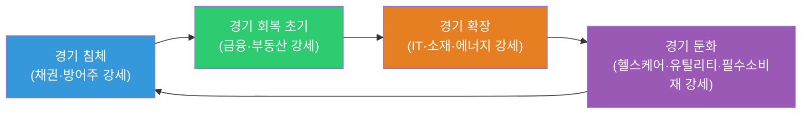
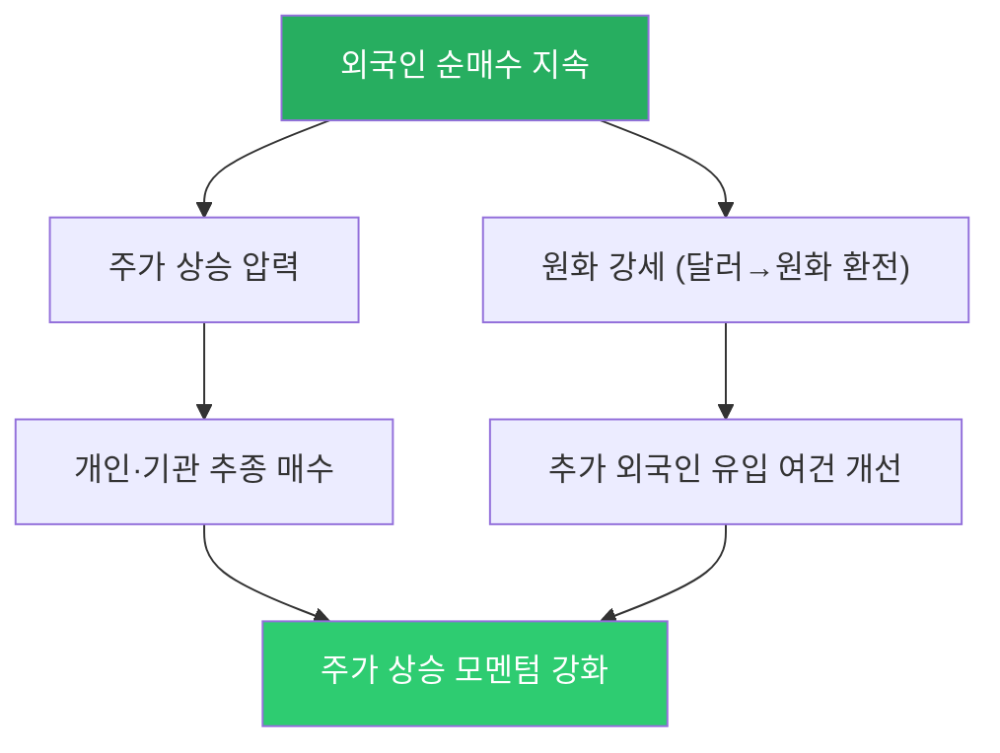
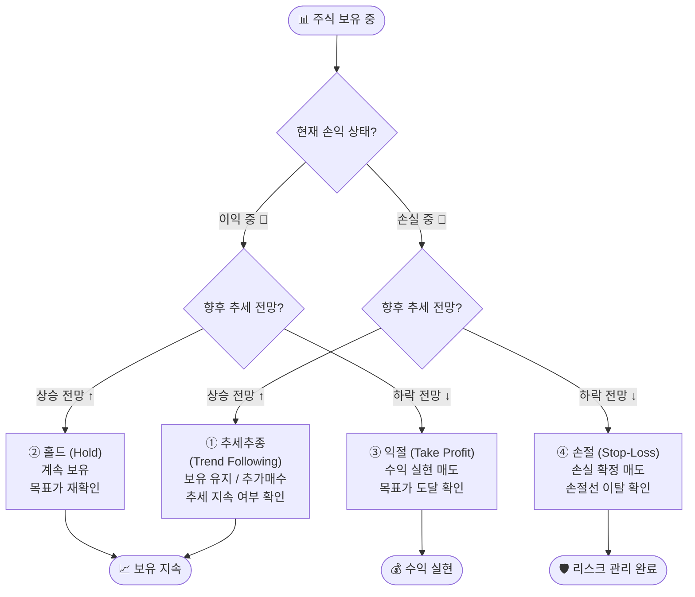

# 1단원. 기초 용어와 금융상품 이해


---

# 주식 학습 단어장

영문 약어는 처음에 어렵게 느껴질 수 있어요. 아래처럼 **영어 전체 이름 → 우리말 뜻 → 쉬운 설명** 순서로 보면 돼요.

> 이 문서는 공부를 돕기 위한 용어 설명이에요. 특정 종목을 사거나 팔라는 뜻이 아니며, 세금·거래 시간·주문 가능 여부는 시장과 증권사에 따라 달라질 수 있어요.

## 처음에 잡아둘 말: 한자·영어·말의 구조

한자는 억지로 외우기보다 글자 뜻을 나누어 보면 기억하기 쉬워요. 영어도 긴 단어를 통째로 외우기보다 `share(몫) + holder(가진 사람)`처럼 나누어 보세요. 아래의 ‘말의 구조’는 역사 사전식 어원보다는, **지금의 단어가 무엇을 가리키는지** 이해하기 위한 풀이예요.

| 말 | 한자·영어 | 말의 구조 | 초보자용 뜻·예시 |
| --- | --- | --- | --- |
| 주식 | 株式 / Stock, Share | `株`는 나뭇가지의 밑동에서 나온 글자로, 상거래에서는 회사 지분의 한 단위를 뜻해요. `式`은 일정한 형식·단위라는 뜻이에요. 영어 `share`는 ‘나눈 몫’이에요. | 회사의 작은 지분이에요. 예를 들어 발행주식 100주 중 1주를 가지면, 그 회사 지분의 1/100을 가진 셈이에요. 가격이 항상 회사의 실제 가치와 같지는 않아요. |
| 주주 | 株主 / Shareholder | `主`는 주인이고, `shareholder`는 ‘지분을 가진 사람’이에요. | 주식을 가진 사람이에요. 보통주는 주주총회 의결권과 배당을 받을 권리가 있을 수 있어요. |
| 증권 | 證券 / Security | `證`은 증명, `券`은 권리를 적은 문서예요. 영어 `security`는 금융상품을 넓게 부르는 말이에요. | 주식·채권·ETF처럼 재산상 권리를 나타내는 금융상품이에요. 오늘날에는 종이 증서 대신 전산으로 기록되는 경우가 일반적이에요. |
| 매수 | 買收 / Buy | `買`는 사다, `收`는 거두다예요. | 주식을 사서 내 계좌에 담는 일이에요. 1주를 얼마에 살지와 몇 주를 살지를 함께 정해요. |
| 매도 | 賣渡 / Sell | `賣`는 팔다, `渡`는 건네다예요. | 주식을 팔아 다른 사람에게 넘기는 일이에요. 팔았다고 해서 바로 출금 가능한 현금이 되는지는 결제일을 확인해야 해요. |
| 호가 | 呼價 / Quote, Bid, Ask | `呼`는 부르다, `價`는 값이에요. 영어 `quote`도 제시한 가격이라는 뜻이에요. | “10,000원에 사겠습니다/팔겠습니다”라고 제시한 주문 가격이에요. 사겠다는 가격은 `bid`, 팔겠다는 가격은 `ask`라고도 해요. 호가는 체결가와 다를 수 있어요. |
| 체결 | 締結 / Execution, Fill | `締`는 묶다, `結`은 맺다예요. | 매수 주문과 매도 주문의 가격·수량이 맞아 실제 거래가 성립한 상태예요. 주문을 냈다고 즉시 전부 체결되는 것은 아니에요. |
| 시가총액 | 時價總額 / Market Capitalization | `時價`는 그때의 시장 가격, `總額`은 모두 합친 금액이에요. `market cap`은 capitalization의 줄임말이에요. | **현재 주가 × 발행주식 수**예요. 주가가 1만원이어도 주식 수가 많으면 시가총액은 클 수 있어, 주가만으로 회사 크기를 비교하면 안 돼요. |
| 배당 | 配當 / Dividend | `配`는 나누어 주다, `當`은 몫에 해당한다는 뜻이에요. `dividend`는 ‘나누어 줄 것’이라는 뜻에서 왔어요. | 회사가 정한 절차에 따라 이익 등 재원을 주주에게 나누는 돈이에요. 배당은 확정 전까지 보장되지 않으며, 배당금만 보고 회사를 판단하면 안 돼요. |
| 자사주·자기주식 | Treasury Stock | 회사가 이미 발행한 자기 회사 주식을 다시 사서 보유한 것이에요. 매입한 뒤 보유·처분·소각할 수 있으므로, ‘자사주 매입’만 보고 발행주식 수가 영구히 줄었다고 보면 안 돼요. |
| 자사주 소각 | Treasury Stock Cancellation | 회사가 보유한 자기주식을 없애 발행주식 수를 줄이는 일이에요. 같은 이익이라면 EPS가 높아질 수 있지만, 사업 이익이나 회사 가치가 자동으로 늘지는 않아요. |
| 수익률 | 收益率 / Rate of Return | `收益`은 얻은 이익, `率`은 비율이에요. | 보통 `(현재 평가액 - 투자 원금 + 받은 현금) ÷ 투자 원금`처럼 계산해요. 계산 기간, 세금·수수료 포함 여부에 따라 숫자가 달라질 수 있어요. |
| 손익 | 損益 / Profit and Loss, P&L | `損`은 잃음, `益`은 남음이에요. P&L은 `Profit and Loss`의 줄임말이에요. | 계좌 화면의 손익은 가격이 바뀌면 계속 달라질 수 있어요. 실제로 팔기 전의 손익은 보통 **평가손익**, 팔아 확정된 것은 **실현손익**이라고 해요. |
| 예수금 | 預受金 / Cash Balance | `預`는 맡기다, `受`는 받다, `金`은 돈이에요. | 증권계좌에 들어 있는 현금성 잔액이에요. 주문 가능 금액·미수 사용 여부·결제 전 거래에 따라 실제 출금 가능 금액과 다를 수 있어요. |

### 숫자를 읽는 최소 공식

| 보고 싶은 것 | 가장 단순한 계산 | 읽을 때 주의할 점 |
| --- | --- | --- |
| 시가총액 | 주가 × 발행주식 수 | 유상증자·자사주 소각 등으로 주식 수가 바뀔 수 있어요. |
| 주당순이익(EPS) | 보통주주 귀속 순이익 ÷ 가중평균 유통보통주식 수 | 일회성 이익인지, 기본 EPS인지 희석 EPS인지, 주식 수가 바뀌었는지도 확인해요. |
| 주가수익비율(PER) | 주가 ÷ EPS | 이익이 작거나 적자면 숫자가 매우 크거나 의미가 약해질 수 있어요. 같은 업종·비슷한 성장성을 함께 비교해요. |
| 자기자본이익률(ROE) | 당기순이익 ÷ 평균 자기자본 | 주주 자본으로 이익을 내는 효율을 봐요. 부채 증가나 자사주 매입으로 자기자본이 줄어도 높아질 수 있으므로 원인을 확인해야 해요. |
| 주가순자산비율(PBR) | 주가 ÷ 주당순자산(BPS) | 자산의 장부가가 현재 가치와 다를 수 있어요. PBR이 낮다고 자동으로 ‘싼 주식’은 아니에요. |
| 배당수익률 | 1주당 연간 배당금 ÷ 현재 주가 | 과거 배당을 기준으로 한 수치일 수 있어요. 앞으로의 배당금은 달라질 수 있어요. |

| 용어 | 영어 전체 이름 | 뜻 풀이 |
| --- | --- | --- |
| AI | Artificial Intelligence | 인공지능이에요. 사람처럼 글·그림·자료를 다루도록 만든 기술을 말해요. |
| DART | Data Analysis, Retrieval and Transfer System | 전자공시시스템이에요. 회사가 알려야 하는 중요한 자료를 찾아보는 곳이에요. |
| ESG | Environment, Social, Governance | 환경·사회·지배구조예요. 회사가 오래 건강하게 운영될 수 있는지 살피는 관점이에요. |
| GDP | Gross Domestic Product | 국내총생산이에요. 한 나라 안에서 만든 물건과 서비스의 값어치를 더한 숫자예요. |
| ETF | Exchange Traded Fund | 거래소에서 사고파는 펀드예요. 여러 주식이나 채권 등을 한 바구니에 담을 수 있어요. |
| 패시브 ETF | Passive ETF / Index ETF | 특정 지수와 비슷한 수익률을 내는 것을 목표로 운용하는 ETF예요. 지수를 따라도 시장·산업 위험은 그대로 있으며, 보수·추적오차를 확인해야 해요. |
| 액티브 ETF | Active ETF | 운용사가 종목·비중을 조절해 비교지수 초과 성과 또는 정한 투자 목표를 추구하는 ETF예요. 운용 판단이 성과에 영향을 주며, 높은 보수가 항상 더 좋은 성과를 뜻하지는 않아요. |
| 알파(α) | Alpha / Jensen’s Alpha | 감수한 시장 위험을 반영하고도 남은 초과수익을 뜻해요. 회귀식의 상수항 α에서 온 말이며, 단순히 지수보다 더 오른 수익과는 다를 수 있어요. 벤치마크·기간·비용·위험 모형에 따라 값이 달라져요. |
| 베타(β) | Beta | 시장 움직임에 대한 민감도를 나타내는 값이에요. 베타가 1보다 크면 시장 변동에 더 크게 움직일 수 있고, 알파를 계산할 때 감수한 시장 위험을 조정하는 데 써요. |
| 티커 | Ticker Symbol | 거래 화면에서 종목을 찾는 짧은 이름표예요. 한국은 보통 여섯 자리 숫자 종목코드, 미국은 알파벳 기호를 많이 써요. |
| 이동평균선 | Moving Average, MA | 일정 기간의 종가를 평균 내어 이은 선이에요. 짧은 가격 흔들림을 줄여 큰 흐름을 보는 데 쓰지만 미래 가격을 보장하지는 않아요. |
| 운용보수 | Management Fee | 펀드나 ETF를 운영하는 대가로 보유 기간에 드는 비용이에요. 보통 연간 비율로 표시되고, 오래 보유할수록 차이가 쌓일 수 있어요. |
| 총보수 | Total Expense Ratio | 운용·판매 등 펀드를 보유하면서 드는 비용을 합친 비율이에요. 상품별 포함 항목은 설명서를 확인해야 해요. |
| 순자산가치 | Net Asset Value, NAV | ETF가 실제로 담은 자산을 현재 가격으로 계산한 값이에요. 거래소 가격과 조금 다를 수 있어요. |
| 괴리율 | Premium/Discount | ETF의 거래소 가격이 순자산가치와 얼마나 차이 나는지 나타내는 비율이에요. |
| 추적오차 | Tracking Error | ETF의 수익률이 따라가려는 지수의 수익률과 얼마나 달랐는지 나타내는 정도예요. |
| IPO | Initial Public Offering | 기업공개예요. 회사가 처음으로 많은 사람에게 주식을 팔고 시장에서 거래되기 시작하는 과정이에요. |
| 공모가 | Offering Price | IPO나 유상증자 등에서 투자자에게 주식을 팔기 위해 정한 1주당 가격이에요. IPO에서는 일반 청약의 기준 가격이지만, 상장일 시초가·종가나 이후 주가를 보장하지는 않아요. |
| PER | Price Earnings Ratio | **PER(Price Earnings Ratio, 주가수익비율)**: 회사 이익과 주가를 비교합니다. |
| PBR | Price to Book Ratio | **PBR(Price to Book Ratio, 주가순자산비율)**: 회사가 가진 순재산과 주가를 비교합니다. |
| EPS | Earnings Per Share | 주당순이익이에요. 보통주주 귀속 순이익을 가중평균 유통보통주식 수로 나눈 값이며, 기본 EPS와 희석 EPS를 구분해 볼 수 있어요. |
| DPS | Dividend Per Share | 주당배당금이에요. 주식 한 장당 나눠 주는 배당금이에요. |
| 배당성향 | Dividend Payout Ratio | 회사가 번 이익 가운데 얼마를 배당으로 나눴는지 보는 비율이에요. 보통 `총 배당금 ÷ 당기순이익`으로 계산하며, 이익의 지속성·현금흐름·투자 부담도 함께 봐야 해요. |
| DCF | Discounted Cash Flow | 현금흐름 할인법이에요. 미래에 벌 돈을 오늘의 값으로 조심스럽게 바꾸어 보는 방법이에요. |
| WACC | Weighted Average Cost of Capital | 가중평균자본비용이에요. 회사가 부채와 주주 자본을 조달해 쓰는 평균 비용률로, DCF에서 미래 현금을 현재가치로 바꾸는 할인율의 한 가지 기준으로 쓰여요. |
| ERP | Equity Risk Premium | 주식위험프리미엄이에요. 시장 전체 주식에 투자할 때 투자자가 무위험수익률보다 추가로 요구하는 기대수익률을 뜻하며, CAPM에서 주식자본비용을 추정하는 입력값이에요. |
| CAPM | Capital Asset Pricing Model | 자본자산가격결정모형이에요. 무위험수익률에 베타와 주식위험프리미엄을 반영해 주식자본비용을 추정하는 대표적인 모델이에요. |
| 베타 | Beta | 시장 움직임에 대한 개별 주식·기업 수익률의 민감도를 나타내는 추정치예요. CAPM에서 체계적 위험을 반영하는 데 사용해요. |
| 어닝 서프라이즈 | Earnings Surprise | 실제 매출이나 이익이 시장의 예상보다 좋게 나온 경우예요. 이익이 났다는 사실만으로는 서프라이즈인지 알 수 없어요. |
| 어닝 쇼크 | Earnings Miss / Earnings Shock | 실제 매출이나 이익이 시장의 예상보다 나쁘게 나온 경우예요. 적자가 아니어도 기대에 못 미치면 이렇게 부를 수 있어요. |
| 컨센서스 | Consensus Estimate | 여러 증권사 분석가의 실적 예상치를 모은 평균 또는 범위예요. 회사의 약속이나 공식 정답은 아니에요. |
| 가이던스 | Guidance | 회사 경영진이 앞으로의 매출·이익·비용·판매량·투자 등을 예상해 내놓는 전망 또는 범위예요. 컨센서스는 분석가들의 예상이라는 점이 다르며, 가이던스는 전제 조건이 바뀌면 실제 결과와 달라질 수 있어요. |
| YoY | Year over Year | 작년 같은 기간과 비교한 변화예요. ‘전년 동기 대비’라고도 해요. |
| QoQ | Quarter over Quarter | 바로 앞 분기와 비교한 변화예요. ‘전 분기 대비’라고도 해요. |
| RSI | Relative Strength Index | 상대강도지수예요. 최근 가격이 얼마나 빠르게 올랐거나 내렸는지 살펴보는 보조 지표예요. |
| MACD | Moving Average Convergence Divergence | 이동평균 수렴·확산 지표예요. 서로 다른 기간의 평균 가격 차이로 흐름 변화를 살펴봐요. |
| FOMO | Fear Of Missing Out | 좋은 기회를 놓칠까 봐 불안해 남을 따라가고 싶어지는 마음이에요. |
| M1 | Narrow Money | 협의통화예요. 현금과 바로 쓸 수 있는 예금처럼, 좁은 범위의 돈을 나타내요. |
| M2 | Broad Money | 광의통화예요. M1보다 넓은 범위의 돈으로, 비교적 쉽게 현금으로 바꿀 수 있는 금융상품도 포함해요. |
| MPT | Modern Portfolio Theory | 현대 포트폴리오 이론이에요. 서로 다르게 움직이는 자산을 나누어 담아 전체 위험을 줄이려는 생각이에요. |
| Leverage | Leverage | 지수의 움직임을 더 크게 따르도록 설계한 방식을 말해요. 손실도 더 커질 수 있어요. |
| Inverse | Inverse | 지수가 내려갈 때 오르도록, 지수와 반대 방향을 목표로 설계한 방식을 말해요. |
| HTS | Home Trading System | 컴퓨터에 설치해 쓰는 주식 거래 프로그램이에요. 큰 화면에서 여러 정보를 함께 보기 좋아요. |
| MTS | Mobile Trading System | 스마트폰으로 쓰는 주식 거래 앱이에요. 편리하지만 주문 전 종목·가격·수량을 더 꼼꼼히 확인해야 해요. |
| WTS | Web Trading System | 웹브라우저에서 접속해 쓰는 주식 거래 화면이에요. 이용 가능한 기능은 증권사마다 다를 수 있어요. |
| HBM | High Bandwidth Memory | 고대역폭 메모리예요. 많은 데이터를 빠르게 주고받도록 만든 메모리로, 인공지능 서버 등에서 중요하게 쓰일 수 있어요. |
| CPU | Central Processing Unit | 컴퓨터의 범용 중심 처리장치예요. 운영체제·입출력·서버 관리와 여러 종류의 작업을 조율하고, AI 서버에서는 GPU·TPU 같은 가속기도 제어해요. |
| GPU | Graphics Processing Unit | 많은 계산을 동시에 처리하도록 설계된 병렬 가속기예요. 그래픽뿐 아니라 대규모 AI 학습·추론과 과학 계산에 널리 쓰여요. |
| TPU | Tensor Processing Unit | Google이 개발한 AI 계산용 전용 가속기예요. 특정 AI 행렬 계산을 효율적으로 처리하도록 설계됐으며, 넓게는 맞춤형 AI ASIC의 한 사례로 볼 수 있어요. |
| 수출 통제 | Export Controls | 국가 안보·외교 등을 이유로 특정 국가·기업·용도에 기술·장비·반도체 등을 수출할 때 허가나 제한을 두는 제도예요. 규정의 대상·예외·시행일에 따라 기업 매출과 공급망 영향이 달라질 수 있어요. |
| 기술 자립 | Technology Self-reliance | 외부 공급에 덜 의존하도록 자국의 반도체·소프트웨어·장비 등을 개발·생산하려는 전략이에요. 투자 확대 기회가 될 수 있지만 기존 공급사에는 경쟁·가격 압박이 될 수도 있어요. |
| GW·MW | Gigawatt·Megawatt | 데이터센터가 한순간에 공급받거나 쓸 수 있는 전력 용량의 단위예요. `1GW = 1,000MW`이며, 서버 대수나 실제 전력 사용량 자체를 뜻하지는 않아요. |
| GWh·TWh | Gigawatt-hour·Terawatt-hour | 일정 시간 동안 실제로 쓴 전기 에너지의 단위예요. 1GW를 한 시간 쓰면 1GWh예요. |
| PUE | Power Usage Effectiveness | 데이터센터 전체 전력 사용량을 서버·네트워크 같은 IT 장비 전력 사용량으로 나눈 값이에요. 1에 가까울수록 냉각·전력 변환 등에 드는 추가 전력이 적다는 뜻이에요. |
| CXMT | ChangXin Memory Technologies | 중국의 DRAM 제조사예요. DDR5·LPDDR5/5X 같은 메모리 제품을 개발·생산하며, 범용 DRAM 시장에서는 한국 메모리 기업의 경쟁 변수로 볼 수 있어요. |
| 소부장 | 소재·부품·장비 | 반도체 공장과 제품에 필요한 재료, 부품, 생산 장비를 줄여 부르는 말이에요. 고객사의 공장 투자와 주문에 영향을 받을 수 있어요. |
| 엣지 AI | Edge AI | 멀리 있는 데이터센터만 쓰지 않고 스마트폰·PC·자동차 같은 기기 가까이에서 AI 계산을 처리하는 방식이에요. |
| NPU | Neural Processing Unit | AI 계산을 효율적으로 처리하도록 만든 반도체 처리 장치예요. AI PC나 AI 스마트폰에 들어갈 수 있어요. |
| 첨단 패키징 | Advanced Packaging | 여러 반도체를 가까이 연결해 성능과 데이터 전송 속도를 높이는 조립·포장 기술이에요. AI 가속기와 HBM을 함께 연결할 때 중요할 수 있어요. |

## 함께 알아두면 좋은 우리말

| 말 | 영어·한자 | 쉬운 뜻 |
| --- | --- | --- |
| 주식 | Stock, Share / 株式 | 회사의 작은 주인표예요. |
| 주주 | Shareholder / 株主 | 주식을 가진 사람이에요. |
| 보통주·우선주 | Common Stock·Preferred Stock | 보통주는 보통의 의결권·배당 권리를 가진 주식이에요. 우선주는 보통주보다 배당이나 남은 재산을 먼저 받을 조건이 붙을 수 있지만, 의결권 등 조건이 다를 수 있어요. 이름만 보고 고르지 말고 발행 조건을 확인해요. |
| 발행주식 수 | Shares Outstanding | 회사가 발행해 존재하는 주식 수예요. 주가와 곱하면 시가총액이 돼요. 회사가 새 주식을 발행하면 한 주가 차지하는 지분 비율이 달라질 수 있어요. |
| 시가총액 | Market Capitalization, Market Cap | 현재 주가에 발행주식 수를 곱한 회사의 시장가치예요. 주당 가격이 낮다고 작은 회사, 높다고 큰 회사인 것은 아니에요. |
| 지수 | Index | 여러 종목의 가격 움직임을 일정한 규칙으로 묶어 보여 주는 숫자예요. 코스피·코스닥·S&P 500 등이 대표적인 지수예요. 지수가 올라도 모든 구성 종목이 오른 것은 아니에요. |
| 펀드 | Fund | 여러 투자자의 돈을 모아 정한 규칙에 따라 주식·채권 등에 투자하는 상품이에요. ETF는 거래소에서 주식처럼 사고팔 수 있는 펀드의 한 형태예요. |
| 원금 | Principal | 처음 투자하거나 빌린 기준 금액이에요. 투자에서는 원금 손실 가능성이 있어요. |
| 평가금액·평가손익 | Market Value·Unrealized Gain/Loss | 지금 가격으로 팔았다고 가정해 계산한 금액과 손익이에요. 아직 팔지 않았다면 가격 변동에 따라 바뀔 수 있어요. |
| 실현손익 | Realized Gain/Loss | 실제로 팔아 거래가 확정되며 계산된 손익이에요. 세금·수수료를 포함한 표시 기준은 증권사 화면을 확인해요. |
| 배당 | Dividend / 配當 | 회사가 이익 일부를 주주에게 나누는 돈이에요. |
| 배당수익률 | Dividend Yield | 현재 주가와 비교해 1년 배당금이 어느 정도인지 보는 비율이에요. 과거 또는 예상 배당을 기준으로 할 수 있으며, 높은 수치가 미래 배당을 보장하지는 않아요. |
| 매출 | Revenue / 賣出 | 물건이나 서비스를 팔아 들어온 돈이에요. |
| 이익 | Profit / 利益 | 번 돈에서 쓴 돈을 뺀 뒤 남은 돈이에요. 어떤 이익인지 알기 위해 영업이익·순이익을 구분해 봐요. |
| 영업이익 | Operating Profit | 본업에서 번 돈에서 본업 운영비를 뺀 이익이에요. 이자·세금·일회성 손익의 영향 전이라 회사의 본업을 볼 때 자주 써요. |
| 순이익·당기순이익 | Net Income | 매출에서 비용, 이자, 세금 등을 반영하고 남은 이익이에요. 일회성 이익·손실 때문에 한 기간의 숫자만으로 판단하지 않아요. |
| 이익률 | Profit Margin | 매출 가운데 이익으로 남은 비율이에요. 예를 들어 매출 100원, 영업이익 10원이면 영업이익률은 10%예요. |
| 자산 | Assets / 資産 | 회사나 사람이 가진 돈·건물·물건 같은 것이에요. |
| 부채 | Liabilities, Debt / 負債 | 나중에 갚아야 하는 빚이에요. |
| 자본·순자산 | Equity·Net Assets | 자산에서 부채를 뺀, 주주 몫에 가까운 금액이에요. `자산 = 부채 + 자본`은 재무상태표의 기본 관계예요. |
| 재무제표 | Financial Statements | 회사의 성적표예요. 재무상태표(어떤 것을 가졌고 빚이 얼마나 있는지), 손익계산서(얼마를 벌고 썼는지), 현금흐름표(현금이 실제로 어떻게 움직였는지)를 함께 봐요. |
| 공시 | Disclosure / 公示 | 회사가 중요한 소식을 정해진 방법으로 알리는 일이에요. |
| 투자설명서 | Prospectus | 상품의 목표, 편입 자산, 보수, 위험, 환매·거래 방법 등을 설명한 공식 문서예요. ETF·펀드는 이름보다 이 문서와 상품 정보를 먼저 확인하는 습관이 좋아요. |
| 채권 | Bond / 債券 | 돈을 빌려주고 나중에 돌려받기로 한 약속과 비슷한 상품이에요. |
| 금리 | Interest Rate / 金利 | 돈을 빌리거나 맡길 때 붙는 돈의 비율이에요. |
| 기준금리 | Policy Rate | 중앙은행이 금융기관과 거래할 때 기준으로 삼는 금리예요. 대출·예금 금리와 주식 가치에 영향을 줄 수 있지만, 한 방향으로 즉시 움직인다고 단정할 수는 없어요. |
| 물가 | Prices / 物價 | 물건과 서비스의 평균 가격이에요. |
| 인플레이션 | Inflation | 물가가 전반적으로 계속 오르며 돈의 구매력이 낮아지는 현상이에요. ‘개별 상품 하나의 가격 상승’과는 구분해요. |
| 환율 | Exchange Rate / 換率 | 나라 사이 돈을 바꾸는 비율이에요. |
| 환차익·환차손 | Foreign-exchange Gain/Loss | 해외 자산을 원화로 바꿔 볼 때 환율 변화로 생기는 이익·손실이에요. 해외 주식 수익률은 주가 변화와 환율 변화가 함께 반영돼요. |
| 환헤지 | Currency Hedge | 환율 변동 영향을 줄이려는 장치예요. 환율 위험을 줄일 수 있지만, 비용이 들거나 환율 상승 때의 이익도 줄어들 수 있어요. |
| 분산투자 | Diversification / 分散投資 | 위험을 줄이기 위해 여러 곳에 나누어 담는 일이에요. |
| 리밸런싱 | Rebalancing | 달라진 투자 비율을 처음 계획에 맞게 다시 조절하는 일이에요. |
| 연기금 | Pension Fund | 국민의 노후를 위해 모은 연금 자금을 장기간 운용하는 기금 또는 기관이에요. 주식·채권 등 여러 자산에 투자할 수 있으며, 순매수만으로 시장 방향을 알 수는 없어요. |
| 공적연금 | Public Pension Fund | 국민이 낸 보험료 등을 바탕으로 미래의 연금 지급을 준비하는 공공 성격의 연금기금이에요. 장기 투자자이지만, 자산배분·연금 지급·리밸런싱 때문에 매매가 기업 전망만을 뜻하지는 않아요. |
| 국부펀드 | Sovereign Wealth Fund | 국가가 외환보유액·자원 수입·재정 흑자 등을 장기 운용하는 투자기금이에요. 국가마다 목적과 구조가 달라 테마섹·GIC·노르웨이 GPFG를 같은 방식으로 해석하면 안 돼요. |
| 블랙록 | BlackRock | 고객 자금을 주식·채권·ETF 등으로 운용하는 글로벌 자산운용사예요. iShares ETF 브랜드를 운영하며, 블랙록의 거래는 지수 추종·ETF 자금 흐름·리밸런싱처럼 여러 이유에서 나올 수 있어요. |
| 산타 랠리 | Santa Claus Rally | 연말 마지막 5거래일과 새해 첫 2거래일에 주가가 오르는 경향을 가리키는 계절성 표현이에요. 매년 반복되는 규칙이나 매수 신호는 아니에요. |
| 추격매수 | Chasing a Rally | 주가가 빠르게 오른 뒤 더 오를 것 같다는 조급함으로 뒤늦게 사는 행동이에요. 가격 상승 이유와 위험을 확인하지 않으면 높은 가격에 살 위험이 커질 수 있어요. |
| 모멘텀 | Momentum | 최근 오르던(또는 내리던) 가격 흐름이 당분간 이어질 수 있다는 힘을 뜻해요. 모멘텀이 강하다고 계속 오른다는 보장은 없고, 이미 많이 오른 만큼 되돌림 위험도 커질 수 있어요. |
| 모멘텀 캔들 | Momentum Candle | 한 방향으로 평소보다 강하게 움직인 긴 캔들이에요. 실습에서는 같은 시간 단위의 직전 캔들 **몸통**보다 2배 이상 긴 몸통을 후보로 볼 수 있어요. 꼬리를 포함한 전체 길이가 아니라 시가와 종가의 차이를 비교하며, 거래량·추세·뉴스를 함께 확인해야 해요. |
| 눌림·눌림목 | Pullback | 주가가 오른 뒤 잠시 내려오거나 옆으로 움직이며 쉬어 가는 구간을 말해요. 건강한 조정일 수도, 하락 추세의 시작일 수도 있으므로 ‘무조건 매수 기회’로 보면 안 돼요. |
| 업종 순환매·섹터 로테이션 | Sector Rotation | 한 업종을 사던 자금이 반도체에서 자동차·금융처럼 다른 업종으로 옮겨가며 시장의 관심이 번갈아 강해지는 현상이에요. 기존 주도 업종이 끝났다는 뜻은 아니며, 각 업종의 실적·밸류에이션을 함께 확인해야 해요. |
| 변동성 | Volatility / 變動性 | 가격이 크게 오르내리는 정도예요. |
| 캔들 차트 | Candlestick Chart | 시가·고가·저가·종가를 막대 모양으로 보여 주는 차트예요. 한 캔들은 일정 시간의 가격 움직임을 기록해요. |
| 양봉 | Bullish Candle / 陽線 | 종가가 시가보다 높은 캔들이에요. 그 시간 동안 가격이 시작보다 올라 마감했다는 뜻이지, 다음에도 오른다는 뜻은 아니에요. |
| 음봉 | Bearish Candle / 陰線 | 종가가 시가보다 낮은 캔들이에요. 그 시간 동안 가격이 시작보다 내려 마감했다는 뜻이지, 다음에도 내린다는 뜻은 아니에요. |
| 일봉·주봉·월봉·분봉 | Daily·Weekly·Monthly·Minute Chart | 캔들 하나가 각각 하루·한 주·한 달·몇 분의 가격 움직임을 뜻하는 차트예요. 시간 단위가 짧을수록 흔들림이 크게 보일 수 있어요. |
| 상승색·하락색 | Up Color·Down Color | 가격이 오른 캔들과 내린 캔들을 구별하는 화면 색이에요. 한국·일본은 보통 빨강/파랑, 중국은 빨강/초록, 미국은 초록/빨강을 많이 쓰지만 앱 설정에 따라 달라질 수 있어요. 색보다 시가와 종가를 확인해야 해요. |
| 도지 | Doji | 시가와 종가가 거의 같아 몸통이 매우 짧은 캔들 모양이에요. 매수와 매도의 힘이 비슷했을 가능성을 보여 줄 수 있지만 단독 신호는 아니에요. |
| 라운드 넘버 | Round Number | 10,000원·100,000원처럼 기억하기 쉬운 가격대예요. 주문과 심리가 모여 지지·저항처럼 보일 수 있지만, 반드시 가격이 멈추거나 반전한다는 뜻은 아니에요. |

## 주식 거래에서 쓰는 기본 용어

| 말 | 영어·한자 | 자세한 뜻 풀이 |
| --- | --- | --- |
| 매수 | Buy / 買收 | 주식을 사는 일이에요. ‘매수 가격’은 내가 산 가격을 뜻해요. |
| 매도 | Sell / 賣渡 | 주식을 파는 일이에요. 매도한 뒤에는 가격이 올라가도 그 주식의 주인이 아니에요. |
| 호가 | Quote / 呼價 | 사거나 팔고 싶은 가격을 제시하는 일이에요. 호가창에는 여러 사람의 주문이 모여 있어요. |
| 유동성공급자·LP | Liquidity Provider (LP) / 流動性供給者 | 거래가 뜸한 ETF·ETN·ELW 등에서 증권사가 거래소·발행사와 맺은 계약에 따라 매수·매도 호가를 꾸준히 내어, 사고팔 상대가 없어 거래가 끊기는 일을 막는 역할이에요. LP의 호가와 거래량은 시세를 맞히려는 예측이 아니라 의무에 따른 것이므로, LP 거래가 많다고 해서 그 종목이 오르거나 내린다는 신호로 읽으면 안 돼요. |
| 매수호가·매도호가 | Bid·Ask | 사겠다고 낸 가격과 팔겠다고 낸 가격이에요. 두 가격 차이가 크면 바로 거래할 때 불리할 수 있어요. |
| 스프레드 | Spread | 가장 낮은 매도호가와 가장 높은 매수호가의 차이예요. 예를 들어 9,900원에 사려는 주문과 10,000원에 팔려는 주문만 있으면 스프레드는 100원이에요. 스프레드가 넓거나 호가 잔량이 적으면 원하는 가격과 실제 체결 가격의 차이가 커질 수 있어요. |
| 지정가 주문 | Limit Order / 指定價注文 | 내가 정한 가격 또는 그보다 유리한 가격에서만 거래되도록 내는 주문이에요. 원하는 가격에 거래되지 않을 수 있어요. |
| 시장가 주문 | Market Order / 市場價注文 | 가격보다 빠른 거래를 우선하는 주문이에요. 거래량이 적으면 예상보다 불리한 가격에 체결될 수 있어요. |
| 조건부 지정가·최유리 지정가 | Conditional Limit·Best Limit Order | 증권사 화면에서 제공하는 주문 조건의 예예요. 조건부 지정가는 정규장에 체결되지 않은 물량을 장 마감 무렵 시장가로 바꾸는 방식으로 제공될 수 있고, 최유리 지정가는 당시 가장 유리한 반대편 호가에 맞춰 주문을 내는 방식이에요. **이름·작동 방식은 시장과 증권사마다 다르므로 주문 화면의 설명을 확인**해요. |
| 시간외거래 | After-hours Trading | 정규장이 아닌 시간에 하는 주식 거래예요. 한국 주식에는 종가로 거래하는 시간외 종가매매와 10분 단위로 가격을 정하는 시간외 단일가매매 등이 있어요. |
| 시간외 종가매매 | After-hours Closing-price Trading | 장전에는 전일 종가, 장후에는 당일 종가로 거래하는 방식이에요. 정해진 가격으로만 거래되며 먼저 낸 주문부터 체결돼요. |
| 시간외 단일가매매 | After-hours Periodic Call Auction | 장후에 종가의 일정 범위 안에서 지정가 주문을 모아 10분 단위로 한 가격에 체결하는 방식이에요. |
| 체결 | Execution, Fill / 締結 | 사려는 주문과 팔려는 주문의 가격·수량이 맞아 실제 거래가 이루어진 상태예요. |
| 미체결 | Unfilled Order | 주문은 냈지만 아직 거래 상대가 맞지 않아 끝나지 않은 상태예요. |
| 부분체결 | Partial Fill | 낸 주문 수량 중 일부만 먼저 거래된 상태예요. 예를 들어 10주 매수 주문 중 3주만 체결되면 7주는 미체결로 남을 수 있어요. |
| 정정·취소 | Amend·Cancel Order | 아직 체결되지 않은 주문의 가격·수량을 바꾸거나 없애는 일이에요. 이미 체결된 수량은 되돌아가지 않으며, 장 마감·주문 종류에 따라 정정·취소가 제한될 수 있어요. |
| 잔량 | Order Balance | 호가창에 남아 있는 주문 수량이에요. 잔량이 많다고 반드시 가격이 그 방향으로 움직이지는 않아요. |
| 거래량 | Trading Volume / 去來量 | 일정 기간에 실제로 사고팔린 주식 수예요. 관심이 커졌다는 힌트일 수 있지만, 매수와 매도가 모두 포함된 숫자예요. |
| 거래대금 | Trading Value | 거래량에 가격을 곱한, 실제로 오간 돈의 규모예요. 가격이 다른 종목끼리 관심도를 비교할 때 함께 봐요. |
| 시가·고가·저가·종가 | Open·High·Low·Close (OHLC) / 始價·高價·低價·終價 | 시가는 장 시작 가격, 고가·저가는 장중 최고·최저 가격, 종가는 장 마감 가격이에요. 한국 정규장의 시가·종가는 주문을 모아 정하므로 단순히 첫 거래·마지막 한 건의 거래 가격과 같다고 보면 안 돼요. 차트의 기본 재료예요. |
| 단일가 매매 | Call Auction | 일정 시간 주문을 모아 가장 많은 거래가 가능한 한 가격으로 함께 체결하는 방식이에요. 한국장에서는 보통 시가와 종가를 정할 때 사용해요. |
| 동시호가 | Call Auction Order Period | 시가·종가를 정하기 전에 주문을 모으는 시간이에요. 이름과 달리 한 번에 같은 가격으로 체결되도록 주문을 모으는 제도예요. |
| T+2 결제 | Trade Date Plus Two Business Days | 거래일(T) 뒤 두 번째 영업일에 돈과 주식을 최종 정산하는 방식이에요. 주말·휴장일은 세지 않아요. |
| 출금 가능 금액 | Available Withdrawal Balance | 계좌 밖 은행으로 실제로 옮길 수 있는 돈이에요. 예수금이나 주문 가능 금액과 다를 수 있어요. |
| 서머타임 | Daylight Saving Time | 여름철에 시계를 한 시간 앞당기는 제도예요. 미국장이 한국 시간으로 한 시간 일찍 열리고 닫히는 이유예요. |
| 상한가·하한가 | Upper·Lower Price Limit / 上限價·下限價 | 그 거래일에 허용되는 최고·최저 가격이에요. 보통주 등 한국거래소 대상 상품은 일반적으로 기준가격(대개 직전 거래일 종가)의 ±30% 범위지만, 호가 단위와 신규 상장·권리 변동·상품별 예외에 따라 실제 기준은 달라질 수 있어요. 상·하한가라고 해서 주문이 반드시 체결되는 것은 아니에요. |
| 공시 | Disclosure / 公示 | 회사가 투자자에게 알려야 할 중요한 일을 공식적으로 알리는 자료예요. 뉴스 제목보다 원문을 확인하는 편이 좋아요. |
| 유상증자 | Rights Offering, Paid-in Capital Increase / 有償增資 | 회사가 새 주식을 발행해 돈을 모으는 일이에요. 성장 투자에 쓸 수도 있지만 기존 주주의 지분 비율에 영향을 줄 수 있어요. |
| 무상증자 | Bonus Issue / 無償增資 | 회사의 자본 일부를 옮겨 기존 주주에게 새 주식을 나누어 주는 일이에요. 주식 수가 늘었다고 회사 가치가 저절로 커지는 것은 아니에요. |
| 액면분할 | Stock Split / 額面分割 | 주식 한 장을 여러 장으로 나누어 주식 수를 늘리는 일이에요. 가격이 낮아 보일 수 있지만 회사 전체 가치가 갑자기 늘지는 않아요. |
| 신용거래 | Margin Trading / 信用去來 | 증권사에서 돈을 빌려 주식을 사는 거래예요. 수익과 손실이 모두 커질 수 있고 이자가 붙을 수 있어요. |
| 미수거래 | Unpaid Balance Trading / 未收去來 | 정해진 짧은 기간 안에 돈을 채우기로 하고 주문하는 거래예요. 결제하지 못하면 강제 매도가 일어날 수 있어요. |
| 반대매매 | Forced Liquidation | 빌린 돈을 갚지 못하거나 조건을 지키지 못했을 때, 증권사가 보유 주식을 팔아 정산하는 일이에요. 내 의사와 다른 시점에 팔릴 수 있어요. |
| 포지션 | Position | 가격이 오르거나 내릴 때 내 손익이 어느 방향으로 움직이도록 만들어 둔 상태예요. 주식을 보유하면 보통 롱 포지션, 공매도하면 숏 포지션이라고 해요. |
| 롱 포지션 | Long Position | 가격이 오르면 이익이 나고 내리면 손실이 나는 매수 포지션이에요. 현물 주식에서는 보통 주식을 사서 보유한 상태를 말하며, ‘장기 투자’와 같은 뜻은 아니에요. |
| 숏 포지션 | Short Position | 가격이 내리면 이익이 나고 오르면 손실이 나는 매도 포지션이에요. 현물 주식에서는 보통 빌린 주식을 먼저 파는 공매도를 뜻하며, 가격 상승 폭에 따라 손실이 매우 커질 수 있어요. |
| 공매도 | Short Selling / 空賣渡 | 주식을 빌려 먼저 팔고 나중에 사서 갚는 거래예요. 가격이 오르면 손실이 커질 수 있어 구조를 충분히 이해해야 해요. |
| 배당락 | Ex-dividend / 配當落 | 배당을 받을 권리가 사라지는 기준일 이후의 거래를 말해요. 배당금만큼 공짜 이익이 생긴다는 뜻은 아니에요. |
| 기준일·권리 기준일 | Record Date | 배당·무상증자처럼 특정 권리를 받을 주주를 정하는 기준이 되는 날이에요. 실제 매수 마감일은 결제 주기와 시장 규정의 영향을 받으므로, 회사 공시의 권리 기준일·배당기준일 안내를 확인해요. |
| 양도소득세 | Capital Gains Tax / 讓渡所得稅 | 자산을 팔아 생긴 이익에 붙을 수 있는 세금이에요. 주식은 거래 장소·보유 규모·상품에 따라 과세 여부와 신고 방법이 달라질 수 있어요. |
| 증권거래세 | Securities Transaction Tax / 證券去來稅 | 주식을 팔 때 거래에 붙을 수 있는 세금이에요. 적용 범위와 세율은 시장·시기에 따라 달라질 수 있어요. |
| 배당소득세 | Dividend Income Tax / 配當所得稅 | 회사에서 받은 배당에 붙을 수 있는 세금이에요. 해외 배당은 현지 세금과 국내 세금을 함께 확인해야 할 수 있어요. |
| 감사 의견 | Audit Opinion / 監査意見 | 외부 감사인이 회사 재무제표를 검토한 결과예요. 평소와 다른 의견이나 중요한 주의 문구가 있다면 원문과 이유를 확인해요. |

## 시장을 부르는 줄임말과 투자 은어

아래 말은 공식 금융 용어가 아닌 경우가 많아요. 재미있는 줄임말일 뿐, 투자 판단의 근거로 쓰면 안 돼요.

| 말 | 사람들이 쓰는 뜻 | 주의할 점 |
| --- | --- | --- |
| 국장 | 국내 주식시장을 줄여 부르는 말이에요. | 국내 시장도 회사·산업별 차이가 크므로 한 덩어리로 판단하지 않아요. |
| 미장 | 미국 주식시장을 줄여 부르는 말이에요. | 환율, 거래 시간, 세금·수수료 등 국내 투자와 다른 점이 있어요. |
| 트럼프 타코·TACO 트레이드 | **Trump Always Chickens Out**의 머리글자예요. 2025년 미국 관세 정책처럼 강한 위협·발표 뒤 시장이 흔들리면, 결국 정책이 완화·연기돼 주가가 반등할 것이라고 기대하는 시장의 신조어예요. ‘chicken out’은 겁을 먹고 물러선다기보다 **막판에 입장을 거둔다**는 뉘앙스로 쓰여요. | 공식 투자 전략이나 예측 법칙이 아니에요. 정책이 실제 시행될 수 있고, 완화 여부·시점·영향은 매번 다릅니다. 급락 뒤 반등만 기대하기보다 발표 원문, 시행일, 협상 상황, 기업별 관세 비용을 확인해야 해요. |
| 하이퍼스케일러 | Hyperscaler | 아주 큰 데이터센터를 운영하며 클라우드·AI 서비스에 대규모로 투자하는 기업이에요. 투자 규모가 서버·AI 칩·메모리 수요에 영향을 줄 수 있어요. |
| ISP | Internet Service Provider | 가정·회사에 인터넷 회선을 연결하고 인터넷 접속을 제공하는 사업자예요. |
| IDC | Internet Data Center | 서버를 위한 공간, 전력, 냉각, 보안, 통신 연결을 제공·운영하는 데이터센터예요. |
| CSP | Cloud Service Provider | 서버·저장공간·AI 계산 기능을 인터넷으로 빌려 주는 클라우드 서비스 제공자예요. Azure, AWS, Google Cloud 등이 대표적이에요. |
| MSP | Managed Service Provider | 고객을 대신해 서버·네트워크·클라우드 환경을 운영·감시하고 장애 대응을 돕는 관리 서비스 제공자예요. |
| 설비투자·캐팩스 | Capital Expenditure, Capex | 공장, 서버, 장비처럼 여러 해 동안 쓸 자산을 사거나 만드는 데 쓰는 돈이에요. 처음에는 자산으로 잡히고, 사용 기간에 걸쳐 감가상각비가 비용으로 반영될 수 있어 이익과 현금흐름을 함께 봐야 해요. |
| 운영비·오펙스 | Operating Expenditure, Opex | 전기료, 급여, 임차료처럼 사업을 일상적으로 운영하며 드는 비용이에요. Capex처럼 오래 쓰는 자산을 만드는 투자와 구분해 봐요. |
| 감가상각 | Depreciation | 공장·장비·서버처럼 오래 쓰는 자산의 구매 비용을 사용 기간에 나누어 비용으로 기록하는 회계 처리예요. 구매 시점의 현금 지출과 그해 비용이 다를 수 있는 이유예요. |
| 업황 피크 | Cycle Peak | 산업의 이익과 수요가 가장 좋다고 기대되는 지점이에요. 피크 우려는 공급 과잉이나 기대 조정 가능성을 뜻할 수 있지만, 즉시 하락을 확정하지는 않아요. |
| 평균판매가격(ASP) | Average Selling Price | 특정 기간의 매출을 판매 수량으로 나누어 제품 하나를 평균 얼마에 팔았는지 보는 값입니다. 판매량이 같아도 ASP가 오르면 매출과 이익률이 개선될 수 있고, 내리면 악화될 수 있습니다. 반도체에서는 고가 제품 비중, 재고, 수요·공급, 할인·계약가격을 함께 확인합니다. |
| 개미 | 개인 투자자를 가볍게 부르는 말이에요. | 개인이라는 이유만으로 정보나 판단이 같지 않아요. |
| 동학개미·서학개미 | 각각 국내 주식, 해외 주식에 적극 투자하는 개인을 가리키는 표현이에요. | 유행을 따라가기보다 상품과 위험을 따로 확인해야 해요. |
| 주린·주린이 | 주식과 어린이를 합친 말로, 주식 초보자를 뜻해요. ‘주린’은 ‘주린이’를 더 짧게 부르는 표현이에요. | 모르는 것은 부끄러운 일이 아니며 작은 금액·공부부터 시작하는 편이 좋아요. |
| 손절 | 손실이 난 상태에서 팔아 손실을 확정하는 일이에요. | 감정으로 급히 팔기보다, 처음 세운 이유가 바뀌었는지 점검해요. |
| 익절 | 이익이 난 상태에서 팔아 이익을 확정하는 일이에요. | 이익이 났다는 사실만으로 매도 시점이 자동으로 정해지지는 않아요. |
| 본절 | 이익도 손실도 거의 없는 가격에 정리하는 일을 말해요. | 처음 산 가격만 붙잡으면 현재 회사 가치 판단을 놓칠 수 있어요. |
| 존버 | ‘매우 오래 버틴다’는 뜻으로 쓰는 인터넷 은어예요. | 계획적인 장기 보유와 이유 없는 방치는 달라요. 사업이 나빠졌다면 다시 확인해야 해요. |
| 텐베거 | Ten-bagger | 처음 투자한 돈의 가치가 10배가 된 종목이나 투자를 가리키는 말이에요. 1만 원이 10만 원이 되면 900% 수익이며, 과거 결과를 묘사하는 표현일 뿐 미래의 10배 상승을 보장하지 않아요. |
| 평단·평균 매수 단가 | Average Cost per Share | 같은 종목을 여러 번 샀을 때의 평균 매입 가격이에요. 보통 `총 매수금액 ÷ 총 보유 수량`으로 계산하며, 수수료·세금 포함 방식은 증권사 화면에 따라 다를 수 있어요. |
| 물타기 | 가격이 내린 뒤 추가 매수해 평균 매수 가격을 낮추려는 행동이에요. | 잘못된 판단의 금액만 키울 수 있으므로 자금 한도와 근거가 필요해요. |
| 불타기 | 가격이 오른 뒤 더 사서 보유 비중을 키우는 행동이에요. | 오를수록 위험도 함께 커질 수 있어요. 가격만 보고 따라가면 안 돼요. |
| 상따 | 가격이 크게 오른 종목을 따라 사는 행동을 줄여 부르는 말이에요. | 변동성이 큰 상황에서 높은 가격에 살 위험이 있어요. |
| 하따 | 가격이 크게 내린 종목을 싸다고 생각해 사는 행동을 줄여 부르는 말이에요. | 하락 원인을 확인하지 않으면 계속 내리는 자산을 살 수 있어요. |
| 물림 | 산 뒤 가격이 내려가 팔지 못하고 보유하게 된 상태를 말해요. | 손실을 인정하지 못해 한 종목에 돈이 묶일 수 있어요. |
| 뇌동매매 | 다른 사람의 말·급등락에 휩쓸려 근거 없이 사고파는 행동이에요. | 주문 전 이유, 금액, 최악의 경우를 적어 보는 습관이 도움이 돼요. |
| 고점·저점 | 일정 기간에서 높았던 가격과 낮았던 가격을 말해요. | 지나고 나서야 확실히 알 수 있는 경우가 많아, 맞히려 하기보다 위험을 관리해요. |
| 대장주 | 특정 산업이나 주제에서 규모·관심이 가장 큰 대표 종목을 부르는 말이에요. | 대표라는 이유만으로 실적과 가격이 항상 좋은 것은 아니에요. |
| 테마주 | 특정 뉴스·정책·유행과 연결되어 함께 움직인다고 여겨지는 종목이에요. | 실제 사업보다 기대나 소문으로 급등락할 수 있어 특히 조심해야 해요. |
| 작전주 | 누군가가 가격이나 거래량을 인위적으로 움직인다는 의심을 받는 종목을 부르는 말이에요. | 불공정거래 가능성이 있는 위험한 표현이므로 소문만 듣고 접근하지 않아요. |
| 자전거래 | 실질적으로 같은 투자자 또는 연결된 주체가 매수·매도 양쪽에 관여하는 거래를 말해요. *wash trade*라고도 해요. | 거래량·호가만으로는 자전거래나 위법 여부를 확정할 수 없어요. 거래가 성황인 것처럼 오인시키려는 목적 등이 있으면 시세조종·부정거래 규제 대상이 될 수 있으므로, 투자자는 공시와 실제 사업 내용을 먼저 확인해요. |
| 외국인·기타외국인·외국인계 | KRX 투자자 통계에서 외국인은 외국인투자등록 ID가 있는 외국인, 기타외국인은 그 분류에 들지 않는 외국인이에요. 외국인계는 둘의 합계예요. | 기타외국인이 외국인 개인·단기 매매만을 뜻하지는 않아요. 앱 화면이 ‘외국인’만 표시하는지 ‘외국인계’를 표시하는지 확인하고, 한 항목의 하루 순매수만으로 매매하지 않아요. |
| 프랍트레이더 | Prop Trader / Proprietary Trader. 고객 돈이 아니라 회사의 자기자본을 운용해 매매 손익을 내는 트레이더예요. | PB·IB·리서치 애널리스트와 달리 직접 매매와 위험 관리가 중심이에요. 개인 대상 프랍펌 평가는 실제 자금 운용 여부, 평가비, 손실·출금 규칙, 계약 조건을 반드시 확인해요. |
| 투신 | 투자신탁의 줄임말로, KRX 투자자별 거래실적에서는 자산운용회사와 투자회사의 매매를 가리켜요. | 펀드·ETF의 설정·환매, 지수 추종, 리밸런싱 거래가 섞일 수 있으므로 투신 순매수만으로 회사의 장기 전망을 단정하지 않아요. |
| 지분공시 | 상장사의 대량보유(5% 보고), 임원·주요주주의 특정증권등 소유·변동 등을 알리는 공시예요. | 보유 비율뿐 아니라 보고자·특별관계자, 보유 목적, 주요 계약, 작성기준일과 변동 사유를 함께 봐요. 5% 보유가 곧 경영권 인수나 주가 상승을 뜻하지는 않아요. |
| 동전주 | 주가가 매우 낮은 종목을 가볍게 부르는 말이에요. 공식 등급은 아니며, 가격이 낮다고 회사가 싼 것은 아니에요. 시가총액·재무·상장 유지·유동성 위험을 함께 살펴야 해요. |
| 상장폐지 | Delisting | 주식이 거래소의 상장 목록에서 빠져 정규시장에서 거래되지 않게 되는 일이에요. 거래 중인 종목도 심사·이의신청·개선기간·정리매매 등을 거쳐 상장폐지될 수 있어요. |

> 어려운 말은 외우기보다, ‘이 말이 회사와 내 돈에 어떤 관계가 있지?’라고 먼저 생각해 보세요.

## 초보 투자자 주문 전 30초 점검

1. **무엇을 사는가?** 개별 회사 주식인지, 여러 자산을 담은 ETF인지, 레버리지·인버스처럼 구조가 복잡한 상품인지 확인해요.
2. **왜 사는가?** 뉴스 한 줄이 아니라 공시·투자설명서·실적 자료에서 확인한 이유를 한 문장으로 적어 봐요.
3. **얼마나 잃을 수 있는가?** 생활비·비상금·가까운 시일에 쓸 돈까지 투자하지 않아요. 모든 투자는 원금 손실 가능성이 있어요.
4. **어떤 주문인가?** 빨리 체결하는 시장가인지, 가격을 정하는 지정가인지와 수량·주문 금액을 다시 봐요.
5. **팔 기준은 무엇인가?** 가격만이 아니라 투자한 이유가 달라졌는지, 비중이 너무 커졌는지, 목표 시점이 왔는지도 함께 점검해요.

## 확인할 만한 공식·교육 자료

- [금융감독원 전자공시시스템(DART)](https://dart.fss.or.kr/): 사업보고서, 분기보고서, 배당·유상증자 등 회사의 원문 공시를 확인할 수 있어요.
- [금융위원회 금융용어 설명: 청산·결제](https://www.fsc.go.kr/in090301/view?curPage=6&dicId=1831): 국내 장내주식의 T+2 결제 구조를 설명해요. 결제 주기는 제도 변경 가능성이 있으므로 실제 거래 전 증권사 안내도 확인해요.
- [Investor.gov: 주문 유형](https://www.investor.gov/introduction-investing/investing-basics/how-stock-markets-work/types-orders): 시장가·지정가 주문의 차이와 가격 위험을 쉽게 설명해요.
- [Investor.gov: 자산배분·분산·리밸런싱 초보자 안내](https://www.investor.gov/additional-resources/general-resources/publications-research/info-sheets/beginners-guide-asset): 투자 기간과 감당 가능한 위험을 먼저 정하고 분산을 생각하는 방법을 다뤄요.
- [ETF 투자기초가이드: NAV·괴리율·추적오차](https://m.samsungfund.com/etf/insight/guide/view03.do): ETF 거래가격과 순자산가치가 달라질 수 있는 이유를 확인할 수 있어요.

---

# 주식 기초 단어장 30문제 시험지

`voca.md`를 읽은 뒤 풀어 보는 4지선다형 모의시험입니다. 웹앱에서는 **퀴즈 → 단어장 30문제 시험** 메뉴로 같은 문제를 응시할 수 있습니다. 시험은 서버 시간 기준 **2026년 8월 10일 14:00(한국시간)**부터 열리며, 정답·해설은 **시험을 제출한 뒤 2026년 8월 11일 00:00(한국시간)부터** 확인할 수 있어요.

## 문제

1. ‘주주(株主, shareholder)’의 뜻은 무엇인가요?
   1. 주식시장을 운영하는 기관
   2. 주식을 가진 사람
   3. 회사에 돈을 빌려준 모든 사람
   4. 주식 거래 앱
2. 시가총액의 기본 계산식은 무엇인가요?
   1. 주가 × 발행주식 수
   2. 주가 ÷ 발행주식 수
   3. 매출 − 비용
   4. 배당금 × 거래량
3. EPS는 무엇을 뜻하나요?
   1. 주당순이익
   2. 주당배당금
   3. 주가순자산비율
   4. 거래량
4. PER을 볼 때 가장 적절한 태도는 무엇인가요?
   1. 낮으면 항상 바로 매수한다
   2. 적자 회사에서도 숫자만 비교한다
   3. 비슷한 업종·성장성·사업 구조를 함께 비교한다
   4. 주가와 전혀 관계없는 지표로 본다
5. PBR이 낮다는 사실만으로 알 수 없는 것은 무엇인가요?
   1. 장부 순자산과 주가를 비교한 수치라는 점
   2. 그 주식이 반드시 싸고 좋은 투자라는 점
   3. 자산의 장부가와 현재 가치가 다를 수 있다는 점
   4. 업종에 따라 비교 기준이 달라질 수 있다는 점
6. 배당수익률의 설명으로 알맞은 것은 무엇인가요?
   1. 앞으로의 배당금을 확정해 준다
   2. 현재 주가와 비교한 배당금의 비율이다
   3. 주가가 오를 확률이다
   4. 회사 부채의 비율이다
7. ETF의 설명으로 옳은 것은 무엇인가요?
   1. 원금이 보장되는 예금이다
   2. 여러 자산을 담을 수 있고 거래소에서 사고팔 수 있는 펀드다
   3. 한 회사의 보통주만 뜻한다
   4. 보수가 전혀 없다
8. ETF의 NAV는 무엇인가요?
   1. ETF가 담은 자산의 순자산가치
   2. 하루 거래량
   3. 배당금을 받는 기준일
   4. 시장가 주문의 가격
9. ETF의 괴리율은 무엇을 뜻하나요?
   1. ETF 거래가격과 NAV의 차이 정도
   2. ETF의 배당금
   3. 하루 중 최고가와 최저가 차이
   4. 운용사의 수
10. 매수호가(bid)와 매도호가(ask)는 각각 무엇인가요?
    1. 사겠다고 낸 가격과 팔겠다고 낸 가격
    2. 전일 종가와 당일 종가
    3. 이익과 손실
    4. 고가와 저가
11. 스프레드(spread)는 무엇인가요?
    1. 주가와 시가총액 차이
    2. 최우선 매수호가와 최우선 매도호가의 차이
    3. 매출과 순이익의 차이
    4. ETF와 펀드의 차이
12. 지정가 주문의 특징으로 옳은 것은 무엇인가요?
    1. 반드시 즉시 체결된다
    2. 정한 가격 또는 더 유리한 가격에서만 체결을 기다린다
    3. 수량을 입력할 필요가 없다
    4. 원금 손실을 막아 준다
13. 시장가 주문에서 특히 조심할 상황은 무엇인가요?
    1. 거래량과 호가 잔량이 적은 종목
    2. 공시가 나온 날
    3. 배당을 지급한 회사
    4. 발행주식 수가 많은 회사
14. 체결의 뜻으로 가장 알맞은 것은 무엇인가요?
    1. 주문을 입력한 상태
    2. 매수와 매도 주문이 맞아 거래가 성립한 상태
    3. 주식을 계좌에서 출금한 상태
    4. 주가가 오른 상태
15. 10주 매수 주문 중 3주만 거래되었다면 무엇이라고 하나요?
    1. 전량 체결
    2. 부분체결
    3. 배당락
    4. 상장폐지
16. 예수금과 출금 가능 금액에 관한 설명으로 옳은 것은 무엇인가요?
    1. 항상 정확히 같다
    2. 결제 전 거래나 주문 가능 금액 때문에 다를 수 있다
    3. 예수금은 주식 수량을 뜻한다
    4. 출금 가능 금액은 배당금만 뜻한다
17. 국내 장내주식 결제에 관한 현행 설명으로 알맞은 것은 무엇인가요?
    1. 체결 즉시 최종 결제가 끝난다
    2. 일반적으로 거래일 뒤 두 번째 영업일(T+2)에 결제된다
    3. 매년 말에만 결제한다
    4. 주말도 모두 영업일로 센다
18. 아직 팔지 않은 주식의 가격 변동으로 보이는 손익은 무엇인가요?
    1. 실현손익
    2. 평가손익
    3. 배당소득
    4. 증권거래세
19. 영업이익은 주로 무엇을 보기 위한 숫자인가요?
    1. 회사의 본업에서 남긴 이익
    2. 주식 한 주의 가격
    3. 주주 수
    4. 환율 변화
20. 재무상태표의 기본 관계로 옳은 것은 무엇인가요?
    1. 자산 = 부채 + 자본
    2. 자산 = 매출 + 배당
    3. 자본 = 주가 − 거래량
    4. 부채 = 이익 + 현금
21. 회사의 공식 정보를 우선 확인할 곳은 어디인가요?
    1. 출처 없는 대화방
    2. DART 전자공시시스템의 원문
    3. 주가 색깔
    4. 검색 자동완성
22. 해외 주식 투자에서 환차익·환차손이 생기는 이유는 무엇인가요?
    1. 주식 수가 자동으로 바뀌어서
    2. 주가 외에 환율도 바뀌어서
    3. ETF에는 환율이 없어서
    4. 배당은 항상 원화로만 받아서
23. 분산투자의 가장 알맞은 목적은 무엇인가요?
    1. 손실을 완전히 없애는 것
    2. 특정 기업·산업·국가에 위험이 집중되는 것을 줄이는 것
    3. 단기 수익을 보장하는 것
    4. 모든 자산을 같은 방향으로 움직이게 하는 것
24. 리밸런싱의 설명으로 옳은 것은 무엇인가요?
    1. 매일 전 종목을 사고파는 것
    2. 정한 투자 비중에서 크게 벗어났을 때 다시 조절하는 것
    3. 가장 많이 오른 종목만 사는 것
    4. 주가를 정확히 예측하는 기술
25. 레버리지 ETF에 관한 설명으로 옳은 것은 무엇인가요?
    1. 손실 없이 수익만 크게 만든다
    2. 지수 움직임을 더 크게 따르도록 설계되어 손실도 커질 수 있다
    3. 예금과 같은 상품이다
    4. 지수와 반대로만 움직인다
26. 인버스 상품의 설명으로 가장 알맞은 것은 무엇인가요?
    1. 지수가 오를 때만 오르도록 설계한 상품
    2. 지수가 내려갈 때 오르도록 반대 방향을 목표로 한 상품
    3. 배당만 받는 상품
    4. 주식을 장기 보유하는 방법
27. ETF의 추적오차는 무엇을 나타내나요?
    1. ETF 수익률이 목표 지수 수익률과 달랐던 정도
    2. ETF의 주당 배당금
    3. ETF를 산 사람 수
    4. 상장한 날짜
28. 캐팩스(Capex)의 설명으로 알맞은 것은 무엇인가요?
    1. 전기료·급여 같은 일상 운영비
    2. 공장·서버·장비처럼 오래 쓸 자산에 쓰는 돈
    3. 주가가 내린 금액
    4. 주주에게 나누는 배당금
29. 감가상각의 설명으로 가장 알맞은 것은 무엇인가요?
    1. 주가 하락
    2. 오래 쓰는 자산의 구매 비용을 사용 기간에 나누어 비용으로 기록하는 회계 처리
    3. 배당금을 지급하는 일
    4. 빚을 모두 갚는 일
30. FOMO를 줄이는 행동으로 가장 적절한 것은 무엇인가요?
    1. 급등 종목을 이유 없이 바로 매수한다
    2. 뉴스 제목만 보고 시장가 주문을 낸다
    3. 매수 이유·투자 금액·위험을 확인한 뒤 결정한다
    4. 손실 가능성을 생각하지 않는다

## 답안지

`1: ___  2: ___  3: ___  4: ___  5: ___  6: ___  7: ___  8: ___  9: ___  10: ___`  
`11: ___  12: ___  13: ___  14: ___  15: ___  16: ___  17: ___  18: ___  19: ___  20: ___`  
`21: ___  22: ___  23: ___  24: ___  25: ___  26: ___  27: ___  28: ___  29: ___  30: ___`

정답과 해설은 공개일 이후, 제출한 응시자의 웹 시험 화면에서만 제공합니다.

---

# 투자분석 핵심 용어집

이 문서는 **Python Quant Lab**의 4대 분석 축(매크로·산업적·기본적·기술적)과 통합 리포트, 퀀트 전략, ML/DL 금융 예측, 웹앱 개발에서 반복 등장하는 핵심 용어를  
초급자도 이해할 수 있는 수준의 쉬운 뜻 + 실전 예시로 정리한 사전입니다.

> 📖 관련 문서:
> - [readme.md](../readme.md) — 전체 커리큘럼 및 API 구성
> - 📝 **한자 병기 및 어원 사전** (한자·어원·일제강점기 유래): [한자 병기 및 어원 사전](#-한자-병기-및-어원-사전--금융투자회계-용어)

---

## 목차


1. [매크로 분석 용어](#1-매크로-분석-macro-analysis-용어)
2. [산업적 분석 용어](#2-산업적-분석-industry-analysis-용어)
3. [기본적 분석 용어](#3-기본적-분석-fundamental-analysis-용어)
4. [기술적 분석 용어](#4-기술적-분석-technical-analysis-용어)
5. [통합 리포트 & 투자의견 용어](#5-통합-리포트--투자의견-용어)
6. [퀀트 전략 & 포트폴리오 용어](#6-퀀트-전략--포트폴리오-용어)
7. [ML/DL 금융 예측 용어](#7-mldl-금융-예측-용어)
8. [웹앱 & API 개발 용어](#8-웹앱--api-개발-용어)
9. [통계·수학 기초](#9-통계수학-기초-statistics--math-basics)
10. [파이썬 실습 — 기초 통계 + 금융 데이터 확인](#10-파이썬-실습--기초-통계--금융-데이터-확인)
11. [자주 혼동하는 용어 비교](#11-자주-혼동하는-용어-비교)
12. [금융 규제·산업 구조 용어](#12-금융-규제산업-구조-용어-자본시장법-기준)

---

## 1. 매크로 분석 (Macro Analysis) 용어


> 금리, 물가, 환율, 유가 같은 경제 전체의 큰 흐름을 읽는 데 필요한 용어

| 용어 | 한자/약어 | 영어 | 아주 쉬운 뜻 | 실전 예시 |
|---|---|---|---|---|
| 거시경제 | 巨視經濟 | Macroeconomics | 나라 전체 경제를 큰 그림으로 보는 것 | "금리가 오르면 집값·주가가 어떻게 될까?" |
| 기준금리 | 基準金利 | Base Rate | 중앙은행이 정하는 기본 이자율 | 한국은행이 3.5%로 올리면 은행 대출금리도 따라 오름 |
| 물가상승률(CPI) | 物價上昇率 | Inflation Rate | 물건 가격이 평균적으로 오른 비율 | 작년보다 라면 가격이 10% 오르면 인플레이션 |
| PPI | - | Producer Price Index | 생산자 물가지수 — 공장 출고 단계의 물가 | PPI 먼저 오르면 나중에 CPI도 오르는 경향 |
| PCE | - | Personal Consumption Expenditure | 개인소비지출 물가지수 — 미국 연준이 선호하는 인플레이션 지표 | 미국 금리 결정의 핵심 참고 지표 |
| 실업률 | 失業率 | Unemployment Rate | 일하고 싶은데 일자리 없는 사람 비율 | 실업률 높으면 경기 나쁜 신호 |
| 환율 | 換率 | Exchange Rate | 돈을 다른 나라 돈으로 바꿀 때의 비율 | USD/KRW 1,360 = 달러 1개에 원 1,360원 |
| 유가 | 油價 | Oil Price (WTI) | 원유(기름) 가격 | WTI 80달러 = 미국 기준 원유 배럴당 가격 |
| GDP | - | Gross Domestic Product | 한 나라가 1년에 만들어낸 가치 총합 | 우리나라 GDP 성장률 3% = 경제 규모가 3% 커진 것 |
| 경기사이클 | 景氣循環 | Business Cycle | 경기가 상승·과열·둔화·침체를 반복하는 패턴 | 상승기→과열기→침체기→회복기 4단계 |
| 장단기 금리차 | 長短期金利差 | Yield Spread | 장기 국채금리 - 단기 국채금리 | 역전(단기>장기)되면 경기 침체 선행 신호 |
| 수익률 곡선 | - | Yield Curve | 만기별 채권 수익률을 이은 곡선 | 정상: 우상향 / 역전: 우하향 |
| GBM | - | Geometric Brownian Motion | 가격이 랜덤하게 움직이는 수학 모델 | 주가·금리 시뮬레이션에 사용하는 공식 |
| 상관관계 | 相關關係 | Correlation | 두 지표가 같이 움직이는 정도 | 금리↑ → 채권가격↓ 처럼 반대로 움직이면 음의 상관 |
| 섹터 로테이션 | - | Sector Rotation | 경기 국면에 따라 유망 업종이 바뀌는 현상 | 경기 회복기 → 소재·산업재 선호 |

---

## 2. 산업적 분석 (Industry Analysis) 용어


> 특정 산업의 경쟁력과 매력도를 평가하는 데 필요한 용어

| 용어 | 한자/약어 | 영어 | 아주 쉬운 뜻 | 실전 예시 |
|---|---|---|---|---|
| 포터 5가지 힘 | - | Porter's 5 Forces | 산업의 경쟁 강도를 5개 축으로 분석하는 도구 | 신규 진입 장벽이 높으면 기존 기업이 유리 |
| PEST 분석 | - | PEST Analysis | 정치·경제·사회·기술 환경을 분석하는 틀 | 전기차 법 개정(P)이 배터리 업종에 미치는 영향 |
| SWOT 분석 | - | SWOT Analysis | 강점·약점·기회·위협을 정리하는 도구 | 삼성전자: 강점=기술력, 위협=중국 경쟁사 |
| 산업 수명주기 | 産業壽命週期 | Industry Life Cycle | 산업이 도입→성장→성숙→쇠퇴 단계를 거치는 과정 | 반도체: 성장기 / 석탄: 쇠퇴기 |
| TAM | - | Total Addressable Market | 해당 제품·서비스가 공략 가능한 전체 시장 규모 | AI 소프트웨어 TAM 2030년 1조 달러 전망 |
| SAM | - | Serviceable Addressable Market | 현실적으로 접근 가능한 시장 규모 | TAM 중 자사 제품이 실제 판매될 수 있는 범위 |
| 업종 KPI | - | Key Performance Indicator | 그 업종에서 가장 중요한 성과 지표 | 반도체: 영업이익률, 은행: NIM(순이자마진) |
| Peer Comparison | - | Peer Comparison | 같은 업종 경쟁사와 수치를 비교 분석하기 | 삼성전자 PER vs SK하이닉스 PER 비교 |
| 시장점유율 | 市場占有率 | Market Share | 전체 시장에서 내 기업이 차지하는 비율 | 카카오페이 결제 시장 점유율 20% |
| 진입장벽 | 進入障壁 | Entry Barrier | 새 경쟁자가 시장에 들어오기 어려운 조건 | 반도체 공장 수조 원 투자 필요 → 높은 장벽 |
| 경제적 해자 | - | Economic Moat | 경쟁사가 쉽게 넘어오지 못하는 지속 경쟁우위 | 브랜드·특허·네트워크효과·원가우위·전환비용 |
| 공급망 | 供給網 | Supply Chain | 원료에서 완제품까지 이어지는 생산·유통 흐름 | 배터리: 리튬광산→셀→팩→완성차 |
| 수직계열화 | 垂直系列化 | Vertical Integration | 공급망의 여러 단계를 한 기업이 통합 운영 | 애플이 자체 칩(M시리즈)을 직접 설계·생산 |

---

## 3. 기본적 분석 (Fundamental Analysis) 용어


### 3-1. 재무제표 (Financial Statements)

| 용어 | 한자 | 영어 | 아주 쉬운 뜻 | 실전 예시 |
|---|---|---|---|---|
| 재무제표 | 財務諸表 | Financial Statements | 회사의 성적표 3종 세트 | 손익계산서·재무상태표·현금흐름표 |
| 손익계산서 | 損益計算書 | Income Statement | 일정 기간 벌고 쓴 결과표 | 매출→원가→판관비→영업이익→순이익 흐름 |
| 재무상태표 | 財務狀態表 | Balance Sheet | 특정 시점의 자산·부채·자본 표 | 자산 = 부채 + 자본 |
| 현금흐름표 | 現金흐름表 | Cash Flow Statement | 현금이 왜 늘고 줄었는지 표 | 영업/투자/재무 현금흐름 3개로 구분 |
| 매출액 | 賣出額 | Revenue | 물건·서비스 팔아 번 총액 | 삼성전자 연 매출 300조 원 |
| 영업이익 | 營業利益 | Operating Profit | 본업으로 번 이익 | 매출 - 원가 - 판관비 |
| 순이익 | 純利益 | Net Income | 세금까지 다 뺀 최종 이익 | 영업이익 - 이자비용 - 법인세 |
| CFO | - | Operating Cash Flow | 본업에서 들어온 실제 현금 | 순이익 흑자여도 CFO 마이너스면 이익의 질 낮음 |
| FCF | - | Free Cash Flow | 설비투자 후 남은 현금 | CFO - Capex(설비투자) |
| 감가상각 | 減價償却 | Depreciation | 자산 가치가 시간이 지나며 줄어드는 것 | 컴퓨터를 5년에 걸쳐 비용으로 인식 |

### 3-2. 가치평가 (Valuation)

| 용어 | 한자/약어 | 영어 | 아주 쉬운 뜻 | 실전 예시 |
|---|---|---|---|---|
| 밸류에이션 | 價値評價 | Valuation | 기업의 적정 가치를 계산하는 일 | "삼성전자가 얼마짜리 회사인가?" |
| DCF | - | Discounted Cash Flow | 미래 현금흐름을 현재 가치로 할인해 기업 가치 계산 | 5년치 FCF를 WACC로 할인해 합산 |
| EVA | - | Economic Value Added | 투자된 자본 비용을 넘어서 실제로 번 경제적 이익 | NOPAT - (투자자본 × WACC) |
| WACC | - | Weighted Average Cost of Capital | 자기자본비용과 부채비용의 가중평균 | 주식 조달 비용 + 대출 이자 비용을 합친 것 |
| 터미널 밸류 | - | Terminal Value | 예측 기간 이후 영구 현금흐름의 현재 가치 | FCFn × (1+g) ÷ (r - g) |
| PER | 株價收益比率 | Price Earnings Ratio | 주가가 1주당 이익의 몇 배인지 | PER 15 = 지금 주가가 연이익의 15배 |
| PBR | 株價純資産比率 | Price Book Ratio | 주가가 순자산의 몇 배인지 | PBR 1 이하 = 청산가치보다 싸게 거래 |
| PSR | 株價賣出比率 | Price Sales Ratio | 주가가 매출의 몇 배인지 | 적자 기업 밸류에이션에 활용 |
| EV/EBITDA | - | Enterprise Value / EBITDA | 기업 전체 가치가 세전이익의 몇 배인지 | 10배 이하면 저평가 가능성 |
| EPS | - | Earnings Per Share | 주식 1주당 이익 | 순이익 ÷ 총 발행주식 수 |
| 내재가치 | 內在價値 | Intrinsic Value | 계산으로 구한 기업의 진짜 적정 가격 | DCF로 구한 주당 가치 vs 현재 주가 비교 |
| 안전마진 | 安全餘白 | Margin of Safety | 내재가치 대비 주가가 얼마나 싼지 여유 | 내재가치 10만원, 주가 7만원 → 30% 안전마진 |
| 목표주가 | 目標株價 | Price Target | 애널리스트가 산출한 6~12개월 적정 주가 | "삼성전자 목표주가 90,000원, 매수" |
| PER 밴드 | - | PER Band Chart | 과거 PER 범위를 주가와 함께 표시한 차트 | 현재 PER이 역사적 하단 → 저평가 신호 |
| 업사이드 | - | Upside Potential | 현재 주가 대비 목표주가까지 상승 여력 | 현재 7만원, 목표 8만4천원 → 업사이드 +20% |

### 3-3. 포트폴리오·리스크

| 용어 | 한자/약어 | 영어 | 아주 쉬운 뜻 | 실전 예시 |
|---|---|---|---|---|
| 포트폴리오 | - | Portfolio | 내 투자 바구니 전체 구성 | 주식 50% + 채권 30% + 현금 20% |
| 분산투자 | 分散投資 | Diversification | 여러 곳에 나눠 투자해 위험 줄이기 | 계란을 한 바구니에 담지 않기 |
| 샤프 비율 | - | Sharpe Ratio | 위험 1단위당 초과수익 | 샤프 1.0 이상이면 준수한 전략 |
| VaR | - | Value at Risk | 일정 신뢰수준에서 최대 예상 손실 | 95% VaR 5% = 100일 중 5일 이상 -5% 손실 가능 |
| CVaR | - | Conditional VaR | VaR를 초과한 경우의 평균 손실 | VaR 이상 손실 날 때 평균 손실 크기 |
| MDD | 最大落幅 | Maximum Drawdown | 최고점 대비 가장 크게 빠진 낙폭 | 100에서 70까지 떨어지면 MDD -30% |
| 리밸런싱 | 再均衡 | Rebalancing | 비율이 어긋나면 원래대로 되돌리기 | 주식 비중이 60%→70%로 커지면 채권으로 이동 |
| 상관계수 | 相關係數 | Correlation Coefficient | -1~+1 사이로 두 자산의 동조화 정도 | -1에 가까울수록 서로 반대로 움직임 |

---

## 4. 기술적 분석 (Technical Analysis) 용어


### 4-1. 추세·이동평균

| 용어 | 한자/약어 | 영어 | 아주 쉬운 뜻 | 실전 예시 |
|---|---|---|---|---|
| 추세 | 趨勢 | Trend | 가격이 꾸준히 움직이는 방향 | 상승추세: 저점이 계속 높아짐 |
| 이동평균선(MA) | 移動平均線 | Moving Average | 최근 N일 종가의 평균선 | 5일선, 20일선, 60일선 |
| 골든크로스 | - | Golden Cross | 단기 MA가 장기 MA를 위로 돌파 | 5일선이 20일선을 위로 넘으면 매수 신호 |
| 데드크로스 | - | Dead Cross | 단기 MA가 장기 MA를 아래로 돌파 | 5일선이 20일선 아래로 내리면 매도 신호 |
| 정배열 | 正配列 | Bullish MA Alignment | 단기선이 장기선보다 위에 있는 배열 | 5일 > 20일 > 60일 → 강한 상승 신호 |
| 역배열 | 逆配列 | Bearish MA Alignment | 단기선이 장기선보다 아래 배열 | 5일 < 20일 < 60일 → 강한 하락 신호 |
| 지지선 | 支持線 | Support Line | 가격이 내려올 때 멈추는 바닥 수준 | 코스피 2,400이 반복적으로 지지 역할 |
| 저항선 | 抵抗線 | Resistance Line | 가격이 올라갈 때 막히는 천장 수준 | 삼성전자 80,000원에서 반복 하락 |
| 추세채널 | 趨勢채널 | Trend Channel | 추세선 + 평행선으로 만든 통로 | 상승채널 상단에서 매도, 하단에서 매수 |
| ADX | - | Average Directional Index | 추세 강도를 0~100으로 나타낸 지표 | ADX 25 이상이면 추세가 뚜렷함 |

### 4-2. 보조지표

| 용어 | 한자/약어 | 영어 | 아주 쉬운 뜻 | 실전 예시 |
|---|---|---|---|---|
| RSI | - | Relative Strength Index | 최근 N일간 상승/하락 힘의 비율 | RSI < 30 과매도, RSI > 70 과매수 |
| MACD | - | Moving Average Convergence Divergence | 단기·장기 MA 차이와 그 신호선 | MACD가 시그널을 위로 돌파 → 매수 |
| 볼린저밴드 | - | Bollinger Bands | 이동평균 ± 2σ로 만든 밴드 | 주가가 상단 돌파 시 과열, 하단 이탈 시 침체 |
| 갭 | - | Gap | 전날 종가와 오늘 시가 사이의 빈 공간 | 상승갭 + 거래량 급증 = 강한 매수 신호 |
| 피보나치 되돌림 | - | Fibonacci Retracement | 상승폭의 38.2%, 50%, 61.8% 지점 | 상승 후 61.8% 되돌림에서 다시 반등 기대 |

### 4-3. 캔들차트·패턴

| 용어 | 한자/약어 | 영어 | 아주 쉬운 뜻 | 실전 예시 |
|---|---|---|---|---|
| 캔들차트 | - | Candlestick Chart | 시가·고가·저가·종가를 막대로 표현한 차트 | 빨간 캔들=종가>시가, 파란 캔들=종가<시가 |
| 해머 | - | Hammer | 긴 아래꼬리 + 짧은 몸통 = 매수세 강화 신호 | 하락 끝에 나오면 반등 가능성 |
| 장악형 | 長握型 | Engulfing Pattern | 전날 몸통을 다음날 큰 몸통이 완전히 덮는 패턴 | 하락 장악형 = 상승 끝에 나오면 매도 신호 |
| 헤드앤숄더 | - | Head and Shoulders | 산 3개 모양 = 상승 추세 종료 패턴 | 목선 하향 이탈 시 매도, 목표가 = 고점-목선 |
| 이중바닥 | - | Double Bottom | W자 모양 = 하락 추세 반전 패턴 | 두 번째 저점이 첫 번째보다 높으면 신뢰도 증가 |
| 엘리어트파동 | - | Elliott Wave | 충격 5파 + 조정 3파의 반복 패턴 | 2파 저점에서 진입, 5파 완성 시 청산 |

### 4-4. 백테스트·퀀트 파이프라인

| 용어 | 한자/약어 | 영어 | 아주 쉬운 뜻 | 실전 예시 |
|---|---|---|---|---|
| 백테스트 | 過去檢證 | Backtest | 과거 데이터로 전략의 성과를 시뮬레이션 | "2020~2024 동안 내 전략의 수익률은?" |
| 시그널 | 信號 | Signal | 매수·매도를 발생시키는 조건 | RSI<30이 되는 순간 매수 시그널 |
| 슬리피지 | - | Slippage | 예상 체결가와 실제 체결가의 차이 | 큰 거래에서 주가가 밀려 손실이 추가됨 |
| 팩터 | 要因 | Factor | 수익률을 설명하는 특성 변수 | 저PER, 모멘텀, 저변동성 팩터 |
| 알파 | α | Alpha | 시장 대비 초과수익 | KOSPI +5%, 내 전략 +12% → 알파 +7% |
| 델타 | Δ | Delta | 기초자산 가격 변화에 따른 옵션 가격의 민감도 | 주가가 1,000원 오를 때 델타 0.5인 콜옵션 가격은 다른 조건이 같다면 약 500원 상승 |
| 베타 | β | Beta | 시장 수익률 대비 민감도 | 베타 1.5 = 시장이 10% 오를 때 15% 상승 |
| 페어 트레이딩 | 쌍거래 | Pairs Trading | 함께 움직이던 두 자산의 가격 간격이 벌어질 때 비싼 쪽은 매도하고 싼 쪽은 매수해 간격 축소를 기대하는 통계적 차익거래 접근 | A=110, B=100으로 벌어졌을 때 A 매도·B 매수 후 둘 다 105 부근에서 청산 |
| 공매도 | 空賣渡 | Short Selling | 빌린 주식을 먼저 팔고 나중에 사서 갚는 거래 | 10,000원에 빌려 판 주식을 7,000원에 사서 갚으면 수수료 전 3,000원 차익 |
| 무차입 공매도 | 無借入空賣渡 | Naked Short Selling | 주식을 빌리지 않은 채 먼저 매도하는 방식 | 한국에서는 금지되며, 먼저 차입한 뒤 매도하는 차입 공매도만 허용 |
| 오버피팅 | - | Overfitting | 과거 데이터에만 너무 맞춰 실전에서 안 통하는 현상 | 학습 성적 100점인데 실전 시험 낙제 |
| 퀀트 파이프라인 | - | Quant Pipeline | 데이터 수집 → 지표 계산 → 시그널 생성 → 백테스트 자동화 흐름 | QuantPipeline.py로 전 과정 자동 실행 |

---

## 5. 통합 리포트 & 투자의견 용어


> 기본적 분석 + 기술적 분석을 합친 통합 리포트에서 사용하는 용어

| 용어 | 한자/약어 | 영어 | 아주 쉬운 뜻 | 실전 예시 |
|---|---|---|---|---|
| 통합 리포트 | 統合報告書 | Integrated Report | 기본적·기술적 분석을 하나의 문서로 합친 투자 의견서 | 증권사 애널리스트가 발행하는 주식 리서치 리포트 |
| 투자의견 | 投資意見 | Investment Rating | 주식에 대한 매수·보유·매도 등 권고 의견 | Goldman Sachs 삼성전자 "Buy" 등급 유지 |
| 강력매수 | 强力買收 | Strong Buy | 목표주가 대비 큰 업사이드 + 강한 기술적 신호 | 총점 75점 이상 → Strong Buy |
| 비중확대 | 比重擴大 | Overweight | 해당 섹터 비중을 벤치마크보다 늘리라는 권고 | "IT 섹터 Overweight 유지" |
| 목표주가 | 目標株價 | Price Target | DCF·멀티플 복합 산출한 12개월 목표 가격 | PER 12배 × EPS 7,500원 = 목표 90,000원 |
| 업사이드 | - | Upside / Upside Potential | 현재가 대비 목표주가까지 상승 여지 | 현재 75,000원, 목표 90,000원 → 업사이드 +20% |
| 시나리오 분석 | - | Scenario Analysis | Bull/Base/Bear 세 가지 시나리오별 목표주가 산출 | Bull: 10만원, Base: 9만원, Bear: 7만5천원 |
| 리스크 요인 | - | Risk Factor | 주가 하락 또는 목표주가 미달 가능성이 있는 요소 | 규제 리스크, 경쟁 심화, 금리 상승 |
| 스코어링 | - | Scoring | 여러 지표에 점수를 부여해 합산·비교하는 방식 | FA 40점 + TA 40점 + 거시 20점 = 100점 만점 |
| 종합점수 | 綜合點數 | Composite Score | 기본적·기술적·거시 점수를 가중합산한 최종 점수 | 78점 → 매수 의견 |
| 손절가 | 損切價 | Stop-Loss Price | 손실 제한을 위해 미리 정해두는 매도 가격 | MA60 이탈 시 손절 실행 |
| 목표가 밴드 | - | Price Target Band | 상단(Bull)·중앙(Base)·하단(Bear) 세 목표주가 범위 | 밴드 상단 = 낙관, 하단 = 비관 시나리오 |
| Equity Research | - | Equity Research | 증권사·투자은행이 발행하는 주식 분석 보고서 | 매수/목표주가/실적추정 포함 10~30페이지 문서 |
| Buy-Side | - | Buy-Side | 자산운용사·연기금처럼 투자 집행 주체 | 국민연금, 미래에셋자산운용 |
| Sell-Side | - | Sell-Side | 증권사처럼 분석 리포트를 발행하는 주체 | 삼성증권, Goldman Sachs 리서치 센터 |

---

## 6. 퀀트 전략 & 포트폴리오 용어


> 퀀트 전략 수립, 포트폴리오 최적화, 리스크 관리에서 자주 쓰이는 용어

| 용어 | 한자/약어 | 영어 | 아주 쉬운 뜻 | 실전 예시 |
|---|---|---|---|---|
| 포트폴리오 | - | Portfolio | 내 투자 바구니 전체 구성 | 주식 50% + 채권 30% + 현금 20% |
| 분산투자 | 分散投資 | Diversification | 여러 곳에 나눠 투자해 위험 줄이기 | 계란을 한 바구니에 담지 않기 |
| 샤프 비율 | - | Sharpe Ratio | 위험 1단위당 초과수익 | 샤프 1.0 이상이면 준수한 전략 |
| 칼마 비율 | - | Calmar Ratio | 연 수익률 ÷ 최대 낙폭(MDD) | 칼마 1.0 이상 = MDD 대비 수익률이 좋음 |
| VaR | - | Value at Risk | 일정 신뢰수준에서 최대 예상 손실 | 95% VaR 5% = 100일 중 5일 이상 -5% 손실 가능 |
| CVaR | - | Conditional VaR | VaR를 초과한 경우의 평균 손실 | VaR 이상 손실 날 때 평균 손실 크기 |
| MDD | 最大落幅 | Maximum Drawdown | 최고점 대비 가장 크게 빠진 낙폭 | 100에서 70까지 떨어지면 MDD -30% |
| 리밸런싱 | 再均衡 | Rebalancing | 비율이 어긋나면 원래대로 되돌리기 | 주식 비중이 60%→70%로 커지면 채권으로 이동 |
| 상관계수 | 相關係數 | Correlation Coefficient | -1~+1 사이로 두 자산의 동조화 정도 | -1에 가까울수록 서로 반대로 움직임 |
| 히든 마코프 모델 | HMM | Hidden Markov Model | 직접 보이지 않는 시장 상태를 수익률·변동성 같은 관측값으로 확률 추정하는 모형 | “잔잔한 국면” 확률이 낮고 “불안한 국면” 확률이 높으면 거래 규모를 줄이는 규칙을 검토 |
| 초단타 매매 | 高频交易 | High-Frequency Trading, HFT | 매우 빠른 전산 시스템으로 주문을 내고 취소·체결하는 거래 방식 | 속도 자체보다 주문정보 보호, 시장 규칙 준수, 기록과 감독이 중요 |
| 증권사 Open API | - | Broker Open API | 시세·계좌·주문 기능을 프로그램과 연결하는 공식 인터페이스 | 앱 키 보안, 호출 한도, 모의환경 검증, 주문 오류 차단 규칙이 필요 |
| 백테스팅 | - | Backtesting | 과거 데이터로 미리 정한 전략 규칙을 검증하는 과정 | 실제 체결가·거래비용·세금·슬리피지와 표본 밖 기간을 함께 확인 |
| 노코드 퀀트 플랫폼 | - | No-Code Quant Platform | 화면에서 조건·팩터·비중을 조합해 전략을 만들고 백테스트하는 도구 | 계좌 연동 범위·자동주문 조건·비용은 서비스별 최신 안내를 확인 |
| 고빈도 알고리즘 거래자 등록 | - | HFT Trader Registration | 국내 고빈도 알고리즘 거래자가 거래소에 사전 등록하고 식별코드를 부여받는 제도 | 2023년 4월 25일부터 등록 의무화 |
| 고빈도 알고리즘 거래 위험관리 | - | HFT Risk Management | 증권사가 주문 시스템을 사전 점검하고 한도·오류 차단 등을 관리하는 체계 | 주문사고 예방을 위한 시스템 점검과 시장감시 |
| 스캘핑 | - | Scalping | 수초~수분의 작은 가격 움직임을 노리고 자주 거래하는 단기 매매 방식 | 0.1%의 기대 차익보다 왕복 거래비용이 크면 손실 |
| 데이트레이딩 | - | Day Trading | 당일에 진입과 청산을 마쳐 포지션을 밤새 보유하지 않으려는 매매 방식 | 오전 매수한 종목을 장 마감 전 청산 |
| 스윙 트레이딩 | - | Swing Trading | 며칠~수주 동안 단기 파동이나 추세를 관찰하는 매매 방식 | 추세가 이어지는 며칠 동안 보유 후 청산 |
| 허수성 주문 | 虛數性注文 | Spoofing / Manipulative Order | 실제 체결 의사 없이 대량 주문·취소로 다른 투자자의 판단을 왜곡하려는 불공정거래 | 호가창에 쌓은 주문을 체결 직전 반복 취소해 수요·공급 착시 유발 |
| 제로섬 게임 | 零和ゲーム | Zero-Sum Game | 참여자 전체의 이익과 손실 합계가 비용 전 0인 구조 | 선물에서 A가 10만 원 이익이면 반대편 B는 10만 원 손실 |
| 네거티브섬 | 負和ゲーム | Negative-Sum Game | 거래비용까지 더해 참여자 전체 손익 합계가 음수가 되는 구조 | 양쪽 손익 합계가 0이어도 수수료를 내면 전체는 손실 |
| 블랙 스완 | 黑天鵝 | Black Swan | 통상적인 예측 모형 밖에서 발생해 큰 충격을 주는 예외적 사건 | 9·11, 금융위기, 팬데믹처럼 자주 언급되는 충격 사례도 분류에는 견해 차이가 있음 |
| 회색 코뿔소 | 灰色犀牛 | Gray Rhino | 위험이 눈앞에 보이는데도 무시하다 큰 피해로 이어지는 상황 | 과도한 부채가 계속 늘어나는데도 대응을 미루는 경우 |
| 하얀 코끼리 | 白象 | White Elephant | 유지비는 크지만 효용이 낮아 부담이 되는 자산이나 사업 | 이용 수요가 적은데 막대한 유지비가 드는 시설 |
| 최선집행 | 最善執行 | Best Execution | 고객 주문을 가격·비용·속도·체결 가능성 등을 고려해 가장 유리하게 처리하려는 의무 | 주문이 어디에서 어떤 가격으로 체결됐는지 확인 |
| MPT | - | Modern Portfolio Theory | 수익-위험 최적화로 효율적 포트폴리오를 구성하는 이론 | 주어진 위험 수준에서 최대 수익률 조합 찾기 |
| 효율적 프론티어 | - | Efficient Frontier | 동일 위험에서 최고 수익을 내는 포트폴리오 집합 | 위험-수익 평면에서 곡선 위쪽에 위치한 포트폴리오 |
| 모멘텀 팩터 | - | Momentum Factor | 최근 성과가 좋은 주식이 계속 좋을 가능성 활용 | 최근 6개월 수익률 상위 20% 종목 매수 |
| 저변동성 팩터 | - | Low Volatility Factor | 변동성이 낮은 주식이 장기적으로 좋은 성과 내는 현상 | 표준편차 하위 20% 종목 매수 |
| 퀀텀 스코어링 | - | Multi-Factor Scoring | 여러 팩터 점수를 합산해 종목 순위를 매기는 방식 | 저PER+고ROE+모멘텀 점수 합산 상위 30 매수 |
| 승률 | 勝率 | Win Rate | 전체 거래 중 수익 거래의 비율 | 60% 승률 = 10번 중 6번 이익 |
| 페이오프 비율 | - | Payoff Ratio | 평균 이익 ÷ 평균 손실 | 2.0 = 이익이 손실의 2배 → 승률 33%여도 수익 가능 |

---

## 7. ML/DL 금융 예측 용어


> 머신러닝·딥러닝을 금융 시계열 예측에 적용할 때 필요한 용어

| 용어 | 한자/약어 | 영어 | 아주 쉬운 뜻 | 실전 예시 |
|---|---|---|---|---|
| 지도학습 | 指導學習 | Supervised Learning | 정답(레이블)이 있는 데이터로 학습 | 어제 지표로 내일 주가 방향(상/하) 예측 |
| 비지도학습 | 非指導學習 | Unsupervised Learning | 정답 없이 데이터 패턴을 스스로 찾기 | K-Means로 비슷한 주가 패턴끼리 묶기 |
| 훈련·검증·테스트 분리 | - | Train/Val/Test Split | 학습·검증·최종평가를 위해 데이터를 나누기 | 80% 훈련, 10% 검증, 10% 최종 테스트 |
| 오버피팅 | - | Overfitting | 훈련 데이터에 너무 맞춰 새 데이터에는 못 쓰는 현상 | 훈련 정확도 99% → 실전 정확도 52% |
| 교차검증 | 交叉檢證 | Cross Validation | 데이터를 K개로 나눠 K번 훈련·검증을 반복하는 방법 | K=5 폴드 교차검증으로 안정적인 성능 평가 |
| 특성공학 | 特性工學 | Feature Engineering | 원시 데이터에서 모델에 유용한 변수를 만드는 작업 | 주가로 RSI·MACD·5일 수익률 변수 추가 |
| 랜덤 포레스트 | - | Random Forest | 수많은 결정 트리를 앙상블해 예측하는 모델 | 100개 트리의 평균으로 주가 방향 예측 |
| SVM | - | Support Vector Machine | 데이터를 두 그룹으로 최대한 잘 나누는 경계선을 찾는 모델 | 주가 상승/하락 분류 |
| LSTM | - | Long Short-Term Memory | 과거 정보를 선택적으로 기억하는 RNN의 발전 모델 | 60일 주가 시퀀스 → 다음 날 주가 예측 |
| CNN | - | Convolutional Neural Network | 패턴 인식에 강한 합성곱 신경망 | 주가 차트 이미지로 패턴 인식, 시계열 특성 추출 |
| Transformer | - | Transformer | 어텐션 메커니즘으로 장거리 의존성을 잡는 모델 | GPT·BERT 기반, 주가 시계열의 복잡한 패턴 학습 |
| 어텐션 | - | Attention Mechanism | 중요한 시점에 더 집중하게 만드는 신경망 메커니즘 | 실적 발표일·금리 결정일 주가에 더 높은 가중치 |
| 감성분석 | 感性分析 | Sentiment Analysis | 텍스트가 긍정·중립·부정인지 자동 판단 | 뉴스·공시 제목을 분석해 주가 방향 예측 보조 |
| RMSE | - | Root Mean Squared Error | 예측값과 실제값 차이를 제곱해 평균 후 루트 | 주가 예측 오차 측정, 낮을수록 정확 |
| 정확도 | 正確度 | Accuracy | 전체 예측 중 맞춘 비율 | 60% 정확도 = 상승/하락 방향을 10번 중 6번 맞힘 |
| 파이프라인 | - | Pipeline | 데이터 전처리 → 모델 학습 → 예측을 자동화한 흐름 | sklearn Pipeline으로 스케일링+학습 한 번에 |

---

## 8. 웹앱 & API 개발 용어


> FastAPI 백엔드와 Vanilla JS 프론트엔드로 구성된 웹앱 개발에서 쓰이는 용어

| 용어 | 한자/약어 | 영어 | 아주 쉬운 뜻 | 실전 예시 |
|---|---|---|---|---|
| REST API | - | REST API | 요청(Request)을 보내면 데이터(Response)를 돌려주는 웹 통신 규칙 | `GET /api/stock/005930.KS` → 삼성전자 데이터 반환 |
| FastAPI | - | FastAPI | Python으로 API를 빠르게 만드는 웹 프레임워크 | `@app.post("/api/quant/backtest")` 한 줄로 엔드포인트 생성 |
| 엔드포인트 | - | Endpoint | API에서 데이터를 요청할 수 있는 URL 주소 | `/api/macro/realtime`, `/api/quant/backtest` |
| Pydantic | - | Pydantic | 데이터 유효성 검사·직렬화를 자동으로 해주는 Python 라이브러리 | `class BacktestRequest(BaseModel): fast_ma: int = 20` |
| uvicorn | - | uvicorn | FastAPI를 실행하는 비동기 ASGI 웹 서버 | `uvicorn main:app --port 8000` |
| SPA | - | Single Page Application | 페이지를 새로 불러오지 않고 화면만 교체하는 방식 | 버튼 클릭 시 URL은 변경되지만 전체 페이지 리로드 없음 |
| Fetch API | - | Fetch API | 브라우저 내장 HTTP 요청 함수 | `fetch('/api/quant/backtest', {method:'POST', body:...})` |
| Canvas API | - | Canvas API | 브라우저에서 픽셀 단위로 그림을 그리는 HTML5 API | 캔들 차트·레이더차트를 Canvas에 직접 렌더링 |
| Chart.js | - | Chart.js | 웹 브라우저에서 차트를 쉽게 그려주는 JavaScript 라이브러리 | 레이더차트·막대·선 차트 구현에 활용 |
| base64 | - | Base64 | 바이너리 데이터(이미지 등)를 텍스트로 변환하는 인코딩 방식 | matplotlib 차트 PNG를 base64로 변환해 JSON으로 전송 |
| CORS | - | Cross-Origin Resource Sharing | 다른 도메인의 요청을 허용하는 보안 설정 | 프론트(포트 3000)가 백엔드(포트 8000)에 요청할 때 필요 |
| 환경변수 | 環境變數 | Environment Variable | 소스코드 밖에서 설정값을 주입하는 방식 | `.env` 파일에 `DART_API_KEY=abc123` 저장 |
| Gzip 압축 | - | Gzip Compression | 서버 응답 데이터를 압축해 전송 속도 향상 | FastAPI `GZipMiddleware`로 대용량 차트 PNG 전송 가속 |
| 정적 파일 | 靜的 - | Static Files | HTML·CSS·JS처럼 서버에서 변경 없이 그대로 제공되는 파일 | FastAPI `StaticFiles`로 `frontend/` 폴더를 웹에 제공 |
| WebSocket | - | WebSocket | 서버-클라이언트 간 실시간 양방향 통신 방식 | 주가 실시간 스트리밍, 알림 푸시 |

---

## 9. 통계·수학 기초 (Statistics & Math Basics)


> 퀀트 분석에서 자주 쓰이는 통계 개념

| 용어 | 한자 | 영어 | 아주 쉬운 뜻 | 실전 예시 |
|---|---|---|---|---|
| 평균 | 平均 | Mean | 값을 모두 더해 개수로 나눈 대표값 | 5일 수익률 합계 ÷ 5 |
| 표준편차 | 標準偏差 | Standard Deviation | 평균에서 얼마나 흩어져 있는지 정도 | 변동성(volatility)의 계산 기초 |
| 정규분포 | 正規分布 | Normal Distribution | 평균 중심으로 종 모양으로 퍼진 분포 | 주가 수익률이 정규분포를 따른다는 가정 |
| 분위수 | 分位數 | Quantile | 데이터를 순서대로 정렬했을 때 특정 위치 값 | VaR 5% = 하위 5% 손실 구간 |
| 상관계수 | 相關係數 | Correlation Coefficient | -1~+1 사이 두 변수 관계의 방향·강도 | r=0.9 → 강한 양의 상관 |
| 회귀분석 | 回歸分析 | Regression Analysis | 변수 간 선형 관계를 찾는 분석 | 금리 변화가 주가에 미치는 영향 측정 |
| p값 | - | p-value | 결과가 우연일 가능성 | p<0.05이면 통계적으로 유의미 |
| 신뢰구간 | 信賴區間 | Confidence Interval | 진짜 값이 포함될 가능성이 높은 범위 | 95% CI: 수익률이 -2%~+8% 사이일 가능성 95% |
| t-검정 | t-檢定 | t-test | 두 그룹 평균 차이가 실제 차이인지 검증 | 전략 A vs B 수익률 차이가 유의미한지 확인 |
| ANOVA | 分散分析 | Analysis of Variance | 3개 이상 그룹 평균 차이 검증 | 섹터별 수익률 차이가 통계적으로 유의미한지 |

---

## 11. 자주 혼동하는 용어 비교


| 비교 쌍 | A | B | 핵심 차이 |
|---|---|---|---|
| 매출 vs 이익 | 번 총액 | 쓰고 남은 액 | 매출이 커도 비용이 더 크면 적자 |
| 영업이익 vs 순이익 | 본업 이익 | 최종 이익 | 이자·세금·일회성 반영 여부 |
| CFO vs FCF | 영업현금흐름 | 영업현금 - 설비투자 | FCF가 진짜 여유 현금 |
| PER vs PBR | 이익 대비 주가 | 순자산 대비 주가 | 성장주는 PER, 가치주는 PBR 우선 |
| VaR vs CVaR | 최대 손실 기준 | VaR 초과 시 평균 손실 | CVaR가 꼬리 위험을 더 잘 반영 |
| 알파 vs 베타 | 시장 초과수익 | 시장 민감도 | 알파↑·베타↓가 이상적 |
| 델타 vs 베타 | 옵션의 기초자산 가격 민감도 | 자산의 시장 수익률 민감도 | 델타는 옵션 가격 변화, 베타는 시장과의 동행 정도 |
| 백테스트 vs 실전 | 과거 기반 시뮬 | 실시간 매매 | 오버피팅 주의, 슬리피지 감안 |
| 지지선 vs 저항선 | 하락 멈추는 바닥 | 상승 막히는 천장 | 돌파 시 역할 교체(저항→지지) |
| 골든크로스 vs 데드크로스 | 단기MA 상향 돌파 | 단기MA 하향 돌파 | 후행성 있어 확인 후 진입 필요 |
| DCF vs EVA | 미래 현금 할인 | 자본비용 차감 이익 | DCF는 절대가치, EVA는 부가가치 |
| PER vs EV/EBITDA | 주가 ÷ 주당이익 | 기업가치 ÷ EBITDA | EV/EBITDA는 부채 포함 기업 전체 비교에 유리 |
| Buy-Side vs Sell-Side | 투자 집행(운용사·연기금) | 분석 리포트 발행(증권사) | Sell-Side 리포트를 Buy-Side가 참고해 투자 결정 |
| 기본적 분석 vs 기술적 분석 | 내재가치·재무 중심 | 차트·지표·타이밍 중심 | 좋은 기업(FA) + 좋은 타이밍(TA) = 통합 리포트 |
| RSI vs MACD | 과매수·과매도 강도 | 추세 전환 시그널 | RSI는 현재 상태, MACD는 방향 전환 포착에 강함 |
| LSTM vs Transformer | 시퀀셜 순서 기억 RNN계열 | 어텐션 기반 병렬 처리 | Transformer가 장거리 의존성·속도 면에서 유리 |
| 훈련 vs 백테스트 | ML 모델 학습용 과거 데이터 | 전략 검증용 과거 데이터 | 오버피팅 방지 위해 훈련/백테스트 기간 분리 필수 |
| REST API vs WebSocket | 요청-응답 단방향 | 서버-클라이언트 실시간 양방향 | 주가 조회는 REST, 실시간 스트리밍은 WebSocket |

---

## 12. 금융 규제·산업 구조 용어 (자본시장법 기준)


> 한국 금융 산업의 법적 구조와 자본시장법에 등장하는 핵심 개념  
> 자세한 내용은 [docs/42.md](42.md) 참조

### 은행·자산운용사·어드바이저를 한 번에 구분하기

셋 다 돈과 관련된 일을 하지만 **돈을 맡아 보관하고 빌려주는지**, **여러 사람의 투자금을 굴리는지**, **투자 판단을 조언하거나 대신 실행하는지**가 다릅니다. 아래의 `어드바이저`는 금융 맥락의 투자자문가를 뜻하며, 세무·부동산 등 다른 분야의 어드바이저와는 역할이 다를 수 있습니다.

| 구분 | 한마디로 | 주로 하는 일 | 쉬운 예시 | 알아둘 점 |
|---|---|---|---|---|
| **은행** | 돈의 입출금·대출 창구 | 예금·적금·이체를 처리하고, 받은 자금을 바탕으로 개인·기업에 대출 | 민지가 월급을 통장에 넣고 전세대출을 받으러 은행에 간다 | 예금과 투자상품은 성격이 다르므로, 예금자보호 대상·한도와 상품 설명을 따로 확인한다 |
| **자산운용사** | 투자 바구니를 만드는 운전기사 | 여러 투자자의 돈을 모은 펀드·ETF를 정한 운용 원칙에 따라 주식·채권 등에 투자 | 현수가 국내 주식 ETF를 사면, 그 ETF를 만든 운용사가 여러 종목의 비중을 관리한다 | 수익이 나면 이익을 얻을 수 있지만 가격 하락에 따른 손실도 투자자가 부담한다 |
| **금융 어드바이저** | 투자 결정을 돕는 길잡이 | 투자 목적·기간·위험 감수 수준을 듣고 상품이나 자산배분을 제안 | "3년 뒤 유학 자금이 필요하다"고 말하면, 단기 자금은 위험을 낮추고 장기 자금은 분산하라고 조언한다 | 조언만 하는 투자자문과, 고객 동의를 받아 매매까지 대신하는 투자일임은 다르다 |

**하나의 상황으로 보기:** 지연이 은행 계좌에 1,000만 원을 보관하면 은행은 입출금·예금 서비스를 제공한다. 지연이 ETF를 매수하면 자산운용사는 ETF 안의 종목을 운용한다. 지연이 "언제, 얼마나 투자해야 할까?"를 상담하면 금융 어드바이저는 지연의 목표와 위험 수준을 바탕으로 선택을 돕는다. 어떤 경우에도 수익을 보장한다는 뜻은 아니다.

**자주 헷갈리는 점:** 은행이나 증권사가 펀드를 판매할 수는 있지만, 그 펀드·ETF를 실제로 설정하고 운용하는 회사는 별도의 자산운용사인 경우가 많다. 상품명, 운용사, 판매사, 수수료와 위험등급을 함께 확인하면 역할을 구분하기 쉽다.

| 용어 | 한자/약어 | 영어 | 아주 쉬운 뜻 | 실전 예시 |
|------|-----------|------|--------------|-----------|
| 금융회사 | 金融會社 | Financial Company | 돈을 빌려주거나 투자를 도와주는 회사 | 은행, 증권사, 보험사, 저축은행 |
| 비은행금융회사 | 非銀行金融會社 | Non-Bank Financial Company (NBFC) | 은행이 아니면서 금융 서비스를 제공하는 모든 회사 | 저축은행, 신협, 카드사, 증권사, 보험사, P2P, 핀테크 |
| 저축은행 | 貯蓄銀行 | Savings Bank | 서민·지역 밀착형 소규모 은행. 은행보다 금리가 높지만 리스크도 있음 | SBI저축은행, OK저축은행 |
| 신용협동조합 | 信用協同組合 | Credit Union (신협) | 조합원끼리 돈을 모아 서로 빌려주는 상호 금융 기관 | 직장신협, 지역신협 |
| 새마을금고 | — | Mutual Credit (MG새마을금고) | 지역 주민이 모여 만든 상호 금융. 행정안전부가 감독 | 전국 1,200여 개 금고 |
| 여신전문금융회사 | 與信專門金融會社 | Specialized Credit Finance Company | 예금을 받지 않고 대출·카드·리스에만 집중하는 회사 | 삼성카드, 현대캐피탈, KB캐피탈 |
| 신용카드업 | 信用카드業 | Credit Card Business | 카드 발급·결제·카드론 서비스를 제공하는 업무 | 삼성카드, 현대카드 |
| 할부금융업 | 割賦金融業 | Installment Financing | 자동차·가전 등을 나눠 갚는 조건으로 대금을 대신 내주는 업무 | "자동차 60개월 할부" → 캐피탈사가 중간에서 처리 |
| 시설대여업 (리스) | 施設貸與業 | Equipment Leasing | 차량·설비 등을 빌려주고 리스료를 받는 업무 | 금융리스: 실질적 소유, 운용리스: 임대 |
| 대부업 | 貸付業 | Money Lending Business | 이자를 받고 돈을 빌려주는 업무. 법정 최고금리(연 20%) 규제 적용 | 산와머니, 웰컴론 |
| 온라인투자연계금융 (P2P) | — | Online Platform Finance / P2P Lending | 인터넷으로 돈 빌리는 사람과 투자자를 직접 연결하는 서비스 | 피플펀드, 8퍼센트 — 원금 비보호 주의 |
| 전자금융업자 | 電子金融業者 | Electronic Financial Business | 전자금융거래법에 따라 금융위에 허가·등록한 결제·송금 서비스 회사 | 카카오페이(선불), 토스(이체), KG이니시스(PG) |
| 핀테크 | — | FinTech (Finance + Technology) | IT 기술로 금융 서비스를 혁신하는 산업 전체. 결제·대출·투자·보험·데이터 전 분야 포함 | 카카오페이(결제), 토스뱅크(은행), 파운트(로보어드바이저), 업비트(가상자산) |
| 오픈뱅킹 | — | Open Banking | 표준 API로 핀테크 앱이 모든 은행 계좌를 통합 조회·이체할 수 있는 인프라 (2019년 한국 시행) | 토스 앱에서 국민·신한·하나 계좌를 동시에 조회·이체 |
| 마이데이터 | — | MyData / Personal Data Management | 내 금융·의료·공공 데이터를 본인 동의 하에 한 곳에서 통합 관리하는 서비스 (신용정보법) | 뱅크샐러드가 카드·보험·연금을 한 화면에 통합 |
| 정보 이동권 | — | Right to Data Portability | 내 데이터를 다른 기관으로 옮길 수 있는 권리. 마이데이터의 법적 근거 | 은행 거래내역을 핀테크 앱으로 이동 요청 |
| PG사 | — | Payment Gateway | 온라인 쇼핑몰과 카드사·은행 사이에서 결제를 중개·정산하는 회사 | KG이니시스, 나이스페이먼츠, 토스페이먼츠 |
| VAN사 | — | Value Added Network | 오프라인 카드 단말기(POS)와 카드사를 연결하는 네트워크 사업자 | 한국정보통신(KICC), NICE정보통신 |
| 간편결제 | — | Simple Payment / Zero-Click Payment | 최초 1회 카드·계좌 등록 후 PIN·생체인증만으로 결제하는 서비스 | 카카오페이, 네이버페이, 삼성페이 |
| 선불전자지급수단 | 先拂電子支給手段 | Prepaid Electronic Payment Means | 미리 충전한 금액으로 결제하는 전자 포인트·충전금 | 카카오페이 충전금, 네이버페이 포인트, 교통카드 |
| 에스크로 | — | Escrow | 거래 안전을 위해 제3자(결제대금예치업자)가 대금을 보관하다가 거래 완료 시 판매자에게 지급 | 중고나라·쿠팡 안전결제에서 구매 확정 전 대금 보관 |
| 가상자산사업자 | 假想資産事業者 | Virtual Asset Service Provider (VASP) | 특정금융정보법에 따라 FIU에 신고한 암호화폐 거래·보관·중개 회사 | 업비트(두나무), 빗썸, 코인원, 코빗 |
| AML | — | Anti-Money Laundering (자금세탁방지) | 불법 자금이 금융 시스템을 통해 세탁되는 것을 막는 규제·절차 | 거래소 의심거래 보고, 고액현금거래 보고 |
| KYC | — | Know Your Customer (고객 신원 확인) | 금융회사가 고객 신원을 확인해 자금세탁·불법거래를 예방하는 절차 | 계좌 개설 시 신분증 제출, 거래소 실명 인증 |
| 인슈어테크 | — | InsurTech (Insurance + Technology) | IT 기술로 보험 상품 설계·판매·청구를 혁신하는 핀테크 분야 | 캐롯손해보험(운행거리 기반 자동차보험), 카카오손해보험 |
| 로보어드바이저 | — | Robo-Advisor | AI·알고리즘이 자동으로 투자 자산 배분·운용을 수행하는 시스템 | 파운트, 핀트, 쿼터백 — 투자자문업 또는 투자일임업으로 등록 |
| 트래블룰 | — | Travel Rule | 가상자산 100만원 이상 이전 시 송신·수신자 정보를 함께 전달해야 하는 규제 | 업비트→빗썸 코인 전송 시 KYC 정보 첨부 의무 |
| 벤처캐피탈 (VC) | — | Venture Capital | 성장 가능성이 높은 스타트업에 지분 투자하는 회사 | 한국투자파트너스, 스틱인베스트먼트 |
| 사모펀드 (PEF) | 私募펀드 | Private Equity Fund | 소수의 대형 투자자에게만 모집해 기업 인수·투자하는 펀드 | MBK파트너스가 홈플러스 인수 |
| 금융투자회사 | 金融投資會社 | Financial Investment Company | 자본시장법에 따라 투자 관련 업무를 하는 회사 | 증권사(투자중개업), 자산운용사(집합투자업) |
| 자본시장법 | 資本市場法 | Capital Markets Act | 주식·채권·파생상품 등 자본시장 전반을 규율하는 법 (2009년 시행) | 주식 매매 위탁, ETF 운용, 파생상품 거래 모두 이 법이 적용 |
| 투자매매업 | 投資賣買業 | Investment Dealing | 금융회사가 자기 돈으로 직접 금융상품을 사고파는 업무 | 증권사가 자기 계좌로 주식 자기매매(프랍 트레이딩) |
| 투자중개업 | 投資仲介業 | Investment Brokerage | 투자자의 주문을 받아 매매를 대신 실행해주는 업무 | HTS·MTS에서 주식 주문 → 증권사가 거래소에 대신 주문 |
| 집합투자업 | 集合投資業 | Collective Investment Management | 여러 투자자의 돈을 모아 펀드로 운용하는 업무 | 삼성자산운용이 펀드를 설정해 여러 종목에 분산투자 |
| 자산운용회사 | 資産運用會社 | Asset Management Company | 집합투자업 인가를 받아 펀드·ETF를 설정·운용하는 회사. 증권사와 별개의 법인 | 삼성자산운용(KODEX), 미래에셋자산운용(TIGER) |
| 집합투자기구 | 集合投資機構 | Collective Investment Vehicle | 자산운용회사가 설정하는 펀드·ETF의 법적 실체. 투자자산은 법적으로 독립된 재산 | 공모펀드, ETF, 사모펀드 등 |
| 수탁회사 | 受託會社 | Custodian | 집합투자기구의 재산을 보관하고 운용회사의 지시를 감시하는 은행 | 국민은행·신한은행 등이 펀드 수탁은행 역할 |
| 판매회사 | 販賣會社 | Distributor | 자산운용사가 만든 펀드를 투자자에게 판매하는 증권사·은행 | 미래에셋증권이 삼성자산운용의 KODEX ETF를 중개 |
| 지정참가회사 | 指定參加會社 | Authorized Participant (AP) | ETF 설정·환매 시 운용사와 실물 바스켓을 교환하는 증권사 | 거래소 시장에서 ETF 유동성 공급 역할 |
| ETF 브랜드 | — | ETF Brand | 자산운용사별 ETF 상품군에 붙이는 고유 브랜드명 | KODEX(삼성), TIGER(미래에셋), ACE(한투), KBSTAR(KB) |
| 총보수 | 總報酬 | Total Expense Ratio (TER) | 운용·판매·수탁 보수를 합산한 ETF 연간 비용. 낮을수록 유리 | TIGER 미국S&P500 총보수 0.07% — 연 1만원당 7원 부담 |
| 추적오차 | 追跡誤差 | Tracking Error | ETF 수익률이 기초지수 수익률과 얼마나 차이 나는지 보여주는 지표 (낮을수록 좋음) | 추적오차 0.1%이면 연간 기초지수 대비 0.1% 벗어남 |
| 기초지수 | 基礎指數 | Underlying Index | ETF가 추종하는 벤치마크 지수 | KODEX 200의 기초지수 = 코스피200 |
| 허핀달 지수 | — | Herfindahl-Hirschman Index (HHI) | 포트폴리오 집중도를 측정하는 지표. 0에 가까울수록 분산, 1에 가까울수록 집중 | ETF 구성 종목 비중 제곱합으로 계산 |
| 투자자문업 | 投資諮問業 | Investment Advisory | 투자에 대한 조언을 해주는 업무 (직접 운용은 안 함) | "이 종목을 사는 게 유리합니다"라고 조언하는 업무 |
| 투자일임업 | 投資一任業 | Investment Discretionary Management | 투자 판단을 통째로 위임받아 대신 운용하는 업무 | 로보어드바이저가 투자자 계좌를 자동으로 운용 |
| 신탁업 | 信託業 | Trust Business | 재산을 맡아서 관리·운용해주는 업무 | 특정금전신탁: 투자자가 운용 방법을 지정하면 신탁사가 실행 |
| 위탁 | 委託 | Entrustment | 투자자가 증권사에 매매를 맡기는 것 | "삼성전자 100주 매수"를 HTS로 증권사에 위탁 |
| 수탁 | 受託 | Acceptance of Entrustment | 증권사가 투자자의 주문을 받아 실행하는 것 | 증권사가 투자자 주문을 받아 거래소에 제출 |
| 신탁 | 信託 | Trust | 재산을 맡기고, 맡은 쪽이 수익자를 위해 운용하는 법률관계 | 부동산신탁: 건물주가 신탁회사에 건물을 맡겨 개발·관리 |
| 위탁자 | 委託者 | Trustor / Principal | 재산이나 업무를 맡기는 사람 | 주식 매매를 증권사에 위탁하는 투자자 |
| 수탁자 | 受託者 | Trustee | 재산이나 업무를 맡는 사람 (회사) | 신탁재산을 운용하는 신탁회사 |
| 수익자 | 受益者 | Beneficiary | 신탁으로 이익을 받는 사람 | 부모가 자녀를 수익자로 지정한 신탁 |
| 수신 | 受信 | Deposit-Taking | 금융회사가 고객에게 돈을 받는 것 (예금) | 은행에 정기예금 가입 → 은행이 고객 자금을 수신 |
| 수신전문 금융회사 | 受信專門 | Deposit-Specialised Institution | 예금을 받아 자금을 조달하고 대출도 함께 하는 금융회사 | 은행, 저축은행, 신협, 새마을금고 — 예금자보호 대상 |
| 여신 | 與信 | Lending / Credit | 금융회사가 고객에게 돈을 내어주는 것 (대출) | 은행이 대출해주는 것, 카드사가 신용한도를 주는 것 |
| 여신전문 금융회사 | 與信專門 | Credit Specialised Institution | 예금(수신) 없이 대출·카드·리스 등 여신에만 특화된 회사 | 삼성카드(카드), 현대캐피탈(할부·리스) — 예금자보호 없음 |
| 여전채 | 餘專債 | Specialized Credit Finance Bond | 여신전문금융회사가 자금 조달을 위해 발행하는 채권 | 카드사·캐피탈이 채권 발행 → 이 돈으로 대출·할부 재원 마련 |
| 예대마진 | — | Net Interest Margin (NIM) | 대출금리와 예금금리의 차이로 은행이 버는 이익 | 여신금리 5% - 수신금리 3% = NIM 2% |
| 브로커리지 | — | Brokerage | 투자자 주문을 대신 거래소에 체결해주고 수수료를 받는 증권사 핵심 업무 | 키움증권·토스증권 등 HTS·MTS를 통한 주식 위탁매매 |
| 딜링 | — | Dealing / Proprietary Trading | 증권사가 자기 돈으로 직접 금융상품을 사고파는 업무 | 증권사 트레이딩 부서가 채권·주식 자기매매로 수익 추구 |
| 인수 (IB) | 引受 | Underwriting | 기업이 주식·채권 발행 시 증권사가 물량을 받아 투자자에게 배분하는 업무 | IPO 공모주 인수 → 증권사가 미분양 시 직접 떠안음 |
| CMA | — | Cash Management Account | 증권사의 하루짜리 단기 투자 계좌. 입출금이 자유롭고 소액 이자 지급 | RP형·MMF형·MMW형 등. 은행 보통예금 대신 사용 가능 |
| 한국예탁결제원 | — | Korea Securities Depository (KSD) | 주식·채권 등 유가증권을 중앙에서 보관·결제하는 기관 | 고객 주식은 KSD에 예탁 → 증권사 파산과 무관하게 보호 |
| 한국증권금융 | — | Korea Securities Finance (KSFC) | 고객 예탁금을 별도 예치받아 관리하고, 증권사에 결제 자금 공급 | 증권사 예탁금 보호 핵심 기관 |
| T+2 결제 | — | T+2 Settlement | 주식 거래 체결일로부터 2영업일 후 실제 대금·주식이 이동하는 결제 방식 | 월요일 매수 → 수요일에 주식·현금 실제 이동 |
| 금융투자상품 | 金融投資商品 | Financial Investment Product | 원본을 잃을 수 있는 금융상품 (자본시장법 적용 대상) | 주식, 채권, 펀드, ETF, 선물, 옵션 |
| 비금융투자상품 | — | Non-Investment Product | 원본이 보장되는 금융상품 | 은행 예금, 생명보험 |
| 증권 | 證券 | Securities | 권리가 종이(또는 전자)에 적힌 금융투자상품 | 주식(지분증권), 국채(채무증권), 펀드(수익증권) |
| 파생상품 | 派生商品 | Derivatives | 다른 자산(기초자산) 가격에서 파생된 계약 | 코스피200 선물, 달러 옵션, 금리 스왑 |
| 채무증권 | 債務證券 | Debt Securities | 발행자가 이자와 원금을 갚겠다고 약속한 증권 | 국채, 회사채, CD |
| 지분증권 | 持分證券 | Equity Securities | 회사 소유권 일부를 나타내는 증권 | 보통주, 우선주 |
| 수익증권 | 受益證券 | Beneficiary Certificates | 펀드에 투자한 권리를 나타내는 증권 | 공모펀드 수익증권, ETF |
| 파생결합증권 | 派生結合證券 | Derivative-Linked Securities | 기초자산 성과에 따라 수익이 달라지는 증권 | ELS, DLS, ETN |
| 포괄주의 | 包括主義 | Comprehensive Principle | 법에 열거되지 않아도 정의에 해당하면 규제 적용 | 자본시장법은 새 파생상품도 정의만 충족하면 자동 규율 |
| 기능별 규제 | 機能別 規制 | Functional Regulation | 같은 경제적 기능을 하면 같은 규제 적용 | 은행·증권사가 같은 펀드 판매 업무를 하면 동일 규제 |
| 인가 | 認可 | License/Authorization | 금융당국이 엄격 심사 후 업무 허가를 내주는 것 | 투자매매업·집합투자업은 금융위 인가 필수 |
| 등록 | 登錄 | Registration | 요건 충족을 신고하면 업무를 할 수 있는 진입 방식 (인가보다 완화) | 투자자문업·투자일임업은 등록으로 가능 |
| 종합금융투자사업자 | 綜合金融投資事業者 | Prime Broker | 자기자본 3조 원 이상 증권사에 부여하는 특별 지위. 기업 신용공여·헤지펀드 서비스 추가 허용 | 미래에셋증권, 한국투자증권 등 8개사 (2024년) |
| 선관주의 의무 | 善管注意義務 | Fiduciary Duty of Care | 투자자 이익을 위해 선량한 관리자로서 주의를 다해야 하는 의무 | 집합투자업·투자일임업·신탁업에 적용 |
| 적합성 원칙 | 適合性 原則 | Suitability Rule | 투자자의 목적·재산·경험에 맞는 상품만 권유해야 한다는 원칙 | 위험 성향 낮은 고객에게 파생상품 권유 금지 |
| 설명의무 | 說明義務 | Explanation Obligation | 금융투자상품의 내용·위험·비용을 투자자가 이해할 수 있도록 설명해야 하는 의무 | 상품 계약 전 투자설명서 제공 및 핵심 내용 구두 설명 |
| 손실보전 금지 | 損失補塡 禁止 | Prohibition of Loss Compensation | 금융투자업자가 투자 손실을 사전 약속하거나 사후에 보전해줄 수 없다는 원칙 | "원금 보장" 약속은 불법. 단, 운용 실수로 인한 손해배상은 가능 |
| 최선집행 의무 | 最善執行義務 | Best Execution Obligation | 투자중개업자가 투자자의 주문을 최선의 조건(가격·속도·비용)으로 체결해야 하는 의무 | 주문을 의도적으로 불리한 조건에 체결시키는 행위 금지 |
| 로보어드바이저 | — | Robo-Advisor | AI 알고리즘이 사람 대신 투자 자문·일임을 자동 수행하는 시스템 | 쿼터백·핀트 등 앱에서 자동 포트폴리오 구성·운용 |
| Wrap Account | — | Wrap Account | 수수료를 자산 규모에 따라 패키지로 내고, 증권사가 일임 운용하는 계좌 | 삼성증권·미래에셋증권의 일임형 랩어카운트 |

### 선물포인트와 거래승수: 지수 움직임을 실제 손익으로 읽는 법

선물에서 **포인트(point)** 는 선물 가격 또는 기초지수가 움직인 크기이고, **거래승수(contract multiplier)** 는 그 움직임을 원화 금액으로 바꾸는 숫자다. 즉 포인트 자체는 금액이 아니며, 같은 1포인트라도 상품별 거래승수에 따라 손익이 달라진다.

| 구분 | 뜻 | 계산식 | 읽는 방법 |
|---|---|---|---|
| 선물포인트 | 선물 가격·지수의 변화 단위 | 가격 변화 = 청산 가격 - 진입 가격 | 340.00에서 341.20으로 오르면 +1.20포인트 |
| 거래승수 | 선물 1계약의 포인트를 실제 금액으로 환산하는 값 | 계약금액 = 선물가격 × 거래승수 | 승수가 클수록 같은 포인트 변동의 금액이 커짐 |
| 1계약 손익 | 매수·매도 방향을 반영한 손익 | 가격변화 × 거래승수 × 계약 수 | 매수는 상승 시 이익, 매도는 하락 시 이익 |
| 최소호가단위의 가치 | 한 번에 움직일 수 있는 가장 작은 가격 변화의 금액 | 최소호가단위 × 거래승수 | 수수료 전, 가장 작은 가격 움직임의 손익 |

#### 계산 예시

1. **KOSPI 200 선물 매수 예시**
   - 선물가격이 340.00포인트이고 거래승수가 250,000원이라고 가정하면, 1계약 규모는 `340.00 × 250,000원 = 85,000,000원`이다.
   - 1계약을 매수한 뒤 가격이 341.20으로 오르면 `+1.20포인트 × 250,000원 = +300,000원`의 손익이 발생한다. 반대로 338.80으로 내리면 `-1.20포인트 × 250,000원 = -300,000원`이다.
   - 이 상품의 최소호가단위가 0.05포인트라면, 한 호가의 금액은 `0.05 × 250,000원 = 12,500원`이다.

2. **미니 KOSPI 200 선물과 규모 비교 예시**
   - 같은 지수 340.00포인트에서 거래승수가 50,000원인 미니 계약은 1계약 규모가 `340.00 × 50,000원 = 17,000,000원`이다.
   - 가격이 똑같이 1.20포인트 움직여도 손익은 `1.20 × 50,000원 = 60,000원`이다. 큰 계약과 방향·포인트 변화가 같아도 거래승수가 5분의 1이면 손익도 5분의 1이다.

3. **매도(숏) 포지션 예시**
   - 거래승수 100,000원인 선물 2계약을 500.00포인트에 매도했다고 가정한다.
   - 이후 497.50포인트에 청산하면 가격 변화는 매도자에게 유리한 2.50포인트이므로, 손익은 `2.50 × 100,000원 × 2계약 = +500,000원`이다.
   - 반대로 502.50포인트에 청산하면 같은 계산으로 `-500,000원` 손실이다.

> **주의:** 위 숫자는 계산을 위한 예시다. 거래승수·최소호가단위·증거금·수수료·세금·일일 가격제한폭은 상품과 시점에 따라 다르므로, 실제 주문 전에는 거래소 상품명세와 증권사 주문 화면을 확인한다. 선물은 계약금액 전부가 아닌 증거금으로 거래해 손실이 빠르게 커질 수 있다.

### 자주 혼동하는 금융 규제 용어 비교

| 비교 쌍 | A | B | 핵심 차이 |
|---------|---|---|-----------|
| 위탁 vs 신탁 | 매매를 맡기는 것 (재산 이전 없음) | 재산 자체를 맡기는 것 (법적 이전) | 신탁은 수탁자가 재산 소유권을 넘겨받음 |
| 수신 vs 여신 | 금융회사가 돈을 받음 (예금) | 금융회사가 돈을 내줌 (대출) | 은행은 수신 금리보다 여신 금리를 높게 설정해 NIM 수익 |
| 투자매매업 vs 투자중개업 | 자기 돈으로 직접 매매 (위험 자기 부담) | 고객 주문 받아 대신 매매 (위험 고객 부담) | 증권사는 두 업무 모두 인가 |
| 집합투자업 vs 투자일임업 | 여러 투자자 자금을 한 펀드로 모아 운용 | 투자자마다 개별 계좌로 따로 운용 | 집합투자는 펀드(수익증권), 일임은 개인별 계좌(Wrap) |
| 투자자문업 vs 투자일임업 | 조언만 제공, 최종 결정은 투자자 | 판단·매매까지 전부 대신 (위임 계약) | 일임업이 자문업보다 규제 엄격, 최저 자본도 3배 |
| 금융위 인가 vs 금융위 등록 | 엄격 심사·높은 자본 요건 (투자매매·중개·집합·신탁) | 요건 충족 신고로 가능 (자문·일임) | 인가는 거부 가능, 등록은 요건 충족 시 수리 의무 |
| 금융투자상품 vs 비금융투자상품 | 원본 손실 가능 (자본시장법 적용) | 원본 보장 (은행법·보험업법 적용) | 예금·보험은 비금융투자상품 |
| 보장성 보험 vs 저축성 보험 | 위험 발생 시 보험금 수령 (보험료는 비용) | 만기 환급금 있는 자산 축적형 | 보장성은 세액공제, 저축성은 비과세 혜택 |
| 특정금전신탁 vs 불특정금전신탁 | 투자자가 운용 방법 직접 지정 | 수탁자가 재량으로 합산 운용 | 특정은 개인 맞춤, 불특정은 펀드와 유사 |
| 정액보상 vs 실손보상 | 사고 발생 시 약정 고정 금액 지급 (실제 손해 무관) | 실제 발생 손해액 − 자기부담금 지급 | 정액은 중복 수령 가능, 실손은 이득금지 원칙 적용 |
| 급여 vs 비급여 | 국민건강보험이 적용되어 공단이 일부 부담 | 건강보험이 적용되지 않아 전액 본인 부담 | 실손보험에서 둘 다 보상하나 자기부담률 차이 있음 |
| 종신보험 vs 정기보험 | 평생 보장, 저축 기능 포함, 보험료 높음 | 특정 기간만 보장, 순수 보장형, 보험료 낮음 | 둘 다 정액 지급; 종신은 상속 설계용 |

### 금융 경제 이론 용어

| 용어 | 한자/약어 | 영어 | 아주 쉬운 뜻 | 실전 예시 |
|------|-----------|------|------------|-----------|
| 정보 비대칭 | 情報非對稱 | Information Asymmetry | 거래하는 두 사람이 가진 정보가 서로 다른 것 | 중고차 판매자는 차 결함을 알고, 구매자는 모름 |
| 역선택 | 逆選擇 | Adverse Selection | 정보가 적은 쪽이 나쁜 상대를 모르고 선택하게 되는 현상 (거래 前) | 건강이 나쁜 사람이 보험에 더 많이 가입 → 보험사 손실 |
| 도덕적 해이 | 道德的解弛 | Moral Hazard | 계약 후 감시가 줄어들어 한쪽이 더 무책임하게 행동하는 것 (거래 後) | 보험 가입 후 더 부주의하게 운전 |
| 레몬 시장 | — | Lemon Market | 정보 비대칭으로 나쁜 상품(레몬)만 남는 시장 | 중고차, 중고 스마트폰 시장 |
| 대리인 문제 | 代理人問題 | Principal-Agent Problem | 위탁자(주주)와 대리인(경영자)의 이해관계가 달라 발생하는 문제 | 경영자가 장기 주주가치보다 단기 실적·연봉 추구 |
| 시스템 위험 | — | Systemic Risk | 한 금융회사 파산이 전체 금융 시스템으로 전파되는 위험 | 리만브라더스 파산 → 글로벌 금융위기 |
| 대마불사 | 大馬不死 | Too Big to Fail (TBTF) | 너무 커서 망하면 전체 경제가 흔들리므로 정부가 구해주는 것 | 2008년 AIG·씨티그룹 공적자금 투입 |
| 공시 의무 | 公示義務 | Disclosure Obligation | 투자자 보호를 위해 기업이 중요 정보를 공개해야 하는 의무 | DART 사업보고서, 분·반기 보고서 |
| 자기자본비율 | — | BIS Ratio / CAR | 은행이 위험자산 대비 얼마나 자기 자본을 쌓고 있는지 (최소 8% 이상 유지) | "BIS 비율이 낮다 → 은행 부실 위험 신호" |
| 사회보험 | 社會保險 | Social Insurance | 국가가 법률로 의무 가입을 강제하는 공적 보험. 소득 재분배와 최저 생활 보장이 목적 | 국민건강보험·국민연금·고용보험·산재보험 (4대 보험) |
| 4대 사회보험 | 四大 社會保險 | Four Major Social Insurance | 한국의 의무 가입 공적 보험 4종: 국민건강보험·국민연금·고용보험·산재보험 | 직장인은 급여에서 자동 공제, 사업주와 비율 분담 |
| 국민건강보험 | 國民健康保險 | National Health Insurance (NHI) | 전 국민 의무 가입. 의료비 발생 시 공단이 일부 부담 (실손 기반) | 보험료 = 보수월액 × 7.09%, 근로자·사용자 50%씩 분담 |
| 국민연금 | 國民年金 | National Pension Service (NPS) | 노령·장애·사망 시 소득 보장 공적 연금. 최소 10년 납부 시 수급 자격 | 보험료율 9% (근로자 4.5% + 사용자 4.5%) |
| 고용보험 | 雇用保險 | Employment Insurance | 실직 시 실업급여 지급, 재취업 지원, 육아휴직·출산급여 등 포함 | 구직급여: 이직 전 평균임금의 60%, 최대 270일 |
| 산업재해보상보험 | 産業災害補償保險 | Workers' Compensation Insurance | 업무상 부상·질병·사망을 보상하는 보험. 보험료 **전액 사업주 부담** | 요양급여(실손), 휴업급여(소득의 70%), 장해급여(정액) |
| 노인장기요양보험 | 老人長期療養保險 | Long-Term Care Insurance | 치매·중증 노인의 요양 서비스 비용 지원. 건강보험료의 12.95% 추가 납부 | 건강보험 가입자가 자동 가입, 65세 이상 또는 치매·뇌졸중 등 |
| 본인부담상한제 | 本人負擔上限制 | Out-of-Pocket Maximum | 연간 건강보험 본인부담금이 소득 구간별 상한액 초과 시 공단이 환급 | 소득 하위 10%: 연 87만원 상한 (2023년 기준) |
| 실업급여 | 失業給與 | Unemployment Benefit | 비자발적으로 실직한 근로자에게 재취업 기간 중 지급하는 급여 | 고용보험 180일 이상 가입 + 비자발적 이직 조건 |
| 수급자격 | 受給資格 | Eligibility for Benefits | 사회보험 급여를 받을 수 있는 조건 | 국민연금: 10년 이상 납부, 고용보험: 180일 이상 가입 |
| 정액보상 | 定額補償 | Fixed Benefit | 사고 발생 시 실제 손해와 무관하게 약정한 금액을 지급하는 방식 | 암 진단비 3,000만원: 치료비가 500만원이어도 3,000만원 지급 |
| 실손보상 | 實損補償 | Indemnity | 실제 발생한 손해액을 기준으로 자기부담금을 뺀 금액을 지급하는 방식 | 입원비 100만원 → 자기부담금 20% 제외 후 80만원 지급 |
| 이득금지 원칙 | 利得禁止 原則 | Principle of Indemnity | 보험으로 실제 손해 이상의 이익을 얻을 수 없다는 원칙 (실손보험에 적용) | 같은 집에 화재보험 2개 가입해도 집값 이상은 못 받음 |
| 자기부담금 | 自己負擔金 | Deductible | 보험금 청구 시 피보험자가 스스로 부담해야 하는 금액 또는 비율 | 실손보험 4세대: 급여 20%, 비급여 30% 자기부담 |
| 실손의료보험 | 實損醫療保險 | Actual Loss Medical Insurance | 실제로 지출한 의료비를 보상해주는 실손형 보험. 1~4세대로 세대 구분 | 4세대: 비급여 의료 이용 많으면 보험료 할증 |
| 급여 | 給與 | Health Insurance Benefit | 국민건강보험이 적용되어 건강보험공단이 일부 비용을 부담하는 의료 항목 | 일반 입원, MRI(일부), 수술비(일부) |
| 비급여 | 非給與 | Non-Covered Medical Service | 국민건강보험이 적용되지 않아 전액 본인이 부담하는 의료 항목 | 도수치료, 비급여 주사, 특실 입원비 |
| 순보험료 | 純保險料 | Net Premium | 보험금 지급 재원이 되는 보험료 부분 (위험보험료 + 저축보험료) | 순보험료가 클수록 보장 내용이 충실함 |
| 부가보험료 | 附加保險料 | Loading | 보험사 운영비·사업비·이익을 위한 보험료 부분 | 모집 수수료, 유지비, 손해 조사비 포함 |
| 해약환급금 | 解約還給金 | Surrender Value | 보험 계약 해지 시 돌려받는 금액. 초기일수록 납입 보험료보다 적음 | 가입 3년 내 해지 시 납입 보험료의 50~70%만 환급되기도 함 |
| 제3보험 | 第3保險 | Third Insurance | 생명보험과 손해보험의 중간 영역. 생보·손보 모두 취급 가능 | 실손의료보험, 암보험, 상해보험, 간병보험 |
| 할인할증 | 割引割增 | No-Claim Discount / Merit Rating | 자동차보험에서 사고 이력에 따라 보험료를 조정하는 제도 | 3년 무사고 → 보험료 할인, 사고 1건 → 할증 |

---

## 13. 벤처캐피탈·사모펀드·신탁·절세 용어


| 용어 | 한자 | 영문 | 정의 | 예시 |
|------|------|------|------|------|
| **벤처캐피탈 (VC)** | — | Venture Capital | 고성장 가능성 있는 스타트업에 지분 투자 후, IPO·매각으로 수익을 내는 투자 회사 | 알토스벤처스, 카카오벤처스, 한국투자파트너스 |
| **사모펀드 (PEF)** | 私募펀드 | Private Equity Fund | 49인 이하 소수 투자자에게만 자금을 모아 비공개로 운용하는 펀드. 경영권 인수·구조조정 특화 | MBK파트너스, IMM PE |
| **LP** | — | Limited Partner (유한책임조합원) | 펀드 조합에 자금을 출자하고 운용에 참여하지 않는 수동적 투자자. 출자액까지만 책임 | 국민연금, 대기업, 고액 자산가 |
| **GP** | — | General Partner (무한책임조합원) | 펀드를 실제로 운용·관리하며 무한 책임을 지는 운용사 | 벤처캐피탈 운용사, 사모펀드 운용사 |
| **Carried Interest** | — | 성과 보수 | 펀드 GP(운용사)가 약정 수익(허들레이트) 초과 이익의 일정 비율(통상 20%)을 수취하는 보수 | 펀드 순이익 100억 중 20억을 GP가 수취 |
| **2-and-20** | — | 투-앤-트웬티 | VC·헤지펀드의 전통적 보수 구조: 운용 보수 2% + 성과 보수 20% | 1,000억 펀드 → 연 20억 운용 보수 + 성과 보수 |
| **모태펀드** | 母胎펀드 | Fund of Funds | 개별 펀드에 직접 투자하지 않고, 여러 펀드에 LP로 참여하는 상위 펀드 | 한국벤처투자(KVIC)가 민간 VC 조합에 출자 |
| **CVC** | — | Corporate Venture Capital | 대기업이 직접 운영하는 VC. 스타트업 투자 + 모회사와 시너지 창출 | 카카오벤처스, 삼성벤처투자, 현대 ZER01NE |
| **PMF** | — | Product-Market Fit | 만든 제품이 시장 수요에 딱 맞아떨어지는 상태. Seed 투자 판단 핵심 지표 | "고객이 없어서 못 팔 지경" = PMF 달성 |
| **RCPS** | — | Redeemable Convertible Preferred Stock (상환전환우선주) | 성공 시 보통주 전환(Convertible), 실패 시 원금 상환(Redeemable) 가능한 우선주. 국내 VC 투자의 표준 구조 | 시리즈 A 투자 조건에 RCPS 발행 |
| **Exit** | — | 투자 회수 | VC·PE가 투자 수익을 실현하는 방법. IPO·M&A·구주 매각 등 | 쿠팡 IPO → 소프트뱅크벤처스 Exit |
| **시리즈 투자** | — | Series Investment | 스타트업 성장 단계별 투자: Seed → Series A → B → C → Pre-IPO | 시리즈 B에서 150~500억 규모 투자 |
| **투자일임** | 投資一任 | Discretionary Investment Management | 투자자가 포괄적 운용 권한을 금융회사에 위임하면, 회사가 투자자 계좌를 대신 운용하는 계약 | 증권사 Wrap Account, 로보어드바이저 일임 |
| **신탁** | 信託 | Trust | 위탁자가 재산을 수탁자에게 법적으로 이전하면, 수탁자가 계약 목적에 따라 관리·운용하는 계약 | 유언대용신탁, 특정금전신탁, 부동산 신탁 |
| **특정금전신탁** | 特定金錢信託 | Specified Money Trust | 위탁자가 운용 대상을 지정하는 금전신탁 | "이 돈으로 국채만 사줘" |
| **유언대용신탁** | 遺言代用信託 | Will Substitute Trust | 생전에 신탁 계약을 체결해 사후에 재산을 지정인에게 이전하는 신탁 | "내가 죽으면 자녀에게 균등 분배" |
| **Wrap Account** | — | 랩어카운트 | 증권사가 고객 일임을 받아 자산을 종합 관리하는 서비스. 수수료가 운용액 기준 | 삼성증권·미래에셋증권의 일임형 랩 |
| **BNPL** | — | Buy Now Pay Later (후불결제) | 구매 시 무이자·할부로 결제하고 나중에 지불하는 핀테크 결제 방식 | 쿠팡페이 후불결제, 네이버페이 후불 |
| **ISA** | — | Individual Savings Account (개인종합자산관리계좌) | 다양한 금융상품을 하나의 계좌에 담아 세금 혜택을 받는 절세 계좌 | 비과세 200만원(일반형)/400만원(서민형) |
| **금융소득종합과세** | 金融所得綜合課稅 | Financial Income Comprehensive Taxation | 이자+배당 합계 연 2,000만원 초과 시 다른 소득과 합산해 누진세율 과세 | 배당 3,000만원 → 초과 1,000만원 종합과세 |
| **분리과세** | 分離課稅 | Separate Taxation | 다른 소득과 합산하지 않고 별도 낮은 세율로 과세를 종결하는 방식 | ISA 초과분 9.9% 분리과세 |
| **손익통산** | 損益通算 | Profit-Loss Netting | 여러 상품의 이익과 손실을 합산해 세금 계산. ISA의 핵심 혜택 | 이익 100만 + 손실 50만 → 순이익 50만원만 과세 |
| **원천징수** | 源泉徵收 | Withholding Tax | 소득 지급자가 미리 세금을 떼고 지급하는 방식 | 은행이 이자 지급 시 15.4% 원천징수 |
| **비과세** | 非課稅 | Tax-Exempt | 법에 따라 세금이 전혀 부과되지 않는 것 | ISA 비과세 한도 내 이익 |
| **배당소득세** | 配當所得稅 | Dividend Tax | 주식 배당금·펀드 분배금에 부과되는 세금. 국내 15.4% 원천징수 | 배당 100만원 → 84.6만원 수령 |
| **양도소득세** | 讓渡所得稅 | Capital Gains Tax | 주식·부동산 등 자산 매각 차익에 부과되는 세금 | 해외 주식 연 250만원 초과 차익 → 22% 과세 |

---

# 한자 병기 및 어원 사전 — 금융·투자·회계 용어

> 이 문서는 `docs/` 내 모든 강의 파일에서 사용하는 **금융·경제·회계·세무·법률** 핵심 한국어 용어의  
> **한자(漢字)** 를 병기하고, 각 용어의 **어원과 역사적 유래**를 설명합니다.

---

## 📌 읽는 법 — 표기 구분


| 기호 | 의미 |
|------|------|
| 🀄 | 중국 고전(古典)에서 직접 유래한 한자어 |
| 🇯🇵 | 메이지(明治) 시대 일본이 서양 개념을 번역한 **和製漢語(わせいかんご)** — 일제강점기(1910–1945)를 통해 한국어에 편입 |
| 📜 | 동아시아 공통 고전 한자어 (중국·일본·한국 공유) |
| 🆕 | 현대에 새로 만들어진 용어 |

> 💡 **和製漢語란?**  
> 메이지 시대 일본은 서양의 법률·경제·과학 개념을 한자로 옮기는 번역 작업을 대규모로 수행했습니다.  
> "경제(經濟)", "은행(銀行)", "주식(株式)", "회사(會社)" 등이 모두 이 시기 일본이 만든 신조어입니다.  
> 조선은 일제강점기(1910–1945) 동안 이 용어들을 대부분 그대로 흡수했으며,  
> 오늘날 한국의 법률·금융·경제 용어 체계의 상당 부분이 이 경로로 형성되었습니다.

---

## 목차


1. [경제·거시 용어](#1-경제거시-용어)
2. [기업·법인 용어](#2-기업법인-용어)
3. [회계·재무 용어](#3-회계재무-용어)
4. [세무·조세 용어](#4-세무조세-용어)
5. [금융·은행 용어](#5-금융은행-용어)
6. [증권·투자 용어](#6-증권투자-용어)
7. [부동산·등기 용어](#7-부동산등기-용어)
8. [분석·리스크 용어](#8-분석리스크-용어)

---

## 1. 경제·거시 용어


### 경제 (經濟)
| 항목 | 내용 |
|------|------|
| **한자** | 經濟 |
| **읽기** | 경 = 다스리다(經), 제 = 구제하다(濟) |
| **어원** | 🇯🇵 **和製漢語**. 중국 고전 "經世濟民(경세제민, 세상을 다스리고 백성을 구제함)"을 일본이 메이지 시대에 영어 "economy"의 번역어로 축약·채택. 이후 동아시아 전역에 확산. |
| **일본어** | 経済 (けいざい, keizai) |
| **비고** | "economy"의 어원은 그리스어 oikonomia(가정 관리). 일본 번역어가 원래 한자 뜻(백성 구제)과 크게 다른 의미로 재활용된 사례. |

---

### 거시경제 (巨視經濟) / 미시경제 (微視經濟)
| 항목 | 내용 |
|------|------|
| **한자** | 巨視經濟 / 微視經濟 |
| **읽기** | 巨(클 거)·視(볼 시)·經濟 / 微(작을 미)·視·經濟 |
| **어원** | 🇯🇵 영어 macroeconomics / microeconomics의 번역어. macro(그리스어: 크다), micro(그리스어: 작다)를 巨·微로 번역. |
| **일본어** | マクロ経済 / ミクロ経済 (한자 표기는 한국에서 더 빈번히 사용) |

---

### 금리 (金利)
| 항목 | 내용 |
|------|------|
| **한자** | 金利 |
| **읽기** | 金(금 금/쇠 금)·利(이로울 리/이자 리) |
| **어원** | 🇯🇵 일본어 金利(きんり, kinri). 금전(金錢)을 빌려준 대가로 받는 이익(利). 이자율(利子率)과 혼용되지만, 금리는 비율, 이자는 금액을 가리키는 경우가 많음. |
| **일본어** | 金利 (きんり) |
| **관련어** | 기준금리(基準金利), 시장금리(市場金利), 실질금리(實質金利) |

---

### 기준금리 (基準金利)
| 항목 | 내용 |
|------|------|
| **한자** | 基準金利 |
| **읽기** | 基(터 기)·準(기준 준)·金·利 |
| **어원** | 🇯🇵 일본어 基準金利(きじゅんきんり). 중앙은행이 정하는 기준이 되는 금리. |

---

### 물가 (物價)
| 항목 | 내용 |
|------|------|
| **한자** | 物價 |
| **읽기** | 物(물건 물)·價(값 가) |
| **어원** | 📜 고전 한자어. "물건의 값". 중국·일본·한국 공통. 물가상승률(物價上昇率), 소비자물가지수(消費者物價指數). |

---

### 환율 (換率)
| 항목 | 내용 |
|------|------|
| **한자** | 換率 |
| **읽기** | 換(바꿀 환)·率(비율 률) |
| **어원** | 🇯🇵 일본어 為替レート(かわせレート)의 한자식 번역. 한국에서는 換率로 표기. 다른 나라 통화로 교환하는 비율. |

---

### 통화 (通貨)
| 항목 | 내용 |
|------|------|
| **한자** | 通貨 |
| **읽기** | 通(통할 통)·貨(재화 화/돈 화) |
| **어원** | 🇯🇵 일본어 通貨(つうか, tsūka). 시중에 유통(流通)되는 화폐(貨幣). 영어 currency의 번역어. |

---

### 경기 (景氣) / 경기순환 (景氣循環)
| 항목 | 내용 |
|------|------|
| **한자** | 景氣 / 景氣循環 |
| **읽기** | 景(경치/형세 경)·氣(기운 기) / + 循(돌 순)·環(돌 환) |
| **어원** | 🇯🇵 일본어 景気(けいき, keiki). 원래 "날씨·분위기" 의미에서 메이지 시대에 경제 활동의 기세·동향을 뜻하는 용어로 전용. 영어 business cycle의 번역. |

---

### 실업 (失業) / 실업률 (失業率)
| 항목 | 내용 |
|------|------|
| **한자** | 失業 / 失業率 |
| **읽기** | 失(잃을 실)·業(일 업) / + 率(비율 률) |
| **어원** | 🇯🇵 일본어 失業(しつぎょう). 일자리(業)를 잃음(失). 영어 unemployment의 번역어. |

---

### 수출 (輸出) / 수입 (輸入)
| 항목 | 내용 |
|------|------|
| **한자** | 輸出 / 輸入 |
| **읽기** | 輸(보낼 수)·出(날 출) / 輸·入(들 입) |
| **어원** | 🇯🇵 일본어 輸出(ゆしゅつ) / 輸入(ゆにゅう). 영어 export / import의 번역어. |

---

### 무역수지 (貿易收支)
| 항목 | 내용 |
|------|------|
| **한자** | 貿易收支 |
| **읽기** | 貿(교역할 무)·易(바꿀 역)·收(거둘 수)·支(지출할 지) |
| **어원** | 🇯🇵 貿易(무역)은 고전어이나, 收支(수지, balance)는 일본어 収支(しゅうし)에서 유래. |

---

## 2. 기업·법인 용어


### 법인 (法人)
| 항목 | 내용 |
|------|------|
| **한자** | 法人 |
| **읽기** | 法(법 법)·人(사람 인) |
| **어원** | 🇯🇵 **和製漢語**. 일본이 독일 민법의 "juristische Person(법률상의 인격체)"을 번역하기 위해 메이지 시대에 만든 용어. 법(法)이 사람처럼 권리·의무 능력을 부여한 존재. 이후 한국 민법에 그대로 도입. |
| **일본어** | 法人 (ほうじん, hōjin) |
| **비고** | 한국 민법 §34 이하에서 법인 제도 규정. |

---

### 주식회사 (株式會社)
| 항목 | 내용 |
|------|------|
| **한자** | 株式會社 |
| **읽기** | 株(그루/주식 주)·式(법식 식)·會(모일 회)·社(단체 사) |
| **어원** | 🇯🇵 **和製漢語**. 영어 "joint-stock company" 또는 네덜란드어 "naamloze vennootschap"의 번역어. 메이지 시대 1899년 상법 제정 시 도입. 일제강점기에 조선 상법으로 이식. |
| **일본어** | 株式会社 (かぶしきがいしゃ) |
| **비고** | 株(주)는 원래 나무 그루터기→지분 단위로 의미 확장. |

---

### 유한책임 (有限責任) / 무한책임 (無限責任)
| 항목 | 내용 |
|------|------|
| **한자** | 有限責任 / 無限責任 |
| **읽기** | 有(있을 유)·限(한할 한)·責(꾸짖을/책임 책)·任(맡길 임) |
| **어원** | 🇯🇵 영어 "limited liability / unlimited liability"의 번역어. 메이지 상법에서 도입. |

---

### 합명회사 (合名會社) / 합자회사 (合資會社)
| 항목 | 내용 |
|------|------|
| **한자** | 合名會社 / 합資會社 |
| **읽기** | 合(합칠 합)·名(이름 명) / 合·資(재물 자) |
| **어원** | 🇯🇵 합명(合名) = 사원 이름을 공유(영어 general partnership), 합자(合資) = 자본을 합침(limited partnership). 메이지 상법 용어. |

---

### 이사회 (理事會)
| 항목 | 내용 |
|------|------|
| **한자** | 理事會 |
| **읽기** | 理(다스릴 리)·事(일 사)·會(모일 회) |
| **어원** | 🇯🇵 일본어 理事会(りじかい). 영어 "board of directors"의 번역어. |

---

### 주주 (株主)
| 항목 | 내용 |
|------|------|
| **한자** | 株主 |
| **읽기** | 株(주식 주)·主(주인 주) |
| **어원** | 🇯🇵 일본어 株主(かぶぬし, kabunushi). 주식(株式)의 주인(主). 영어 shareholder / stockholder의 번역어. |

---

### 배당 (配當)
| 항목 | 내용 |
|------|------|
| **한자** | 配當 |
| **읽기** | 配(나눌 배)·當(마땅할/해당할 당) |
| **어원** | 🇯🇵 일본어 配当(はいとう, haitō). 영어 "dividend"의 번역어. 이익을 마땅히 나누어 줌. |

---

### 출자 (出資)
| 항목 | 내용 |
|------|------|
| **한자** | 出資 |
| **읽기** | 出(날 출)·資(재물 자) |
| **어원** | 🇯🇵 일본어 出資(しゅっし). 자본을 내어 투입함. |

---

### 자본금 (資本金)
| 항목 | 내용 |
|------|------|
| **한자** | 資本金 |
| **읽기** | 資(재물 자)·本(근본 본)·金(금 금/돈 금) |
| **어원** | 🇯🇵 일본어 資本金(しほんきん). 영어 capital stock의 번역어. |

---

### 상장 (上場)
| 항목 | 내용 |
|------|------|
| **한자** | 上場 |
| **읽기** | 上(위 상)·場(마당 장) |
| **어원** | 🇯🇵 일본어 上場(じょうじょう, jōjō). 거래소(場)에 올림(上). 영어 listing의 번역어. "무대(場)에 오르는 것"에서 유추. |

---

## 3. 회계·재무 용어


### 재무 (財務)
| 항목 | 내용 |
|------|------|
| **한자** | 財務 |
| **읽기** | 財(재물 재)·務(힘쓸 무/일 무) |
| **어원** | 🇯🇵 일본어 財務(ざいむ, zaimu). 재정(財政) 관련 업무(務). 영어 finance의 번역어. |

---

### 재무제표 (財務諸表)
| 항목 | 내용 |
|------|------|
| **한자** | 財務諸表 |
| **읽기** | 財務 + 諸(여러 제)·表(표 표) |
| **어원** | 🇯🇵 일본어 財務諸表(ざいむしょひょう). 영어 "financial statements"의 번역어. '여러(諸) 표(表)'라는 뜻. |

---

### 대차대조표 (貸借對照表)
| 항목 | 내용 |
|------|------|
| **한자** | 貸借對照表 |
| **읽기** | 貸(빌려줄 대)·借(빌릴 차)·對(대할 대)·照(비출 조)·表 |
| **어원** | 🇯🇵 **일제강점기 주요 유입어**. 영어 "balance sheet"의 번역. 메이지 시대 일본 회계학자들이 만들었으며, 대변(貸方, 빌려줌)과 차변(借方, 빌림)을 서로 대조(對照)한 표. 현재 한국에서는 **재무상태표(財務狀態表)** 라는 명칭으로 국제회계기준(IFRS)에 따라 변경됨. |
| **일본어** | 貸借対照表 (たいしゃくたいしょうひょう) |
| **비고** | 영어 balance의 개념을 '대(貸)와 차(借)의 대조'라는 동아시아적 회계 언어로 훌륭하게 표현한 번역어. |

---

### 손익계산서 (損益計算書)
| 항목 | 내용 |
|------|------|
| **한자** | 損益計算書 |
| **읽기** | 損(덜 손/손실 손)·益(더할 익/이익 익)·計算(계산)·書(글 서) |
| **어원** | 🇯🇵 일본어 損益計算書(そんえきけいさんしょ). 영어 "profit and loss statement" / "income statement"의 번역어. |

---

### 현금흐름표 (現金흐름表)
| 항목 | 내용 |
|------|------|
| **한자** | 現金─表 (혼합어) |
| **읽기** | 現(나타날 현)·金 + 흐름(순우리말) + 表 |
| **어원** | 🆕 한국 현대어. 영어 "cash flow statement"에서 cash flow를 "현금흐름"으로 번역. 순우리말 "흐름"을 섞어 씀. |

---

### 매출 (賣出)
| 항목 | 내용 |
|------|------|
| **한자** | 賣出 |
| **읽기** | 賣(팔 매)·出(날 출) |
| **어원** | 🇯🇵 일본어 売上(うりあげ, uriage)의 번역적 변용. 일본어로는 "売上(売り上げ)", 한국은 "賣出(매출)"로 표기. 영어 sales / revenue에 해당. |
| **비고** | 재무제표 상 "매출액(賣出額)"은 기업이 판매로 거둔 총액. |

---

### 매출원가 (賣出原價)
| 항목 | 내용 |
|------|------|
| **한자** | 賣出原價 |
| **읽기** | 賣出 + 原(근원 원)·價(값 가) |
| **어원** | 🇯🇵 영어 "cost of goods sold(COGS)"의 번역어. 売上原価(うりあげげんか). |

---

### 영업이익 (營業利益)
| 항목 | 내용 |
|------|------|
| **한자** | 營業利益 |
| **읽기** | 營(경영할 영)·業·利·益 |
| **어원** | 🇯🇵 영어 "operating profit"의 번역어. 営業利益(えいぎょうりえき). |

---

### 당기순이익 (當期純利益)
| 항목 | 내용 |
|------|------|
| **한자** | 當期純利益 |
| **읽기** | 當(해당 당)·期(기간 기)·純(순수할 순)·利·益 |
| **어원** | 🇯🇵 영어 "net income"의 번역어. 当期純利益(とうきじゅんりえき). 해당 회계 기간(期)의 순수한(純) 이익. |

---

### 감가상각 (減價償却)
| 항목 | 내용 |
|------|------|
| **한자** | 減價償却 |
| **읽기** | 減(덜 감)·價(값 가)·償(갚을 상)·却(물리칠 각) |
| **어원** | 🇯🇵 **일제강점기 핵심 유입어**. 영어 "depreciation(감소)"의 번역어로 메이지 시대 일본 회계학자가 만든 和製漢語. "자산의 가치(價)가 줄어드는(減) 것을 갚아나간다(償却)"는 의미. 减价偿却. |
| **일본어** | 減価償却 (げんかしょうきゃく, genkashōkyaku) |
| **비고** | 한자만 보면 "값을 낮추어 갚아없앤다"는 뜻. 유형자산 취득원가를 내용연수에 걸쳐 비용으로 배분하는 회계 처리. |

---

### 자산 (資産)
| 항목 | 내용 |
|------|------|
| **한자** | 資産 |
| **읽기** | 資(재물 자)·産(낳을/재산 산) |
| **어원** | 📜 동아시아 고전어. 재물(資)을 만들어내는(産) 것. 영어 asset의 번역어로도 사용. |
| **관련어** | 유동자산(流動資産), 고정자산(固定資産), 비유동자산(非流動資産), 무형자산(無形資産) |

---

### 부채 (負債)
| 항목 | 내용 |
|------|------|
| **한자** | 負債 |
| **읽기** | 負(질 부/빚 부)·債(빚 채) |
| **어원** | 📜 고전 한자어. 負는 "짊어지다", 債는 "빚". 영어 liability / debt의 번역어. |

---

### 자본 (資本)
| 항목 | 내용 |
|------|------|
| **한자** | 資本 |
| **읽기** | 資(재물 자)·本(근본 본) |
| **어원** | 📜 고전 한자어. 재물(資)의 근본(本). 영어 capital / equity의 번역어. |

---

### 결산 (決算)
| 항목 | 내용 |
|------|------|
| **한자** | 決算 |
| **읽기** | 決(결정할 결)·算(셈할 산) |
| **어원** | 🇯🇵 일본어 決算(けっさん, kessan). 일정 기간의 수입·지출을 최종 정리(算)하여 확정(決)하는 작업. 영어 closing of accounts. |

---

### 잔액 (殘額)
| 항목 | 내용 |
|------|------|
| **한자** | 殘額 |
| **읽기** | 殘(남을 잔)·額(이마/금액 액) |
| **어원** | 🇯🇵 일본어 残額(ざんがく). 영어 balance(잔여금액)의 번역어. |

---

### 채권 (債權) vs 채무 (債務)
| 항목 | 내용 |
|------|------|
| **한자** | 債權 / 債務 |
| **읽기** | 債(빚 채)·權(권리 권) / 債·務(힘쓸/의무 무) |
| **어원** | 🇯🇵 독일 민법(BGB)의 Forderung(채권), Schuld(채무)를 일본이 번역. 이후 한국 민법에 이식. |
| **주의** | 채권(債券, bond)과 혼동 주의: 債券(증권)은 유가증권, 債權(법적 권리)은 돈을 받을 권리. |

---

### 담보 (擔保)
| 항목 | 내용 |
|------|------|
| **한자** | 擔保 |
| **읽기** | 擔(멜 담)·保(보전할 보) |
| **어원** | 🇯🇵 일본어 担保(たんぽ, tanpo). 영어 collateral / security의 번역어. 채무 이행을 보증(保)하기 위해 제공하는 것을 짊어진다(擔)는 의미. |

---

### 연결재무제표 (連結財務諸表)
| 항목 | 내용 |
|------|------|
| **한자** | 連結財務諸表 |
| **읽기** | 連(이을 연)·結(맺을 결)·財務諸表 |
| **어원** | 🇯🇵 영어 "consolidated financial statements"의 번역어. 연결(連結, 일본어: れんけつ)이 "합산·통합"을 의미. |

---

### 세무조정 (稅務調整)
| 항목 | 내용 |
|------|------|
| **한자** | 稅務調整 |
| **읽기** | 稅(세금 세)·務(일 무)·調(고를 조)·整(가지런히 할 정) |
| **어원** | 🇯🇵 세무(税務, ぜいむ) + 조정(調整, ちょうせい). 회계이익을 세법 기준으로 조정하는 절차. |

---

## 4. 세무·조세 용어


### 조세 (租稅)
| 항목 | 내용 |
|------|------|
| **한자** | 租稅 |
| **읽기** | 租(세금 조/조세 조)·稅(세금 세) |
| **어원** | 📜 동아시아 고전어. 租는 원래 토지에서 거두는 곡식세, 稅는 화폐세. 합쳐서 국가가 강제로 거두는 모든 금전급부를 의미. |
| **비고** | 租는 고대 중국의 토지세에서 유래. 일제강점기에 조선총독부 세제에 그대로 적용됨. |

---

### 소득세 (所得稅)
| 항목 | 내용 |
|------|------|
| **한자** | 所得稅 |
| **읽기** | 所(바 소)·得(얻을 득)·稅 |
| **어원** | 🇯🇵 일본어 所得税(しょとくぜい, shotokuzei). 영어 income tax의 번역어. 메이지 1887년 소득세법 제정 시 확립. 일제강점기에 조선에 이식. |

---

### 법인세 (法人稅)
| 항목 | 내용 |
|------|------|
| **한자** | 法人稅 |
| **읽기** | 法人 + 稅 |
| **어원** | 🇯🇵 일본어 法人税(ほうじんぜい). 법인의 소득에 부과하는 세금. 영어 corporate tax. |

---

### 부가가치세 (附加價値稅)
| 항목 | 내용 |
|------|------|
| **한자** | 附加價値稅 |
| **읽기** | 附(붙을 부)·加(더할 가)·價(값 가)·値(값 치)·稅 |
| **어원** | 🇯🇵 일본어 付加価値税(ふかかちぜい). 영어 Value Added Tax(VAT)의 번역어. 생산·유통 각 단계에서 "부가(附加)된 가치(價値)"에 과세. |

---

### 취득세 (取得稅)
| 항목 | 내용 |
|------|------|
| **한자** | 取得稅 |
| **읽기** | 取(취할 취)·得(얻을 득)·稅 |
| **어원** | 🇯🇵 일본어 取得税(しゅとくぜい). 자산을 취득(取得)할 때 부과하는 세금. |

---

### 양도소득세 (讓渡所得稅)
| 항목 | 내용 |
|------|------|
| **한자** | 讓渡所得稅 |
| **읽기** | 讓(사양할/넘길 양)·渡(건널/넘길 도)·所得·稅 |
| **어원** | 🇯🇵 영어 capital gains tax의 번역어. 재산을 넘겨주는(讓渡) 행위로 얻은 소득에 과세. |

---

### 상속세 (相續稅) / 증여세 (贈與稅)
| 항목 | 내용 |
|------|------|
| **한자** | 相續稅 / 贈與稅 |
| **읽기** | 相(서로 상)·續(이을 속) / 贈(줄 증)·與(줄 여) |
| **어원** | 🇯🇵 영어 inheritance tax / gift tax의 번역어. 相續(사망으로 재산 승계)는 일본어 相続(そうぞく), 贈與(살아있는 동안 무상 이전)는 일본어 贈与(ぞうよ). |

---

### 원천징수 (源泉徵收)
| 항목 | 내용 |
|------|------|
| **한자** | 源泉徵收 |
| **읽기** | 源(근원 원)·泉(샘 천)·徵(거둘 징)·收(거둘 수) |
| **어원** | 🇯🇵 일본어 源泉徴収(げんせんちょうしゅう). 영어 withholding tax의 번역어. 소득(돈)의 근원(源泉)에서, 즉 지급 시점에 먼저 세금을 거둠(徵收). |
| **비고** | 源泉(원천) = 돈이 흘러나오는 샘. 마치 물의 원천에서 떠가듯 세금을 선취하는 방식. |

---

### 누진세 (累進稅)
| 항목 | 내용 |
|------|------|
| **한자** | 累進稅 |
| **읽기** | 累(쌓을 루)·進(나아갈 진)·稅 |
| **어원** | 🇯🇵 영어 progressive tax의 번역어. 累進(누진) = 쌓아서 나아감. 과세표준이 높아질수록 세율이 단계적으로 높아지는 구조. |

---

### 공제 (控除)
| 항목 | 내용 |
|------|------|
| **한자** | 控除 |
| **읽기** | 控(당길 공)·除(덜 제) |
| **어원** | 🇯🇵 일본어 控除(こうじょ, kōjo). 영어 deduction의 번역어. 일정 금액을 당겨(控) 없애는(除) 것. |

---

### 납세 (納稅) / 납부 (納付)
| 항목 | 내용 |
|------|------|
| **한자** | 納稅 / 納付 |
| **읽기** | 納(바칠 납)·稅 / 納·付(줄 부) |
| **어원** | 🇯🇵 일본어 納税(のうぜい) / 納付(のうふ). 세금(稅)을 바침(納). |

---

### 절세 (節稅) / 탈세 (脫稅)
| 항목 | 내용 |
|------|------|
| **한자** | 節稅 / 脫稅 |
| **읽기** | 節(마디/절약 절)·稅 / 脫(벗을 탈)·稅 |
| **어원** | 🇯🇵 節税(せつぜい) = 세금을 절약(합법). 脱税(だっぜい) = 세금을 벗어남(탈루, 불법). |

---

### 목적세 (目的稅) / 보통세 (普通稅)
| 항목 | 내용 |
|------|------|
| **한자** | 目的稅 / 普通稅 |
| **읽기** | 目(눈/목표 목)·的(과녁 적)·稅 / 普(넓을 보)·通(통할 통)·稅 |
| **어원** | 🇯🇵 일본어 目的税(もくてきぜい) / 普通税(ふつうぜい). 특정 목적으로 용도가 지정된 세금 vs 일반 재정으로 사용하는 세금. |

---

## 5. 금융·은행 용어


### 금융 (金融)
| 항목 | 내용 |
|------|------|
| **한자** | 金融 |
| **읽기** | 金(금/돈 금)·融(녹을/통할 융) |
| **어원** | 🇯🇵 **和製漢語**. 영어 finance의 번역어. "돈(金)이 녹아 흘러(融) 유통됨". 메이지 시대 만든 신조어로 동아시아 전역에 확산. |
| **일본어** | 金融 (きんゆう, kin'yū) |

---

### 은행 (銀行)
| 항목 | 내용 |
|------|------|
| **한자** | 銀行 |
| **읽기** | 銀(은/돈 은)·行(다닐 행/가게 행) |
| **어원** | 🇯🇵 **和製漢語**. 영어 bank의 번역어. 청나라 말기 홍콩에서 생겨난 번역어가 일본을 거쳐 확산됐다는 설도 있음. 行(항)은 중국어로 상점·상가를 의미. 銀(은)은 당시 은화(은본위제)를 기반으로 영업했기 때문. |
| **비고** | 銀行은 원래 "은을 취급하는 상점"이라는 뜻에서 출발. |

---

### 예금 (預金)
| 항목 | 내용 |
|------|------|
| **한자** | 預金 |
| **읽기** | 預(맡길 예)·金 |
| **어원** | 🇯🇵 일본어 預金(よきん, yokin). 영어 deposit의 번역어. 돈(金)을 맡김(預). |

---

### 적금 (積金)
| 항목 | 내용 |
|------|------|
| **한자** | 積金 |
| **읽기** | 積(쌓을 적)·金 |
| **어원** | 🇯🇵 일본어 積立(つみたて)에서 영향. 돈(金)을 정기적으로 쌓아(積) 모으는 저축 방식. |

---

### 대출 (貸出)
| 항목 | 내용 |
|------|------|
| **한자** | 貸出 |
| **읽기** | 貸(빌려줄 대)·出(날 출) |
| **어원** | 🇯🇵 일본어 貸出(かしだし, kashidashi). 돈을 빌려주어(貸) 내보내는(出) 것. 영어 loan. |

---

### 이자 (利子)
| 항목 | 내용 |
|------|------|
| **한자** | 利子 |
| **읽기** | 利(이로울/이자 리)·子(아들/이자 자) |
| **어원** | 📜 고전 한자어. 子는 고대 중국에서 '새끼(자식)' 즉 원금에서 파생된 수익을 의미. "돈이 자식을 낳는다"는 비유. |

---

### 할인 (割引)
| 항목 | 내용 |
|------|------|
| **한자** | 割引 |
| **읽기** | 割(나눌/깎을 할)·引(당길 인) |
| **어원** | 🇯🇵 일본어 割引(わりびき, waribiki). 영어 discount의 번역어. "가격을 쪼개서(割) 깎아(引) 줌". |

---

### 수신 (受信) / 여신 (與信)
| 항목 | 내용 |
|------|------|
| **한자** | 受信 / 與信 |
| **읽기** | 受(받을 수)·信(믿을/신용 신) / 與(줄 여)·信 |
| **어원** | 🇯🇵 일본어 受信(じゅしん) / 与信(よしん). 은행 업무 용어. 受信 = 고객으로부터 신용(돈)을 받음(예금·적금), 與信 = 고객에게 신용(돈)을 줌(대출). 영어 deposit-taking / credit extension. |
| **비고** | 금융권 면접·자격증에 필수 용어. 일제강점기부터 사용된 용어가 현재까지 이어짐. |

---

### 신탁 (信託)
| 항목 | 내용 |
|------|------|
| **한자** | 信託 |
| **읽기** | 信(믿을 신)·託(부탁할 탁) |
| **어원** | 🇯🇵 영어 trust의 번역어. 일본 신탁법 제정(1922년)에서 확립. "믿고(信) 맡긴다(託)". |

---

### 할부 (割賦)
| 항목 | 내용 |
|------|------|
| **한자** | 割賦 |
| **읽기** | 割(나눌 할)·賦(줄/부과할 부) |
| **어원** | 🇯🇵 일본어 割賦(かっぷ, kappu). 영어 installment의 번역어. 대금을 나누어(割) 지불(賦)하는 방식. |

---

### 보증 (保證)
| 항목 | 내용 |
|------|------|
| **한자** | 保證 |
| **읽기** | 保(보전할 보)·證(증거 증) |
| **어원** | 📜 고전 한자어로 기원하나 현대적 법률 개념은 🇯🇵. 영어 guarantee. |

---

## 6. 증권·투자 용어


### 증권 (證券)
| 항목 | 내용 |
|------|------|
| **한자** | 證券 |
| **읽기** | 證(증거 증)·券(문서 권) |
| **어원** | 🇯🇵 일본어 証券(しょうけん, shōken). 영어 securities / bond의 번역어. 권리(權利)를 증명(證)하는 문서(券). |

---

### 주식 (株式)
| 항목 | 내용 |
|------|------|
| **한자** | 株式 |
| **읽기** | 株(그루/지분 주)·式(법식 식) |
| **어원** | 🇯🇵 **和製漢語**. 영어 stock / share의 번역어. 株는 원래 나무 그루터기(tree stump)로, 일본에서 에도 시대 상인조합(株仲間)의 지분을 株로 표현한 데서 유래. 이후 주식회사 지분 단위로 확장. |
| **일본어** | 株式 (かぶしき, kabushiki) |

---

### 채권 (債券)
| 항목 | 내용 |
|------|------|
| **한자** | 債券 |
| **읽기** | 債(빚 채)·券(문서 권) |
| **어원** | 🇯🇵 영어 bond의 번역어. 빚(債)을 증명하는 문서(券). 채권(債權, 법적 권리)과 혼동 주의. |

---

### 파생상품 (派生商品)
| 항목 | 내용 |
|------|------|
| **한자** | 派生商品 |
| **읽기** | 派(갈래 파)·生(낳을 생)·商(장사 상)·品(물건 품) |
| **어원** | 🆕 영어 "derivatives"의 번역어. 기초자산에서 파생(派生)되어 가치가 결정되는 금융상품. |

---

### 선물 (先物)
| 항목 | 내용 |
|------|------|
| **한자** | 先物 |
| **읽기** | 先(먼저 선)·物(물건 물) |
| **어원** | 🇯🇵 일본어 先物(さきもの, sakimono). 영어 futures의 번역어. 미래의 것(先の物)을 미리 계약하여 거래. |

---

### 시가총액 (時價總額)
| 항목 | 내용 |
|------|------|
| **한자** | 時價總額 |
| **읽기** | 時(때 시)·價(값 가)·總(모두 총)·額(금액 액) |
| **어원** | 🇯🇵 영어 market capitalization(시가총액)의 번역어. 現在 시장가격(時價) × 전체(總) 주식 수 = 총금액(額). |

---

### 수익률 (收益率)
| 항목 | 내용 |
|------|------|
| **한자** | 收益率 |
| **읽기** | 收(거둘 수)·益(이익 익)·率(비율 률) |
| **어원** | 🇯🇵 영어 return / yield의 번역어. |
| **관련어** | 배당수익률(配當收益率), 채권수익률(債券收益率) |

---

### 분산투자 (分散投資)
| 항목 | 내용 |
|------|------|
| **한자** | 分散投資 |
| **읽기** | 分(나눌 분)·散(흩을 산)·投(던질 투)·資(재물 자) |
| **어원** | 🆕 영어 diversification의 번역어. 투자를 여러 곳에 분산(分散)하여 위험을 줄임. |

---

### 주가수익비율 (株價收益比率, PER)
| 항목 | 내용 |
|------|------|
| **한자** | 株價收益比率 |
| **읽기** | 株價(주가)·收益(수익)·比(비교할 비)·率 |
| **어원** | 🆕 영어 Price-to-Earnings Ratio의 번역어. |

---

### 주가순자산비율 (株價純資産比率, PBR)
| 항목 | 내용 |
|------|------|
| **한자** | 株價純資産比率 |
| **읽기** | 株價 + 純(순수할 순)·資産·比率 |
| **어원** | 🆕 영어 Price-to-Book Ratio의 번역어. |

---

### 발행 (發行)
| 항목 | 내용 |
|------|------|
| **한자** | 發行 |
| **읽기** | 發(쏠/펼 발)·行(다닐 행) |
| **어원** | 🇯🇵 일본어 発行(はっこう, hakkō). 영어 issuance. 증권·화폐 등을 내보냄(發行). |

---

### 유통 (流通)
| 항목 | 내용 |
|------|------|
| **한자** | 流通 |
| **읽기** | 流(흐를 류)·通(통할 통) |
| **어원** | 📜 고전 한자어. 영어 circulation / distribution. 물건·돈이 흘러(流) 통함(通). |

---

### 포트폴리오 (portfolio) — 한자 참고
| 항목 | 내용 |
|------|------|
| **한자 없음** | 영어 외래어. 일부에서 **投資籠(투자롱)** 또는 **資産構成(자산구성)** 으로 번역하기도 함. |
| **어원** | 이탈리아어 portafolio(서류 가방) → 영어 portfolio. 금융에서는 보유 자산의 집합. |

---

## 7. 부동산·등기 용어


### 부동산 (不動産)
| 항목 | 내용 |
|------|------|
| **한자** | 不動産 |
| **읽기** | 不(아닐 불)·動(움직일 동)·産(재산 산) |
| **어원** | 🇯🇵 일본어 不動産(ふどうさん, fudōsan). 영어 real estate / immovable property의 번역어. 움직이지 않는(不動) 재산(産) = 토지·건물. |

---

### 동산 (動産)
| 항목 | 내용 |
|------|------|
| **한자** | 動産 |
| **읽기** | 動·産 |
| **어원** | 🇯🇵 일본어 動産(どうさん). 영어 movable property. 부동산의 반대 개념. |

---

### 등기 (登記)
| 항목 | 내용 |
|------|------|
| **한자** | 登記 |
| **읽기** | 登(오를/기재할 등)·記(기록할 기) |
| **어원** | 🇯🇵 일본어 登記(とうき, tōki). 영어 registration. 법적 공부(公簿)에 권리 관계를 기재(記)하여 공시(公示). 독일 Grundbuch 제도를 메이지 일본이 도입, 일제강점기에 조선 이식. |
| **비고** | 한국 부동산 등기법(登記法)은 일제강점기 조선부동산등기령에서 직접 이어짐. |

---

### 소유권 (所有權)
| 항목 | 내용 |
|------|------|
| **한자** | 所有權 |
| **읽기** | 所(바 소)·有(있을 유)·權(권리 권) |
| **어원** | 🇯🇵 독일 민법의 Eigentum(소유권)을 일본이 번역. 한국 민법 §211 이하. |

---

### 임대 (賃貸) / 임차 (賃借)
| 항목 | 내용 |
|------|------|
| **한자** | 賃貸 / 賃借 |
| **읽기** | 賃(품삯/세 임)·貸(빌려줄 대) / 賃·借(빌릴 차) |
| **어원** | 🇯🇵 영어 lease / rent. 임대(賃貸) = 빌려줌, 임차(賃借) = 빌림. |

---

### 취득 (取得)
| 항목 | 내용 |
|------|------|
| **한자** | 取得 |
| **읽기** | 取(취할 취)·得(얻을 득) |
| **어원** | 🇯🇵 일본어 取得(しゅとく). 영어 acquisition. 법률상 권리를 얻음. |

---

## 8. 분석·리스크 용어


### 분석 (分析)
| 항목 | 내용 |
|------|------|
| **한자** | 分析 |
| **읽기** | 分(나눌 분)·析(쪼갤 석) |
| **어원** | 📜 고전 한자어. "나누고(分) 쪼개어(析) 살핌". 영어 analysis(그리스어 ana+lysis, 풀어내다)와 유사한 의미. |

---

### 위험 (危險) / 리스크 (risk)
| 항목 | 내용 |
|------|------|
| **한자** | 危險 |
| **읽기** | 危(위태할 위)·險(험할 험) |
| **어원** | 📜 고전 한자어. 영어 risk의 번역어. 금융에서 risk는 "불확실성(uncertainty)"을 의미. |

---

### 변동성 (變動性)
| 항목 | 내용 |
|------|------|
| **한자** | 變動性 |
| **읽기** | 變(변할 변)·動(움직일 동)·性(성질 성) |
| **어원** | 🆕 영어 volatility의 번역어. 가격이 변동(變動)하는 성질(性). |

---

### 유동성 (流動性)
| 항목 | 내용 |
|------|------|
| **한자** | 流動性 |
| **읽기** | 流(흐를 류)·動(움직일 동)·性 |
| **어원** | 🇯🇵 영어 liquidity의 번역어. 자산을 빠르게 현금화할 수 있는 성질. |

---

### 수익 (收益) / 손실 (損失)
| 항목 | 내용 |
|------|------|
| **한자** | 收益 / 損失 |
| **읽기** | 收(거둘 수)·益(더할 익) / 損(덜 손)·失(잃을 실) |
| **어원** | 📜 고전 한자어. 收益 = 영어 profit/income, 損失 = 영어 loss. |

---

### 지수 (指數)
| 항목 | 내용 |
|------|------|
| **한자** | 指數 |
| **읽기** | 指(가리킬 지)·數(숫자 수) |
| **어원** | 🇯🇵 일본어 指数(しすう, shisū). 영어 index의 번역어. 대표적 기준을 가리키는(指) 숫자(數). KOSPI, S&P 500 등. |

---

### 상관관계 (相關關係)
| 항목 | 내용 |
|------|------|
| **한자** | 相關關係 |
| **읽기** | 相(서로 상)·關(관계할 관)·關·係(이어질 계) |
| **어원** | 🇯🇵 영어 correlation의 번역어. 두 변수가 서로(相) 관련(關係)되는 정도. |

---

### 매크로 (macro) / 거시 (巨視) 분석
| 항목 | 내용 |
|------|------|
| **한자** | 巨視 |
| **읽기** | 巨(클 거)·視(볼 시) |
| **어원** | 🇯🇵 영어 macro(그리스어: 크다)의 번역. 큰 시각(巨視)으로 경제 전체를 봄. |

---

### 가치평가 (價値評價) / 밸류에이션
| 항목 | 내용 |
|------|------|
| **한자** | 價値評價 |
| **읽기** | 價·値(가치) + 評(평가할 평)·價(값 가) |
| **어원** | 🆕 영어 valuation의 번역어. |

---

### 정보 비대칭 (情報 非對稱) / 역선택 (逆選擇) / 도덕적 해이 (道德的 解弛)
| 항목 | 내용 |
|------|------|
| **한자** | 情報非對稱 / 逆選擇 / 道德的解弛 |
| **읽기** | 逆(거스를 역)·選(고를 선)·擇(가릴 택) / 道德的·解(풀 해)·弛(늦출 이) |
| **어원** | 🆕 영어 information asymmetry / adverse selection / moral hazard의 번역어. 현대 경제학 용어. 도덕적 해이의 "해이(解弛)"는 緊張(긴장)이 풀려(解) 늦어짐(弛)을 의미. |

---

## 7. 자산배분 용어

| 용어 | 한자/약어 | 영어 | 아주 쉬운 뜻 | 실전 점검 |
|---|---|---|---|---|
| 리스크 패리티 | 危險均衡 · RP | Risk Parity | 투자금액보다 각 자산의 전체 위험 기여도를 균형 있게 보려는 자산배분 방식 | 변동성이 큰 자산은 같은 금액만으로도 위험 비중이 커질 수 있음 |
| 올웨더 포트폴리오 | - · AWP | All Weather Portfolio | 성장·물가의 여러 환경에 대비해 여러 자산의 위험을 나누어 보는 접근 | 주식·채권·물가연동채·금·원자재의 역할과 상관관계를 함께 점검 |

---

## 📚 참고: 일제강점기 주요 유입 한자어 요약


일제강점기 동안 일본의 근대 법률·회계·금융 체계가 조선에 이식되면서, 아래 용어들이 이 시기 공식 용어로 자리잡았습니다. 이 중 상당수는 현재도 한국 법령·재무·세무 용어로 사용 중입니다.

| 한국어 | 한자 | 일본어 | 원어 | 비고 |
|--------|------|--------|------|------|
| 감가상각 | 減價償却 | 減価償却(げんかしょうきゃく) | depreciation | 회계의 핵심 개념 |
| 대차대조표 | 貸借對照表 | 貸借対照表(たいしゃくたいしょうひょう) | balance sheet | 현재는 '재무상태표'로 변경 |
| 손익계산서 | 損益計算書 | 損益計算書(そんえきけいさんしょ) | income statement | |
| 주식회사 | 株式會社 | 株式会社(かぶしきがいしゃ) | joint-stock company | 상법의 핵심 |
| 법인 | 法人 | 法人(ほうじん) | legal person | 민법 도입 시 이식 |
| 소득세 | 所得稅 | 所得税(しょとくぜい) | income tax | 1887년 일본 소득세법에서 유래 |
| 법인세 | 法人稅 | 法人税(ほうじんぜい) | corporate tax | |
| 부가가치세 | 附加價値稅 | 付加価値税(ふかかちぜい) | VAT | |
| 취득세 | 取得稅 | 取得税(しゅとくぜい) | acquisition tax | |
| 원천징수 | 源泉徵收 | 源泉徴収(げんせんちょうしゅう) | withholding tax | |
| 등기 | 登記 | 登記(とうき) | registration | 조선부동산등기령 기원 |
| 담보 | 擔保 | 担保(たんぽ) | collateral | |
| 할인 | 割引 | 割引(わりびき) | discount | |
| 할부 | 割賦 | 割賦(かっぷ) | installment | |
| 수신/여신 | 受信/與信 | 受信/与信 | deposit/credit | 금융업 핵심 용어 |
| 상장 | 上場 | 上場(じょうじょう) | listing | |
| 배당 | 配當 | 配当(はいとう) | dividend | |
| 결산 | 決算 | 決算(けっさん) | closing of accounts | |
| 재무 | 財務 | 財務(ざいむ) | finance | |
| 납세 | 納稅 | 納税(のうぜい) | tax payment | |

> ⚠️ **역사적 맥락**: 위 용어들은 일본이 메이지 시대에 서양의 법·경제 개념을 한자로 번역한 결과물입니다.  
> 이 번역어들은 오늘날에도 한국·중국·일본·대만 등 한자 문화권 전체에서 공유되는 **동아시아 근대 공통 어휘**가 되었습니다.  
> 부정적 역사와 무관하게, 이 용어들 없이는 현대 금융·법률·회계를 논하기 어렵습니다.

---

> 🔗 **관련 문서**: [01.md](01.md) · [voca.md](voca.md) · [17.md](17.md)

---

# 주식·배당·금융상품 기초 상식


> 📖 **Wikipedia**: [주식](https://ko.wikipedia.org/wiki/주식) · [배당](https://ko.wikipedia.org/wiki/배당금) · [상장지수 펀드](https://ko.wikipedia.org/wiki/상장지수_펀드)
>
> 📝 **한자 병기 및 어원 사전**: 이 문서에 등장하는 용어의 한자·어원·일제강점기 유래는 → [voca.md](voca.md)

---

## A. 주식거래 기초 상식


### A.1 주식이란 무엇인가

**주식(株式, Share)**은 회사의 **소유권 조각**입니다.

```
삼성전자의 예
──────────────────────────────────────
삼성전자 전체 회사 = 1억 개의 주식 조각으로 나뉨

내가 주식 1개 보유
= 삼성전자의 1억 분의 1 지분 소유자
= 주주(株主)

주주의 권리:
  ① 의결권 — 주주총회에서 투표 (1주 1표)
  ② 배당권 — 이익을 나눠 받을 권리
  ③ 잔여재산 청구권 — 회사 청산 시 자산 분배 순위
```

> 💡 주식을 사면 그 회사의 **부분 소유자**가 됩니다. 회사가 성장하면 주가가 오르고, 이익이 나면 배당을 받습니다. 반대로 회사가 어려워지면 주가가 떨어지거나 배당이 없어질 수 있습니다.

---

### A.1-1 주주가 주장할 수 있는 3가지 핵심권리 🏆

> 🎒 **초급자도 이해하는 쉬운 설명**: 주식을 사면 회사의 주인이 되는 거예요! 주인이니까 당연히 권리가 있겠죠? 크게 **3가지**로 나눌 수 있어요.

#### 1️⃣ 경제적 권리 — "내 돈을 돌려받을 권리"

회사가 돈을 벌면, 주주도 그 이익을 나눠 받을 수 있어요.

**🍰 배당(配當, Dividend)**

- **쉬운 말**: 회사가 이익을 내면 주주에게 "감사합니다!" 하고 돈을 나눠주는 것이에요.
- 마치 부모님이 용돈을 올려주는 것처럼, 회사도 이익이 나면 주주에게 돈을 줘요.
- 예: 삼성전자가 1,000억 원 이익 → 주주들에게 300억 원을 나눠줌  
  내가 주식 100주를 갖고 있고, 회사 주식이 총 1억 주라면 → 나는 300억 × (100 ÷ 1억) = **300원** 수령!

```
내가 삼성전자 주식 100주 보유 (총 발행주식 1억 주)

배당 총액 300억 원이면:
  내 몫 = 300억 × (100주 ÷ 1억 주) = 300원 💰
```

**🗑️ 자사주 소각(自社株消却, Share Buyback & Cancellation)**

- **쉬운 말**: 회사가 자기 회사 주식을 직접 사서 없애버리는 것이에요.
- 피자 8조각이 있는데 회사가 2조각을 사서 버리면 → 남은 **6조각만** 남아요!  
  그러면 내가 가진 1조각의 가치가 ⅛에서 ⅙로 **올라가요** 🎉
- 주식 수가 줄어드니 내 주식 1주가 더 값어치 있어지는 효과예요.
- 배당처럼 현금을 직접 받는 게 아니어도, 보유 주식의 가치가 높아지는 방식으로 이익을 돌려줘요.

```
자사주 소각 전: 발행주식 1억 주 (내 보유: 100주 = 0.0001%)
자사주 소각 후: 발행주식 9,000만 주 (내 보유: 100주 = 0.000111...)
→ 같은 100주인데, 전체에서 내 비율이 더 커짐 = 주주 가치 ↑
```

> 💡 **핵심**: 회사가 번 돈을 직접 주거나(배당), 주식 수를 줄여 주가를 올리는 방법(자사주 소각)으로 경제적 이익을 주주에게 돌려줄 수 있어요.

---

#### 2️⃣ 경영적 권리 — "회사 운영에 참여할 권리"

주주는 그냥 돈만 받는 게 아니라, 회사의 중요한 결정에도 참여할 수 있어요.

**🗳️ 의결권(議決權, Voting Right)**

- **쉬운 말**: 주주총회에서 "찬성!" "반대!" 투표할 수 있는 권리예요.
- 학급회의에서 반장을 뽑거나 소풍 장소를 정할 때 손드는 것처럼, 주주도 회사의 중요한 사항을 직접 투표해요.
- **보통 주식 1주 = 투표 1표** (1주 1표 원칙)

**📝 주주제안권(株主提案權, Shareholder Proposal Right)**

- **쉬운 말**: 주주가 직접 회의 안건을 제안할 수 있는 권리예요.
- 학급회의 때 "소풍을 과천 대공원으로 가요!"라고 제안할 수 있듯이, 주주도 주주총회에 안건을 올릴 수 있어요.

```
주주제안 예시
──────────────────────────────────────────────────
✅ "배당금을 더 많이 주세요!"
✅ "대표이사를 교체해주세요!"
✅ "이사회 구성을 바꿔주세요!"
✅ "환경·사회 책임 경영을 강화해주세요!"
```

- **조건 (국내 기준)**:
  - 발행주식의 **1%** 이상 (코스피 대형사 0.5%) 을 **6개월 이상** 보유한 주주만 제안 가능
  - 제출 기한: 주주총회 **6주 전**까지 서면으로 제출

> 💡 **핵심**: 주주는 단순한 투자자가 아니라 회사의 공동 소유자예요! 회사가 어떻게 운영되어야 하는지 목소리를 낼 수 있어요.

---

#### 3️⃣ 정보의 권리 — "알 권리"

투자를 잘 하려면 회사에 대한 정보가 필요하겠죠? 주주는 회사에 대한 중요한 정보를 받을 권리가 있어요.

**📢 공시의무(公示義務, Disclosure Obligation)**

- **쉬운 말**: 회사는 중요한 일이 생기면 **반드시 공개적으로 알려야** 해요.
- 마치 선생님이 "이번 주 시험 있어요!"라고 미리 알려주는 것처럼, 회사도 주주와 투자자에게 중요한 정보를 공개해야 해요.
- 공시를 숨기거나 거짓으로 하면 금융감독원이 벌금·형사처벌을 내릴 수 있어요.
- 어디서 볼 수 있나요? → [전자공시시스템 DART](https://dart.fss.or.kr) 에서 누구나 무료로 확인 가능!

| 공시 종류 | 쉬운 설명 | 예시 |
|---------|---------|------|
| **정기공시** | 1년에 한 번·분기마다 회사의 성적표를 공개해요 | 사업보고서, 분기보고서 |
| **수시공시** | 중요한 일이 생기면 바로 알려요 | 대규모 투자 결정, 대표이사 교체 |
| **주요사항보고** | 회사에 큰 변화가 생길 때 알려요 | 합병, 자사주 소각, 유상증자 |

**📚 회계장부 열람권(閱覽權)**

- **쉬운 말**: "회사의 가계부를 보여달라"고 요청할 수 있는 권리예요.
- 발행주식의 **1% 이상** 보유한 소수주주는 법원을 통해 회사의 장부를 볼 수 있어요.

> 💡 **핵심**: 회사는 주주에게 중요한 정보를 숨기면 안 돼요! 금융감독원이 이를 감시하고, 거짓 공시를 하면 크게 벌을 받아요.

---

#### 📊 3가지 핵심권리 한눈에 보기

| 권리 종류 | 핵심 내용 | 쉬운 설명 | 관련 제도 |
|---------|---------|---------|---------|
| **① 경제적 권리** | 이익을 나눠받을 권리 | 회사가 번 돈을 내가 받는 권리 | 배당, 자사주 소각 |
| **② 경영적 권리** | 회사 운영에 참여할 권리 | 회사 결정에 내 의견을 낼 권리 | 의결권, 주주제안권 |
| **③ 정보의 권리** | 알 권리 | 회사의 중요한 정보를 받을 권리 | 공시의무, 회계장부 열람 |

> 🌟 **정리**: 주식을 산다는 것은 주가가 오르기만을 기다리는 게 아니에요. 회사의 진짜 주인이 되어서, **이익도 받고(경제적), 의견도 내고(경영적), 정보도 받을 수 있는(정보)** 3가지 권리를 가지는 거예요!

---

### A.2 주식 시장의 종류

| 시장 | 영문 | 상장 요건 | 특성 | 대표 기업 |
|------|------|---------|------|---------|
| **코스피(KOSPI)** | Korea Composite Stock Price Index | 자기자본 300억 이상, 높은 요건 | 대형 우량 기업, 안정성 | 삼성전자, 현대차, KB금융 |
| **코스닥(KOSDAQ)** | Korea Securities Dealers Automated Quotation | 낮은 요건, 성장성 중심 | 기술·바이오·중소기업 | 셀트리온, 에코프로, HLB |
| **코넥스(KONEX)** | Korea New Exchange | 가장 낮은 요건 | 초기 벤처기업 | 스타트업 단계 기업 |
| **K-OTC** | 비상장 장외 | 없음 (비상장) | 거래소 외 주식 거래 | 비상장 스타트업 구주 |

---

# KOSPI 지수와 포인트 의미

## 📊 코스피 포인트의 의미
- **기준 시점**: 1980년 1월 4일 당시 전체 시가총액을 100포인트로 설정.
- **포인트 값**: 현재 시가총액 ÷ 기준 시가총액 × 100 → 지수화된 숫자.
- **대표성**: 한국거래소(KRX)에 상장된 모든 보통주·우선주의 시가총액을 반영.
- **영향력**: 시가총액 가중방식이므로 삼성전자, SK하이닉스 같은 대형주가 지수에 큰 영향을 미침.

## 📈 역사적 흐름
- 1983년: 코스피 산출 시작, 기준 100포인트.
- 1997년 외환위기: 300포인트 아래로 급락.
- 2007년: 처음으로 2,000포인트 돌파.
- 2021년 7월: 사상 최고치 3,316포인트 기록.
- 2020년 코로나19: 1,439포인트까지 급락 후 회복.

## 🔍 코스피 포인트 해석 방법
- 상승: 한국 증시 전체 시가총액 증가 → 기업 가치 상승.
- 하락: 시가총액 감소 → 경기 불안, 외국인 자금 유출.
- 변동성 요인: 금리, 환율, 지정학적 리스크, 글로벌 경기 사이클.

---

# 코스피 vs 코스닥 비교

| 지수 | 코스피 | 코스닥 |
|------|--------|--------|
| 성격 | 대형·우량주 중심 | 중소·벤처·기술주 중심 |
| 상장 종목 수 | 약 800개 | 약 1,700개 |
| 시가총액 | 약 2,000조 원 | 약 400조 원 |
| 기준 시점 | 1980년 1월 4일 (100포인트) | 1996년 7월 1일 (1,000포인트) |
| 대표 종목 | 삼성전자, SK하이닉스 | 에코프로, 셀트리온 |
| 변동성 | 상대적으로 낮음 | 상대적으로 높음 |

---

# 코스피 지수 상승률 적용 예시

- 6000 → 7000포인트 = 약 16.7% 상승
- 주식 가격 10,000원 × (1 + 0.167) ≈ 11,670원
- 단, 개별 종목은 지수와 반드시 같은 비율로 움직이지 않음.

---

# 코스피 지수와 개별 주가의 관계

- **시가총액 가중방식**: 대형주가 지수에 큰 영향.
- **대형주 영향력**: 삼성전자, SK하이닉스가 지수 변동을 좌우.
- **개별 종목 변동성**: 기업 실적·산업 트렌드에 따라 지수와 무관하게 움직임.
- **투자자 심리**: 지수는 시장 분위기 반영, 개별 종목은 독자적 요인 반영.

| 구분 | 코스피 지수 | 개별 주가 |
|------|-------------|-----------|
| 계산 방식 | 전체 시가총액 가중 평균 | 기업 실적·수급·뉴스 |
| 영향 요인 | 대형주, 외국인 자금, 거시경제 | 산업 트렌드, 기업 펀더멘털 |
| 변동성 | 낮음 | 높음 |
| 투자 활용 | 시장 분위기·ETF 추종 | 종목 선택·테마 투자 |

---

# 현재 한국 대형주 Top 5 (2026년 기준)

| 종목 | 업종 | 시가총액 비중(대략) | 특징 |
|------|------|------------------|------|
| 삼성전자 | 반도체 | 약 25% | 한국 최대 기업, 글로벌 1위 |
| SK하이닉스 | 반도체 | 약 22% | D램·낸드플래시 강자 |
| 삼성바이오로직스 | 바이오 | 약 4~5% | 글로벌 위탁생산 선두 |
| 현대차 | 자동차 | 약 4% | 전기차·수소차 확대 |
| LG에너지솔루션 | 2차전지 | 약 3~4% | 전기차 배터리 세계 2위 |

- 삼성전자 + SK하이닉스 = 코스피 전체의 약 47%  
- 코스피 지수는 사실상 반도체 업황에 크게 좌우됨.

---

### A.2-1 IPO(기업공개)와 상장절차 — 쉬운 설명

> 📖 **Wikipedia**: [기업공개(IPO)](https://ko.wikipedia.org/wiki/기업공개) · [상장](https://ko.wikipedia.org/wiki/상장_(금융))


#### IPO란 무엇인가?

**IPO(Initial Public Offering, 기업공개)**는 비상장 기업이 처음으로 주식을 일반 투자자에게 공개해서 팔고, 주식시장(거래소)에 올라가는 것입니다.

```
🍰 케이크 가게 비유

[비상장 단계]
김씨 가게 (혼자 소유)
  └── 직접 운영, 돈 필요하면 은행 대출

[IPO 상장 후]
김씨 가게 → 주식회사 → 주식시장 상장
  ├── 주식 100만 주 발행
  ├── 일반 투자자에게 팜 → 수백억 원 조달
  └── 투자자들은 주식시장에서 자유롭게 사고팔 수 있음
```

#### 왜 IPO를 하나?

| 이유 | 설명 |
|------|------|
| **자금 조달** | 은행 대출 없이 투자자로부터 대규모 자금 확보 |
| **기업 인지도 향상** | 상장만으로도 언론·기관투자자 관심 집중 |
| **창업자·초기투자자 회수** | 보유 지분을 시장에서 팔아 이익 실현 |
| **우수 인재 확보** | 스톡옵션 등 주식 기반 보상 제도 활용 가능 |

#### 상장절차 한눈에 보기

```
1단계: 상장 준비 (약 1~2년)
  ├── 외부감사 법인 선임 (회계장부 투명화)
  ├── 주간사 증권사 선정 (삼성증권, KB증권 등)
  └── 내부 지배구조·법무 정비

2단계: 금융위원회·한국거래소 심사 (약 3~6개월)
  ├── 상장예비심사 신청 → 거래소 심사
  ├── 증권신고서 제출 → 금융위 심사
  └── 심사 통과 시 공모 일정 확정

3단계: 공모 (일반 투자자 청약)
  ├── 기관 투자자 수요예측 (공모가 결정)
  ├── 일반 투자자 청약 (보통 2일, 증권사 앱)
  └── 배정 발표 (경쟁률에 따라 주식 배정)

4단계: 상장 & 거래 시작
  └── 거래소에서 일반 투자자 간 자유 거래 시작
```

**공모가 vs 시초가 vs 상한가**

| 용어 | 뜻 |
|------|-----|
| **공모가** | IPO 때 청약으로 주식 사는 가격 (사전에 결정) |
| **시초가** | 상장 첫날 거래가 시작될 때의 첫 번째 가격 |
| **따상** | 시초가가 공모가의 2배 + 당일 상한가(+30%) 달성 → 공모가 대비 약 2.6배 |

> ⚠️ **투자 주의**: IPO 직후 주가가 급등했다가 급락하는 경우도 많습니다.  
> 공모가가 비싸게 결정됐거나, 상장 직후 기존 주주(창업자·벤처캐피털)의 **보호예수** 해제 물량이 쏟아질 수 있습니다.

**발행시장 vs 유통시장**

| 구분 | 설명 | 예시 |
|------|------|------|
| **발행시장 (1차 시장)** | 기업이 새로운 주식을 처음 발행해서 파는 시장 | IPO 청약, 유상증자 |
| **유통시장 (2차 시장)** | 이미 발행된 주식을 투자자끼리 사고파는 시장 | 코스피·코스닥 일반 거래 |

### A.3 주식 거래 방법

#### HTS와 MTS — 온라인 투자 플랫폼

> 📖 **Wikipedia**: [홈트레이딩시스템](https://ko.wikipedia.org/wiki/홈트레이딩시스템)

**HTS(Home Trading System, 홈트레이딩시스템)**와 **MTS(Mobile Trading System, 모바일트레이딩시스템)**는 투자자가 증권사 창구에 직접 방문하지 않고 온라인으로 주식을 매매할 수 있도록 해주는 거래 플랫폼입니다.

| 구분 | HTS | MTS |
|------|-----|-----|
| **정의** | PC(데스크톱·노트북)에 설치해 사용하는 주식 거래 프로그램 | 스마트폰·태블릿에 설치하는 주식 거래 앱 |
| **화면** | 대형 화면, 다중 창 동시 표시 | 모바일 UI, 터치 최적화 |
| **기능** | 차트·호가창·복합 지표 등 전문 기능 풍부 | 핵심 거래 기능 집중, 알림 푸시 지원 |
| **장점** | 고급 기술 분석, 다화면 모니터링 | 언제 어디서나 즉시 거래 가능 |
| **단점** | PC 앞에 있어야 함 | 화면 크기 제한, 전문 기능 일부 미지원 |
| **대표 예시** | 키움증권 영웅문, 삼성증권 POP | 카카오페이증권, 토스증권, 미래에셋 m.Hero |

> 💡 **HTS·MTS 핵심 기능**: 실시간 주가 조회, 주문 입력(시장가·지정가 등), 잔고 확인, 거래 내역, 차트 분석 도구, 뉴스·공시 연동

**예시 화면 — 키움증권 HTS "영웅문4" (차트·기술적지표 창)**


> 출처: 키움증권 영웅문4 공식 도움말(download.kiwoom.com) 캡처 이미지

- 종목별 캔들차트(봉차트)와 이동평균선·거래량을 한 화면에서 동시에 확인
- 좌측 패널에서 이동평균, 볼린저밴드, MACD, RSI 등 수십 종의 기술적지표를 선택·중첩 적용
- 여러 창(관심종목·호가창·차트·뉴스·주문창)을 동시에 띄워 다중 모니터링 가능
- 실시간 시황뉴스·공시를 별도 창에서 종목과 연동해 확인
- 자동매매(조건검색·API), 백테스트 등 PC 자원을 활용한 고급 기능 지원

**예시 화면 — 토스증권 MTS 홈 화면**


> 출처: 구글 플레이스토어 토스(Toss) 앱 공식 스크린샷(play.google.com)

- 코스피·코스닥 지수를 홈 화면 상단에 바로 표시해 시장 흐름을 한눈에 파악
- "관심 · 발견 · 뉴스" 탭 구조로 종목 발굴부터 투자 정보 탐색까지 단순한 동선 제공
- 원화·달러 잔액과 국내·해외 보유 종목 평가금액을 통합해서 표시
- 평가금 정렬(현재가/평가금 기준), 손익률(%) 실시간 표시로 초보자도 직관적으로 파악 가능
- 토스 계좌·송금·카드 등 다른 금융 서비스와 하나의 앱에서 연동되는 것이 특징 (별도 앱 설치 불필요)

```
주식 거래 흐름

투자자
  │ HTS(홈트레이딩)/MTS(모바일) 앱으로 주문
  ▼
증권사 (키움증권, 삼성증권 등)
  │ 투자중개업자로서 주문 전달
  ▼
한국거래소 (KRX) — 주문 매칭
  │
  ├── 매수 주문과 매도 주문이 가격·수량 일치 시 → 체결
  │
  └── T+2 결제: 체결 후 2 영업일 뒤 증권↔현금 교환
                 (KSD 한국예탁결제원이 처리)
```

**거래 시간 (한국 주식시장)**

| 시간 | 내용 |
|------|------|
| 08:00~09:00 | 시간외 단일가 (장 전) |
| **09:00~15:30** | **정규 장** |
| 15:20~15:30 | 동시호가 (종가 결정) |
| 15:30~16:00 | 시간외 단일가 (장 후) |
| 16:00~18:00 | 시간외 대량매매 |

**왜 주식은 일부 시간대만 거래하고, 코인은 24시간 거래될까?**

- **주식시장**은 거래소(KRX·NYSE 등) 중심의 중앙집중 시장으로, 정규 장 운영·호가 관리·시장감시·공시 반영·청산/결제 업무를 안정적으로 처리하기 위해 거래 시간을 정해 둡니다.
- **코인시장**은 블록체인 네트워크 자체가 24시간 작동하고, 거래소도 글로벌 서버 기반으로 주문을 상시 매칭하기 때문에 원칙적으로 연중무휴 거래가 가능합니다.
- 다만 코인도 거래소 점검 시간, 서버 장애, 급격한 유동성 저하 등으로 실제 체결 품질은 시간대별 차이가 날 수 있습니다.

### A.4 주문 종류

> 📖 **Wikipedia**: [주식 주문](https://ko.wikipedia.org/wiki/주문_(금융)) · [지정가주문](https://ko.wikipedia.org/wiki/지정가주문) · [시장가주문](https://ko.wikipedia.org/wiki/시장가주문)

| 주문 유형 | 내용 | 특징 |
|---------|------|------|
| **시장가 주문** | 현재 시장 가격으로 즉시 체결 | 빠른 체결, 가격 불확실 |
| **지정가 주문 (보통가)** | 내가 원하는 가격 지정 | 원하는 가격에만 체결, 미체결 가능 |
| **조건부 지정가** | 장중 지정가, 미체결 시 종가로 전환 | 국내 대표 기본 주문 방식 |
| **최유리 지정가** | 상대방 최우선 호가로 즉시 체결 | 시장가와 유사, 가격 확정 |
| **IOC** | 즉시 체결 가능한 수량만, 나머지 취소 | 일부 체결 허용 |
| **FOK** | 전량 즉시 체결 또는 전량 취소 | 분할 체결 거부 |

#### 핵심 주문 유형 상세

**① 시장가 주문 (Market Order)**

- 현재 호가에서 가장 유리한 가격으로 **즉시** 체결되는 주문
- 매수 시 → 현재 가장 낮은 매도 호가부터 순서대로 체결
- 매도 시 → 현재 가장 높은 매수 호가부터 순서대로 체결
- **장점**: 체결 속도 빠름, 물량 소화 확실
- **단점**: 체결 가격 예측 불가 (슬리피지 발생 가능), 거래량 적은 종목에서 불리
- **사용 시점**: 급등락 시 빠른 진입·탈출이 필요할 때, 거래량 충분한 대형주

**② 지정가 주문 (Limit Order) — 보통가**

- 투자자가 직접 매수·매도 **가격을 지정**하여 제출하는 주문
- HTS·MTS에서 주문 유형을 **"보통"** 으로 선택하면 이 방식이 적용됨
- 지정 가격 이하(매수) 또는 이상(매도)에서만 체결; 조건 미충족 시 당일 장 종료까지 대기
- **장점**: 원하는 가격에 정확히 체결, 불리한 체결 방지
- **단점**: 주가가 지정 가격에 도달하지 않으면 미체결로 종료
- **사용 시점**: 특정 가격에 진입·청산하고 싶을 때, 단기 변동성이 큰 종목

> 💡 **"보통가"란?** 국내 증권사 HTS·MTS의 주문 입력 화면에서 **주문 유형을 "보통"**으로 선택하면 정규 장 시간 동안 유효한 **지정가 주문**이 적용됩니다. "보통가" = "지정가 주문(정규장)"으로 이해하면 됩니다. 시장가·조건부지정가 등 특수 유형과 달리 가장 기본적인 주문 방식입니다.

**③ 시장가 vs 지정가 선택 가이드**

```
상황별 주문 유형 선택

빠른 체결이 우선?  ───────→  시장가 주문
       │
      아니오
       │
원하는 가격이 있다?  ────────→  지정가(보통가) 주문
       │
      아니오
       │
당일 체결은 원하지만 가격도 중요?  →  조건부지정가
```

### A.5 거래 비용

| 비용 유형 | 부과 주체 | 비율 | 비고 |
|---------|---------|------|------|
| **증권거래세** | 국가 | 코스피 0.18%, 코스닥 0.18% (2024년) | 매도 시에만 부과 |
| **수수료** | 증권사 | 0.0~0.5% (회사별 상이) | 매수·매도 각각 부과 |
| **농어촌특별세** | 국가 | 0.15% (코스피) | 증권거래세에 포함 |


### A.6 고객예탁금 (Customer Deposit)

> 📖 **Wikipedia**: [예탁금](https://ko.wikipedia.org/wiki/예탁금)

**고객예탁금**이란 투자자가 주식 매매를 위해 증권사 계좌에 **미리 넣어 둔 현금**을 말합니다. 주식을 살 때 쓰이는 '대기 자금'입니다.

```
투자자 현금 입금
     │
     ▼
증권사 고객 계좌 (예탁금 보관)
     │  (증권사 자체 자금과 분리 보관)
     ▼
한국증권금융(KSFC) — 별도 예치 (투자자 보호)
     │
     └── 증권사 파산 시에도 투자자 예탁금은 보호됨
```

| 구분 | 내용 |
|------|------|
| **정의** | 투자자가 주식 매매 목적으로 증권사 계좌에 예치한 현금 |
| **보호 방식** | 한국증권금융(KSFC)에 별도 예치 → 증권사 파산과 무관하게 보호 |
| **예금자보호법** | 증권사 예탁금 자체는 예금자보호법 대상 아님 (별도 제도로 보호) |
| **시장 의미** | 고객예탁금 총액 ↑ → 시장 매수 대기 자금 증가 → 상승 잠재력 |

**고객예탁금이 시장 지표로 쓰이는 이유**

고객예탁금은 **주식 시장에 투입될 준비가 된 자금**입니다. 전체 고객예탁금 규모를 모니터링하면 시장 심리와 수급 동향을 파악하는 데 도움이 됩니다.


> ⚠️ **주의**: 고객예탁금 증가가 반드시 주가 상승을 의미하지는 않습니다. 시장 참가자들이 관망할 때도 예탁금은 늘어날 수 있습니다. 다른 지표(외국인 수급, 기관 순매수 등)와 함께 종합 판단해야 합니다.

---

## B. 배당 상식


### B.1 배당이란?

**배당(配當, Dividend)**은 회사가 이익의 일부를 주주에게 나눠주는 것입니다.

```
회사 이익 1,000억 원
    │
    ├── 회사 내부 유보 (재투자·미래 성장) 700억
    │
    └── 주주에게 배당 300억
            │
            ├── 주주 A (100만주 보유) → 30억 × (100만/1억) = 3억 원
            ├── 주주 B (10만주 보유)  → 3천만 원
            └── 주주 C (1만주 보유)   → 300만 원
```

### B.1-1 재투자(내부유보) — 쉬운 설명

> 📖 **Wikipedia**: [이익잉여금](https://ko.wikipedia.org/wiki/이익잉여금) · [재투자](https://ko.wikipedia.org/wiki/재투자)

**재투자(再投資, Reinvestment / 내부유보)**란 회사가 벌어들인 이익을 주주에게 전부 돌려주지 않고, **회사 안에 쌓아두거나 미래 성장을 위해 다시 쓰는 것**입니다.

```
🌱 씨앗 비유

사과나무에서 사과 100개 수확
  ├── 70개: 먹지 않고 씨앗으로 다시 심음 (재투자)
  └── 30개: 사람들에게 나눠줌 (배당)

→ 씨앗을 많이 심을수록 나중에 더 큰 나무, 더 많은 수확
→ 하지만 지금 당장 받을 것은 적음
```

**재투자의 두 가지 형태**

| 형태 | 설명 | 예시 |
|------|------|------|
| **설비·R&D 투자** | 공장 증설, 연구개발, 신사업 진출 | 반도체 공장 건설, AI 연구소 개설 |
| **이익잉여금 적립** | 이익을 배당하지 않고 회사 자본에 쌓아둠 | 대차대조표 자기자본 증가 |

**배당 vs 재투자 — 어느 쪽이 유리할까?**

| 상황 | 선호 방식 | 이유 |
|------|----------|------|
| 성장 초기 기업 (테슬라, 아마존 과거) | 재투자 | 투자 기회가 많아 회사가 더 잘 굴릴 수 있음 |
| 성숙 대형 기업 (삼성전자, SK텔레콤) | 배당 + 재투자 혼합 | 성장 여력 제한, 주주에게 돌려주는 게 효율적 |

> 💡 **복리(複利)의 힘**: 재투자로 이익이 이익을 낳는 구조가 만들어지면, 시간이 갈수록 기업가치가 기하급수적으로 커집니다. 워런 버핏이 코카콜라·아메리칸익스프레스를 수십 년 보유한 이유이기도 합니다.

**DRIP (배당 재투자 프로그램)**

일부 기업·증권사는 배당금으로 자동으로 같은 주식을 다시 사는 **DRIP(Dividend Reinvestment Plan)** 서비스를 제공합니다.  
→ 배당을 현금으로 받지 않고 주식으로 바꿔 복리 효과를 극대화하는 방법입니다.

### B.2 배당 관련 핵심 날짜

| 날짜 | 의미 | 주의사항 |
|------|------|---------|
| **배당기준일** | 이 날 주주명부에 있는 사람이 배당 받음 (보통 12월 31일) | 기준일 당일 보유 필요 |
| **배당락일** | 기준일 전날 (이 날 매수하면 배당 못 받음) | 통상 주가 하락 |
| **배당선언일** | 이사회가 배당 결정을 공식 발표하는 날 | |
| **배당지급일** | 실제 배당금이 입금되는 날 (보통 4월) | |

```
예시: 2024년 12월 결산 배당
─────────────────────────────────────────
12월 26일 (배당락일): 이 날까지 매수해야 배당 수령 가능
                      T+2 결제 → 28일에 주주 확정
12월 28일 (배당기준일): 주주명부 기준 확정
2025년 4월: 배당금 지급

⚠️ 12월 27일에 매수하면 29일 결제 → 배당 못 받음!
```

### B.3 배당 관련 지표

| 지표 | 계산식 | 의미 |
|------|--------|------|
| **주당배당금 (DPS)** | 총 배당금 ÷ 발행주식수 | 주식 1주당 받는 배당금 |
| **배당수익률** | DPS ÷ 현재 주가 × 100 | 주가 대비 배당 수익 비율 |
| **배당성향** | 배당총액 ÷ 당기순이익 × 100 | 이익 중 배당 비중 |
| **배당성장률** | 전년 DPS 대비 증가율 | 배당 증가 추세 |


### B.4 배당 세금

| 구분 | 세율 | 비고 |
|------|------|------|
| **국내 주식 배당** | **15.4%** 원천징수 (소득세 14% + 지방소득세 1.4%) | 금융소득 2,000만원 초과 시 종합과세 |
| **미국 주식 배당** | **15%** 원천징수 (미국 세율) | 한미 조세조약 적용 |
| **ETF 분배금** | **15.4%** 원천징수 | 국내 상장 ETF 기준 |

> ⚠️ **금융소득 종합과세**: 이자+배당 합계가 연 2,000만 원 초과 시 다른 소득과 합산해 종합소득세 신고 의무 발생 (최고세율 45%)

### B.5 주주환원 — 쉬운 설명

> 📖 **Wikipedia**: [주주환원](https://ko.wikipedia.org/wiki/주주환원) · [자사주매입](https://ko.wikipedia.org/wiki/자사주_매입)


**주주환원(株主還元, Shareholder Return)**이란 회사가 벌어들인 이익을 주주에게 돌려주는 모든 행위입니다.

```
🎁 주주환원 = 주주에게 이익을 돌려주는 방법

회사가 번 돈
  ├── 재투자 (미래 성장)
  └── 주주환원 (이익 돌려주기)
        ├── 1️⃣ 배당 (현금으로 지급)
        ├── 2️⃣ 자사주 매입 (주식시장에서 직접 구매)
        └── 3️⃣ 자사주 소각 (산 주식을 없애버림)
```

**주주환원의 세 가지 방법**

| 방법 | 설명 | 효과 |
|------|------|------|
| **배당 (Dividend)** | 이익의 일부를 현금으로 주주에게 지급 | 주주에게 즉시 현금 수익 |
| **자사주 매입 (Buyback)** | 회사가 시장에서 자기 회사 주식을 사들임 | 유통 주식 수 감소 → 주당 가치 상승 |
| **자사주 소각 (Cancellation)** | 매입한 자사주를 완전히 없애버림 | 영구적으로 주식 수 감소 → 주당 이익(EPS) 상승 |

**자사주 매입이 왜 주주에게 좋은가?**

```
예시: 순이익 100억, 주식 100만 주

[자사주 매입 전]
주당순이익(EPS) = 100억 ÷ 100만주 = 10,000원

[자사주 10만주 매입·소각 후]
유통 주식수 = 90만주
주당순이익(EPS) = 100억 ÷ 90만주 = 11,111원  ← 11% 상승!
```

→ 이익이 그대로여도 주당 가치가 올라가므로, 남은 주주에게 유리합니다.

**주주환원율(총주주환원율)**

```
주주환원율(%) = (배당총액 + 자사주 매입액) ÷ 당기순이익 × 100

예시: 순이익 1조원, 배당 3,000억, 자사주 매입 2,000억
      주주환원율 = (3,000억 + 2,000억) ÷ 1조 × 100 = 50%
```

> 💡 **한국 vs 해외 주주환원**: 미국 S&P500 기업의 평균 주주환원율은 70~90%에 달하지만, 한국 코스피 기업은 역사적으로 20~30% 수준이었습니다. 최근 '밸류업 프로그램' 등으로 한국 기업들의 주주환원이 늘어나는 추세입니다.

---

## C. 원금손실 가능성 — 초급자도 이해하는 쉬운 설명


### C.1 은행 예금 vs 투자의 차이

**은행 예금**: 돈을 맡기면 약속한 이자를 주는 것. 원금은 무조건 돌려받음.

> 은행에 100만원을 맡기면 → 1년 후 103만원을 받을 수 있어요 (이자 3%)
> 은행이 망해도 5,000만원까지는 정부가 보호해줘요 (예금자보호법)

**투자**: 기업이나 자산에 돈을 넣어서 **함께 성공하거나 함께 위험을 나누는 것**.

> 피자 가게를 같이 차렸다고 생각해봐요.
> 장사가 잘 되면 → 돈을 더 많이 받아요
> 장사가 안 되면 → 넣은 돈을 잃을 수 있어요

### C.2 왜 원금손실이 생기는가?

```
[원금손실 예시 — 초급자 눈높이]

상황: 친구가 아이스크림 가게를 차린다고 해서
      내 용돈 10만원을 투자했어요.

경우 1 — 잘 됐을 때 (수익)
  가게가 대박!
  내 투자금 10만원 → 15만원으로 돌아옴 (+50% 수익)

경우 2 — 망했을 때 (원금손실)
  가게가 망함 😢
  내 투자금 10만원 → 3만원만 돌아옴 (-70% 손실)
  또는 0원이 될 수도 있음 (완전 손실)

핵심: 투자는 결과를 미리 알 수 없어요!
      더 벌 수도 있지만, 잃을 수도 있어요.
```

### C.3 다양한 투자 상품과 손실 가능성

| 상품 | 원금 보장? | 최대 손실 | 쉬운 설명 |
|------|---------|---------|---------|
| 은행 예금 | ✅ 보장 | 없음 (5천만원까지) | 은행에 돈 맡기기 |
| 공모펀드 | ❌ 비보장 | 펀드 규모만큼 | 여럿이 모아 함께 투자 |
| ETF | ❌ 비보장 | 최대 100% (0원) | 여러 종목을 묶어 실시간 거래 |
| 주식 | ❌ 비보장 | 최대 100% (0원) | 회사 주인이 되기 |
| 레버리지 ETF | ❌ 비보장 | 최대 100% (0원) | 변동폭이 큰 단기형 ETF |

---

## E. 금융상품 구분 — 한눈에 보기


### E.1 수신성·보장성·투자성 구분

```
내 돈 1,000만원, 어디에 넣을까?
─────────────────────────────────────────────────────

① 안전하게 맡기고 싶어 → 수신성 상품 (은행)
   예금자보호 5천만원 | 이자율 낮음 | 원금 보장

② 만약에 대비하고 싶어 → 보장성 상품 (보험)
   병원비/사망 보장 | 원금 없음 | 보험료 납입

③ 더 많이 불리고 싶어 → 투자성 상품 (증권)
   원금손실 가능 | 수익 가능성 높음 | 내가 위험 부담
```

| 구분 | 수신성 (저축·예금) | 보장성 (보험) | 투자성 (투자) |
|------|-----------------|------------|-------------|
| 핵심 목적 | **원금 보존 + 이자** | **위험 보장** | **자산 증식** |
| 원금 | 보장 | 없음 (보험료 납입) | 비보장 |
| 예금자보호 | ✅ (5천만원) | ❌ | ❌ |
| 수익 | 확정 이자 | 없음 (보장 수령) | 변동 (손익 발생) |
| 근거 법률 | 은행법, 저축은행법 등 | 보험업법 | 자본시장법 |
| 예시 | 정기예금, CMA | 종신보험, 실손보험 | 주식, ETF, 펀드 |

### E.2 안전자산 vs 위험자산 스펙트럼

```
위험 낮음 ←──────────────────────────────→ 위험 높음
           예금   혼합펀드   ETF   개별주식   레버리지 ETF
            │       │       │      │          │
            │    손실 가능  시장 위험  큰 손실   변동성 매우 큼
         예금자
         보호
```

| 자산 종류 | 위험 등급 | 기대 수익 | 특성 |
|---------|---------|---------|------|
| 현금·예금 | 6등급 (최저) | 1~4% | 안정, 유동성 높음 |
| 혼합 펀드 | 3~4등급 | 4~8% | 주식+ETF 혼합 |
| 주식 ETF | 2등급 | 5~15% | 분산투자, 시장 위험 |
| 개별 주식 | 1~2등급 | 무한대~-100% | 기업 위험 집중 |
| 레버리지 | 1등급 | 무한대~-100%+ | 변동성 2배 |

### E.3 자본시장법 금융투자상품 분류

```
금융투자상품 (자본시장법)
─ 정의: "원본(원금) 손실 가능성"이 있는 상품
         + 투자자 보호를 위해 설명의무·적합성 원칙 적용

├── 증권 (Securities)   → 권리를 문서·전자등록 형태로 표시한 투자상품
└── 파생상품 (Derivatives) → 기초자산 가격 변동에 따라 손익이 결정되는 계약
```

| 큰 분류 | 세부 종류 | 대표 예시 | 투자자 체크포인트 |
|--------|---------|---------|----------------|
| **증권** | 지분증권 | 보통주, 우선주 | 의결권·배당권, 기업 리스크 |
| **증권** | 채무증권 | 국채, 회사채, 전단채 | 금리 변화·신용위험 |
| **증권** | 수익증권 | 공모펀드, ETF 수익증권 | 운용보수·추적오차 |
| **증권** | 투자계약증권 | 프로젝트/사업 수익참여형 구조 | 구조 이해·유동성 |
| **증권** | 파생결합증권 | ELS, DLS, ELB, DLB | 조기상환·녹인 조건 |
| **증권** | 증권예탁증권 | DR(해외주식 예탁증서) | 기초주식·환율 리스크 |
| **파생상품** | 장내/장외 파생 | 선물, 옵션, 스왑 | 레버리지·증거금·만기 |

### E.4 펀드상품(집합투자기구) 보완 정리

```
펀드 = 여러 투자자의 자금을 모아
      운용전문가(자산운용사)가 규약에 따라 운용하는 구조
```

| 구분 기준 | 유형 | 특징 | 적합한 투자자 |
|---------|------|------|--------------|
| **설정·환매 구조** | 개방형(Open-end) | 수시 설정/환매 가능 | 정기 적립·현금 유동성 중시 |
|  | 폐쇄형(Closed-end) | 만기 전 환매 제한(시장 매매 가능) | 장기·대체투자 성향 |
| **자산 비중** | 주식형/채권형/혼합형 | 편입 자산 비중에 따라 변동성 달라짐 | 위험성향별 선택 |
| **운용 방식** | 액티브/인덱스 | 시장 초과수익 추구 vs 지수 추종 | 보수·성과 기대 비교 |
| **상장 여부** | ETF(상장)/일반 공모펀드(비상장) | ETF는 장중 실시간 거래 가능 | 거래 편의성 중시 시 ETF |

| 펀드 비용 항목 | 의미 | 확인 위치 |
|--------------|------|---------|
| **총보수(TER)** | 운용·판매·수탁·사무관리 보수 합계 | 투자설명서, KOFIA 공시 |
| **판매수수료** | 가입 시 선취/후취로 부과 가능 | 가입 채널 안내서 |
| **환매수수료** | 단기 환매 시 페널티 | 펀드 규약 |

> 💡 펀드는 "수익률"만 보지 말고 **총보수 + 환매 조건 + 편입자산 구성**을 함께 비교해야 합니다.

### E.5 기타 금융투자상품 보완

| 상품군 | 한 줄 정의 | 장점 | 주의할 위험 |
|------|-----------|------|-----------|
| **ETN** | 증권사가 발행한 지수연동 채권형 상품 | 다양한 지수 접근 | 발행사 신용위험, 괴리율 |
| **리츠(REITs)** | 부동산 임대수익을 배당하는 상장/비상장 구조 | 배당 중심 현금흐름 | 공실·금리상승 리스크 |
| **ELS/DLS** | 기초자산 조건에 연동되는 구조화 상품 | 조건 충족 시 쿠폰 수익 | 녹인·만기손실 가능 |
| **RP(환매조건부채권)** | 일정 기간 후 재매입 약정된 단기 채권거래 | 단기 유동성 운용 | 만기/금리조건 확인 필요 |
| **MMF** | 초단기 우량채 중심 단기 금융펀드 | 현금성 운용, 변동성 낮음 | 원금 비보장, 시장 급변 영향 |


---

## F. 투자 전 꼭 알아야 할 원칙


### F.1 분산투자 (Don't Put All Eggs in One Basket)

```
전체 자산을 하나에 넣으면:
  삼성전자 100% 보유 → 삼성전자 반토막 → 전 재산 반토막

분산투자 시:
  삼성전자 20% + SK하이닉스 20% + 현대차 20% + 현금성 ETF 40%
  → 삼성전자 반토막이어도 전체 손실은 10%로 완화
```

### F.2 장기투자 (Time in the Market)

| 기간 | 코스피 연평균 수익률 | 변동성 |
|------|-----------------|------|
| 1년 | 매우 불규칙 (-50% ~ +80%) | 매우 높음 |
| 5년 | 5~10% | 보통 |
| 10년 | 6~8% | 낮음 |
| 20년 | 6~7% | 낮음 |

> 💡 단기 등락에 흔들리지 않고 장기 보유하면 **복리 효과**로 자산이 불어납니다.

### F.3 투자 전 체크리스트

- [ ] 이 상품의 **위험 등급**이 몇 등급인가?
- [ ] 원금 손실 가능성이 있는가? 있다면 **최대 얼마**까지 잃을 수 있나?
- [ ] **예금자보호** 대상인가?
- [ ] 중도 해지·환매가 자유로운가? 환매 수수료는?
- [ ] 총보수(수수료)는 연 몇 %인가?
- [ ] 투자 기간은 얼마나 되는가?
- [ ] 나의 **위험 감수 성향**과 맞는가?

---

## G. 해외 투자 보완 — 이론·시장·전략


### G.1 해외 투자에 대한 이론적 접근

| 이론/프레임 | 핵심 질문 | 실무 적용 |
|------------|---------|---------|
| **국제분산투자(Markowitz)** | "국가를 나누면 변동성이 줄어드는가?" | 미국·유럽·신흥국 ETF 혼합 |
| **CAPM/글로벌 베타** | "시장위험 대비 기대수익은 적정한가?" | 국가 ETF의 베타·샤프 비교 |
| **환노출 vs 환헤지** | "수익의 원천이 자산인가, 환율인가?" | `(H)` ETF와 환노출 ETF 비교 |
| **거시 레짐 접근** | "금리·달러·유가 사이클 어디인가?" | 경기확장/침체 국면별 비중 조절 |
| **밸류에이션 상대가치** | "어느 시장이 상대적으로 저평가인가?" | PER/PBR, 금리 수준, 이익전망 동시 비교 |

```
핵심 요약
  해외 투자는 "종목 분석 + 국가 분석 + 통화 분석" 3가지를 함께 봐야 합니다.
```

### G.2 국제 증권시장 구조 한눈에 보기

| 권역 | 대표 시장/지수 | 특징 | 유의점 |
|------|---------------|------|------|
| **미국** | NYSE, NASDAQ / S&P500, NASDAQ100 | 유동성·정보 접근성 최고, 기술주 비중 큼 | 밸류에이션 과열 구간 주의 |
| **유럽** | LSE, Euronext / STOXX Europe 600 | 산업·배당주 비중 높음 | 경기둔화·정책 분산 이슈 |
| **일본** | TSE / TOPIX, Nikkei225 | 제조·수출 대형주, 엔화 민감 | 엔화 변동과 BOJ 정책 영향 |
| **중국/홍콩** | SSE, SZSE, HKEX / CSI300, HSI | 성장 섹터와 정책 모멘텀 혼재 | 규제·정책 리스크 큼 |
| **신흥국** | 인도/NSE, 브라질/B3 등 | 고성장 잠재력 | 환율·정치·유동성 리스크 |

### G.3 해외 증권투자전략 보완

| 전략 | 실행 방식 | 장점 | 리스크 관리 |
|------|---------|------|-----------|
| **코어-새틀라이트** | 코어(선진국 광범위 ETF) + 새틀라이트(섹터/테마) | 장기 안정 + 초과수익 기회 | 새틀라이트 비중 20~30% 제한 |
| **지역 분산 전략** | 미국 중심 + 유럽/일본/신흥국 분할 | 단일 국가 편중 완화 | 권역별 리밸런싱 주기 설정 |
| **환헤지 선택 전략** | 단기: 환헤지, 장기: 환노출 병행 | 환율 변동 완충 가능 | 헤지 비용·괴리율 점검 |
| **정기적립(DCA)** | 월별/분기별 동일 금액 매수 | 타이밍 리스크 완화 | 급등장 추격매수 자제 |
| **리스크 예산 전략** | 변동성·최대낙폭 기준으로 비중 배분 | 감당 가능한 손실 범위 관리 | VaR/MDD 한도 사전 설정 |

> 💡 해외투자는 "좋은 종목 찾기"보다 **통화·세금·거래시간·국가 리스크를 함께 관리**할 때 성과의 재현성이 높아집니다.

---

## H. 증권분석 보완 — 개념·가치평가·기업분석·주식투자

### H.1 증권분석의 개념 및 기본체계

| 분석 축 | 핵심 질문 | 대표 도구 |
|--------|---------|---------|
| **거시 분석(Top-down)** | 지금은 어떤 경기 국면인가? | 금리·물가·환율·유가·정책 |
| **산업 분석** | 어떤 산업이 상대적으로 유리한가? | 산업수명주기, 경쟁강도, 규제 |
| **기업 분석(Bottom-up)** | 어떤 기업이 더 좋은가? | 재무제표, 경쟁우위, 지배구조 |
| **가격/수급 분석** | 시장이 현재 어떻게 반응하는가? | 거래량, 추세, 기술적 지표 |

```
증권분석 기본체계
  거시 → 산업 → 기업(가치) → 가격/수급(타이밍)
```

### H.2 유가증권의 가치평가 (Valuation)

| 평가 방식 | 핵심 아이디어 | 자주 쓰는 지표 |
|---------|-------------|-------------|
| **절대가치평가** | 미래 현금흐름을 현재가치로 할인 | DCF, DDM |
| **상대가치평가** | 유사 기업과 비교해 저평가 여부 판단 | PER, PBR, EV/EBITDA |
| **자산가치평가** | 순자산 중심으로 가치 산정 | BPS, 청산가치, NAV |

| 지표 | 계산식(요약) | 해석 포인트 |
|------|------------|------------|
| **PER** | 주가 ÷ EPS | 낮을수록 저평가 가능, 성장성 함께 확인 |
| **PBR** | 주가 ÷ BPS | 1배 미만이면 자산가치 대비 저평가 가능 |
| **EV/EBITDA** | 기업가치 ÷ EBITDA | 자본구조 차이를 줄여 비교 가능 |

### H.3 기업분석 — 재무제표 분석 핵심

| 재무제표 | 무엇을 보는가 | 대표 항목 |
|---------|-------------|---------|
| **손익계산서** | 수익성 | 매출성장률, 영업이익률, 순이익률 |
| **재무상태표** | 안정성 | 부채비율, 유동비율, 순차입금 |
| **현금흐름표** | 현금창출력 | 영업현금흐름(OCF), 잉여현금흐름(FCF) |

| 분석 관점 | 체크 포인트 |
|---------|-----------|
| **성장성** | 매출·이익의 지속 성장 여부 |
| **수익성** | ROE, ROA, 영업이익률의 추세 |
| **안정성** | 부채비율, 이자보상배율, 단기유동성 |
| **현금흐름** | 이익 증가가 실제 현금 증가로 연결되는지 |

### H.4 주식투자 실행 프레임

| 단계 | 실행 항목 | 실패 방지 포인트 |
|------|---------|----------------|
| **종목 발굴** | 산업·테마·스크리닝으로 후보군 선정 | 유행만 보고 추격매수 금지 |
| **가치 점검** | 적정가치 대비 할인율 확인 | "좋은 회사"와 "좋은 가격" 구분 |
| **매수 계획** | 분할매수, 목표 비중 설정 | 1회 올인 금지 |
| **사후 관리** | 리밸런싱, 실적 점검, 손절/익절 규칙 | 감정 매매 금지 |

---

## I. 기술적 분석 보완 — 추세·패턴·캔들·지표·엘리어트

### I.1 기술적 분석 개요

```
기술적 분석(Technical Analysis)
  = "가격·거래량에는 시장 심리가 반영된다"는 전제 하에
    차트 패턴과 지표로 확률이 높은 구간을 찾는 방법
```

### I.2 추세 분석 (Trend Analysis)

| 구분 | 정의 | 실전 기준 |
|------|------|---------|
| **상승추세** | 고점·저점이 함께 높아짐 | 20일선 > 60일선, 저점 상향 |
| **하락추세** | 고점·저점이 함께 낮아짐 | 20일선 < 60일선, 고점 하향 |
| **횡보추세** | 박스권 내 등락 반복 | 지지·저항 사이 단기 매매 |

#### I.2-1 라운드넘버(Round Number) 개념

라운드넘버는 `10,000원`, `50,000원`, `100,000원`처럼 **사람이 기억하기 쉬운 '딱 떨어지는 가격'**을 말합니다.  
이 구간에는 주문이 몰리기 쉬워 **심리적 지지·저항선**처럼 작동합니다.

| 상황 | 자주 나타나는 반응 | 실전 해석 |
|------|-------------------|----------|
| 라운드넘버 아래에서 접근 | 매도 대기 물량 증가 | 저항 가능성, 거래량 동반 돌파 확인 필요 |
| 라운드넘버 위에서 하락 | 매수 대기 물량 유입 | 지지 가능성, 종가 이탈 여부 확인 |
| 강한 거래량 동반 돌파 | 손절·추격 매수 동시 유입 | 추세 가속 가능, 눌림 재진입 전략 검토 |

**활용 팁**

- 라운드넘버 단독으로 매매하지 말고, **추세선·이동평균·거래량**과 함께 확인합니다.
- 장중 순간 돌파보다 **종가 기준 안착 여부**를 우선 봅니다.
- 손절선은 라운드넘버 바로 위/아래가 아니라, 노이즈를 고려해 여유를 둡니다.

### I.3 패턴 분석 (Pattern Analysis)

| 패턴 | 의미 | 해석 |
|------|------|------|
| **헤드앤숄더** | 상승 후 추세 전환 가능성 | 넥라인 이탈 시 하락 경고 |
| **이중바닥(W)** | 하락 후 반등 시도 | 넥라인 돌파 시 반전 신호 |
| **삼각수렴** | 변동성 축소 후 방향성 대기 | 돌파 방향으로 추세 재개 가능 |
| **박스권** | 수급 균형 구간 | 상단 저항/하단 지지 활용 |

### I.4 캔들 차트 분석

| 캔들 | 신호 의미 | 실무 체크 |
|------|---------|---------|
| **양봉/음봉** | 매수·매도 우위 | 거래량 동반 여부 확인 |
| **망치형(Hammer)** | 하락 말 반등 가능성 | 지지선 근처 출현 시 신뢰도↑ |
| **유성형(Shooting Star)** | 상승 말 약세 전환 가능성 | 저항선·과열 구간과 함께 확인 |
| **장악형(Engulfing)** | 단기 추세 전환 시사 | 직전 추세와 함께 해석 필수 |

#### I.4-1 캔들 한 봉(OHLC) 아주 쉽게 읽기

- **시가(Open)**: 장 시작 가격  
- **고가(High)**: 그날 가장 높았던 가격  
- **저가(Low)**: 그날 가장 낮았던 가격  
- **종가(Close)**: 장 마감 가격

> 핵심: **종가가 시가보다 높으면 양봉**, 낮으면 음봉입니다.

| 상황 | 숫자 예시 | 해석 |
|------|-----------|------|
| **양봉** | 시가 10,000원 → 종가 10,500원 | 장 마감까지 매수세 우위 |
| **음봉** | 시가 10,000원 → 종가 9,700원 | 장 마감까지 매도세 우위 |
| **긴 윗꼬리 양봉** | 고가 10,800원, 종가 10,500원 | 중간에 크게 올랐지만 일부 차익실현 |
| **긴 아랫꼬리 음봉** | 저가 9,400원, 종가 9,700원 | 하락 중 저가 매수 유입으로 낙폭 축소 |

#### I.4-2 양봉/음봉 해석을 실패하지 않는 3단계

1. **봉 색만 보지 말고 위치를 먼저 본다**  
   - 같은 양봉이라도 **지지선 근처 양봉**과 **고점권 양봉**은 의미가 다릅니다.
2. **거래량을 같이 본다**  
   - 거래량이 평소보다 크게 늘어난 양봉은 신뢰도가 높아집니다.
3. **다음 봉 확인 후 판단한다**  
   - 첫 신호(망치, 장악형 등) 뒤에 확인봉이 나와야 속임수 가능성이 줄어듭니다.

#### I.4-3 초보자용 빠른 예시

- **예시 A (반등 가능성)**: 3일 연속 하락 후, 지지선에서 긴 아랫꼬리 양봉 + 거래량 증가 → 단기 반등 확률 상승  
- **예시 B (상승 둔화)**: 강한 상승 뒤 긴 윗꼬리 음봉 반복 → 고점 매도 압력 증가, 분할익절 검토  
- **예시 C (추세 전환 힌트)**: 음봉 다음 날 큰 양봉이 전일 몸통을 완전히 덮는 불리쉬 장악형 → 하락 추세 약화 신호

### I.5 지표 분석 (Indicator Analysis)

| 지표 | 핵심 해석 | 일반 기준 |
|------|---------|---------|
| **이동평균선(MA)** | 추세 방향·지지/저항 | 단기선/장기선 골든·데드크로스 |
| **RSI** | 과매수·과매도 진단 | 70 이상 과매수, 30 이하 과매도 |
| **MACD** | 추세 모멘텀 판단 | 시그널선 상향돌파 시 매수 우위 |
| **볼린저밴드** | 변동성 및 이탈 구간 파악 | 밴드 상단/하단 이탈 후 회귀 관찰 |
| **거래량** | 신호 신뢰도 검증 | 돌파 시 거래량 증가 여부 필수 |

#### I.5-1 MA(이동평균선) 한 줄 정의

- **MA(Moving Average)**: 최근 N일 종가 평균을 선으로 연결한 것  
- 많이 쓰는 조합: **5일(초단기), 20일(단기), 60일(중기), 120일(장기)**

| MA 조합 | 초보자 해석 |
|--------|-------------|
| 5일선이 20일선 위 | 단기 탄력 우세 |
| 20일선이 60일선 위 | 중기 상승 추세 가능성 |
| 주가가 20일선 아래 이탈 | 단기 약세 전환 경계 |

#### I.5-2 골든크로스 vs 데드크로스

- **골든크로스(Golden Cross)**: 단기 MA가 장기 MA를 **아래에서 위로** 돌파  
  - 보통 상승 전환 신호로 해석
- **데드크로스(Dead Cross)**: 단기 MA가 장기 MA를 **위에서 아래로** 이탈  
  - 보통 하락 전환 신호로 해석

| 구분 | 실제로 자주 보는 예시 | 대응 아이디어 |
|------|---------------------|--------------|
| **골든크로스** | 20일선이 60일선을 상향 돌파, 동시에 거래량 증가 | 분할매수 시작, 손절 기준은 직전 저점 |
| **데드크로스** | 20일선이 60일선을 하향 이탈, 반등 시도도 20일선 저항 | 비중 축소, 반등 매도 중심 대응 |
| **속임수 크로스** | 횡보장(박스권)에서 골든/데드가 짧게 반복 | 추세 확인 전에는 소액·짧게 대응 |

#### I.5-3 크로스 신호를 더 정확히 보는 법

1. **크로스 + 거래량 증가**가 같이 나오면 신뢰도 상승  
2. **크로스 + 지지/저항 돌파**가 동반되면 추세 지속 확률 상승  
3. **횡보장 크로스**는 노이즈가 많아 과신 금지  
4. MA는 **후행지표**라서, 항상 손절 기준(예: 직전 저점/고점)을 같이 설정

### I.6 엘리어트 파동이론 (Elliott Wave Theory)

```
기본 구조
  상승 5파(1-2-3-4-5) + 조정 3파(A-B-C)
```

| 포인트 | 내용 |
|-------|------|
| **핵심 전제** | 시장은 군중심리로 반복적인 파동을 만든다 |
| **실무 활용** | 현재가 상승/조정 어느 구간인지 시나리오화 |
| **주의점** | 주관적 해석 위험이 커서 단독 판단보다 보조지표와 병행 필요 |

> 💡 기술적 분석은 "정답 찾기"보다 **확률·시나리오·손절 규칙 관리**에 강점이 있습니다.

---

## J. 산업분석 보완 — 구조·연관·사이클·경쟁력·정책

### J.1 산업분석 개요

| 질문 | 왜 중요한가 | 대표 지표 |
|------|-----------|---------|
| 시장이 커지는가? | 매출 성장의 상한을 결정 | 시장규모, 침투율, CAGR |
| 누가 돈을 버는가? | 산업 내 수익 분배 확인 | 영업이익률, ROIC |
| 누가 이길 가능성이 큰가? | 종목 선택 정확도 향상 | 점유율, 진입장벽, 브랜드/기술 우위 |

### J.2 산업구조 변화 분석

| 변화 요인 | 관찰 포인트 | 투자 해석 |
|---------|-----------|---------|
| **기술 변화** | AI, 자동화, 플랫폼 전환 | 기존 강자 교체 가능성 |
| **수요 변화** | 인구구조, 소비 패턴, 규제 인식 | 성장 산업/사양 산업 구분 |
| **공급 변화** | CAPEX, 원재료, 공급망 재편 | 마진 확장/축소 가능성 |
| **규제 변화** | 환경·보안·금융 규제 강화/완화 | 비용 증가 또는 진입장벽 강화 |

### J.3 산업연관분석 (Input-Output Analysis)

```
산업연관분석 = 한 산업의 생산 변화가
              다른 산업에 얼마나 파급되는지 보는 방법
```

| 용어 | 의미 | 투자 포인트 |
|------|------|-----------|
| **전방연관효과** | 내 산업 산출물이 다른 산업의 투입재로 쓰이는 효과 | 중간재 산업의 수요 확대 판단 |
| **후방연관효과** | 내 산업이 다른 산업의 제품을 많이 사용하는 효과 | 원재료/장비 수요 수혜 산업 탐색 |
| **유발계수** | 최종수요 1 증가 시 총생산 유발 규모 | 정책·투자 지출의 파급력 정량화 |

### J.4 라이프사이클 분석 (Life Cycle Analysis)

| 단계 | 특징 | 투자전략 |
|------|------|--------|
| **도입기** | 시장 작고 불확실성 큼 | 소수 선도기업 선별, 변동성 감수 |
| **성장기** | 수요 급증, 점유율 경쟁 | 매출 고성장 기업 중심 |
| **성숙기** | 성장 둔화, 효율·점유율 경쟁 | 배당/현금흐름 우수 기업 선호 |
| **쇠퇴기** | 수요 감소, 구조조정 진행 | 턴어라운드·재편 수혜 여부 점검 |

### J.5 경기순환 분석 (Business Cycle Analysis)

| 국면 | 거시 특징 | 유리한 산업(일반론) |
|------|---------|------------------|
| **회복기** | 금리 낮고 수요 반등 | 경기민감주, 소비재, 산업재 |
| **확장기** | 고용·투자 증가 | IT, 소재, 금융 |
| **둔화기** | 금리 부담·이익 증가 둔화 | 방어주, 헬스케어, 필수소비재 |
| **침체기** | 수요 위축·실적 악화 | 현금흐름 안정 업종, 고배당 |

### J.6 산업경쟁력 분석

| 항목 | 체크 포인트 |
|------|-----------|
| **진입장벽** | 특허·규모의 경제·네트워크 효과 존재 여부 |
| **대체재 위협** | 기술 대체 가능성, 가격전환비용 |
| **구매자/공급자 교섭력** | 가격결정력과 마진 방어력 |
| **산업 내 경쟁강도** | 점유율 구조, 가격경쟁 수준 |

### J.7 산업정책 분석

| 정책 유형 | 기업에 미치는 경로 | 투자 시 확인사항 |
|---------|------------------|----------------|
| **보조금·세제지원** | CAPEX 확대, 수익성 개선 | 지원 지속성·조건 충족 여부 |
| **규제 강화** | 비용 증가, 진입 제한 | 대형사 vs 중소형사 영향 차이 |
| **무역·관세 정책** | 수출입 가격·점유율 변화 | 공급망·환율 영향 동시 점검 |
| **인프라 투자 정책** | 연관 산업 수요 확대 | 수주잔고·실행 속도 확인 |

> 💡 산업분석은 "좋은 회사 찾기" 이전에 **좋은 운동장(산업)인지**를 먼저 검증하는 과정입니다.

### J.8 순환매 (Sector Rotation)

> 📖 **Wikipedia**: [섹터 로테이션](https://ko.wikipedia.org/wiki/섹터_로테이션)

**순환매(循環買, Sector Rotation)**란 주식 시장에서 자금이 한 섹터(업종)에서 다른 섹터로 이동하는 현상을 말합니다. 경기 사이클, 금리, 정책 변화 등에 따라 유망 섹터가 바뀌면서 투자자들이 수익이 기대되는 섹터로 자금을 옮깁니다.

**경기 국면별 순환매 패턴 (일반론)**



| 경기 국면 | 주도 섹터 | 이유 |
|----------|---------|------|
| **침체 → 회복** | 금융, 경기민감 소비재 | 저금리·부양책 → 대출·소비 증가 기대 |
| **회복 → 확장** | IT, 산업재, 소재 | 설비투자·기업이익 빠르게 성장 |
| **확장 → 둔화** | 에너지, 원자재 | 공급 부족·수요 지속으로 원자재 가격 강세 |
| **둔화 → 침체** | 헬스케어, 유틸리티, 필수소비재 | 경기 방어적·안정적 현금흐름 선호 |

**순환매 포착 방법**

| 방법 | 내용 | 활용 도구 |
|------|------|---------|
| **상대강도(RS) 분석** | 특정 섹터 ETF가 전체 지수 대비 강세인지 | KODEX 섹터 ETF, TradingView |
| **자금 흐름 추적** | 섹터별 외국인·기관 순매수 동향 | KRX 투자자별 매매동향 |
| **경기 선행지수** | 경기선행지수가 꺾이면 방어 섹터로 전환 | 통계청 경기동행·선행지수 |
| **52주 신고가 업종** | 새 고가를 경신하는 업종에 자금 유입 중 | 한국거래소(KRX) 데이터 |


> 💡 **투자자 포인트**: 순환매는 단기 트레이딩에서 활용되지만, 경기 사이클이 예측보다 길게 또는 짧게 진행될 수 있어 과도한 섹터 교체는 거래비용과 실기 위험을 높입니다. 장기 투자자는 핵심 포트폴리오를 유지하면서 일부만 전술적으로 섹터 비중을 조정하는 것이 일반적입니다.

### J.9 외국인의 주가상승 신호

> 📖 **Wikipedia**: [외국인 투자자](https://ko.wikipedia.org/wiki/외국인_투자자)

한국 주식시장에서 **외국인 투자자(외인)**는 전체 코스피 시가총액의 약 30~35%를 보유하는 핵심 수급 주체입니다. 외국인의 매매 동향은 주가 방향에 강력한 영향을 미칩니다.

**외국인 순매수가 주가 상승 신호로 해석되는 이유**

| 이유 | 설명 |
|------|------|
| **대규모 자금** | 글로벌 기관·펀드의 자금 규모가 커 매수 자체가 주가를 밀어올림 |
| **장기 펀더멘털 중심** | 외국인은 주로 실적·밸류에이션 기반 투자 → 질적으로 우량한 기업 선별 |
| **심리적 효과** | 개인투자자·기관도 외국인 매수를 긍정 신호로 인식해 추종 매수 |
| **지수 편입 효과** | 글로벌 지수(MSCI 등) 리밸런싱 시 외국인 순매수 집중 → 주가 상승 |

**외국인 주가상승 신호 체크리스트**

```
✅ 외국인 주가상승 신호 판단 기준

1. 연속 순매수 확인
   └── 5일 이상 연속 순매수: 추세적 매수 신호
   └── 단발성 매수는 신뢰도 낮음

2. 외국인 보유비율 증가
   └── 보유비율 꾸준히 상승 → 비중 확대 의도
   └── 한국거래소(data.krx.co.kr)에서 확인 가능

3. 대형주 중심 매수
   └── 코스피200 핵심 종목 매수 → 지수 전체 상승 견인
   └── 개별 소형주보다 지수 상승 효과 큼

4. 환율 안정 또는 원화 강세 동반
   └── 외국인에게 환율도 수익률 결정 요소
   └── 원화 강세 → 달러 환산 수익률 증가 → 추가 유입 가능

5. 거래대금 동반 증가
   └── 순매수 + 거래대금 증가 = 확신있는 매수
   └── 순매수만 있고 거래대금 감소면 신뢰도 낮음
```

**외국인 순매수/순매도 시장 영향 흐름**




| 외국인 동향 | 주가 해석 | 투자 대응 |
|------------|---------|---------|
| **5일 이상 연속 순매수** | 강한 상승 신호 | 비중 확대 검토 |
| **단기 대규모 순매수** | 이벤트성, 신뢰도 낮음 | 이유 확인 후 판단 |
| **연속 순매도** | 하락 압력 신호 | 손절 기준 재점검 |
| **보유비율 한도 접근** | 추가 매수 여력 제한 | 상승 속도 둔화 가능 |

> ⚠️ **주의**: 외국인 순매수가 항상 주가 상승으로 이어지지는 않습니다. 외국인이 선물 헤지 목적이나 인덱스 리밸런싱 목적으로 매수하는 경우도 있어, **순매수 지속성과 거래대금, 원화 환율 흐름을 함께 확인**해야 합니다.

### K.1 운용과정과 주식투자

| 운용 단계 | 핵심 활동 | 산출물 |
|---------|---------|------|
| **목표 설정** | 수익률 목표·손실 허용치·기간 설정 | 투자정책서(IPS) |
| **투자 유니버스 정의** | 국가·섹터·시가총액·유동성 기준 설정 | 종목 후보군 |
| **분석/선정** | 거시·산업·기업·밸류·기술 분석 결합 | 우선순위 종목 리스트 |
| **집행/체결** | 분할매수·호가전략·거래비용 관리 | 체결 리포트 |
| **모니터링/리밸런싱** | 성과·위험·제약조건 점검 | 월간 운용보고서 |

### K.2 자산배분 전략의 정의 및 준비사항

| 항목 | 내용 |
|------|------|
| **정의** | 자산배분은 주식·채권·현금·대체자산 비중을 정해 전체 위험/수익을 설계하는 과정 |
| **준비사항 1** | 투자 목적(은퇴/단기자금/절대수익) 명확화 |
| **준비사항 2** | 위험성향·유동성 필요·세금·규제 제약 파악 |
| **준비사항 3** | 벤치마크, 허용 오차밴드, 리밸런싱 룰 사전 정의 |

### K.3 전략적 자산배분 (Strategic Asset Allocation)

| 특징 | 내용 |
|------|------|
| **목적** | 장기 기대수익과 위험을 기준으로 기준 비중(Target Weight) 설정 |
| **방식** | 연 1~2회 점검 중심, 큰 틀 유지 |
| **예시** | 주식 60 / 채권 30 / 현금 10 |
| **장점** | 감정 매매 억제, 장기 일관성 확보 |

### K.4 전술적 자산배분 (Tactical Asset Allocation)

| 특징 | 내용 |
|------|------|
| **목적** | 경기·밸류·수급 변화에 맞춰 단기적으로 비중 조정 |
| **방식** | 목표 비중 대비 ±5~15% 범위 내 오버/언더웨이트 |
| **예시** | 침체 우려 시 주식 비중 60→50, 채권/현금 확대 |
| **주의점** | 타이밍 오류 위험, 사전 룰(진입·청산 조건) 필요 |

### K.5 보험자산배분 (Insured Asset Allocation)

| 항목 | 내용 |
|------|------|
| **핵심 아이디어** | 최소 보장 자산(바닥가치, Floor)을 지키면서 위험자산 비중을 조절 |
| **대표 기법** | CPPI(쿠션 × 승수), 보호풋 결합 전략 |
| **적합 투자자** | 원금·손실 한도를 엄격히 관리해야 하는 장기 투자자 |
| **주의사항** | 급락장 갭리스크, 거래비용, 재조정 빈도 관리 필요 |

### K.6 주식 포트폴리오 운용전략

| 전략 유형 | 핵심 로직 | 리스크 관리 |
|---------|---------|-----------|
| **가치(Value)** | 저PER·저PBR·고FCF 중심 | 가치 함정(실적 훼손) 필터링 |
| **성장(Growth)** | 고매출성장·고ROE 기업 중심 | 밸류 과열 구간 분할매수 |
| **배당/퀄리티** | 안정 배당·우량 재무구조 | 배당 지속가능성 점검 |
| **모멘텀** | 상대강도 상위 종목 추종 | 추세 이탈 손절 규칙 필수 |
| **바벨 전략** | 방어주 + 고성장주 양극 배치 | 한쪽 쏠림 비중 제한 |

### K.7 주식 포트폴리오 구성의 실제

| 실무 체크리스트 | 실행 예시 |
|---------------|---------|
| **종목 수 결정** | 15~30종목(개인), 30~60종목(기관형) |
| **비중 결정** | 균등가중, 시총가중, 리스크패리티 중 선택 |
| **섹터 한도** | 단일 섹터 25~35% 상한 설정 |
| **종목 한도** | 단일 종목 5~10% 상한 설정 |
| **리밸런싱 주기** | 월간 점검, 분기 정기 리밸런싱 |
| **성과평가** | 벤치마크 대비 초과수익(α), MDD, 샤프지수 추적 |

> 💡 좋은 포트폴리오는 "수익률이 높아 보이는 포트폴리오"가 아니라 **손실 구간에서도 유지 가능한 포트폴리오**입니다.

---

## L. 투자운용 결과분석 보완

### L.1 서론

투자운용 결과분석은 "**얼마 벌었는가**"만 보는 것이 아니라,  
"**어떤 위험을 감수해서 벌었는가**", "**벤치마크 대비 얼마나 잘했는가**",  
"**성과를 재현 가능한 방식으로 설명할 수 있는가**"를 함께 평가하는 과정입니다.

### L.2 성과평가 기초사항

| 항목 | 설명 | 예시 |
|------|------|------|
| **평가 기간** | 일/월/분기/연 단위 성과 측정 | 1년 누적수익률, 월별 성과 |
| **수익률 산식** | 단순수익률 vs 로그수익률 | 월간 단순수익률 2.1% |
| **현금흐름 처리** | 입출금 반영 방식(TWR, MWR) 구분 | 펀드평가는 TWR, 개인계좌는 MWR 참고 |
| **비용 반영** | 수수료·세금 차감 후 성과 확인 | 총보수 차감 후 순수익률 |

### L.3 기준지표(Benchmark)

| 목적 | 기준지표 예시 | 해석 |
|------|-------------|------|
| **초과성과 판단** | KOSPI200, S&P500, MSCI ACWI | 포트폴리오 수익률 - 벤치마크 수익률 = α |
| **전략 적합성 확인** | 배당전략 → 고배당지수, 성장전략 → 성장지수 | 전략 성격에 맞는 지표 선택 필요 |
| **운용역량 분리** | 시장효과(β)와 선택효과(α) 구분 | 단순 상승장 수익과 실력 구분 |

### L.4 위험조정 성과지표

| 지표 | 계산 개념 | 해석 기준(예시) |
|------|---------|---------------|
| **Sharpe Ratio** | (포트수익률-무위험수익률) ÷ 변동성 | 높을수록 우수 (1 이상 양호) |
| **Sortino Ratio** | (초과수익률) ÷ 하방변동성 | 하락위험 대비 성과 측정 |
| **Information Ratio** | 초과수익률 ÷ 추적오차(TE) | 벤치마크 대비 일관된 초과성과 |
| **Calmar Ratio** | 연환산수익률 ÷ 최대낙폭(MDD) | 낙폭 대비 회복력 판단 |

### L.5 성과특성 분석

| 분석 항목 | 질문 | 실무 해석 |
|---------|------|---------|
| **일관성** | 좋은 성과가 특정 달에만 집중됐나? | 월별 승률·분산 확인 |
| **드로우다운** | 최악 손실 구간이 감내 가능한가? | MDD와 회복기간 동시 확인 |
| **요인 노출** | 성과가 시장/섹터/스타일 중 무엇에서 왔나? | 팩터(가치·성장·모멘텀) 분해 |
| **회전율/비용** | 과도한 매매로 성과가 잠식되나? | 회전율↑면 비용·세금 영향 재점검 |

### L.6 성과발표 방법

| 발표 방식 | 핵심 구성 |
|---------|---------|
| **요약 1페이지** | 누적수익률, 벤치마크 대비, MDD, 샤프 |
| **월간 운용보고서** | 시장 코멘트, 포지션 변화, 성과분해 |
| **분기 리뷰** | 전략 유효성, 리밸런싱 근거, 리스크 점검 |
| **대시보드(웹)** | 실시간 수익률·낙폭·팩터 노출 시각화 |

### L.8 웹 화면 예시 (HTML + JS)

```html
<section>
  <h2>투자운용 성과 대시보드 (예시)</h2>
  <div class="kpi-row">
    <div>누적수익률: <b>12.4%</b></div>
    <div>벤치마크 대비: <b>+3.3%p</b></div>
    <div>최대낙폭(MDD): <b>-8.6%</b></div>
    <div>Sharpe: <b>0.78</b></div>
  </div>
  <canvas id="equityCurve"></canvas>
</section>
<script>
  // 예시: Chart.js/Plotly로 누적수익률·MDD·월별 초과성과 시각화
  // 1) equity curve line chart
  // 2) drawdown area chart
  // 3) monthly alpha bar chart
</script>
```

> 💡 발표 자료는 "수익률 자랑"보다 **벤치마크 비교 + 위험 설명 + 재현 가능한 근거**를 같이 제시해야 신뢰도가 높아집니다.

---

## M. 거시경제분석 보완

### M.1 경제모형과 경제정책 분석: IS-LM 모형

| 구성 | 의미 | 정책 해석 |
|------|------|---------|
| **IS 곡선** | 재화시장 균형(투자=저축) 조합 | 재정지출 확대 → IS 우측 이동 |
| **LM 곡선** | 화폐시장 균형(화폐수요=공급) 조합 | 통화공급 확대 → LM 우측 이동 |
| **교차점** | 균형 국민소득(Y)과 이자율(r) 결정 | 경기·금리의 동시 판단 프레임 |

| 정책 | IS-LM에서의 이동 | 시장 파급(일반론) |
|------|------------------|----------------|
| **확장 재정정책** | IS 우측 이동 | 성장↑, 금리↑ 압력 |
| **긴축 재정정책** | IS 좌측 이동 | 성장↓, 금리↓ 압력 |
| **확장 통화정책** | LM 우측 이동 | 금리↓, 위험자산 선호↑ 가능 |
| **긴축 통화정책** | LM 좌측 이동 | 금리↑, 밸류에이션 부담↑ |

### M.2 이자율의 결정과 기간구조

| 항목 | 설명 | 투자자 포인트 |
|------|------|--------------|
| **단기금리** | 중앙은행 정책금리 영향이 큼 | 정책회의 일정·포워드가이던스 확인 |
| **장기금리** | 기대 단기금리 + 기간프리미엄 반영 | 성장/물가 기대 변화에 민감 |
| **수익률곡선(기간구조)** | 만기별 금리 곡선(정상/평탄/역전) | 경기선행 신호로 활용 |

| 곡선 형태 | 해석(일반론) | 자산배분 힌트 |
|----------|------------|---------------|
| **정상곡선** | 성장 기대 양호 | 경기민감·주식 비중 확대 여지 |
| **평탄곡선** | 전환 국면 가능성 | 중립적 배분, 듀레이션 점검 |
| **역전곡선** | 경기둔화/침체 경고 신호 | 방어주·우량채 비중 점검 |

### M.3 이자율 변동요인 분석

| 요인 | 금리에 미치는 방향(일반론) | 체크 데이터 |
|------|--------------------------|------------|
| **기대인플레이션** | 기대물가↑ → 금리↑ | CPI, BEI |
| **성장률 전망** | 성장↑ → 실질금리↑ 경향 | GDP, PMI |
| **중앙은행 정책** | 긴축 시 단기금리↑ | 기준금리, 점도표 |
| **재정수지·국채발행** | 국채공급↑ 시 장기금리↑ 압력 | 국채입찰, 재정전망 |
| **글로벌 리스크오프** | 안전자산 선호 시 국채금리↓ 가능 | VIX, 신용스프레드 |

### M.4 경기변동과 경기예측

| 경기 국면 | 선행지표 특징 | 투자 시사점 |
|---------|--------------|-----------|
| **회복기** | 재고순환 개선, PMI 반등 | 경기민감 자산 비중 확대 검토 |
| **확장기** | 고용·소비·투자 동반 증가 | 성장주/사이클주 선별 |
| **둔화기** | 선행지수 하락, 이익추정치 조정 | 품질주·현금흐름 중심 |
| **침체기** | 실업률 상승, 신용스프레드 확대 | 방어자산·현금 비중 점검 |

```
경기예측 실무 팁
  단일 지표보다 "선행지표 + 동행지표 + 금융변수(금리/신용스프레드)"를 조합해 확률적으로 해석
```

---

## N. 분산투자기법 보완

### N.1 포트폴리오 관리의 기본체계

| 단계 | 내용 |
|------|------|
| **정책 수립** | 목표수익률·위험한도·제약조건(유동성/세금/규제) 정의 |
| **자산배분** | 전략적(SAA) 기준 비중과 전술적(TAA) 조정 범위 설정 |
| **종목 선정** | 팩터·밸류·퀄리티·모멘텀 등 기준 적용 |
| **리스크 관리** | VaR, MDD, 섹터/종목 한도, 손절 규칙 운영 |
| **성과평가** | 벤치마크 대비 α, IR, 드로우다운, 회전율 점검 |

### N.2 포트폴리오 관리 핵심

| 원칙 | 실무 적용 |
|------|---------|
| **상관관계 분산** | 서로 다른 자산/국가/섹터 조합 |
| **리밸런싱 규율** | 정기(월/분기) + 임계치(밴드 이탈) 병행 |
| **비용 통제** | 매매회전율·세금·수수료를 성과관리에 포함 |
| **스트레스 테스트** | 금리 급등·환율 급변·침체 시나리오 점검 |

### N.3 자본자산 가격결정모형 (CAPM)

| 식 | 의미 |
|----|------|
| **E(Ri)=Rf+βi(E(Rm)-Rf)** | 기대수익률 = 무위험수익률 + 시장위험보상 × 베타 |

| 변수 | 해석 포인트 |
|------|------------|
| **β(베타)** | 시장 대비 변동 민감도 (1보다 크면 공격적) |
| **시장위험프리미엄** | 위험자산 보상 수준 |
| **α(알파)** | CAPM 기대수익률 대비 초과성과 |

### N.4 단일지표 모형 (Single Index Model)

| 항목 | 내용 |
|------|------|
| **개념** | 개별 종목 수익률을 시장수익률 + 고유요인으로 분해 |
| **장점** | 공분산 추정 부담 감소, 실무 계산 단순화 |
| **활용** | 대규모 종목군 포트폴리오 최적화의 근사 모델 |

### N.5 차익거래 가격결정이론 (APT)

| 항목 | 내용 |
|------|------|
| **개념** | 수익률은 여러 체계적 요인(금리·물가·성장 등)의 선형 결합으로 설명 |
| **CAPM과 차이** | 단일 시장요인 대신 다요인 접근 |
| **실무 적용** | 팩터 모델(가치·모멘텀·퀄리티·저변동성) 기반 포트폴리오 |

### N.6 포트폴리오 투자전략과 투자성과 평가

| 전략 | 핵심 아이디어 | 평가 지표 |
|------|-------------|---------|
| **인덱스 추종** | 저비용으로 시장수익 확보 | 추적오차(TE), 비용률 |
| **액티브 알파 추구** | 종목선택/타이밍으로 초과성과 목표 | α, IR, 승률 |
| **팩터 투자** | 장기 검증된 요인에 규칙적 노출 | 팩터 기여도, 드로우다운 |
| **리스크 패리티** | 위험기여도를 균등화 | 변동성, 하방위험, 샤프 |

> 💡 분산투자는 "많이 사는 것"이 아니라 **상관관계·위험기여도·규율 있는 리밸런싱**으로 만드는 체계입니다.

---

## O. 증권경제 보완

### O.1 거시경제의 기초

| 핵심 변수 | 의미 | 금융시장 영향 |
|---------|------|-------------|
| **성장률(GDP)** | 경제의 총생산 증가율 | 이익 전망·주가 밸류에이션 |
| **물가(CPI)** | 구매력 변화 지표 | 금리·채권가격·실질수익률 |
| **고용/실업** | 경기 체력·가계소득 반영 | 소비주·정책 기대 변화 |
| **금리** | 자금의 가격 | 주식 할인율·채권수익률 |

### O.2 소비 이론 / 투자 이론

| 구분 | 핵심 아이디어 | 투자 시사점 |
|------|-------------|-----------|
| **소비 이론** | 가처분소득·기대소득·금리에 따라 소비 결정 | 소비 회복 국면에서 내수·리테일 주목 |
| **투자 이론** | 기대수익률과 자본비용(금리) 비교로 투자 결정 | 금리 하락 시 설비투자 민감 업종 수혜 가능 |

### O.3 IS-LM 모형

| 요소 | 의미 | 해석 |
|------|------|------|
| **IS** | 재화시장 균형곡선 | 재정정책 변화 반영 |
| **LM** | 화폐시장 균형곡선 | 통화정책 변화 반영 |
| **균형점** | 소득(Y), 이자율(r) 동시 결정 | 주식·채권 상대매력 판단 기준 |

### O.4 총수요·총공급 (AD-AS 모형)

| 충격 | AD-AS 변화 | 시장 해석 |
|------|-----------|---------|
| **수요 확대** | AD 우측 이동 | 성장↑, 물가↑ 압력 |
| **공급 충격(원가 상승)** | AS 좌측 이동 | 성장↓, 물가↑(스태그플레이션 위험) |
| **생산성 개선** | AS 우측 이동 | 성장↑, 물가 안정 가능 |

### O.5 화폐의 수요 / 공급

| 항목 | 설명 | 체크 포인트 |
|------|------|-----------|
| **화폐수요** | 거래·예비·투기 목적 보유 | 소득↑ 시 수요↑, 금리↑ 시 수요↓ 경향 |
| **화폐공급** | 중앙은행과 금융시스템이 공급 | 본원통화·M2 증가율, 정책 스탠스 확인 |

### O.6 이자율의 결정과 변화

| 결정 요인 | 금리 방향(일반론) |
|---------|-----------------|
| 기대인플레이션 상승 | 금리 상승 압력 |
| 성장 기대 상승 | 실질금리 상승 경향 |
| 통화긴축 강화 | 단기금리 상승 |
| 위험회피 심화 | 안전자산 금리 하락 가능 |

### O.7 실업과 인플레이션

| 개념 | 핵심 | 투자 시사점 |
|------|------|-----------|
| **필립스 곡선** | 단기적으로 실업률과 물가상승률의 상충관계 가능 | 과열 국면의 긴축 리스크 점검 |
| **NAIRU** | 물가 가속 없이 유지 가능한 실업률 | 고용지표 과열 여부 판단 기준 |

### O.8 환율의 결정과 변화

| 요인 | 환율 영향(원/달러 기준) | 관련 자산 |
|------|---------------------|---------|
| 금리차 확대(미국 우위) | 원화 약세(환율↑) 압력 | 수출주/수입원가 민감주 |
| 경상수지 개선 | 원화 강세(환율↓) 요인 | 내수·해외자산 환산손익 |
| 글로벌 위험회피 | 달러 강세 경향 | 신흥국 자산 변동성 확대 |

### O.9 국민소득 결정 모형

| 모형 | 식/개념 | 활용 |
|------|--------|-----|
| **케인즈 단순모형** | Y = C + I + G + NX | 재정승수·총수요 분석 |
| **개방경제 모형** | 순수출과 환율까지 포함 | 수출주/내수주 상대강도 해석 |

### O.10 경기변동 이론

| 이론 관점 | 설명 |
|---------|------|
| **수요측 요인** | 소비·투자·정책 변화가 경기순환 유발 |
| **공급측 요인** | 생산성·원자재·기술 변화가 순환 영향 |
| **금융순환 관점** | 신용 팽창/수축이 실물경기와 동행 |

### O.11 경제성장 이론

| 이론 | 핵심 요인 | 투자 연결 |
|------|---------|---------|
| **고전/신고전 성장** | 자본축적, 노동, 기술진보 | 장기 성장률과 할인율의 균형 |
| **내생적 성장** | R&D, 인적자본, 혁신 | 기술·교육·플랫폼 산업 프리미엄 |
| **생산성 중심 성장** | TFP 개선이 장기 성장을 좌우 | 자동화/AI 투자 수혜 산업 점검 |

> 💡 증권경제는 개별 종목 분석의 배경지식이 아니라, **시장 방향·섹터 순환·자산배분 결정을 좌우하는 상위 프레임**입니다.

---

## P. 기업금융 보완

### P.1 개요

기업금융(Corporate Finance)은 기업가치 극대화를 목표로  
투자결정(자본예산)·자금조달·배당정책을 통합 관리하는 분야입니다.

### P.2 현금흐름의 분석

| 구분 | 핵심 질문 | 지표 예시 |
|------|---------|---------|
| **영업현금흐름(OCF)** | 본업으로 현금이 꾸준히 들어오는가? | OCF/매출, OCF/순이익 |
| **투자현금흐름(ICF)** | 성장투자가 과도/부족한가? | CAPEX, 인수투자 규모 |
| **재무현금흐름(FCF)** | 차입·상환·배당 구조가 건전한가? | 순차입 변화, 배당지급 |
| **잉여현금흐름(FCF)** | 투자 후 주주에게 남는 현금이 충분한가? | FCF 수익률 |

### P.3 자본예산

| 기법 | 기준 | 해석 |
|------|------|------|
| **NPV** | 0보다 크면 채택 | 기업가치 증가 여부 직접 측정 |
| **IRR** | 자본비용(WACC)보다 크면 채택 | 프로젝트 수익성 직관적 비교 |
| **회수기간** | 짧을수록 유동성 유리 | 보조지표로 활용 권장 |

### P.4 재무구조 이론 Ⅰ (기초)

| 이론 | 핵심 내용 |
|------|---------|
| **MM 정리(무세)** | 자본구조가 기업가치에 중립적이라는 기준점 제시 |
| **MM 정리(법인세)** | 부채의 이자 절세효과로 기업가치 증가 가능 |
| **WACC 관점** | 최적 부채비율 구간에서 자본비용 최소화 가능 |

### P.5 재무구조 이론 Ⅱ (확장)

| 이론 | 핵심 아이디어 | 시사점 |
|------|-------------|------|
| **Trade-off** | 절세편익 vs 파산/대리인비용 균형 | 업종별 적정 레버리지 존재 |
| **Pecking Order** | 내부유보 → 부채 → 증자 순 선호 | 정보비대칭이 조달순서 결정 |
| **신호이론** | 조달방식이 경영진 신호로 해석 | 대규모 유상증자/자사주 정책 주목 |

### P.6 배당 이론

| 관점 | 내용 | 투자 포인트 |
|------|------|-----------|
| **배당무관론** | 완전시장에서는 배당정책 중립 | 현실 시장에서는 제약 많음 |
| **배당선호(버드인핸드)** | 확실한 배당 선호 | 고배당주 프리미엄 가능 |
| **세금효과 이론** | 자본이득 과세/배당과세 차이에 영향 | 세후수익 기준 비교 필요 |

### P.7 자금조달 방법과 재무분석

| 조달 수단 | 장점 | 유의점 |
|---------|------|------|
| **내부유보** | 이자부담 없음, 유연성 높음 | 성장기회 대비 자금 부족 가능 |
| **차입(채권·대출)** | 절세효과, 지분희석 없음 | 이자부담·재무위험 증가 |
| **유상증자** | 재무안정성 개선 | 기존주주 지분희석 |
| **전환사채/신주인수권부사채** | 초기 금리부담 완화 | 잠재적 희석·조건 복잡성 |

### P.7-1 유상증자 — 쉬운 설명

> 📖 **Wikipedia**: [유상증자](https://ko.wikipedia.org/wiki/유상증자)


#### 유상증자란?

**유상증자(有償增資)**는 회사가 새로운 주식을 추가로 발행해서 투자자에게 **돈을 받고** 파는 것입니다.  
쉽게 말하면 **"회사가 주식을 더 찍어서 자금을 조달하는 것"** 입니다.

```
🍕 피자 가게 비유

[기존]
피자 가게 지분: 총 100조각 (주주 10명이 각 10조각씩 보유)

[유상증자 후]
새로 50조각 발행 → 새로운 투자자에게 매각
총 150조각으로 늘어남

기존 주주 1인 보유 비율:
  전: 10/100 = 10%
  후: 10/150 ≈ 6.7%  ← 지분이 희석됨!
```

#### 유상증자의 3가지 방식

| 방식 | 대상 | 설명 | 특징 |
|------|------|------|------|
| **주주배정 증자** | 기존 주주 | 현재 주주에게 비율대로 새 주식 살 권리 부여 | 기존 주주 보호, 권리 포기 가능 |
| **일반공모 증자** | 불특정 일반인 | 공모 방식으로 시장에서 일반 투자자 모집 | 넓은 자금 조달, 주가 희석 우려 |
| **제3자배정 증자** | 특정 제3자 | 특정 기업·기관에게만 새 주식 배정 | 전략적 투자자 유치, 기존 주주 반발 가능 |

#### 유상증자가 주가에 미치는 영향

```
[부정적 영향 (일반적)]
주식 수 증가 → 주당 가치 희석 → 주가 하락 압력

예시: 주가 10,000원, 주식 100만주 → 시가총액 100억
      유상증자로 50만주 추가 (할인발행 8,000원에)
      → 새 시가총액: (100억 + 40억) = 140억
      → 새 주당 가치: 140억 ÷ 150만주 = 9,333원  ← 하락!

[예외: 긍정적 해석이 가능한 경우]
· 조달 자금을 고수익 사업에 투자 → 미래 이익 증가 기대
· 부채 상환용 → 재무 건전성 개선 신호
· 전략적 파트너 유치 → 사업 시너지 기대
```

**유상증자 공시 시 투자자 체크포인트**

| 확인 항목 | 왜 중요한가? |
|-----------|-------------|
| **자금 사용 목적** | 성장투자(긍정) vs 채무상환·운영자금(부정적 신호) |
| **발행 규모** | 기존 주식 대비 증자 비율이 클수록 희석 영향 큼 |
| **발행가 할인율** | 시장가 대비 크게 할인이면 주가 하락 압력 강함 |
| **방식** | 제3자배정은 희석 집중, 배정 대상이 누구인지 확인 |

> ⚠️ **무상증자와 혼동 주의**: 무상증자(無償增資)는 돈을 받지 않고 기존 주주에게 무료로 주식을 나눠주는 것으로, 총 자본은 변하지 않습니다. 주식 수만 늘어나므로 이론적으로 주가가 그 비율만큼 낮아집니다.

### P.7-2 액면분할 (Stock Split)

> 📖 **Wikipedia**: [주식분할](https://ko.wikipedia.org/wiki/주식분할)

**액면분할**이란 1주의 **액면가(額面價)**를 낮추고 그 비율만큼 주식 수를 늘리는 것입니다. 시가총액은 변하지 않고, 주당 가격만 낮아집니다.

```
[액면분할 예시: 1주 → 5주 (5:1 분할)]

분할 전                 분할 후
──────────────────────────────────────────────
주가:     500,000원     주가:     100,000원
주식 수:  1,000만주     주식 수:  5,000만주
시가총액: 5조 원   →   시가총액: 5조 원 (변동 없음)
액면가:   5,000원       액면가:   1,000원
```

**왜 액면분할을 하는가?**

| 목적 | 설명 |
|------|------|
| **유동성 제고** | 주당 가격이 낮아지면 소액 투자자도 매수 가능 → 거래량 증가 |
| **투자 접근성 향상** | 고가주(高價株)의 심리적 진입 장벽 완화 |
| **주주층 확대** | 더 많은 투자자가 주식을 보유할 수 있어 안정적 주주 기반 형성 |

**대표 사례**

| 기업 | 분할 비율 | 분할 전 주가 | 분할 후 주가 (이론) |
|------|----------|------------|-----------------|
| 삼성전자 (2018) | 50:1 | 약 2,600,000원 | 약 52,000원 |
| 애플 (2020) | 4:1 | 약 $500 | 약 $125 |

**액면분할 vs 무상증자 vs 유상증자 비교**

| 구분 | 주식 수 | 자본금 | 주가 | 시가총액 | 투자자 부담 |
|------|---------|--------|------|--------|-----------|
| **액면분할** | 증가 | 변동 없음 | 하락 | 변동 없음 | 없음 |
| **무상증자** | 증가 | 변동 없음 | 하락 | 변동 없음 | 없음 |
| **유상증자** | 증가 | 증가 | 희석 | 증가 | 새 주식 매입 비용 |

> 💡 **투자자 포인트**: 액면분할 발표 자체가 주가 상승 신호로 해석되기도 합니다. 고가주가 분할에 나선다는 것은 기업이 주가 수준에 자신감이 있다는 신호로 받아들여지기 때문입니다.


| 단계 | 핵심 내용 | 체크 포인트 |
|------|---------|-----------|
| **전략 수립** | 시너지 가설(매출/비용/기술) 설정 | 과대시너지 가정 경계 |
| **실사(DD)** | 재무·법무·세무·사업 실사 | 우발부채·회계이슈 확인 |
| **가치평가** | DCF, 멀티플, 시나리오 분석 | 인수가격 적정성 |
| **통합(PMI)** | 조직·시스템·인력 통합 | PMI 실패가 성과 훼손 핵심 |

---

## Q. 포트폴리오 관리 보완

### Q.1 투자수익과 투자위험

| 항목 | 정의 | 대표 지표 |
|------|------|---------|
| **기대수익률** | 미래 평균 수익 기대치 | 평균수익률, 기하수익률 |
| **총위험** | 수익률 변동성 | 표준편차(σ), VaR |
| **하방위험** | 손실 측면 위험 | MDD, 하방편차 |

### Q.2 효율적 분산투자

| 개념 | 설명 |
|------|------|
| **효율적 프런티어** | 동일 위험 대비 최대수익(또는 동일 수익 대비 최소위험) 조합 |
| **상관관계 활용** | 상관 낮은 자산 결합으로 포트 변동성 축소 |
| **실무 적용** | 자산군·국가·섹터·스타일 다변화 |

### Q.3 단일지표 모형 / CAPM

| 모형 | 핵심 식/아이디어 | 활용 |
|------|-----------------|-----|
| **단일지표 모형** | Ri = αi + βiRm + εi | 공분산 추정 단순화 |
| **CAPM** | E(Ri)=Rf+βi(E(Rm)-Rf) | 기대수익률·자본비용 기준선 |

### Q.4 증권시장의 효율성

| 형태 | 의미 | 실무 해석 |
|------|------|---------|
| **약형 효율성** | 과거 가격정보 반영 | 단순 차트 패턴 초과수익 한계 |
| **준강형 효율성** | 공개정보 반영 | 공시 기반 알파 난이도↑ |
| **강형 효율성** | 비공개정보까지 반영(이론적) | 현실에서는 완전강형 성립 어려움 |

### Q.5 통합적 투자관리

| 축 | 통합 포인트 |
|----|------------|
| **전략** | 거시-산업-기업-수급 분석 연결 |
| **위험** | 사전한도(VaR/MDD) + 사후모니터링 결합 |
| **집행** | 거래비용·세금·유동성 반영 |
| **평가** | 벤치마크·위험조정지표·성과분해 일관 관리 |

---

## R. 주식 평가·분석 보완

### R.1 주식과 주식시장

| 주제 | 핵심 내용 |
|------|---------|
| **주식의 본질** | 기업 잔여현금흐름에 대한 청구권 |
| **시장 구조** | 발행시장(IPO/증자) + 유통시장(거래소/장외) |
| **가격 형성** | 펀더멘털 + 수급 + 심리 + 유동성 |

### R.2 경제·산업·기업분석

| 단계 | 질문 | 주요 도구 |
|------|------|---------|
| **경제 분석** | 경기/금리/물가/환율 국면은? | 선행지수, 금리곡선, PMI |
| **산업 분석** | 성장산업·경쟁강도·정책수혜는? | 산업수명주기, 5 Forces |
| **기업 분석** | 수익성·성장성·재무안정성은? | ROE, FCF, 부채비율, 이익추정 |

### R.3 주식가치평가모형

| 모형 | 핵심 아이디어 | 적합한 케이스 |
|------|-------------|-------------|
| **DDM** | 배당의 현재가치 합으로 주가 평가 | 배당 안정 대형주 |
| **FCFF/FCFE DCF** | 현금흐름 할인으로 내재가치 산정 | 성장주·가치주 전반 |
| **상대가치(멀티플)** | PER/PBR/EVEBITDA로 비교평가 | 동종업계 비교 용이 |
| **잔여이익모형(RIM)** | 장부가치 + 초과이익의 현재가치 | 금융주/자본집약 업종 활용 |

> 💡 주식 분석은 단일 지표가 아니라 **거시 → 산업 → 기업 → 가치평가 → 리스크관리**의 연결 프로세스로 접근할 때 정확도가 올라갑니다.

---

## 해보기 활동


1. 본인이 가입한 금융상품(예금·펀드·보험·주식 등)을 위 분류표에서 찾아 위험 등급과 원금보장 여부를 확인해보세요.
2. 본인이 보유한 주식(또는 ETF)의 최근 1년 배당수익률과 배당성향을 증권사 HTS에서 확인해보세요.
3. 한국거래소(KRX) 홈페이지에서 코스피200 ETF의 거래량과 순자산 변화를 확인해보세요.
4. ETF 총보수와 증권사 매매수수료를 합쳐 연간 총비용을 계산해보세요.
5. 미국/유럽/일본/신흥국 ETF 4개를 골라 최근 3년 수익률·변동성·최대낙폭(MDD)을 비교해보세요.
6. 같은 지수의 환헤지형/환노출형 ETF를 골라 1년 수익률 차이를 환율 변동과 함께 해석해보세요.
7. 동일 업종 2개 기업을 골라 PER·PBR·ROE·OCF를 비교해 "좋은 회사 vs 비싼 회사"를 구분해보세요.
8. 관심 종목 1개의 일봉 차트에서 추세선, 지지·저항, RSI, MACD, 거래량을 함께 표시해 매수/매도 시나리오를 작성해보세요.
9. 본인 자금 조건으로 전략적 자산배분(SAA) 1안과 전술적 자산배분(TAA) 1안을 각각 작성하고 차이를 설명해보세요.
10. 보유 종목으로 섹터 비중·종목 비중 상한을 적용해 포트폴리오를 재구성하고 리밸런싱 전후 위험(변동성/MDD)을 비교해보세요.
11. 위 PDF 예시 코드를 실행해 본인 계좌 기준 성과보고서 초안을 만들어보세요.
12. 웹 대시보드 예시에 누적수익률·MDD·월별 초과수익 그래프를 직접 연결해보세요.
13. IS-LM 관점에서 "금리 인하 + 재정확대" 시나리오를 가정하고 주식/채권/현금 비중 변화를 작성해보세요.
14. CAPM과 APT를 각각 이용해 같은 종목의 기대수익률을 계산하고, 차이가 나는 이유를 정리해보세요.
15. AD-AS 관점에서 "유가 급등" 충격이 성장·물가·주식섹터에 미치는 경로를 시나리오로 작성해보세요.
16. 최근 6개월의 금리·실업·물가·환율 데이터를 연결해 현재 경기국면(회복/확장/둔화/침체)을 스스로 판정해보세요.
17. 임의 기업 1개를 선택해 OCF/FCF 추세와 부채비율을 함께 보고 적정 자금조달 방식(차입/증자)을 제안해보세요.
18. 주식 5종목으로 효율적 분산 포트폴리오를 구성하고 CAPM 기대수익률 대비 실제수익률(α)을 계산해보세요.
19. 동일 산업 내 2개 기업에 DCF와 PER 멀티플을 각각 적용해 목표주가 범위를 비교해보세요.

# 투자자 행동 4분면 — 홀드·손절·추세추종·익절

> **보충 자료: 주식 투자 의사결정 기초** | 📊 | 학습시간: 1시간

---

>
> 📝 **관련 문서**: [11.md](11.md) — 기술적 분석 II | [12.md](12.md) — 기술적 분석 I

## 이 문서에서 다루는 것

- **투자자의 4가지 핵심 행동** — 홀드(Hold), 손절(Stop-Loss), 추세추종(Trend Following), 익절(Take Profit)
- **사방(四方) 4분면 표** — 현재 손익 상태 × 향후 추세 전망으로 구분
- 각 행동의 개념, 실전 적용 기준, 심리적 함정

---

## 1. 핵심 개념 한눈에 보기


주식을 보유한 투자자는 매 순간 **두 가지 질문**에 답해야 합니다.

1. **지금 내 계좌는 이익 중인가, 손실 중인가?** (현재 손익 상태)
2. **앞으로 주가는 오를 것인가, 내릴 것인가?** (향후 추세 전망)

이 두 축을 조합하면 **4가지 상황**이 만들어지고, 각 상황에서 합리적인 투자자가 취하는 행동이 달라집니다.

---

## 2. 사방(四方) 4분면 표 — 투자자 행동 매트릭스


```
                    ┌─────────────────────────────────────────────────┐
                    │            향후 추세 전망: 상승 ↑              │
                    │                                                 │
      이익 중 📈    │   ② 홀드 (Hold)          ① 추세추종 📉        │  손실 중 📉
      (매수가 <      │   "수익을 더 키우자"       "흐름을 믿고 버티자" │  (매수가 >
       현재가)      │   ★ 보유 유지             ★ 보유 유지/추가매수  │   현재가)
                    ├─────────────────────────────────────────────────┤
      이익 중 📈    │   ③ 익절 (Take Profit)   ④ 손절 (Stop-Loss)   │  손실 중 📉
                    │   "이 정도면 충분해"       "더 잃기 전에 나가자" │
                    │   ★ 매도(수익 실현)        ★ 매도(손실 확정)    │
                    │                                                 │
                    │            향후 추세 전망: 하락 ↓              │
                    └─────────────────────────────────────────────────┘
```

### 정리 표

|  | **이익 중** (현재가 > 매수가) | **손실 중** (현재가 < 매수가) |
|:---:|:---:|:---:|
| **상승 전망** ↑ | ② **홀드** (계속 보유) | ① **추세추종** (보유 유지 / 추가 매수) |
| **하락 전망** ↓ | ③ **익절** (수익 실현 후 매도) | ④ **손절** (손실 확정 후 매도) |

> 💡 **핵심 원칙**: 수익이 나고 있을 때는 "전망"에 따라 홀드 vs 익절을 결정하고,  
> 손실이 나고 있을 때는 "전망"에 따라 추세추종 vs 손절을 결정합니다.

---

## 3. 4가지 행동 상세 설명


---

### ① 추세추종 (Trend Following) — 손실 중 + 상승 전망


> 📖 **Wikipedia**: [추세추종](https://ko.wikipedia.org/wiki/추세_추종)

**상황**: 현재는 손실 중이지만, 장기 추세가 여전히 우상향이라고 판단될 때

| 항목 | 내용 |
|------|------|
| **행동** | 보유 유지 또는 추가 매수 (물타기와 구분 필요) |
| **논리** | "일시적 조정이며 추세는 살아있다" |
| **적용 조건** | 이동평균선(MA) 상향, 거래량 감소한 조정, 펀더멘털 훼손 없음 |
| **위험** | 추세가 꺾였는데도 착각하는 경우 → 손실 심화 |
| **실전 기준 예시** | MA20·MA60이 모두 우상향 + 현재가가 MA60 위에 있을 때 |

```
주가 흐름 예시:
  10,000원 매수 → 9,000원으로 하락 (현재 -10% 손실)
  BUT: MA20 우상향 + 거래량 감소 + 시장 전체는 건강
  → "일시 눌림목 조정" 판단 → 보유 유지 or 9,000원 추가 매수
```

> ⚠️ **주의**: 추세추종과 **무작정 물타기(평균단가 낮추기)**는 다릅니다.  
> 추세추종은 **추세가 살아있을 때**만 유효하며, 추세가 꺾인 경우 손절로 전환해야 합니다.

---

### ② 홀드 (Hold) — 이익 중 + 상승 전망


**상황**: 수익이 나고 있고, 앞으로도 계속 오를 것으로 전망될 때

| 항목 | 내용 |
|------|------|
| **행동** | 현재 포지션 그대로 유지 |
| **논리** | "수익을 더 키울 수 있다" |
| **적용 조건** | 목표가 미달, 추세 지속, 펀더멘털 개선 중 |
| **위험** | 탐욕으로 인해 적절한 익절 타이밍을 놓치는 경우 |
| **실전 기준 예시** | 목표주가까지 20% 여유 + 골든크로스 유지 + 실적 성장 중 |

```
주가 흐름 예시:
  10,000원 매수 → 12,000원 (현재 +20% 수익)
  목표가 15,000원 도달 전, MA 골든크로스 유지
  → "아직 덜 올랐다" 판단 → 홀드
```

> 💡 **홀드의 핵심**: 막연한 기대가 아닌 **구체적 근거(목표주가, 기술적 지표)**를 기반으로 해야 합니다.

---

### ③ 익절 (Take Profit) — 이익 중 + 하락 전망


**상황**: 수익이 나고 있으나, 앞으로 하락할 것으로 전망될 때

| 항목 | 내용 |
|------|------|
| **행동** | 보유 주식 매도 → 수익 실현 |
| **논리** | "지금 이익을 확정 짓자" |
| **적용 조건** | 목표가 도달, 데드크로스 출현, 거래량 급감, 실적 피크 신호 |
| **위험** | 너무 빨리 익절해서 추가 수익 놓침 (일명 "홀더 FOMO") |
| **실전 기준 예시** | 목표주가 도달 + MA60 데드크로스 + RSI 70 이상(과열) |

```
주가 흐름 예시:
  10,000원 매수 → 15,000원 (현재 +50% 수익)
  BUT: RSI 75 과열 + 거래량 급감 + 섹터 로테이션 신호
  → "상승 동력 소진" 판단 → 익절 매도
```

> 💡 **익절의 핵심**: 미리 설정한 **목표가(Target Price)**에 도달하면 기계적으로 실행.  
> "더 오를 것 같다"는 감정보다 **사전 계획**을 우선합니다.

---

### ④ 손절 (Stop-Loss) — 손실 중 + 하락 전망


> 📖 **Wikipedia**: [손절매](https://ko.wikipedia.org/wiki/손절매)

**상황**: 이미 손실 중이며, 앞으로도 더 하락할 것으로 전망될 때

| 항목 | 내용 |
|------|------|
| **행동** | 보유 주식 매도 → 손실 확정 |
| **논리** | "더 잃기 전에 탈출하자" |
| **적용 조건** | 손절선 이탈, 데드크로스, 펀더멘털 훼손(적자 전환, 회계 부정 등) |
| **위험** | 심리적 저항으로 손절을 미루다 손실 더 심화 ("본전 심리") |
| **실전 기준 예시** | 매수가 대비 -8~10% 이탈 + MA60 이탈 + 거래량 급증 |

```
주가 흐름 예시:
  10,000원 매수 → 8,500원 (현재 -15% 손실)
  + 데드크로스 발생 + 기업 실적 하향
  → "추세 반전" 판단 → 8,500원에 손절 매도
  (8,000원, 7,000원으로 더 빠지기 전에 손실 확정)
```

> ⚠️ **손절의 핵심**: 손절은 **실패가 아니라 리스크 관리**입니다.  
> 1억 원을 투자해 50% 손실(-5,000만 원)이 나면, 원금 회복에 +100% 수익이 필요합니다.  
> 반면 10% 손절(-1,000만 원)이면 +11% 수익으로 회복 가능합니다.

---

## 4. 손실·수익률 회복 비대칭성


손절이 중요한 이유를 수치로 이해합니다.

| 손실률 | 원금 회복에 필요한 수익률 |
|:------:|:------------------------:|
| -5%   | +5.3%                    |
| -10%  | +11.1%                   |
| -20%  | +25.0%                   |
| -30%  | +42.9%                   |
| -50%  | +100.0%                  |
| -70%  | +233.3%                  |
| -90%  | +900.0%                  |

> 💡 **손실이 클수록 회복이 기하급수적으로 어려워집니다.**  
> 작은 손절이 큰 손실보다 훨씬 빠른 회복을 가능하게 합니다.

---

## 5. 실전 의사결정 흐름도




---

## 6. 추세 전망 판단 기준


"향후 추세가 상승인지 하락인지"를 판단하는 기술적 기준입니다.

| 지표 | 상승 전망 신호 | 하락 전망 신호 |
|------|:--------------:|:--------------:|
| **이동평균선(MA)** | 골든크로스(MA20 > MA60 상향 돌파) | 데드크로스(MA20 < MA60 하향 이탈) |
| **RSI** | 30~50 구간 반등 (과매도 탈출) | 70 이상 → 하락 전환 (과매수) |
| **MACD** | MACD선 > 시그널선 상향 돌파 | MACD선 < 시그널선 하향 이탈 |
| **거래량** | 상승 시 거래량 증가 | 하락 시 거래량 급증 (공황 매도) |
| **지지/저항** | 지지선 유지 + 저항선 돌파 | 지지선 붕괴 |
| **펀더멘털** | 실적 개선, 목표주가 상향 | 실적 하향, 회계 이슈, 섹터 약화 |

---

## 7. 투자자가 빠지기 쉬운 심리적 함정


> 📖 **Wikipedia**: [행동경제학](https://ko.wikipedia.org/wiki/행동경제학) · [손실 회피](https://ko.wikipedia.org/wiki/손실_회피)

| 함정 | 설명 | 올바른 대응 |
|------|------|-------------|
| **본전 심리** | "본전만 되면 팔겠다"며 손절을 미룸 | 미리 손절선을 설정하고 기계적 실행 |
| **이익 조기 실현** | 수익이 조금 나면 급하게 익절 → 큰 수익 포기 | 목표가까지 홀드 계획을 사전에 수립 |
| **손실 회피 편향** | 손실이 확정되는 것이 두려워 손절 못 함 | 손절은 손실 확정이 아닌 자본 보호임을 인식 |
| **확증 편향** | 내가 사면 오를 것이라는 믿음 | 반대 시나리오도 항상 검토 |
| **군중 심리** | 남들이 사니까 사고, 남들이 파니까 팜 | 자신의 매수 근거와 손절선을 명확히 설정 |
| **포모(FOMO) 투자** | "나만 기회를 놓칠까 봐" 불안해서 충분한 분석 없이 뒤늦게 추격 매수 | 매수 전 체크리스트(근거·목표가·손절선) 완성 전에는 진입 금지 |
| **무작정 물타기** | 손실 중에 평균단가를 낮추려 추가 매수 | 추세 확인 후 추세추종과 구분하여 실행 |

### 포모(FOMO) 투자란?

**포모(FOMO, Fear Of Missing Out) 투자**란  
남들이 투자로 수익을 내는 모습을 보며 **"나만 기회를 놓치는 것 같다"**는 불안감 때문에,
충분한 분석 없이 뒤늦게 시장에 뛰어드는 심리를 말합니다.

즉, **투자 기회를 놓칠까 두려워 충동적으로 매수하는 상황**을 가리키는 표현입니다.

#### FOMO가 자주 나타나는 상황

- 급등 뉴스·SNS 인증 글을 보고 "지금 안 사면 끝"이라고 느낄 때
- 원래 관심 없던 자산을 단기간 급등 후 뒤늦게 매수할 때
- 매수 근거보다 "다들 산다"는 분위기에 의존할 때

#### 왜 위험한가?

1. **고점 추격 위험**: 이미 많이 오른 가격에서 진입해 변동성에 크게 노출됩니다.
2. **손절 기준 부재**: 감정 매수라 손절선·목표가가 불명확해 대응이 늦어집니다.
3. **반복 매매 중독**: 짧은 성공/실패 경험이 과도한 재진입으로 이어지기 쉽습니다.

#### FOMO 투자 예방 체크리스트

- 매수 전에 "왜 이 자산을 사는가?"를 한 문장으로 설명할 수 있는가
- 목표가·손절가·보유 기간이 사전에 숫자로 정해져 있는가
- 지금 매수 이유가 **분석 결과**인지, **놓칠까 두려운 감정**인지 구분했는가
- 10~30분 재검토 후에도 같은 판단을 유지하는가

---

## 8. 투자자 행동 체크리스트


주식을 매수하기 전 미리 아래 항목을 결정합니다.

```
✅ 매수 전 설정 항목
┌────────────────────────────────────┬────────────────────────────┐
│ 항목                               │ 나의 기준                  │
├────────────────────────────────────┼────────────────────────────┤
│ 매수 근거 (왜 사는가?)             │ 예) 실적 개선 + 골든크로스 │
│ 목표주가 (익절 기준)               │ 예) 매수가 대비 +20%       │
│ 손절선 (손절 기준)                 │ 예) 매수가 대비 -8%        │
│ 투자 기간                          │ 예) 3개월 단기 스윙        │
│ 추세 지속 판단 기준                │ 예) MA60 이탈 시 재검토    │
└────────────────────────────────────┴────────────────────────────┘
```

---

## 9. 요약 정리


| 행동 | 현재 상태 | 전망 | 핵심 한마디 |
|------|:---------:|:----:|-------------|
| **① 추세추종** | 손실 중 | 상승 ↑ | "일시 조정, 추세는 살아있다 → 보유/추가매수" |
| **② 홀드** | 이익 중 | 상승 ↑ | "아직 목표가에 못 미쳤다 → 계속 보유" |
| **③ 익절** | 이익 중 | 하락 ↓ | "지금이 팔 때다 → 수익 실현" |
| **④ 손절** | 손실 중 | 하락 ↓ | "더 잃기 전에 나가자 → 손실 확정" |

> 🎯 **투자의 핵심**: 감정이 아닌 **사전에 설정한 기준**으로 행동합니다.  
> 수익이 나고 있어도 하락이 예상되면 익절, 손실이 나도 추세가 살아있으면 추세추종.  
> 자신의 판단 기준을 명확히 세우고 **일관성** 있게 실행하는 것이 장기 투자 성공의 열쇠입니다.

---

## 해보기 활동


1. 관심 종목 하나를 골라 현재 매수가 대비 손익 상태와 이동평균선 방향을 확인한 후, 위 4분면 표 중 어디에 해당하는지 분류해보세요.
2. 가상으로 1,000만 원을 특정 종목에 투자한다고 가정하고, 목표주가(익절가)와 손절선을 미리 설정해보세요.
3. 과거에 손절하지 못해서 손실이 커진 경험이 있다면, 그 당시 어떤 심리적 함정(본전 심리, 확증 편향 등)이 작동했는지 분석해보세요.
4. 손실률 회복 비대칭 표를 보고, -30% 손실을 만회하려면 얼마의 수익률이 필요한지 직접 계산해 확인해보세요.

---

# 투자자산운용사(2과목) 문항 구성 한눈에 보기

> 과목: **투자운용 및 전략 Ⅱ(2) 및 투자분석**  
> 총 문항 수: **30문항**  
> 과락 기준: **12문항 미만 정답 시 과락**

## 세부과목별 문항 수 + 초급자도 이해되는 예시

| 세부과목 | 문항 수 | 아주 쉬운 예시 |
|---|---:|---|
| 대안투자운용/투자전략 | 5 | 주식·ETF만 보지 않고 금, 부동산처럼 다른 종류 자산도 함께 담아보는 전략 |
| 해외증권투자운용/투자전략 | 5 | 한국 가게에서만 장보지 않고 해외 가게 물건도 함께 사듯, 해외 주식도 같이 담아보는 전략 |
| 투자분석기법 | 12 | 시험 전에 문제집을 풀며 "어떤 문제를 자주 틀리는지" 확인하듯, 투자 전에 숫자와 흐름을 먼저 분석 |
| 리스크관리 | 8 | 비 오는 날 우산을 챙기듯, 손해가 커지지 않게 미리 안전장치를 준비하는 것 |
| 한국금융투자협회규정 | 3 | 학교 규칙(예: 복도에서 뛰지 않기)처럼, 투자업무에서도 꼭 지켜야 하는 약속을 배우는 영역 |
| 주식투자운용/투자전략 | 6 | 용돈을 한 번에 다 쓰지 않고 계획표를 짜서 쓰듯, 주식을 언제·얼마나 살지 계획하는 방법 |
| 투자운용결과분석 | 4 | 시험 보고 나서 오답노트를 만들듯, 투자 후에도 무엇이 잘됐는지/아쉬웠는지 다시 점검하는 것 |
| 거시경제 | 4 | 날씨를 보고 옷을 고르듯, 금리·물가·환율 같은 큰 경제 날씨를 보고 투자 방향을 정하는 것 |
| 분산투자기법 | 5 | 색연필을 한 색만 사지 않고 여러 색을 사는 것처럼, 자산을 나눠 담아 한 가지 자산의 위험을 줄이는 방법 |

> 참고: 위 표는 학습자가 빠르게 범위를 잡을 수 있도록 정리한 요약표입니다.

---

## 금융투자분석사 관점 추가 학습 범위

| 세부과목 | 문항 수 | 아주 쉬운 예시 |
|---|---:|---|
| 주식평가/분석, 재무제표론 | 10 | 가게 성적표(매출·비용)를 보고 "이 가게가 돈을 잘 버는지" 판단하듯 기업 재무상태를 읽는 공부 |
| 기업가치평가/분석 | 10 | 중고 자전거 값을 정할 때 상태·연식·인기 등을 보고 가격을 정하듯, 회사의 적정가치를 계산하는 공부 |
| 회사법 | - | 학교 반 규칙처럼, 회사가 어떻게 만들어지고 운영되는지 지켜야 할 법 규칙을 배우는 내용 |

> 참고: 회사법 문항 수는 현재 사용자 입력 기준에 숫자가 없어 `-`로 표기했습니다.

---

## 1과목(증권분석기초) 문항 구성 한눈에 보기

> 과목: **증권분석기초**  
> 총 문항 수: **25문항**  
> 과락 기준: **10문항 미만 정답 시 과락**

| 세부과목 | 문항 수 | 아주 쉬운 예시 |
|---|---:|---|
| 계량분석 | 5 | 운동회 기록을 숫자로 비교하듯, 투자 데이터도 숫자·공식으로 비교해 보는 공부 |
| 증권경제 | 10 | 날씨(경제)가 바뀌면 옷차림(주가)도 달라지듯, 금리·물가·경기와 증권시장 관계를 배우는 내용 |
| 기업금융/포트폴리오 관리 | 10 | 용돈을 저금/간식/학용품으로 나눠 쓰는 계획처럼, 회사 돈 관리와 투자 바구니 관리 방법을 배우는 내용 |

---

# 주식 및 ETF 상품 이해


---


## 오늘 배울 것

- 주식 시장 구조: 코스피, 코스닥, 나스닥
- 주식 기본 개념: EPS, 배당, 시가총액, 유동주식
- ETF(상장지수펀드)의 구조와 종류
- ETF 운용 전략: 패시브, 액티브, 팩터 ETF
- 실습: ETF 성과 비교 분석

---

## 🔗 참고 사이트 & 데이터 원천

> 이 문서(주식·ETF 상품 이해)의 실습에 필요한 공식 데이터 출처와 참고 사이트입니다. ⚿ 는 API 키 또는 승인이 필요한 항목입니다.

### 📊 국내 공식 데이터

| 기관 | URL | API 키 | 제공 데이터 |
|------|-----|--------|-------------|
| KRX 정보데이터시스템 | <https://data.krx.co.kr> | 불필요(웹 조회) | 주식·ETF 가격, 거래량, 상장 정보 |
| KRX Data Marketplace | <https://openapi.krx.co.kr> | ⚿ 필요 | 주식·ETF 시계열, 지수, 증권상품 |
| 금융감독원 DART | <https://opendart.fss.or.kr> | ⚿ 필요 | 사업보고서, 재무제표, 배당 |
| 네이버 금융 | <https://finance.naver.com> | 불필요 | 국내 주식·ETF 가격 참고 |
| 한국거래소 ETF | <https://etf.krx.co.kr> | 불필요 | ETF 구성종목, 순자산, 수익률 |

### 🌍 해외 공식 데이터

| 기관 | URL | API 키 | 제공 데이터 |
|------|-----|--------|-------------|
| SEC EDGAR | <https://www.sec.gov/edgar> | 불필요 | 미국 상장기업 공시 |
| Nasdaq Data Link | <https://data.nasdaq.com> | ⚿ 권장 | 미국 주식·ETF·경제 데이터 |
| ETF.com | <https://www.etf.com> | 불필요 | ETF 분류, 운용보수, 구성 |
| iShares | <https://www.ishares.com> | 불필요 | iShares ETF 구성종목·팩트시트 |
| State Street SPDR | <https://www.ssga.com> | 불필요 | SPDR ETF 상품 정보 |
| Vanguard | <https://investor.vanguard.com> | 불필요 | Vanguard ETF 상품 정보 |

### 📈 차트 & 뉴스 참고

| 분류 | 사이트 | URL | 활용 용도 |
|------|--------|-----|-----------|
| 차트 플랫폼 | TradingView | <https://www.tradingview.com> | 주식·ETF 가격 차트 |
| 시장 데이터 | Yahoo Finance | <https://finance.yahoo.com> | ETF 가격, 배당, 간단한 성과 비교 |
| 국내 금융 포탈 | 네이버 금융 | <https://finance.naver.com> | 국내 ETF 조회 |
| 금융 미디어 | 한국경제 | <https://www.hankyung.com> | ETF·증시 뉴스 |
| 금융 미디어 | 이데일리 | <https://www.edaily.co.kr> | ETF·시장 기사 |

---

## 🧒 주식이란? — 초급자도 이해하는 설명


> **한 줄 요약**: 회사의 아주 작은 주인이 되는 것

### 피자 한 판 비유

삼성전자라는 회사가 피자 한 판이라고 상상해보세요.  
이 피자를 **1억 조각**으로 잘라서 사람들에게 나눠 판다고 합시다.  
그 조각 하나가 바로 **주식 1주**입니다.

```
삼성전자 (피자 한 판)
├── 주식 1주  ← 당신이 살 수 있는 아주 작은 조각
├── 주식 1주
├── 주식 1주  (× 약 60억 주)
└── ...
```

| 상황 | 무슨 일이 일어나나요? |
|------|----------------------|
| 회사가 돈을 많이 벌면 | 피자 조각(주식)이 더 비싸집니다 → 주가 상승 |
| 회사가 손해를 보면 | 피자 조각 값이 내려갑니다 → 주가 하락 |
| 이익을 나눠줄 때 | 가지고 있는 조각 수만큼 돈을 받습니다 → 배당 |

> 💡 주식을 산다 = 회사의 주인(주주)이 된다 = 회사가 잘 되면 같이 이익, 못 되면 같이 손해

---

### 1. 주식 시장 구조 (코스피, 코스닥, 나스닥)

> 📖 **Wikipedia**: [주식시장](https://ko.wikipedia.org/wiki/주식시장) · [코스피](https://ko.wikipedia.org/wiki/코스피) · [코스닥](https://ko.wikipedia.org/wiki/코스닥) · [나스닥](https://ko.wikipedia.org/wiki/나스닥)

**핵심 개념**

주식 시장은 기업이 자본을 조달하고 투자자가 기업의 소유권 일부를 사고파는 장소입니다. 퀀트 분석에서는 시장별 특성이 다르기 때문에, 같은 전략이라도 어느 시장에 적용하는지 먼저 구분해야 합니다.

| 시장 | 주요 특징 | 퀀트 분석 포인트 |
|------|-----------|------------------|
| 코스피 | 대형·우량 기업 중심 | 시가총액, 외국인 수급, 경기 민감도 |
| 코스닥 | 성장주·중소형주 중심 | 변동성, 거래대금, 테마 민감도 |
| 나스닥 | 기술주·성장주 비중 높음 | 금리 민감도, 성장률, 밸류에이션 |


---

#### 1-A. 코스피(KOSPI)란?

> 📖 **Wikipedia**: [코스피](https://ko.wikipedia.org/wiki/코스피)

**KOSPI(Korea Composite Stock Price Index)**는 한국거래소(KRX)가 운영하는 **유가증권시장(Main Board)**의 종합주가지수입니다. 1956년 대한증권거래소 출범과 함께 시작된 국내 최초의 공식 주식시장으로, 상장 요건이 엄격하여 재무 안정성이 검증된 대형·우량 기업들이 주로 상장되어 있습니다.

| 항목 | 내용 |
|------|------|
| 운영 기관 | 한국거래소(KRX) — 유가증권시장본부 |
| 지수 기준일 | 1980년 1월 4일 = 100 |
| 주요 구성 | 삼성전자, SK하이닉스, LG에너지솔루션 등 대형 블루칩 |
| 시가총액 | 약 1,700~2,100조 원 수준(2024년 기준) |
| 상장 종목 수 | 약 800개 내외 |
| 대표 지수 | KOSPI 200 (시가총액 상위 200종목) |
| 증권거래세 | 0.03% (+ 농어촌특별세 0.15%) |

> 💡 코스피 200은 선물·옵션·ETF의 기초자산으로 활발하게 활용됩니다.

---

#### 1-B. 코스닥(KOSDAQ)이란?

> 📖 **Wikipedia**: [코스닥](https://ko.wikipedia.org/wiki/코스닥)

**KOSDAQ(Korea Securities Dealers Automated Quotations)**은 한국거래소(KRX)가 운영하는 **코스닥시장**의 주가지수입니다. 중소·벤처·기술 성장 기업을 위한 시장으로, 이름에서 알 수 있듯이 미국 나스닥(NASDAQ)을 모델로 삼아 설계되었습니다.

| 항목 | 내용 |
|------|------|
| 운영 기관 | 한국거래소(KRX) — 코스닥시장본부 |
| 지수 기준일 | 1996년 7월 1일 = 1,000 |
| 주요 구성 | IT·바이오·게임·엔터테인먼트·중소제조 기업 |
| 시가총액 | 약 350~450조 원 수준(2024년 기준) |
| 상장 종목 수 | 약 1,700개 내외 |
| 대표 지수 | 코스닥 150 (시가총액 상위 150종목) |
| 증권거래세 | 0.18% |

> 💡 코스닥은 상장 요건이 코스피보다 완화되어 있어, 설립 초기 혹은 적자 상태인 기술 기업도 미래 성장성을 인정받으면 상장할 수 있습니다.

---

#### 1-C. 코스닥의 역사


```
1996 ─ 코스닥 설립 (7월 1일)
          미국 나스닥을 모델로, 장외 거래 제도화
          증권업협회(KSDA) 주도로 운영
1997 ─ 외환위기 (IMF)
          코스닥 지수 급락, 기술 기업 구조조정
1999 ─ IT 버블 호황
          벤처 붐·인터넷 기업 폭발적 증가 → 지수 2,800 돌파(역대 최고)
2000 ─ IT 버블 붕괴 (닷컴 버블)
          지수 급락, 다수 벤처 기업 상폐
2005 ─ 코스닥위원회 → 코스닥증권시장(주) 독립법인 전환
2005 ─ 한국증권선물거래소(KRX) 통합
          코스닥도 KRX 산하로 편입, 통합 거래 인프라 공유
2013 ─ 코스닥 활성화 정책
          상장 요건 완화, 기술특례상장 제도 도입
2016 ─ 코스닥 스케일업 펀드·정책 지속 확대
2018 ─ 정부 코스닥 활성화 방안 발표
          공매도 제한 강화, 기관 투자자 코스닥 편입 확대
2020 ─ 코로나19 팬데믹 충격 후 반등
          바이오·게임·언택트 주도로 급등
2023 ─ 현재
          이차전지·AI·바이오 테마 중심 시장 형성
```

| 연도 | 주요 사건 | 코스닥 영향 |
|------|-----------|------------|
| 1996 | 코스닥 개설 | 벤처 자금 조달 창구 마련 |
| 1999~2000 | IT 버블 급등·붕괴 | 지수 고점 2,800 → 300대로 폭락 |
| 2005 | KRX 통합 | 시장 신뢰도 및 거래 인프라 향상 |
| 2013 | 기술특례상장 도입 | 바이오·IT 혁신 기업 상장 확대 |
| 2020 | 팬데믹 반등 | 바이오·언택트 테마 폭발적 성장 |
| 2023~ | 이차전지·AI 부각 | 고성장 테마 집중 → 변동성 확대 |

---

#### 1-D. 코스피 vs 코스닥 — 상세 비교


두 시장은 같은 KRX 내에서 운영되지만 **상장 기업의 성격, 요건, 투자자 행동, 리스크 프로파일**이 크게 다릅니다.

##### 1) 설립 목적

| 항목 | 코스피 | 코스닥 |
|------|--------|--------|
| 목적 | 안정적·성숙한 기업의 자본 조달 | 중소·벤처·기술 성장기업의 자금 조달 |
| 모델 | 뉴욕증권거래소(NYSE) | 미국 나스닥(NASDAQ) |
| 운영 시작 | 1956년 (유가증권시장) | 1996년 |

##### 2) 상장 요건 비교

| 요건 항목 | 코스피 | 코스닥 |
|-----------|--------|--------|
| 자기자본 | 300억 원 이상 | 30억 원 이상 (일반) |
| 매출액 | 1,000억 원 이상 (기준에 따라 다름) | 100억 원 이상 (일부 기준 완화) |
| 이익 요건 | 최근 3년 중 2년 이상 흑자 | 흑자 요건 완화, 기술특례는 적자도 가능 |
| 주식 분산 | 25% 이상 | 20% 이상 |
| 기술특례상장 | 제한적 | 바이오·IT 등 기술평가 통과 시 가능 |

> 💡 **기술특례상장**: 매출·이익 요건을 충족하지 못하더라도 전문 기관의 기술 평가(기술력·성장 잠재성)에서 일정 등급 이상을 받으면 코스닥에 상장 가능한 제도. 바이오·AI 스타트업이 주로 활용합니다.

##### 3) 시장 특성 비교

| 특성 | 코스피 | 코스닥 |
|------|--------|--------|
| 상장 기업 규모 | 대형주 중심 (시총 1조 원 이상 다수) | 중소형주 중심 (시총 수백억~수천억 원) |
| 대표 업종 | 반도체·자동차·금융·화학·에너지 | IT·바이오·게임·엔터테인먼트·2차전지 |
| 외국인 비중 | 높음 (시총의 약 30~35%) | 낮음 (시총의 약 10~15%) |
| 일반 거래대금 | 크고 안정적 | 상대적으로 작고 변동 폭 큼 |
| 주가 변동성 | 낮음 (연 변동성 약 15~20%) | 높음 (연 변동성 약 25~35%) |
| 테마·이슈 민감도 | 낮음 (펀더멘털 중심) | 높음 (테마·뉴스 단기 급등락 잦음) |
| 증권거래세 | 0.03% + 농특세 0.15% | 0.18% |

##### 4) 투자자 성향 차이

| 투자자 유형 | 코스피 선호 이유 | 코스닥 선호 이유 |
|------------|----------------|----------------|
| 기관 투자자 | 안정적 수급, KOSPI200 벤치마크 | 고성장 테마 편입으로 알파 추구 |
| 외국인 투자자 | 글로벌 지수 편입 종목 집중 | 특정 섹터(바이오 등) 직접 투자 |
| 개인 투자자 | 삼성전자 등 우량주 장기 보유 | 단기 테마·모멘텀 트레이딩 |

##### 5) 퀀트 분석 관점 비교


##### 6) 초급자도 이해하는 비유

| 비유 | 코스피 | 코스닥 |
|------|--------|--------|
| 학교 비유 | **고등학교 졸업생 취업 시장** — 이미 실력이 검증된 어른들이 큰 회사에 취직 | **신입생 입시 시장** — 아직 실력을 증명 중인 학생들이 가능성을 보고 선발 |
| 식당 비유 | **오래된 맛집 체인** — 안정적이고 믿을 수 있지만 대박 가능성은 낮음 | **새로 생긴 인기 식당** — 리스크는 크지만 대박 날 수도 있음 |

> ⚠️ **투자 유의사항**: 코스닥은 변동성이 높고 테마에 민감하므로, 단기 급등락에 휩쓸리지 않도록 기업의 펀더멘털(실적·기술력·재무구조)을 먼저 확인하는 것이 중요합니다.

---

#### 1-E. 코스닥 주요 섹터 및 대표 기업 유형

| 섹터 | 특징 | 투자 포인트 |
|------|------|------------|
| IT·소프트웨어 | 국내 SaaS·플랫폼·보안 기업 | 매출 성장률, ARR, 영업이익 전환 시점 |
| 바이오·헬스케어 | 신약 개발·CRO·의료기기 | 임상 단계, 파이프라인 수, 기술이전 실적 |
| 게임·엔터테인먼트 | 모바일·PC 게임, K-팝 레이블 | 신작 출시 일정, 글로벌 매출 비중 |
| 이차전지·소재 | 배터리 셀·소재·부품 | 수주 잔고, 고객사 다변화, 원재료 가격 |
| 반도체 장비·부품 | 팹리스, 테스트 장비, 소재 | 삼성·SK하이닉스 의존도, 글로벌 수주 |


---

#### 1-F. 비상장주식, 제3시장, 기업공개(IPO)란?

주식은 항상 코스피·코스닥처럼 거래소에 상장되어 거래되는 것은 아닙니다.  
회사가 아직 상장 전이라면 **비상장주식** 상태이며, 일부는 장외시장(OTC)에서 거래됩니다.

| 용어 | 뜻 | 핵심 포인트 |
|------|----|-------------|
| 비상장주식 | 거래소(코스피·코스닥·코넥스)에 상장되지 않은 주식 | 정보 비대칭·유동성 부족·가격 변동성 위험이 큼 |
| 장외시장(OTC) | 거래소 밖에서 주식을 사고파는 시장 | 호가 스프레드가 크고 체결이 느릴 수 있음 |
| 제3시장 | 비상장주식의 조직적 장외거래 시장을 가리키는 전통적 표현 | 국내에서는 현재 K-OTC 체계로 이해하면 실무에 유용 |
| 기업공개(IPO) | 비상장회사가 일반 투자자에게 주식을 공개 모집해 상장하는 절차 | 공모가 산정, 수요예측, 청약, 상장 후 유통이 핵심 |

**흐름 한눈에 보기**

```
[비상장 기업]
   └─(장외/제3시장 거래 가능)→ [비상장주식 거래]
        └─(기업공개, IPO 진행)→ [코스피/코스닥/코넥스 상장]
```

##### IPO(Initial Public Offering) 기본 절차

| 단계 | 설명 |
|------|------|
| 1. 상장 준비 | 주관사(증권사) 선정, 감사·내부통제·지배구조 정비 |
| 2. 심사 청구 | 거래소에 상장예비심사 청구, 사업 지속성·재무 요건 점검 |
| 3. 수요예측 | 기관투자자 대상 희망 공모가 밴드 검증 |
| 4. 일반청약 | 개인·일반 투자자 공모주 청약 진행 |
| 5. 상장/유통 | 상장일 시초가 형성 후 거래소에서 실시간 거래 시작 |

> ⚠️ **투자 유의사항**  
> 비상장·장외주식은 공시 빈도와 유동성이 낮아 가격 왜곡 가능성이 큽니다.  
> IPO 청약도 상장 직후 변동성이 높을 수 있으므로, 사업모델·락업(보호예수)·적정가치 검토가 필요합니다.

---

#### 1-G. 단기과열 지정예고 및 단기과열 종목 지정

> 📖 **참고**: [KRX 시장감시 — 단기과열 종목 지정제도](https://mss.krx.co.kr)

**단기과열 종목 지정제도**란 특정 종목이 단기간에 비정상적으로 급등·급증하여 투기 과열 우려가 있을 때, **한국거래소(KRX) 시장감시위원회**가 해당 종목에 투자 주의를 촉구하는 제도입니다.

> 🧒 **초급자 비유**: 반에서 갑자기 한 아이가 이유 없이 인기가 급상승하면 선생님이 "왜 이렇게 갑자기 인기 많아졌지?" 하고 지켜보는 것과 비슷해요.

##### ① 지정 주체

| 기관 | 역할 |
|------|------|
| **한국거래소(KRX) 시장감시위원회** | 단기과열 종목 지정·해제 결정 및 공표 |

##### ② 지정 예고 요건 (코스피·코스닥 공통)

지정 예고는 다음 기준 중 하나 이상을 충족할 때 이루어집니다.

| 구분 | 요건 |
|------|------|
| 주가 상승률 | 최근 3거래일간 주가 상승률이 일정 기준(종목 유형별 차등) 이상 |
| 거래량 급증 | 최근 3거래일 평균 거래량이 직전 40거래일 평균 대비 크게 증가 |
| 괴리 지속 | 주가 상승이 기업 재무·공시 내용으로 설명되지 않는 수준 |

> 💡 구체적인 수치 기준(예: 상승률 몇 % 이상)은 KRX 규정 개정에 따라 변동될 수 있으므로, [KRX 시장감시](https://mss.krx.co.kr) 공시를 직접 확인하세요.

##### ③ 지정 절차 흐름

```
[요건 충족 감지]
   └─ KRX 시장감시위원회 검토
        └─ 「단기과열 지정 예고」 공표 (전 거래일 장 종료 후)
             └─ 익일부터 지정 효력 발생 → 「단기과열 종목」으로 지정
                  └─ 지정 기간(통상 3거래일~10거래일) 경과 후 해제 or 재지정
```

##### ④ 지정되면 어떻게 달라지나?

| 항목 | 정규 매매(지정 전) | 단기과열 종목(지정 후) |
|------|-------------------|----------------------|
| 매매 방식 | **연속매매** (실시간 체결) | **단일가매매** (일정 시간마다 모아서 한 번에 체결) |
| 체결 빈도 | 수시 | 30분마다 1회 체결 |
| 목적 | 정상 유동성 공급 | 단기 투기 수요 억제·가격 안정화 |

> ⚠️ **투자 유의사항**  
> 단기과열 종목으로 지정되면 매매가 연속 체결되지 않아 원하는 가격에 즉시 체결되지 않을 수 있습니다.  
> 지정 예고·지정 여부는 KRX 홈페이지 및 HTS/MTS 종목 상세화면에서 확인할 수 있습니다.

---

#### 1-H. 사이드카(Sidecar) 발동

> 📖 **Wikipedia**: [사이드카 (증권)](https://ko.wikipedia.org/wiki/사이드카_(증권))

**사이드카**는 선물 시장의 급격한 가격 변동이 현물(주식) 시장의 프로그램 매매를 통해 충격을 확산시키는 것을 막기 위해, **프로그램 매매 호가를 일시적으로 정지**하는 안전장치입니다.

> 🧒 **초급자 비유**: 자동차 레이스에서 사고가 나면 옆에 있던 사이드카가 달려나와 다른 차들을 잠깐 멈추게 하는 것처럼, 주식 시장에서도 선물 가격이 너무 빠르게 변하면 일부 거래를 잠깐 멈추는 거예요.

##### ① 발동 주체

| 기관 | 역할 |
|------|------|
| **한국거래소(KRX)** | 요건 충족 시 자동 발동 및 해제 |

##### ② 발동 요건

| 시장 | 기초자산 | 발동 조건 |
|------|---------|----------|
| 코스피 | KOSPI200 선물 | 직전 거래일 최종 결제가격 대비 ±5% 이상 변동 + 1분 이상 지속 |
| 코스닥 | 코스닥150 선물 | 직전 거래일 최종 결제가격 대비 ±6% 이상 변동 + 1분 이상 지속 |

##### ③ 발동되면 어떻게 달라지나?

| 항목 | 내용 |
|------|------|
| 효력 정지 대상 | 코스피·코스닥 주식시장의 **프로그램 매매 호가** |
| 정지 시간 | **5분간** 프로그램 매매 호가 효력 정지 |
| 정지 후 재개 | 5분 경과 후 자동 해제, 프로그램 매매 재개 |
| 발동 횟수 제한 | 동일 방향(상승 또는 하락)으로 당일 **1회**만 발동 가능 |
| 시간 제한 | 장 종료 **40분 전**(14:50) 이후에는 발동 불가 |

> 💡 사이드카는 프로그램 매매(차익거래·비차익거래 바스켓 주문)만 제한하며, **일반 개인 투자자의 개별 종목 매매는 계속 가능**합니다.

---

#### 1-I. 서킷브레이커(Circuit Breaker) 발동

> 📖 **Wikipedia**: [서킷 브레이커 (금융)](https://ko.wikipedia.org/wiki/서킷_브레이커_(금융))

**서킷브레이커**는 주식시장 전체 지수가 급락할 때 **모든 종목의 거래를 일시 중단**시켜 투자자에게 냉정한 판단 시간을 주는 제도입니다. 사이드카보다 더 강력한 조치입니다.

> 🧒 **초급자 비유**: 전기가 너무 많이 흐르면 집의 두꺼비집(차단기)이 내려가서 전체 전기를 끊어 화재를 막는 것처럼, 주가가 너무 많이 떨어지면 모든 거래를 잠깐 멈추는 거예요.

##### ① 발동 주체

| 기관 | 역할 |
|------|------|
| **한국거래소(KRX)** | 요건 충족 시 자동 발동 및 해제 |

##### ② 발동 요건 (코스피·코스닥 동일 구조, 각각 독립 발동)

| 단계 | 발동 조건 | 거래 중단 시간 | 비고 |
|------|----------|--------------|------|
| 1단계 | 전일 종가 대비 **8% 이상** 하락 + 1분 지속 | **20분** 전 종목 매매 중단 | 재개 후 단일가 10분 |
| 2단계 | 전일 종가 대비 **15% 이상** 하락 + 1분 지속 | **20분** 전 종목 매매 중단 | 1단계 발동 후 추가 |
| 3단계 | 전일 종가 대비 **20% 이상** 하락 + 1분 지속 | **당일 장 종료** | 즉시 조기 폐장 |

| 제한 조건 | 내용 |
|----------|------|
| 1·2단계 일일 발동 횟수 | 각 **1회** 한도 |
| 발동 불가 시간 | 장 종료 **40분 전**(14:50) 이후 |

##### ③ 사이드카 vs 서킷브레이커 한눈에 비교

| 구분 | 사이드카 | 서킷브레이커 |
|------|---------|------------|
| 발동 주체 | 한국거래소(KRX) | 한국거래소(KRX) |
| 기준 지표 | 선물(KOSPI200·코스닥150) 가격 | 현물 지수(KOSPI·KOSDAQ) 수익률 |
| 발동 방향 | 상승·하락 모두 해당 | 하락만 해당 |
| 영향 범위 | 프로그램 매매 호가만 | **모든 종목** 전체 거래 |
| 정지 시간 | **5분** | **20분** (3단계는 장 종료) |
| 강도 | 약 (경고 수준) | 강 (전면 중단) |

> ⚠️ **투자 유의사항**  
> 서킷브레이커 발동 중에는 신규 주문·정정·취소 모두 불가합니다.  
> 거래 재개 시 단일가 방식으로 시초가가 결정되므로, 재개 직후 변동성이 클 수 있습니다.

---

### 2. 주식 기본 개념 (주당순이익, 배당 등)

> 📖 **Wikipedia**: [주당순이익](https://ko.wikipedia.org/wiki/주당순이익) · [배당](https://ko.wikipedia.org/wiki/배당) · [시가총액](https://ko.wikipedia.org/wiki/시가총액)

**핵심 개념**

주식 1주의 가치는 기업 전체 가치와 주식 수를 함께 보아야 해석할 수 있습니다.

| 지표 | 계산식 | 해석 |
|------|--------|------|
| EPS | 순이익 ÷ 발행주식수 | 1주가 벌어들인 이익 |
| PER | 주가 ÷ EPS | 이익 대비 주가 수준 |
| 배당수익률 | 주당배당금 ÷ 주가 | 현금 배당 매력 |
| 시가총액 | 주가 × 발행주식수 | 시장이 평가한 기업 전체 가치 |


#### 배당 심화 — 언제 받나? 누가 정하나? 주총이란? 법적 의무인가?

> 📖 **Wikipedia**: [배당금](https://ko.wikipedia.org/wiki/배당금) · [주주총회](https://ko.wikipedia.org/wiki/주주총회) | 근거: 상법 제462조(이익배당), 제449조(정기주주총회)

---

**① 배당은 언제 받나? — 배당 일정 흐름**

배당금을 받으려면 '배당기준일'에 주주명부에 이름이 올라 있어야 합니다.  
국내 상장사(12월 결산 기준) 기준 일반적 흐름은 다음과 같습니다.

| 단계 | 시점 (12월 결산 기준) | 설명 |
|------|-----------------------|------|
| **배당기준일** | 12월 31일 (결산일) | 이 날 주주명부에 등록된 주주가 배당 대상 |
| **배당락일** | 배당기준일 전 영업일 | 이 날 이후 매수하면 해당 배당을 받지 못함 |
| **주주총회 결의** | 다음 해 3월 (정기 주총) | 배당액을 공식 확정 |
| **배당금 지급** | 주총 결의 후 1개월 이내 (통상 4월) | 증권사 계좌로 입금 |

> 💡 **배당락(配當落)**: 배당 권리가 '떨어진' 날. 배당락일 당일 주가는 이론적으로 배당금만큼 하락합니다.  
> 💡 한국은 결제 주기가 T+2이므로, 배당기준일 2영업일 전(=배당락일 전날)까지 매수해야 배당을 받을 수 있습니다.

```
매수 마감      배당락일       배당기준일(12/31)    주총 결의(3월)   배당 입금(4월)
    │              │                │                    │               │
────●──────────────●────────────────●────────────────────●───────────────●──→ 시간
 (T+2 고려)
```

---

**② 배당액은 누가 얼마로 정하나? — 결정 주체와 절차**

| 단계 | 주체 | 내용 |
|------|------|------|
| 1. 이사회 제안 | 이사회 (Board of Directors) | 당기순이익, 현금 흐름, 투자 계획 등을 고려해 주당배당금(DPS) 안을 제안 |
| 2. 감사 의견 | 감사 또는 감사위원회 | 재무제표와 배당안의 적정성 검토 |
| 3. 주주총회 결의 | 주주 (보통결의, 과반수) | 이사회 제안을 승인하거나 하향 수정 가능 (상향은 불가) |
| 4. 공시 | 금융감독원 DART | 배당 결정 공시 → 투자자 열람 가능 |

> 💡 주주총회는 이사회 제안을 **낮추거나 부결**할 수 있지만, 이사회 안보다 **높이는 결의는 할 수 없습니다** (상법 제462조 제2항).

---

**③ 주주총회(주총)란?**

**주주총회(株主總會, General Meeting of Shareholders)**는 주주 전원이 모여 회사의 주요 사항을 의결하는 최고 의사결정 기관입니다.

| 구분 | 정기주주총회 (정기주총) | 임시주주총회 (임시주총) |
|------|------------------------|------------------------|
| 시기 | 사업연도 종료 후 3개월 이내 (보통 3월) | 필요할 때 수시 개최 |
| 주요 안건 | 재무제표 승인, 이익배당 결의, 이사·감사 선임 | 합병·분할, 정관 변경 등 긴급 안건 |
| 의결 방식 | 보통결의(과반수) 또는 특별결의(2/3 이상) | 안건에 따라 상이 |

> 💡 소액주주도 의결권을 행사할 수 있으며, 전자투표(e-투표)·위임장(proxy) 제도를 통해 현장 참석 없이도 참여할 수 있습니다.  
> 💡 배당 결의는 **보통결의** 사항으로, 출석 주주 의결권의 과반수 + 발행주식 총수의 1/4 이상 찬성이 필요합니다.

---

**④ 배당은 법적 의무인가?**

결론부터: **배당은 법적 의무가 아닙니다.** 단, 배당을 하려면 반드시 법적 요건을 충족해야 합니다.

| 항목 | 내용 |
|------|------|
| **배당 의무 여부** | 없음 — 회사는 이익이 있어도 배당을 하지 않을 수 있음 |
| **배당 가능 요건** | 배당가능이익(순이익 - 법정적립금 등)이 있어야만 배당 가능 (상법 제462조) |
| **법정적립금** | 회사는 배당액의 10% 이상을 이익준비금으로 적립해야 함 (자본금의 50%까지) |
| **무배당 전략** | 성장 기업(예: 아마존, 카카오 초기)은 이익을 재투자에 사용하며 배당을 지급하지 않는 경우가 많음 |
| **배당 불가 상황** | 결손(손실)이 있는 경우 배당 금지 (자본 잠식 방지) |

> 💡 **배당성향(Payout Ratio)**: 당기순이익 중 배당금으로 지급한 비율 (`배당총액 ÷ 당기순이익`).  
> 성숙 기업(통신, 유틸리티 등)은 배당성향이 높고, 성장 기업은 낮거나 0%인 경우가 많습니다.


---

#### 순자산(자본), BPS, PBR

주식에서 말하는 **순자산(순자본, Equity)**은 회사의 자산에서 부채를 뺀 값입니다.

| 지표 | 계산식 | 의미 |
|------|--------|------|
| **순자산(자본)** | `자산 - 부채` | 주주에게 귀속되는 장부상 가치 |
| **BPS** (주당순자산) | `순자산 ÷ 발행주식수` | 주식 1주당 장부가치 |
| **PBR** | `주가 ÷ BPS` | 시장가격이 장부가치의 몇 배인지 |

> 💡 PBR이 1배보다 낮으면 장부가치 대비 저평가로 해석되기도 하지만, 업황·수익성 악화가 반영된 결과일 수도 있어 단독 판단은 위험합니다.

#### 주식 거래 기본 — 매수호가·매도호가

| 용어 | 뜻 | 실전 해석 |
|------|----|----------|
| **매수호가(Bid)** | 사려는 사람이 제시한 가격 | 높을수록 즉시 체결 가능성↑ |
| **매도호가(Ask)** | 팔려는 사람이 제시한 가격 | 낮을수록 즉시 체결 가능성↑ |
| **호가 스프레드** | `최우선 매도호가 - 최우선 매수호가` | 좁을수록 거래비용·슬리피지 부담↓ |
| **체결 원리** | 매수호가가 매도호가 이상이면 체결 | 주문 가격을 공격적으로 넣을수록 체결 속도↑ |


---

## 🧒 펀드란? — 초급자도 이해하는 설명


> **한 줄 요약**: 여럿이 돈을 모아 전문가에게 대신 투자하게 맡기는 것

### 학급 공동 간식 비유

반 친구 30명이 각자 1만 원씩 모아서 **반장(전문 펀드매니저)**에게 맡겼습니다.  
반장은 그 30만 원으로 여러 과자(주식, ETF 등)를 골라 사 두고,  
나중에 이익이 나면 낸 돈 비율대로 돌려줍니다.

```
투자자 A (1만원) ─┐
투자자 B (1만원) ─┤  → 펀드매니저 → 주식·ETF·리츠 등에 분산 투자
투자자 C (1만원) ─┘
```

| 항목 | 설명 |
|------|------|
| 장점 | 혼자서는 사기 어려운 여러 자산을 한 번에 분산 투자 |
| 단점 | 운용 보수(수수료)가 있고, 원금 손실 가능성도 있음 |
| 전문가 | 펀드매니저가 대신 골라줌 — 하지만 성과는 보장 안 됨 |

> 💡 펀드는 **집합투자**라고도 부릅니다. 여러 사람의 돈을 모아(집합) 함께 투자(투자)한다는 뜻이에요.

### 펀드 클래스 — A, C, Ae, Ce 뒤에 붙는 알파벳의 뜻

> 📖 **Wikipedia**: [수익증권](https://ko.wikipedia.org/wiki/수익증권) | 근거 규정: 금융투자협회 펀드 클래스 분류 기준

펀드 이름 뒤에 붙는 알파벳은 **판매 채널**과 **수수료 부과 방식**을 나타냅니다.  
같은 펀드라도 클래스에 따라 투자자가 내는 비용이 다릅니다.

| 클래스 | 수수료 구조 | 특징 | 유리한 경우 |
|--------|-----------|------|-------------|
| **A** | 선취수수료 O + 연간 보수 낮음 | 가입 시 수수료를 미리 냄 | 장기 보유 (2년 이상) |
| **C** | 선취수수료 X + 연간 보수 높음 | 가입 시 수수료 없음, 대신 매년 보수 높음 | 단기 보유 (1년 미만) |
| **Ae** | A클래스 온라인 전용 | 판매사 직접 방문 없이 인터넷·앱으로만 가입, 수수료 할인 | 온라인 가입 + 장기 |
| **Ce** | C클래스 온라인 전용 | C클래스를 온라인에서 가입, 보수 일부 할인 | 온라인 가입 + 단기 |
| **S** | 펀드슈퍼마켓 전용 | 금융투자협회 펀드슈퍼마켓에서만 판매, 낮은 보수 | 비용 절약 + 다양한 펀드 비교 |
| **I** | 기관투자자 전용 | 대규모 투자(수억원 이상), 매우 낮은 보수 | 기관·법인 투자자 |
| **P** (또는 **P2**) | 연금저축 전용 | 연금저축계좌에서만 매수 가능, 세제혜택 연계 | 노후 대비 연금저축 |
| **W** | 랩(Wrap) 전용 | 증권사 랩어카운트에서 자동 편입 | 자산관리 서비스 이용 고객 |

**비용 계산 예시** — 1,000만원을 2년간 투자했을 때


> 💡 **클래스 선택 기준**: 2년 이상 장기라면 A(Ae), 1년 미만 단기라면 C(Ce)가 일반적으로 유리합니다.  
> 동일한 펀드라도 클래스별 ISIN 코드가 다르므로, 가입 전 클래스명과 보수를 반드시 확인하세요.

---

## 🧒 ETF란? — 초급자도 이해하는 설명


> **한 줄 요약**: 주식처럼 실시간으로 사고팔 수 있는 펀드

### 과일 바구니 비유

사과(삼성), 바나나(SK하이닉스), 딸기(현대차) … 를  
**하나하나 사는 대신**, 과일 바구니 자체를 통째로 사는 것이 ETF입니다.

```
KODEX 200 ETF 한 주를 사면
  → 코스피 상위 200개 회사를 아주 조금씩 전부 소유하게 됩니다.
```

| 비교 | 일반 펀드 | ETF |
|------|-----------|-----|
| 어디서 사나요? | 은행·증권사 창구 / 앱 가입 | 주식처럼 거래소에서 실시간 매매 |
| 가격 확인 | 하루 한 번 (장 마감 후) | 실시간 (장이 열린 동안 계속 변함) |
| 수수료 | 상대적으로 높음 | 상대적으로 낮음 |
| 대표 예시 | 국내 주식형 펀드 | KODEX 200, TIGER 미국S&P500 |

> 💡 ETF = **E**xchange(거래소) **T**raded(거래되는) **F**und(펀드)  
> "거래소에서 거래할 수 있는 펀드"를 짧게 줄인 이름입니다.

---

### 2-1. 일반펀드 vs ETF — 차이 보완 정리

| 항목 | 일반펀드(공모펀드) | ETF | 실전 체크포인트 |
|---|---|---|---|
| 매매 방식 | 가입/환매 신청 | 주식처럼 주문(지정가·시장가) | 단기 대응은 ETF가 유리 |
| 체결 시점 | 기준가로 일괄 처리 | 주문 즉시 체결 가능 | 장중 변동 대응 가능 여부 확인 |
| 운용 공개 | 보유 종목 공시 주기 상대적으로 김 | 구성종목·지수 정보가 비교적 투명 | 전략 이해 난이도 차이 |
| 비용 구조 | 판매보수·운용보수·환매수수료 가능 | 총보수(TER) + 매매수수료/스프레드 | 총비용(보수+거래비용) 함께 비교 |
| 최소 투자 단위 | 금액 기준(만원 단위) | 1주 단위 가능 | 소액 분할매수는 ETF가 편리 |
| 자동적립 | 금융사 자동이체 중심 | 증권사 자동매수/정기매수 설정 | 투자 습관에 맞는 채널 선택 |

#### 일반펀드가 유리한 경우
- 퇴직연금/연금저축 등 계좌에서 장기 자동적립을 주로 할 때
- 운용사의 액티브 판단(종목선택)을 그대로 맡기고 싶을 때

#### ETF가 유리한 경우
- 장중 가격을 보며 분할매수·분할매도를 하고 싶을 때
- 지수 추종 + 낮은 비용 + 높은 투명성을 우선할 때

#### 비교용 최소 체크리스트
1. 총보수(TER)와 최근 1년 추적오차
2. 일평균 거래대금(유동성)과 스프레드
3. 분배금 정책(분배/재투자)과 과세 구조

---
#### Net vs Gross — 꼭 구분해야 할 두 단어

- **Gross(그로스)**: 비용·세금 등을 빼기 전 수치(총액)
- **Net(넷)**: 비용·세금 등을 뺀 뒤 실제 남는 수치(순액)

| 항목 | Gross | Net |
|---|---|---|
| 의미 | 총수익/총자산 기준 | 비용 차감 후 실제 수익/자산 |
| ETF 비교 시 | 지수 자체 상승률 확인용 | 투자자가 체감하는 성과 확인용 |
| 실무 해석 | 전략 성능의 원자료 | 실제 계좌 성과에 더 가까움 |

> 💡 같은 기간이라도 **Gross 수익률 > Net 수익률**이 일반적입니다.

---

### 3. ETF(상장지수펀드) 개요 및 종류

> 📖 **Wikipedia**: [상장지수 펀드](https://ko.wikipedia.org/wiki/상장지수_펀드) · [인덱스 펀드](https://ko.wikipedia.org/wiki/인덱스_펀드) · [순자산가치](https://ko.wikipedia.org/wiki/순자산가치)

**ETF란 무엇인가**

ETF는 펀드처럼 여러 자산을 담고 있지만 주식처럼 거래소에서 실시간 매매할 수 있는 상품입니다. 퀀트 실습에서는 개별 종목보다 데이터가 안정적이고, 섹터·국가·팩터를 쉽게 비교할 수 있어 자주 사용합니다.


#### 3-1. NAV(순자산가치)와 괴리율

ETF를 이해하려면 **NAV**를 먼저 알아야 합니다.

| 개념 | 정의 | 계산식 |
|------|------|--------|
| **NAV** (Net Asset Value, 순자산가치) | ETF가 보유한 자산에서 부채를 뺀 실제 가치를 주식 수로 나눈 것 | `NAV = (총자산 - 부채) ÷ 발행주식수` |
| **iNAV** (Intraday NAV) | 장중 실시간으로 추정한 NAV. ETF 호가창 옆에 표시됨 | 기초자산 실시간 가격 반영 |
| **괴리율** | ETF 시장가격이 NAV에서 얼마나 벗어났는지 | `(시장가격 - NAV) ÷ NAV × 100` |
| **추적오차** (Tracking Error) | ETF 수익률과 추종 지수 수익률의 차이 | `std(ETF 수익률 - 지수 수익률)` |


> 💡 괴리율이 크면 NAV보다 비싸게(또는 싸게) 사게 됩니다. **±1% 이내**의 괴리율이 정상 범위입니다.  
> 유동성이 낮은 ETF(거래량 적음)는 괴리율이 커질 수 있어 주의가 필요합니다.

#### 3-1A. ETF 시장의 LP(유동성공급자) 역할

ETF에서는 **LP(Liquidity Provider)**가 호가를 지속적으로 제시해 매수·매도 체결을 돕습니다.  
즉, 이 문맥의 LP는 VC 문맥의 Limited Partner(유한책임조합원)와 다른 의미입니다.

| 구분 | 역할 | 투자자에게 중요한 이유 |
|------|------|-------------------------|
| **LP (유동성공급자)** | 양방향 호가(매수/매도)를 제시해 스프레드 완화 | 원하는 시점에 더 안정적으로 체결 가능 |
| **AP (지정참가회사)** | ETF 설정·환매를 통해 시장가격과 NAV 괴리를 축소 | 괴리율이 과도하게 벌어지는 것을 완화 |

> 💡 거래량이 적은 ETF라도 LP/AP가 정상적으로 기능하면 체결 품질과 가격 괴리 리스크를 줄일 수 있습니다.

#### 3-1B. ETF 선택 조건 — 수익률·괴리율·추적오차·펀드보수

ETF를 고를 때는 단순히 수익률 1개만 보지 말고, 아래 4가지를 함께 봐야 합니다.

| 항목 | 무엇을 보는가 | 일반 해석 |
|------|---------------|-----------|
| **수익률** | 3개월·1년·3년 성과가 일관적인가 | 높을수록 유리하지만 단기 급등은 지속성 점검 필요 |
| **괴리율** | 시장가격이 NAV에서 얼마나 벗어나는가 | 절대값이 작을수록 체결 가격 리스크가 낮음 |
| **추적오차** | ETF 수익률이 지수를 얼마나 잘 따라가는가 | 낮을수록 지수 추종 품질이 좋음 |
| **펀드보수(TER/총보수)** | 연간 보수가 얼마나 차감되는가 | 장기일수록 낮은 보수가 복리에 유리 |

#### 거래 수수료 vs 펀드보수(TER) — 이름이 비슷하지만 다른 비용

| 구분 | 언제 발생 | 누구에게 내는가 | ETF 선택 시 해석 |
|------|----------|------------------|------------------|
| **주식거래 수수료** | 매수/매도 주문 체결 시마다 | 증권사(브로커) | 매매가 잦을수록 비용 부담 증가 |
| **펀드보수(TER/총보수)** | ETF를 보유하는 기간 동안 매일/연간 누적 | 운용사·신탁·사무관리 등 | 장기 보유일수록 누적 차이가 커짐 |

> 💡 거래 수수료는 **거래할 때 한 번씩** 내는 비용이고, 펀드보수는 **보유하는 동안 계속** 반영되는 비용입니다.  
> 따라서 단기 매매자는 수수료·스프레드를, 장기 투자자는 TER·추적오차를 더 민감하게 봐야 합니다.

**실전 체크 순서 (간단 버전)**

1. 같은 지수를 추종하는 ETF끼리 후보를 2~3개 고른다.
2. 최근 1년 수익률만이 아니라 3년 추세도 함께 본다.
3. 괴리율 절대값이 큰 ETF는 우선순위를 낮춘다.
4. 추적오차가 작은 ETF를 우선 고려한다.
5. 조건이 비슷하면 총보수가 더 낮은 ETF를 선택한다.


> ⚠️ 위 점수식은 학습용입니다. 실제 투자에서는 거래량, 상장폐지 위험, 분배금 정책, 과세 구조까지 함께 확인해야 합니다.

#### 3-2. ETF 종류 — 5가지 기준으로 분류

#### 섹터(Sector) = 업종(Industry Group)

ETF 문맥에서 **섹터는 업종**을 뜻합니다.
즉, 반도체·헬스케어·금융처럼 같은 산업군 기업들을 묶어 부르는 말입니다.

#### 한국 ETF 브랜드 / 미국 ETF 브랜드

| 구분 | 대표 브랜드 |
|---|---|
| 한국 | KODEX, TIGER, KINDEX, KOSEF, KBSTAR, SOL, HANARO, ACE, RISE |
| 미국 | iShares, Vanguard, SPDR, Invesco, Schwab, WisdomTree, VanEck, Global X |

#### ETF 이름의 숫자 의미 (200, 500)

- **200**: 보통 200개 종목으로 구성된 대표 지수(예: KOSPI 200) 추종을 의미
- **500**: 보통 500개 대형주 지수(예: S&P 500) 추종을 의미
- 숫자는 대개 **추종 지수의 구성 종목 수/지수명**을 반영한 표기입니다.

**① 추종 자산 유형별**

| 분류 | 대표 국내 ETF | 대표 해외 ETF | 특징 |
|------|--------------|--------------|------|
| 주식형 — 시장지수 | KODEX 200, TIGER 코스닥150 | SPY(S&P500), QQQ(나스닥100) | 시장 전체 베타 노출 |
| 주식형 — 섹터 | KODEX 반도체, TIGER 2차전지 | XLK(기술), XLV(헬스케어) | 특정 산업 집중 투자 |
| 주식형 — 테마 | TIGER 글로벌AI&로보틱스 | ARKK(혁신기업), BOTZ(로봇) | 메가트렌드 집중 |
| 부동산형(리츠) | TIGER 부동산인프라고배당 | VNQ(미국리츠), REET(글로벌리츠) | 임대수익+시세차익 |
| 멀티에셋 | TIGER 올웨더 | AOM, AOR | 자산배분 원스톱 |

**② 운용 방식별**

| 방식 | 설명 | 비용(TER) | 예시 |
|------|------|----------|------|
| 패시브 (지수 추종) | 특정 지수를 그대로 복제 | 낮음 (0.05~0.3%) | KODEX 200, SPY |
| 액티브 | 펀드매니저가 지수 초과수익 추구 | 높음 (0.5~1.0%) | TIGER 액티브배당 |
| 스마트베타/팩터 | 가치·모멘텀 등 특정 요인 집중 | 중간 (0.2~0.5%) | VLUE(가치), MTUM(모멘텀) |

**③ 레버리지·인버스 여부**

| 유형 | 일일 수익률 | 장기 보유 시 | 용도 |
|------|-----------|------------|------|
| 일반 (1×) | 지수와 동일 | 적합 | 장기 적립 |
| 레버리지 (2×) | 지수의 2배 | 복리 손실 위험 | 단기 방향성 거래 |
| 인버스 (−1×) | 지수의 반대 | 장기 보유 비권고 | 하락장 헤지 |
| 곱버스 (−2×) | 지수의 −2배 | 매우 위험 | 단기 매매만 |

> ⚠️ 레버리지·인버스 ETF는 **일일 수익률** 기준으로 운용됩니다. 횡보장이 지속되면 복리 손실로 원금이 줄어드는 **변동성 끌림(Volatility Drag)** 현상이 발생합니다.

**④ 실물 복제 vs 합성 복제**

| 방식 | 방법 | 장점 | 단점 |
|------|------|------|------|
| 실물 복제 | 기초자산(주식 등)을 직접 보유 | 투명성 높음, 상대방 위험 없음 | 일부 자산은 직접 보유 어려움 |
| 합성 복제 | 스왑 계약으로 지수 수익률 교환 | 접근 어려운 자산도 추종 가능 | 스왑 상대방 부도 위험 존재 |

**⑤ 환헤지(H) 여부**

| 구분 | 의미 | 예시 |
|------|------|------|
| 환헤지 `(H)` | 원/달러 환율 변동 위험을 제거 | TIGER 미국S&P500**TR(H)** |
| 환노출 (없음) | 환율 변동이 수익률에 그대로 반영 | TIGER 미국S&P500 |

> 💡 달러 강세 국면에서는 환노출이 유리하고, 달러 약세 국면에서는 환헤지가 유리합니다.  
> 어느 쪽이 맞는지 알 수 없으므로 **두 ETF를 반반 섞는** 방법도 있습니다.


---

### 4. ETF 운용 전략 (패시브, 액티브, 팩터 ETF)

> 📖 **Wikipedia**: [패시브 운용](https://ko.wikipedia.org/wiki/인덱스_펀드) · [액티브 운용](https://ko.wikipedia.org/wiki/투자신탁)

**전략별 차이**

| 전략 | 목표 | 장점 | 주의점 |
|------|------|------|--------|
| 패시브 ETF | 지수 추종 | 낮은 비용, 높은 투명성 | 시장 하락을 그대로 반영 |
| 액티브 ETF | 지수 초과수익 추구 | 운용자 판단 반영 | 높은 보수, 운용 성과 불확실 |
| 팩터 ETF | 특정 요인 노출 | 가치·모멘텀 등 규칙 기반 | 팩터 부진 구간 존재 |
| 레버리지/인버스 | 단기 방향성 거래 | 큰 수익 가능 | 장기 보유 시 복리 손실 위험 |


---

### 5. 실습: ETF 성과 비교 분석

이번 실습의 목표는 ETF 가격 데이터를 수집해 **수익률, 누적수익률, 변동성, MDD**를 비교하는 것입니다.


## 6. 한국인을 위한 해외 주식 투자 완전 가이드


### 6-0. 왜 해외 투자인가? — 분산 효과 한눈에 보기

| 항목 | 국내(코스피·코스닥)만 | 해외 포함 분산 포트폴리오 |
|------|----------------------|--------------------------|
| 시장 노출 | 한국 경제·원화에 집중 | 미국·일본·중국 등 전 세계 성장 공유 |
| 환율 리스크 | 없음(원화 고정) | 달러·엔·위안 변동 반영 |
| 섹터 다양성 | IT·바이오 편중 | 에너지·헬스케어·소비재 등 폭넓음 |
| 규제 리스크 | 국내 규제 집중 | 국가별 분산으로 완화 |
| 평균 연환산 변동성 | 약 22~26% | 약 12~18% (자산 간 상관관계 낮을 때) |

> 💡 국내 주식과 미국 주식의 상관계수는 단기적으로 0.5~0.7 수준이나, **장기(10년)** 로는 0.3 이하로 낮아지는 경향이 있어 진정한 분산 효과가 발생합니다.

---

### 6-1. 해외 투자 방법 — 3가지 루트

```
┌────────────────────────────────────────────────────────────────┐
│  한국 투자자                                                      │
│                                                                  │
│  ① 국내 증권사 해외주식 계좌  ──→  미국·일본·중국·유럽 거래소 직접 접근│
│                                                                  │
│  ② 국내 ETF (상장지수펀드)   ──→  코스피/코스닥에 상장된          │
│                                   해외지수 ETF 매수               │
│                                                                  │
│  ③ 국내 펀드 (해외주식형)    ──→  운용사가 대신 해외 자산 운용     │
└────────────────────────────────────────────────────────────────┘
```

| 루트 | 장점 | 단점 | 적합 대상 |
|------|------|------|----------|
| ① 직접 매수 (해외주식 계좌) | 원하는 종목 직접 선택, 배당 달러 수령 | 환전 필요, 거래 시간 달라짐 | 특정 종목·섹터 집중 원하는 투자자 |
| ② 국내 상장 ETF | 원화 거래, 세금 단순(배당소득세) | 환헤지 여부 주의, 괴리율 발생 가능 | 소액·간편 투자 입문자 |
| ③ 해외주식형 펀드 | 전문 운용, 환헤지 옵션 다양 | 보수 높음, 환매 T+3 이상 | 장기 적립, 직접 관리 부담 낮추고 싶을 때 |

---

### 6-2. 미국 주식 투자

#### 6-2-A. 거래소 & 대표 지수

| 거래소 | 특징 | 대표 지수 | 주요 종목 예시 |
|--------|------|----------|--------------|
| NYSE (뉴욕증권거래소) | 전통 대형주 중심 | S&P 500, DJIA | 버크셔해서웨이, JP모건 |
| NASDAQ | 기술·성장주 중심 | 나스닥 100 | 애플, 엔비디아, 메타 |
| NYSE Arca | ETF·리츠 특화 | — | SPY, QQQ 상장 시장 |

#### 6-2-B. 거래 시간

| 구분 | 한국 시간 (표준시) | 한국 시간 (서머타임, 3월~11월) |
|------|------------------|-------------------------------|
| 프리마켓 (pre-market) | 17:00 ~ 22:30 | 16:00 ~ 21:30 |
| **정규 거래** | **22:30 ~ 05:00** | **21:30 ~ 04:00** |
| 애프터마켓 | 05:00 ~ 09:30 | 04:00 ~ 08:30 |

> ⚠️ 한국 증권사 앱을 통한 주문은 대부분 **정규 거래 시간** 기준이며, 일부 증권사만 프리/애프터마켓을 지원합니다.

#### 6-2-B-1. 애프터마켓(After-hours) 핵심 정리

- **의미**: 미국 정규장(현지 09:30~16:00) 종료 후 이어지는 시간외 거래 구간
- **주요 활용**: 실적 발표·가이던스 공시·FOMC 등 장 마감 후 뉴스에 빠르게 반응
- **거래 방식**: 거래소 정규장보다 ECN(전자통신네트워크) 비중이 커 체결 품질이 종목별로 다를 수 있음

| 체크 포인트 | 왜 중요한가 | 초보자 권장 행동 |
|------------|-------------|------------------|
| 유동성 | 참여자 수가 줄어 체결이 느리거나 일부만 체결될 수 있음 | 소형주·저유동성 종목은 주문 수량을 더 작게 나눔 |
| 스프레드 | 매수/매도 호가 차이가 커 불리한 가격 체결 가능 | 시장가보다 지정가 우선 사용 |
| 변동성 | 뉴스 직후 급등·급락이 잦아 손실 확대 가능 | 손절 기준·최대 손실 한도를 주문 전 확정 |
| 지원 범위 | 증권사/종목별로 프리·애프터 지원 여부와 주문 조건이 다름 | 주문 전 MTS/HTS 안내문에서 지원 시간·주문유형 확인 |

> 실전 팁: 애프터마켓에서 급변한 가격은 다음 정규장에서 다시 재평가되는 경우가 많으므로, 진입 전 **정규장 거래량 회복 여부**까지 함께 확인하면 판단 오류를 줄일 수 있습니다.

#### 6-2-C. 계좌 개설 절차

```
1. 국내 증권사 앱 접속 (키움·미래에셋·삼성·NH·한국투자 등)
   └─ 해외주식 서비스 신청 (비대면 가능)
2. 외화 계좌 개설 (USD 결제용 달러 예수금 계좌)
3. 원화 → 달러 환전 (현찰 환전 또는 환전 예약)
4. 해외주식 주문 창에서 종목 검색 (NYSE·NASDAQ 구분 확인)
5. 매수 후 결제: 미국은 T+1 (2024년 5월부터 T+2→T+1 단축)
```

#### 6-2-D. 환전·환율 상세 가이드

**① 환전 방법**

| 방법 | 설명 | 특징 |
|------|------|------|
| 즉시 환전 | 주문 시 자동으로 원화 → 달러 전환 | 편리하나 스프레드 높음 |
| 환전 예약 | 원하는 환율 구간 설정 후 자동 환전 | 유리한 환율 기회 포착 가능 |
| 달러 보유 전략 | 미리 달러를 매수해 외화 예수금에 보관 | 환율이 낮을 때 매수해 두는 방식 |
| 소액 분할 환전 | 매월 일정 금액씩 나눠서 환전 | 환율 평균 단가 낮추기 (DCA) |

**② 환전 수수료 (스프레드)**

증권사·은행마다 다르지만 일반적으로:
- 은행 창구: 기준환율 ± 1.5~2.0%
- 인터넷·앱 우대 환율: 기준환율 ± 0.3~0.5%
- 증권사 MTS 환전: 기준환율 ± 0.1~0.5% (이벤트 시 0원 가능)

> 💡 **환전 꿀팁**: 장기 적립식이라면 **매월 정해진 날 분할 환전** → 환율 리스크 분산  
> 목돈 투자 시에는 **환율 차트 추세** 확인 후 원화 강세(달러 약세) 구간에 집중 환전

**③ 원/달러 환율이 수익률에 미치는 영향**


> ⚠️ 반대로 원화 강세(달러 약세) 시에는 달러 수익이 원화 환산 시 줄어들 수 있습니다.

---

### 6-3. 일본 주식 투자

#### 6-3-A. 일본 시장 개요

| 항목 | 내용 |
|------|------|
| 주요 거래소 | TSE (도쿄증권거래소): 프라임·스탠다드·그로스 시장으로 구분 |
| 대표 지수 | 닛케이 225(Nikkei 225), TOPIX |
| 통화 | 일본 엔(JPY) — 원/엔 환율 영향 |
| 거래 시간(한국 시각) | 오전장 09:00~11:30 / 오후장 12:30~15:30 (서머타임 없음) |
| 결제 | T+2 |
| 단위주 (단元株) | 100주 단위 거래 기본 — 소수점 거래 불가, 최소 투자금 높은 경우 多 |

#### 6-3-B. 일본 투자 방법

**국내 증권사 직접 매수 가능 여부**

| 증권사 | 일본 주식 직접 매수 지원 |
|--------|------------------------|
| 미래에셋증권 | ✅ 지원 |
| 키움증권 | ✅ 지원 |
| 삼성증권 | ✅ 지원 |
| NH투자증권 | ✅ 지원 |
| 한국투자증권 | ✅ 지원 |

> 대부분의 국내 대형 증권사는 일본·미국·중국·홍콩·유럽 등 **12~20개 해외 시장** 직접 거래를 지원합니다.

**ETF를 통한 일본 투자**

| 상품 유형 | 상품 예시 | 특징 |
|----------|---------|------|
| 국내 ETF | KODEX 일본TOPIX100, TIGER 일본니케이225 | 원화로 쉽게 매수, 환헤지 여부 확인 |
| 미국 ETF | EWJ (iShares MSCI Japan), DXJ (WisdomTree Japan Hedged) | 달러 결제, 추가 환율 레이어 |

**일본 투자 시 유의사항**

- **엔화 약세 리스크**: 2024년 일본 엔은 역대급 약세(달러당 155엔 초과). 엔화 강세로 돌아서면 환차익이 발생하지만, 약세 지속 시 원화 환산 손실
- **단元株(단위주) 제도**: 종목마다 최소 거래 단위(100주)가 있어 초기 투자금이 수십만~수백만 원 이상 필요할 수 있음
- **거래 세금**: 일본은 **매도 차익 20.315%** (소득세 15.315% + 지방세 5%)를 부과하지만, 한국 투자자는 **한-일 조세조약**에 따라 일본 현지 원천징수 제외 → 한국에서 양도소득세 신고

---

### 6-4. 중국 주식 투자

#### 6-4-A. 중국 시장 구조 (3가지 주식 클래스)

| 주식 종류 | 상장지 | 통화 | 외국인 접근성 | 특징 |
|-----------|--------|------|--------------|------|
| **A주** (A-share) | 상하이(SSE)·선전(SZSE) | 위안(CNY) | 제한적 (QFII·후강퉁·선강퉁 경유) | 중국 내국인·외국기관 위주 |
| **B주** (B-share) | 상하이(USD), 선전(HKD) | USD/HKD | 외국인 직접 거래 가능 | 거래량 매우 적음 |
| **H주** (H-share) | 홍콩(HKEX) | HKD | 비교적 자유로움 | 중국 본토 기업 홍콩 상장 |
| **ADR/CDR** | NYSE·NASDAQ | USD | 매우 자유로움 | 알리바바(BABA), 바이두(BIDU) 등 |

#### 6-4-B. 한국 투자자의 중국 주식 투자 루트

**루트 1: 후강퉁·선강퉁 (滬港通·深港通)**

```
한국 증권사 → 홍콩 HKEX 경유 → 상하이·선전 A주 직접 매수
  • 국내 증권사에서 '후강퉁 주문' 또는 '선강퉁 주문'으로 신청
  • 일일 투자 한도: 스탁커넥트 총 한도 520억 위안(남향)/130억 위안(북향) 소진 여부 확인
  • 결제: T+1 (중국 거래일 기준)
```

**루트 2: 홍콩 H주 직접 매수**

```
한국 증권사 → 홍콩거래소(HKEX) → H주(홍콩달러 결제)
  • 삼성전자처럼 중국 기업이 홍콩에 상장한 H주 매수
  • 예: 공상은행(1398.HK), 텐센트(0700.HK)
```

**루트 3: 미국 ADR/NYSE 상장 중국주**

```
일반 미국 주식 계좌 → NYSE·NASDAQ → 미국 상장 중국기업
  • 알리바바(BABA), 바이두(BIDU), JD닷컴(JD), 핀둬둬(PDD)
  • 달러 결제, 미국 시간 거래 — 가장 접근 용이
  • 단, 회계 투명성·상장 폐지 리스크(HFCAA) 주의
```

**루트 4: 국내 ETF**

| ETF | 추종 지수 | 통화 |
|-----|----------|------|
| TIGER 차이나CSI300 | CSI 300 (본토 대형 300종목) | 원화 |
| KODEX 차이나H | HSCEI (홍콩 H주 지수) | 원화 |
| TIGER 차이나항셍테크 | 항셍테크 (텐센트·알리바바 등 30종목) | 원화 |

#### 6-4-C. 중국 투자 시 유의사항

- **규제 리스크**: 중국 정부의 플랫폼·교육·게임 산업 규제 돌발 사태 (2021년 디디·알리바바 사례)
- **회계 투명성**: 변동이익실체(VIE) 구조로 인해 외국인 투자자는 회사 직접 소유 아닌 **계약 기반** 권리 보유
- **HFCAA 리스크**: 미국 상장 중국기업 감사 자료 미제출 시 상장 폐지 가능 (2022년 해소 협약, 지속 모니터링 필요)
- **위안화·홍콩달러 환율**: 본토 A주는 CNY, 홍콩은 HKD 별도 환전
- **거래 시간**: 상하이/선전 09:15~11:30 / 13:00~15:00 (한국 시각 동일, 1시간 차이 없음)

---

### 6-5. 국가별 세금 완전 정리

#### 한국 거주자 기준 해외 투자 세금 3종

| 세금 종류 | 대상 | 세율 | 신고 방법 |
|----------|------|------|----------|
| **양도소득세** | 해외주식 매도 차익 | 22% (지방소득세 포함, 기본공제 250만원) | 매년 5월 종합소득세 신고 |
| **배당소득세** | 해외 배당금 수령 | 14% 원천징수 (금융소득 2000만원 초과 시 종합과세) | 자동 원천징수 + 금소세 초과 시 종합과세 |
| **현지 원천징수** | 일부 국가 자체 과세 | 국가별 상이 (미국 배당 15%, 일본 면제 등) | 외국납부세액공제로 이중과세 방지 |

```
📌 양도소득세 계산 예시
매도금액:   10,000,000원 (1,000만원)
취득금액:    7,500,000원 (750만원, 취득 시 환율 환산)
양도 차익:   2,500,000원
기본공제:    2,500,000원 (연 250만원 공제)
과세표준:            0원  ← 250만원 이하이면 세금 없음

📌 차익이 500만원인 경우:
과세표준: 5,000,000 - 2,500,000 = 2,500,000원
세액: 2,500,000 × 22% = 550,000원
```

> ⚠️ **같은 해 여러 해외 주식 거래의 손익을 합산**합니다. 손실 종목과 이익 종목의 손익통산이 가능합니다.

#### 국가별 현지 원천징수 요약

| 국가 | 배당 현지 원천징수율 | 한국과 조세조약 | 실질 부담 |
|------|-------------------|----------------|----------|
| 미국 | 15% | ✅ 있음 | 15% → 외국납부세액공제 적용 |
| 일본 | 15.315% (일반) | ✅ 있음 | 조약 면제 또는 공제 |
| 중국(본토) | 10% | ✅ 있음 | 공제 적용 |
| 홍콩 | 0% | ✅ 있음 | 없음 |

---

### 6-6. 해외 투자 실전 체크리스트

#### ✅ 투자 전 준비 체크리스트

```
[ ] 1. 해외주식 거래 가능한 증권사 계좌 개설 완료
[ ] 2. 외화 예수금 계좌(달러·엔·위안 등) 신청 완료
[ ] 3. 해외주식 서비스 신청 (증권사 앱 내 별도 신청 필요한 경우)
[ ] 4. 투자할 국가의 거래 시간 파악 (미국·일본·중국 각 상이)
[ ] 5. 환전 방법 결정: 즉시 환전 vs 예약 환전 vs 분할 환전
[ ] 6. 목표 환율 설정 (기준환율 모니터링)
[ ] 7. 투자 자금의 환헤지 여부 결정 (ETF 이용 시 H 옵션 확인)
```

#### ✅ 종목·상품 선택 체크리스트

```
[ ] 8.  투자 대상 국가·거래소 확정 (미국 NYSE/NASDAQ, 일본 TSE, 중국 SSE/SZSE/HKEX)
[ ] 9.  개별 주식 vs ETF 결정 (ETF = 분산, 개별주 = 집중)
[ ] 10. ETF 선택 시: TER(총보수), 괴리율, 추적오차, 환헤지 여부 확인
[ ] 11. 중국 투자 시: A주/H주/ADR 중 접근 루트 결정
[ ] 12. 단위주 제도 확인 (일본은 최소 100주 단위)
[ ] 13. 해당 국가의 규제·정치 리스크 파악 (특히 중국)
```

#### ✅ 거래 시 체크리스트

```
[ ] 14. 외화 예수금 잔액 충분한지 확인 (결제일 T+1 또는 T+2 기준)
[ ] 15. 지정가 주문 활용 (시장가는 스프레드 넓어질 수 있음)
[ ] 16. 수수료 확인 (해외주식 수수료 0.1~0.25% 수준)
[ ] 17. 환율 영향 확인 후 주문 (강세/약세 국면 인지)
```

#### ✅ 세금·신고 체크리스트

```
[ ] 18. 연간 해외주식 매도 차익 합계 계산 (250만원 공제 기준)
[ ] 19. 매년 5월 양도소득세 신고 (홈택스 전자신고 가능)
[ ] 20. 배당금 수령 시 원천징수 내역 증권사 자료 수집
[ ] 21. 금융소득(이자+배당) 연 2000만원 초과 여부 확인 → 종합과세
[ ] 22. 외국납부세액공제 적용으로 이중과세 방지
[ ] 23. 해외금융계좌 신고: 잔액 합계 5억원 초과 시 매년 6월 신고 의무 (국세청)
```

#### ✅ 리스크 관리 체크리스트

```
[ ] 24. 환율 분산: 원화·달러·엔·위안 비중 관리
[ ] 25. 포트폴리오 내 해외 비중 목표 설정 (예: 50% 이하)
[ ] 26. 손절 기준 설정 (-10~-15%에서 재검토)
[ ] 27. 배당재투자 vs 현금보유 전략 수립
[ ] 28. 환율 급변동 시 행동 매뉴얼 (예: 5% 이상 급변 시 비중 재조정)
```

---

### 6-7. 국가별 투자 비교 요약표

| 항목 | 🇺🇸 미국 | 🇯🇵 일본 | 🇨🇳 중국 |
|------|--------|--------|--------|
| 대표 거래소 | NYSE, NASDAQ | TSE (도쿄) | SSE, SZSE, HKEX |
| 대표 지수 | S&P 500, 나스닥100 | 닛케이225, TOPIX | CSI 300, HSCEI, 항셍테크 |
| 거래 통화 | USD (달러) | JPY (엔) | CNY/HKD/USD |
| 한국 거래 시간 | 22:30~05:00 (서머타임 21:30~04:00) | 09:00~15:30 | 09:15~15:00 |
| 결제일 | T+1 | T+2 | T+1 |
| 외국인 접근성 | ★★★★★ | ★★★★☆ | ★★★☆☆ |
| 최소 투자금 | 1주 단위 (소수점 가능) | 100주 단위 (소수점 불가) | A주 100주, H주 100~1000주 |
| 배당 현지 원천세 | 15% | 15.315% (조약 우선) | 10% (본토) / 0% (홍콩) |
| 양도세(한국) | 22% (250만원 공제) | 22% (250만원 공제) | 22% (250만원 공제) |
| 주요 리스크 | 금리·달러 변동 | 엔저 장기화, 단위주 | 규제·VIE·상장폐지 |
| 국내 ETF 경유 | TIGER 미국S&P500, QQQ | KODEX 일본TOPIX100 | TIGER 차이나CSI300 |

---

### 6-8. 초보자 추천 단계별 로드맵

```
1단계 (0~3개월): 국내 ETF로 간접 해외 투자 시작
   └─ TIGER 미국S&P500 + TIGER 나스닥100 → 원화, 세금 단순
   
2단계 (3~6개월): 미국 주식 직접 계좌 개설 + 분할 환전 연습
   └─ SPY, QQQ 등 미국 ETF 직접 매수 체험
   
3단계 (6개월~1년): 개별 미국 주식 소수점 매수 + 배당주 경험
   └─ 애플, 마이크로소프트 등 소수점 주문
   
4단계 (1년 이상): 일본·중국·신흥국 ETF 포함한 글로벌 포트폴리오 구성
   └─ 국가·통화·섹터 분산 완성
```

> 📌 **핵심 원칙**: 환전도 투자의 일부입니다. 주가 수익률 못지않게 환율 관리가 장기 수익의 핵심입니다.

---

## 해보기 활동


1. 국내 ETF 3개와 해외 ETF 3개를 골라 운용보수, 거래대금, 추종지수를 비교해보세요.
2. `SPY`, `QQQ`, `TLT`, `GLD`의 누적수익률과 MDD를 계산해 어떤 자산이 방어 역할을 했는지 확인해보세요.
3. 레버리지 ETF와 일반 ETF의 1년 성과를 비교하고, 변동성이 커질 때 차이가 어떻게 벌어지는지 설명해보세요.

---

# 원자재공포 및 동전주 상폐 이슈

## 개요
2026년 한국 증시(주로 코스닥)에서 **동전주 상장폐지 규제 강화**가 주요 이슈입니다.  
“원자재공포”는 직접적인 정책 연계는 아니나, 시장 불안 요인과 함께 투자자 공포를 증폭시키는 배경으로 작용하고 있습니다.

## 주요 정책 내용

### 1. 동전주 상폐 요건 (2026년 7월 1일 시행)
- 주가가 **1,000원 미만** 상태가 **30거래일 연속** 지속 → 관리종목 지정  
- 이후 **90거래일** 동안 **45거래일 연속** 1,000원 이상 회복 실패 시 → **최종 상장폐지**

### 2. 시가총액 기준 강화
- 코스닥 시장  
  - 2026년 7월부터: **200억 원 미만** → 상폐 심사 대상  
  - 2027년 1월부터: **300억 원 미만** → 상폐 심사 대상

### 3. 꼼수 차단 조치
- 주식 병합(리버스 스플릿) 등을 통한 인위적 주가 부양 제한  
- 최근 1년 내 병합·감자 이력 기업은 관리종목 지정 후 추가 병합 제한  
- 과도한 병합 비율(10:1 초과) 제한

## 시장 영향
- 정책 발표 후 다수 동전주 급락 및 투자자 공포 확산  
- 예상 상폐 규모: **150~220여 개** 기업 (코스닥 상장사 약 10% 수준)  
- **긍정적 측면**: 시장 정화, 우량주 집중, 코스닥 밸류업 기대  
- **부정적 측면**: 개인 투자자 피해 우려, 저가주 보유자 패닉 매도

## 추가 규제 조치
- 반기 완전자본잠식 기업 → 즉시 상폐 심사  
- 공시 위반 벌점 기준 강화

## 참고 사항
본 정책은 해외 저가주 규제 사례를 참고하여 장기적인 시장 건전성 제고를 목적으로 합니다.  
보유 종목의 주가, 시가총액, 재무 상태를 면밀히 확인하시기 바랍니다.

**최신 정보 확인처**: 한국거래소, 금융감독원 공시

---

# 공매도, 옵션, 선물 쉽게 이해하기

## 1. 공매도 (Short Selling)

**친구에게 장난감을 빌려서 파는 것**이라고 생각하세요.

- 지금 장난감 가격이 10,000원이에요.
- 너는 “이 장난감 가격이 곧 떨어질 거야”라고 생각해요.
- 친구에게 장난감을 빌려서 다른 친구에게 **10,000원에 팔아요**.
- 나중에 가격이 6,000원으로 떨어지면, 6,000원에 사서 친구에게 돌려줍니다.
- **차액 4,000원을 너의 돈으로 가져요!**

**주의**: 가격이 오르면 (예: 15,000원) 더 비싸게 사서 돌려줘야 해서 **큰 손해**를 볼 수 있어요.

---

## 2. 옵션 (Options)

**아이스크림을 살 수 있는 ‘우선권 티켓’**이라고 생각하세요.

- 지금 아이스크림 가격은 3,000원이에요.
- 너는 “나중에 오를 수도 있으니” **500원**을 주고 우선권 티켓을 사요.
- 나중에 아이스크림 값이 5,000원이 되면, **티켓으로 3,000원에 살 수 있어요** → 큰 이익!
- 값이 2,000원으로 떨어지면? → 티켓을 버리고 시장에서 2,000원에 사면 됩니다. (손해는 500원뿐)

**중요 포인트**: 살 권리는 있지만, **사지 않아도 되는** 자유가 있어요.

- **콜 옵션** = 살 수 있는 권리 티켓
- **풋 옵션** = 팔 수 있는 권리 티켓

---

## 3. 선물 (Futures)

**미리 약속하고 나중에 꼭 지키는 계약**입니다.

- 농부 아저씨가 “올 가을에 사과를 1개에 **5,000원**에 팔게요”라고 너와 미리 약속해요.
- 너는 “그때 **5,000원**에 꼭 사겠습니다”라고 약속합니다.
- 가을에 사과 값이 7,000원이 되어도 → 너는 **5,000원**에 사야 해요.
- 값이 3,000원으로 떨어져도 → 농부 아저씨는 **5,000원**에 팔아야 해요.

**둘 다 꼭 지켜야 하는 약속**이기 때문에 가격이 어떻게 변하든 정해진 가격으로 거래합니다.

---

## 간단 비교

| 항목     | 공매도               | 옵션                        | 선물                     |
|----------|----------------------|-----------------------------|--------------------------|
| 비유     | 장난감 빌려서 팔기   | 우선권 티켓 사기            | 미리 가격 약속하기       |
| 해야 할까? | 나중에 꼭 사서 돌려줘야 함 | 안 해도 됨 (권리만 있음)    | 둘 다 꼭 해야 함         |
| 위험     | 가격 오르면 큰 손해  | 산 돈(500원)만큼만 손해     | 가격 크게 변하면 큰 손해 |

---

**한 줄 요약**  
이 세 가지는 모두 **미래의 가격이 오를지, 내릴지를 예상하고 돈을 거는** 방법입니다.  
재미있지만 실제로는 **큰 돈을 잃을 수도** 있으니 어른이 될 때까지는 조심하세요!

---

# 주식 단타 거래 시 우상향 종목의 1.5% 수익 도달 시간 예측

주식 단타 매매(스캘핑 및 데이트레이딩)에서 우상향 흐름을 탄 종목이 내 평가금 기준 **0%에서 1.5% 수익권에 도달하기까지 걸리는 시간**은 공식처럼 고정된 수치로 예측하는 것이 불가능합니다. 시장 상황, 종목의 거래량, 변동성 등에 따라 **수초에서 수십 분까지 천차만별**로 달라지기 때문입니다.

그러나 실전 매매에서 참고할 수 있는 **종목별 대략적인 감각적 기준**과 **핵심 변수**를 정리하면 다음과 같습니다.

---

## 1. 시장 상황 및 종목 유형별 예상 시간 (우상향 가정)

| 종목 유형 | 특징 | 1.5% 도달 예상 시간 |
| :--- | :--- | :--- |
| **뉴스/공시 직후 변동성 종목** | 순간적인 매수세가 한 번에 몰려 VI 발동 등을 동반하는 경우 | **약 10초 ~ 1분** |
| **당일 주도주 / 거래대금 상위** | 거래량이 폭발하며 호가창이 매우 빠르게 회전하는 상태 | **약 30초 ~ 3분** |
| **일반적인 우상향 추세선 매매** | 일정한 거래량을 유지하며 1분봉 기준 계단식으로 상승 | **약 5분 ~ 15분** |
| **대형주 단타** | 시가총액이 무겁지만 프로그램 매수세 등으로 완만하게 상승 | **약 15분 ~ 30분 이상** |

---

## 2. 1.5% 도달 시간을 결정짓는 3대 핵심 변수

1. **변동성 (Volatility)**
   * 단타는 변동성을 먹고 삽니다. 분봉 하나가 2~3%짜리 장대양봉을 뽑아내는 구간(예: 장 초반 9시~10시)에서는 진입과 동시에 1분 만에 목표치를 달성할 수 있습니다.
2. **체결 강도와 거래량**
   * 추세가 우상향이더라도 거래량이 동반되지 않는 '지루한 상승'은 호가창을 한 칸씩 채우며 올라가기 때문에 10~20분 이상 소요될 수 있습니다.
3. **호가창의 두께와 거래대금**
   * 거래대금이 수천억 원씩 터지는 종목은 1.5%를 올리기 위해 엄청난 매수세가 필요하므로 시간이 조금 더 걸릴 수 있습니다. 반면 매도 호가가 얇은 소형주는 적은 거래량으로도 순식간에 2~3%가 튀기도 합니다.

---

## 3. 실전 매매를 위한 통계적 접근법 및 팁

단타로 꾸준히 수익을 내는 프로 트레이더들은 시간이 얼마나 걸릴지 무작정 예측하기보다, **본인의 매매 데이터를 통계화하고 기준을 세워 대응**합니다.

* **분봉 크기 기준으로 가늠하기**
  * 만약 **1분봉**을 보고 매매한다면, 해당 종목이 상승할 때 평균 1분봉 한 개의 크기(고가-저가 %)를 확인해 보세요. 주도주의 경우 1분봉 하나가 0.5%~1%인 경우가 많으므로, 정상적인 '강한 흐름'이라면 봉 2~3개(2~3분) 만에 목표가에 도달해야 합니다.
* **시간 제한(Time Cut) 설정하기**
  * "내가 생각한 우상향 시나리오대로라면 늦어도 **5분 안**에는 1.5%를 가야 한다. 만약 10분이 지났는데도 제자리거나 0.5% 부근에서 정체된다면 추세가 약한 것이므로 본전이라도 매도(탈출)한다"와 같은 자기만의 시간 손절 기준을 세우는 것이 안전합니다.

---

### 💡 요약
* 장 초반(09:00~10:00) 거래대금이 몰리는 **핫한 주도주**에서는 **1분~3분** 내외 도달이 이상적입니다.
* 장중(11:00 이후) 완만하게 흘러가는 **추세 매매**에서는 **10분~20분** 정도를 대략적인 기준으로 잡고 대응하는 것이 좋습니다.

---

# 고등학생을 위한 금융상품 첫걸음

이 문서는 금융상품을 처음 배우는 고등학생이 ‘상품의 이름’보다 **돈이 어디에 쓰이고, 언제 손실이 생길 수 있는지**를 이해하도록 돕는 학습 자료입니다. 특정 상품의 매수를 권하는 자료가 아닙니다.

## 1. 투자 전에 꼭 구분할 세 가지

| 구분 | 뜻 | 쉬운 질문 |
|---|---|---|
| 수익 | 돈이 늘어나는 정도 | “잘되면 얼마나 늘 수 있지?” |
| 위험 | 예상과 다르게 돈이 줄어들 가능성 | “나빠지면 얼마나 줄 수 있지?” |
| 유동성 | 필요할 때 현금으로 바꾸기 쉬운 정도 | “급하게 돈이 필요하면 바로 쓸 수 있지?” |

수익이 커 보이는 상품은 보통 위험도 함께 커질 수 있습니다. ‘무조건 안전하면서 수익도 아주 높은 상품’은 경계해야 합니다.

## 2. 예금·적금

예금과 적금은 은행에 돈을 맡기고 이자를 받는 상품입니다. 예금은 목돈을 한 번에 맡기는 방식이고, 적금은 매달 일정 금액을 넣는 방식입니다.

- **장점**: 원금 변동이 상대적으로 작아 처음 돈을 모을 때 이해하기 쉽습니다.
- **주의할 점**: 약속한 기간 전에 해지하면 이자가 줄 수 있습니다. 모든 상품이 같은 보호 조건을 갖는 것은 아니므로 예금자보호 여부와 한도를 확인해야 합니다.
- **비유**: 용돈을 잠금장치가 있는 저금통에 넣고, 오래 약속을 지키면 은행이 작은 보상을 더해 주는 것과 같습니다.

## 3. 채권

채권은 정부·지방자치단체·기업에 돈을 빌려주고, 나중에 이자와 원금을 받기로 한 약속입니다. 국채는 정부가 발행하고, 회사채는 기업이 발행합니다.

- **금리와 가격**: 새로 발행되는 채권의 금리가 높아지면, 예전에 낮은 이자로 발행된 채권의 매력은 줄어 가격이 내려갈 수 있습니다.
- **신용위험**: 돈을 빌린 곳이 약속대로 갚지 못할 가능성입니다. 보통 신용위험이 크면 더 높은 이자를 제시하려 하지만, 그만큼 위험도 커질 수 있습니다.
- **비유**: “1년 뒤에 10만 원과 이자를 돌려줄게”라고 적은 차용증을 사는 것과 비슷합니다.

## 4. 주식

주식은 회사의 작은 지분입니다. 주식을 산 사람은 회사의 공동 주인 중 한 명이 되며, 회사가 성장하면 주가 상승이나 배당을 통해 이익을 얻을 수 있습니다. 반대로 회사 실적이나 경제 상황이 나빠지면 가격이 내려갈 수 있습니다.

- **배당**: 회사가 낸 이익 일부를 주주에게 나누어 주는 것입니다. 모든 회사가 배당하는 것은 아닙니다.
- **분산투자**: 한 회사의 문제가 내 모든 돈에 영향을 주지 않도록 여러 자산으로 나누어 투자하는 방법입니다.
- **비유**: 내가 좋아하는 빵집의 아주 작은 공동 주인이 되어, 빵집이 잘되면 내 지분 가치도 커질 수 있는 것과 같습니다.

## 5. ETF와 펀드

ETF와 펀드는 여러 투자 대상에 나누어 투자할 수 있게 만든 ‘바구니 상품’입니다. ETF는 거래소에서 주식처럼 장중에 사고팔 수 있고, 일반 펀드는 보통 운용사가 정한 기준가와 절차에 따라 가입·환매합니다.

| 확인 항목 | 의미 |
|---|---|
| 무엇을 담는가 | 국내 주식, 해외 주식, 채권, 금 등 투자 대상 |
| 총보수 | 운용에 드는 비용. 낮다고 무조건 좋은 것은 아니지만 비교가 필요함 |
| 거래량·스프레드 | ETF를 사고팔기 쉬운지, 매수·매도 가격 차이가 큰지 |
| 추적오차 | ETF가 목표 지수 움직임을 얼마나 잘 따라갔는지 |

- **비유**: 과일을 하나씩 고르는 대신 사과·바나나·귤이 함께 든 과일 바구니를 고르는 것과 비슷합니다.
- **주의할 점**: ETF도 안에 담긴 자산 가격이 떨어지면 같이 떨어질 수 있습니다. ‘여러 개를 담았으니 손실이 없다’는 뜻은 아닙니다.

## 6. 파생상품

선물·옵션 같은 파생상품은 주식, 금리, 환율, 원자재 등의 가격 변화를 바탕으로 만든 계약입니다. 위험을 줄이는 헤지(hedge) 목적으로 쓸 수 있지만, 구조가 복잡하고 손실이 빠르게 커질 수 있습니다.

- **헤지**: 예상하지 못한 손실을 줄이기 위한 안전장치입니다.
- **옵션**: 미래에 정한 가격으로 사고팔 수 있는 ‘권리’와 관련된 계약입니다.
- **주의할 점**: 투자금보다 큰 손실 가능성, 만기, 증거금 등 어려운 개념이 있으므로 구조를 모른 채 거래하지 않아야 합니다.
- **비유**: 비가 올지 확실하지 않을 때 우산을 준비하는 행동처럼 위험을 줄이기 위해 사용할 수 있지만, 우산을 너무 많이 사면 비용이 커질 수도 있습니다.

## 7. 자산배분이 필요한 이유

자산배분은 주식·채권·현금·대체자산 등에 돈을 나누어 담는 계획입니다. 어떤 자산이 항상 가장 좋을지 맞히는 일보다, 한 자산이 크게 흔들릴 때 전체 포트폴리오가 버틸 수 있도록 설계하는 데 목적이 있습니다.

처음 계획을 세울 때는 다음을 적어보세요.

1. 이 돈은 언제 쓸 예정인가?
2. 가격이 내려갈 때 어느 정도까지 견딜 수 있는가?
3. 한 달·한 해에 얼마나 꾸준히 넣을 수 있는가?
4. 비중이 달라졌을 때 언제 다시 조정(리밸런싱)할 것인가?

## 8. 기억할 원칙

- 모르는 상품에는 투자하지 않습니다.
- 수익률 광고보다 비용·위험·손실 가능성을 먼저 읽습니다.
- 과거 수익률은 미래 수익률을 보장하지 않습니다.
- 급하게 쓸 돈과 장기적으로 투자할 돈을 구분합니다.
- 투자 판단과 책임은 투자자 본인에게 있습니다.

---

# ETF 심화 (일반펀드 vs ETF 비교)


---

>
> 📝 **한자 병기 및 어원 사전**: 이 문서에 등장하는 용어의 한자·어원·일제강점기 유래는 → [voca.md](voca.md)

## 오늘 배울 것

- 일반펀드와 ETF의 구조 차이
- 비용(보수·수수료·스프레드) 비교 방법
- 유동성·추적오차·괴리율 체크 방법
- 실습: 동일 자산군에서 일반펀드 vs ETF 비교 리포트

---

## 일반펀드 vs ETF 비교 프레임

| 항목 | 일반펀드 | ETF |
|---|---|---|
| 거래 방식 | 기준가 기반 신청/환매 | 거래소 실시간 매매 |
| 가격 반영 | 하루 1회 중심 | 장중 실시간 |
| 비용 구조 | 판매보수/운용보수 중심 | 총보수 + 매매비용(수수료/스프레드) |
| 정보 투명성 | 운용 보고서 주기 공시 | 지수/구성종목 비교적 즉시 확인 |
| 적합한 투자자 | 자동적립·장기 유지 중심 | 직접 매매·리밸런싱 중심 |

### 실전 체크리스트
1. 총보수(TER)와 최근 추적오차
2. 일평균 거래대금, 호가 스프레드
3. 계좌 목적(연금/일반)과 매매 빈도

---

## 실습: 비교 점수 계산 예시


---

## 해보기 활동

1. 같은 지수를 추종하는 일반펀드 1개와 ETF 1개를 골라 총비용을 비교해보세요.
2. ETF의 일평균 거래대금과 호가 스프레드를 확인해 체결 리스크를 설명해보세요.
3. 자신의 투자 스타일(자동적립/직접매매)에 맞는 상품을 선택하고 이유를 써보세요.


---

# 📊 국내 주식 거래 수수료와 세금 기준

## 1. [거래소 수수료](ca://s?q=거래소_수수료_기준)
- 코스피·코스닥: 약 0.0036%  
- 코넥스: 약 0.01%  
- 투자자가 직접 내는 것이 아니라 증권사가 대신 납부하며 전체 수수료에 포함됨.

## 2. [증권사 수수료](ca://s?q=증권사_수수료_기준)
- 기본: 약 0.015%  
- 비대면 계좌 개설 이벤트: 사실상 무료 (0.003~0.004% 수준 최소 비용)  
- 예시: 1천만 원 거래 시 약 1,500원 발생.

## 3. [증권거래세](ca://s?q=증권거래세_기준)
- 코스피·코스닥: 0.15% (2025년 기준, 농특세 포함)  
- 코넥스: 0.10%  
- 장외시장(K-OTC): 0.25%  
- 매도 시에만 부과되며, 손실을 보더라도 반드시 납부해야 함.

## 4. [농어촌특별세](ca://s?q=농어촌특별세_기준)
- 코스피 매도 시 증권거래세 외에 0.15% 추가 부과  
- 따라서 코스피 매도 시 총 0.35% 부담.

## 5. [양도소득세](ca://s?q=양도소득세_대주주_기준)
- 일반 개인 투자자는 해당 없음.  
- 대주주 기준:  
  - 코스피: 1% 이상 또는 50억 원 이상 보유  
  - 코스닥: 2% 이상 또는 50억 원 이상 보유  
- 세율:  
  - 과세표준 3억 원 이하: 22%  
  - 3억 원 초과: 27.5% (지방소득세 포함).

## 6. [배당소득세](ca://s?q=배당소득세_기준)
- 배당금 지급 시 원천징수  
- 세율: 15.4% (소득세 14% + 지방소득세 1.4%)  
- 연간 금융소득 2,000만 원 초과 시 종합소득세(6.6~49.5%) 추가.

---

## 📌 요약 비교표

| 구분 | 세율/비용 | 적용 시점 |
|------|-----------|-----------|
| [거래소 수수료](ca://s?q=거래소_수수료_기준) | 코스피·코스닥 0.0036% | 매수·매도 시 |
| [증권사 수수료](ca://s?q=증권사_수수료_기준) | 약 0.015% (이벤트 시 무료) | 매수·매도 시 |
| [증권거래세](ca://s?q=증권거래세_기준) | 코스피·코스닥 0.15% | 매도 시 |
| [농어촌특별세](ca://s?q=농어촌특별세_기준) | 코스피 0.15% | 매도 시 |
| [양도소득세](ca://s?q=양도소득세_대주주_기준) | 22~27.5% (대주주만) | 매도 차익 발생 시 |
| [배당소득세](ca://s?q=배당소득세_기준) | 15.4% | 배당금 지급 시 |

---

## 💡 투자자가 알아야 할 핵심 팁
- [비대면 계좌 이벤트](ca://s?q=비대면_계좌_개설_이벤트) 활용 시 수수료 절감 효과 큼  
- [코스피 매도](ca://s?q=코스피_매도_세금) 시 농특세 추가 확인 필요  
- [단타매매](ca://s?q=단타매매_비용_부담) 시 거래 비용 급증  
- [ISA·연금계좌](ca://s?q=ISA_연금계좌_절세) 활용으로 절세 가능

---

# 🌍 해외 주식 거래 수수료와 세금 기준

## 1. [거래 수수료](ca://s?q=해외_주식_거래_수수료)
- 증권사별로 0.2~0.3% 수준 (국내보다 높음)  
- 일부 증권사는 이벤트로 할인 제공  
- 미국 기준: SEC 수수료는 2025년 이후 면제, FINRA TAF는 매도 시 주당 약 0.000166달러(최대 8.30달러)

## 2. [환전 수수료](ca://s?q=해외_주식_환전_수수료)
- 0.2~0.3% 수준 (증권사별 차이)  
- 환전우대 이벤트 활용 시 최대 90% 할인 가능  
- 달러 RP 계좌, 미리 환전 전략으로 절감 가능

## 3. [양도소득세](ca://s?q=해외_주식_양도소득세)
- 모든 투자자 과세 대상  
- 연간 순이익에서 250만 원 공제 후 22% 과세 (지방소득세 포함)  
- 다음 해 5월 종합소득세 신고·납부 필요  
- 손실 이월 불가, 동일 과세기간 내 통산만 가능

## 4. [배당소득세](ca://s?q=해외_주식_배당소득세)
- 미국 배당금: 현지에서 15% 원천징수  
- 한국에서 종합과세 신고 시 외국납부세액공제 적용 가능 → 이중과세 방지  
- 국가별 조세조약에 따라 세율 상이

## 5. [ETF/ETN 과세](ca://s?q=해외_ETF_세금)
- 국내 ETF: 거래세 부과  
- 해외 ETF: 증권거래세 없음, 대신 양도소득세 22% (250만 원 공제 후)

---

## 📌 요약 비교표

| 구분 | 세율/비용 | 적용 시점 |
|------|-----------|-----------|
| [거래 수수료](ca://s?q=해외_주식_거래_수수료) | 0.2~0.3% (증권사별) | 매수·매도 시 |
| [환전 수수료](ca://s?q=해외_주식_환전_수수료) | 0.2~0.3% | 환전 시 |
| [양도소득세](ca://s?q=해외_주식_양도소득세) | 22% (250만 원 공제 후) | 매도 차익 발생 시 |
| [배당소득세](ca://s?q=해외_주식_배당소득세) | 현지 원천징수 + 국내 종합과세 | 배당금 지급 시 |
| [ETF/ETN](ca://s?q=해외_ETF_세금) | 해외 ETF는 양도소득세 22% | 매도 시 |

---

## 💡 투자자가 알아야 할 핵심 팁
- [해외 주식은 무조건 신고 의무](ca://s?q=해외_주식_종합소득세_신고): 5월 종합소득세 신고 필수  
- [환전 비용 관리](ca://s?q=해외_주식_환전_비용_절감): 환전우대 이벤트 적극 활용  
- [외국납부세액공제](ca://s?q=외국납부세액공제_배당소득): 배당소득 이중과세 방지  
- [ISA·연금계좌](ca://s?q=ISA_연금계좌_해외_주식_절세) 활용으로 절세 가능

---

# 주식 관련 세계의 유명한 석학

주식과 투자 이론의 기틀을 닦고 시장을 분석해 온 세계적인 석학들은 크게 **학문적 이론을 정립한 경제·재무학자**와 **수학·과학적 모델을 시장에 접목한 천재 과학자**들로 나눌 수 있습니다. 

단순히 감에 의존하는 투자가 아닌, 데이터와 이론으로 금융 시장의 패러다임을 바꾼 대표적인 석학들을 정리해 드립니다.

---

## 1. 현대 투자 이론의 기틀을 닦은 경제·재무학자

| 석학 이름 | 대표 업적 및 이론 | 핵심 개념 |
| :--- | :--- | :--- |
| **벤저민 그레이엄**<br>*(Benjamin Graham)* | 가치투자의 아버지 | 기업의 실제 가치보다 주가가 낮을 때 매수하는 **'안전마진(Margin of Safety)'** 개념을 정립하여 워런 버핏 등의 제자를 양성했습니다. |
| **해리 마코위츠**<br>*(Harry Markowitz)* | 현대 포트폴리오 이론 (MPT) | "달걀을 한 바구니에 담지 마라"는 격언을 수학적으로 증명해 냈습니다. 자산 배분을 통해 위험을 줄이고 수익을 극대화하는 법을 정립하여 노벨 경제학상을 받았습니다. |
| **유진 파마**<br>*(Eugene Fama)* | 효율적 시장 가설 (EMH) | 주식시장의 가격은 이미 이용 가능한 모든 정보를 즉각 반영하고 있다는 이론입니다. 이 이론은 훗날 개인 투자자들이 시장 평균을 추종하는 **인덱스 펀드(ETF)**가 탄생하는 이론적 배경이 되었습니다. |
| **로버트 실러**<br>*(Robert Shiller)* | 행동경제학 및 자산 가격 버블 연구 | 인간의 심리가 시장에 미치는 영향을 분석했습니다. 주가가 기업 가치에 비해 얼마나 고평가되었는지 측정하는 **'CAPE 지수(실러 PER)'**를 개발하여 닷컴 버블과 서브프라임 모기지 사태를 예측했습니다. |

---

## 2. 시장을 공식으로 풀어낸 수학·물리학 석학 (퀀트의 시조)

현대 주식시장에서 컴퓨터 알고리즘과 데이터 분석으로 투자하는 **'퀀트(Quant) 투자'**를 개척한 석학들입니다.

* **짐 사이먼스 (James Simons):** 세계적인 수학자이자 헤지펀드 '르네상스 테크놀로지'의 설립자입니다. 금융 데이터 뒤에 숨겨진 패턴을 수학적 모델로 찾아내어, 그가 이끈 메달리온 펀드는 30년 넘게 연평균 약 66%(수수료 차감 전)라는 경이적인 수익률을 기록했습니다.
* **에드워드 소프 (Edward Thorp):** MIT 수학 교수 출신으로 '퀀트의 아버지'라 불립니다. 확률 이론을 바탕으로 라스베이거스 카지노의 블랙잭 이기는 법을 개발한 뒤, 주식시장으로 넘어와 최초의 컴퓨터 알고리즘 기반 헤지펀드를 운용하며 시장을 지배했습니다.
* **피셔 블랙 & 마이런 숄즈 (Fisher Black & Myron Scholes):** 물리학과 경제학을 접목해 옵션 등 파생상품의 적정 가격을 계산하는 **'블랙-숄즈 모형'**을 만들었습니다. 이 공식의 정립으로 현대 금융공학이라는 학문이 탄생하게 되었습니다.

---

> 💡 **흥미로운 사실:** > 거시경제학의 거두인 **존 메이너드 케인스**는 이론뿐만 아니라 실제 주식 투자에서도 연평균 16%에 달하는 엄청난 수익을 올린 탁월한 투자자였습니다. 반면, 만유인력의 법칙을 발견한 천재 물리학자 **아이작 뉴턴**은 "천체의 움직임은 계산할 수 있어도, 인간의 광기는 계산할 수 없다"는 유명한 말을 남기며 주식 투기(남해회사 사건)로 전 재산을 날리기도 했습니다.

---

# 📊 GitHub 주식 투자 관련 레포지토리

GitHub에는 주식 투자와 관련된 인기 오픈소스 프로젝트들이 다수 있으며,  
백테스트, 포트폴리오 최적화, 데이터 분석, 알고리즘 트레이딩 등 다양한 기능을 제공합니다.  
대표적으로 `ghostfolio`, `backtesting.py`, `PyPortfolioOpt` 같은 레포지토리가 많이 활용됩니다.

---

## 주요 레포지토리

| **레포지토리** | **설명** | **스타 수** |
|---|---|---|
| **ghostfolio** | 오픈소스 자산 관리 소프트웨어. Angular + NestJS 기반으로 개인 포트폴리오 관리 가능 | ⭐ 8.5k |
| **backtesting.py** | 파이썬 기반 트레이딩 전략 백테스트 프레임워크 | ⭐ 8.4k |
| **PyPortfolioOpt** | 포트폴리오 최적화 라이브러리 (효율적 투자선, Black-Litterman 등) | ⭐ 5.7k |
| **FinanceToolkit** | 재무 데이터 분석 및 주식 지표 계산 툴킷 | ⭐ 4.8k |
| **mlfinlab** | 머신러닝 기반 금융 데이터 분석 툴 | ⭐ 4.8k |
| **awesome-investing** | 투자 및 금융 관련 리소스 모음집 | ⭐ 2.4k |
| **investpy** | Investing.com 데이터 추출 API (파이썬) | ⭐ 1.8k |
| **NextTrade** | 알고리즘 트레이딩 시스템 | ⭐ 1.8k |

---

## 추가 인기 레포지토리

- **Qlib**: AI 기반 퀀트 투자 플랫폼 (MSRA 개발)  
- **FinRL**: 강화학습 기반 금융 트레이딩 프레임워크  
- **Stocksight**: 뉴스/트위터 감성 분석을 통한 주식 예측  
- **TradeMaster**: 강화학습 기반 퀀트 트레이딩 플랫폼  

---

# 🎢 VIX(공포지수) 계산 원리

VIX(변동성지수)의 원리를 대형 주식시장 대신, 우리가 잘 아는 **‘놀이공원 우비 가게’** 예시로 생각하면 아주 쉽습니다.

---

## 🌦️ 놀이공원의 우비 가게 이야기

날씨가 맑을지, 비가 올지, 아니면 갑자기 태풍이 불지 알 수 없는 이상한 날씨의 놀이공원이 있습니다. 이 놀이공원 앞에는 **우비를 파는 가게**가 하나 있어요.

* **날씨가 아주 맑고 평화로울 때 ☀️**
  - 사람들은 비가 올 걱정을 전혀 하지 않습니다. 우비를 사려는 사람이 없으니 우비 가격은 **1,000원**으로 아주 쌉니다.
* **하늘에 먹구름이 끼고 태풍이 올 것 같을 때 ⛈️**
  - 사람들은 옷이 젖을까 봐 무서워져서 너도나도 우비를 사려고 길게 줄을 냅니다. 우비 가격은 순식간에 **10,000원**으로 폭등합니다.

여기서 우리는 하늘을 직접 보지 않아도, **우비 가격이 치솟는 것을 보고 "아, 지금 사람들이 날씨가 엄청 나빠질 거라고 예상하고 무서워하는구나!"**라는 걸 눈치챌 수 있습니다.

---

## 📉 주식시장과 VIX 연결하기

이 원리를 주식시장에 그대로 가져온 것이 바로 **VIX**입니다.

* **놀이공원 날씨** = 주식시장의 상황 (주가가 평화로울지, 폭락할지)
* **우비** = 옵션 (주가가 떨어질 때를 대비해 투자자들이 드는 **'보험'**)
* **우비 가격** = 옵션 가격 (보험료)
* **우비 가격을 보고 맞춘 '동네의 공포 수준'** = **VIX 지수**

---

## 👀 3단계로 정리하는 VIX 계산 프로세스

1. **사람들의 불안감 감지**
   - 주식시장이 앞으로 불안해질 것 같으면, 투자자들은 손해를 보기 싫어서 '보험(옵션)'을 비싼 돈을 주고서라도 막 사기 시작합니다.
2. **보험료 실시간 확인**
   - 컴퓨터(시카고옵션거래소)가 지금 주식시장에서 사람들이 사고파는 **보험들의 가격이 얼마인지 실시간으로 전부 조사**합니다.
3. **공포 점수(VIX) 매기기**
   - 보험 가격이 비싸면 비쌀수록 **"아하, 사람들이 한 달 뒤에 엄청난 폭풍(주가 변동)이 올 거라고 믿고 무서워하는구나!"** 하고 점수를 높게 매깁니다. 이 점수가 바로 VIX입니다.

> 📌 **한 줄 요약**
> VIX는 과거에 주가가 얼마나 움직였는지 계산하는 게 아니라, **"지금 사람들이 미래의 위험에 대비해 보험료(옵션 가격)를 얼마나 많이 내고 있는지"**를 보고 시장의 무서움을 점수로 나타낸 것입니다!
