# 2단원. 산업 구조와 기업 공시


---

# 주식 1

주식 1에서는 경제 순환, 산업 구조, 기업 공시를 연결해 살펴봅니다. **산업**은 비슷한 제품·서비스를 제공하며 경쟁하거나 협력하는 기업들의 집합입니다.

## 경제 순환과 산업 분석의 연결

경기 국면, 물가·금리·환율 같은 거시경제의 기본 구조는 [거시경제와 주식시장 읽기](11.md)에서 한곳에 정리합니다. 이 문서에서는 그 변화가 **산업의 수요·비용·경쟁과 개별 기업의 실적**에 어떻게 이어지는지에 집중합니다. 경기 국면의 순서·기간·강도는 매번 다르므로, 한 건의 뉴스나 한 개의 지표만으로 방향을 단정해서는 안 됩니다.

## 산업 구조와 경쟁 환경

기업을 평가할 때는 개별 회사뿐 아니라 그 회사가 속한 산업의 경쟁 구조를 함께 분석해야 합니다.

- **새 회사가 쉽게 들어올 수 있나?**
- **비슷한 물건으로 바꿀 수 있나?**
- **손님이 가격을 깎자고 할 힘이 큰가?**
- **재료를 파는 쪽의 힘이 큰가?**
- **같은 일을 하는 회사끼리 경쟁이 심한가?**

이 다섯 가지 질문은 산업이 얼마나 힘든지 생각하는 데 도움이 됩니다.

### 국내 대표 5개 섹터에 적용해 보기

아래는 국내 상장사의 대표 사례를 통해 다섯 가지 질문을 연습해 보는 표입니다. 각 회사가 반드시 좋은 투자 대상이라는 뜻은 아니며, 실제 판단에서는 공시·실적·가격을 함께 확인해야 합니다.

| 섹터·대표 기업 | 신규 진입·대체재 | 고객·공급자 힘 | 기존 경쟁과 읽어 볼 점 |
| --- | --- | --- | --- |
| 반도체 · **삼성전자** | 첨단 공정·대규모 설비투자가 필요해 신규 진입 장벽이 높습니다. 다만 메모리와 파운드리에서는 기술 변화와 해외 경쟁사가 대체 압력을 만듭니다. | 대형 IT 기업이 많은 물량을 사면 가격 협상력이 커질 수 있습니다. 장비·소재·설계 IP 공급망도 중요합니다. | 글로벌 메모리 가격, AI용 고부가 제품 비중, 설비투자와 재고 흐름을 함께 봅니다. |
| 자동차 · **현대차** | 완성차 생산망·브랜드·판매망이 장벽이지만, 전기차 전환과 중국·신생 전기차 브랜드는 경쟁을 높입니다. | 소비자는 차종과 가격을 비교할 수 있고, 배터리·반도체·철강 공급 차질은 원가에 영향을 줍니다. | 판매량뿐 아니라 평균판매가격(ASP), 환율, 전기차·하이브리드 제품 구성, 지역별 경쟁을 봅니다. |
| 2차전지 · **LG에너지솔루션** | 공장 투자와 고객 인증이 필요해 진입이 쉽지 않지만, 중국 배터리 기업과 새로운 배터리 기술이 경쟁 요인입니다. | 완성차 고객은 대형 구매자라 계약·가격 협상력이 큽니다. 리튬·니켈 등 원재료 가격과 공급 계약도 중요합니다. | 수주잔고만 보지 말고 가동률, 원재료 연동 구조, 고객 다변화와 설비투자 회수 기간을 확인합니다. |
| 인터넷 플랫폼 · **NAVER** | 서비스를 만드는 일은 비교적 쉬워도 이용자 수, 데이터, 브랜드, 생태계를 쌓기는 어렵습니다. AI 검색·숏폼·해외 플랫폼은 대체재가 될 수 있습니다. | 이용자는 다른 앱으로 이동하기 쉽고, 광고주·판매자는 트래픽과 수수료를 비교합니다. | 검색·광고·커머스·콘텐츠별 성장률과 규제, AI 서비스의 수익화, 이용자 체류시간을 나눠 봅니다. |
| 금융 · **KB금융** | 인가·자본·신뢰가 필요해 신규 은행 진입 장벽은 높습니다. 핀테크, 증권·보험, 인터넷전문은행은 일부 업무의 대체 경쟁자입니다. | 예금 고객은 금리와 편의성을 비교하고, 자금 조달 비용은 시장금리와 예금 경쟁의 영향을 받습니다. | 금리뿐 아니라 대손비용, 연체율, 자본비율, 배당·자사주 정책을 함께 확인합니다. |

같은 다섯 질문을 써도 섹터마다 답이 다릅니다. 반도체·2차전지는 공급망과 설비투자, 자동차는 제품 전환과 지역별 판매, 플랫폼은 이용자·광고주, 금융은 신용 위험과 자본 규제가 핵심이 되기 쉽습니다. 그래서 한 회사의 PER·주가만 보기보다 그 회사가 어떤 경쟁 구조 안에서 이익을 내는지를 먼저 생각하는 습관이 필요합니다.

- **PER(Price Earnings Ratio, 주가수익비율)**: 회사 이익과 주가를 비교합니다.
- **PBR(Price to Book Ratio, 주가순자산비율)**: 회사가 가진 순재산과 주가를 비교합니다.

## 기업의 공식 정보: 공시

회사는 투자 판단에 중요한 사실을 **공시**로 알립니다. 우리나라에서는 **DART(Data Analysis, Retrieval and Transfer System, 전자공시시스템)**에서 사업보고서, 대규모 계약, 신주 발행 등을 확인할 수 있습니다.

- 새 주식을 많이 만들면 기존 주주의 몫이 작아질 수 있습니다.
- 회사가 자기 주식을 사들이면 시장에 나온 주식 수가 줄 수 있습니다.
- 좋은 소식도 나쁜 소식도 원문과 날짜를 함께 봅니다.

## 산업을 비교하는 방법

| 살펴볼 것 | 쉬운 질문 |
| --- | --- |
| 제품 | 사람들은 왜 이 물건을 살까요? |
| 경쟁 | 다른 회사가 쉽게 따라 할 수 있습니까? |
| 손님 | 손님이 계속 늘고 있습니까? |
| 비용 | 재료값이나 전기값이 크게 오르나요? |
| 위험 | 법, 날씨, 전쟁, 환율 같은 일이 영향을 주나요? |

## 주도주·대장주: 대표라는 말과 시장을 이끄는 말은 달라요

**대장주**는 특정 산업이나 테마에서 규모·거래량·관심이 큰 대표 종목을 가볍게 부르는 말이에요. 반면 **주도주**는 일정 기간 실제 주가 흐름과 시장 관심을 이끌어, 지수나 업종의 방향에 큰 영향을 주는 종목 또는 업종을 말합니다. 대장주가 주도주인 경우가 많지만, 둘은 같은 말이 아니에요.

| 표현 | 보통 쓰는 뜻 | 확인할 점 |
| --- | --- | --- |
| 주도주 | 상승장이나 특정 국면에서 시장·업종 수익률을 이끄는 종목 또는 업종이에요. | 주가뿐 아니라 실적 추정치, 거래대금, 업종 내 동반 상승이 있는지 봐요. 시장 상황이 바뀌면 주도주도 바뀔 수 있어요. |
| 대장주 | 해당 산업·테마를 대표한다고 인식되는 규모·유동성·관심이 큰 종목이에요. | 대표성은 매출, 시가총액, 기술력, 거래량 등 여러 기준에 따라 달라져요. ‘대장’이라는 별명이 실적 우위를 보장하지는 않아요. |
| 후발주·추종주 | 대장주나 주도주의 움직임 뒤에 함께 관심을 받는 종목을 말해요. | 같은 테마로 묶여도 매출 연결성, 재무 상태, 유동성은 크게 다를 수 있어요. |
| 테마주 | 정책·뉴스·유행과 연결된다는 기대 때문에 함께 움직인다고 여겨지는 종목이에요. | 실제 사업보다 기대와 소문이 가격을 움직일 수 있으므로, ‘대장주’라는 말만으로 매수 근거를 만들면 안 돼요. |

주도주를 찾는다는 것은 가장 많이 오른 종목을 뒤쫓는 것과 다릅니다. **왜 이익 전망이 좋아졌는지**, **그 변화가 한 회사만의 일인지 산업 전체의 수요 변화인지**, **이미 주가에 기대가 얼마나 반영됐는지**를 나누어 봐야 해요. 특히 거래량 급증이나 뉴스 한 건만으로 ‘새 대장주’라고 단정하지 말고, 공시·실적·수주·고객·현금흐름을 확인하세요.

## 핵심 정리

유행하는 산업이라고 모든 회사가 잘되는 것은 아니에요. 내가 이해할 수 있는 회사와 산업을 천천히 살펴보는 것이 좋습니다.


## 경제 뉴스는 이렇게 읽습니다

경제 뉴스에는 금리, 물가, 환율, 수출 같은 말이 자주 나옵니다. 이 말들은 서로 연결되어 있습니다.

- **금리**가 오르면 돈을 빌리는 일이 부담스러워져서, 회사와 사람 모두 지출을 줄일 수 있습니다.
- **물가**가 너무 빨리 오르면 같은 돈으로 살 수 있는 것이 줄어듭니다.
- **환율**이 오르면 달러를 사는 데 더 많은 원화가 필요합니다. 수입 재료를 많이 쓰는 회사는 비용이 늘 수 있고, 수출 회사에는 도움이 될 수도 있습니다.
- **수출**은 우리나라 물건을 다른 나라에 파는 일입니다. 수출이 늘어도 모든 회사가 똑같이 좋아지는 것은 아니에요.

숫자는 하나씩 보지 말고 ‘왜 바뀌었을까?’를 함께 생각해 보세요.

<p><button type="button" class="macro-news-simulator-button" data-macro-news-simulator><i class="fa-solid fa-sliders"></i> 경제 뉴스 미니 시뮬레이션 열기</button></p>


## 세계 경제에서 한국이 차지하는 위치

한국은 인구와 국토 규모만으로는 대국에 속하지 않지만, 무역과 제조업의 비중이 큰 **개방형 선진 경제**입니다. IMF는 한국을 선진경제(advanced economy)로 분류합니다. 한국 경제는 국내 소비만으로 움직이기보다 해외 수요, 환율, 원자재 가격, 세계 금리와 밀접하게 연결됩니다.

2024년 한국의 상품 수출은 약 **6,838억 달러**로 역대 최고치를 기록했습니다. 산업통상자원부는 WTO 통계를 기준으로 2024년 1~9월 누적 수출 순위가 세계 6위였다고 설명했습니다. 순위는 집계 기간·상품/서비스 포함 여부·환율에 따라 달라질 수 있으므로, 특정 순위 자체보다 한국이 세계 교역에서 큰 비중을 가진 수출국이라는 점을 이해하는 것이 중요합니다.

| 관점 | 한국 경제의 특징 | 주식·경제 뉴스에서 확인할 점 |
| --- | --- | --- |
| 수출 | 반도체, 자동차, 선박, 석유제품, 기계, 배터리 소재 등 제조업 수출의 비중이 큽니다. | 세계 경기, 해외 주문, 주요 수출 품목의 가격·물량이 기업 실적에 미치는 영향을 확인합니다. |
| 공급망 | 미국·중국·유럽·일본·대만 등과 부품·장비·기술·판매망이 연결되어 있습니다. | 관세, 수출 통제, 물류 차질, 특정 국가의 경기 변화가 어느 업종에 영향을 주는지 구분합니다. |
| 에너지·원자재 | 원유·가스·광물 등 많은 원자재를 해외에서 들여옵니다. | 유가와 원자재 가격 상승은 수입 비용과 물가를 높일 수 있으며, 업종별 영향은 다릅니다. |
| 금융시장 | 원화는 달러, 미국 금리, 외국인 자금 흐름에 영향을 받습니다. | 환율 변화가 수출 기업의 원화 매출, 수입 기업의 비용, 외국인 투자자의 수익률에 어떻게 연결되는지 봅니다. |
| 기술 경쟁력 | 메모리 반도체, 디스플레이, 조선, 자동차 등에서 세계 공급망에 중요한 기업이 있습니다. | 한 산업의 호황이 한국 전체 경제를 대표한다고 단정하지 말고, 품목·기업별 경쟁력과 수요를 따로 확인합니다. |

### 한국 경제를 볼 때 함께 생각할 강점과 과제

한국의 강점은 높은 제조 역량, 빠른 기술 상용화, 세계 시장에 진출한 기업들입니다. 반면 수출 비중이 높기 때문에 세계 경기 둔화나 교역 갈등의 영향을 크게 받을 수 있습니다. 특정 품목, 특히 반도체의 경기 변동이 수출·설비투자·증시에 크게 전달되는 점도 특징입니다.

또한 에너지·원자재 수입 의존, 저출생·고령화에 따른 인구 구조 변화, 가계와 기업의 이자 부담, 지정학적 위험은 장기적으로 점검해야 할 과제입니다. 이런 과제는 한국 경제가 약하다는 뜻이 아니라, 경제 뉴스를 읽을 때 성장 요인과 위험 요인을 함께 보아야 한다는 의미입니다.

### 투자자가 연결해 보는 질문

1. 세계 수요 변화가 한국의 어떤 수출 품목과 기업에 먼저 영향을 줄 수 있는가?
2. 원/달러 환율 변화는 매출·원가·외국인 자금 흐름에 각각 어떤 영향을 주는가?
3. 미국·중국의 정책 변화가 한국 기업의 고객, 공급망, 경쟁사에 어떤 변화를 만드는가?
4. 수출 증가가 물량 증가인지, 가격 상승 때문인지, 특정 품목만의 변화인지 구분했는가?

> 더 쉽게 보는 참고 자료: [한국무역협회 K-stat 무역통계](https://stat.kita.net/)에서 연도별·품목별 수출입을 확인하고, [World Bank WITS 한국 무역 요약](https://wits.worldbank.org/countrysnapshot/en/KOR/textview)에서 한국의 수출·수입·무역수지와 품목별 현황을 텍스트로 볼 수 있습니다. 한국이 선진경제로 분류되는 기준과 국가 목록은 [IMF WEO 국가 분류 안내](https://www.imf.org/en/publications/weo/weo-database/2024/april/groups-and-aggregates)에서 확인합니다. 수출액·순위·경제 전망은 발표 시점과 통계 기준에 따라 바뀔 수 있습니다.

## 기술 변화와 한국 증시: 1990년대 이후 연대기

한국 증시는 새로운 기술이 등장할 때마다 관련 기업의 성장 가능성을 먼저 평가해 왔습니다. 다만 기술이 주가를 자동으로 올리는 것은 아닙니다. 기대가 빠르게 커진 뒤 실제 매출·이익·현금흐름이 따라오지 못하면 주가가 크게 조정될 수 있습니다. 아래 연대기는 기술 변화, 산업 구조, 투자 심리가 어떻게 연결되었는지 이해하기 위한 학습용 정리입니다.

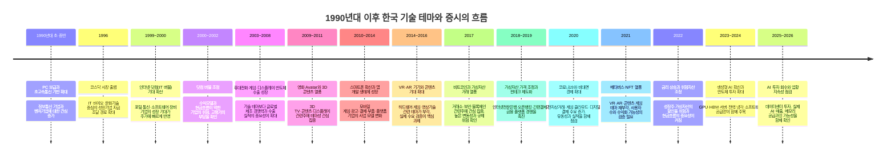

### 한눈에 보는 기술 테마와 거시경제의 연결

아래 인포그래픽은 앞의 연대기를 바탕으로 기술 변화, 금리·환율·유동성, 기업 실적과 공시가 어떻게 이어지는지 한 화면에 정리한 자료입니다. 기술 테마가 화제가 되더라도 실제 투자 판단에서는 글로벌 수요, 금리와 환율, 기업의 매출·이익·설비투자를 차례로 확인해야 합니다.

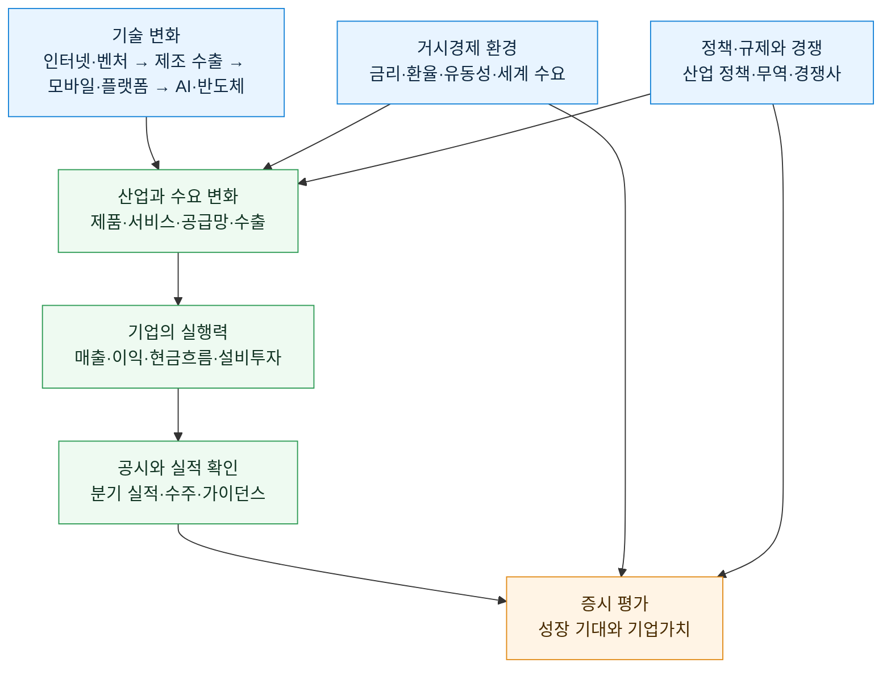

*그림을 읽을 때에는 화살표를 인과관계로 단정하지 말고, 각 단계의 공시·실적·거시 지표로 실제 연결 여부를 확인합니다.*

### 시기별로 무엇이 달랐는가

| 시기 | 기술·산업의 핵심 변화 | 증시에서 나타난 관심 | 학습할 점 |
| --- | --- | --- | --- |
| 1990년대 후반~2000년대 초 | 인터넷 보급과 벤처 투자 확대 | 인터넷·통신·소프트웨어 기업의 성장 기대 | 이용자 수나 기술 화제만으로는 기업가치를 판단할 수 없으며, 수익모델과 재무 안전성을 확인해야 합니다. |
| 2000년대 중후반 | 휴대전화, 게임, 디스플레이, 메모리 반도체의 수출 확대 | 제조 경쟁력과 세계 시장 점유율 | 기술은 제품 경쟁력·원가·해외 고객·환율과 결합될 때 기업 실적으로 이어집니다. |
| 2009~2016년 | 3D·스마트폰·앱·VR/AR 등 사용자 경험 중심 기술의 등장 | 콘텐츠, 모바일 플랫폼, 부품, 게임 테마 | 신기술은 기대가 앞서기 쉽습니다. 실제 기기 판매, 서비스 이용자, 반복 매출을 따로 확인해야 합니다. |
| 2017~2022년 | 가상자산, 핀테크, 메타버스와 디지털 플랫폼의 성장 | 거래소·보안·결제·블록체인·콘텐츠 관련주 | 24시간 거래, 규제 변화, 금리와 유동성은 위험자산 가격에 큰 영향을 줄 수 있습니다. |
| 2023년 이후 | 생성형 AI와 대규모 데이터센터 투자 | AI 반도체, 메모리, 장비·소재, 서버·전력·냉각, 소프트웨어 | AI 기대는 공급망 전체에 고르게 배분되지 않습니다. 고객의 설비투자와 공급사의 실제 매출·마진·재고를 함께 봐야 합니다. |

### 기술 테마를 읽는 공통 원칙

1. **기술의 화제성과 기업의 수익성은 구분합니다.** 새로운 서비스가 주목받아도 누가 돈을 벌고 언제 현금흐름이 생기는지는 별도 문제입니다.
2. **공급망을 나누어 봅니다.** 플랫폼, 콘텐츠, 부품, 장비, 소재, 전력처럼 같은 기술 안에서도 수혜를 받는 방식이 다릅니다.
3. **금리와 유동성을 확인합니다.** 먼 미래의 성장을 기대하는 기업일수록 금리 변화와 투자 심리에 민감할 수 있습니다.
4. **정책과 규제를 확인합니다.** 가상자산·개인정보·플랫폼·AI는 법과 제도의 변화가 사업 모델에 직접 영향을 줄 수 있습니다.
5. **테마 이름보다 공시와 실적을 우선합니다.** 계약 규모, 고객, 매출 인식 시점, 투자 비용, 재고와 부채를 원문 자료에서 확인해야 합니다.

> 관련 제도를 확인할 때는 [한국거래소의 ‘코스닥시장이란?’ 안내](https://open.krx.co.kr/contents/OPN/01/01010201/OPN01010201.jsp)에서 코스닥이 기술·벤처기업 중심 시장으로 만들어진 배경을, [금융위원회의 토스뱅크 은행업 인가 자료](https://fsc.go.kr/no010101/76050?curPage=4&srchBeginDt=&srchCtgry=&srchEndDt=&srchKey=&srchText=)에서 인터넷전문은행의 출범 경과를 확인할 수 있습니다. 여러 금융회사의 계좌를 한 곳에서 조회·이체·관리하는 오픈뱅킹의 기능은 [금융위원회 오픈뱅킹 안내](https://www.fsc.go.kr/no040101?cnId=2802&curPage=54&pastPage=52&srchKey=&srchText=)를 참고하세요. 가상자산 가격은 매우 크게 흔들릴 수 있으며, 한국 거래소에서 비트코인 가격이 해외보다 높게 형성되는 이른바 ‘김치 프리미엄’ 사례는 [IMF FinTech Note의 한국 설명](https://www.elibrary.imf.org/view/journals/063/2022/005/article-A001-en.xml)에서 직접 언급합니다.

## 시황·공시를 확인하는 외부 자료

방송과 뉴스는 시장의 쟁점을 빠르게 파악하는 데 유용하지만, 매수·매도 판단의 근거가 될 수는 없습니다. 방송에서 언급한 기업·계약·정책은 반드시 공시와 원문 자료로 다시 확인합니다. 아래 링크는 학습 화면에서 별도 창으로 열립니다.

### 국내 경제·증권 방송

- [한국경제TV](https://www.wowtv.co.kr/): 국내외 증시·산업·경제 이슈를 다루는 경제 전문 방송입니다.
- [매일경제TV](https://www.mktv.co.kr/): 경제·증권 방송과 시황 정보를 제공합니다.
- [서울경제TV SEN](https://www.sentv.co.kr/): 국내 증시와 산업 이슈를 다룹니다.
- [이데일리TV](https://tv.edaily.co.kr/): 금융·산업·정책 뉴스를 영상으로 확인할 수 있습니다.
- [MTN 머니투데이방송](https://www.mtn.co.kr/): 국내외 시장과 기업 이슈를 다룹니다.
- [토마토증권통](https://www.tomato-tong.com/): 국내 증시 시황과 투자 교육 콘텐츠를 제공합니다.
- [SBS Biz](https://biz.sbs.co.kr/): 경제·산업 뉴스와 시황 프로그램을 제공합니다.

IPTV 채널 번호와 편성은 통신사·상품·지역에 따라 달라질 수 있으므로, 채널명과 공식 편성표를 함께 확인합니다.

### 해외 시장·세계 경제 뉴스

- [Bloomberg Television](https://www.bloomberg.com/live): 세계 증시, 금리, 환율, 원자재, 기업 뉴스를 확인할 수 있습니다.
- [CNBC Markets](https://www.cnbc.com/markets/): 미국 시장의 개장·마감과 기업 실적 보도를 참고할 수 있습니다.
- [Reuters Markets](https://www.reuters.com/markets/): 통신사 기사로 세계 시장과 주요 경제 뉴스를 비교할 수 있습니다.
- [Yahoo Finance](https://finance.yahoo.com/): 미국 종목의 시세, 실적 일정, 기본 지표를 찾아볼 수 있습니다.

### 투자 판단의 우선순위: 공식 원문

- [DART 전자공시](https://dart.fss.or.kr/): 사업보고서, 실적, 유상증자, 감사 의견 등 국내 기업의 공시 원문을 확인합니다.
- [KIND 한국거래소 공시](https://kind.krx.co.kr/): 상장회사 공시와 시장 정보를 확인합니다.
- [한국거래소(KRX)](https://www.krx.co.kr/): 시장 제도, 지수, 상장·공시 관련 공식 정보를 제공합니다.
- [금융감독원(FSS)](https://www.fss.or.kr/): 금융소비자 정보와 제도 안내를 확인합니다.

## 산업의 생애주기

산업은 도입·성장·성숙·쇠퇴에 가까운 단계를 거치는 경우가 많습니다. 수요가 빠르게 늘면 경쟁 기업도 증가하고, 시간이 지나면 시장 성장률이 낮아지거나 대체 기술이 등장할 수 있습니다.

| 산업의 모습 | 쉬운 질문 |
| --- | --- |
| 시작 | 새 물건을 누가 처음 쓰고 있습니까? |
| 성장 | 손님과 매출이 빠르게 늘고 있습니까? |
| 안정 | 큰 회사들이 자리를 잡았나요? |
| 변화 | 다른 기술이나 물건이 대신하고 있습니까? |

반도체, 자동차, 게임, 음식처럼 서로 다른 산업은 자라는 속도와 위험이 다릅니다. 그래서 ‘인기 산업’이라는 말보다 실제 손님·경쟁·비용을 확인하는 편이 좋습니다.

## 반도체 산업을 볼 때

반도체는 휴대전화, 자동차, 컴퓨터, 서버에 들어가는 중요한 부품입니다. 하지만 반도체 회사의 실적은 오르내림이 큰 편입니다. 물건이 부족할 때는 가격이 오르다가, 회사들이 너무 많이 만들면 가격이 내려갈 수 있습니다.

반도체 뉴스를 볼 때는 다음을 차례로 살펴보세요.

1. 사람들이 휴대전화·컴퓨터·**AI(Artificial Intelligence, 인공지능)** 서버를 더 많이 사고 있습니까?
2. 회사들이 공장과 장비에 돈을 얼마나 쓰고 있습니까?
3. 재고가 쌓이고 있지는 않나요?
4. 한 회사만 좋은지, 산업 전체가 좋아지는지 구분할 수 있습니까?

## 2026년 6~7월 반도체 뉴스, 이렇게 묶어 읽습니다

2026년 6~7월처럼 반도체 기대가 큰 시기에는 ‘AI 때문에 반도체가 오른다’라는 한 문장만으로 시장을 이해하기 어려워요. 반도체 업황의 **피크(경기가 가장 좋다고 기대되는 꼭대기)** 우려와, **하이퍼스케일러(Hyperscaler, 아주 큰 데이터센터를 운영하며 클라우드·AI 서비스에 대규모로 투자하는 기업)**의 투자가 계속될 가능성을 함께 봐야 합니다.

이 절은 당시의 가격을 맞히기 위한 글이 아니에요. 2026년 6~7월에 나온 뉴스와 실적 자료를 읽을 때 어떤 사실이 서로 연결되는지 정리한 학습용 틀입니다. 실제 수치·발표일·정책 내용은 해당 기업의 실적 자료, DART, 거래소 공시와 공식 발표에서 다시 확인하세요.

### 먼저 연결해 볼 세계 뉴스 다섯 가지

| 세계 뉴스거리 | 반도체와 연결되는 이유 | 확인할 자료 |
| --- | --- | --- |
| 미국 대형 클라우드 기업의 AI·데이터센터 투자 계획 | 서버, AI 가속기, 고대역폭 메모리(HBM), 네트워크 장비 수요에 영향을 줄 수 있습니다. | 분기 실적 발표 자료의 설비투자(Capex)·데이터센터 투자 설명 |
| AI 반도체·메모리 기업의 공급 계획 | 주문이 많아도 생산 능력과 수율이 따라가지 못하면 매출은 늦어질 수 있습니다. 반대로 증설이 너무 빠르면 나중에 공급 과잉 위험이 생겨요. | 기업 실적 자료, 생산능력·재고·고객 주문 관련 설명 |
| 미국·중국의 수출 통제와 공급망 정책 | 어느 나라에 어떤 칩·장비를 팔 수 있는지가 바뀌면 매출 지역, 재고, 투자 계획이 달라질 수 있습니다. | 정부 발표 원문, 기업의 위험요소·지역별 매출 공시 |
| 금리·달러·환율 | 데이터센터 투자비용, 성장주 가치 평가, 수출 기업의 원화 실적에 함께 영향을 줄 수 있습니다. | 중앙은행 발표, 환율·회사 실적의 환율 영향 설명 |
| 대만 해협·물류·전력 같은 공급망 뉴스 | 첨단 칩 생산은 특정 지역과 공장에 많이 모여 있어 공급 차질 위험을 살펴야 합니다. | 기업의 공급망 설명, 정부·거래소의 공식 발표 |

### 하이퍼스케일러가 왜 중요한가요?

하이퍼스케일러는 검색, 클라우드, 동영상, 전자상거래, AI 서비스를 많은 사람에게 제공하기 위해 거대한 데이터센터를 운영합니다. 이 기업들이 서버와 AI 가속기를 더 많이 사면, 그 안에 들어가는 **GPU(Graphics Processing Unit, 복잡한 계산을 빠르게 처리하는 반도체)**, 메모리, 기판, 전력 장비 수요가 커질 수 있습니다.

하지만 ‘투자 계획이 크다’와 ‘반도체 회사의 이익이 계속 커진다’는 같은 말이 아니에요. 하이퍼스케일러는 투자 계획을 바꿀 수 있고, 이전에 주문한 장비가 실제 서비스 매출로 이어지는 데 시간이 걸릴 수 있습니다. 또 AI 서버에 돈이 많이 쓰여도 모든 반도체 종류가 같은 정도로 혜택을 받지는 않습니다. 설계 회사, 파운드리, 메모리, 장비, 소재 회사가 받는 영향은 서로 다릅니다.

### 하이퍼스케일러의 부채는 어디서, 어떻게 확인할까요?

‘하이퍼스케일러가 빚이 많다’는 말은 **총부채만으로 판단하면 안 됩니다.** 현금·단기투자자산도 큰 회사가 많고, 데이터센터 장기 임차나 장비 구매 약정은 일반 채권과 다른 방식으로 나타날 수 있어요. 가장 정확한 출발점은 회사의 공식 공시입니다.

미국 상장사 공시를 찾을 때는 **티커만 검색하는 방식보다 회사명 또는 CIK(SEC 회사 식별번호)로 회사를 먼저 여는 방법이 확실합니다.** EDGAR의 전체 텍스트 검색은 티커도 입력할 수 있지만, 공시 본문의 단어를 찾는 기능이라 결과가 섞이거나 회사 선택으로 바로 이어지지 않을 수 있어요. 아래의 회사별 EDGAR 링크를 열면 해당 회사 공시 목록으로 바로 갑니다.

| 회사 | 티커 | CIK | 공시 목록 바로가기 |
| --- | --- | ---: | --- |
| Microsoft | `MSFT` | `789019` | [Microsoft EDGAR 공시](https://www.sec.gov/edgar/browse/?CIK=789019) |
| Amazon | `AMZN` | `1018724` | [Amazon EDGAR 공시](https://www.sec.gov/edgar/browse/?CIK=1018724) |
| Alphabet | `GOOGL` | `1652044` | [Alphabet EDGAR 공시](https://www.sec.gov/edgar/browse/?CIK=1652044) |
| Meta Platforms | `META` | `1326801` | [Meta EDGAR 공시](https://www.sec.gov/edgar/browse/?CIK=1326801) |

1. 위의 회사별 링크 또는 [EDGAR 회사 공시 화면](https://www.sec.gov/edgar/browse/)에서 **정식 회사명**(예: `Microsoft Corporation`)이나 **CIK 숫자**를 입력해 회사를 선택합니다. 티커가 입력되지 않거나 결과가 이상하면 CIK로 바꿉니다.


2. 공시 목록의 **Form** 필터에 `10-K` 또는 `10-Q`를 입력한 뒤, 가장 최근 **Filing** 또는 **Document**를 엽니다.
3. 보고서 안에서 `debt`, `long-term debt`, `lease`, `commitments`, `cash and cash equivalents`, `cash flows`, `capital expenditures`를 검색합니다. 영문 보고서에서는 브라우저의 `Ctrl/Cmd + F`가 가장 빠릅니다.
4. 아래 항목을 같은 기준일·같은 통화로 메모하고, 이전 분기 또는 전년과 비교합니다.

| 보고서에서 찾을 말 | 무엇을 확인하나요? | 왜 필요한가요? |
| --- | --- | --- |
| Balance Sheets의 `Short-term debt`, `Current portion of long-term debt`, `Long-term debt` | 1년 안에 갚아야 할 부채와 장기부채 규모 | 총부채와 가까운 만기 부담을 나누어 볼 수 있어요. |
| Notes to Financial Statements의 `Debt` | 만기, 고정·변동금리, 채권 발행, 이자비용 | 부채가 얼마인지뿐 아니라 언제·어떤 금리로 갚아야 하는지 확인합니다. |
| `Leases`와 `Commitments` | 데이터센터 장기 임차, 금융리스, 구매 약정 | AI 데이터센터 투자의 미래 현금지출 부담은 일반 차입금 밖에 있을 수 있어요. |
| `Cash and cash equivalents`, `Marketable securities` | 현금과 쉽게 현금화할 수 있는 투자자산 | **순부채 = 이자부 부채 - 현금성자산·단기투자자산**으로 볼 때 필요해요. 다만 전액을 즉시 부채 상환에 쓸 수 있는지는 별도 확인이 필요합니다. |
| Cash Flows의 영업현금흐름·`Capital expenditures` | 실제로 번 현금과 데이터센터·서버 등에 쓴 돈 | 부채와 투자 약정을 영업현금흐름으로 감당할 수 있는지 살펴보는 단서예요. |

아래는 Playwright로 캡처한 Microsoft 2025 연차보고서의 `Debt` 주석 화면입니다. 장기부채를 **발행 시기, 만기, 표면·실효 이자율, 장부금액**으로 나누어 보여 줍니다. 실제 분석에서는 이 표만 보지 말고, 바로 앞의 단기부채와 뒤의 리스·현금흐름 항목까지 연결하세요.


Microsoft는 단지 읽는 방법을 보여 주기 위한 예시입니다. 다른 회사도 회사별 IR 페이지에서 보고서를 받을 수 있지만, 원문과 제출일 확인에는 EDGAR가 기준이 됩니다. 예를 들어 [Microsoft 연차보고서](https://www.microsoft.com/investor/reports/ar25/index.html#debt)는 `Debt` 주석으로 바로 이동하고, [Amazon IR](https://ir.aboutamazon.com/contact-us-and-request-documents/)은 10-K·10-Q와 분기 실적 자료를 제공합니다.

### ‘업황 피크’라는 걱정은 무엇일까요?

피크 우려는 ‘수요가 오늘부터 사라진다’는 뜻이 아니에요. 시장이 앞으로의 좋은 결과를 이미 가격에 많이 반영했거나, 공급이 너무 빠르게 늘어 다음 해의 가격·이익률이 약해질 수 있다는 걱정입니다. 다음 신호를 함께 봐야 합니다.

| 피크 위험을 살필 신호 | 왜 조심할까요? |
| --- | --- |
| 재고가 매출보다 빠르게 늘어남 | 고객이 실제로 쓰기보다 먼저 많이 사 두었을 가능성이 있습니다. |
| 평균판매가격(Average Selling Price, ASP)이 약해짐 | 평균판매가격은 제품 하나를 평균 얼마에 팔았는지 나타내는 값입니다. 판매량이 같아도 ASP가 낮아지면 매출과 이익률이 줄 수 있습니다. 제품 구성, 할인, 수요·공급, 환율도 함께 확인해야 합니다. |
| 고객의 설비투자 계획이 줄거나 뒤로 밀림 | 데이터센터 장비 주문이 기대보다 늦어질 수 있습니다. |
| 여러 회사가 동시에 큰 증설 발표 | 미래에 공급이 수요보다 많아질 위험이 생길 수 있습니다. |
| 기대가 매우 높은데 실적 전망이 그대로이거나 낮아짐 | ‘나쁜 실적’이 아니어도 시장 기대보다 낮으면 주가가 흔들릴 수 있습니다. |

반대로 재상승 가능성을 살필 때는 AI 수요라는 말보다, 고객의 실제 지출과 주문이 이어지는지 확인합니다. 재고가 건강한 수준이고, 하이퍼스케일러의 투자·AI 서비스 매출이 유지되며, 메모리·파운드리의 가격과 가동률이 함께 개선되는지를 보는 편이 더 구체적입니다.

### 세 가지 시나리오로 나누어 생각합니다

| 시나리오 | 어떤 뉴스 조합일까요? | 투자자가 확인할 질문 |
| --- | --- | --- |
| 수요 지속 | 대형 클라우드 기업의 투자와 AI 서비스 매출이 유지되고, 칩·메모리 주문도 이어져요. | 늘어난 투자가 실제 매출·현금흐름으로 연결되고 있습니까? |
| 기대 조정 | 투자 자체는 이어지지만 증가 속도가 느려지거나, 일부 고객이 주문 시점을 조절합니다. | 가격이 많이 오른 뒤의 기대와 회사 전망 사이에 차이가 있습니까? |
| 업황 하락 위험 | 재고·공급은 늘지만 주문·가격이 약해지고, 고객 투자 계획도 줄어듭니다. | 내 회사는 현금·기술·고객 다변화로 버틸 힘이 있습니까? |

어느 시나리오가 맞는지는 한 번의 뉴스가 아니라 여러 분기 자료로 확인해야 합니다. ‘AI’라는 단어가 들어간 뉴스, 방송의 목표주가, 하루의 급등락만으로 결론 내리지 말고 회사별 매출·재고·설비투자·공시를 비교하세요.

### 2026년 6~7월 뉴스 확인 순서

1. 방송·뉴스에서 나온 주장인지, 기업 또는 정부가 직접 발표한 사실인지 구분합니다.
2. 하이퍼스케일러의 설비투자가 **계획**인지, 실제 지출·가동 중인 데이터센터인지 구분합니다.
3. 반도체 회사의 매출 증가가 판매량, 가격, 환율, 일회성 요인 중 무엇 때문인지 확인합니다.
4. 재고·공급 확대·수출 규제 같은 반대 자료도 함께 찾아봅니다.
5. 내 투자 기간과 감당 가능한 손실을 먼저 확인하고, 한 산업에 과도하게 몰리지 않습니다.

기업의 공식 실적 자료는 각 기업의 투자자 관계(IR) 페이지에서, 국내 기업의 공시는 [DART](https://dart.fss.or.kr/)와 [KIND](https://kind.krx.co.kr/)에서 확인할 수 있습니다. 거시 흐름은 [한국은행](https://www.bok.or.kr/)과 [한국거래소](https://www.krx.co.kr/)의 공식 자료도 함께 참고하세요.

## 2026년 CSP 빅테크의 AI 매출·투자 뉴스 읽기

**CSP(Cloud Service Provider, 클라우드 서비스 제공자)**는 인터넷으로 서버, 저장공간, AI 계산 기능을 빌려 주는 회사를 말합니다. Microsoft Azure, Amazon AWS, Google Cloud 같은 서비스가 대표적입니다. 이 기업들의 AI 투자는 반도체·메모리·네트워크 장비의 주문에 영향을 줄 수 있지만, 투자금이 큰 것만으로 곧바로 수익이 난다고 말할 수는 없습니다.

### ISP·IDC·CSP·MSP는 어떻게 다를까요?

데이터센터와 클라우드 뉴스에는 비슷한 약어가 함께 나옵니다. 이들은 맡는 역할이 다르고, 한 회사가 두 가지 이상을 함께 하기도 합니다.

| 구분 | 영어 전체 이름 | 주로 하는 일 | 쉬운 비유 |
| --- | --- | --- | --- |
| ISP | Internet Service Provider | 가정·회사에 인터넷 회선을 연결하고 인터넷 접속을 제공합니다. | 인터넷이 오가는 길을 연결해 주는 회사 |
| IDC | Internet Data Center | 서버를 둘 공간, 전력, 냉각, 보안, 통신 연결을 제공하고 운영합니다. | 서버를 안전하게 보관하고 돌리는 건물·기반 시설 |
| CSP | Cloud Service Provider | IDC와 서버를 바탕으로 컴퓨팅, 저장공간, 데이터베이스, AI 같은 기능을 인터넷으로 빌려줍니다. | 필요할 때 빌려 쓰는 온라인 컴퓨터 공장 |
| MSP | Managed Service Provider | 고객을 대신해 서버·네트워크·클라우드 환경을 설정·감시·운영하고 장애 대응을 돕습니다. | 복잡한 IT 환경을 대신 관리해 주는 운영팀 |

예를 들어 고객이 클라우드 서비스를 쓸 때는 ISP의 회선을 통해 접속하고, CSP의 서비스는 IDC 안의 서버·네트워크·전력·냉각 설비 위에서 돌아갈 수 있습니다. MSP는 이 환경을 고객의 목적에 맞게 설계하고 운영해 줄 수 있어요. 실제 계약에서는 IDC 사업자가 서버까지 빌려주거나 CSP가 자체 데이터센터를 짓는 등 역할의 경계가 겹치기도 합니다.

### AI 데이터센터의 1GW·2GW는 무슨 뜻인가요?

**GW(기가와트)**는 전력이 한순간에 얼마나 많이 필요한지 또는 공급할 수 있는지를 나타내는 **전력 용량**의 단위예요. `1GW = 1,000MW(메가와트) = 10억W(와트)`입니다. AI 데이터센터 뉴스에서 ‘1GW 데이터센터’라고 하면 보통 그 센터 또는 단지에 공급·사용하도록 계획한 최대 전력 규모를 말합니다. 서버 대수, GPU 개수, 건물 면적을 직접 뜻하는 단위는 아니에요.

| 단위·표현 | 뜻 | 예시 |
| --- | --- | --- |
| W·MW·GW | 순간 전력 또는 전력 용량 | 1GW급 전력은 1,000MW급 전력 용량을 뜻해요. |
| Wh·MWh·GWh·TWh | 일정 시간 동안 실제로 쓴 전기 에너지 | 1GW를 한 시간 내내 쓰면 1GWh를 사용합니다. |
| 1GW가 연중 계속 가동될 때 | 이론적인 연간 전력 사용량 | `1GW × 24시간 × 365일 = 약 8.76TWh`입니다. 실제 사용량은 가동률에 따라 달라져요. |

여기서 특히 조심할 점은 발표마다 ‘1GW’의 기준이 다를 수 있다는 것입니다. 어떤 회사는 **시설 전체 전력(Facility Power)**, 즉 서버뿐 아니라 냉각·조명·전력 손실까지 포함한 용량을 말하고, 어떤 회사는 서버·네트워크 장비가 실제로 쓰는 **IT 부하(IT Load)**만 말할 수 있어요. 전력망 접속을 약정한 용량인지, 이미 전기가 들어오는 용량인지, 실제 가동 중인 용량인지도 서로 다릅니다.

**PUE(Power Usage Effectiveness, 전력사용효율)**는 데이터센터 전체 전력 사용량을 IT 장비 전력 사용량으로 나눈 값입니다. 값이 1에 가까울수록 냉각·전력 변환 등에 쓰는 추가 전력이 적다는 뜻이에요. 예를 들어 PUE가 1.2라면 IT 장비가 1GW를 쓰기 위해 시설 전체로는 약 1.2GW가 필요합니다. 반대로 시설 전체 전력 용량이 1GW라면 단순 계산상 IT 장비에는 약 0.83GW를 쓸 수 있습니다. 실제 값은 설계·날씨·냉각 방식·가동률에 따라 달라집니다.

따라서 ‘2GW AI 데이터센터’라는 기사만 보고 서버·GPU 주문이 정확히 두 배가 된다고 판단하면 안 됩니다. 아래를 함께 확인하세요.

1. 2GW가 계획·전력망 접속 계약·공사 중·실제 가동 중 중 어느 단계인가요?
2. 시설 전체 전력인지 IT 장비 전력인지, PUE는 얼마인지 공개했나요?
3. 전력과 부지가 한 번에 확보됐는지, 여러 단계로 나누어 증설하는지 확인했나요?
4. 그 전력을 사용할 고객 계약·AI 서비스 수요·서버 조달 계획이 실제로 있나요?

### IDC 투자와 ‘3년 손익분기’는 어떻게 이해할까요?

IDC를 새로 만들거나 크게 늘리려면 건물·전력 인입·변전 설비·냉각 설비·통신망·보안과 함께 서버·네트워크 장비에 큰 초기 비용이 들어갑니다. 이후에는 고객에게 상면(서버를 놓는 공간), 전력, 회선, 관리 서비스 등을 팔아 매출을 얻고 전기료·인건비·임차료·유지보수·감가상각 비용을 냅니다.

‘서버와 네트워크에 투자하면 3년이면 손익분기를 넘는다’는 말은 **모든 IDC에 적용되는 규칙이 아닙니다.** 높은 가동률과 장기 고객 계약, 적절한 가격, 안정적인 전력비가 전제된 특정 사업의 추정일 수 있어요. 손익분기는 회계상 이익이 0을 넘는 시점인지, 초기 투자금을 현금으로 모두 회수하는 시점인지에 따라서도 달라집니다. 특히 건물·전력 설비까지 포함한 전체 데이터센터 투자는 서버만의 투자보다 회수 기간이 더 길 수 있습니다.

| 손익분기에 영향을 주는 요인 | 빨라질 수 있는 경우 | 늦어질 수 있는 경우 |
| --- | --- | --- |
| 가동률 | 입주 고객과 서버 사용량이 빠르게 늘어남 | 빈 상면·유휴 서버가 오래 남음 |
| 가격·계약 | 장기 계약과 높은 부가 서비스 비중 | 경쟁으로 가격이 내려가거나 단기 계약 비중이 큼 |
| 전력·냉각 비용 | 전력 효율이 좋고 전력비를 고객에게 일부 반영 | 전력 단가 상승, 고전력 AI 서버로 냉각 부담 증가 |
| 초기 투자 규모 | 기존 건물·회선·전력 설비를 활용 | 새 부지·건물·전력망까지 새로 구축 |
| 장비 교체 | 서버를 충분히 가동한 뒤 계획적으로 교체 | 기술 변화가 빨라 장비를 일찍 교체하거나 추가 증설 |

투자 뉴스를 볼 때는 ‘몇 년 만에 회수’라는 숫자 하나보다 **투자 범위가 서버·네트워크만인지, 건물·전력 설비까지 포함하는지**, **현재 가동률과 신규 계약이 어떤지**, **감가상각·전기료를 뺀 현금흐름이 개선되는지**를 나누어 확인하는 편이 좋습니다. 데이터센터 투자 확대는 장비 주문에는 긍정적일 수 있지만, 운영사의 수익성은 고객 수요와 비용 구조에 따라 다르게 나타납니다.

### Capex(캐팩스·설비투자)는 무엇인가요?

**Capex(Capital Expenditure, 자본적 지출 또는 설비투자)**는 회사가 여러 해 동안 사용할 자산을 사거나 만드는 데 쓰는 돈이에요. 공장, 생산 장비, 데이터센터 건물, 서버·GPU, 네트워크 장비, 전력·냉각 설비 등이 대표적입니다. 단순히 ‘올해 비용으로 사라지는 돈’이 아니라, 미래의 매출을 만들기 위해 오래 쓰는 기반을 만드는 투자라는 점이 핵심이에요.

| 구분 | Capex(설비투자) | Opex(Operating Expenditure, 운영비) |
| --- | --- | --- |
| 예시 | 공장 건설, 서버·GPU 구매, 데이터센터 전력·냉각 설비 | 전기료, 직원 급여, 클라우드 사용료, 유지보수, 광고비 |
| 쓰임 | 여러 해에 걸쳐 쓸 자산을 마련 | 일상 사업을 운영 |
| 회계상 모습 | 자산으로 먼저 잡힌 뒤, 사용 기간 동안 감가상각비로 나뉘어 비용 처리될 수 있음 | 보통 해당 기간의 비용으로 반영 |
| 투자자가 볼 점 | 미래 수요와 투자 회수 가능성 | 지금의 수익성·비용 관리 |

예를 들어 CSP가 1,000억 원으로 AI 서버를 사면, 돈은 구매 시점에 크게 나가지만 회계상 비용은 서버를 쓰는 여러 해에 걸쳐 **감가상각**으로 나뉘어 반영될 수 있어요. 그래서 매출과 영업이익이 좋아 보여도 현금흐름은 나쁠 수 있고, 반대로 Capex가 줄면 단기 현금흐름은 좋아 보여도 미래 성장 능력이 약해질 수도 있습니다.

**Capex가 늘었다 = 무조건 좋은 소식**은 아닙니다. 고객 주문이 실제로 늘어 필요한 증설이라면 미래 매출의 바탕이 될 수 있지만, 수요보다 먼저 너무 많이 지으면 유휴 설비·감가상각·이자 부담이 커질 수 있어요. 반대로 Capex가 줄었다고 꼭 나쁜 것도 아닙니다. 큰 공장이 완성된 뒤 투자 단계가 끝났을 수도 있고, 수요 전망이 약해져 투자를 미뤘을 수도 있으므로 이유를 확인해야 합니다.

| Capex 뉴스를 읽을 질문 | 좋은 방향일 수 있는 모습 | 조심할 모습 |
| --- | --- | --- |
| 왜 투자하나요? | 이미 확보한 수주·가동률 상승에 대응 | 막연한 시장 기대만으로 과도하게 증설 |
| 무엇에 투자하나요? | 수익성이 높은 제품·병목 설비에 집중 | 건물·장비·리스 비용이 섞여 범위를 알기 어려움 |
| 어떻게 돈을 마련하나요? | 영업현금과 감당 가능한 부채로 조달 | 현금은 부족한데 빚·증자가 빠르게 늘어남 |
| 언제 돈을 벌까요? | 가동 시점·고객·예상 매출을 구체적으로 설명 | 수익화 시점이 계속 미뤄짐 |
| 투자 뒤 결과는? | 매출·가동률·마진·영업현금흐름이 함께 개선 | 감가상각과 이자만 늘고 재고·유휴 설비가 쌓임 |

실적 자료에서는 `Capex`, `설비투자`, `유형자산 취득`, `투자활동 현금흐름`, `감가상각비`, `자유현금흐름(영업현금흐름에서 설비투자 등을 뺀 뒤 남는 돈)` 같은 말을 함께 찾아보세요. 회사마다 Capex에 금융리스·부동산·토지·서버를 포함하는 방식이 다를 수 있으므로, 한 회사의 숫자를 다른 회사와 비교하기 전에 계산 기준부터 확인해야 합니다.

아래는 2026년 1~7월에 공개된 기업 자료를 학습용으로 정리한 내용입니다. 각 회사의 회계연도, AI 매출을 세는 방법, Capex에 리스(장기 임대) 비용을 포함하는지 여부가 다르므로 숫자를 그대로 줄 세워 비교하면 안 됩니다. 발표 뒤 전망은 바뀔 수 있으니, 주문 전에는 가장 최근의 IR 자료를 확인하세요.

| 기업·CSP | 2026년 공개 자료에서 볼 수 있는 흐름 | 반도체와 연결해 볼 점 |
| --- | --- | --- |
| Microsoft Azure | 2026년 4월 발표한 FY2026 3분기 자료에서 AI 사업의 연환산 매출이 370억 달러를 넘었고, 전년보다 123% 늘었다고 밝혔습니다. 같은 해 Capex는 약 1,900억 달러 수준으로 예상한다고 설명했습니다. | AI 매출 증가가 서버·GPU 수요를 뒷받침하는지, 큰 설비투자 때문에 감가상각·현금흐름 부담이 커지는지도 함께 봐야 합니다. |
| Amazon AWS | 2026년 1분기 자료에서 OpenAI의 약 2GW Trainium 사용 약정이 2027년부터 늘어날 예정이라고 밝혔고, 최근 12개월 동안 210만 개 이상 AI 칩을 확보했다고 설명했습니다. 2026년부터 100만 개 이상 NVIDIA GPU 배치를 시작한다는 내용도 포함됐습니다. | 약정은 미래 수요의 단서이지만 당장 매출이 아니라는 점이 중요합니다. 자체 칩(Trainium)과 외부 GPU의 비중이 어느 쪽 공급사에 도움이 되는지도 구분해 봅니다. |
| Alphabet Google Cloud | 2026년 초 IR 자료에서 2025년 Capex 910억 달러를 언급하며 2026년에는 추가 증가를 예상했습니다. 투자 구성은 서버 같은 기계가 약 60%, 데이터센터·네트워크 같은 장기 자산이 약 40%였고, 2026년 ML 계산 자원의 절반 이상이 Cloud 사업으로 갈 것으로 설명했습니다. | ‘AI 투자’ 안에도 서버·네트워크·건물 투자가 섞여 있습니다. 서버 수요와 데이터센터 건설 수요를 한 숫자로 보지 말고 구분해야 합니다. |
| Meta | 2026년 1분기 자료에서 2026년 Capex(금융리스 원금 상환 포함) 전망을 1,250억~1,450억 달러로 제시했습니다. 부품 가격 상승과 미래 데이터센터 용량이 상향 이유라고 설명했습니다. | Meta는 클라우드를 외부 고객에게 많이 파는 CSP와 달리 광고·추천·AI 제품을 위해 인프라를 크게 쓰는 면이 있습니다. 따라서 AI 투자 회수는 클라우드 매출보다 광고 효율·이용자 참여·비용 변화도 함께 살펴봐야 합니다. |

### 숫자를 읽을 때 꼭 나눌 것

1. **AI 매출과 클라우드 매출은 다를 수 있습니다.** 어떤 회사는 AI만 따로 공개하고, 어떤 회사는 Cloud 전체 안에 포함해 보여 줍니다. AI 매출이 공개되지 않았다고 AI 사업이 없다는 뜻은 아니에요.
2. **Capex는 올해 현금 지출과 정확히 같은 말이 아닐 수 있습니다.** 서버를 사는 비용, 데이터센터 건설, 금융리스가 섞일 수 있고 대금을 내는 시점도 다릅니다.
3. **투자와 수익 사이에는 시간이 있습니다.** 데이터센터를 짓고 장비를 들인 뒤 고객이 실제로 사용해 매출이 되는 데는 시간이 걸려요. Amazon도 2026년 AWS 투자 중 상당 부분이 2027~2028년에 수익화될 수 있다고 설명했습니다.
4. **AI 수요가 늘어도 모든 반도체 회사의 이익이 같은 속도로 늘지는 않습니다.** GPU, 맞춤형 AI 칩, HBM, 범용 메모리, 네트워크 장비, 전력·냉각 장비가 받는 영향은 서로 다릅니다.

### ‘다시 오를까?’를 생각할 때의 두 가지 증거

하이퍼스케일러의 투자 확대는 반도체 수요의 좋은 단서가 될 수 있습니다. 하지만 주가가 다시 오를지 판단하려면 ‘투자가 크다’와 ‘투자가 돈을 벌고 있다’를 구분해야 합니다.

| 확인할 증거 | 수요 지속에 가까운 모습 | 피크 위험에 가까운 모습 |
| --- | --- | --- |
| 고객 수요 | 클라우드 사용량·수주 잔고·AI 유료 서비스가 함께 늘어납니다. | 발표는 크지만 실제 사용량·매출 설명이 약합니다. |
| 투자 회수 | AI 매출이나 광고 효율이 늘면서 이익률·현금흐름을 설명합니다. | Capex와 감가상각만 빨리 늘고 수익화 시점이 계속 뒤로 밀려요. |
| 반도체 주문 | 재고가 과하지 않고 공급 부족·가격·가동률이 건강하게 유지됩니다. | 고객이 장비를 먼저 많이 사 둔 뒤 주문을 줄이거나 공급이 빠르게 늘어납니다. |
| 시장 기대 | 회사 전망이 시장의 높은 기대를 뒷받침합니다. | 좋은 실적이어도 기대보다 약한 전망이 나와 가격이 크게 흔들려요. |

이 표는 매수·매도 신호가 아니에요. 2026년 AI 투자 뉴스는 ‘얼마를 썼나’에서 끝내지 말고, **누가 실제로 사용하고 돈을 내는지**, **그 비용이 언제 수익으로 돌아오는지**, **공급이 너무 빨리 늘고 있지 않은지**를 이어서 확인하는 연습에 쓰세요.

원문 확인: [Microsoft FY2026 3분기 실적](https://www.microsoft.com/en-us/investor/earnings/FY-2026-Q3/press-release-webcast), [Microsoft FY2026 3분기 컨퍼런스콜](https://www.microsoft.com/en-us/investor/events/fy-2026/earnings-fy-2026-q3), [Amazon 2026년 1분기 실적](https://ir.aboutamazon.com/news-release/news-release-details/2026/Amazon-com-Announces-First-Quarter-Results/), [Amazon 주주서한](https://www.aboutamazon.com/news/company-news/amazon-ceo-andy-jassy-2025-letter-to-shareholders), [Alphabet 2025년 4분기 컨퍼런스콜](https://abc.xyz/investor/events/event-details/2026/2025-Q4-Earnings-Call-2026-Dr_C033hS6/default.aspx), [Meta 2026년 1분기 실적](https://investor.atmeta.com/investor-news/press-release-details/2026/Meta-Reports-First-Quarter-2026-Results/).

## 거시 변수와 계절성은 따로 확인합니다

통화량, 금리·물가 발표, 계절성, 월별 시장 복기는 [거시경제와 주식시장 읽기](11.md)에 통합했습니다. 이 문서에서는 해당 변화가 특정 산업의 주문·원가·재고·설비투자로 실제 이어지는지 확인합니다. 과거의 달력 효과는 매매 규칙이 아니며, 가까운 시기에 쓸 돈을 투자에 넣지 않는 원칙은 항상 우선합니다.

## ESG(Environment, Social, Governance)는 회사의 오래가는 힘을 보는 관점입니다

ESG는 환경(Environment), 사회(Social), 지배구조(Governance)를 줄인 말입니다.

- 환경: 에너지 사용, 오염, 기후 변화에 어떻게 대응하는지
- 사회: 직원·고객·협력회사를 공정하게 대하는지
- 지배구조: 회사의 중요한 결정을 누가 어떻게 확인하는지

ESG 점수 하나가 좋은 회사를 보장하지는 않습니다. 다만 사고, 벌금, 평판 문제처럼 오래 남을 수 있는 위험을 살필 때 도움이 됩니다.

## 지수는 시장의 체온계입니다

코스피·코스닥은 시장 전체의 분위기를 보여 주지만, 지수가 올랐다고 모든 회사가 오르는 것은 아닙니다. 지수의 계산 방식과 시장 구조는 [주식 4](06.md#코스피와-코스닥)에서 확인하고, 여기서는 지수보다 개별 산업의 수요와 경쟁을 먼저 살핍니다.

## 뉴스가 나왔을 때 확인할 순서

1. 이 소식의 원문이 공시나 공식 발표인지 확인합니다.
2. 언제 일어난 일인지, 이미 알려진 내용인지 확인합니다.
3. 회사 한 곳의 일인지 산업 전체의 변화인지 구분해 봅니다.
4. 좋아 보이는 점과 나빠질 수 있는 점을 하나씩 적어 봅니다.
5. 급하게 결정하지 말고 다음 자료도 기다려 봅니다.

## 경제 지표와 금리는 산업별로 다르게 닿습니다

선행·동행·후행 지표와 금리의 전달 경로는 [거시경제와 주식시장 읽기](11.md#2-거시지표가-주가로-이어지는-네-단계)에 통합했습니다. 여기서의 질문은 한 단계 더 구체적입니다. 금리·환율·원자재 가격의 변화가 이 산업의 **고객 수요, 원가, 차입 부담, 가격 결정력** 중 어디에 먼저 닿는지 확인하세요.

## 산업 분석은 원인과 결과를 잇는 과정입니다

산업의 뉴스를 읽을 때는 다음 순서로 생각하면 좋습니다.

1. 어떤 변화가 생겼나요? 예: 원재료 가격 상승, 새 기술 등장, 법률 변화
2. 누구의 비용 또는 매출이 달라지나요?
3. 그 회사가 가격을 올리거나 비용을 줄일 힘이 있습니까?
4. 이 변화가 한두 달짜리인지, 여러 해 이어질 변화인지 판단할 수 있습니까?

예를 들어 전기 요금이 오르면 전기를 많이 쓰는 공장은 비용 부담을 받을 수 있습니다. 하지만 제품 가격에 비용을 반영할 힘이 있는 회사와 그렇지 못한 회사의 결과는 다를 수 있습니다.

## 기업집단과 지배구조도 살펴봅니다

기업집단의 지분 구조, 연결·별도 재무제표, 주주 권리와 지배구조는 [법인과 회사 구조 이해하기 2: 운영·자금·신용보증](10-2.md#6-회사는-누가-결정하나요)에 정리했습니다. 산업 분석에서는 계열사 거래·투자·보증이 해당 산업의 수요와 비용, 개별 기업의 실적에 어떤 영향을 주는지 확인합니다.

## 반도체 섹터는 여러 회사가 이어진 산업입니다

반도체는 휴대전화·자동차·컴퓨터·서버·가전제품에 들어가는 작은 전자 부품입니다. 하지만 반도체 회사라고 모두 같은 일을 하지는 않습니다. 한 제품이 완성되기까지 여러 단계의 회사가 연결됩니다.

| 단계 | 하는 일 | 살펴볼 질문 |
| --- | --- | --- |
| 설계 | 어떤 기능을 넣을지 회로를 설계합니다. | 새로운 제품 수요가 늘고 있습니까? |
| 생산 | 설계된 반도체를 공장에서 만듭니다. | 공장 가동률과 생산 능력은 어떤가요? |
| 메모리 | 데이터를 저장하는 반도체를 만듭니다. | 가격·재고·수요가 함께 좋아지고 있습니까? |
| 장비·소재 | 반도체 공장에 필요한 기계와 재료를 공급합니다. | 고객사가 설비 투자를 늘리고 있습니까? |
| 후공정 | 만든 반도체를 검사하고 포장해 제품에 연결합니다. | 고성능 제품 비중이 커지고 있습니까? |

**고대역폭 메모리(HBM, High Bandwidth Memory)**는 많은 데이터를 빠르게 주고받도록 만든 메모리입니다. 인공지능 서버처럼 계산량이 큰 곳에서 중요하게 쓰일 수 있습니다. 다만 새로운 기술의 수요가 크다는 사실과, 특정 회사의 이익이 계속 늘어난다는 사실은 다르므로 회사별 생산 능력·고객·가격을 따로 봐야 합니다.

### CPU·GPU·TPU는 무엇이 다를까요?

AI 서버에는 보통 한 종류의 칩만 들어가지 않습니다. **CPU**가 전체 시스템을 운영하고, **GPU**나 **TPU** 같은 가속기가 AI 계산을 크게 맡는 식으로 함께 일합니다. TPU는 특히 Google이 개발한 AI 전용 가속기 이름이며, 넓게는 특정 AI 계산에 맞춘 **맞춤형 ASIC(주문형 반도체)**의 한 사례로 이해하면 됩니다.

| 구분 | 주된 역할 | 강점 | AI에서 주로 하는 일 |
| --- | --- | --- | --- |
| CPU | 컴퓨터의 범용 지휘자 | 여러 종류의 작업, 순서가 복잡한 처리, 운영체제·입출력 관리 | 데이터 준비, 요청 처리, 서버 운영, GPU·TPU 제어, 비교적 작은 AI 작업 |
| GPU | 많은 계산을 동시에 하는 병렬 가속기 | 수천 개의 계산을 한꺼번에 처리하는 높은 처리량과 폭넓은 개발 생태계 | 대규모 AI 학습·추론, 그래픽, 과학 계산 |
| TPU | AI 행렬 계산에 맞춘 전용 가속기 | 특정 AI 작업을 대규모로 효율적으로 처리하도록 설계 | Google 서비스와 Google Cloud의 AI 학습·추론 등 |

쉽게 비유하면 CPU는 여러 일을 순서대로 조율하는 **지휘자**, GPU는 같은 계산을 대량으로 나누어 하는 **큰 작업반**, TPU는 AI 계산에 맞춰 설계된 **전문 작업반**에 가깝습니다. GPU는 CPU보다 한 작업을 빠르게 처리하는 대신 모든 일을 완전히 대신하지는 못하고, TPU도 모든 프로그램에 자동으로 가장 좋은 선택은 아닙니다. NVIDIA는 CPU가 적은 수의 작업을 빠르게 처리하도록, GPU는 수천 개 작업을 병렬 처리하도록 서로 다른 목표로 설계된다고 설명합니다. [NVIDIA의 CPU·GPU 구조 설명](https://docs.nvidia.com/cuda/cuda-programming-guide/01-introduction/introduction.html)

### 향후 전망: 서로 대체만 하는 관계는 아닙니다

AI 수요가 커질수록 GPU만 늘고 CPU가 사라지거나, TPU가 GPU를 곧바로 모두 대체한다고 단정하기 어렵습니다. 칩 선택은 모델 크기, 학습·추론 비중, 지연시간, 전력비, 소프트웨어, 기존 개발 환경, 고객의 조달 전략에 따라 달라집니다.

| 앞으로 볼 흐름 | 가능성 | 투자자가 확인할 점 |
| --- | --- | --- |
| CPU의 역할 지속 | AI 서버에도 운영·네트워크·저장장치·데이터 처리와 가속기 제어를 위한 CPU가 필요합니다. 저복잡도 AI나 엣지 기기에서는 CPU만으로 처리하는 경우도 있을 수 있어요. | 서버 출하량, CPU당 가속기 비율, 데이터센터의 범용 연산 수요 |
| GPU 수요의 중심성 | 유연한 프로그래밍 환경과 넓은 소프트웨어 생태계 때문에 대규모 학습·다양한 추론에서 GPU가 계속 중요한 선택지일 수 있습니다. | 실제 GPU 가동률, 클라우드 임대 가격, 고객의 Capex·AI 매출, HBM·네트워크 공급 |
| TPU·맞춤형 ASIC의 확대 | 대형 클라우드 기업은 반복적인 자기 서비스 작업에서 비용·전력 효율과 공급 안정성을 높이기 위해 자체 칩을 늘릴 수 있습니다. | 어떤 작업에 쓰는지, 외부 고객에게도 제공하는지, 소프트웨어 호환성과 실제 사용량 |
| 병목의 이동 | 계산 칩만큼 HBM, 첨단 패키징, 네트워크, 전력·냉각이 AI 시스템 성능과 증설 속도를 좌우할 수 있습니다. | 메모리 가격·수율, 패키징 능력, 전력 확보, 데이터센터 가동 시점 |

Google Cloud는 최신 TPU를 대규모 학습용과 추론·강화학습용으로 나누어 소개하면서도 NVIDIA GPU와 x86 CPU 기반 인프라를 함께 제공하고 있습니다. 이는 실제 데이터센터가 한 종류의 칩으로 바뀌기보다, 작업별로 CPU·GPU·TPU와 네트워크·메모리를 조합하는 방향임을 보여 주는 한 사례입니다. [Google Cloud의 AI 인프라 발표](https://cloud.google.com/blog/products/compute/ai-infrastructure-at-next26)

따라서 반도체 뉴스를 볼 때 ‘GPU 대 TPU’만 보지 말고, **누가 어떤 AI 작업을 얼마나 오래 돌리는지**, **칩당 성능뿐 아니라 전력당 성능·메모리·네트워크 비용이 어떤지**, **실제 고객 사용량과 매출이 늘고 있는지**를 함께 확인하세요. 특정 칩의 발표·벤치마크만으로 특정 기업의 실적이나 주가를 단정하면 안 됩니다.

### 미·중 AI 주도권 경쟁은 주식시장에 어떻게 이어질까요?

미국과 중국의 AI 경쟁은 단순히 좋은 AI 모델을 만드는 경쟁만이 아니라, **AI 칩·HBM·반도체 장비·클라우드·전력·소프트웨어·데이터**를 누가 안정적으로 확보하고 산업에 적용하는지의 경쟁이기도 합니다. 따라서 관련 뉴스는 기술주뿐 아니라 한국의 메모리·장비·소재·통신·전력 기업 주가에도 영향을 줄 수 있어요.

미국은 첨단 컴퓨팅 칩과 반도체 제조장비의 중국 관련 수출 통제를 강화해 왔고, 2024년에는 HBM도 통제 대상에 포함했습니다. 반면 2026년 1월에는 일정 보안·심사 조건 아래 일부 고성능 칩의 중국 수출 허가를 개별 심사하는 정책도 발표했습니다. 즉 정책은 ‘전면 차단’ 또는 ‘완전 자유화’ 중 하나로 고정돼 있지 않고, 제품·고객·용도별로 달라질 수 있습니다. [미국 BIS의 2024년 통제 강화 발표](https://www.bis.gov/press-release/commerce-strengthens-export-controls-restrict-chinas-capability-produce-advanced-semiconductors-military), [2026년 라이선스 심사 정책](https://www.bis.gov/press-release/department-commerce-revises-license-review-policy-semiconductors-exported-china)

중국도 AI를 산업·제조업에 넓게 적용하고 핵심 기술·공급망을 키우는 정책을 추진하고 있습니다. 이는 중국 내 AI 서버, 국산 칩, 소프트웨어, 데이터센터 수요를 키울 수 있지만, 실제 매출과 수익성은 기술 수준·고객 채택·전력·규제에 따라 다르게 나타납니다. [중국의 ‘AI+’ 정책](https://big5.www.gov.cn/gate/big5/www.gov.cn/zhengce/content/202508/content_7037861.htm), [AI+제조 실행 의견](https://www.nda.gov.cn/sjj/zwgk/zcfb/0112/20260107214358696030895_pc.html)

| 시장에 전달되는 경로 | 주가에 생각해 볼 수 있는 영향 | 한국 투자자가 확인할 점 |
| --- | --- | --- |
| 첨단 칩·HBM 수출 규제 | 판매 가능한 고객·지역이 바뀌고, AI 칩·메모리의 물량과 제품 구성이 달라질 수 있어요. | 고객별·지역별 매출, 수출 허가, HBM·서버용 메모리 주문과 재고 |
| 중국의 국산화 투자 | 중국 내 현지 칩·메모리·장비 기업의 수요와 경쟁력이 커질 수 있어요. | 중국 고객의 실제 채택, 범용 DRAM 가격, 현지 경쟁사의 출하·수율 |
| 미국·동맹국의 공급망 투자 | 미국·한국·일본·대만 등에서 공장·패키징·장비 투자가 늘 수 있어요. | Capex의 실제 집행, 장비 반입, 보조금 조건, 가동 시점 |
| 클라우드·AI 서비스 경쟁 | 빅테크와 중국 플랫폼 기업이 데이터센터·전력·네트워크에 투자할 유인이 생길 수 있어요. | AI 서비스 유료화, 클라우드 사용량, 데이터센터 전력 확보와 투자 회수 |
| 규제 발표·완화 가능성 | 예상 밖의 규제 강화나 허가 범위 변경은 관련 기업의 매출 전망과 밸류에이션을 빠르게 흔들 수 있어요. | 보도 제목보다 규정 원문, 적용일, 대상 제품·고객·예외 조항 |

이 경쟁은 한국에 기회와 위험을 함께 만듭니다. AI 인프라 투자가 늘면 HBM·서버 메모리·첨단 패키징·전력·냉각 수요에는 기회가 될 수 있습니다. 반대로 중국의 메모리 자립과 범용 제품 증설은 가격 경쟁을 높일 수 있고, 한국 기업의 중국 공장·고객·장비 조달은 규제 변화에 영향을 받을 수 있어요. 따라서 ‘미·중 갈등이 심해지면 한국 반도체는 무조건 좋다/나쁘다’라고 결론 내리기보다, **어느 제품**, **어느 고객**, **어느 지역 공장**, **어느 시점의 매출**에 영향을 주는지를 나누어 보아야 합니다.

주식시장은 정책 발표 자체보다 그 정책이 실제 주문·가격·가동률·현금흐름으로 이어지는지를 결국 확인합니다. 관련 종목을 볼 때는 지정학 뉴스와 함께 회사의 공시, 고객 다변화, 수출 규제 위험요소, 설비투자, 재고와 마진을 확인하세요.

### 중국 CXMT는 한국 반도체에 어떤 영향을 줄 수 있나요?

**CXMT(ChangXin Memory Technologies)**는 중국의 DRAM 제조사예요. DRAM은 휴대전화·PC·서버 등이 계산 중에 잠시 데이터를 저장할 때 쓰는 메모리입니다. CXMT는 DDR5와 LPDDR5/5X를 포함한 DRAM 제품군을 공개하고 있어, 삼성전자·SK하이닉스·마이크론과 같은 메모리 기업을 볼 때 함께 살펴볼 경쟁 변수입니다. [CXMT 회사·제품 소개](https://www.cxmt.com/en/)

CXMT의 확대가 한국 기업에 미치는 영향은 제품에 따라 다르게 볼 필요가 있어요. 일반 PC·모바일용 DRAM처럼 규격화된 제품에서는 공급량이 늘면 가격 경쟁과 고객 다변화가 빨라질 수 있습니다. 반면 AI 서버용 HBM은 높은 대역폭뿐 아니라 적층·패키징·검증과 고객 인증이 중요해, 일반 DRAM의 증설과 같은 속도로 경쟁력이 바뀐다고 단정할 수 없습니다. 최근 보도도 CXMT를 범용 DRAM에서는 경쟁 변수로, HBM에서는 한국 기업과 아직 격차가 있는 경쟁자로 평가합니다. [Reuters 보도](https://au.investing.com/news/stock-market-news/samsung-sk-hynix-slide-amid-nvidia-financing-worries-china-competition-4555278)

| 한국에 이어질 수 있는 변화 | 가능성 | 확인할 자료 |
| --- | --- | --- |
| 범용 DRAM 가격·마진 압박 | 중국 내 공급과 고객 선택지가 늘면 DDR4·DDR5·모바일 DRAM의 가격 경쟁이 강해질 수 있어요. | 제품별 평균판매가격(ASP), 재고, 계약가격, CXMT의 실제 출하량 |
| 한국 기업의 제품 구성 변화 | 삼성전자·SK하이닉스가 HBM, 고용량 서버용 DRAM, 첨단 공정처럼 차별화 제품에 더 집중할 유인이 커질 수 있어요. | HBM·서버용 제품 비중, 고객 인증, 수율, 설비투자 계획 |
| 중국 고객의 조달 변화 | 중국 스마트폰·PC·서버 기업이 국산 메모리 사용을 늘리면 한국 기업의 중국향 범용 제품 판매 구성에 변화가 생길 수 있어요. | 고객사 채택 발표, 지역별 매출, 중국의 산업 정책·수출 규제 |
| 장비·소재 공급망 영향 | 중국 메모리 공장 증설은 일부 장비·소재 수요를 만들 수 있지만, 수출 통제와 고객·품목별 규제가 거래 가능 범위를 제한할 수 있어요. | 설비 반입, 수출 허가·규제, 국내 장비·소재 기업의 수주와 지역별 매출 |

따라서 ‘CXMT가 커지면 한국 메모리 기업이 곧바로 나빠진다’ 또는 ‘HBM이 강하니 영향이 없다’처럼 한 줄로 결론 내리기 어렵습니다. **범용 DRAM의 가격 경쟁**, **HBM·고성능 제품의 기술과 고객 인증**, **중국 고객의 실제 채택**, **공급 증가 속도**를 따로 확인하는 것이 좋습니다. 기사 속 생산능력·점유율 전망은 조사기관마다 기준이 다를 수 있으므로, 회사 공시와 실적 자료에서 실제 매출·재고·마진으로 확인하세요.

## 일반인의 AI 사용이 늘면 반도체와 소부장은 어떻게 이어질까요?

사람들이 검색, 번역, 사진·영상 편집, 공부, 쇼핑, 업무 보조에 AI를 더 많이 쓰면 계산할 일이 늘어날 수 있습니다. 이 계산은 두 길로 나뉩니다.

| AI를 쓰는 곳 | 어떤 반도체·장비가 이어질 수 있습니까? | 알아둘 점 |
| --- | --- | --- |
| 클라우드 AI | 데이터센터의 AI 가속기, HBM·DDR5 메모리, 네트워크, 전력·냉각 장비 | 이용자가 늘어도 CSP가 얼마나 유료화하고 실제 서버를 늘리는지가 중요합니다. |
| 기기 안의 AI(엣지 AI) | 스마트폰·PC의 CPU, NPU, 메모리, 고성능 부품 | 새 기기를 사는 속도와 기기 가격이 중요합니다. AI 기능이 있어도 교체 수요가 바로 늘지 않을 수 있습니다. |
| 반도체 생산 | 노광·식각·증착·검사 장비, 실리콘 웨이퍼·가스·화학재료, 첨단 패키징 | 칩 수요가 늘어도 공장 증설은 시간이 걸려요. 장비·소재 주문은 고객의 실제 Capex 계획을 따라 움직일 수 있습니다. |

여기서 **소부장**은 **소재·부품·장비**를 줄여 부르는 말입니다. 칩을 설계하거나 만드는 회사만 보는 것이 아니라, 공장에 들어가는 기계·특수 가스·웨이퍼·검사 장비·패키지 기판 등을 공급하는 회사까지 이어진 산업을 뜻합니다.

2026년 4월 SEMI는 세계 300mm(큰 지름의 반도체 웨이퍼) 공장 장비 투자가 2026년에 1,330억 달러로 전년보다 18% 늘 수 있다고 전망했습니다. 2026년 7월에는 메모리 장비 투자가 500억 달러를 넘고, DRAM 장비 투자가 370억 달러로 29% 늘 수 있다고 발표했습니다. 이는 AI 가속기와 HBM·DDR5 수요, 그리고 클라우드 기업의 투자 계획을 배경으로 한 **전망**이지 결과 확정은 아닙니다. [SEMI 300mm 장비 전망](https://www.semi.org/en/semi-press-release/semi-projects-double-digit-growth-in-global-300mm-fab-equipment-spending-for-2026-and-2027), [SEMI 메모리 장비 전망](https://www.semi.org/en/semi-press-release/semi-projects-300mm-memory-equipment-investment-to-surpass-50-billion-dollars-in-2026)

### 기대만 보지 말고 이 네 가지도 확인합니다

1. **사용량**: 일반 이용자가 AI 기능을 써도 무료 체험에만 머물면 CSP의 매출·서버 증설은 기대보다 작을 수 있습니다.
2. **기기 교체**: AI 스마트폰·AI PC가 나와도 가격이 높거나 기존 기기로 충분하면 판매량이 기대보다 약할 수 있습니다.
3. **메모리 가격과 재고**: AI 서버용 메모리 수요가 강해도, 다른 제품 수요가 약하거나 공급이 너무 빨리 늘면 업황 전체는 다르게 움직일 수 있습니다.
4. **소부장 주문 시차**: 장비·소재 회사는 고객이 공장 증설을 결정한 뒤에 주문을 받을 수 있습니다. 뉴스가 나온 날의 주가와 실제 매출이 잡히는 시점은 다를 수 있습니다.

따라서 ‘AI 사용자가 늘면 소부장이 모두 오른다’고 생각하지 않습니다. 어떤 AI 서비스가 유료 매출을 만들고 있는지, 어느 칩이 필요한지, 공장 증설·장비 주문이 실제로 늘었는지, 회사가 한 고객이나 한 제품에 너무 의존하지 않는지를 차례로 확인하는 편이 안전합니다.

## 반도체는 경기 순환을 잘 타는 산업입니다

반도체는 공장을 짓고 장비를 들이는 데 큰돈과 긴 시간이 필요합니다. 수요가 늘면 회사들이 생산을 늘리고, 몇 년 뒤 공급이 너무 많아지면 가격이 내려갈 수 있습니다. 그래서 반도체 산업은 크게 오르내리는 **순환 산업**으로 불리기도 합니다.

반도체 뉴스를 볼 때는 제품 가격만 보지 말고 다음을 함께 봅니다.

1. 휴대전화·컴퓨터·서버 판매가 늘고 있습니까?
2. 고객 회사의 재고가 줄고 있습니까, 쌓이고 있습니까?
3. 반도체 회사가 공장과 장비에 쓰는 돈을 늘리거나 줄이나요?
4. 한 종류의 제품만 좋은지, 산업 전체가 좋아지는지 구분할 수 있습니까?
5. 환율·무역 규칙·해외 경쟁 같은 위험은 무엇인가요?

## 최근 시장 동향은 ‘배경’으로만 읽습니다

최근 흐름을 볼 때는 오늘의 등락보다 경제의 큰 연결을 보는 것이 중요합니다. 2026년 7월에 발표된 정부 자료에서는 6월 우리나라 수출이 크게 늘었고, 반도체 장비 수입도 증가한 것으로 나타났습니다. 이는 기업들이 생산 능력과 기술 투자를 계속하고 있는지 살펴볼 한 가지 단서가 될 수 있습니다. [산업통상자원부 수출 발표](https://english.motir.go.kr/eng/article/EATCLdfa319ada/2677/view)

미국 중앙은행의 2026년 7월 자료도 에너지 가격, 무역 환경, 인공지능 관련 고기술 제품 수요가 물가와 경제에 영향을 줄 수 있다고 설명합니다. 따라서 최근 시장을 볼 때는 ‘인공지능 때문에 오른다’처럼 한 문장으로 결론 내리기보다, 기업의 실제 매출·이익·설비 투자와 금리·환율을 함께 확인해야 합니다. [미국 중앙은행 통화정책 보고서](https://www.federalreserve.gov/monetarypolicy/2026-07-mpr-summary.htm)

### 2025년 8월~2026년 7월 월별 시장 이슈 복기

월별 시장 표와 출처는 [거시경제와 주식시장 읽기](11.md#2025년-8월2026년-7월-월별-시장-변동-키워드)에 통합했습니다. 이 문서에서는 월별 키워드를 다시 나열하지 않고, 그 사건이 반도체 등 각 산업의 주문·재고·원가·수출에 실제로 어떻게 전달됐는지 확인합니다.

## 물가와 고용은 생활과 회사에 함께 닿아요

물가는 우리가 사는 물건과 서비스의 평균 가격입니다. 물가가 빠르게 오르면 가정의 지출이 늘고, 회사도 원재료·운송·월급 비용이 늘 수 있습니다. 반대로 물가가 너무 약하면 사람들이 소비를 줄이고 있다는 신호일 수도 있습니다.

고용은 사람들이 일자리를 얻고 소득을 받는 상황입니다. 일하는 사람이 많고 임금이 늘면 소비가 늘 수 있지만, 기업의 인건비 부담도 커질 수 있습니다. 그래서 물가·고용·금리 중 한 가지만 보고 경제가 좋다거나 나쁘다고 결정하지 않습니다.

## 정부와 세계 무역도 시장에 영향을 줘요

정부가 세금을 바꾸거나 도로·전력망 같은 시설에 돈을 쓰면 어떤 산업에는 일이 늘 수 있습니다. 반대로 환경·안전·수출입 관련 규칙이 바뀌면 회사의 비용과 판매 방식이 달라질 수 있습니다. 우리나라는 다른 나라에 물건을 파는 비중이 큰 편이어서, 세계 경기와 무역 규칙, 원자재 가격을 함께 볼 필요가 있습니다.

뉴스를 볼 때는 ‘정책 수혜주’라는 말만 믿기보다, 실제로 어떤 회사가 어느 조건에서 도움을 받는지 확인합니다. 법안이 발표된 것, 실제로 시행되는 것, 회사 매출로 이어지는 것은 서로 다른 단계입니다.

## ‘관치금융’ 논쟁을 주가의 언어로 읽는 법

**관치금융**은 정부·감독당국이 금융회사, 공적기금, 정책금융을 통해 민간의 자금 배분에 강하게 영향을 준다고 비판적으로 부를 때 쓰는 말입니다. 이 표현 자체는 평가가 섞인 용어이므로, “한국 금융이 모두 관치다” 또는 “정책 개입은 모두 나쁘다”처럼 단정하기보다 **어떤 정책이, 어떤 경로로, 얼마나 오래 기업의 현금흐름과 자본비용을 바꾸는지**로 나누어 봐야 합니다.

정책금융·보증·공적기금의 투자·대출 규제·배당 또는 자본규제는 시장에 실제 영향을 줄 수 있습니다. 위기 때 유동성을 공급하거나 장기 인프라·기술 투자에 마중물을 대면 자금조달이 어려운 기업과 산업에는 도움이 될 수 있어요. 반면 지원 대상과 기준이 자주 바뀌거나, 수익성보다 정책 목표가 앞선다는 인식이 커지면 투자자는 미래 현금흐름과 자본배분을 예측하기 어려워 더 높은 위험 보상을 요구할 수 있습니다. 특히 금융주에는 대출금리·충당금·배당·자본비율에 대한 기대가, 정책 수혜 업종에는 공급과잉·경쟁 심화 가능성까지 함께 반영될 수 있습니다.

| 확인할 질문 | 주가에 연결되는 경로 | 단순한 테마 해석을 피하는 방법 |
| --- | --- | --- |
| 지원이 **대출·보증·출자·세제** 중 무엇인가요? | 이자비용, 필요한 자기자본, 투자 가능 규모가 달라질 수 있습니다. | 지원 총액이 아니라 기업별 배정액·조건·집행 시점을 봅니다. |
| 법·예산·시행령·감독지침 중 어디까지 왔나요? | 발표 단계와 실제 집행 단계의 불확실성이 다릅니다. | 정부 원문, 국회·예산 자료, 금융회사·기업 공시를 차례로 확인합니다. |
| 수익을 내는 사업인가요, 보조금 의존 사업인가요? | 매출이 늘어도 할인·비용·설비투자 때문에 이익과 현금흐름은 다를 수 있습니다. | 매출보다 영업현금흐름, 부채, 투자수익률(ROIC)을 함께 봅니다. |
| 규칙이 모든 기업에 같은가요? | 예측 가능한 공통 규칙은 불확실성을 낮출 수 있지만, 개별 개입은 정책 리스크로 남을 수 있습니다. | 정책의 기간·종료 조건·소급 가능성·지배구조 영향을 확인합니다. |

제 의견으로는, 정부가 산업 전환과 위기 대응에 역할을 할 수는 있지만 주식시장은 **지원 규모보다 규칙의 예측 가능성, 공시의 투명성, 소액주주와 채권자에게 비용이 전가되지 않는 구조**를 더 오래 평가합니다. 따라서 “국가가 밀어준다”는 말은 매수 근거가 아니라 위 표의 확인을 시작하는 신호로 쓰는 편이 적절합니다.

## 젠슨 황 방한 뉴스: 기대와 실적을 분리합니다

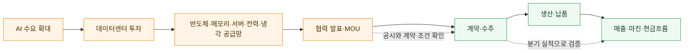

2026년 6월 젠슨 황 NVIDIA CEO의 방한과 국내 기업 경영진과의 만남은 AI·반도체·로봇·데이터센터에 대한 관심을 키우는 **촉매**가 될 수 있었습니다. 보도에 따르면 그는 LG와 휴머노이드 로봇 및 미래 데이터센터 협력을 진행한다고 밝혔습니다. 이후 7월에는 NVIDIA·SK 그룹의 AI 데이터센터·차세대 메모리 협력과 관련한 대규모 장기 계획도 보도됐습니다. 다만 CEO의 방문, 협력 의향, 양해각서(MOU), 장기 공급계약, 당기 매출은 서로 같은 단계가 아닙니다. [Reuters의 6월 LG 협력 보도](https://www.investing.com/news/stock-market-news/nvidia-ceo-says-company-is-working-with-lg-on-humanoid-robots-and-data-centers-4729748), [Reuters의 7월 AI 공급망 협력 보도](https://www.investing.com/news/stock-market-news/samsung-elec-sk-group-seal-950-billion-deals-as-south-korea-hosts-ai-powers-4812752)

방문 전후에는 기대가 먼저 움직여 메모리, 파운드리, 첨단 패키징, 장비·소재, 통신·데이터센터, 로봇 관련 종목이 함께 오르내릴 수 있습니다. 그러나 같은 ‘NVIDIA 협력’이라도 기업마다 받는 경제적 효과는 크게 다릅니다. HBM을 실제 납품하는 기업, 공장을 증설해야 하는 장비·소재 기업, 실증 단계의 로봇 기업은 매출 인식 시점·마진·투자 부담이 다르기 때문입니다.

| 국면 | 주가가 반응할 수 있는 이유 | 다음에 확인할 사실 |
| --- | --- | --- |
| 방문·면담 보도 | 협력 가능성과 기술 검증 기대가 빠르게 반영될 수 있습니다. | 회사 또는 NVIDIA의 공식 발표가 있는지, 상대방·제품·역할이 특정됐는지 확인합니다. |
| MOU·투자계획 발표 | 수주·설비투자 기대가 커질 수 있습니다. | 구속력, 계약 기간, 최소 구매 물량, 투자 주체와 자금조달 조건을 읽습니다. |
| 실제 공급·가동 | 매출·가동률·수율 개선이 나타날 가능성이 있습니다. | 분기 실적의 매출, 재고, 매출총이익률, 설비투자와 현금흐름으로 검증합니다. |
| 기대 미달 또는 지연 | 이미 반영된 기대가 되돌려지며 변동성이 커질 수 있습니다. | 고객의 Capex 축소, 공급 과잉, 기술 인증 지연, 환율·수출규제를 함께 점검합니다. |

따라서 방한 뉴스는 한국 AI 공급망의 연결 가능성을 보여 주는 정보로는 의미가 있지만, 그 자체로 개별 종목의 적정가치를 정해 주지는 않습니다. 제 의견은 **방문 당일의 주가보다 다음 분기에 공시·실적으로 확인될 주문, 가격, 마진, 투자 회수**를 더 높은 비중으로 두는 것입니다. 특히 여러 종목이 한꺼번에 ‘젠슨 황 테마’로 묶일 때는 실제 고객·제품·계약이 확인된 기업과 단순 기대만 있는 기업을 구분해야 합니다.

## 시장 전체와 내 회사는 다를 수 있습니다

시장 지수는 큰 회사의 비중이 큰 경우가 많습니다. 지수가 내려도 내가 관심 있는 산업은 오를 수 있고, 지수가 올라도 어떤 회사는 실적 문제로 내릴 수 있습니다. 따라서 시장 전체 분위기와 개별 회사의 사업·재무·공시를 구분해서 보는 습관이 필요합니다.

---

# 산업 분석


>
> 📝 **한자 병기 및 어원 사전**: 이 문서에 등장하는 용어의 한자·어원·일제강점기 유래는 → [voca.md](voca.md)

## 오늘 배울 것


- 산업 경쟁력 분석 개념 (Porter's 5 Forces)
- 산업 분석 모형: SWOT, PEST
- 산업 수명주기(Industry Life Cycle)
- 주요 산업별 분석 방법 (반도체, 2차전지, 바이오 등)
- 실습: 특정 산업 분석 리포트 작성

---

## 🔗 참고 사이트 & 데이터 원천


> 이 문서(산업 분석 — Porter's 5 Forces·SWOT·PEST·수명주기)의 실습에 필요한 공식 데이터 출처와 참고 사이트입니다. ⚿ 는 API 키 또는 승인이 필요한 항목입니다.

### 📊 국내 공식 데이터

| 기관 | URL | API 키 | 제공 데이터 |
|------|-----|--------|-------------|
| DART(전자공시시스템) | <https://opendart.fss.or.kr> | ⚿ 필요 | 기업 공시, 사업보고서, 재무제표 |
| KRX 한국거래소 | <https://www.krx.co.kr> | 불필요(웹 조회) | 업종 분류, 섹터별 지수, 상장 기업 목록 |
| KRX Data Marketplace | <https://openapi.krx.co.kr> | ⚿ 필요 | 시장 통계·지수·업종 데이터 API |
| 금융투자협회(KOFIA) | <https://www.kofia.or.kr> | 불필요(웹 조회) | 업종별 자본시장 통계 |
| 한국산업연구원(KIET) | <https://www.kiet.re.kr> | 불필요(웹 조회) | 산업 동향·전망 보고서 |
| 한국무역협회(KITA) | <https://www.kita.net> | 불필요(웹 조회) | 수출입 통계, 산업별 무역 현황 |
| 중소벤처기업부 | <https://www.mss.go.kr> | 불필요(웹 조회) | 창업·벤처 산업 현황 |

### 🌍 해외 공식 데이터

| 기관 | URL | API 키 | 제공 데이터 |
|------|-----|--------|-------------|
| SEC EDGAR | <https://www.sec.gov/developer> | 불필요 | 미국 기업 공시·재무 데이터 |
| SIC 산업 분류 (EDGAR) | <https://www.sec.gov/info/edgar/siccodes.htm> | 불필요 | 미국 표준산업분류(SIC) 코드 |
| Bloomberg Industry | <https://www.bloomberg.com/markets/sectors> | 불필요(웹 조회) | 글로벌 섹터·산업 동향 |

### 📈 차트·리서치·뉴스 참고

| 분류 | 사이트 | URL | 활용 용도 |
|------|--------|-----|-----------|
| 차트 플랫폼 | TradingView | <https://www.tradingview.com> | 섹터 ETF·업종 비교 차트 |
| 금융 포탈 | 네이버 금융 | <https://finance.naver.com> | 국내 업종별 지수·등락 현황 |
| 금융 포탈 | 다음 금융 | <https://finance.daum.net> | 섹터·테마 현황 |
| 리서치 플랫폼 | FnGuide | <https://www.fnguide.com> | 산업 리포트·컨센서스 |
| 금융 미디어 | 머니투데이 방송(MTN) | <https://mtn.co.kr> | 산업·섹터 분석 뉴스 |
| 금융 미디어 | 이데일리 | <https://www.edaily.co.kr> | 산업 동향·기업 뉴스 |
| 금융 감독 | 금융감독원(FSS) | <https://www.fss.or.kr> | 업종별 금융 감독 통계 |
| 금융 정책 | 금융위원회 | <https://www.fsc.go.kr> | 자본시장 정책 동향 |

---

### 1. 산업 경쟁력 분석 개념 (Porter's 5 Forces)

> 📖 **Wikipedia**: [포터의 다섯 가지 경쟁 요인](https://ko.wikipedia.org/wiki/포터의_다섯_가지_경쟁_요인) · [마이클 포터](https://ko.wikipedia.org/wiki/마이클_포터)

Porter's 5 Forces는 마이클 포터(Harvard)가 개발한 산업 경쟁강도 분석 도구입니다. 기업이 속한 산업의 **구조적 매력도**를 5가지 힘으로 평가합니다.


**5가지 경쟁 압력**

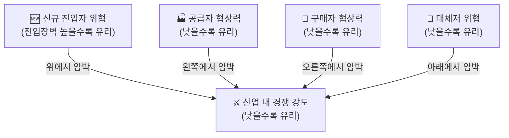

| 힘 | 설명 | 높을수록 산업 매력도 |
|----|------|---------------------|
| **신규 진입자 위협** | 새 경쟁자가 얼마나 쉽게 들어올 수 있는가 | 낮을수록 좋음 (높은 진입장벽) |
| **공급자 협상력** | 원재료·부품 공급자가 가격을 결정하는 힘 | 낮을수록 좋음 |
| **구매자 협상력** | 고객이 가격 인하를 요구할 수 있는 힘 | 낮을수록 좋음 |
| **대체재 위협** | 다른 방법으로 같은 수요를 충족시킬 수 있는 정도 | 낮을수록 좋음 |
| **기존 경쟁자 간 경쟁** | 현재 같은 산업 내 경쟁 강도 | 낮을수록 좋음 |

**적용 예시: 반도체 산업**

| 힘 | 수준 | 이유 |
|----|------|------|
| 신규 진입자 | 낮음 (진입장벽 높음) | 수십조 원의 팹 투자, 기술 장벽 |
| 공급자 협상력 | 중간~높음 | 희귀 소재·장비 독점 (ASML 등) |
| 구매자 협상력 | 중간 | 범용 메모리는 가격 경쟁, HBM은 고객 협상력 낮음 |
| 대체재 위협 | 낮음 | 반도체를 대체할 기술 없음 |
| 경쟁 강도 | 높음 | 삼성·SK하이닉스·마이크론 등 치열한 경쟁 |


### 2. 산업 분석 모형: SWOT, PEST

> 📖 **Wikipedia**: [SWOT 분석](https://ko.wikipedia.org/wiki/SWOT_분석) · [PEST 분석](https://ko.wikipedia.org/wiki/PEST_분석)

**SWOT 분석**

기업·산업의 내부 역량(S·W)과 외부 환경(O·T)을 매트릭스로 정리합니다.

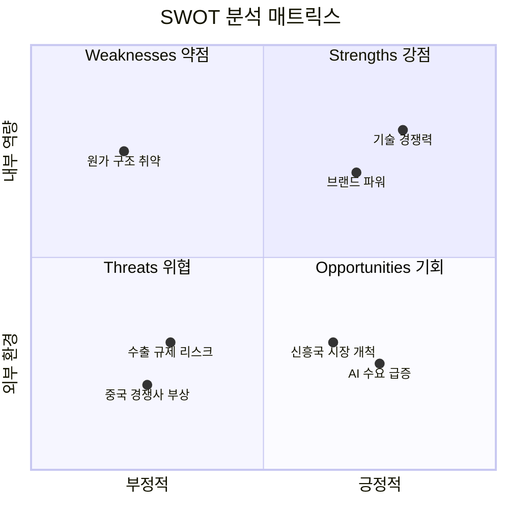


**PEST 분석**

거시환경을 4가지 관점에서 체계적으로 파악합니다.

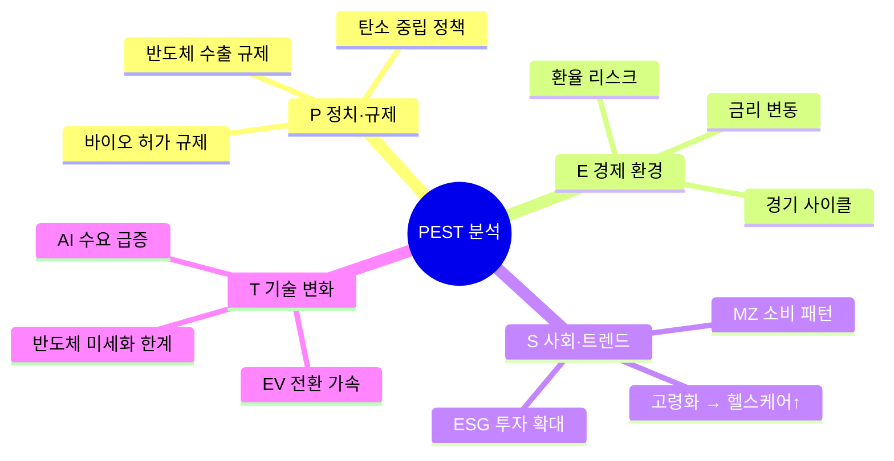

| 요소 | 내용 | 투자 관련 예시 |
|------|------|----------------|
| **P (Political)** | 정치·규제 환경 | 반도체 수출규제, 바이오 허가 규제 |
| **E (Economic)** | 경제 환경 | 금리, 환율, 경기 사이클 |
| **S (Social)** | 사회·인구 트렌드 | 고령화(헬스케어↑), MZ 소비 패턴 |
| **T (Technological)** | 기술 변화 | AI 수요 급증, EV 전환 |


---

### 3. 산업 수명주기(Industry Life Cycle)

> 📖 **Wikipedia**: [제품 수명 주기](https://ko.wikipedia.org/wiki/제품_수명_주기) · [산업](https://ko.wikipedia.org/wiki/산업)

모든 산업은 탄생부터 쇠퇴까지 전형적인 성장 곡선을 따릅니다.

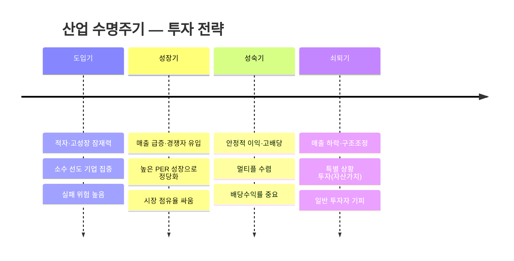


**투자 관점에서의 수명주기**

| 단계 | 특징 | 투자 시 주의점 |
|------|------|----------------|
| **도입기** | 적자, 높은 성장 잠재력 | 실패 위험 높음, 소수 선도 기업에 집중 |
| **성장기** | 매출 급증, 경쟁자 유입 | PER 높지만 성장으로 정당화 가능 |
| **성숙기** | 안정적 이익, 고배당 | 멀티플 수렴, 배당수익률 중요 |
| **쇠퇴기** | 매출 하락, 구조조정 | 특별 상황 투자(자산 가치) 외 기피 |


### 4. 주요 산업별 핵심 분석 지표

> 📖 **Wikipedia**: [반도체](https://ko.wikipedia.org/wiki/반도체) · [리튬 이온 배터리](https://ko.wikipedia.org/wiki/리튬_이온_배터리) · [바이오의약품](https://ko.wikipedia.org/wiki/바이오의약품)

산업마다 먼저 봐야 하는 숫자가 다릅니다.

**반도체**

| 지표 | 설명 |
|------|------|
| ASP (평균판매가격) | 메모리 가격 사이클 파악 |
| 가동률(Utilization Rate) | 공장 가동 효율 |
| DRAM 현물가 vs 계약가 | 수요·공급 밸런스 선행 |
| Capex(설비투자) | 차세대 투자 방향 |


**2차전지(배터리)**

| 지표 | 설명 |
|------|------|
| 배터리 팩 가격($/kWh) | 원가 경쟁력 지표 |
| 에너지 밀도(Wh/kg) | 기술 우위 |
| 리튬·코발트 원자재 가격 | 원가 변동 선행 |
| EV 침투율 | 수요 성장 모멘텀 |


**바이오·헬스케어**

| 지표 | 설명 |
|------|------|
| 임상 파이프라인 단계 | 승인 가능성과 가치 |
| FDA/MFDS 허가 | 규제 리스크 |
| 특허 만료일 | 제네릭 경쟁 진입 시점 |
| R&D 비용/매출 비율 | 연구 집중도 |


### 5. 실습: 산업 분석 리포트 작성 및 대시보드 고도화

이번 실습의 목표는 단순히 차트 1개를 그리는 것이 아니라, **공식 데이터 탐색 → API 수집 → 표준 데이터셋 생성 → 웹 대시보드 → PDF 리포트 출력**까지 이어지는 산업 분석 파이프라인을 설계하는 것입니다.

---

#### 5-1. 실습 목표

최종 산출물은 다음과 같습니다.

| 산출물 | 파일/화면 | 설명 |
|---|---|---|
| 산업 데이터 카탈로그 | `industry_sources.md` | 공식 데이터 출처, 가입/키 발급, 사용 지표 정리 |
| 가격 데이터 | `industry_prices.csv` | 대표 기업/ETF의 가격, 수익률, 변동성 |
| 재무 데이터 | `industry_financials.csv` | 매출, 영업이익, 순이익, 자산, 부채 등 |
| 표준 분석 데이터 | `industry_dataset.csv` | 기업·산업·지표를 표준 컬럼으로 통합 |
| 대시보드 이미지 | `industry_dashboard.png` | 수익률, 밸류에이션, 성장성, 5 Forces 요약 |
| 웹 API 설계 | `/api/industry/dashboard` | 산업별 데이터, 차트, 점수 반환 |
| PDF 리포트 | `industry_report.pdf` | 산업 분석 결론과 투자 유의사항 |

**분석 질문 예시**

1. 선택한 산업은 도입기, 성장기, 성숙기, 쇠퇴기 중 어디에 가까운가?
2. Porter's 5 Forces 관점에서 산업 매력도는 높은가?
3. 같은 산업 내 기업들의 매출 성장률, 이익률, 주가 수익률은 어떻게 다른가?
4. 산업 ETF와 대표 종목 중 어느 쪽의 위험 대비 성과가 좋은가?
5. PDF 리포트 한 장으로 요약한다면 어떤 결론을 제시할 수 있는가?

---

#### 5-2. 공식 데이터 탐색 및 가입

산업 분석은 데이터 출처가 섞이기 쉽습니다. 먼저 어떤 데이터가 공식 원천인지, 어떤 데이터가 보조 원천인지 구분합니다.

| 출처 | 데이터 | 인증 | 실습 활용 |
|---|---|---|---|
| [OpenDART](https://opendart.fss.or.kr/) | 국내 상장사 공시, 사업보고서, 재무제표 | API Key 필요 | 삼성전자, SK하이닉스 등 국내 기업 재무 |
| [SEC EDGAR](https://www.sec.gov/edgar/sec-api-documentation) | 미국 기업 공시, submissions, XBRL company facts | Key 불필요, User-Agent 필요 | NVIDIA, Intel, TSMC ADR 등 글로벌 기업 재무 |
| [KRX Data Marketplace](https://openapi.krx.co.kr/) | 한국 거래소 시세, 지수, 섹터, 종목 데이터 | 회원가입, 인증키/활용신청 | 국내 섹터·주식 데이터 보강 |
| [KOSIS OpenAPI](https://kosis.kr/openapi/devGuide/devGuide_0201List.do) | 산업생산, 출하, 재고, 고용 등 통계 | API Key 필요 | 산업 경기 지표 |
| [한국은행 ECOS](https://ecos.bok.or.kr/) | 금리, 환율, GDP, 산업 관련 거시지표 | API Key 필요 | 산업 PEST의 경제 환경 |
| `yfinance` | 주가, ETF, 일부 환율·원자재 | Key 불필요 | 빠른 실습과 대시보드 프로토타입 |


#### 📦 연간 출하액 및 수입액 (Year間 出荷額 · 輸入額)

KOSIS에서 제공하는 **광업제조업조사** 및 **무역통계** 데이터에서 핵심적으로 활용되는 두 지표입니다. 산업 규모·수요 구조·국내 생산 역량을 파악하는 데 필수입니다.

| 용어 | 한자 | 영문 | 정의 | 데이터 출처 |
|------|------|------|------|-------------|
| **연간 출하액** | 年間 出荷額 | Annual Shipment Value | 사업체(공장·광산)가 1년간 외부로 **출고·판매한 제품의 총 금액**. 생산 완료 후 실제로 출고된 시점 기준으로 집계 | KOSIS 광업제조업조사 |
| **연간 수입액** | 年間 輸入額 | Annual Import Value | 1년간 외국으로부터 국내로 **반입된 상품의 총 금액**. 관세청 수출입통계 기준, CIF(운임·보험 포함) 가격으로 집계 | KOSIS·한국무역협회(KITA) |

**두 지표의 관계와 투자 활용**

| 구분 | 출하액 높음 | 수입액 높음 |
|------|-------------|-------------|
| **의미** | 국내 제조업 생산·공급 확대 | 국내 수요가 크거나 자국 생산 부족 |
| **투자 시사점** | 제조 관련 기업 매출 성장 기대 | 원자재·중간재 수입 의존 → 환율·원자재 가격 리스크 |
| **경기 국면** | 동행지표 — 현재 생산 경기 반영 | 선행·동행 혼합 — 내수 및 수출 수요 파악 |

**출하액 vs 매출액 차이**

```
출하액: 공장 출고 기준 → 재고 포함 여부와 무관하게 "나간 물량"의 가치
매출액: 기업 회계 기준 → 대금 청구·인식 시점 기준 (수익 인식 원칙 적용)

예시:
  12월에 출고(출하액 집계) → 1월에 대금 청구(매출 인식)
  → 연간 출하액과 연간 매출액은 집계 시점이 다를 수 있음
```

**산업별 출하액 활용 포인트**

| 산업 | 출하액 체크 포인트 |
|------|--------------------|
| 반도체 | 분기 출하액 증감률 → 메모리 업황 사이클 선행 파악 |
| 자동차 | 완성차 출하 대수·금액 → 공장 가동률·수출 경쟁력 |
| 철강·소재 | 출하액 ÷ 생산액 비율 → 재고 누적 여부 점검 |
| 화학·정유 | 수입액 비중(원유·나프타) → 원가 구조 및 마진 변동성 |

> 💡 **투자 분석 활용**: 특정 산업의 연간 출하액이 전년 대비 증가하면 해당 업종의 **매출 성장 가시성이 높다**는 신호입니다. 반면 수입액이 동시에 급증하면 원가 부담이 커지고 있어 **영업이익률 압박** 가능성을 추가 확인해야 합니다.

`.env`에는 아래처럼 키를 저장합니다.

```bash
DART_API_KEY=발급받은_DART_KEY
KOSIS_API_KEY=발급받은_KOSIS_KEY
BOK_API_KEY=발급받은_ECOS_KEY
FRED_API_KEY=발급받은_FRED_KEY
```

추가 패키지:

```bash
pip install requests yfinance pandas matplotlib seaborn reportlab
```

---

#### 5-3. 분석 대상 산업과 기업 정의

처음에는 반도체 산업으로 실습합니다. 이후 2차전지, 바이오, 금융, 에너지로 바꿔도 같은 구조를 재사용할 수 있습니다.


**주의:** DART의 `corp_code`와 SEC의 CIK는 기업을 정확히 식별하는 키입니다. 실제 프로젝트에서는 티커만 저장하지 말고 원천 식별자를 반드시 함께 저장합니다.

---

#### 5-4. 표준 데이터셋 스키마

여러 원천을 하나로 합치려면 표준 컬럼이 필요합니다.

| 컬럼 | 예시 | 설명 |
|---|---|---|
| `date` | `2024-12-31` | 기준일 |
| `industry` | `Semiconductor` | 산업명 |
| `company` | `NVIDIA` | 기업명 |
| `ticker` | `NVDA` | 시장 티커 |
| `country` | `US` | 국가 |
| `source` | `DART`, `SEC`, `YFINANCE` | 데이터 출처 |
| `metric` | `revenue`, `operating_income`, `price_return_1y` | 지표명 |
| `value` | `12345.0` | 값 |
| `unit` | `KRW`, `USD`, `%` | 단위 |
| `period` | `FY2024`, `2024Q4`, `1Y` | 기간 |

---

#### 5-5. 1단계: 주가·ETF 데이터 수집


---

### 위의 0401.py 를 실행해 보세요.

---
# 📊 상관관계 히트맵과 변동성 분석 쉽게 이해하기

## 🟦 상관관계 히트맵
상관관계 히트맵은 **친구들이 얼마나 같이 움직이는지** 보여주는 그림이에요.

- 예시:  
  - 철수랑 영희가 항상 같이 뛰어놀면 → **둘은 비슷하게 움직인다 (상관관계 높음)**  
  - 철수는 축구만 하고, 영희는 책만 읽으면 → **둘은 다르게 움직인다 (상관관계 낮음)**  

주식도 똑같아요.  
- 삼성전자와 SK하이닉스는 같은 반도체 회사라서 가격이 비슷하게 움직일 때가 많아요.  
- 엔비디아와 인텔은 서로 다른 길을 갈 때도 있어서 덜 비슷하게 움직일 수 있어요.  

👉 히트맵은 “누가 누구랑 같이 움직이는지”를 색깔로 보여주는 **친구 관계도** 같은 거예요.

---

## 📈 변동성 분석 (Rolling Volatility)
변동성은 **얼마나 흔들리는지**를 나타내요.

- 예시:  
  - 철수가 매일 똑같이 10분만 뛰면 → **안정적 (변동성 낮음)**  
  - 영희는 어떤 날은 1시간 뛰고, 어떤 날은 안 뛰면 → **들쭉날쭉 (변동성 높음)**  

주식도 마찬가지예요.  
- 어떤 회사 주가는 매일 조금씩만 움직이면 → 안전한 느낌 (변동성 낮음).  
- 어떤 회사 주가는 하루에 훅 오르거나 훅 떨어지면 → 위험한 느낌 (변동성 높음).  

👉 **30일 이동 변동성**은 “최근 한 달 동안 얼마나 흔들렸는지”를 보여주는 그래프예요.

---


### 생성된 csv 를 기반으로 AI 를 이용해서 위의 예시를 기반으로 하는 아래와 유사한 py 소스를 만들어 테스트 하세요.

```
import seaborn as sns

# 상관관계 계산
##########################

# 히트맵 그리기
#################################################
#################################################

plt.title("Correlation Heatmap of Semiconductor Stocks")
plt.tight_layout()
plt.savefig("correlation_heatmap.png", dpi=150, bbox_inches="tight")
plt.show()
```

```
# 30일 이동 변동성 계산
volatility = returns.rolling(window=30).std()

# 그래프 그리기
###################################################
###################################################
###################################################

plt.title("30-Day Rolling Volatility")
plt.ylabel("Volatility (%)")
plt.grid(True, alpha=0.3)
plt.legend()
plt.tight_layout()
plt.savefig("rolling_volatility.png", dpi=150, bbox_inches="tight")
plt.show()
```


#### 5-6. 2단계: OpenDART 재무 데이터 수집

DART는 국내 기업의 사업보고서와 주요 재무계정을 가져오는 데 사용합니다.


---

#### 5-7. 3단계: SEC EDGAR company facts 수집

SEC의 `companyfacts` API는 CIK 기준으로 XBRL 재무 항목을 JSON으로 제공합니다. 요청 시 User-Agent를 명확히 넣는 것이 좋습니다.


---

#### 5-8. 4단계: 표준 데이터셋 생성


---

#### 5-9. 5단계: 산업 대시보드 생성


---

#### 5-10. 웹 대시보드/API 설계

현재 repo의 산업 분석 API를 다음처럼 고도화할 수 있습니다.

| 엔드포인트 | 메서드 | 역할 |
|---|---|---|
| `/api/industry/sources` | `GET` | DART, SEC, KRX, KOSIS 등 사용 가능 데이터 출처 반환 |
| `/api/industry/companies` | `GET` | 산업별 대표 기업/ETF 목록 반환 |
| `/api/industry/dashboard` | `POST` | 가격·재무·SWOT·5 Forces·수명주기 대시보드 반환 |
| `/api/industry/financials` | `POST` | DART/SEC 재무 데이터 수집 및 표준화 |
| `/api/industry/report.pdf` | `POST` | 산업 분석 PDF 리포트 생성 |

**요청 예시**


**응답 예시**


**권장 파일 구조**

```text
app
├── backend
│   ├── services
│   │   ├── industry_sources.py       # DART/SEC/KRX/KOSIS/yfinance 수집
│   │   ├── industry_normalizer.py    # 표준 스키마 변환
│   │   ├── industry_scoring.py       # 5 Forces, SWOT, 수명주기 점수화
│   │   ├── industry_visualizer.py    # 대시보드 차트 생성
│   │   └── industry_report.py        # PDF/Markdown 리포트 생성
│   └── main.py
└── frontend
    └── js
        └── views
            └── industryDashboard.js
```

---

#### 5-11. PDF 리포트 구성

PDF는 “차트를 많이 넣는 자료”가 아니라, 투자자가 바로 결론을 읽을 수 있는 문서로 구성합니다.

```text
표지
  - 산업명, 분석 기간, 작성일, 데이터 출처

1페이지: Executive Summary
  - 산업 수명주기
  - 산업 매력도
  - 핵심 수혜/위험 요인
  - 대표 기업 성과 요약

2페이지: 산업 구조 분석
  - Porter's 5 Forces
  - 진입장벽, 공급자, 구매자, 대체재, 경쟁 강도

3페이지: 기업·ETF 비교
  - 1년 누적 수익률
  - 변동성
  - 재무 성장성/수익성

4페이지: SWOT/PEST
  - 정책, 경제, 사회, 기술 요인
  - 강점, 약점, 기회, 위협

5페이지: 결론과 유의사항
  - 투자 아이디어
  - 리스크
  - 데이터 한계
```

간단한 PDF 출력은 `matplotlib.backends.backend_pdf.PdfPages`로 시작할 수 있습니다.


---

#### 5-12. 리포트 템플릿

```markdown
# 산업 분석 리포트

## 1. 분석 대상


- 산업:
- 대표 기업:
- 대표 ETF:
- 분석 기간:
- 데이터 출처:

## 2. 산업 구조


- Porter's 5 Forces:
- 산업 매력도:
- 진입장벽:
- 공급망 리스크:

## 3. 수명주기 판단


- 현재 단계:
- 근거:
- 다음 단계로 이동할 신호:

## 4. 기업/ETF 비교


- 수익률:
- 변동성:
- 매출 성장:
- 이익률:
- 밸류에이션:

## 5. SWOT/PEST


- Strength:
- Weakness:
- Opportunity:
- Threat:
- P/E/S/T 요인:

## 6. 결론


- 투자 아이디어:
- 주요 리스크:
- 추가 확인 데이터:
```

---

#### 5-13. 실습 체크리스트

- [ ] `industry_sources.md`에 공식 데이터 출처와 키 발급 방법 정리
- [ ] `industry_prices.csv` 생성
- [ ] `industry_dart_financials.csv` 또는 `industry_sec_financials.csv` 생성
- [ ] `industry_dataset.csv` 표준 스키마 생성
- [ ] `industry_dashboard.png` 생성
- [ ] Porter's 5 Forces 점수표 작성
- [ ] SWOT/PEST 표 작성
- [ ] `/api/industry/dashboard` 요청/응답 설계
- [ ] `industry_report.pdf` 생성

---

## 해보기 활동


1. 관심 있는 산업 1개를 고르고, 공식 데이터 출처를 DART/SEC/KRX/KOSIS/ECOS/yfinance 중 최소 3개 이상으로 정리하세요.
2. 선택 산업의 대표 기업 5개와 대표 ETF 1개를 정하고 `industry_prices.csv`와 `industry_price_return.png`를 생성하세요.
3. 국내 기업은 OpenDART, 미국 기업은 SEC EDGAR에서 재무 데이터를 1개 이상 수집해 `industry_dataset.csv` 표준 스키마로 변환하세요.
4. Porter's 5 Forces 각 항목을 0~10점으로 평가하고, 점수의 근거를 한 문장씩 작성하세요.
5. SWOT/PEST 분석표를 작성하고, 각 항목을 대시보드나 PDF에 넣을 수 있는 짧은 문장으로 정리하세요.
6. `/api/industry/dashboard`와 `/api/industry/report.pdf`를 만든다고 가정하고 요청 JSON, 응답 JSON, 서비스 파일 구조를 설계하세요.
7. 최종 결과를 `industry_report.pdf` 목차에 맞춰 정리하고, 투자 결론과 데이터 한계를 함께 작성하세요.

---

# 빅테크 기업들의 AI 투자 전략

빅테크 기업들은 AI 분야에 천문학적인 자금을 투입하고 있습니다. 이는 단순한 기술 개발 지원을 넘어, **미래 산업의 주도권을 확보하기 위한 전략적 포트폴리오 투자**입니다.

## 1. 주요 투자 현황

- **마이크로소프트 (Microsoft)**  
  OpenAI (ChatGPT 개발사)에 **약 130억 달러** 투자.  
  Azure 클라우드와 긴밀하게 연계되어 있으며, Bing, Copilot 등 자사 제품에 기술 통합.

- **구글 (Google)**  
  경쟁사 **Anthropic** (Claude AI 개발사)에 **약 400억 달러** 투자.  
  자체 Gemini (제미나이) 모델을 보유하고 있음에도 대규모 투자 단행.

- **아마존 (Amazon)**  
  - Anthropic에 **80억 달러**  
  - OpenAI에 추가 **500억 달러**  
  경쟁 관계에 있는 두 주요 AI 기업에 **동시 투자**.

## 2. 투자 행태의 특징과 이상함

일반적인 산업 논리에서 보기 드문 전략입니다.

- 구글은 자사 모델(Gemini)과 경쟁하는 Anthropic에 대규모 투자  
- 아마존은 경쟁사인 OpenAI와 Anthropic **둘 다**에 투자  

이는 마치 **삼성전자가 TSMC에 투자**하거나, **신한은행이 우리은행에 투자**하는 것과 유사한 상황입니다.

## 3. 투자 이유: 승자를 예측할 수 없다

AI 기술의 발전 속도가 매우 빠르고, 리더십이 급변하기 때문입니다.

- **2년 전 (2023년경)**: OpenAI가 ChatGPT로 압도적 선두
- **현재**: Anthropic의 Claude가 빠른 성장세로 추격
- **미래**: 내년 또는 그 이후에는 새로운 플레이어(xAI, Meta 등)가 등장할 가능성 높음

### 빅테크가 분산 투자하는 주요 목적

- **리스크 헤징 (Risk Hedging)**: 단일 기업에 모든 것을 걸지 않음
- **승자 독식 대비**: 최종 승자에 미리 지분 확보
- **기술 접근권 확보**: 투자 기업의 최신 모델을 우선적으로 활용
- **생태계 영향력 유지**: AI 시장 전체 성장의 이익 공유

## 4. 전략적 함의

이러한 “**모든 말에 베팅(Betting on All Horses)**” 전략은 AI가 아직 초기 단계이며, 기술·비즈니스 모델·규제 환경이 모두 불확실하다는 점을 명확히 보여줍니다.

빅테크 기업들은 단순 투자자가 아닌 **전략적 파트너**로서의 위치를 확보하려 하고 있으며, 이는 앞으로도 상당 기간 지속될 가능성이 높습니다.


---

# 글로벌 주식 시장별 티커(종목 코드) 체계 비교 가이드

국내외 주식 시장에서 사용하는 티커(Ticker, 종목 코드)는 국가 및 거래소마다 고유의 규칙을 가지고 있습니다. 한국(코스피/코스닥), 중국, 일본 및 미국의 티커 체계와 차이점을 상세히 정리한 자료입니다.

---

## 1. 대한민국 주식 시장 (코스피 vs 코스닥)

한국거래소(KRX) 시스템상 **코스피(KOSPI)와 코스닥(KOSDAQ)의 티커 구성 방식에는 차이가 없습니다.** 두 시장 모두 동일한 표준 체계를 따릅니다.

* **기본 구조:** 표준 코드(12자리)에서 유래한 **6자리 단축 코드**를 사용합니다.
* **보통주:** 숫자로만 구성된 6자리 체계입니다.
    * *예시:* 삼성전자 (`005930` - 코스피), 에코프로비엠 (`247540` - 코스닥)
* **우선주:** 보통주 코드 끝에 `K`, `L`, `M` 등의 알파벳이 붙거나 `1`, `2` 같은 숫자가 조합되어 6자리를 맞춥니다.
    * *예시:* 삼성전자우 (`005935`)

### 💡 번호 대역에 대한 오해와 진실
> **"코스피는 앞자리가 0이고, 코스닥은 숫자가 더 큰가요?"**
> 
> 이는 시장 구분이 아니라 **상장 시기**에 따른 착시 현상입니다. 과거에 상장된 유서 깊은 대기업(주로 코스피)들이 `00XXXX` 계열의 낮은 번호를 선점했고, 비교적 최근에 상장된 기업들이나 IT·바이오 벤처기업(주로 코스닥)들이 `2XXXXX`, `3XXXXX` 등의 높은 번호를 배정받았기 때문입니다. 코스피에 새로 상장하는 기업도 기존 번호가 만료되면 큰 숫자를 부여받으므로 **티커 숫자만으로는 시장을 완벽히 구분할 수 없습니다.**

---

## 2. 중국 주식 시장 (상하이 / 선전 / 홍콩)

중국은 한국과 마찬가지로 **6자리 숫자**를 사용하지만, **앞자리 숫자를 통해 시장과 주식 종류(내국인용 A주 / 외국인용 B주 등)를 명확하게 구분**할 수 있다는 점이 특징입니다.

* **상하이 증권거래소 (SSE):** 주로 `60XXXX` 또는 메인보드 외에 기술주 중심의 과창판은 `688XXX`로 시작합니다.
    * *예시:* 귀주모태주 (`600519`)
* **선전 증권거래소 (SZSE):** 주로 `00XXXX` 또는 벤처·성장기업 중심의 창업판은 `30XXXX`로 시작합니다.
    * *예시:* BYD(비야디) (`002594`)
* **홍콩 증권거래소 (HKEX):** 중국 본토와 달리 **4자리 또는 5자리 숫자** 티커를 사용합니다.
    * *예시:* 텐센트 (`00700` 또는 `700`)

---

## 3. 일본 주식 시장 (도쿄 증권거래소)

일본(도쿄증권거래소 - TSE)은 전통적으로 **4자리 숫자** 티커를 사용해 왔으나, 최근 번호 고갈 문제로 새로운 변화를 겪고 있습니다.

* **업종별 번호대 지정:** 과거부터 업종에 따라 대략적인 번호대를 나누어 배정했습니다. (예: 7000번대는 수송용 장비·자동차, 6000~7000번대는 전기기기 및 전자 부품 등)
    * *예시:* 토요타 자동차 (`7203`), 소니 그룹 (`6758`), 닌텐도 (`7974`)
* **최근의 변화 (알파벳 도입):** 4자리 숫자가 점차 부족해짐에 따라, **2024년 1월 이후 신규 상장하는 기업부터는 4자리 중 두 번째와 네 번째 자리에 영문 알파벳을 혼용**하여 부여하기 시작했습니다. (예: `1A2B` 형태)

---

## 4. 미국 주식 시장 (NYSE / NASDAQ)

아시아 국가들이 주로 숫자를 사용하는 반면, 미국은 기업명을 직관적으로 유추할 수 있는 **영문 알파벳 문자(1~5글자)**를 티커로 사용합니다.

* **구조:** 회사명에서 자음을 따거나 브랜드명을 그대로 사용합니다.
    * *예시:* 애플 (`AAPL`), 마이크로소프트 (`MSFT`), 테슬라 (`TSLA`), 아마존 (`AMZN`)
* **시장 구분:** 과거에는 글자 수(뉴욕증권거래소는 1~3자, 나스닥은 4자 이상)로 시장 구분이 어느 정도 가능했으나, 현재는 규정이 완화되어 티커 글자 수만으로는 거래소를 구분하기 어렵습니다.

---

## 📊 한눈에 비교하는 글로벌 주식 티커 체계 요약

| 국가 | 주요 거래소 | 티커 형태 | 시장/업종 식별성 | 주요 특징 |
| :--- | :--- | :--- | :--- | :--- |
| **한국** | 코스피 / 코스닥 | **6자리 숫자** | 불가능 | 상장 시기에 따라 순차 부여 (구분 모호) |
| **중국** | 상하이 / 선전 | **6자리 숫자** | **가능 (앞자리 번호대)** | 앞자리로 시장 및 주식 종류(A주/B주) 식별 가능 |
| **일본** | 도쿄 (TSE) | **4자리 숫자** (최근 알파벳 혼용) | **가능 (업종별 번호대)** | 번호 부족으로 인해 2024년부터 알파벳 조합 시작 |
| **미국** | NYSE / NASDAQ | **영문 알파벳 (1~5자)** | 불가능 | 기업명을 직관적으로 연상할 수 있는 문자 중심 |

---
*본 가이드는 한국거래소(KRX) 및 글로벌 주요 거래소의 표준 종목 코드 체계를 기준으로 작성되었습니다.*

---

# 산업 분석 실습


---

>
> 📝 **한자 병기 및 어원 사전**: 이 문서에 등장하는 용어의 한자·어원·일제강점기 유래는 → [voca.md](voca.md)

## 오늘 배울 것 (아주 쉽게)

- 산업별 핵심 지표(KPI) 정리
- 동종 업계 비교 분석 (Peer Comparison)
- 산업 뉴스·공시 데이터 활용
- 실습: 산업별 주요 종목 재무 비교

---

## 🔗 참고 사이트 & 데이터 원천

> 이 문서(산업 분석 실습 — KPI·Peer Comparison·공시 데이터)의 실습에 필요한 공식 데이터 출처와 참고 사이트입니다. ⚿ 는 API 키 또는 승인이 필요한 항목입니다.

### 📊 국내 공식 데이터

| 기관 | URL | API 키 | 제공 데이터 |
|------|-----|--------|-------------|
| DART(전자공시시스템) | <https://opendart.fss.or.kr> | ⚿ 필요 | 사업보고서, 재무제표, 임원·대주주 현황 |
| KRX 한국거래소 | <https://www.krx.co.kr> | 불필요(웹 조회) | 업종 분류, 시가총액, 거래량 통계 |
| KRX Data Marketplace | <https://openapi.krx.co.kr> | ⚿ 필요 | 업종·종목별 시장 통계 API |
| KIND(상장공시시스템) | <https://kind.krx.co.kr> | 불필요(웹 조회) | 상장 기업 공시·재무 요약 |
| 금융투자협회(KOFIA) | <https://www.kofia.or.kr> | 불필요(웹 조회) | 자본시장 통계·업종별 현황 |
| 금융감독원(FSS) DART | <https://www.fss.or.kr> | 불필요(웹 조회) | 공시·감독 통계 정보 |

### 🌍 해외 공식 데이터

| 기관 | URL | API 키 | 제공 데이터 |
|------|-----|--------|-------------|
| SEC EDGAR Company Facts | <https://data.sec.gov/api/xbrl/companyfacts> | 불필요 | 미국 기업 XBRL 재무 데이터 |
| yfinance (PyPI) | <https://pypi.org/project/yfinance> | 불필요 | 주가·재무·배당 데이터 (야후 파이낸스) |

### 📈 리서치·뉴스·포탈 참고

| 분류 | 사이트 | URL | 활용 용도 |
|------|--------|-----|-----------|
| 리서치 플랫폼 | FnGuide | <https://www.fnguide.com> | 산업 리포트·종목 컨센서스·KPI |
| 리서치 플랫폼 | 에프앤가이드 데이터 | <https://comp.fnguide.com> | 재무·멀티플·Peer 데이터 |
| 차트 플랫폼 | TradingView | <https://www.tradingview.com> | 업종별 비교 차트 |
| 차트 플랫폼 | Investing.com | <https://www.investing.com> | 섹터 ETF·종목 비교 |
| 금융 포탈 | 네이버 금융 | <https://finance.naver.com> | 업종별 등락·종목 현황 |
| 금융 포탈 | 다음 금융 | <https://finance.daum.net> | 업종·테마 현황 |
| 금융 미디어 | 머니투데이 방송(MTN) | <https://mtn.co.kr> | 산업·종목 분석 뉴스 |
| 금융 미디어 | 연합인포맥스 | <https://news.einfomax.co.kr> | 업종·기업 속보 |
| 증권사 리서치 | 미래에셋증권 리서치 | <https://securities.miraeasset.com> | 업종·종목 리포트 |
| 증권사 리서치 | 삼성증권 리서치 | <https://www.samsungpop.com> | Peer Comparison 리포트 |

---

### 1. 산업별 핵심 지표(KPI) 정리

> 📖 **Wikipedia**: [핵심 성과 지표](https://ko.wikipedia.org/wiki/핵심_성과_지표)

**개념**

KPI(Key Performance Indicator)는 산업마다 다릅니다. 어떤 숫자를 먼저 봐야 하는지 알아야 분석이 깊어집니다.


| 산업 | 핵심 KPI | 의미 |
|------|----------|------|
| 반도체 | ASP(평균판매단가), 가동률 | 가격 사이클과 공급 여력 |
| 유통·커머스 | 점포당 매출, 객단가, GMV | 운영 효율성 |
| 플랫폼·SaaS | MAU(월활성사용자), ARR, 이탈률 | 성장성과 유지율 |
| 금융·은행 | NIM(순이자마진), ROE, 대손충당금 | 수익성과 건전성 |
| 정유·화학 | 크랙마진, 정제마진, 스프레드 | 제품가-원가 차이 |
| 바이오 | 임상단계, R&D/매출 비율 | 파이프라인 가치 |

- 업종별로 가장 의미 있는 2~3개 지표를 고르는 기준을 익히는 것이 핵심입니다.
- 숫자를 많이 보는 것이 아니라 **의미 있는 숫자를 선택**하는 능력이 산업 분석의 핵심입니다.

### 2. 동종 업계 비교 분석 (Peer Comparison)

> 📖 **Wikipedia**: [벤치마킹](https://ko.wikipedia.org/wiki/벤치마킹) · [기업 가치 평가](https://ko.wikipedia.org/wiki/기업_가치_평가)

**개념**

한 회사를 혼자 보지 않고 비슷한 구조의 경쟁사와 나란히 놓고 상대 평가합니다.


비교 항목 예시:

| 지표 | 왜 비교하나 |
|------|------------|
| 매출 성장률 | 같은 시장에서 누가 빠르게 크는가 |
| 영업이익률 | 같은 매출로 누가 더 많이 남기는가 |
| PER/PBR | 시장이 각 기업을 어떻게 다르게 평가하는가 |
| 부채비율 | 재무 건전성 차이 |
| ROE | 자본 효율성 |

- 비교 대상의 **사업 구조가 실제로 비슷한지** 먼저 확인해야 멀티플 차이를 제대로 해석할 수 있습니다.
- "절대 점수"보다 **비교 위치**를 파악하는 연습이 중요합니다.

**Peer Comparison 분석 흐름**

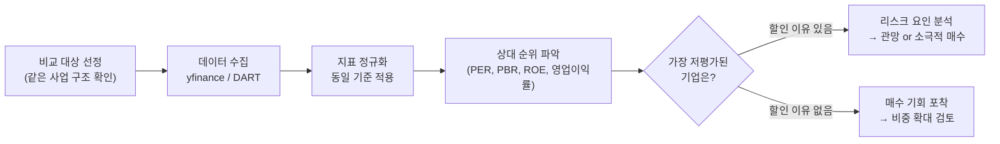

### 3. 산업 뉴스·공시 데이터 활용

> 📖 **Wikipedia**: [공시](https://ko.wikipedia.org/wiki/공시_(자본시장))

**개념**

재무 숫자만으로는 "왜 숫자가 바뀌었는지" 알 수 없습니다. 뉴스와 공시를 병행해야 원인을 파악할 수 있습니다.


**공시 종류와 투자 관련도**

| 공시 유형 | 내용 | 투자 관련 포인트 |
|-----------|------|-----------------|
| 실적 발표 | 분기·연간 재무결과 | 컨센서스 대비 서프라이즈 여부 |
| 유상증자 | 신규 주식 발행 | 단기 희석 부담 vs 장기 투자 재원 |
| 자사주 매입 | 회사가 자기 주식 구매 | 주주환원 신호, 저평가 자신감 |
| 대규모 수주 | 신규 계약 체결 | 미래 매출 가시성 확보 |
| 경영권 변경 | 대주주 지분 변동 | 기업 방향성 변화 |

- 실적이 좋아졌다면 "무슨 사건이 있었는지", 실적이 나빠졌다면 "일시적 요인인지 구조적 문제인지"를 함께 적는 습관이 분석 품질을 높입니다.

**공시 → 투자 판단 연결 흐름**

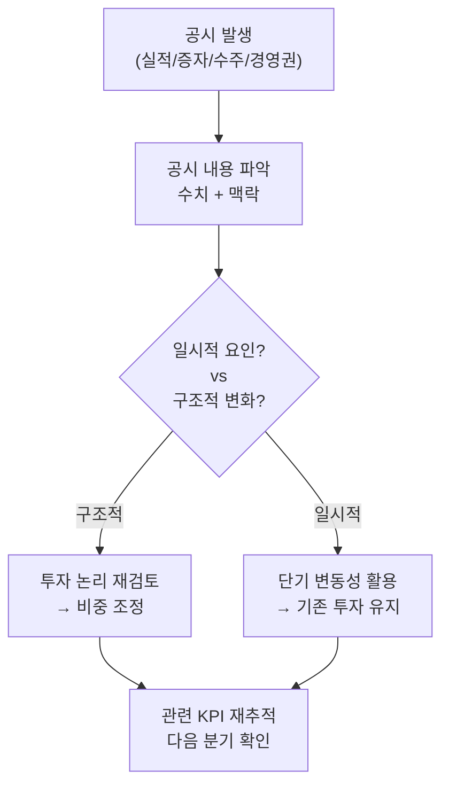

### 4. 실습: 산업별 주요 종목 재무 비교 고도화


#### 4-1. 고도화 목표: 단순 재무 4종에서 다차원 Peer 비교로 확장

기존 실습은 `PER`, `PBR`, `ROE`, `영업이익률`을 막대 차트로 비교하는 수준입니다. 고도화 실습에서는 같은 기업을 **성장성·수익성·안정성·효율성·밸류에이션·모멘텀·리스크·산업 KPI** 관점으로 나누어 봅니다.

| 분석 축 | 대표 지표 | 핵심 질문 |
|---|---|---|
| 성장성 | 매출 성장률, EPS 성장률, 영업이익 성장률 | 누가 더 빠르게 크는가? |
| 수익성 | 매출총이익률, 영업이익률, 순이익률, ROE, ROA | 같은 매출로 누가 더 많이 남기는가? |
| 안정성 | 부채비율, 유동비율, 순차입금 | 침체기에도 버틸 수 있는가? |
| 효율성 | 자산회전율, 재고회전율, 운전자본 회전 | 자산을 얼마나 효율적으로 쓰는가? |
| 밸류에이션 | PER, PBR, PSR, EV/EBITDA | 성장과 이익 대비 비싼가 싼가? |
| 모멘텀 | 1개월/3개월/1년 수익률, 52주 고점 대비 낙폭 | 시장이 지금 선호하는가? |
| 리스크 | 변동성, 최대낙폭(MDD), 베타 | 가격 위험이 큰가? |
| 산업 KPI | HBM 비중, NIM, ARR, 수주잔고, R&D/매출 | 업종의 진짜 경쟁력이 있는가? |

최종 산출물:

```text
peer_raw_metrics.csv
peer_comparison_dataset.csv
peer_score_table.csv
peer_comparison_dashboard.png
peer_comparison_report.md
```

---

#### 4-2. 비교 대상과 원천 식별자 정리


비교 대상은 “같은 산업”이라는 이름만으로 묶지 말고, 실제 사업 구조가 얼마나 비슷한지 먼저 기록합니다. 예를 들어 NVIDIA와 SK하이닉스는 모두 반도체지만 매출 구조와 마진 구조가 크게 다르므로, 멀티플 차이를 그대로 저평가/고평가로 해석하면 위험합니다.

---

#### 4-3. 다차원 지표 수집 코드


`yfinance.info`는 결측이 있을 수 있으므로, 실제 보고서에서는 DART/SEC/사업보고서 원문으로 중요한 수치를 재확인합니다.

---

#### 4-4. 표준 비교 데이터 만들기


---

#### 4-5. Peer 점수화

낮을수록 좋은 지표(`부채비율`, `PER`, `변동성`)는 점수 방향을 뒤집습니다.


---

#### 4-6. 입체적 시각화: 히트맵, 산점도, 종합 점수


---

#### 4-7. 산업별 KPI 추가

재무제표만으로는 산업의 핵심 경쟁력을 놓칠 수 있습니다. 업종별 KPI를 직접 입력하거나 공시에서 추출해 추가합니다.

| 산업 | KPI 예시 | 비교 포인트 |
|---|---|---|
| 반도체 | HBM 매출 비중, Capex, 가동률, ASP | 사이클과 기술 우위 |
| 2차전지 | 수주잔고, 배터리 출하량, kWh당 원가 | 규모의 경제와 원가 |
| SaaS | ARR, NRR, CAC Payback, Churn | 반복매출 품질 |
| 은행 | NIM, 연체율, CET1, 대손비용률 | 수익성과 건전성 |
| 바이오 | 파이프라인 단계, 임상 성공률, R&D/매출 | 기술 옵션 가치 |


---

#### 4-8. 고도화 웹앱/API 설계

기존 `/api/industry/peer`는 4개 지표 막대 차트 중심입니다. 고도화 버전은 지표 그룹, 점수화, 차트 타입, 산업 KPI를 선택할 수 있게 설계합니다.

| 엔드포인트 | 메서드 | 역할 |
|---|---|---|
| `/api/industry/peer-advanced` | `POST` | 다차원 Peer 비교 데이터와 차트 반환 |
| `/api/industry/peer-scores` | `POST` | 성장·수익·안정·밸류·모멘텀 점수 계산 |
| `/api/industry/peer-kpi` | `POST` | 산업별 KPI 입력/저장/점수화 |
| `/api/industry/peer-report` | `POST` | Markdown/PDF용 분석 요약 생성 |

**요청 예시**

```json
{
  "industry": "Semiconductor",
  "peers": {
    "Samsung Electronics": "005930.KS",
    "SK Hynix": "000660.KS",
    "NVIDIA": "NVDA",
    "Intel": "INTC",
    "TSMC ADR": "TSM"
  },
  "metric_groups": ["growth", "profitability", "stability", "valuation", "momentum", "risk"],
  "chart_types": ["heatmap", "scatter_growth_value", "roe_pbr", "score_bar"],
  "include_industry_kpi": true,
  "period": "1y"
}
```

**응답 예시**

```json
{
  "industry": "Semiconductor",
  "top_peer": "NVIDIA",
  "undervalued_candidates": ["SK Hynix"],
  "risk_flags": [
    "Intel은 수익성과 모멘텀 점수가 낮아 turnaround 여부 확인 필요",
    "국가와 회계 기준이 섞여 있어 환율 및 회계기준 차이 조정 필요"
  ],
  "charts": {
    "dashboard": "<base64 PNG>",
    "heatmap": "<base64 PNG>",
    "scatter": "<base64 PNG>"
  },
  "table": [
    {"company": "NVIDIA", "growth_score": 95, "profitability_score": 90, "valuation_score": 35, "total_score": 78}
  ]
}
```

**화면 탭 구성**

```text
1. Overview: 종합 점수, 상위/하위 기업, 위험 플래그
2. Metrics: 재무 지표 테이블, 결측 표시, 단위 표시
3. Valuation: PER/PBR/PSR/EV/EBITDA 비교
4. Quality: ROE/ROA/마진/현금흐름 비교
5. Risk: 부채비율/변동성/MDD 비교
6. Industry KPI: 업종 특화 KPI 입력 및 점수화
7. Report: Markdown/PDF 리포트 생성
```

---

#### 4-9. 리포트 템플릿

```markdown
# 산업별 Peer Comparison 리포트

## 1. 비교 대상


- 산업:
- 기업:
- 기간:
- 데이터 출처:

## 2. 종합 결론


- 가장 균형 잡힌 기업:
- 성장성 1위:
- 수익성 1위:
- 밸류에이션 매력 후보:
- 주요 리스크:

## 3. 지표별 분석


- 성장성:
- 수익성:
- 안정성:
- 효율성:
- 밸류에이션:
- 모멘텀/리스크:

## 4. 산업 KPI 분석


- 핵심 KPI:
- KPI 기준 우위 기업:
- 재무 지표와 KPI의 차이:

## 5. 투자 판단


- 관심 기업:
- 관망 기업:
- 추가 확인 데이터:
- 데이터 한계:
```

---

#### 4-10. 실습 체크리스트

- [ ] 비교 기업 4~6개 선정
- [ ] `peer_raw_metrics.csv` 생성
- [ ] `peer_comparison_dataset.csv` 생성
- [ ] `peer_score_table.csv` 생성
- [ ] `peer_comparison_dashboard.png` 생성
- [ ] 산업별 KPI 3개 이상 추가
- [ ] `/api/industry/peer-advanced` 요청/응답 설계
- [ ] `peer_comparison_report.md` 작성

---

## 웹앱 실습 연계


Python Quant Lab 웹앱의 **산업 분석** 메뉴는 현재 4개의 탭으로 구성됩니다. 이번 실습에서는 기존 탭을 유지하되, Peer Comparison 탭을 `peer-advanced` 방식으로 확장하는 방향을 설계합니다.

### API 전체 흐름

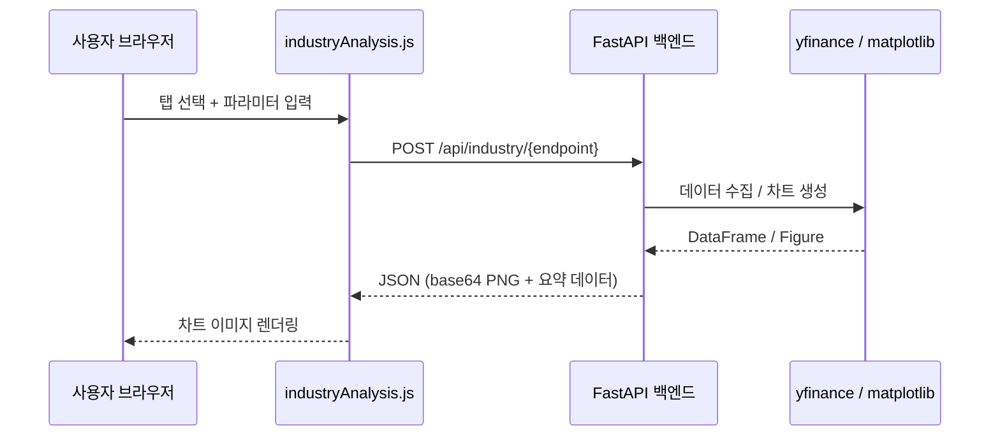

---

### 탭 1 — 포터 5 Forces 분석

```
POST /api/industry/porter
Content-Type: application/json
```

**요청 예시**

```json
{
  "industry": "2차전지",
  "scores": {
    "경쟁강도":      7.0,
    "신규진입 위협": 4.0,
    "대체재 위협":   3.0,
    "구매자 교섭력": 6.0,
    "공급자 교섭력": 8.0
  }
}
```

- scores 값 범위: 0(위협 없음) ~ 10(위협 극대)
- 5개 키 모두 필수 입력

**응답**

```json
{
  "chart": "<base64 PNG 문자열>",
  "summary": {
    "경쟁강도": 7.0,
    "신규진입 위협": 4.0,
    "대체재 위협": 3.0,
    "구매자 교섭력": 6.0,
    "공급자 교섭력": 8.0
  }
}
```

반환된 차트는 5개 축의 레이더(거미줄) 차트로, 산업 매력도를 한눈에 파악할 수 있습니다.

---

### 탭 2 — 섹터 비교

```
POST /api/industry/sector
Content-Type: application/json
```

**요청 예시**

```json
{
  "tickers": ["SOXX", "XLE", "XLF", "XLV", "XLK", "XLI"],
  "period": "1y"
}
```

| 티커 | 섹터 |
|------|------|
| SOXX | 반도체 |
| XLE  | 에너지 |
| XLF  | 금융 |
| XLV  | 헬스케어 |
| XLK  | IT |
| XLI  | 산업재 |

- tickers를 생략하면 위 6개 ETF가 기본값으로 사용됩니다.
- period 예시: `"1y"`, `"6mo"`, `"3mo"`, `"ytd"`

**응답**

```json
{
  "chart": "<base64 PNG 문자열>",
  "performance": {
    "SOXX": 32.5,
    "XLK":  28.1,
    "XLV":  12.3,
    "XLF":   9.8,
    "XLE":  -3.2,
    "XLI":   7.6
  }
}
```

---

### 탭 3 — Peer Comparison

```
POST /api/industry/peer
Content-Type: application/json
```

**요청 예시**

```json
{
  "tickers": {
    "삼성전자":  "005930.KS",
    "SK하이닉스": "000660.KS",
    "엔비디아":  "NVDA",
    "TSMC":     "TSM"
  }
}
```

- 키: 화면에 표시될 회사 이름 (한글 가능)
- 값: Yahoo Finance 티커 (한국 주식은 `.KS` 또는 `.KQ` 접미사)

**응답**

```json
{
  "chart": "<base64 PNG 문자열>",
  "data": [
    { "기업": "삼성전자", "PER": 13.2, "PBR": 1.1, "ROE": 8.5, "영업이익률": 12.3 },
    { "기업": "SK하이닉스", "PER": 18.7, "PBR": 1.9, "ROE": 14.2, "영업이익률": 22.1 }
  ]
}
```

차트는 PER, PBR, ROE, 영업이익률 4개 지표를 나란히 비교하는 막대 차트입니다.

---

### 탭 4 — 수명주기 분석

```
POST /api/industry/lifecycle
Content-Type: application/json
```

**요청 예시**

```json
{
  "stage": "성장기",
  "industry": "AI 반도체"
}
```

- stage: `"도입기"` | `"성장기"` | `"성숙기"` | `"쇠퇴기"` 중 하나

**응답**

```json
{
  "chart": "<base64 PNG 문자열>",
  "strategy": "성장기 산업은 높은 PER을 감수하더라도 시장 점유율 확대 기업에 집중. 진입 경쟁이 심화되므로 해자(moat) 보유 여부 확인 필수."
}
```

수명주기 곡선 위에 현재 단계 위치가 강조 표시되고, 해당 단계의 투자 전략이 텍스트로 함께 제공됩니다.

---

### 프론트엔드 연동 구조

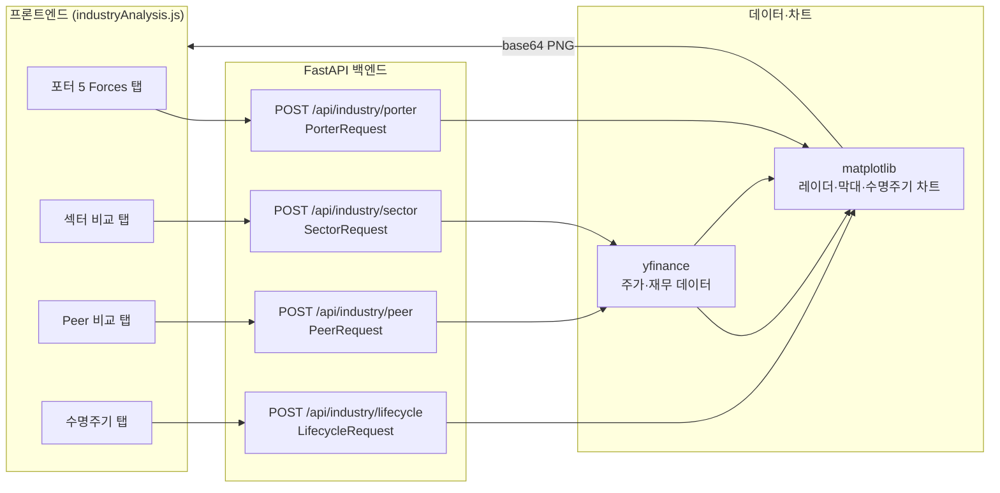

---

## 해보기 활동


1. 관심 있는 산업 1개를 고르고 비교 기업 4~6개를 선정하세요. 비교 대상의 사업 구조가 어떻게 비슷하고 어떻게 다른지 먼저 적으세요.
2. 성장성, 수익성, 안정성, 밸류에이션, 모멘텀, 리스크 지표를 각각 2개 이상 골라 `peer_comparison_dataset.csv`를 만드세요.
3. 점수화 규칙을 직접 정하고 `peer_score_table.csv`를 생성한 뒤, 종합 점수 1위 기업과 그 이유를 설명하세요.
4. PER vs 매출 성장률, ROE vs PBR 산점도를 그리고 “비싸지만 좋은 기업”과 “싸지만 이유가 있는 기업”을 구분해보세요.
5. 선택 산업의 업종 KPI를 3개 이상 추가하고, 재무 지표만 봤을 때와 결론이 달라지는지 비교하세요.
6. 기존 `/api/industry/peer`보다 확장된 `/api/industry/peer-advanced`의 요청 JSON, 응답 JSON, 화면 탭 구성을 설계하세요.
7. 최종 결과를 `peer_comparison_report.md` 템플릿에 맞춰 정리하세요.

---

# 한국 주식 시장 섹터 구분

## 주요 분류 기준
한국 주식 시장에서는 국제 표준 **GICS**를 기반으로 하되, 국내 실정에 맞춘 **WICS**(FnGuide 제공) 기준을 가장 널리 사용합니다.  
증권사 HTS, 네이버 금융 등에서 주로 확인할 수 있는 체계입니다.

## 대분류 섹터 (WICS/GICS 기준)

| 대분류 (Sector)       | 주요 포함 업종 예시                          | 특징 |
|-----------------------|---------------------------------------------|------|
| **에너지**            | 석유·가스, 에너지 장비·서비스               | 원자재 가격에 민감 |
| **소재 (Materials)**  | 화학, 철강, 비철금속, 종이·목재            | 경기 민감 |
| **산업재**            | 기계, 건설, 운송, 자본재                    | 경기 민감 |
| **경기소비재**        | 자동차, 의류, 유통, 소비자 서비스           | 경기 민감 (임의소비) |
| **필수소비재**        | 식품, 음료, 담배, 가정용품                  | 경기 방어적 |
| **건강관리 (헬스케어)** | 제약, 의료기기, 바이오                      | 성장주 성격 강함 |
| **금융**              | 은행, 보험, 증권, 다각화 금융               | 금리·경기 영향 |
| **IT (정보기술)**     | 반도체, 디스플레이, 소프트웨어, 하드웨어   | 한국 시장 대표 섹터 |
| **통신서비스**        | 이동통신, 통신 장비                         | 안정적 현금 흐름 |
| **유틸리티**          | 전기·가스, 수도 등                           | 규제 산업, 방어적 |

> ※ GICS 기준으로는 **부동산** 섹터가 별도로 존재하나, WICS에서는 금융이나 기타로 분류되는 경우가 많습니다.

## 기타 분류 방식
- **한국거래소(KRX) 산업지수**: 코스피·코스닥별 업종 분류 (전기전자, 화학, 의약품 등)
- **통계청 KSIC**: 경제 활동 기준 산업 분류
- **테마 섹터**: 2차전지, 반도체, 바이오, 방산, 로봇 등 투자자 중심 세부 그룹

## 참고 사항
- 섹터별 성과는 경기 사이클, 금리 환경, 글로벌 수요 등에 따라 크게 변동됩니다.
- 실시간 섹터 현황은 증권사 HTS나 네이버 금융의 업종/섹터 메뉴에서 확인 가능합니다.

---

# 📊 ETF 리밸런싱

## 📌 핵심 개념
- **[리밸런싱 정의](ca://s?q=ETF_리밸런싱_정의)**: 처음 설정한 자산 비율(예: 주식 70%, 채권 30%)을 시장 변동으로 인해 달라진 비율을 원래대로 되돌리는 과정  
- **[목적](ca://s?q=ETF_리밸런싱_목적)**:
  - 리스크 관리 (한쪽 자산 쏠림 방지)  
  - 수익 실현 (상승 자산 일부 매도)  
  - 저가 매수 효과 (하락 자산 비중 확대)  

---

## 🔄 리밸런싱 방식
- **[정기 리밸런싱](ca://s?q=ETF_정기_리밸런싱)**: 6개월~1년마다 고정된 시점에 실행. 장기 투자자에게 적합  
- **[비정기 리밸런싱](ca://s?q=ETF_비정기_리밸런싱)**: 자산 비율이 목표 대비 ±5% 이상 변할 때 실행. 적극적 투자자에게 유용  
- **[자동 리밸런싱](ca://s?q=ETF_자동_리밸런싱)**: 증권사 MTS, 로보어드바이저 활용. 초보자에게 편리  

---

## 📊 리밸런싱 효과 (시뮬레이션)
- **리밸런싱 없음**: 평균수익률 7.1%, 변동성 13.5%, 최대낙폭 -28%  
- **연 1회 리밸런싱**: 평균수익률 7.8%, 변동성 11.9%, 최대낙폭 -22%  

👉 단순히 비율을 되돌렸을 뿐인데 **수익률 상승 + 리스크 감소** 효과  

---

## ⚖️ 비교: 정기 vs 트리거 리밸런싱
| 방식 | 장점 | 단점 |
|------|------|------|
| **[정기 리밸런싱](ca://s?q=ETF_정기_리밸런싱)** | 단순, 관리 용이 | 시장 급변 시 대응 부족 |
| **[트리거 리밸런싱](ca://s?q=ETF_비정기_리밸런싱)** | 유연, 리스크 대응 | 관리 복잡, 거래 비용 증가 |

---

# M7과 MANGOS — 미국 빅테크 투자 용어

M7과 **MANGOS(망고스)**는 개별 기업의 이름이 아니라, **미국 뉴욕 증시를 이끄는 거대 빅테크 기업들을 묶어서 부르는 투자 용어(신조어)**입니다. 두 용어에 포함된 기업들은 다음과 같습니다.

## 1. M7 (Magnificent 7)

2023~2024년 미국 증시 상승을 주도했던 7대 대형 기술 기업을 뜻합니다.

- Microsoft (마이크로소프트)
- Apple (애플)
- NVIDIA (엔비디아)
- Google (구글 / 알파벳)
- Amazon (아마존)
- Meta (메타 / 구 페이스북)
- Tesla (테슬라)

## 2. MANGOS (망고스)

최근 AI(인공지능)와 우주 항공 중심의 패권 변화에 맞춰 M7을 대체하기 위해 월가에서 새롭게 떠오른 6대 거물 기업군의 앞 글자를 딴 단어입니다. 기존 M7에서 스마트폰, 이커머스 중심이었던 애플, 아마존, MS, 테슬라가 빠지고 핵심 AI 및 우주 인프라 기업들이 들어간 것이 특징입니다.

- Meta (메타) - AI 모델 생태계 구축
- Anthropic (앤트로픽) - '클로드'를 개발한 AI 스타트업
- NVIDIA (엔비디아) - AI 반도체 압도적 1위
- Google (구글) - AI 인프라 및 클라우드
- OpenAI (오픈AI) - '챗GPT' 개발사
- SpaceX (스페이스X) - 일론 머스크의 우주 기업 (위성통신망 스타링크 인프라)

> 💡 **요약**: M7이나 망고스라는 이름의 회사가 있는 것이 아니라, 미국 주식시장에서 가장 잘나가는 메타, 엔비디아, 구글, 오픈AI, 스페이스X 같은 초거대 테크 기업들을 묶어서 부르는 별명입니다.

---

# 무어의 법칙과 황의 법칙 — 반도체 산업의 성장 공식과 투자 시사점

> 📖 **Wikipedia**: [무어의 법칙](https://ko.wikipedia.org/wiki/무어의_법칙)
>

M7·MANGOS에 속한 기업 대부분(NVIDIA, Google, Meta, Apple)의 사업 기반은 결국 **반도체 성능이 얼마나 빨리, 얼마나 싸게 좋아지는가**에 달려 있습니다. 이 흐름을 설명하는 두 가지 핵심 법칙이 무어의 법칙과 황의 법칙입니다. 위 4-7절의 반도체 KPI(HBM 비중, Capex, 가동률, ASP)를 해석할 때도 이 두 법칙이 배경 논리로 자주 쓰입니다.

## 1. 무어의 법칙 (Moore's Law)

**제안자**: 고든 무어(Gordon Moore), 인텔(Intel) 공동창업자 — 1965년 논문 "Cramming more components onto integrated circuits"에서 처음 제시

**핵심 내용**: 반도체 집적회로(IC) 안에 들어가는 **트랜지스터 수가 약 18~24개월마다 2배로 늘어난다**는 경험적 법칙입니다. (1965년 초안에서는 "매년 2배"라고 했다가, 1975년 "2년마다 2배"로 수정했고, 실무에서는 흔히 "18개월"로 인용됩니다.)

| 항목 | 내용 |
|---|---|
| 의미 | 트랜지스터 집적도 ↑ → 연산 성능 ↑, 단가 ↓가 기하급수적으로 동시에 진행 |
| 근거 기술 | 미세공정(Process Node) 축소 — 90nm → 65nm → 28nm → 7nm → 3nm → 2nm |
| 산업 영향 | 반도체·PC·스마트폰·클라우드 산업 50년 성장의 근본 동력 |
| 최근 논쟁 | 원자 크기 한계에 근접하며 "무어의 법칙 둔화/종료" 논쟁 지속 |
| 대안 기술 | GAA(Gate-All-Around) 트랜지스터, 3D 적층(Chiplet), EUV 노광, More than Moore(패키징 혁신) |

**투자 관점 시사점**

- 파운드리(TSMC·삼성전자 파운드리) 업체의 **공정 미세화 로드맵**은 곧 기술 경쟁력이자 밸류에이션의 근거가 됩니다.
- 무어의 법칙이 둔화될수록 성능 향상의 무게중심이 **설계·패키징(Chiplet, HBM 적층)** 쪽으로 이동 — 이는 위 4-7절 KPI 표의 "HBM 매출 비중"이 최근 반도체 기업 경쟁력 평가에서 중요해진 배경이기도 합니다.
- Capex 사이클(신규 공장·장비 투자) 분석 시, "다음 미세공정 전환 시점이 언제인가"를 함께 봐야 합니다.

## 2. 황의 법칙 (Hwang's Law, 黃의 法則)

**제안자**: 황창규(Hwang Chang-gyu), 당시 삼성전자 반도체총괄 사장 — 2002년 국제반도체회로학술회의(ISSCC)에서 발표

**핵심 내용**: **메모리 반도체(특히 낸드플래시)의 집적도가 매년(1년마다) 2배씩 증가한다**는 법칙으로, 무어의 법칙(18~24개월 주기)보다 더 빠른 성장 속도를 주장했습니다. 1999년부터 2002년까지 삼성전자가 매년 세계 최초로 용량이 2배인 메모리 신제품(플래시메모리)을 출시한 실적을 근거로 제시되었습니다.

| 항목 | 내용 |
|---|---|
| 발표 시점/장소 | 2002년, ISSCC(국제반도체회로학술회의) |
| 대상 | D램이 아닌 낸드플래시 등 메모리 반도체 집적도 |
| 주기 | 1년(무어의 법칙 대비 2배 빠른 속도) |
| 상징성 | 한국(삼성전자)이 메모리 반도체 기술 주도권을 쥐었음을 보여주는 상징적 법칙 |
| 이후 전개 | 2008년 전후로 매년 2배 성장세가 꺾이면서 "황의 법칙이 깨졌다"는 평가도 존재 — 이후 메모리 산업은 다시 무어의 법칙에 가까운 속도로 회귀 |

**투자 관점 시사점**

- 황의 법칙은 삼성전자·SK하이닉스 등 **한국 메모리 반도체 기업의 기술 프리미엄**을 설명하는 논리로 자주 인용됩니다.
- 다만 2008년 이후 성장 속도가 둔화된 사례는, "기술 우위가 영원하지 않으며 사이클마다 재검증이 필요하다"는 교훈으로 활용할 수 있습니다 — 위 4-2절에서 강조한 "비교 대상 기업의 사업 구조가 실제로 비슷한지 확인" 원칙과 같은 맥락입니다.
- 최근 HBM(고대역폭 메모리) 경쟁에서 SK하이닉스·삼성전자·마이크론이 다시 "누가 더 빠르게 용량/대역폭을 2배로 늘리는가" 경쟁을 벌이는 것은 황의 법칙적 서사가 재현되는 사례로 볼 수 있습니다.

## 3. 혼동 주의 — 또 다른 "황(Huang)의 법칙"

영어권에서는 NVIDIA CEO **젠슨 황(Jensen Huang)**이 주장한 "GPU의 AI 연산 성능이 무어의 법칙보다 훨씬 빠르게(하드웨어 미세화뿐 아니라 CUDA·텐서코어 등 소프트웨어·아키텍처 최적화까지 더해) 매년 수 배씩 향상된다"는 주장을 언론이 **"Huang's Law"**라고 부르기도 합니다. 한글로 표기하면 삼성 황창규의 "황의 법칙"과 똑같이 들리지만, **제안자·대상·시기가 전혀 다른 별개의 개념**이므로 자료를 읽을 때 어느 "황의 법칙"을 가리키는지 문맥으로 구분해야 합니다.

| 구분 | 황의 법칙 (황창규) | Huang's Law (젠슨 황) |
|---|---|---|
| 제안자 | 황창규 (삼성전자) | 젠슨 황 (NVIDIA CEO) |
| 발표 시기 | 2002년 | 2018년 이후 NVIDIA 발표 자료에서 반복 언급 |
| 대상 | 메모리 반도체(낸드플래시) 집적도 | GPU의 AI 연산 성능(하드웨어+소프트웨어 종합) |
| 투자 연결 | 삼성전자·SK하이닉스 메모리 사이클 | NVIDIA·AI 반도체 밸류에이션 근거 |

## 4. 두 법칙과 반도체 Peer 비교 실습 연결

위 4절의 반도체 Peer Comparison 실습(삼성전자·SK하이닉스·NVIDIA·Intel·TSMC)에서 두 법칙은 다음과 같이 해석에 활용할 수 있습니다.

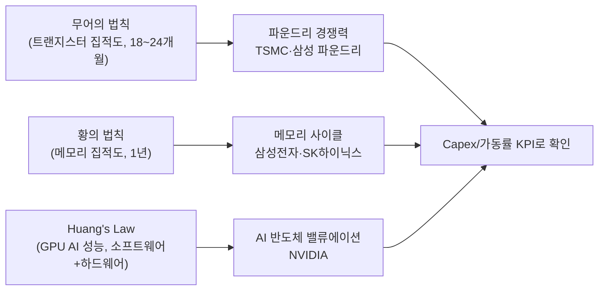

- **밸류에이션 정당화 논리 검증**: "이 회사는 법칙대로 계속 2배씩 성장할 것"이라는 서사만으로 고밸류에이션을 받아들이기 전에, 실제 KPI(ASP, 가동률, HBM 비중 등)로 법칙이 실제로 유지되고 있는지 확인해야 합니다.
- **사이클 전환점 포착**: 황의 법칙처럼 한때 유효했던 성장 속도가 꺾인 사례가 있으므로, "성장 둔화 신호"를 조기에 감지하는 것이 리스크 관리의 핵심입니다.

---

# 반도체 소비량의 시대별 변화와 주식투자 열풍

> 📖 **Wikipedia**: [반도체](https://ko.wikipedia.org/wiki/반도체) · [닷컴 버블](https://ko.wikipedia.org/wiki/닷컴_버블) · [반도체 슈퍼사이클](https://ko.wikipedia.org/wiki/반도체_산업)
>

반도체는 "무엇에 쓰이는가"가 시대마다 바뀌면서 소비량이 계단식으로 폭증해 왔고, 그 계단마다 증시에서는 관련 기업을 중심으로 한 투자 열풍이 함께 일어났습니다. 위에서 다룬 무어의 법칙·황의 법칙이 "얼마나 빨리 좋아지는가"를 설명한다면, 이 절은 "무엇이 그 성능을 다 소비했는가 — 그리고 그때 투자자들은 무엇을 샀는가"를 시대순으로 정리합니다.

## 1. 태동기 (1970~80년대) — 계산기·군수·초기 컴퓨터

- **소비처**: 계산기, 군사·항공 전자장비, 메인프레임 컴퓨터 등 제한적 산업 수요
- **핵심 사건**: 인텔(Intel)의 마이크로프로세서 4004(1971) 출시, 이후 일본 반도체 기업(NEC·도시바·히타치)이 D램 시장에서 미국을 압도하며 부상
- **투자 열풍**: 1980년대 **일본 반도체 버블** — 일본 기업들이 세계 D램 시장의 절반 이상을 차지하며 도쿄 증시 반도체·전자주가 급등. 이후 1986년 미·일 반도체 협정과 엔고로 성장세가 꺾이며 버블 논란으로 이어짐

## 2. PC 혁명기 (1980년대 말~1990년대) — 개인용 컴퓨터의 보급

- **소비처**: IBM PC 호환기종 확산, 인텔 x86 CPU + 마이크로소프트 윈도우(Wintel 동맹)
- **핵심 사건**: 삼성전자가 1983년 반도체 사업 진출을 선언하며 메모리 반도체 후발주자로 등장, 1990년대 들어 D램 세계 1위로 도약
- **투자 열풍**: 미국 나스닥에서 인텔·마이크로소프트가 "PC 성장주"로 재평가받으며 장기 상승, 한국에서도 삼성전자가 코스피 대표주로 자리잡기 시작

## 3. 닷컴 버블기 (1990년대 말~2000년대 초) — 인터넷 인프라 수요

- **소비처**: 인터넷 서버, 통신 장비(라우터·스위치), 초고속 인터넷 모뎀
- **핵심 사건**: 1995~2000년 "인터넷이 세상을 바꾼다"는 기대감에 통신·반도체 장비 투자가 과잉으로 몰림
- **투자 열풍**: **닷컴 버블(Dot-com Bubble)** — 나스닥 지수가 2000년 3월 5,000선까지 폭등했다가 이후 2년간 78% 폭락. 실제 수요보다 앞서간 설비 투자와 묻지마 투자가 겹쳐 반도체·통신장비주가 급등락한 대표 사례입니다.

## 4. 모바일·스마트폰기 (2007~2010년대 중반) — 손안의 컴퓨터

- **소비처**: 스마트폰용 AP(모바일 프로세서), 낸드플래시, 카메라 이미지센서
- **핵심 사건**: 2007년 애플 아이폰 출시 이후 전 세계 스마트폰 보급이 폭발적으로 확산, 퀄컴(AP), 삼성전자·SK하이닉스(메모리), TSMC(파운드리)가 동반 성장
- **투자 열풍**: 애플이 시가총액 세계 1위로 부상하며 "애플 밸류체인(공급망)" 투자 테마가 형성. 국내에서는 스마트폰 부품·소재주가 코스닥 대표 테마로 부각

## 5. 클라우드·데이터센터기 (2010년대) — 서버향 메모리 슈퍼사이클

- **소비처**: 아마존 AWS·마이크로소프트 애저·구글 클라우드 등 하이퍼스케일러의 데이터센터 서버
- **핵심 사건**: 기업들이 자체 서버 대신 클라우드로 전환하면서 서버향 D램·SSD 수요가 급증, 2017~2018년 메모리 반도체 가격이 사상 최고치로 치솟은 **1차 반도체 슈퍼사이클**
- **투자 열풍**: 삼성전자·SK하이닉스 주가가 사상 최고가를 경신했고, 클라우드 3사(아마존·마이크로소프트·구글)가 미국 증시 대형 성장주로 자리매김

## 6. 팬데믹 특수기 (2020~2022년) — 비대면 수요와 반도체 대란

- **소비처**: 재택근무용 PC·노트북, 화상회의 장비, 게임기(콘솔), 이후 경기 회복과 함께 자동차용 반도체
- **핵심 사건**: 코로나19로 인한 비대면 수요 폭증 → 반도체 공장 가동 차질과 겹치며 **글로벌 반도체 공급 대란**(차량용 반도체 품귀) 발생
- **투자 열풍**: 2020~2021년 전 세계적 "동학개미·서학개미" 주식투자 붐과 맞물려 삼성전자·SK하이닉스·필라델피아 반도체지수(SOX)가 급등, 이후 2022년 금리 인상과 수요 둔화로 급락하는 사이클을 재현

## 7. AI 붐기 (2022년 말~현재) — 생성형 AI와 GPU·HBM 슈퍼사이클

- **소비처**: 생성형 AI 모델 학습·추론용 GPU, HBM(고대역폭 메모리), AI 데이터센터 인프라
- **핵심 사건**: 2022년 11월 OpenAI의 챗GPT(ChatGPT) 출시를 기점으로 빅테크들의 AI 인프라 투자가 폭증. 엔비디아의 AI 반도체(GPU)와 SK하이닉스·삼성전자의 HBM이 핵심 병목 부품으로 부상
- **투자 열풍**: 엔비디아가 2023~2024년 사이 시가총액 세계 1위권으로 도약하며 M7·MANGOS(위 참고) 같은 신조어를 낳았고, 국내에서는 SK하이닉스가 HBM 경쟁력을 앞세워 시가총액 상위권으로 재평가. "AI 반도체 = 21세기 원유"라는 비유가 등장할 만큼 반도체 소비량과 주가가 강하게 연동

## 시대별 요약표

| 시대 | 핵심 소비처 | 대표 기업 | 투자 열풍 |
|---|---|---|---|
| 1970~80년대 | 계산기·군수·메인프레임 | 인텔, 일본 D램 3사 | 일본 반도체 버블 |
| 1980년대 말~90년대 | 개인용 PC | 인텔, 마이크로소프트, 삼성전자 | Wintel 성장주 랠리 |
| 1990년대 말~2000년대 초 | 인터넷 서버·통신장비 | 시스코, 인텔 | 닷컴 버블·붕괴 |
| 2007~2010년대 중반 | 스마트폰 | 애플, 퀄컴, TSMC | 애플 밸류체인 테마 |
| 2010년대 | 클라우드 데이터센터 | 삼성전자, SK하이닉스, AWS | 1차 메모리 슈퍼사이클 |
| 2020~2022년 | 비대면·차량용 반도체 | 삼성전자, SOX 지수 전반 | 동학개미·서학개미 붐 → 급락 |
| 2022년 말~현재 | 생성형 AI GPU·HBM | 엔비디아, SK하이닉스 | AI 반도체 슈퍼사이클 |

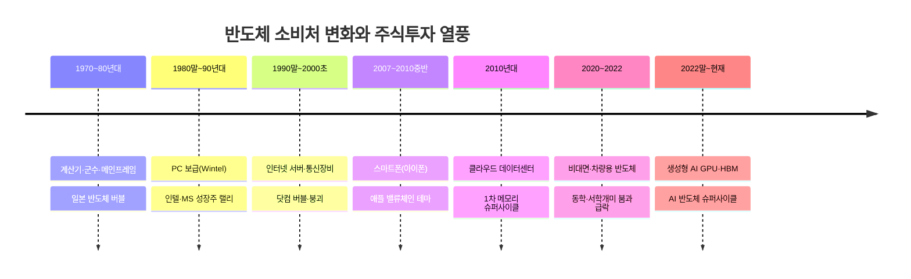

## 📌 핵심 인사이트

- **반도체 소비량은 "무엇이 새로 대중화되는가"를 따라 계단식으로 늘어났습니다.** 계산기 → PC → 인터넷 → 스마트폰 → 클라우드 → AI 순으로 소비처가 바뀔 때마다 반도체 수요의 규모 자체가 한 단계씩 커졌습니다.
- **모든 소비처 전환기마다 예외 없이 증시 열풍이 동반되었습니다.** 다만 열풍이 실제 수요 증가로 뒷받침된 경우(PC, 스마트폰, 클라우드, AI)와 수요를 과도하게 앞서간 경우(닷컴 버블)가 섞여 있어, 열풍 자체가 항상 정당한 것은 아니었습니다.
- **한국 기업(삼성전자·SK하이닉스)은 메모리 반도체라는 한 축을 통해 매 사이클에 반복적으로 올라탔습니다.** PC 시대의 D램, 스마트폰 시대의 낸드, 클라우드 시대의 서버 D램, AI 시대의 HBM까지 — 소비처는 바뀌었지만 "메모리를 판다"는 사업 구조는 이어지고 있습니다.

## ⚠️ 전략적 시사점

- 새로운 반도체 소비처가 등장할 때(예: AI) 초기에는 **인프라(GPU·HBM) 공급 기업**이 먼저 수혜를 받고, 이후 그 인프라 위에서 돌아가는 **응용 서비스 기업**으로 수혜가 확산되는 패턴을 참고할 수 있습니다.
- 닷컴 버블 사례처럼, "이번 소비처는 다르다"는 서사만으로 투자하기보다 위 4-7절의 산업 KPI(가동률, ASP, 수주잔고 등)로 **실제 수요가 투자 규모를 따라오고 있는지** 점검하는 습관이 중요합니다.
- 반도체 슈퍼사이클은 상승과 하강이 반복되는 경기순환(Cyclical) 산업 특성을 가지므로, 매수 시점뿐 아니라 사이클 후반부에 나타나는 재고 증가·가격 하락 신호를 함께 추적해야 합니다.

---

# 나노공정(Process Node)의 기술적 의미

> 📖 **Wikipedia**: [반도체 소자 제작](https://ko.wikipedia.org/wiki/반도체_소자_제작) · [FinFET](https://ko.wikipedia.org/wiki/FinFET) · [극자외선 노광](https://ko.wikipedia.org/wiki/극자외선_노광)
>

앞서 무어의 법칙에서 "미세공정(Process Node)"이라는 표현이 나왔습니다. 뉴스에서 흔히 "삼성전자 3나노 파운드리", "TSMC 2나노 양산" 같은 문구를 접하는데, 이 "나노(nm)"가 실제로 무엇을 의미하는지 정확히 아는 투자자는 많지 않습니다. 이 절에서는 나노공정의 기술적 실체와, 그것이 왜 반도체 기업의 경쟁력·주가를 좌우하는지 설명합니다.

## 1. "나노(nm)"가 원래 가리키던 것

- 1990~2000년대 초까지 공정 이름(예: 90nm, 65nm)은 트랜지스터의 **게이트 길이(Gate Length)**, 즉 전류를 켜고 끄는 스위치 부분의 실제 물리적 크기를 의미했습니다.
- 이 수치가 작을수록 트랜지스터 하나의 크기가 작아지고, 같은 면적(웨이퍼)에 더 많은 트랜지스터를 집어넣을 수 있어 무어의 법칙(집적도 2배 증가)이 성립했습니다.

## 2. 2010년대 이후 — "나노"는 실제 크기가 아닌 마케팅 이름

- 2011년 인텔이 22nm 공정에 **FinFET(3차원 입체 트랜지스터)** 구조를 처음 도입하면서부터, 공정 이름의 숫자와 실제 물리적 치수가 더 이상 일치하지 않게 되었습니다.
- 이후 각 파운드리(TSMC·삼성·인텔)마다 같은 "7nm"라도 실제 트랜지스터 밀도가 다르며, 사실상 **세대 구분을 위한 브랜드 명칭**에 가깝습니다.
- 그래서 최근에는 실제 성능 비교 시 나노 숫자보다 **트랜지스터 밀도(mm²당 개수), 전력 효율, 클럭 속도** 같은 실측 지표를 함께 확인해야 합니다.

## 3. 미세공정을 가능하게 한 핵심 기술 3가지

| 기술 | 도입 시점(대략) | 기술적 의미 |
|---|---|---|
| **FinFET(핀펫)** | 2011년 22nm(인텔) | 트랜지스터를 평면이 아닌 지느러미(Fin) 모양 3차원 구조로 세워, 누설전류를 줄이고 집적도를 높임 |
| **EUV(극자외선) 노광** | 2018년 7nm 전후(삼성·TSMC) | 기존 DUV(불화아르곤) 광원보다 파장이 훨씬 짧은 극자외선을 사용해 더 미세한 회로 패턴을 웨이퍼에 새김 |
| **GAA(Gate-All-Around) / 나노시트** | 2022년 3nm(삼성전자 세계 최초 양산) | FinFET보다 한 단계 더 발전한 구조로, 게이트가 채널을 4면 모두 감싸 전류 제어력을 극대화 |

## 4. 공정이 미세해질수록 좋아지는 것 3가지

| 효과 | 설명 |
|---|---|
| **성능(속도) 향상** | 트랜지스터가 작아질수록 전자 이동 거리가 짧아져 더 빠른 클럭 속도 구현 가능 |
| **소비전력·발열 감소** | 같은 연산을 더 적은 전압·전류로 처리 → 스마트폰 배터리 수명, 데이터센터 전기료에 직결 |
| **웨이퍼당 칩 생산량(원가) 개선** | 칩 하나의 면적이 작아지면 원판(웨이퍼) 한 장에서 더 많은 칩을 뽑아낼 수 있어 개당 원가 하락 |

## 5. 투자 관점에서 나노공정이 중요한 이유

- **파운드리 경쟁의 핵심 지표**: TSMC·삼성전자·인텔 파운드리는 "누가 더 미세한 공정을 먼저, 더 높은 수율(Yield)로 양산하는가"로 고객사(애플·엔비디아·퀄컴)를 유치합니다. 수율이 낮으면 아무리 미세공정이 앞서도 수익성이 나빠집니다.
- **최선단(Leading-edge) vs 레거시(Legacy) 공정 분리**: 최신 AI 칩·모바일 AP는 최선단 공정(3nm 이하)이 필요하지만, 차량용 반도체·전력 반도체는 여전히 28nm 이상의 성숙 공정으로도 충분한 경우가 많아, 기업의 공정 포트폴리오에 따라 수혜 사이클이 다릅니다.
- **설비투자(Capex) 부담의 근거**: 미세공정으로 갈수록 EUV 노광 장비(ASML 독점 공급) 한 대당 가격이 수천억 원에 달해, 최선단 경쟁에 뛰어들 수 있는 기업이 TSMC·삼성전자·인텔 등 소수로 압축되는 배경이 됩니다.

---

# 한국의 반도체 강국 지위와 주식투자 열풍의 관계

> 📖 **Wikipedia**: [대한민국의 반도체 산업](https://ko.wikipedia.org/wiki/대한민국의_반도체_산업) · [삼성전자](https://ko.wikipedia.org/wiki/삼성전자) · [SK하이닉스](https://ko.wikipedia.org/wiki/SK하이닉스)
>

한국이 메모리 반도체 세계 1위 국가가 된 과정과, 국내 증시에서 반도체주가 "국민주"로 자리잡은 과정은 서로 떼어놓고 볼 수 없습니다. 반도체 산업의 성장이 곧 한국 개인투자자들의 자산 형성 역사와 겹치기 때문입니다.

## 1. 한국 반도체 산업의 태동 (1974~1983년)

- 1974년 한국반도체(현 SK하이닉스의 전신 중 하나)가 국내 최초로 반도체 웨이퍼 가공에 진출했지만 기술·자본 부족으로 고전했습니다.
- **1983년 2월 이병철 삼성 회장의 '도쿄 선언'**: 당시 세계 시장이 이미 일본·미국 기업들로 포화 상태였음에도, 삼성이 반도체(D램) 사업에 본격 진출하겠다고 선언했습니다. 업계에서는 무모한 도전이라는 평가가 지배적이었습니다.
- 같은 해 삼성은 미국·일본보다 훨씬 짧은 기간에 64K D램 개발에 성공하며 후발주자 추격의 발판을 마련했습니다.

## 2. 추격과 역전 (1980년대 말~1990년대)

- 삼성전자는 1992년 세계 최초로 64M D램을 개발하며 처음으로 메모리 반도체 기술에서 선두로 올라섰고, 이후 D램 시장 점유율 세계 1위를 지속적으로 유지하게 됩니다.
- 현대전자(현 SK하이닉스)도 D램 시장에 뛰어들며 한국은 삼성·현대(LG반도체) 등 복수 기업이 경쟁하는 구도를 형성했습니다.

## 3. IMF 외환위기와 구조조정 (1997~2001년)

- 1997년 외환위기 이후 정부 주도의 '빅딜(대규모 사업 교환)' 정책으로 LG반도체와 현대전자의 반도체 사업이 강제 통합되었습니다.
- 이 통합 법인이 이후 채권단 관리를 거쳐 2012년 SK그룹에 인수되며 지금의 **SK하이닉스**가 되었습니다. 즉, 오늘날 한국 메모리 반도체를 지탱하는 "삼성전자-SK하이닉스 양강 구도"는 외환위기 구조조정의 결과물입니다.

## 4. 메모리 초강국 지위 확립 (2000년대~현재)

- 2000년대 이후 한국은 D램·낸드플래시 세계 시장 점유율에서 지속적으로 50~70% 안팎을 차지하며 명실상부한 메모리 반도체 초강국으로 자리잡았습니다.
- 2020년대 들어서는 SK하이닉스가 AI 반도체 핵심 부품인 HBM(고대역폭 메모리) 시장에서 기술 우위를 확보하며, 메모리를 넘어 AI 인프라 공급망의 핵심 국가로 위상이 확대되었습니다.

## 5. 반도체 성장사와 한국 주식투자 열풍의 접점

| 시기 | 반도체 산업 이벤트 | 국내 주식투자 열풍 |
|---|---|---|
| 1992년 | 삼성전자 64M D램 세계 최초 개발 | 삼성전자, 코스피 시가총액 상위 종목으로 부상 시작 |
| 1997~2001년 | IMF 외환위기, 반도체 빅딜 구조조정 | 증시 폭락 후 회복 과정에서 삼성전자가 우량주로 재평가 |
| 2000년대 중반 | 삼성전자 메모리 반도체 초격차 구축 | "국민주" 삼성전자 장기 보유 문화 형성, 액면분할 이전 고가주 상징 |
| 2017~2018년 | 서버향 메모리 슈퍼사이클, 사상 최고 실적 | 삼성전자·SK하이닉스 동반 주가 최고치 경신 |
| 2018년 5월 | 삼성전자 50:1 액면분할 | 소액으로도 접근 가능해지며 개인투자자 저변 확대 |
| 2020~2021년 | 코로나19 이후 비대면 특수, 반도체 슈퍼사이클 | **동학개미운동** — 개인투자자가 외국인 매도 물량을 받아내며 삼성전자를 대거 매수, "삼성전자 10만전자" 기대감 확산 |
| 2023년~현재 | SK하이닉스 HBM 기술 우위, AI 반도체 슈퍼사이클 | SK하이닉스가 시가총액 상위권으로 재평가, AI 관련주 투자 열풍 재점화 |

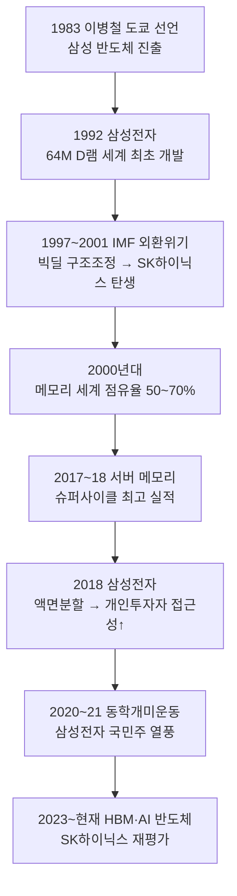

## 📌 핵심 인사이트

- **한국의 반도체 강국 지위는 "기술 추격 → 위기를 통한 구조조정 → 초격차 확립"이라는 3단계를 거쳐 만들어졌습니다.** 특히 IMF 외환위기라는 국가적 위기가 역설적으로 SK하이닉스 탄생과 산업 재편의 계기가 되었다는 점이 특징적입니다.
- **반도체 기업의 성장과 개인투자자의 주식투자 열풍은 항상 같은 타이밍에 맞물려 왔습니다.** 실적이 사상 최고치를 기록하는 시점(2017~18년, 2020~21년)마다 개인투자자의 매수세가 집중되었는데, 이는 실적 정점이 곧 주가 정점과 가까울 수 있다는 점에서 유의가 필요합니다.
- **액면분할(2018년) 같은 제도적 변화도 투자 열풍의 촉매가 되었습니다.** 기술력만이 아니라 "얼마나 쉽게 살 수 있는가"도 국민주 형성에 큰 영향을 미쳤습니다.

## ⚠️ 전략적 시사점

- 한국 반도체 기업에 투자할 때는 나노공정 경쟁력(3nm/2nm 파운드리 수율), 메모리 사이클(가격·재고), HBM 같은 신규 응용처 점유율을 함께 봐야 "기술 서사"와 "실제 실적"의 괴리를 줄일 수 있습니다.
- "동학개미운동"처럼 실적 정점 부근에서 개인 매수세가 몰리는 패턴이 반복되어 왔으므로, 열풍이 커질수록 위 4-7절의 KPI(가동률, ASP, 수주잔고)로 사이클 후반 신호를 교차 검증하는 습관이 중요합니다.
- 한국은 메모리(D램·낸드·HBM)에 강점이 있지만 비메모리(시스템반도체) 파운드리에서는 TSMC 대비 점유율 격차가 있다는 점도 함께 고려해 투자 비중을 판단해야 합니다.

---

# SK하이닉스의 ADR(미국예탁증서)과 나스닥 상장

> 📖 **Wikipedia**: [주식예탁증서](https://ko.wikipedia.org/wiki/주식예탁증서) · [American depositary receipt](https://en.wikipedia.org/wiki/American_depositary_receipt)
>
>
> ⚠️ 아래 일정·금액은 2026년 7월 상장 시점 기준 **잠정(Pending)** 수치이며, 실제 발행가·물량은 수요예측 결과에 따라 변동될 수 있습니다.

SK하이닉스는 2026년 7월 코스피 상장을 유지한 채 미국 나스닥에 ADR을 상장하는 대규모 자금조달을 추진하고 있습니다. 위에서 다룬 "메모리 초강국" 서사가 이제 **미국 자본시장에서 직접 자금을 조달하는 단계**로 이어진 사례로, 한국 반도체 투자사에서 매우 상징적인 이벤트입니다.

## 1. ADR(American Depositary Receipt)이란

- 외국 기업의 주식을 미국 예탁은행(Depositary Bank)이 대신 보관하고, 그 주식을 기초자산으로 미국 증권시장에서 달러로 거래할 수 있도록 발행하는 **주식예탁증서**입니다.
- 미국 투자자는 원화로 환전해 한국 증시(코스피)에서 직접 주식을 사는 대신, 미국 증권계좌에서 ADR을 달러로 매매하며 사실상 같은 기업에 투자하는 효과를 얻습니다.
- 원주(기초주식)는 국내 예탁결제원 등에 보관되고, ADR은 그 보관 증서를 기반으로 미국에서 유통되는 "그림자 주식"에 가깝습니다.

## 2. ADR의 3단계 레벨

| 레벨 | 거래 시장 | 신주 발행(자금조달) | 특징 |
|---|---|---|---|
| **레벨 1** | 미국 장외시장(OTC) | 불가 | 상장 절차가 가장 간단, 기존 발행 주식만 유통, 공시 의무 최소 |
| **레벨 2** | 뉴욕증권거래소(NYSE)·나스닥 상장 | 불가 | 거래소 상장으로 접근성은 높지만 신주 발행(자금조달) 기능은 없음 |
| **레벨 3** | 뉴욕증권거래소·나스닥 상장 | **가능** | 신주를 발행해 미국 투자자로부터 직접 자금을 조달, SEC 공시 의무가 가장 엄격 |

SK하이닉스가 추진하는 이번 상장은 신주를 발행해 실제 자금을 조달하는 **레벨 3 ADR**에 해당합니다.

## 3. SK하이닉스 ADR 상장 개요 (2026년 7월 기준 잠정)

| 항목 | 내용 |
|---|---|
| 상장 시장 | 나스닥 글로벌 셀렉트 마켓(Nasdaq Global Select Market) |
| 티커 | **SKHY** |
| 예탁 비율 | 보통주 1주 = ADR **10주** (10:1) |
| 신주 발행 규모 | 최대 약 1,779만 주 (기존 발행주식의 약 2.5%) |
| 조달 예정 금액 | 최대 약 45조 4,500억 원(약 294억 달러) — ADR 공모 사상 최대 규모(2014년 알리바바 NYSE 상장 218억 달러 상회) |
| 잠정 일정 | 나스닥 상장·거래 개시 7월 10일 → 청약·납입 7월 14일 → 국내 신주 상장 7월 29일 |
| 기존 예탁증서 | 룩셈부르크 증권거래소 GDR(티커 HYXS LX)을 이미 운영 중 — 이번이 최초의 해외 예탁증서는 아님 |

## 4. 자금 조달 목적 — HBM 생산능력 확충

이번 ADR은 재무구조 보강이 아니라 **차세대 AI 메모리 수요에 대응하기 위한 설비투자(Capex) 재원 마련**이 명확한 목적입니다.

- 용인 반도체 클러스터 1기 팹(Fab) 건설
- 청주 P&T7 어드밴스드 패키징(HBM 후공정) 공장 건설
- EUV(극자외선) 노광 장비 등 첨단 장비 도입
- 최태원 SK그룹 회장은 용인 클러스터 완공 시점을 원래 2045년에서 **2033년으로 12년 앞당기겠다**고 발표

이는 위 "나노공정" 절에서 설명한 EUV 장비 투자 부담, 그리고 "반도체 소비량의 시대별 변화" 절의 AI 붐기 HBM 슈퍼사이클과 직접 연결됩니다. SK하이닉스는 글로벌 HBM 시장 점유율 약 58~60%를 차지하며 엔비디아向 공급을 주도하고 있어, 이번 조달 자금은 사실상 "AI 메모리 초격차를 지키기 위한 실탄"으로 해석됩니다.

## 5. 투자 의미

### 5-1. 미국(서학개미) 투자자 관점

- 원화 환전 없이 **달러 계좌로 직접** SK하이닉스에 투자할 수 있게 되어 환전 절차와 환전 수수료 부담이 사라집니다.
- 나스닥 상장 이후 필라델피아반도체지수(SOX)나 반도체 관련 ETF에 편입될 가능성이 열리면서, 이런 지수·ETF를 추종하는 **패시브 자금의 자동 유입**을 기대할 수 있습니다.
- 다만 원주(000660.KS)와 ADR(SKHY)은 같은 기업이지만 별개 시장에서 거래되므로, 거래시간 차이·환율 변동에 따라 두 가격 사이에 일시적인 **괴리(프리미엄/디스카운트)**가 발생할 수 있고, 이는 재정거래(Arbitrage) 기회이자 리스크가 됩니다.

### 5-2. 국내(동학개미) 투자자 관점

- 신주 발행 물량(약 2.5%)만큼 기존 주주의 지분 가치가 희석되는 것은 단기적으로 부담 요인입니다.
- 다만 조달 자금이 HBM 증설이라는 명확한 성장 재원으로 쓰이므로, 장기적으로는 생산능력 확대 → 매출·이익 성장으로 이어질 수 있다는 시각도 존재합니다. 위 "황의 법칙" 절에서 다룬 것처럼, 실제로 생산능력이 그 성장 서사를 뒷받침하는지 후속 실적으로 검증하는 과정이 필요합니다.
- 국내 유동성 일부가 미국 ADR 쪽으로 분산될 가능성이 있는 반면, 나스닥 상장에 따른 글로벌 인지도·밸류에이션 재평가(리레이팅) 기대감도 함께 거론됩니다.

### 5-3. 한국 반도체 산업 전체에 대한 상징성

- 한국 기업이 자국 상장을 유지한 채 대규모 자금을 미국 자본시장에서 직접 조달하는 것은 이례적인 사례로, "메모리 반도체 강국"의 위상이 국내 증시를 넘어 **글로벌 자본시장에서 인정받는 단계**로 진입했다는 상징적 의미가 있습니다.
- 향후 삼성전자를 비롯한 다른 국내 대형 기술기업이 유사한 해외 자금조달 구조를 검토하는 선례가 될 가능성도 있습니다.

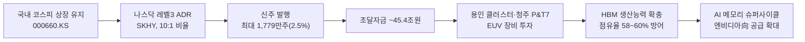

## 📌 핵심 인사이트

- **이번 ADR은 단순 해외 상장이 아니라 "레벨 3"(신주 발행형) 상장으로, 실제 대규모 자금(최대 약 294억 달러)을 미국 자본시장에서 직접 조달하는 딜입니다.** 알리바바의 2014년 뉴욕 상장(218억 달러)을 넘어서는 ADR 공모 사상 최대 규모로 평가됩니다.
- **조달 목적이 재무구조 개선이 아니라 HBM 생산설비 투자로 명확히 지정**되어 있어, 이번 딜의 성패는 결국 향후 HBM 수요와 SK하이닉스의 점유율 유지 여부에 달려 있습니다.
- **원주와 ADR이라는 두 개의 거래 시장이 생기면서**, 국내 투자자와 미국 투자자가 같은 기업을 다른 시장·다른 통화·다른 거래시간에 거래하게 되는 구조적 변화가 발생합니다.

## ⚠️ 전략적 시사점

- 국내 투자자라면 신주 발행에 따른 단기 희석 효과와 장기 HBM 증설 효과 중 어느 쪽이 주가에 더 크게 반영되는지, 상장 이후 실제 주가 흐름과 실적 발표(2026년 7월 29일 전후 2분기 실적)를 함께 확인할 필요가 있습니다.
- 미국 투자자(또는 미국 계좌를 보유한 서학개미)라면 SKHY의 유동성이 초기에는 원주 대비 낮을 수 있어, 스프레드(매수·매도 호가 차이)와 원주 대비 괴리율을 확인한 뒤 매매하는 것이 안전합니다.
- ADR 상장 이후 SOX 지수·반도체 ETF 편입 여부가 확정되는 시점을 추적하면, 편입 공식화 전후로 발생할 수 있는 수급 이벤트(패시브 자금 유입)를 미리 가늠하는 데 도움이 됩니다.

Sources:
- [SK hynix Confirms Nasdaq Listing, Seeking Up to $29 Billion in a Record ADR Offering](https://www.techtimes.com/articles/318997/20260625/sk-hynix-confirms-nasdaq-listing-seeking-29-billion-record-adr-offering.htm)
- [South Korea's SK Hynix plans $29 billion Nasdaq ADR listing - CNBC](https://www.cnbc.com/2026/06/24/sk-hynix-nasdaq-adr-listing-south-korea.html)
- [SK Hynix US Listing: July 10 Nasdaq ADR Plan, $29B Raise - EBC Financial Group](https://www.ebc.com/forex/sk-hynix-us-listing-adr-nasdaq-july-2026)
- [SK하이닉스 내달 미국 ADR 상장 추진···45조 유상증자 - 경향신문](https://www.khan.co.kr/article/202606241718001)
- [SK하이닉스 ADR 미국 상장 총정리 - 헬프미 블로그](https://www.help-me.kr/blog/article/sk-hynix-adr-stock-dilution-capital-increase-registration/)
- [SK Hynix Nasdaq Listing: SKHY AI Stock Explained - IndMoney](https://www.indmoney.com/blog/us-stocks/sk-hynix-nasdaq-listing-skhy-ai-stock-explained)

---

# 코스피 6대 그룹 계열사와 산업별 슈퍼사이클

> 📖 **Wikipedia**: [대한민국의 대기업 집단](https://ko.wikipedia.org/wiki/대한민국의_대기업_집단) · [지주회사](https://ko.wikipedia.org/wiki/지주회사) · [슈퍼사이클](https://ko.wikipedia.org/wiki/슈퍼사이클)
>

코스피 시가총액 상위 종목 상당수는 삼성·SK·현대차·LG·롯데·두산 같은 대기업 집단(재벌 그룹)의 계열사입니다. 이 종목들은 서로 업종이 다르더라도 **같은 그룹이라는 이유만으로 함께 움직이는 "그룹주 동조화" 현상**이 자주 나타나며, 동시에 각 그룹이 주력으로 삼는 산업마다 고유한 슈퍼사이클(장기 호황·불황 파동)을 갖습니다. 위에서 다룬 반도체 슈퍼사이클(삼성전자·SK하이닉스)이 그 대표적 사례이며, 이 절에서는 다른 그룹으로 시야를 넓혀 비교합니다.

## 1. 그룹주 동조화란

- 같은 대기업 집단 소속 계열사들은 지주회사·총수 일가 지분구조로 얽혀 있어, 한 계열사의 호재·악재(지배구조 이슈, 승계, 대규모 투자 발표 등)가 다른 계열사 주가에도 영향을 미치는 경우가 많습니다.
- 이를 **그룹주 동조화(Conglomerate Co-movement)**라 부르며, 실적과 무관하게 "그룹 전체 테마"로 매수·매도가 몰리는 장세가 종종 나타납니다.
- 다만 계열사마다 실제로 속한 업종과 사이클이 다르므로, 동조화가 과도하게 나타나면 오히려 개별 기업의 펀더멘털과 괴리되는 왜곡이 발생할 수 있습니다.

## 2. 6대 그룹 핵심 코스피 계열사와 대표 슈퍼사이클

| 그룹 | 대표 코스피 계열사(예시) | 핵심 업종 | 연관된 슈퍼사이클 |
|---|---|---|---|
| **삼성그룹** | 삼성전자, 삼성SDI, 삼성물산, 삼성생명, 삼성화재, 삼성바이오로직스 | 반도체·디스플레이·금융·바이오 | 메모리·파운드리 반도체 슈퍼사이클, 배터리 소재 |
| **SK그룹** | SK하이닉스, SK이노베이션, SK텔레콤, SK바이오팜, SK스퀘어 | 반도체·정유화학·통신·바이오 | HBM·AI 메모리 슈퍼사이클, 정유·화학 다운사이클 |
| **현대차그룹** | 현대차, 기아, 현대모비스, 현대제철, 현대글로비스 | 완성차·부품·철강·물류 | 자동차 판매 사이클, 전기차(EV) 전환 사이클, 철강 업황 사이클 |
| **LG그룹** | LG전자, LG화학, LG에너지솔루션, LG디스플레이, LG유플러스 | 가전·배터리 소재·2차전지·디스플레이·통신 | 2차전지(배터리) 슈퍼사이클, 디스플레이(OLED) 업황 사이클 |
| **롯데그룹** | 롯데쇼핑, 롯데케미칼, 롯데칠성음료, 롯데지주 | 유통·석유화학·식음료 | 소비 경기 사이클, 범용 석유화학 다운사이클 |
| **두산그룹** | 두산에너빌리티, 두산밥캣, 두산로보틱스, 두산퓨얼셀 | 원전·에너지 설비·건설기계·로봇 | 원전·에너지 인프라 슈퍼사이클, 건설기계 경기 사이클 |

> ※ 그룹 지배구조·계열사 편입 현황은 공정거래위원회의 "공시대상기업집단" 지정 결과에 따라 매년 바뀔 수 있으므로, 최신 계열사 목록은 [공정거래위원회 기업집단포털](https://groupopni.ftc.go.kr)에서 확인하는 것이 정확합니다.

## 3. 그룹별 슈퍼사이클의 성격 차이

각 그룹의 핵심 산업이 다르므로, "슈퍼사이클"이라는 같은 표현을 쓰더라도 그 원인과 파동 주기는 서로 다릅니다.

| 그룹 | 슈퍼사이클을 만드는 근본 동인 | 최근 대표 국면 |
|---|---|---|
| 삼성·SK | AI·클라우드발 반도체 수요 폭증, 미세공정·HBM 기술 경쟁 (위 무어의 법칙·황의 법칙 절 참고) | 2023년 말~현재 AI 반도체 슈퍼사이클 |
| LG | 전기차 보급 확산에 따른 배터리 셀·소재 수요 증가, 완성차 업체와의 장기 공급계약 | 2021~2023년 2차전지 랠리 이후 2024년 전기차 수요 둔화(캐즘) 조정 |
| 현대차 | 전기차 전환, 신흥국 자동차 수요, 원자재(철강)·환율 변동 | 2023년 고금리 속 완성차 실적 호조, 이후 전기차 캐즘 영향 |
| 두산 | 원전 재가동·신규 발전 수요, 데이터센터發 전력 인프라 투자 확대 | 2023년 이후 원전·에너지 설비 재평가, AI 데이터센터發 전력 수요 연계 |
| 롯데 | 내수 소비 경기, 범용 석유화학 공급 과잉(중국發) | 2022년 이후 화학 업황 부진 국면 지속 |

## 4. 그룹주 동조화의 메커니즘

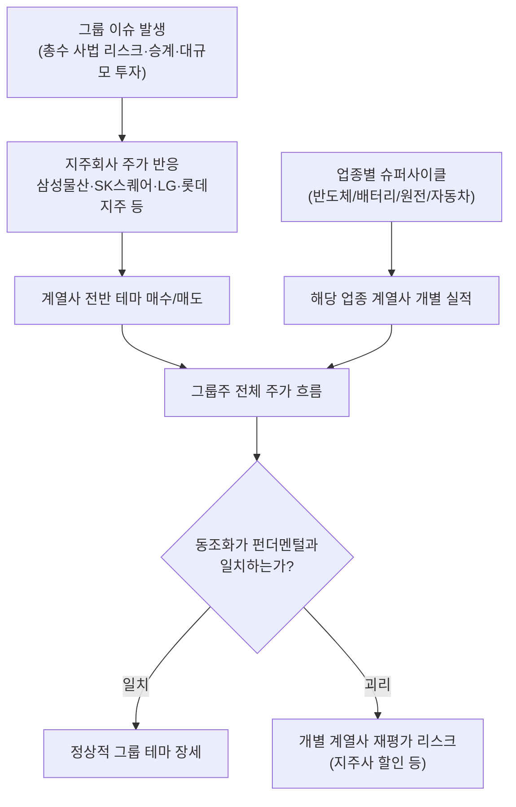

- **지주회사 할인(Holding Discount)**: 삼성물산·LG·SK스퀘어·롯데지주처럼 계열사 지분을 보유한 지주회사는, 보유 지분 가치를 그대로 인정받지 못하고 순자산가치(NAV) 대비 할인되어 거래되는 경향이 있습니다. 그룹 전체 호재가 있어도 지주사 주가는 자회사보다 덜 반응하는 경우가 많습니다.
- **계열사 간 사업구조 차이**: 같은 그룹이라도 삼성전자(반도체)와 삼성생명(보험)처럼 사업 성격이 전혀 다른 계열사가 섞여 있어, "그룹 테마"로 함께 오르내리는 것이 항상 펀더멘털에 부합하지는 않습니다.
- **총수 리스크**: 오너 일가의 사법 리스크·경영권 분쟁·승계 이슈는 실적과 무관하게 그룹 전체 계열사 주가에 단기 영향을 줄 수 있습니다.

## 📌 핵심 인사이트

- **"그룹주"라는 분류는 투자 판단의 출발점일 뿐, 결론이 되어서는 안 됩니다.** 같은 삼성그룹이라도 삼성전자는 반도체 슈퍼사이클을, 삼성생명은 금리·보험 업황을 따라 움직이므로 그룹명만 보고 동일하게 취급하면 판단을 그르치기 쉽습니다.
- **슈퍼사이클의 진원지(반도체·배터리·원전·자동차)를 먼저 파악하고, 그 사이클의 핵심 수혜 계열사를 구분해서 봐야 합니다.** 예를 들어 AI 반도체 슈퍼사이클의 핵심은 삼성전자·SK하이닉스이지 삼성물산이 아닙니다.
- **지주회사 할인 구조 때문에, 그룹 전체 가치 대비 지주사 주가가 저평가된 것처럼 보이는 경우가 있습니다.** 이는 저평가 매력일 수도 있지만, 자회사 실적이 지주사 주가에 온전히 반영되지 않는 구조적 한계이기도 합니다.

## ⚠️ 전략적 시사점

- 그룹주를 볼 때는 위 4절의 Peer Comparison 방법론을 계열사가 아니라 **업종이 같은 경쟁사** 기준으로 다시 적용해야 합니다. (예: LG에너지솔루션은 LG그룹이 아니라 삼성SDI·SK온·CATL과 비교)
- 그룹 전체가 테마로 급등할 때는 어느 계열사가 실제 사이클의 진원지인지, 어느 계열사가 단순히 "묻어가는" 종목인지 구분해 비중을 조절하는 것이 리스크 관리에 도움이 됩니다.
- 지주회사(삼성물산·LG·SK스퀘어·롯데지주·두산 등)에 투자할 때는 NAV(순자산가치) 대비 할인율과 그 할인율이 최근 확대·축소되는 추세인지를 함께 확인해야 합니다.
