# 3단원. 차트·거래량·수급 분석


---

# 주식 2

주식 2에서는 차트의 기본 요소, 거래량, 시장 참여자의 흐름을 해석하는 기초를 학습합니다.

## 캔들 차트는 하루의 가격 싸움을 보여 줍니다

**캔들 차트(Candlestick Chart, 시가·고가·저가·종가를 막대 모양으로 보여 주는 차트)**는 일정 시간 동안 가격이 어떻게 움직였는지 한눈에 보여 줍니다. 하루 단위로 만들면 일봉, 한 주 단위로 만들면 주봉이라고 합니다. 캔들 하나에는 네 가지 가격이 들어 있습니다.

| 부분 | 영어 | 뜻 | 어떻게 읽을까요? |
| --- | --- | --- | --- |
| 시가 | Open | 장이 시작할 때의 가격 | 장 시작 전 모인 주문을 기준으로 정해진 그날 첫 가격입니다. |
| 종가 | Close | 장이 끝날 때의 가격 | 장 마감 전 모인 주문을 기준으로 정해진 그날의 마감 가격입니다. |
| 고가 | High | 그 시간 동안 가장 높았던 가격 | 위꼬리 끝이 가리키는 지점입니다. |
| 저가 | Low | 그 시간 동안 가장 낮았던 가격 | 아래꼬리 끝이 가리키는 지점입니다. |
| 몸통 | Body | 시가와 종가 사이의 굵은 부분 | 몸통이 길면 그날 가격 변화가 컸다는 뜻입니다. |
| 위꼬리 | Upper Shadow (Wick) | 몸통 위로 나온 가는 선 | 장중에는 더 높이 올랐지만, 종가까지는 내려왔다는 뜻입니다. |
| 아래꼬리 | Lower Shadow (Wick) | 몸통 아래로 나온 가는 선 | 장중에는 더 낮게 내려갔지만, 종가까지는 올라왔다는 뜻입니다. |


### 캔들차트의 유래: 250년 전 일본에서 시작됐을까?

흔히 “캔들차트는 250년쯤 전 일본의 혼마 무네히사(本間宗久)라는 쌀 상인이 만들었다”는 이야기가 널리 퍼져 있습니다. 확인해 보면 절반은 사실이고, 절반은 후대에 다듬어진 이야기입니다.

**실존 인물이라는 부분은 사실입니다.** 혼마 무네히사(1724~1803)는 에도시대 사카타(현재의 야마가타현) 출신 쌀 거래 상인으로, 오사카 도지마 쌀 거래소에서 활동하며 큰 부를 쌓은 것으로 알려져 있습니다. 오늘날에도 캔들 몇 개의 조합으로 추세를 읽는 **‘사카타 5법(사카타 고호, 삼산·삼천·삼공·삼병·삼법)’**이 그의 이름과 함께 전해집니다.

**다만 그가 지금과 같은 모양의 캔들을 직접 그렸다는 근거는 약합니다.** 1991년 저서 《Japanese Candlestick Charting Techniques》로 서구에 캔들차트를 처음 소개해 이 이야기를 널리 퍼뜨린 스티브 니슨(Steve Nison) 본인도, 후속 저서 《Beyond Candlesticks》에서 “내 조사로는 혼마가 캔들차트를 사용했을 가능성은 낮으며, 지금과 같은 모양의 캔들차트는 그보다 한 세기 가까이 뒤인 메이지시대(1800년대 후반) 무렵 발전했을 가능성이 크다”고 스스로 정정했습니다.

정리하면, 혼마 무네히사는 사카타 5법과 초기 매매 심리 전략으로 이름을 남긴 실존 상인이 맞지만, 오늘날의 몸통·꼬리 모양 캔들차트 표기법 자체는 그의 사후 한 세기 가까이 지나서야 여러 사람의 손을 거쳐 다듬어졌을 가능성이 큽니다. “250년 전 한 사람이 통째로 발명했다”기보다는, **“사카타 5법이라는 실전 매매 지혜가 먼저 있었고, 그 위에 오늘날의 시각적 표기법이 후대에 덧붙여졌다”**는 쪽이 사실에 더 가깝습니다.

### 모멘텀 캔들은 몸통 크기를 비교해 봅니다

**모멘텀 캔들**은 한 방향으로 가격이 평소보다 강하게 움직였음을 보여 주는 긴 캔들을 말합니다. 실습에서는 같은 시간 단위의 **직전 캔들 몸통(시가와 종가의 차이)보다 2배 이상 긴 몸통**을 하나의 기준으로 볼 수 있습니다. 예를 들어 직전 일봉의 몸통이 1,000원이고 오늘 양봉 몸통이 2,000원 이상이면, 오늘 봉은 상승 모멘텀 캔들 후보입니다. 하락 방향이라면 긴 음봉도 같은 방식으로 볼 수 있습니다.

여기서 비교하는 크기는 위·아래꼬리를 포함한 전체 길이가 아니라 **몸통의 길이**입니다. 다만 2배는 모든 차트에 적용되는 정답이나 자동 매매 신호가 아니라, 평소보다 강한 움직임을 찾기 위한 실무적 기준이에요. 거래량 증가, 지지·저항 돌파 여부, 뉴스·공시, 최근 여러 캔들의 평균 몸통 크기를 함께 확인해야 합니다.

## 나라별로 빨강·파랑 표시가 다른 이유

차트의 색은 가격 그 자체의 규칙이 아니라, 각 나라의 금융 화면과 신문이 오랫동안 써 온 **표시 약속**입니다. 그래서 같은 삼성전자나 미국 주식 차트라도 어느 앱을 보느냐에 따라 색이 달라질 수 있습니다.

| 시장 | 보통 오름 표시 | 보통 내림 표시 | 기억할 점 |
| --- | --- | --- | --- |
| 한국 | 빨강 | 파랑 | 국내 HTS·MTS에서 흔히 보는 방식입니다. |
| 일본 | 빨강 | 파랑 | 한국과 비슷하게 표시하는 차트가 많습니다. |
| 중국 | 빨강 | 초록 | 빨강을 좋은 흐름에 쓰는 관습은 한국과 비슷하지만, 내림에는 초록을 쓰는 경우가 많습니다. |
| 미국 | 초록 | 빨강 | 미국 금융 화면에서는 초록을 이익·상승, 빨강을 손실·하락에 연결해 쓰는 경우가 많습니다. |

한국·중국에서는 전통적으로 빨강을 길함·기쁜 일과 연결해 상승 표시에 쓰는 관습이 널리 자리 잡았습니다. 반대로 미국에서는 장부에 손실을 빨간 잉크로 적던 표현 때문에 빨강을 하락·손실에 쓰는 관습이 널리 퍼졌습니다. 일본은 한국처럼 빨강 상승·파랑 하락을 쓰는 차트가 흔합니다. 다만 이것은 법으로 정한 국제 규칙이 아닙니다. 증권사, TradingView 같은 차트 서비스, 다크 모드·색각 보정 설정에 따라 색을 바꿀 수 있습니다.

**가장 안전한 확인법**은 색 이름이 아니라 캔들의 시가와 종가입니다. 차트 범례나 설정에서 ‘상승(Up)·하락(Down)’ 색을 먼저 보고, 몸통의 어느 끝이 시가·종가인지 확인하세요. 해외 차트를 처음 볼 때 ‘빨강이 올랐나, 내렸나’를 한 번 확인하는 습관만으로도 실수를 크게 줄일 수 있습니다.

## 캔들이 모이면 패턴이 됩니다

캔들 하나는 그 시간 동안의 결과만 보여 주지만, **여러 캔들이 이어지면 매수·매도 힘이 압축된 패턴**으로 읽을 수 있습니다. 이것이 앞서 소개한 혼마 무네히사의 사카타 5법이 다루는 것과 같은 생각입니다. 캔들 한두 개가 아니라 조합의 순서를 봐야 힘의 방향이 보인다는 뜻입니다.

### 캔들 두 개·세 개가 만드는 대표 패턴

| 패턴 이름 | 모양 | 압축된 힘 | 조심할 점 |
| --- | --- | --- | --- |
| 상승장악형(Bullish Engulfing) | 작은 음봉 뒤에, 그 몸통을 완전히 감싸는 큰 양봉 | 매도 힘이 하루 만에 매수 힘에 압도됨 | 하락 추세 끝, 거래량 증가와 함께 나오면 더 의미 있게 봅니다. |
| 하락장악형(Bearish Engulfing) | 작은 양봉 뒤에, 그 몸통을 완전히 감싸는 큰 음봉 | 매수 힘이 하루 만에 매도 힘에 압도됨 | 상승 추세 끝에서 나오면 상승 동력이 꺾였을 가능성을 검토합니다. |
| 샛별형(Morning Star) | 큰 음봉 → 몸통이 작은 캔들(도지 포함) → 큰 양봉, 세 개가 이어짐 | 매도세가 잦아들고 매수세가 되살아나는 흐름이 사흘에 걸쳐 압축됨 | 하락이 오래 이어진 뒤, 저점 부근에서 나올 때 더 주목받습니다. |
| 저녁별형(Evening Star) | 큰 양봉 → 몸통이 작은 캔들 → 큰 음봉, 세 개가 이어짐 | 매수세가 식고 매도세가 되살아나는 흐름이 사흘에 걸쳐 압축됨 | 상승이 오래 이어진 뒤, 고점 부근에서 나올 때 더 주목받습니다. |


### 캔들 패턴과 추세를 함께 읽는 순서

1. **패턴이 어디서 나왔는지 먼저 봅니다.** 같은 상승장악형이라도 오랜 하락 뒤 저점 부근과, 이미 많이 오른 고점 부근에서는 뜻이 다르게 읽힐 수 있습니다.
2. **거래량을 함께 확인합니다.** 패턴이 나온 날 거래량이 평소보다 늘었다면 더 많은 참여자가 그 힘의 전환에 동참했다는 뜻으로 볼 수 있습니다.
3. **다음 캔들로 확인합니다.** 패턴 하루만 보고 판단하기보다, 그다음 캔들에서 방향이 이어지는지까지 지켜보는 편이 안전합니다.
4. **더 큰 추세 안에서의 위치를 봅니다.** 짧은 패턴은 큰 이동평균선·지지저항 흐름 안의 작은 사건입니다. 큰 추세를 거스르는 패턴일수록 신중하게 접근합니다.

> 캔들 패턴은 “다음에 반드시 이렇게 된다”는 공식이 아니라, 그 순간 매수·매도 힘의 균형이 바뀌었을 가능성을 압축해서 보여 주는 힌트입니다. 패턴 하나만 보고 매매하기보다, 추세·거래량·뉴스·이동평균선과 함께 확인하는 습관이 중요합니다.

## 주식 차트를 처음 볼 때는 이렇게 읽습니다

차트는 복잡해 보여도 아래 순서로 보면 됩니다. 처음에는 보조지표를 많이 켜지 말고, 가격·기간·거래량 세 가지만 확인해도 충분합니다.

1. **무엇의 차트인지 확인합니다.** 종목명과 종목코드를 먼저 보고, 국내 주식인지 해외 주식인지 확인합니다. 비슷한 이름의 회사나 ETF를 잘못 보는 실수를 막을 수 있습니다.
2. **시간 단위를 정합니다.** 일봉은 하루, 주봉은 한 주, 월봉은 한 달의 움직임을 캔들 하나로 보여 줍니다. 하루 안의 움직임을 보려면 분봉을 쓰지만, 처음에는 일봉·주봉부터 보는 편이 덜 흔들려요.
3. **왼쪽에서 오른쪽으로 큰 흐름을 봅니다.** 최근 몇 개월 동안 고점과 저점이 함께 높아지는지, 낮아지는지, 비슷한 범위에 머무는지 살펴봅니다. 하루의 큰 양봉 하나보다 긴 흐름이 더 중요할 때가 많습니다.
4. **캔들 한 개의 네 가격을 읽습니다.** 몸통과 꼬리로 시가·종가·고가·저가를 확인합니다. 긴 꼬리는 장중에 가격이 크게 흔들렸다는 기록이지, 무조건 매수·매도 신호는 아니에요.
5. **아래의 거래량 막대를 함께 봅니다.** 가격이 크게 움직인 날에 평소보다 거래량도 늘었는지 살펴봅니다. 거래량은 관심의 크기를 알려 주는 힌트일 뿐, 가격 방향을 보장하지는 않습니다.
6. **회사와 시장의 이유를 확인합니다.** 실적 발표, 공시, 금리 발표, 환율, 산업 뉴스가 있었는지 찾아봅니다. 차트는 ‘무슨 일이 있었는지 확인할 곳’을 알려 주지만 원인을 스스로 설명하지는 못합니다.
7. **주문 전에는 내 계획을 다시 봅니다.** 차트가 좋아 보여도 생활비를 쓰거나 한 종목에 과도하게 몰아넣지 않습니다. 매수 이유, 투자 기간, 감당할 손실을 먼저 정합니다.

예를 들어 ‘오늘 빨간 양봉이 크고 거래량도 많다’는 말은 **오늘 종가가 시가보다 높고 많은 거래가 있었다**는 뜻까지만 알려 줍니다. 좋은 실적 때문에 올랐는지, 일시적 소문 때문에 올랐는지는 공시와 뉴스로 따로 확인해야 합니다.

## 꼬리가 긴 캔들과 도지

위꼬리가 길면 장중 높은 가격까지 갔다가 매도 물량 때문에 내려온 모습일 수 있습니다. 아래꼬리가 길면 장중 낮은 가격까지 갔다가 매수세가 들어와 올라온 모습일 수 있습니다. 하지만 한 번의 꼬리만으로 누가 이겼다고 단정할 수는 없습니다.


시가와 종가가 거의 같아 몸통이 십자(+) 모양에 가깝게 매우 짧아지는 캔들을 **도지(Doji, 시작 가격과 끝 가격이 비슷한 모양)**라고 불러요. 매수세와 매도세가 팽팽하게 맞서 시장이 방향을 정하지 못한 상태로 볼 수 있습니다. 도지 하나만으로 상승·하락을 확정할 수는 없지만, 계속되던 상승세나 하락세의 끝에서 나타나면 추세가 바뀔 수 있다는 신호로 해석하는 경우가 많습니다.

### 도지의 주요 유형

꼬리(그림자)의 길이와 위치에 따라 도지를 몇 가지로 나누어 부르기도 합니다.


| 유형 | 모양 특징 | 흔히 붙이는 의미 |
| --- | --- | --- |
| 표준 도지(Standard) | 위아래 꼬리 길이가 비슷함 | 방향을 탐색 중인 상태로 보고, 다음 캔들에서 방향을 다시 확인합니다. |
| 롱레그 도지(Long-Legged) | 위아래 꼬리가 모두 매우 김 | 장중 변동이 컸다가 다시 시가 수준으로 돌아온 모습입니다. |
| 드래곤플라이 도지(Dragonfly) | 아래꼬리만 길고 위꼬리는 거의 없는 T자 모양 | 장중 매도세를 매수세가 끌어올렸다는 뜻에서 상승 반전 신호로 보기도 합니다. |
| 그레이브스톤 도지(Gravestone) | 위꼬리만 길고 아래꼬리는 거의 없는 비석 모양 | 장중 매수세를 매도세가 끌어내렸다는 뜻에서 하락 반전 신호로 보기도 합니다. |
| 포프라이스 도지(4-Price) | 꼬리 없이 일자(一)에 가까운 모양 | 거래가 극히 적거나 동시호가처럼 한 가격에서만 거래될 때 나타나는 특수한 모습입니다. |

‘반전 신호’라는 이름이 붙어 있어도 확정된 매매 신호는 아닙니다. 상승 추세의 고점에서 나타나면 매수세가 고갈되고 있다는 뜻으로, 하락 추세의 저점에서 나타나면 매도세가 고갈되고 있다는 뜻으로 참고할 수 있는 정도입니다. 도지 하나만 보고 바로 매매하기보다, **바로 다음에 나오는 캔들의 방향**과 지지·저항선, 거래량을 함께 확인한 뒤 판단하는 편이 안전합니다.

## 캔들을 안전하게 읽는 순서


1. 캔들 하나가 아니라 여러 개가 이어진 흐름을 확인합니다.
2. 양봉·음봉의 몸통과 꼬리가 평소보다 큰지 비교합니다.
3. 가격 변화에 거래량이 함께 늘었는지 확인합니다.
4. 공시·실적·시장 뉴스가 있었는지 찾아봅니다.
5. 캔들 모양만으로 매수·매도 결정을 내리지 않습니다.

## 차트는 과거 가격을 기록한 자료입니다

주가 차트는 일정 기간의 가격과 거래 기록을 시각화한 자료입니다. 차트는 과거의 움직임을 보여 주지만 미래 가격을 보장하지는 않습니다.

> 직접 가격선을 그려 보며 차트 모양을 읽는 연습은 왼쪽 사이드바 **데이터 시각화 → 드로잉 차트** 메뉴에서 언제든 열어 볼 수 있습니다.

## 기본 차트 지표

- **추세**: 가격이 한동안 올라가는지, 내려가는지, 옆으로 가는지 보는 것입니다.
- **이동평균선**: 여러 날의 가격을 평균 내어 큰 흐름을 보기 쉽게 만든 선입니다.
- **거래량**: 사고판 주식의 양입니다. 거래량이 많으면 많은 사람이 관심을 보였다는 뜻일 수 있습니다.
- **지지와 저항**: 가격이 자주 멈추거나 되돌아선 자리입니다. 절대 규칙은 아니에요.

## 차트는 세 가지 시간으로 나누어 봐요

같은 주가도 하루 차트에서는 크게 흔들려 보여도, 한 달 차트에서는 작은 움직임일 수 있습니다. 짧은 흐름, 중간 흐름, 긴 흐름을 나누어 보고 내가 어느 기간을 기준으로 판단하는지 먼저 정합니다.

| 시간 단위 | 캔들 하나의 의미 | 주로 쓰는 목적 |
| --- | --- | --- |
| 분봉 | 몇 분 | 당일 흐름 확인 |
| 일봉 | 하루 | 며칠~몇 주의 단기 흐름 |
| 주봉 | 한 주 | 몇 달의 중기 흐름 |
| 월봉 | 한 달 | 1년 이상의 장기 흐름 |

### 월봉 + 10개월 이동평균선으로 장기 흐름 보기

월봉과 최근 10개월 종가 평균을 이은 10개월 이동평균선은 일별 잡음을 줄여 큰 방향을 살피는 방법입니다. 일봉의 120일선·200일선을 더 긴 기간으로 압축해 보는 감각으로 이해하면 됩니다.

1. 월봉으로 바꾸고 최근 1~2년 이상을 화면에 펼칩니다.
2. 현재 종가가 10개월선 위·아래 어디에 있는지, 몇 달째 그 위치를 유지하는지 봅니다.
3. 선을 잠시 건드린 한 번의 움직임보다 종가가 여러 달 선 위 또는 아래에서 마감하는지를 확인합니다.

> 10개월선은 매수·매도를 정하는 규칙이 아닙니다. 실적, 산업 경쟁력, 금리·환율, 투자 기간을 함께 확인하세요.

#### 대표 종목으로 연습하기

삼성전자(005930), SK하이닉스(000660), NAVER(035420), 현대차(005380), 기아(000270), LG에너지솔루션(373220), 삼성바이오로직스(207940), 셀트리온(068270), POSCO홀딩스(005490), KB금융(105560)의 월봉을 같은 화면 설정으로 비교해 보세요. 업종과 개별 회사의 실적·점유율·환율 민감도에 따라 같은 장기선도 다르게 움직일 수 있습니다.

월봉 비교 화면은 [github.com/edumgt/stock-coin-trade](https://github.com/edumgt/stock-coin-trade) 저장소를 내려받아 로컬에서 직접 실행해 열어 볼 수 있습니다. 저장소의 안내(README)를 따라 실행 환경을 준비한 뒤 화면 구성과 사용법을 먼저 확인하세요.

### 가격과 거래량을 함께 읽는 이유

가격이 오르면서 거래량도 늘면 참여가 커졌을 가능성이 있지만, 불안한 매도 때문에도 거래량은 늘 수 있습니다. 급등·급락을 만나면 공시·실적 같은 확인 가능한 원인, 평소 대비 거래량, 시장 전체 흐름, 이미 가격에 반영된 기대를 차례로 확인합니다.

## 주식을 기술적으로 본다는 뜻

**기술적 분석**은 회사의 실적·사업성보다 **주가 차트와 거래량의 움직임**을 중심으로 매매 판단의 힌트를 찾는 방법이에요. 최근의 상승·하락 추세, 지지선·저항선, 이동평균선, 거래량 등을 살펴봅니다.

예를 들어 ‘2만 원 부근에서 여러 번 반등했으니 지지선일 수 있다’거나 ‘거래량을 동반해 이전 고점을 넘었으니 상승 흐름이 강해질 수 있다’처럼 해석할 수 있어요. 다만 이는 가능성을 살펴보는 것이지, 가격의 미래를 맞히거나 수익을 보장하는 방법은 아닙니다.

반대로 **기본적 분석**은 매출·이익·부채·경쟁력·업황·기업가치 등을 보고, 회사의 현재 주가가 비싼지 또는 싼지를 판단하려는 방법입니다. 두 관점은 함께 쓸 수 있어요. 예를 들어 기본적으로 이해하고 투자할 만한 회사를 고른 뒤, 기술적 분석으로 매수·매도 시점을 검토할 수 있습니다.

## 상승·하락 추세와 이동평균선을 함께 읽는 쉬운 방법

차트를 처음 볼 때는 캔들 하나의 색보다 **고점·저점의 방향**과 **이동평균선의 기울기**를 먼저 보세요. 이동평균선은 흔들리는 가격을 평균 내어 큰 방향을 부드럽게 보여 주는 선입니다. 이 절은 매수·매도 신호를 찾기 위한 공식이 아니라, 가격 움직임을 차분히 설명하는 연습입니다.

### ① 상승 추세: 계단이 위로 향하는지 봅니다

상승 추세에서는 저점과 고점이 차례로 높아지는 모습이 자주 나타납니다. 가격이 20일 이동평균선(MA20) 위에 있고, MA20도 위로 향하면 최근 평균 가격이 높아지고 있다는 뜻으로 읽을 수 있습니다.

```text
가격:       ╱╲      ╱╲      ╱╲
저점:      ①       ②       ③     → ① < ② < ③
MA20:    ──────╱──────╱──────      → 선의 기울기 ↑
```

- **가격 > MA20**: 현재 가격이 최근 20거래일 평균보다 높은 상태입니다.
- **MA20 기울기 ↑**: 최근 평균 가격대가 올라가는 중입니다.
- **주의할 점**: 가격이 MA20 위에 한 번 올라섰다고 상승이 보장되지는 않습니다. 거래량, 실적 전망, 업종 분위기도 함께 봅니다.

### ② 하락 추세: 계단이 아래로 향하는지 봅니다

하락 추세에서는 저점과 고점이 차례로 낮아지는 모습이 자주 나타납니다. 가격이 MA20 아래에 있고, MA20이 아래로 향하면 최근 평균 가격대가 낮아지고 있다는 뜻으로 읽을 수 있습니다.

```text
가격:       ╲╱      ╲╱      ╲╱
고점:      ③       ②       ①     → ③ > ② > ①
MA20:    ──────╲──────╲──────      → 선의 기울기 ↓
```

- **가격 < MA20**: 현재 가격이 최근 20거래일 평균보다 낮은 상태입니다.
- **MA20 기울기 ↓**: 최근 평균 가격대가 낮아지는 중입니다.
- **주의할 점**: 며칠 하락했다고 항상 하락 추세는 아닙니다. 더 긴 기간의 이동평균선과 시장 전체의 급락 여부를 함께 확인합니다.

### ③ 이평선은 세 단계로 함께 봅니다

한 가지 모양만 보고 결론 내리지 않도록 아래 순서로 확인해 보세요.

| 확인 순서 | 쉬운 질문 | 생각해 볼 수 있는 뜻 |
| --- | --- | --- |
| 1. 가격 위치 | 지금 가격은 MA20 위인가, 아래인가? | 최근 평균 가격보다 높은지 낮은지를 봅니다. |
| 2. MA20 방향 | MA20은 위·아래 중 어느 쪽으로 기울었나? | 최근 평균 가격대가 올라가는지 내려가는지 봅니다. |
| 3. MA20과 MA60 관계 | 짧은 평균선이 긴 평균선 위인가, 아래인가? | 단기 흐름과 중기 흐름이 같은 방향인지 비교합니다. |

예를 들어 **가격이 MA20 위**에 있어도 MA20이 아래로 꺾이기 시작했다면 상승 힘이 약해졌을 수 있습니다. 반대로 가격이 잠깐 MA20 아래로 내려가도 MA20·MA60이 모두 위를 향하고 거래량이 안정적이라면, 큰 상승 흐름 안의 조정일 가능성도 있습니다. 차트만으로 둘을 확정할 수는 없으므로 공시·뉴스·실적·내 투자 기간을 함께 확인하세요.

> 차트 확대 화면의 **추세 해설**에서는 선택한 종목과 봉 주기에 맞춰 가격과 MA20·MA60의 관계, 최근 변화율, 평균 변동폭을 자동으로 계산해 볼 수 있습니다. 이는 학습용 기술적 참고 정보이며 수익이나 미래 가격을 보장하지 않습니다.

## 컵 위드 핸들(Cup with Handle)은 어떻게 볼까요?

**컵 위드 핸들**은 가격이 둥근 컵처럼 내려갔다가 회복한 뒤, 컵의 오른쪽 위에서 짧게 쉬어 가는 **손잡이(handle)** 모양을 말합니다. 보통 이전 상승 흐름 뒤에 나타나는 *지속형 패턴 후보*로 알려져 있습니다. 이름처럼 보이는지보다, 앞선 추세·거래량·돌파 뒤의 움직임을 함께 확인하는 편이 중요합니다.

```text
가격  ──╲                    ╱──  컵의 양쪽 가장자리(저항 후보)
        ╲__              __╱
           ╲____________╱        ← 둥근 컵 모양
                          ╲__     ← 짧은 손잡이(조정·횡보)
                              ╲___
                                 ─── 돌파 확인 구간
```

### 컵과 손잡이를 나누어 읽기

| 부분 | 차트에서 보이는 모습 | 쉽게 생각하면 | 확인할 점 |
| --- | --- | --- | --- |
| 컵의 왼쪽 | 이전 상승 뒤 가격이 내려옵니다. | 열기가 식으며 차익 실현이 나오는 구간일 수 있습니다. | 급락으로 V자 반등만 만든 것인지, 시간을 두고 바닥을 다진 것인지 구분합니다. |
| 컵의 바닥 | 가격이 넓고 둥글게 안정되는 모습입니다. | 매수·매도 힘이 균형을 찾는 과정일 수 있습니다. | 바닥이 너무 깊거나 거래량이 계속 커지면 약세가 이어지는 신호일 수도 있습니다. |
| 컵의 오른쪽 | 가격이 이전 고점 부근까지 회복합니다. | 이전에 물렸던 투자자의 매도와 새 매수세가 만나는 자리입니다. | 이전 고점 부근에서 멈추는지, 거래량이 살아나는지 봅니다. |
| 손잡이 | 오른쪽 위에서 짧게 조정하거나 옆으로 움직입니다. | 돌파 전 마지막 숨 고르기처럼 보일 수 있습니다. | 손잡이가 컵의 중간 아래까지 깊게 무너지면 전형적인 모습에서 멀어집니다. |

### 확인 순서: 모양보다 세 가지를 먼저 봅니다

1. **앞에 상승 추세가 있었는지 봅니다.** 아무 하락 추세에서나 둥근 모양이 나왔다고 컵 위드 핸들이 되지는 않습니다. 먼저 가격과 주요 이동평균선이 상승 흐름이었는지 확인합니다.
2. **손잡이 조정이 과도하지 않은지 봅니다.** 손잡이는 보통 컵의 오른쪽 위에서 비교적 짧고 얕게 형성됩니다. 가격이 크게 무너지면 단순한 하락 지속일 가능성도 열어 둡니다.
3. **돌파를 거래량과 함께 확인합니다.** 이전 고점·손잡이 상단을 넘는다고 해도 거래량이 평소와 비슷하거나 줄면 힘이 부족할 수 있습니다. 반대로 거래량 증가는 관심이 커졌다는 보조 힌트가 될 수 있지만, 성공을 보장하지는 않습니다.

### 흔한 오해를 피하는 법

- **U자 모양만 보고 이름을 붙이지 않습니다.** 옆으로 길게 횡보한 차트, 하락 중의 반등도 비슷하게 보일 수 있습니다.
- **돌파 당일만 보지 않습니다.** 다음 날 다시 손잡이 안으로 내려오는 *실패 돌파*도 생길 수 있습니다.
- **손실 범위와 투자 기간을 먼저 정합니다.** 패턴은 확률적 설명일 뿐이며, 기업 실적·공시·시장 환경이 바뀌면 모양과 다르게 움직일 수 있습니다.

> 컵 위드 핸들은 “반드시 오른다”는 신호가 아닙니다. 차트 모양을 관찰하는 언어로 이해하고, 실제 투자 판단에서는 회사의 사업·실적과 분산·위험 관리 원칙을 함께 적용하세요.

## 헤드 앤 숄더(Head and Shoulders)는 어떻게 볼까요?

**헤드 앤 숄더**는 고점이 세 번 만들어지되 가운데 고점(머리)이 양옆 고점(어깨)보다 높은 모양을 말합니다. 상승 흐름 뒤에 나타나는 *하락 전환형 패턴 후보*로 알려져 있으며, 두 저점을 이은 **목선(neckline)**을 아래로 뚫는지가 확인의 핵심입니다.

```text
가격         머리
            ╱╲
    어깨1  ╱  ╲  어깨2
     ╱╲   ╱    ╲   ╱╲
    ╱  ╲_╱      ╲_╱  ╲
───╱────목선①─────목선②╲─── ← 목선 이탈 확인 구간
```

| 부분 | 차트에서 보이는 모습 | 확인할 점 |
| --- | --- | --- |
| 왼쪽 어깨 | 상승 뒤 첫 번째 고점과 조정입니다. | 이전까지 상승 추세였는지 먼저 확인합니다. |
| 머리 | 왼쪽 어깨보다 높은 고점입니다. | 거래량이 이전 고점보다 줄었는지 살펴봅니다. |
| 오른쪽 어깨 | 머리보다 낮고 왼쪽 어깨와 비슷한 높이의 고점입니다. | 두 어깨 높이가 크게 다르면 전형적인 모습에서 벗어납니다. |
| 목선 | 두 저점을 이은 선입니다. | 이 선을 거래량과 함께 아래로 이탈하는지가 확인의 핵심입니다. |

1. **어깨 높이가 비슷한지 봅니다.** 크게 다르면 단순한 등락일 수 있습니다.
2. **목선 이탈을 거래량과 함께 확인합니다.** 이탈 없이 오른쪽 어깨에서 다시 오르는 경우도 많습니다.
3. **더 큰 추세를 함께 봅니다.** 장기 상승 추세 안의 짧은 조정을 패턴으로 오인하지 않도록 주의합니다.

> 목선을 이탈했다고 반드시 큰 하락으로 이어지는 것은 아닙니다. 되돌림(가짜 이탈) 가능성도 함께 열어 두세요.

## 역헤드 앤 숄더(Inverse Head and Shoulders)는 어떻게 볼까요?

**역헤드 앤 숄더**는 헤드 앤 숄더를 위아래로 뒤집은 모양으로, 저점이 세 번 만들어지되 가운데 저점(머리)이 양옆 저점(어깨)보다 낮습니다. 하락 흐름 뒤에 나타나는 *상승 전환형 패턴 후보*로 알려져 있으며, 두 고점을 이은 목선을 위로 뚫는지가 핵심입니다.

```text
───╲────목선①─────목선②╱─── ← 목선 돌파 확인 구간
    ╲  ╱‾‾      ‾‾╲  ╱
     ╲╱   ╲      ╱   ╲╱
    어깨1  ╲    ╱  어깨2
            ╲╱
            머리
```

| 부분 | 차트에서 보이는 모습 | 확인할 점 |
| --- | --- | --- |
| 왼쪽 어깨 | 하락 뒤 첫 번째 저점과 반등입니다. | 이전까지 하락 추세였는지 먼저 확인합니다. |
| 머리 | 왼쪽 어깨보다 낮은 저점입니다. | 거래량이 이전 저점보다 늘었는지 살펴봅니다. |
| 오른쪽 어깨 | 머리보다 높고 왼쪽 어깨와 비슷한 저점입니다. | 두 어깨 깊이가 크게 다르면 전형적인 모습에서 벗어납니다. |
| 목선 | 두 고점을 이은 선입니다. | 이 선을 거래량 증가와 함께 위로 돌파하는지가 확인의 핵심입니다. |

1. **어깨 깊이가 비슷한지 봅니다.**
2. **목선 돌파를 거래량과 함께 확인합니다.**
3. **하락 추세가 실제로 멈췄는지, 회사의 실적·공시 변화도 함께 확인합니다.**

> 역헤드 앤 숄더도 “반드시 오른다”는 보장이 아니라, 매도세와 매수세의 힘이 바뀌고 있을 가능성을 보여 주는 모양일 뿐입니다.

## 더블 탑(Double Top)은 어떻게 볼까요?

**더블 탑**은 비슷한 높이의 고점이 두 번 만들어지고 그 사이에 저점(넥라인)이 있는 모양입니다. 알파벳 M과 비슷하다고도 하며, 상승 흐름 뒤 나타나는 *하락 전환형 패턴 후보*입니다.

```text
가격   고점1        고점2
      ╱╲           ╱╲
     ╱  ╲         ╱  ╲
    ╱    ╲_______╱    ╲
───╱──────넥라인────────╲─── ← 넥라인 이탈 확인 구간
```

| 부분 | 차트에서 보이는 모습 | 확인할 점 |
| --- | --- | --- |
| 첫 번째 고점 | 상승 뒤 첫 저항을 만난 자리입니다. | 이후 얼마나 되돌림이 나오는지 봅니다. |
| 넥라인(저점) | 두 고점 사이의 저점입니다. | 이 가격대를 아래로 이탈하는지가 확인의 핵심입니다. |
| 두 번째 고점 | 첫 번째 고점과 비슷한 높이에서 다시 막히는 자리입니다. | 두 번째 고점에서 거래량이 줄었는지 살펴봅니다. |

1. **두 고점 높이가 비슷한지 봅니다.** 두 번째 고점이 뚜렷하게 더 높으면 상승 지속 가능성도 함께 봐야 합니다.
2. **넥라인 이탈을 거래량과 함께 확인합니다.**
3. **한 번의 M자 모양만으로 추세 전환을 단정하지 않습니다.**

> 두 번 막혔다고 반드시 하락하는 것은 아닙니다. 세 번째 시도에서 고점을 돌파하는 경우도 흔합니다.

## 더블 바텀(Double Bottom)은 어떻게 볼까요?

**더블 바텀**은 비슷한 깊이의 저점이 두 번 만들어지고 그 사이에 고점(넥라인)이 있는 모양입니다. 알파벳 W와 비슷하다고도 하며, 하락 흐름 뒤 나타나는 *상승 전환형 패턴 후보*입니다.

```text
───╲──────넥라인────────╱─── ← 넥라인 돌파 확인 구간
    ╲    ╱‾‾‾‾‾‾‾╲    ╱
     ╲  ╱         ╲  ╱
      ╲╱           ╲╱
     저점1         저점2
```

| 부분 | 차트에서 보이는 모습 | 확인할 점 |
| --- | --- | --- |
| 첫 번째 저점 | 하락 뒤 첫 지지를 만난 자리입니다. | 이후 반등 폭을 봅니다. |
| 넥라인(고점) | 두 저점 사이의 고점입니다. | 이 가격대를 위로 돌파하는지가 확인의 핵심입니다. |
| 두 번째 저점 | 첫 번째 저점과 비슷한 깊이에서 지지받는 자리입니다. | 두 번째 저점에서 거래량이 줄었는지 살펴봅니다. |

1. **두 저점 깊이가 비슷한지 봅니다.**
2. **넥라인 돌파를 거래량 증가와 함께 확인합니다.**
3. **한 번의 W자 모양만으로 바닥을 확신하지 않습니다.**

> 두 번 지지받았다고 반드시 상승하는 것은 아닙니다. 세 번째 시도에서 저점이 무너지는 경우도 흔합니다.

## 삼각수렴(Triangle)은 어떻게 볼까요?

**삼각수렴**은 고점을 이은 선과 저점을 이은 선이 점점 좁혀지며 만나는 모양입니다. 상승·하락 어느 방향으로도 돌파할 수 있는 *지속형 패턴 후보*로, 돌파 방향에 따라 매수·매도 판단의 힌트가 달라집니다.

```text
가격  ╲                 
       ╲  고점을 이은 선
        ╲___________
        ╱‾‾‾‾‾‾‾‾‾‾‾╲   ← 점점 좁아지는 폭
       ╱  저점을 이은 선╲
      ╱                 ╲──돌파──
```

| 부분 | 차트에서 보이는 모습 | 확인할 점 |
| --- | --- | --- |
| 저항선(고점선) | 고점들이 점점 낮아지며 이어진 선입니다. | 기울기가 실제로 아래를 향하는지 봅니다. |
| 지지선(저점선) | 저점들이 점점 높아지며 이어진 선입니다. | 기울기가 실제로 위를 향하는지 봅니다. |
| 돌파 | 좁아진 폭을 벗어나는 지점입니다. | 위로 벗어나면 매수, 아래로 벗어나면 매도 쪽 힌트로 보되 거래량을 함께 봅니다. |

1. **두 선이 실제로 좁혀지고 있는지 봅니다.** 폭이 좁혀지지 않으면 단순한 횡보일 수 있습니다.
2. **돌파 방향과 거래량을 함께 확인합니다.** 거래량 없는 돌파는 힘이 약할 수 있습니다.
3. **삼각형 폭이 끝나기 전에 미리 방향을 예단하지 않습니다.**

> 삼각수렴은 어느 방향으로 돌파할지 미리 정해져 있지 않습니다. 돌파가 확인되기 전까지는 양방향 가능성을 모두 열어 두세요.

<p><button type="button" class="pattern-verify-button" data-pattern-verify><i class="fa-solid fa-magnifying-glass-chart"></i> 실제 차트에서 패턴 검증해 보기</button></p>

## 52주 신고가비율: 시장 전체가 함께 오르는지 보는 방법

**52주 신고가비율**은 일정한 종목 집단 가운데 최근 약 1년(통상 252거래일) 중 가장 높은 가격을 새로 기록한 종목의 비율입니다. 한두 대형주만으로 지수가 움직이는지, 많은 종목이 함께 강해지는지를 살피는 **시장 폭(market breadth)** 지표로 활용할 수 있습니다.

```text
52주 신고가비율(%) = 52주 신고가를 새로 기록한 종목 수 ÷ 조사 대상 전체 종목 수 × 100

예: 조사 대상 1,000종목 중 80종목이 오늘 52주 신고가라면 80 ÷ 1,000 × 100 = 8%
```

### 숫자를 차트와 함께 읽는 예시

| 관찰한 모습 | 생각해 볼 수 있는 뜻 | 바로 단정하면 안 되는 이유 |
| --- | --- | --- |
| 지수 상승 + 신고가비율 상승 | 상승에 참여하는 종목 수가 넓어져 시장 폭이 개선됐을 수 있습니다. | 신고가 종목이 특정 테마에만 몰렸을 수 있으므로 업종 분포를 확인합니다. |
| 지수 상승 + 신고가비율 하락 | 일부 대형주가 지수를 끌어올리고, 나머지 종목의 힘은 약해졌을 수 있습니다. | 비율은 하루마다 크게 흔들릴 수 있어 며칠·몇 주 흐름으로 봅니다. |
| 지수 하락 + 신고가비율 낮음 | 새 고점을 만드는 종목이 적어 전반적인 위험 회피가 커졌을 수 있습니다. | 저점 부근에서 비율이 낮다고 곧바로 반등한다는 뜻은 아닙니다. |
| 신고가비율이 매우 높음 | 강한 상승 참여 또는 과열 분위기 둘 다 가능성을 생각합니다. | 높은 비율 자체가 매도 신호는 아니며, 추세는 예상보다 오래 이어질 수 있습니다. |

### 52주 신고가·신저가와 같이 볼 때

비율 하나보다 **52주 신고가 수와 52주 신저가 수를 나란히** 보면 시장의 방향을 조금 더 입체적으로 볼 수 있습니다.

- 신고가 수가 늘고 신저가 수가 줄면: 강한 종목이 넓어지는지 살펴볼 수 있습니다.
- 신고가 수가 줄고 신저가 수가 늘면: 약한 종목이 많아지는지 살펴볼 수 있습니다.
- 둘 다 많으면: 업종별 차별화나 변동성이 큰 장일 수 있으므로, 어느 업종에서 발생했는지 확인합니다.

> 서비스마다 대상 종목(코스피만, 코스피·코스닥 합산, 미국 거래소 합산), 가격 기준(장중·종가), ‘52주’의 거래일 계산 방식이 다를 수 있습니다. 따라서 비율을 비교할 때는 같은 제공처·같은 기준으로 이어진 시계열인지 먼저 확인하세요. 이 지표는 시장 참여 폭을 이해하는 보조 도구이며 매수·매도 신호가 아닙니다.

### 차트 확인용 사이트

- [네이버페이 증권](https://finance.naver.com/): 국내 종목의 기본 시세와 뉴스를 빠르게 훑어볼 수 있습니다. 공시 내용은 원문으로 다시 확인합니다.
- [TradingView](https://www.tradingview.com/): 국내외 차트를 비교하고 시간 단위를 바꾸어 볼 수 있습니다. 차트는 자동 매매 신호가 아니라 확인 도구입니다.
- [KRX 정보데이터시스템](https://data.krx.co.kr/): 한국거래소의 시장 통계·상장종목·지수 정보를 확인하는 공식 창구입니다. 접속 점검 시간에는 이용이 제한될 수 있습니다.
- [KRX 영문 홈페이지](https://global.krx.co.kr/): KOSPI·KOSDAQ·KRX 지수의 구성과 거래소 제도를 확인할 수 있습니다.
- [DART 전자공시시스템](https://dart.fss.or.kr/): 차트에 영향을 준 실적·증자·계약 같은 국내 기업 공시 원문을 확인합니다.
- [SEIBro 증권정보포털](https://seibro.or.kr/): 한국예탁결제원의 증권·ETF·보호예수·권리 정보를 찾아볼 수 있습니다.
- [다음 금융](https://finance.daum.net/): 국내외 지수와 종목 시세를 한 화면에서 빠르게 비교할 수 있습니다. 제공 시세의 지연 여부와 기준 시각을 확인하세요.

#### 증권사 차트·주문 화면

- [미래에셋증권](https://securities.miraeasset.com/), [한국투자증권](https://securities.koreainvestment.com/), [삼성증권](https://www.samsungpop.com/), [KB증권](https://www.kbsec.com/)
- [NH투자증권](https://www.nhqv.com/), [키움증권](https://www.kiwoom.com/), [토스증권](https://www.tossinvest.com/)

증권사 HTS·MTS는 차트와 주문을 한 화면에서 확인하기 좋지만, 기능·호가 범위·해외 시세의 지연 여부가 다릅니다. 주문 전에는 종목코드·가격·수량·주문 유형을 다시 확인하세요.

#### 해외 시장과 공시 확인

- [Yahoo Finance](https://finance.yahoo.com/): 미국·해외 종목의 시세, 재무 요약, 실적 일정과 뉴스를 확인합니다.
- [Google Finance](https://www.google.com/finance/): 국가·지수·통화·상품을 넓게 비교할 때 편리합니다.
- [Investing.com](https://www.investing.com/): 세계 지수, 원자재, 환율과 경제 일정을 함께 확인할 수 있습니다.
- [MarketWatch](https://www.marketwatch.com/): 미국 시장 지수와 기업 뉴스를 확인합니다.
- [Nasdaq](https://www.nasdaq.com/market-activity): 미국 상장 종목과 시장 활동 정보를 확인합니다.
- [SEC EDGAR](https://www.sec.gov/edgar/search/): 미국 기업의 10-K·10-Q·8-K 등 원문 공시를 검색합니다.

해외 사이트의 가격 통화, 거래소, 장중·종가 기준과 시간대는 국내 화면과 다를 수 있습니다. 국내 공시는 DART, 미국 공시는 SEC EDGAR처럼 원문을 우선 확인하세요.

## 세계 시장의 이름표: 종목코드와 티커

주식에는 회사를 찾기 위한 이름표인 **종목코드·티커**가 있습니다. **티커(Ticker)**는 거래 화면에서 종목을 찾는 짧은 기호를 말해요. 한국 시장에서는 보통 여섯 자리 숫자 종목코드를, 미국 시장에서는 알파벳 기호를 많이 씁니다. 이 이름표는 회사를 평가하는 점수가 아니라, 정확한 거래 대상을 구분하기 위한 식별자입니다.

| 시장 | 보통 쓰는 티커·종목코드 모습 | 예시 | 확인할 점 |
| --- | --- | --- | --- |
| 한국 유가증권시장·코스닥 | 여섯 자리 숫자 | 삼성전자 `005930` | 같은 회사라도 보통주·우선주가 다르면 코드가 달라질 수 있습니다. 종목명과 시장도 함께 봅니다. |
| 미국 NYSE·NASDAQ 등 | 알파벳 1~여러 글자 | Apple `AAPL`, Microsoft `MSFT` | 비슷한 이름의 다른 회사, 보통주·우선주·ETF인지 구분합니다. 증권사 앱에 따라 시장 표시가 함께 붙을 수 있습니다. |

티커는 회사의 좋고 나쁨을 알려 주는 등급이 아니에요. 주문 전에는 **종목명·티커·시장·보통주 또는 ETF 여부**를 한 번에 확인하세요. 특히 미국 주식은 같은 이름을 쓴 다른 기업이나, `A`·`C`처럼 의결권 조건이 다른 주식이 있을 수 있습니다. 검색 결과의 회사 로고나 인기 순위만 보고 주문하지 말고, 주문 확인 화면에서 이름표와 거래소를 다시 확인하는 습관이 좋습니다.

위 표에서 계속 나온 **보통주**는 주주총회 의결권과 배당을 받을 권리가 있는 일반적인 주식입니다. **우선주**는 보통주보다 배당이나 남은 재산을 먼저 받을 조건이 붙는 경우가 많지만, 그 대신 의결권이 없거나 제한되는 경우가 흔합니다. 국내 종목명 끝에 ‘우’가 붙고 별도 종목코드를 쓰는 경우가 많지만, 실제 배당·의결권 조건은 종목마다 다르므로 이름만 보지 말고 발행 조건을 확인해야 합니다.

## 거래량은 절대값보다 평소 수준과 비교합니다

거래량은 일정 시간 동안 실제로 사고팔린 주식 수입니다. 한국장이든 미국장이든 거래량 숫자만 크게 보지 말고, 같은 종목의 평소 거래량과 비교하는 것이 좋습니다.

| 차트에서 보이는 모습 | 생각해 볼 수 있는 뜻 | 바로 결론 내리면 안 되는 이유 |
| --- | --- | --- |
| 가격 상승 + 평소보다 많은 거래량 | 많은 사람이 상승 움직임에 참여했을 수 있습니다. | 뉴스에 대한 짧은 반응이나 큰 투자자의 일회성 주문일 수 있습니다. |
| 가격 하락 + 평소보다 많은 거래량 | 실망 매도나 위험 회피 주문이 몰렸을 수 있습니다. | 좋은 회사도 시장 전체가 불안하면 함께 내려갈 수 있습니다. |
| 가격 상승 + 적은 거래량 | 적은 주문만으로 가격이 올랐을 수 있습니다. | 관심이 적은 종목은 나중에 팔고 싶을 때 거래가 어려울 수 있습니다. |
| 거래량 급증 + 가격 변화가 작음 | 사고팔려는 힘이 비슷하게 맞섰을 수 있습니다. | 누가 왜 거래했는지는 거래량만으로 알 수 없습니다. |

가격이 다른 종목끼리는 **거래대금(거래량 × 가격, 실제로 오간 돈의 규모)**도 같이 보세요. 주가가 1,000원인 종목 100만 주와 주가가 100,000원인 종목 100만 주는 거래량은 같아도 실제 오간 돈의 크기가 매우 다릅니다.

### 자전거래: 거래량만으로 관심을 단정하면 안 되는 이유

**자전거래**는 실질적으로 같은 투자자 또는 서로 연결된 주체가 매수·매도 양쪽에 관여하여 같은 종목을 사고파는 거래를 말합니다. 실질적인 소유권이나 경제적 위험의 이전 없이 거래량이 많은 것처럼 보이게 할 수 있어, 흔히 *wash trade*라고도 부릅니다.

다만 화면의 거래량이나 호가만 보고 개인 투자자가 자전거래 여부를 확정할 수는 없습니다. 계좌의 실제 지배 관계, 주문을 낸 목적, 거래 경위 등은 거래소와 감독기관이 조사해야 알 수 있기 때문입니다. 펀드 간 자산 이전, 시장조성, 파생상품 헤지처럼 제도와 목적에 따라 정상적인 거래로 처리될 수 있는 경우도 있습니다.

| 관찰되는 모습 | 의미를 단정할 수 없는 이유 | 투자자가 할 일 |
| --- | --- | --- |
| 특별한 공시·뉴스 없이 거래량·거래대금이 평소보다 급증 | 실제 투자 관심, 대량 주문, 지수·ETF 리밸런싱 등 여러 원인이 있을 수 있음 | 공시 원문, 업종 뉴스, 며칠간의 거래 지속성을 확인합니다. |
| 비슷한 수량·가격의 거래가 짧은 간격으로 반복 | 알고리즘 주문·유동성공급 주문일 수도 있음 | 차트 한 장면만 보고 추격 매수하지 않고 호가 잔량·유동성을 함께 봅니다. |
| 거래량은 큰데 가격 변화가 작음 | 매수·매도 힘이 맞선 결과일 수 있으며, 불공정거래의 증거는 아님 | 누가 거래했는지 추측하기보다 실적·공시·재무와 맞는 움직임인지 확인합니다. |

거래가 성황인 것처럼 오인시키거나 타인에게 그릇된 판단을 하게 할 목적으로 한 거래는 자본시장법상 시세조종 규제 대상이 될 수 있습니다. 부정한 수단으로 거래를 유인하거나 거짓 시세를 이용하는 행위도 금지됩니다. 실제 위법 여부와 책임은 거래 구조·의도·반복성·영향 등을 종합해 판단합니다. [자본시장법 제176조](https://www.law.go.kr/LSW/lsLinkCommonInfo.do?chrClsCd=010202&lsJoLnkSeq=1026827887)와 [제178조](https://www.law.go.kr/LSW/lsLinkCommonInfo.do?chrClsCd=010202&lsJoLnkSeq=1032431269)를 확인하세요.

> 거래량 급증은 ‘조사할 이유’이지 매수 신호나 불법의 증거가 아닙니다. 특히 유동성이 낮은 종목에서는 공시와 회사의 실제 사업·실적을 확인하기 전에는 소문을 근거로 매매하지 않는 편이 안전합니다.

## 이동평균선은 시장별 정답이 아니라 참고 지표입니다

**이동평균선(Moving Average, MA, 일정 기간 종가를 평균 내어 이은 선)**은 한국장과 미국장 모두 같은 생각으로 사용합니다. 차트 서비스마다 기본 기간이 다를 뿐, 한국용·미국용으로 정해진 정답 선이 있는 것은 아니에요.

쉽게 말해 이동평균선은 **매일 흔들리는 주가를 부드럽게 펴서 ‘최근 참여자들의 평균 가격대’와 큰 방향을 보여 주는 선**입니다. 오늘 주가가 20일선 위에 있다면 현재 가격이 최근 20거래일 평균보다 높은 상태라는 뜻이고, 선 자체가 위를 향하면 최근 평균 가격도 높아지고 있다는 뜻입니다. 다만 평균은 과거 가격으로 만들어지므로, 이동평균선은 미래를 미리 알려 주기보다 **이미 바뀌고 있는 흐름을 정리해 보여 주는 참고선**에 가깝습니다.

### SMA(단순이동평균)와 EMA(지수이동평균)는 계산 방식이 다릅니다

앞서 설명한 “종가를 단순히 평균 낸 선”은 정확히는 **SMA(Simple Moving Average, 단순이동평균)**입니다. 기간 안의 모든 종가에 같은 비중을 두고 산술평균을 냅니다. 예를 들어 5일 SMA는 최근 5거래일 종가를 모두 더해 5로 나눈 값입니다.

**EMA(Exponential Moving Average, 지수이동평균)**는 최근 종가에 더 큰 비중을 두고, 오래된 종가일수록 비중을 지수적으로 줄여 가며 계산하는 이동평균입니다. 그래서 SMA보다 가격 변화에 더 빠르게 반응하는 경향이 있지만, 그만큼 짧은 흔들림에도 쉽게 출렁일 수 있습니다.

| 구분 | 계산 방식 | 특징 |
| --- | --- | --- |
| SMA(단순이동평균) | 기간 안 종가를 모두 같은 비중으로 산술평균 | 계산이 단순하고, 오래된 값도 최근 값과 똑같이 반영되어 변화에 상대적으로 느리게 반응합니다. |
| EMA(지수이동평균) | 최근 종가에 더 큰 가중치를 두고 오래된 값의 비중을 점점 줄여 계산 | 최근 흐름 변화에 더 빠르게 반응하지만, 짧은 흔들림(노이즈)에도 민감하게 움직일 수 있습니다. |

이 문서에서 다루는 5일선·20일선·60일선·120일선·200일선은 특별한 언급이 없으면 **SMA 기준**입니다. 뒤에서 다룰 **MACD**는 대표적으로 EMA(12일·26일)를 이용해 계산하는 지표입니다. 같은 ‘20일 이동평균’이라도 SMA인지 EMA인지에 따라 선의 모양이 달라질 수 있으므로, 차트 설정에서 어떤 방식을 쓰는지 확인하는 습관이 도움이 됩니다.

| 자주 보는 기간 | 주로 살피는 흐름 | 한국·미국 차트에서 기억할 점 |
| --- | --- | --- |
| 5일·20일선 | 최근 며칠~한 달 안팎의 짧은 흐름 | 국내 차트에서 자주 기본값으로 보입니다. 짧아서 방향이 빨리 바뀔 수 있습니다. |
| 50일·60일선 | 몇 달 정도의 중간 흐름 | 미국 차트는 50일선을, 국내 차트는 60일선을 자주 보기도 합니다. 기간이 달라도 같은 ‘중간 흐름’이라는 뜻으로 이해하면 됩니다. |
| 120일·200일선 | 반년~1년 안팎의 긴 흐름 | 국내 차트는 120일선, 미국 차트는 200일선을 자주 표시합니다. 긴 선은 천천히 움직여 큰 방향을 보기 좋습니다. |

예를 들어 20일선 위에 가격이 있다는 것은 최근 20거래일 평균보다 현재 가격이 높다는 뜻입니다. 이것만으로 다음 날에도 오른다는 뜻은 아니에요. 이동평균선이 만나거나 가격이 선을 넘는 모습도 ‘더 확인할 곳’일 뿐, 자동 매수·매도 신호가 아니에요. 뉴스·공시·거래량·내 투자 기간을 함께 봐야 합니다.

### 이동평균선이 저항선이 되는 이유: 본전(원금 회복) 심리

이동평균선은 단순한 수학적 평균을 넘어, **그 기간 동안 주식을 산 사람들의 평균 매수 단가**로도 읽을 수 있습니다. 이 관점으로 보면 이동평균선이 왜 저항선처럼 작동하는지 설명할 수 있습니다.

1. 주가가 20일선 근처(예: 24,000원)에서 여러 날 거래되며 많은 투자자가 그 부근에서 매수합니다.
2. 이후 나쁜 소식이나 시장 전체 약세로 주가가 20,000원까지 떨어집니다. 24,000원 부근에서 산 투자자들은 손실을 보고 있는 상태가 됩니다.
3. 시간이 지나 주가가 다시 24,000원 근처까지 반등합니다. 이때 20일선도 대략 그 부근에 위치해 있을 수 있습니다.
4. 손실을 보고 있던 투자자들 중 상당수가 “본전만 되면 판다”는 **원금 회복 심리(break-even psychology)**로 매도 주문을 냅니다.
5. 같은 가격대에 매도 물량이 몰리면서 주가는 그 구간을 쉽게 뚫고 올라가지 못합니다. 결과적으로 이동평균선이 있는 자리가 **저항선**처럼 보이게 됩니다.

| 상황 | 심리 | 차트에서 보이는 모습 |
| --- | --- | --- |
| 주가가 이동평균선 아래에서 위로 반등 | 이전 매수자들의 “본전 탈출” 매도 심리 | 이동평균선 부근에서 상승이 멈추거나 위꼬리가 자주 나타남 |
| 반등이 거래량을 동반하며 이동평균선을 강하게 돌파 | 저항 구간의 매도 물량이 소화됨 | 이후 같은 이동평균선이 지지선 역할로 바뀌는 경우가 있음 |
| 이동평균선 부근에서 여러 번 튕겨 나옴 | 원금 회복 심리가 반복적으로 매도 물량을 만듦 | 저항선이 한동안 더 단단해 보일 수 있음 |

> 이 설명은 시장 참여자들의 일반적인 행동 경향을 정리한 **심리 모형**이지, 모든 투자자가 실제로 이렇게 행동한다는 증거는 아닙니다. 이동평균선을 돌파했는지는 종가와 거래량으로 확인하고, 한 번 살짝 닿았다가 밀린 정도로 추세 전환을 단정하지 마세요.

### 이동평균선 위·아래로 매매 시점을 가늠하는 예시

이동평균선은 매수·매도를 자동으로 결정해 주지 않지만, **가격이 선의 위에 있는지 아래에 있는지**를 기준으로 “지금은 어떤 국면인지” 가늠하는 틀로 자주 쓰입니다. 아래는 20일선을 기준으로 한 가상의 예시입니다.

| 국면 | 가격과 20일선의 관계 | 흔히 검토하는 대응 | 함께 확인할 점 |
| --- | --- | --- | --- |
| ① 약세·관망 | 가격이 20일선 아래에서 움직임 | 신규 매수를 서두르지 않고 관망합니다. 이미 보유 중이라면 손절(손실이 난 상태에서 팔아 손실을 확정하는 것) 기준을 다시 점검합니다. | 선 아래에 오래 머무를수록 단기 반등에 성급히 따라붙지 않도록 주의합니다. |
| ② 전환 후보 | 가격이 20일선을 아래에서 위로 돌파 | 거래량이 평소보다 늘었는지 확인한 뒤, 한 번에 다 사지 않고 나누어 사는 분할 매수를 검토합니다. | 돌파 당일 종가가 선 위에서 마감했는지 봅니다. 장중에만 잠깐 넘었다가 다시 내려오는 경우도 많습니다. |
| ③ 추세 추종 | 가격이 20일선 위에서 계속 상승 | 보유를 유지하고, 눌림목(오르던 주가가 잠시 쉬어 가는 구간)이 선 근처까지 내려왔다가 다시 올라올 때 추가 매수를 검토합니다. | 눌림목에서 거래량이 줄고, 반등에서 거래량이 느는지 함께 봅니다. |
| ④ 이탈 후보 | 가격이 20일선을 위에서 아래로 이탈 | 보유 비중을 줄이거나, 미리 정해 둔 손절·익절(이익이 난 상태에서 팔아 이익을 확정하는 것) 기준을 실행할지 검토합니다. | 실적·공시 등 이탈의 이유가 있는지, 시장 전체도 같은 방향인지 확인합니다. |

예를 들어 어떤 종목의 주가가 20일선 아래에서 몇 주간 머물다가(①), 거래량을 동반하며 20일선을 종가 기준으로 돌파하면(②) 그때부터 분할 매수를 시작하고, 이후 선 위에서 상승하며 눌림목마다 추가 매수하다가(③), 어느 날 종가가 20일선을 아래로 깨면(④) 비중을 줄이는 식으로 대응을 나누어 볼 수 있습니다.

> 이 표는 “언제 사고팔아야 하는지”를 정해 주는 공식이 아니라, 이동평균선을 기준으로 국면을 나누어 생각하는 연습입니다. 실제 매매에서는 수수료·세금, 내 투자 기간과 감당 가능한 손실, 회사의 실적과 산업 상황을 함께 고려해야 합니다.

### 8월에 보이는 두 장면: MA 돌파와 골든크로스

차트에서 자주 헷갈리는 두 표현은 서로 다릅니다.

| 차트에서 일어난 일 | 쉬운 뜻 | 차트에서 볼 점 |
| --- | --- | --- |
| **주가가 20일선을 위로 넘음(MA 돌파)** | 오늘 가격이 최근 20일 평균보다 높아졌습니다. | 주가선(회색)이 20일선(파랑)을 위로 지나가는지 봅니다. |
| **5일선이 20일선을 아래에서 위로 넘음(골든크로스)** | 최근 며칠의 평균 가격이 중간 흐름보다 강해졌습니다. | 짧은 5일선(빨강)이 긴 20일선(파랑)을 위로 지나가는지 봅니다. |


그림처럼 가격이 먼저 20일선 위로 올라선 뒤, 며칠 뒤에 5일선이 20일선을 넘는 경우가 많습니다. **8월의 골든크로스는 “최근 움직임이 이전보다 강해졌을 수 있으니 살펴보자”는 신호**로 읽으면 충분해요. 선이 만난 바로 그날을 무조건 매수 시점으로 정하는 뜻은 아닙니다. 거래량이 평소보다 늘었는지, 실적·공시 같은 상승 이유가 있는지, 60일·120일선처럼 더 긴 흐름은 아직 아래를 향하는지까지 함께 확인하세요.

> 골든크로스 뒤에도 주가가 다시 내려가며 선이 재차 엇갈릴 수 있습니다. 특히 횡보장에서는 교차가 자주 나오지만 방향성이 약할 수 있으므로, 한 번의 교차보다 가격·거래량·기업 정보를 같이 보는 습관이 중요합니다.

<p><button type="button" class="ma-cross-simulator-button" data-ma-cross-simulator><i class="fa-solid fa-timeline"></i> 이동평균 크로스 드로잉 시뮬레이터 열기</button></p>

### 골든크로스·데드크로스: 두 이동평균선을 함께 보는 크로스 매매

앞서 본 골든크로스의 반대 상황도 이름이 있습니다. **데드크로스(Dead Cross)**는 단기 이동평균선이 장기 이동평균선을 **위에서 아래로** 뚫고 내려가는 모습으로, 최근 가격의 하락세가 이전 평균 흐름보다 강해졌을 가능성을 보여 줍니다. 골든크로스·데드크로스는 주식뿐 아니라 코인 등 다른 시장 차트에서도 널리 쓰이는 **추세 추종(Trend Following)** 관점의 표현입니다.


이 그림처럼 실제 매매에서는 크로스 신호 하나만 보지 않고 **거래량이 평소보다 크게 늘었는지, 이전 저항선이 지지선으로 바뀌는 되돌림(리테스트)이 나오는지, RSI·MACD 같은 보조지표가 같은 방향을 가리키는지**를 함께 확인해 가짜 돌파를 줄이려는 시도가 많습니다. **다이버전스(Divergence)**는 가격은 신저가·신고가를 갱신하는데 RSI 같은 보조지표는 반대로 움직이는 어긋남을 말하며, 추세 전환의 경고 신호 중 하나로 참고되기도 합니다. 다만 이런 필터를 모두 통과해도 손실 가능성이 사라지는 것은 아니므로, 하나의 참고 방법으로만 받아들이세요.

| 교차 모양 | 흔히 붙이는 이름 | 참고할 수 있는 해석 |
| --- | --- | --- |
| 단기선이 장기선을 아래에서 위로 돌파 | 골든크로스(Golden Cross) | 최근 평균 가격 흐름이 과거 평균보다 강해졌을 수 있다는 신호로 참고합니다. |
| 단기선이 장기선을 위에서 아래로 이탈 | 데드크로스(Dead Cross) | 최근 평균 가격 흐름이 과거 평균보다 약해졌을 수 있다는 신호로 참고합니다. |

어떤 기간의 선을 짝짓느냐에 따라 크로스가 알려 주는 흐름의 크기가 달라집니다. 아래는 자주 쓰이는 조합의 예시일 뿐, 특정 숫자가 정답이라는 뜻은 아닙니다.

| 조합 | 흔히 보는 목적 | 참고할 점 |
| --- | --- | --- |
| 5일선 ↔ 20일선(또는 20일선 ↔ 60일선) | 며칠~몇 주 단위의 짧은 흐름 전환을 살펴볼 때 | 기간이 짧을수록 교차가 자주 발생해 신호도, 속임수도 함께 늘어납니다. |
| 60일선 ↔ 120일선(또는 미국 차트의 50일선 ↔ 200일선) | 몇 달~반년 이상의 큰 추세 전환을 살펴볼 때 | 교차 빈도는 줄지만, 그만큼 실제 신호가 나타나는 시점도 늦어질 수 있습니다(후행성). |

단기·중기·장기선 세 개를 함께 보면 흐름이 얼마나 뚜렷한지 가늠하는 데 참고가 될 수 있습니다. 예를 들어 20일선이 60일선보다 위에 있고, 60일선이 다시 120일선보다 위에 있는 **‘단기 > 중기 > 장기’ 배열**은 짧은 흐름부터 긴 흐름까지 고르게 상승 방향을 가리키고 있다는 뜻으로 참고할 수 있습니다. 반대로 **‘단기 < 중기 < 장기’ 순서**로 뒤집히면 여러 기간의 흐름이 함께 하락 방향을 가리키고 있다는 뜻으로 참고할 수 있습니다. 다만 이 배열도 이미 상당히 움직인 뒤에 완성되는 경우가 많아, 배열이 갖춰졌다는 사실만으로 지금이 진입·청산의 최적 시점이라고 단정할 수는 없습니다.

### 정배열과 역배열: 이평선의 배치 순서로 보는 추세

**정배열과 역배열**은 주식 차트에서 **이동평균선(이평선)의 배치 순서**를 보고 현재 주가 추세가 상승세인지 하락세인지 판단하는 지표입니다.

| 구분 | **정배열 (Bullish Alignment)** | **역배열 (Bearish Alignment)** |
| --- | --- | --- |
| **위치 순서** | **[위]** 단기 > 중기 > 장기 **[아래]** | **[위]** 장기 > 중기 > 단기 **[아래]** |
| **예시 (이평선)** | 주가 > 5일 > 20일 > 60일 > 120일 | 120일 > 60일 > 20일 > 5일 > 주가 |
| **시장 의미** | **강력한 상승 추세** | **강력한 하락 추세** |
| **매물대 성격** | 아래 있는 이평선들이 **지지선(지지대)** 역할 | 위에 있는 이평선들이 **저항선(저항대)** 역할 |
| **매수 전략** | 눌림목(조정) 시 매수 접근 유효 | 매수 자제, 반등 시 매도(현금화) 접근 |

---

**1. 정배열 (상승 추세)**

* **의미:** 최근 가격(단기)이 과거 가격(장기)보다 높다는 뜻입니다. 시장에 참여한 매수자들의 평균 단가가 점점 올라가고 있으며, 수익을 보고 있는 매수자가 많아 매도 압력이 적습니다.
* **특징:** 주가가 조정을 받아 내려오더라도 아래쪽에 위치한 이동평균선들이 강력한 **지지선** 역할을 해주어 재반등할 확률이 높습니다.

**2. 역배열 (하락 추세)**

* **의미:** 최근 가격(단기)이 과거 가격(장기)보다 낮다는 뜻입니다. 과거 높은 가격에 매수한 사람들이 손실을 보고 있는 상태(물려있는 상태)입니다.
* **특징:** 주가가 기술적 반등으로 올라오더라도 위쪽에 남아있는 이동평균선들에 다다를 때마다 본전 심리로 인한 매물이 쏟아지며 강력한 **저항선**으로 작용합니다.

---

크로스 신호를 참고할 때 특히 주의할 점은 다음과 같습니다.

1. **후행성(Lagging Indicator)입니다.** 이동평균선은 과거 가격의 평균이므로, 교차가 나타났을 때는 이미 가격이 어느 정도 오르거나 내린 뒤일 수 있습니다.
2. **횡보장에서는 신호가 자주 엇갈립니다(휩쏘, Whipsaw).** 가격이 좁은 범위에서 오르내리기만 하면 골든크로스와 데드크로스가 짧은 간격으로 반복될 수 있고, 그때마다 매매하면 수수료와 잦은 손절만 쌓일 수 있습니다.
3. **거래량과 다른 보조지표를 함께 봅니다.** 교차가 나온 날 거래량이 평소보다 늘었는지 확인하고, [RSI·MACD](#rsirelative-strength-index-상대강도지수와-macdmoving-average-convergence-divergence-이동평균-수렴확산-지표는-보조-도구입니다) 같은 지표도 같은 방향을 가리키는지 참고하면 속임수 신호를 조금 더 걸러낼 수 있습니다.

크로스를 실제 매매에 참고한다면, 신호 하나에 바로 전액을 걸기보다 아래처럼 단계를 나눠 접근하는 방법을 검토할 수 있습니다.

1. **지표 설정**: 차트에 내가 기준으로 삼을 단기·장기 이동평균선 두 개(예: 20일·60일)를 표시합니다.
2. **신호 확인**: 단기선이 장기선을 거래량 증가와 함께 돌파하는지 확인합니다. 거래량 없이 살짝 스치기만 한 교차는 신뢰도가 낮을 수 있습니다.
3. **분할 진입 검토**: 교차 당일 한 번에 다 사기보다, 돌파 이후 눌림목(이평선 지지를 다시 테스트하는 구간)에서 나누어 진입하는 방법을 검토할 수 있습니다.
4. **청산 기준 미리 정하기**: 반대 방향 교차(데드크로스)가 나오면 어떻게 대응할지, 또는 최근 저점 이탈처럼 별도의 손절 기준을 정해 둘지 매수 전에 미리 정해 둡니다.

> 골든크로스·데드크로스와 정배열·역배열은 “반드시 이렇게 움직인다”는 공식이 아니라, 여러 기간의 평균 가격 흐름을 한눈에 비교해 보는 참고 도구입니다. 신호 하나만 보고 매매 규모를 크게 키우기보다, 실적·공시·시장 전체 분위기와 함께 판단하는 습관이 중요합니다.

### 여러 이동평균선 중 나만의 기준선을 하나 정해 두기

지금까지 5일·20일·60일·120일·200일·10개월선처럼 여러 이동평균선을 살펴봤습니다. 이 선을 전부 동시에 매매 판단에 쓰려고 하면 오히려 더 헷갈릴 수 있습니다. 어떤 선은 위에 있고 어떤 선은 아래에 있는 경우도 흔하기 때문입니다.

그래서 실전에서는 **내 투자 기간에 맞는 이동평균선 하나를 ‘나만의 기준선’으로 정해 두고, 그 기준선을 중심으로만 국면을 판단하는 방법**을 추천합니다.

| 내 투자 기간 | 기준선으로 자주 쓰는 이동평균선 | 기준선의 의미 |
| --- | --- | --- |
| 며칠~몇 주 단기 매매 | 5일선 또는 20일선 | 최근 며칠~한 달의 평균 매수 단가. 짧게 자주 확인해야 합니다. |
| 몇 달 단위 중기 투자 | 60일선(또는 미국 차트의 50일선) | 최근 몇 달간의 평균 매수 단가. 짧은 흔들림에 덜 흔들립니다. |
| 1년 이상 장기 투자 | 120일선·200일선, 또는 월봉 10개월선 | 최근 반년~1년 이상의 평균 매수 단가. 큰 추세만 확인할 때 씁니다. |

기준선을 하나 정했다면, 앞서 본 ‘이동평균선 위·아래로 매매 시점을 가늠하는 예시’의 ①~④ 국면표를 그 기준선 하나에만 적용해 보세요. 예를 들어 1년 이상 보유할 계획이라면 매일 5일선이 위아래로 엇갈리는 모습에 일일이 반응하기보다, 200일선(또는 월봉 10개월선) 위에 있는지만 주기적으로 확인하는 편이 판단이 훨씬 단순해집니다.

> 기준선은 한 번 정했다고 평생 고정하는 규칙이 아닙니다. 투자 목적이나 종목의 성격이 바뀌면 기준선도 다시 검토할 수 있습니다. 다만 하루에도 여러 번 기준선을 바꿔 가며 판단하면, 원하는 결론에 맞는 선만 골라 보는 실수를 하기 쉬우니 주의하세요.

## RSI(Relative Strength Index, 상대강도지수)와 MACD(Moving Average Convergence Divergence, 이동평균 수렴·확산 지표)는 보조 도구입니다

RSI는 최근 가격이 얼마나 빠르게 올랐거나 내렸는지 살피는 지표입니다. MACD는 서로 다른 기간의 평균 가격 차이를 이용해 흐름 변화를 살펴보는 지표입니다. 둘 다 과열이나 약세 가능성을 생각하는 데 도움을 줄 수 있지만, 숫자 하나만 보고 다음 가격을 맞힐 수는 없습니다.

<p><button type="button" class="rsi-macd-simulator-button" data-rsi-macd-simulator><i class="fa-solid fa-wave-square"></i> RSI·MACD 흐름 시뮬레이션</button></p>

### 실제 일별 거래 데이터로 패턴 후보를 검증해 보기

차트 패턴은 미래 가격을 증명하거나 매수 신호를 확정하지 않습니다. 다만 삼성전자(`005930.KS`)의 실제 일별 OHLCV 데이터에서 2025-11-03~2025-12-22 구간은 컵 깊이 14.7%, 양쪽 가장자리 차이 1.4%, 손잡이 되돌림 6.1% 뒤의 돌파라는 규칙 기반 **컵 위드 핸들 후보**로 탐지됐습니다. 시가·고가·저가·종가·거래량과 조정종가가 담긴 [재현용 JSON 데이터셋](/data/samsung-cup-with-handle-2025.json)을 내려받아 직접 확인할 수 있습니다. 원천은 Yahoo Finance 일봉이며, OHLCV는 비조정값이고 패턴 탐지에는 조정종가를 사용했습니다.

## ATR(Average True Range, 평균진폭)은 방향이 아니라 변동성의 크기를 보여 줍니다

RSI·MACD가 가격의 힘과 방향 전환을 살피는 지표라면, **ATR(Average True Range, 평균진폭)**은 “주가가 오를지 내릴지”가 아니라 **“지금 얼마나 거세게 움직이고 있는지”**를 숫자로 보여 주는 변동성 지표입니다. ATR이 높다고 상승도 하락도 아니며, 하락 폭이 커져도 ATR은 함께 오를 수 있습니다.

### TR(True Range)과 ATR이 계산되는 원리

ATR을 이해하려면 먼저 **TR(True Range, 진폭)**을 알아야 합니다. 당일 고가·저가만 보면 전날 종가 대비 갭이 크게 뜬 날의 실제 변동 폭을 놓칠 수 있어, 아래 세 값 중 **가장 큰 값**을 그날의 TR로 씁니다.

1. 당일 고가 − 당일 저가 (일반적인 하루 변동 폭)
2. │당일 고가 − 전일 종가│ (갭상승이 있었을 때의 실제 변동 폭)
3. │당일 저가 − 전일 종가│ (갭하락이 있었을 때의 실제 변동 폭)

이렇게 구한 TR 값을 일정 기간(흔히 14일) 동안 이동평균한 값이 **ATR**입니다.

<p><button type="button" class="atr-simulator-button" data-atr-simulator><i class="fa-solid fa-gauge-high"></i> ATR 변동성 시뮬레이터</button></p>

| ATR의 변화 | 참고할 수 있는 해석 |
| --- | --- |
| ATR 상승 | 최근 가격이 평소보다 크게 움직이고 있다는 뜻으로, 급등이든 급락이든 변동성이 커졌을 때 함께 나타날 수 있습니다. |
| ATR 하락 | 최근 가격이 좁은 범위에서 움직이고 있다는 뜻으로, 횡보 구간에서 자주 낮아집니다. |

### ATR을 참고할 수 있는 방법 세 가지

1. **손절·익절 폭을 종목의 변동성에 맞춰 봅니다.** 모든 종목에 똑같이 고정 금액(예: −500원)이나 고정 비율(예: −3%)로 손절선을 두면, 원래 잘 흔들리는 종목은 정상적인 흔들림(노이즈)만으로도 손절될 수 있습니다. 예를 들어 현재가 10만 원, ATR이 2,000원인 종목에서 `1.5~2 × ATR`을 손절 폭으로 참고하면 손절가는 대략 `10만 원 − (2 × 2,000원) = 9만 6천 원` 부근이 됩니다. 이는 하나의 참고 방식일 뿐, 특정 배수가 정답이라는 뜻은 아닙니다.
2. **추세를 따라가는 트레일링 스톱(샹들리에 스톱, Chandelier Exit)에 참고합니다.** 주가가 오르는 동안 `최근 최고가 − (3 × ATR)`처럼 ATR을 기준으로 청산선을 함께 끌어올리는 방식입니다. 주가가 최고점에서 `3 × ATR`만큼 되밀리면 이익을 정리하는 신호로 참고할 수 있습니다.
3. **투자 비중을 조절하는 데 참고합니다.** ATR이 큰(변동성이 큰) 종목은 같은 금액을 투자해도 하루 등락 폭이 커서 수량을 줄이고, ATR이 작은 종목은 상대적으로 수량을 늘리는 식으로 종목 간 위험 크기를 맞추려는 시도에 쓰입니다.

### ATR을 읽을 때 주의할 점

- **방향을 알려 주지 않습니다.** ATR이 오른다고 주가가 오른다는 뜻이 아니라, 하락이 거세질 때도 ATR은 함께 오를 수 있습니다.
- **다른 지표와 함께 볼 때 의미가 커집니다.** 이동평균선·추세선이나 박스권 돌파처럼 방향을 보여 주는 정보와 함께 봐야, ATR이 커지는 상황이 어느 방향의 힘인지 가늠할 수 있습니다.
- **기간·종목마다 절대적인 숫자가 다릅니다.** 같은 ATR 값이라도 주가 수준이 다른 종목끼리는 그대로 비교하기 어려우므로, 보통 같은 종목의 과거 ATR 흐름이나 주가 대비 비율로 참고합니다.

## 수급: 사려는 힘과 팔려는 힘

**수급**은 주식시장에서 ‘사려는 힘(수요)’과 ‘팔려는 힘(공급)’의 관계를 말합니다. 단기적으로는 기업의 실적이나 뉴스만큼, 혹은 그보다 더 직접적으로 가격 움직임에 영향을 줄 수 있어요. 좋은 회사라도 큰 매도 물량이 한꺼번에 나오면 가격이 내릴 수 있고, 반대로 강한 매수세가 들어오면 가격이 오를 수 있습니다.

| 수급의 모습 | 가격에서는 어떻게 나타날 수 있나요? |
| --- | --- |
| 수요 > 공급 (매수세 우위) | 사려는 주문이 더 많아 가격이 오를 수 있습니다. |
| 수요 < 공급 (매도세 우위) | 팔려는 주문이 더 많아 가격이 내릴 수 있습니다. |

다만 수급은 다음 날 가격을 맞히는 공식이 아닙니다. 매수·매도 주문의 이유와 지속 기간을 모두 알 수 없으므로, 실적·공시·시장 분위기와 함께 해석해야 합니다.

## 국내 시장의 주요 수급 주체

국내 증시에서는 보통 **외국인·기관·개인**의 매매 흐름을 나누어 봅니다. 같은 ‘외국인’이나 ‘기관’ 안에도 여러 투자자가 있으므로, 한 집단이 항상 같은 생각으로 움직이는 것은 아닙니다.

| 주체 | 흔히 보이는 특징 | 시장에서 살필 점 |
| --- | --- | --- |
| 외국인계 | KRX 통계에서는 ‘외국인’과 ‘기타외국인’을 합친 범주입니다. 자금 규모가 크고 환율·글로벌 증시·국제 금리에 민감한 경우가 많으며, 대형주를 연속해서 사고파는 흐름이 나타날 수 있습니다. | 화면이 어느 범주를 표시하는지 먼저 확인하고, 순매수의 지속성과 환율·해외 시장을 함께 봅니다. |
| 기관 | 연기금, 자산운용사, 보험사, 사모펀드 등 전문 투자자를 묶어 부르는 말입니다. 실적·기업가치·업종 전망을 중시하는 매매도 많습니다. | 중대형주와 업종 내 주도주에서 영향이 나타날 수 있지만, 펀드 환매나 리밸런싱 같은 자금 흐름도 고려합니다. |
| 개인 | 많은 투자자가 각자 판단해 거래하므로 매매 이유와 기간이 다양합니다. 특정 테마나 이슈가 있는 종목에서는 강한 매수·매도세가 모일 수도 있습니다. | 전체 시장에서는 자금이 분산될 수 있지만, 거래가 적은 종목이나 테마주에서는 가격에 큰 영향을 줄 수 있습니다. |

### 투신은 자산운용사 수급을 가리키는 KRX 통계 항목입니다

**투신(투자신탁)**은 일상적으로 ‘펀드’와 함께 쓰이는 말이며, KRX 투자자별 거래실적에서는 **자산운용회사와 투자회사**의 매매를 뜻하는 분류입니다. 이들이 고객의 돈을 모아 운용하는 주식형·채권형·혼합형 펀드, ETF 등의 매매가 수급에 반영될 수 있습니다. [KRX 기준 투자자 분류](https://kostat.go.kr/boardDownload.es?bid=12030&list_no=372714&seq=1)를 확인하세요.

| 구분 | 돈의 주인과 역할 | 수급을 읽을 때 |
| --- | --- | --- |
| 자산운용사·투신 | 개인·연금·법인 등 고객 자금을 펀드 규칙에 따라 운용 | 펀드 설정·환매, 벤치마크 변경, 리밸런싱으로 매매할 수 있어 한 종목의 장기 전망만 반영한 주문은 아닐 수 있습니다. |
| 증권사 금융투자 | 증권사·선물회사의 고유자산 운용 등을 포함하는 KRX 분류 | 고객 주문 중개, 자기매매, 파생 헤지 등 여러 이유가 섞일 수 있습니다. |
| 연기금 | 연금·기금·공제회의 장기 지급 재원을 운용 | 전략적 자산배분과 목표 비중 조정이 매매의 중요한 배경일 수 있습니다. |

따라서 화면에서 ‘투신 순매수’를 보더라도 “자산운용사가 이 회사의 실적을 확신했다”라고 바로 결론 내리기보다, 같은 기간의 펀드 자금 유입·업종·지수 편입·리밸런싱 여부를 함께 확인하세요.

### ‘외국인’과 ‘기타외국인’은 국적의 좋고 나쁨이 아니라 통계 분류입니다

KRX 투자자별 거래실적에서 **외국인**은 외국인투자등록 고유번호(ID)가 있는 외국인이고, **기타외국인**은 이 분류에 해당하지 않는 외국인입니다. 따라서 둘을 모두 합친 **외국인계**를 봐야 해외 투자자의 전체 수급을 빠뜨리지 않습니다. 파생상품시장에서는 기타외국인을 별도로 나누지 않고 외국인으로 분류할 수 있어, 현물 주식 통계와 열 이름이 다를 수 있습니다. [KRX 기준 투자자 분류](https://kostat.go.kr/boardDownload.es?bid=12030&list_no=372714&seq=1)를 확인하세요.

| 화면의 표시 | 뜻 | 해석할 때 주의할 점 |
| --- | --- | --- |
| 외국인 | KRX 분류상 외국인투자등록 ID가 있는 외국인의 매매 | 흔히 말하는 ‘외국인 수급’의 핵심 범주이지만, 여러 기관·펀드·개인의 합계입니다. 한 투자자의 확신으로 해석하면 안 됩니다. |
| 기타외국인 | 위 외국인 분류에 들지 않는 외국인의 매매 | ‘외국인 개인만’ 또는 ‘단기 매매만’이라는 뜻이 아닙니다. 이 항목만으로 투자 성향·국적·실소유자를 알 수 없습니다. |
| 외국인계 | 외국인 + 기타외국인 | 증권사 앱·HTS마다 외국인 또는 외국인계를 다르게 보여 줄 수 있으므로, 항목 설명과 합계 여부를 확인합니다. |

**쌍끌이 매수**는 외국인과 기관이 같은 종목을 동시에 순매수하는 모습을 말합니다. 관심 있게 볼 수 있는 신호이지만, 두 주체가 샀다는 사실만으로 상승이 보장되지는 않습니다. 매수 규모, 며칠째 이어지는지, 거래량과 가격이 어떻게 반응하는지를 확인하세요.

### 경제방송 수급 표현을 쉽게 풀면

| 방송에서 듣는 말 | 쉬운 뜻 | 아주 단순한 예시 | 헷갈리지 말 점 |
| --- | --- | --- | --- |
| **쌍끌이 매수** | 외국인과 기관이 같은 날 같은 종목을 모두 **순매수**한 모습입니다. | A주식에서 외국인이 100억 원, 기관이 70억 원을 순매수하고 개인이 순매도했다면 “외국인·기관 쌍끌이 매수”라고 말할 수 있어요. | 하루 수급은 지수 편입, 펀드 비중 조정 같은 일회성 이유일 수 있습니다. ‘누가 샀다’만으로 회사 가치가 올라간 것은 아니에요. |
| **롱(Long)** | 가격이 오를 것으로 보고 사서 보유하는 **매수 포지션**입니다. | 10만 원에 1주를 사서 12만 원에 팔면 2만 원 이익이고, 8만 원이 되면 2만 원 손실입니다. | 현물 주식에서는 보통 ‘주식을 보유하고 있다’는 뜻입니다. 매수했다고 가격 상승이 보장되지는 않으며, 투자금 전액을 잃을 가능성도 있습니다. |
| **숏(Short)** | 가격이 내려갈 것으로 보고 주식을 빌려 먼저 파는 **공매도 포지션**을 뜻합니다. | 10만 원짜리 주식 1주를 빌려 팔고, 나중에 8만 원에 사서 갚으면 가격 차이 2만 원이 이익이 됩니다. | 반대로 12만 원으로 오르면 2만 원 손실입니다. 가격이 계속 오르면 손실은 더 커질 수 있어요. |
| **숏커버링(Short Covering, 커버링)** | 숏을 했던 사람이 빌린 주식을 갚으려고 주식을 다시 사는 일입니다. | 10만 원에 빌려 판 주식이 11만 원으로 오르자, 손실을 더 키우지 않으려고 시장에서 사서 갚는 것이 숏커버링입니다. | 이 매수는 ‘회사가 좋아 보여서 새로 사는 투자’가 아니라 **기존 숏을 닫기 위한 매수**일 수 있습니다. |

세 표현을 한 장면으로 연결해 볼 수 있어요. 외국인과 기관이 함께 사서 주가가 오르면 쌍끌이 매수로 보일 수 있습니다. 이때 하락을 예상해 숏을 잡았던 투자자들이 손실을 줄이려고 주식을 다시 사면 숏커버링 매수까지 겹쳐 가격이 더 빠르게 오를 수 있어요. 이를 **숏스퀴즈(Short Squeeze, 숏커버링이 몰리며 가격 상승이 더 커지는 현상)**라고 부르기도 합니다.

하지만 화면의 급등만으로 숏커버링인지, 새로운 장기 매수인지 외부 투자자가 정확히 알기는 어렵습니다. 대차잔고·공매도 거래·거래량은 보조 자료일 뿐이므로, 공시·실적·업종 뉴스와 함께 보고 급등한 날 바로 따라 사는 행동은 피하세요.

## 수급을 확인할 때의 네 가지 질문

1. **매수·매도가 이어지고 있나요?** 하루만 나타난 순매수보다 3~5거래일 이상 계속되는 흐름인지 살펴봅니다.
2. **거래량과 거래대금이 함께 늘었나요?** 평소보다 활발한 거래가 동반되어야 실제 관심이 커졌는지 가늠하기 쉽습니다. 거래대금은 `거래량 × 가격`이므로 가격이 다른 종목끼리 비교할 때 특히 유용합니다.
3. **누적 순매수 물량이 쌓이고 있나요?** 최근 1개월·3개월처럼 기간을 넓혀 외국인이나 기관의 순매수가 이어졌는지 확인합니다.
4. **왜 이 수급이 들어왔을까요?** 실적 발표, 공시, 업종 뉴스, 환율, 지수 리밸런싱처럼 매매의 배경을 함께 찾습니다. 이유가 확인되지 않은 단기 수급만 보고 따라 사는 행동은 위험할 수 있습니다.

## 반대매매: 빌린 돈과 담보가 만드는 강제 매도

**반대매매(Forced Liquidation)**는 신용융자·미수거래처럼 증권사 자금이 들어간 거래에서, 투자자가 결제대금이나 추가 담보를 정해진 기한 안에 채우지 못했을 때 증권사가 채권 회수를 위해 주식을 처분하는 것을 말합니다. 투자자가 원해서 파는 매도가 아니라, 약정에 따라 증권사가 실행하는 **강제 매도**라는 점이 핵심이에요.

| 대표적인 경우 | 어떤 상황인가요? | 기한을 지키지 못하면 |
| --- | --- | --- |
| 미수거래 결제대금 미납 | 계좌 현금보다 큰 금액을 매수한 뒤, 결제일(보통 거래일 기준 2영업일 뒤)까지 부족한 대금을 넣어야 하는 거래입니다. | 증권사가 약관과 절차에 따라 보유 주식을 처분할 수 있습니다. |
| 신용거래 담보유지비율 미달 | 증권사에서 돈을 빌려 주식을 산 뒤 주가가 떨어져 담보 가치가 기준 아래로 내려간 경우입니다. | 추가 담보를 요구받을 수 있고, 정해진 기한 안에 채우지 못하면 반대매매가 실행될 수 있습니다. |

담보유지비율의 기준(예: 140% 안팎), 추가 납부 기한, 처분 대상과 주문 방법은 증권사·상품·약관에 따라 다릅니다. ‘마진콜’은 보통 추가 담보가 필요하다는 통지를 가리키며, 안내를 받았다면 해당 증권사의 앱·약관에서 마감 시각과 필요한 금액을 바로 확인해야 합니다.

### 왜 손실이 더 커질 수 있나요?

증권사는 대출금을 회수해야 하므로, 반대매매 물량을 장 시작 전 동시호가나 장중에 신속히 처분할 수 있습니다. 이때 주문 가격과 체결 가격은 시장 상황·증권사 약관에 따라 달라지며, 흔히 말하는 ‘하한가 주문’이 모든 경우에 동일하게 적용되는 것은 아닙니다. 다만 급락장이나 거래가 적은 종목에서는 낮은 가격에 체결될 가능성이 커 손실이 크게 확대될 수 있어요.

주가가 급락해 처분 금액이 빌린 돈과 이자·수수료에 모자라면, 투자금 전부를 잃는 데 그치지 않고 갚아야 할 금액이 남을 수도 있습니다. 빌려서 투자할 때는 수익 가능성뿐 아니라 이 **원금 초과 손실 위험**을 먼저 이해해야 합니다.

### 시장 수급에서 나타나는 악순환

큰 하락장에서는 여러 계좌의 담보 가치가 동시에 낮아지면서 반대매매가 추가 매도 공급을 만들 수 있습니다.

1. 증시 급락으로 담보유지비율을 채우지 못한 계좌가 늘어납니다.
2. 반대매매 물량이 장 시작 전이나 장중에 시장으로 나옵니다.
3. 늘어난 매도 공급이 가격을 더 낮출 수 있습니다.
4. 가격 하락으로 다른 계좌도 담보 기준에 걸려 추가 반대매매가 발생할 수 있습니다.

폭락장에서 동시호가에 매도 주문이 평소보다 많이 보인다고 해서 그것만으로 반대매매라고 단정할 수는 없습니다. 펀드 환매, 지수 리밸런싱, 악재에 따른 자발적 매도도 원인이 될 수 있기 때문입니다. 거래소·증권사 자료, 신용잔고 추이, 공시와 시장 뉴스까지 함께 확인하는 것이 안전합니다.

### 추격매수는 무엇일까요?

**추격매수**는 주가가 짧은 시간에 많이 오른 뒤, 더 오를 것 같다는 생각으로 뒤늦게 사는 행동을 말해요. 회사의 실적·공시·투자 계획을 충분히 확인한 뒤 계획적으로 사는 것과 달리, 급등 화면이나 다른 사람의 수익 이야기에 조급해져 사는 경우를 주로 가리킵니다.

가격이 올랐다는 사실만으로 추격매수가 항상 틀린 것은 아니에요. 실적이 좋아지거나 중요한 계약이 확인되어 회사의 가치가 달라졌을 수도 있습니다. 하지만 급등 뒤에는 기대가 이미 가격에 많이 반영되었거나, 거래량이 줄면서 가격이 되돌릴 위험도 커질 수 있어요. 특히 거래가 적은 종목은 적은 매수 주문으로도 크게 올라 보일 수 있습니다.

추격매수를 하고 싶어질 때는 주문 전에 잠시 멈추고 아래를 확인해 보세요.

1. 오늘 오른 이유가 공시·실적처럼 확인 가능한 사실인가요, 아니면 소문인가요?
2. 내가 사려는 가격에 이미 높은 성장 기대가 반영된 것은 아닌가요?
3. 이 종목이 내려도 감당할 수 있는 금액과 기간을 정했나요?
4. 지금 바로 사지 않아도 되는 이유와, 사야 하는 이유를 각각 한 문장으로 적을 수 있나요?
5. 시장가 주문 대신 원하는 가격과 수량을 정한 지정가 주문이 더 맞는 상황인가요?

‘놓치면 안 된다’는 마음이 가장 강한 순간일수록 금액을 줄이거나 결정을 하루 미루는 것도 위험을 관리하는 방법이 될 수 있습니다.

### 산타 랠리처럼 계절에 기대는 마음도 조심합니다

**산타 랠리(Santa Claus Rally)**는 연말 마지막 며칠과 새해 초 며칠 사이에 주가가 오르는 경향이 있다는 계절성 표현입니다. 과거 일부 기간에 관찰된 현상을 부르는 이름일 뿐, 매년 반복되는 규칙이나 매수 신호는 아닙니다. ‘연말이니 오를 것’이라는 기대만으로 사는 것도 추격매수와 비슷한 조급함일 수 있으므로, 계절성 표현을 듣더라도 그 해의 실적·금리·수급 같은 실제 근거를 먼저 확인하세요.

## 지지선과 저항선은 사람들이 기억한 가격대입니다

가격이 여러 번 멈추거나 되돌아선 곳을 지지선·저항선이라고 부르기도 합니다. 예전에 많은 사람이 사고팔았던 가격을 기억해서 비슷한 행동을 할 수 있기 때문입니다. 하지만 큰 뉴스가 나오거나 시장 분위기가 바뀌면 쉽게 지나갈 수도 있습니다. 선을 벽처럼 믿지 말고, 관심을 둘 자리로만 생각합니다.

### 라운드 넘버는 심리가 모이기 쉬운 가격입니다

**라운드 넘버(Round Number)**는 `10,000원`, `50,000원`, `100,000원`처럼 0이 많이 붙어 기억하기 쉬운 가격을 말해요. 미국 주식에서는 `100달러`, `1,000달러` 같은 가격이 여기에 해당합니다. 많은 사람이 주문 가격·목표가·손절 기준을 이런 숫자 근처로 정하기 때문에 거래가 늘거나 가격이 잠시 멈추는 모습이 나타날 수 있습니다.

예를 들어 주가가 10만 원에 가까워질 때 ‘10만 원이 되면 팔겠다’는 주문과 ‘10만 원을 넘으면 사겠다’는 주문이 함께 모일 수 있어요. 그래서 라운드 넘버는 지지선이나 저항선처럼 관찰할 수 있는 가격대가 되기도 합니다.

하지만 라운드 넘버는 **가격이 반드시 멈추거나 반전한다는 규칙이 아닙니다.** 실적 발표·공시·시장 전체 급등락처럼 강한 이유가 있으면 쉽게 지나갈 수 있어요. 숫자 자체보다 그날의 거래량, 회사 뉴스, 전체 추세를 함께 확인하는 편이 안전합니다.

## 가격이 비어 보이는 갭

전날 장이 끝난 가격과 다음 날 장이 시작한 가격 사이가 크게 벌어질 때를 **갭**이라고 합니다. 밤사이에 큰 공시나 세계 뉴스가 나왔을 수 있습니다. 갭이 생겼다는 사실보다 그 원인이 오래 영향을 줄 일인지, 거래량이 얼마나 붙었는지를 먼저 살펴봅니다.

## 거래 시간과 유동성

주식 시장에는 정규 거래 시간 외에도 가격을 정하는 방식이 따로 있는 시간대가 있을 수 있습니다. 거래 참여자가 적은 시간에는 적은 주문으로도 가격이 크게 움직여 보일 수 있습니다. 주문 가능한 시간과 방식은 거래소·증권사 안내를 확인하고, 평소보다 가격 차이가 큰지 살펴봅니다.

### 시간외거래란 무엇일까요?

**시간외거래**는 정규장이 아닌 시간에 주식을 사고파는 제도예요. 한국 주식에서는 보통 다음 두 가지를 말합니다. 정규장과 달리 거래 방식과 주문 가능한 가격이 정해져 있으므로, 주문 화면에서 ‘시간외 종가’인지 ‘시간외 단일가’인지 먼저 확인해야 해요.

| 종류 | 보통 거래 시간(한국 시간) | 가격·체결 방식 | 쉬운 설명 |
| --- | --- | --- | --- |
| 시간외 종가매매 | 장전 08:30~08:40, 장후 15:40~16:00 | 장전에는 전일 종가, 장후에는 당일 종가로 거래하며 먼저 낸 주문부터 체결 | 정해진 종가로만 사고파는 거래 |
| 시간외 단일가매매 | 16:00~18:00 | 당일 종가의 ±10% 범위 안에서 지정가 주문을 받아 10분 단위로 한 가격에 체결 | 장이 끝난 뒤 정해진 간격마다 가격을 다시 맞추는 거래 |

시간외 단일가에서 가격이 올랐다고 다음 날 정규장이 반드시 오르는 것은 아니에요. 정규장보다 참여자가 적어 적은 주문에도 가격이 움직일 수 있고, 뉴스에 대한 짧은 반응일 수도 있습니다. 거래량, 공시 원문, 다음 날 정규장 흐름을 함께 확인하는 편이 안전합니다.

시간과 대상 종목, 주문 가능 여부는 거래소 제도 변경이나 증권사 앱 설정에 따라 달라질 수 있어요. 주문 전에는 증권사 화면을 최종 기준으로 확인하고, [한국거래소의 시간외 종가매매 안내](https://global.krx.co.kr/contents/GLB/06/0602/0602020203/GLB0602020203T1.jsp)와 [시간외 단일가매매 안내](https://global.krx.co.kr/contents/GLB/06/0602/0602010203/GLB0602010203T1.jsp)도 참고하세요.

## 2026년 9월 14일 이후 주식 거래 일정

2026년 9월 14일(월)부터 **한국거래소(KRX)의 장 마감 후 거래 방식이 개편되어 실시간 거래시간이 밤 8시까지 연장**됩니다.

기존의 답답했던 '시간외단일가'가 사라지고 정규장처럼 사고팔 수 있는 '애프터마켓(After-Market)'이 도입되는 것이 핵심 변화입니다.

---

**1. 변경되는 핵심 사항**

* **거래 시간 확대:** 기존 오후 4시~6시에서 오후 4시~밤 8시(4시간)로 연장됩니다.
* **체결 방식 변경:** 10분마다 모아서 한 번에 체결되던 **'시간외단일가'가 폐지**되고, 정규장처럼 사고파는 호가가 맞으면 바로 체결되는 '실시간 접속매매'로 전환됩니다.
* **가격제한폭 확대:** 기존 시간외 단일가의 ±10% 제한 대신, **당일 기준가 대비 ±30%**(정규장과 동일)로 가격 범위가 대폭 넓어집니다.

---

**2. 9월 14일 이후 하루 주식 시장 일정**

| 시간대 | 구분 | 체결 방식 | 비고 |
| --- | --- | --- | --- |
| **08:00 ~ 08:50** | 프리마켓 | 실시간 접속매매 | 대체거래소(NXT) 전용 |
| **08:30 ~ 09:00** | 장 개시 전 동시호가 | 단일가매매 | KRX 정규장 준비 (동일) |
| **09:00 ~ 15:30** | **정규장** | 실시간 접속매매 | 기존과 완전히 동일 |
| **15:40 ~ 16:00** | 장 종료 후 시간외종가 | 종가 매매 | 당일 종가로만 거래 (유지) |
| **16:00 ~ 20:00** | **애프터마켓 (신설)** | **실시간 접속매매** | **기존 시간외단일가 폐지, 밤 8시까지 실시간 거래** |

---

**3. 주요 체크 포인트 및 주의사항**

* **투자 대상 제한:** 코스피·코스닥 상장 주식은 거래할 수 있지만, **ETF 및 ETN, 관리종목/투자경고 종목 등은 애프터마켓 대상에서 제외**됩니다.
* **호가 유형 제한:** 실시간 변동 위험을 줄이기 위해 시장가 주문은 불가능하며, **지정가 주문** 위주로만 거래할 수 있습니다.
* **기업 공시 반영:** 기업 공시 접수 마감(오후 6시) 전후로 악재나 호재성 공시가 떴을 때, 다음 날 아침까지 기다리지 않고 저녁 시간대(밤 8시 전)에 즉시 매매 대응이 가능해집니다.
* **자동 주문 제출(SOR):** 대체거래소(NXT)와 한국거래소(KRX) 두 곳 모두 저녁 8시까지 애프터마켓을 운영하므로, 증권사 최선집행기준(SOR) 설정에 따라 더 유리한 가격이 있는 시장으로 자동 체결 처리됩니다.

## 한국장은 왜 아침에 크게 흔들릴까요?

한국 주식의 정규 거래는 보통 **평일 09:00~15:30(한국 시간)**입니다. 다만 장이 열리기 전에는 전날 미국 시장의 마감, 밤사이 나온 공시·뉴스, 환율과 선물 움직임을 반영하려는 주문이 모여요. 한국거래소의 장 시작 전 단일가 주문 시간은 보통 **08:30~09:00**이므로, ‘아침 8시부터 주식이 출렁인다’고 느껴도 실제 한국 주식의 시작 가격을 정하는 주문 경쟁은 이 시간대부터 본격화됩니다. 앱에 따라 8시 무렵부터 해외 지수·환율·예상 정보가 먼저 움직여 보일 수도 있습니다.

| 한국 시간 | 주로 일어나는 일 | 초보자가 기억할 점 |
| --- | --- | --- |
| 08:30~09:00 | 장 시작 전 주문을 모아 시가를 정합니다. | 한 건씩 바로 체결하는 방식이 아니라 주문을 모아 한 가격을 정합니다. |
| 09:00~15:20 | 정규장입니다. 주문 가격과 수량이 맞으면 계속 체결됩니다. | 가격이 빠르다고 해서 꼭 지금 주문해야 하는 것은 아니에요. |
| 15:20~15:30 | 장 마감 전 주문을 모아 종가를 정합니다. | 종가 근처에는 마감 가격을 의식한 주문이 몰릴 수 있습니다. |
| 정규장 밖 | 시간외 거래 등 별도 제도가 있을 수 있습니다. | 거래 방식·가격 제한·가능 시간은 증권사 앱과 거래소 안내를 확인합니다. |

거래 제도와 시간은 거래소가 바꿀 수 있고, 휴장일에는 열리지 않습니다. 주문 화면에 표시되는 정확한 가능 시간은 이용하는 증권사 안내를 마지막 기준으로 확인하세요.

정규장 중간에는 사고 싶은 가격과 팔고 싶은 가격이 맞는 순서대로 거래됩니다. 반면 **시가와 종가**는 모인 주문 가운데 가장 많은 수량이 거래될 수 있는 한 가격을 찾는 **단일가 매매**로 정해집니다. 그래서 시가는 장 시작 전 주문을 바탕으로 09:00에, 종가는 장 마감 전 주문을 바탕으로 15:30에 정해지며, 종가가 그날 마지막 한 사람이 부른 가격이라는 뜻은 아닙니다. 종가 무렵에는 지수 상품·기관의 비중 조정이나 당일 안에 끝내려는 주문 때문에 거래량이 늘 수 있지만, 거래량만으로 다음 날 가격을 알 수는 없습니다.

## 09:00~09:30에 거래가 많은 이유

개장 직후 약 30분은 전날 장이 닫힌 뒤 쌓인 정보를 한꺼번에 가격에 반영하는 시간입니다. 미국 시장 마감, 환율 변화, 실적 공시, 목표주가 변경, 밤사이 뉴스가 모두 섞여 매수·매도 주문이 많아질 수 있습니다. 전날 종가와 크게 다른 가격으로 시작하는 **갭**도 이때 자주 보입니다.

하지만 거래가 많다는 것은 ‘정답이 나왔다’는 뜻이 아니에요. 처음 30분의 가격은 흥분과 불안이 함께 섞여 평소보다 크게 흔들릴 수 있습니다. 처음 하는 사람은 다음처럼 행동해 보세요.

1. 급한 뉴스의 원문과 공시 시간을 먼저 확인합니다.
2. 시장가 주문보다 내가 받아들일 가격을 정하는 **지정가 주문**을 검토합니다.
3. 09:00의 첫 가격 하나보다, 거래량과 이후 흐름이 안정되는지 함께 봅니다.
4. ‘놓칠까 봐’ 정한 투자 금액보다 많이 사지 않습니다.

<p><button type="button" class="opening-session-simulator-button" data-opening-session-simulator><i class="fa-solid fa-clock"></i> 최근 1개월 09:00~09:30 흐름 보기</button></p>

## 미국 주요 지수는 무엇이 다를까요?

**지수**는 여러 주식의 움직임을 정해진 규칙으로 묶어 보여 주는 숫자입니다. 따라서 “미국 지수가 올랐다”는 말만으로는 시장 전체가 오른 것인지, 대형 기술주가 오른 것인지, 작은 기업이 오른 것인지 알기 어려워요. 뉴스에서 아래 지수 이름을 만나면 **어떤 회사들을 담는 지수인지**부터 보면 됩니다.

| 지수 | 쉽게 말하면 | 뉴스에서 읽는 법 |
| --- | --- | --- |
| **S&P 500** | 미국의 대표적인 대형 우량기업 약 500개를 담은 지수 | 미국 주식시장 전반의 분위기를 볼 때 가장 많이 씁니다. 시가총액이 큰 회사의 비중이 더 크므로, 몇몇 초대형주의 움직임 영향도 큽니다. [S&P 500 안내](https://www.spglobal.com/spdji/en/indices/equity/sp-500/) |
| **나스닥 종합지수** (Nasdaq Composite) | 나스닥 시장에 상장된 3,000개 이상 종목을 넓게 담은 지수 | 흔히 뉴스에서 그냥 “나스닥”이라고 부르는 지수입니다. 기술주 비중이 크지만 금융·헬스케어 등도 포함하므로, ‘기술주 100개 지수’와는 다릅니다. [Nasdaq Composite 안내](https://www.nasdaq.com/solutions/global-indexes/nasdaq-composite) |
| **나스닥 100** (Nasdaq-100) | 나스닥 상장 비금융 대형기업 100개를 담은 지수 | 대형 성장주·기술주의 흐름을 더 강하게 보여 줍니다. 국내에서 말하는 ‘미국 나스닥100 ETF’는 보통 이 지수를 따릅니다. [Nasdaq-100 방법론](https://indexes.nasdaq.com/docs/methodology_NDX.pdf) |
| **다우존스 산업평균** (다우, DJIA) | 미국 대표 대형기업 30개를 고른 지수 | 30개라서 미국 시장 전체를 그대로 보여 주지는 않습니다. 또한 주가가 높은 종목의 영향이 큰 **주가가중** 방식이어서 S&P 500과 움직임이 다를 수 있습니다. [다우 방법론](https://www.spglobal.com/spdji/en/methodology/article/dow-jones-averages-methodology/) |
| **러셀 2000** (Russell 2000) | 미국의 비교적 작은 상장기업 약 2,000개를 담은 지수 | 미국 중소형주의 체력, 내수 경기 기대, 금리 부담을 살필 때 자주 봅니다. 작은 회사가 많아 대형주 지수보다 흔들림이 클 수 있습니다. [Russell 2000 안내](https://www.lseg.com/en/ftse-russell/indices/russell-2000-index) |
| **S&P MidCap 400** | 미국 중형기업 400개를 담은 지수 | 대형주와 소형주 사이의 중간 규모 기업 흐름을 보는 지수입니다. [S&P MidCap 400 안내](https://www.spglobal.com/spdji/en/indices/equity/sp-400/) |

### 필라델피아 반도체지수(SOX)는 무엇인가요?

**필라델피아 반도체지수**는 보통 **SOX**라고 부르는 반도체 업종 지수입니다. 미국에 상장된 대형 반도체 기업 30개의 주가 흐름을 측정하며, 반도체 설계·제조·판매와 장비 기업을 함께 담습니다. 그래서 엔비디아 한 회사의 주가가 아니라 AI 칩, 메모리, 장비를 포함한 **미국 상장 반도체 업종의 온도계**에 가깝습니다. 구성 종목 비중은 시가총액을 바탕으로 정해지므로 대형 종목의 영향이 상대적으로 큽니다. [Nasdaq SOX 방법론](https://indexes.nasdaq.com/docs/methodology_SOX.pdf)

- SOX 상승은 보통 AI 투자, 데이터센터 증설, 스마트폰·PC 수요 회복, 반도체 가격 상승 기대와 함께 나타날 수 있습니다.
- SOX 하락은 수요 둔화, 재고 증가, 금리 상승, 특정 대형 반도체주의 실적 우려가 반영된 결과일 수 있습니다.
- 한국의 삼성전자·SK하이닉스와 사업 연결성이 커서 한국 반도체주에 참고 지표가 되기도 합니다. 그러나 두 회사는 SOX 구성 종목이 아니며, 환율·메모리 가격·한국 수급이 따로 작용하므로 SOX와 반드시 같은 방향으로 움직이지는 않습니다.

**SOX와 SOXX는 다릅니다.** SOX는 지수 이름이고, SOXX는 이와 다른 반도체 지수를 추종하도록 설계된 미국 ETF의 종목코드입니다. ETF를 샀다는 말과 ‘필라델피아 반도체지수가 올랐다’는 말은 같은 뜻이 아니므로, 기사나 증권 앱에서 이름과 추종 지수를 확인하세요.

<p><button type="button" class="sox-semicon-button" data-sox-korea-semicon><i class="fa-solid fa-microchip"></i> SOX vs 한국 반도체 섹터 차트 보기</button></p>

### 지수를 볼 때의 간단한 순서

1. **전체 시장인지, 특정 분야인지** 확인합니다. S&P 500은 대형주 전반, SOX는 반도체 업종에 가깝습니다.
2. **대형주 영향**을 생각합니다. 시가총액 가중 지수는 가장 큰 몇 종목이 지수 등락을 크게 좌우할 수 있습니다.
3. 지수 상승을 모든 종목의 상승으로 해석하지 않습니다. 예를 들어 나스닥 100이 올라도 보유한 개별 소형 기술주는 내릴 수 있습니다.
4. 지수는 시장 흐름을 이해하는 도구이지, 바로 매수·매도 신호는 아닙니다. 실적, 밸류에이션, 금리, 환율과 자신의 투자 기간을 함께 봅니다.

## 변동성은 흔들림의 크기입니다

**변동성**은 가격이 얼마나 크게 오르내리는지 말합니다. 변동성이 큰 종목은 짧은 시간에도 수익과 손실이 크게 바뀔 수 있습니다. ‘많이 움직인다’와 ‘좋은 투자다’는 같은 말이 아니에요. 내가 감당할 수 있는 흔들림인지 먼저 생각해야 합니다.

### 공포지수: VIX와 VKOSPI

시장에서는 옵션 가격에 담긴 미래의 불안을 **공포지수**라고 부르기도 합니다. 이는 ‘주가가 반드시 내린다’는 예측이 아니라, 옵션시장 참여자들이 앞으로 가격이 얼마나 크게 흔들릴 것으로 예상하는지를 보여 주는 **내재변동성** 지표예요.

| 지표 | 기준 시장·산출 방식 | 무엇을 뜻하나요? |
| --- | --- | --- |
| **VIX** (Volatility Index) | 미국 S&P 500(SPX) 옵션의 가격을 이용해 계산한 향후 30일 기대 변동성 | 미국 주식시장이 앞으로 얼마나 흔들릴 것으로 예상되는지 보여 줍니다. [Cboe VIX 안내](https://www.cboe.com/tradable_products/vix/faqs) |
| **VKOSPI 200** | KOSPI 200 옵션 가격의 내재변동성으로 계산한 향후 30일 기대 변동성 | 한국 대표 대형주 시장의 변동성 기대를 보여 줍니다. [한국거래소 V-KOSPI 200 안내](https://www.krx.co.kr/contents/OPN/01/01040301/OPN01040301T1.jsp) |

두 지수는 보통 **연율화한 변동성**을 숫자로 나타냅니다. 예를 들어 VIX가 20이라고 해서 S&P 500이 다음 달에 정확히 20% 움직인다는 뜻은 아니에요. 옵션 가격에서 읽은 연간 기준의 기대 변동성을 뜻하며, 실제 움직임은 더 작거나 더 클 수 있습니다.

VIX·VKOSPI가 오르면 주가 하락이나 불확실성 확대와 함께 나타나는 경우가 많고, 시장이 안정되면 내려가는 경향이 있습니다. 하지만 주가와 언제나 정확히 반대로 움직이지는 않으며, 옵션 수요·만기·정책 발표 같은 요인에도 영향을 받습니다.

| 대략적인 VIX 수준 | 흔히 하는 해석 | 반드시 함께 볼 것 |
| --- | --- | --- |
| 15 이하 | 비교적 낮은 변동성 기대 | 낮은 변동성이 곧 안전이나 상승을 보장하지는 않습니다. |
| 20~30 | 변동성 확대와 불확실성 경계 | 실적, 금리, 환율, 지정학 뉴스의 원인을 확인합니다. |
| 30 이상 | 큰 가격 변동을 예상하는 경계 국면 | 급락 뒤 반등도 가능하므로 지수 하나로 방향을 단정하지 않습니다. |

위 숫자는 시장을 읽기 위한 **대략적인 눈금**일 뿐 고정된 매수·매도 기준이 아닙니다. 평상시 수준과 비교해 얼마나 빠르게 올랐는지, 그 이유가 무엇인지가 더 중요해요.

<p><button type="button" class="vix-kospi-button" data-vix-kospi><i class="fa-solid fa-gauge-high"></i> VIX·VKOSPI·KOSPI 차트 보기 (3개월~1년)</button></p>

### 변동성을 투자 위험과 함께 읽는 법

변동성은 보통 일정 기간의 가격 변화 폭을 바탕으로 계산합니다. 과거 가격이 많이 흔들렸다면 **역사적 변동성**, 옵션 가격에서 시장 참여자의 앞으로의 흔들림 예상치를 읽으면 **내재변동성**이라고 합니다. 둘 다 위험을 살피는 데 도움이 되지만, 미래 손실의 크기나 방향을 보장하지는 않습니다.

| 상황 | 변동성만 보고 내리기 쉬운 결론 | 함께 확인할 점 |
| --- | --- | --- |
| 변동성이 낮음 | 안전하니 비중을 늘려도 된다고 생각하기 쉬움 | 거래가 적어 가격이 잘 안 움직였던 것인지, 위험이 사라진 것인지는 다를 수 있습니다. |
| 변동성이 높음 | 곧 반등하거나 반드시 더 떨어질 것이라고 단정하기 쉬움 | 실적·공시·금리·환율·신용 위험 등 가격이 흔들린 원인을 확인합니다. |
| 급등 뒤 변동성 확대 | 수익 기회만 크게 보일 수 있음 | 하락할 때의 손실 폭, 호가 차이, 원하는 때 팔 수 있는지와 투자 비중을 함께 점검합니다. |

따라서 변동성이 큰 종목일수록 한 종목에 넣는 비중, 빌린 돈 사용 여부, 필요한 현금의 시점을 더 보수적으로 점검하는 편이 좋습니다. 변동성은 수익률을 높여 주는 기능이 아니라 **손실과 수익이 모두 크게 달라질 수 있다는 경고등**에 가깝습니다.

### 공포·탐욕지수는 제공기관의 계산법을 확인하세요

**공포·탐욕지수(Fear & Greed Index)**는 여러 시장 심리 신호를 0~100점으로 묶은 지표를 통칭합니다. 대표적인 CNN 지수는 시장 [모멘텀](#모멘텀-오르던-힘이-당분간-이어질-수-있다는-생각)(최근 가격 흐름이 이어지는 힘), 52주 신고가·신저가, 시장 폭, 풋·콜 옵션, 고수익채 수요, VIX, 안전자산 수요의 7가지 요소를 같은 비중으로 반영합니다. 0은 극단적 공포, 100은 극단적 탐욕에 가깝다는 뜻입니다. [CNN 지수 산출 방식](https://edition-prod-cf.sitemirror.cnn.com/markets/fear-and-greed)

다만 이 지수는 **미국 시장용**이며, KOSPI·KOSDAQ 전체에 공통으로 쓰는 단일 공식 ‘한국 공포·탐욕지수’가 있는 것은 아닙니다. 국내 증권사·정보 제공업체의 심리지수는 구성 항목과 기준이 다를 수 있으므로, 화면의 점수만 보지 말고 산출 대상·기간·구성 요소를 먼저 확인하세요.

공포가 극단적이라고 자동으로 매수 기회가 되는 것도, 탐욕이 높다고 즉시 매도해야 하는 것도 아닙니다. 공포 국면에서는 실적 악화·신용 위험이 계속될 수 있고, 탐욕 국면에서는 강한 실적이 높은 기대를 뒷받침할 수도 있어요. 이 지표들은 자신의 조급함이나 과신을 점검하는 보조 도구로 쓰고, 투자 결정에는 기업의 실적·재무상태·투자 기간·위험 한도를 함께 적용하세요.

## 시장의 안전장치

주식시장이 아주 빠르게 크게 움직일 때 한국거래소는 거래를 잠시 멈추거나, 프로그램 주문과 개별 종목의 체결 방식을 조절하는 장치를 운영합니다. 목적은 공황 상태에서 주문이 한쪽으로 몰리는 속도를 늦추고 투자자에게 정보를 확인할 시간을 주는 것입니다. 손실을 없애 주거나 주가 방향을 예측하는 장치는 아닙니다.

### 서킷 브레이커(CB): 시장 전체의 비상 정지 장치

**서킷 브레이커(Circuit Breaker)**는 KOSPI 또는 KOSDAQ 지수가 큰 폭으로 하락할 때 시장 전체의 매매를 일시 중단하거나 그날 장을 끝내는 장치입니다. 급등이 아니라 **하락 시에만** 적용됩니다.

| 단계 | 발동 요건 | 조치 |
| --- | --- | --- |
| 1단계 | 지수가 전일 대비 8% 이상 하락하고 1분간 지속 | 20분간 거래 중단 후 10분간 단일가매매로 재개 |
| 2단계 | 지수가 전일 대비 15% 이상 하락하고, 1단계 발동 시점보다 1% 이상 추가 하락한 상태가 1분간 지속 | 20분간 거래 중단 후 10분간 단일가매매로 재개 |
| 3단계 | 지수가 전일 대비 20% 이상 하락하고, 2단계 발동 시점보다 1% 이상 추가 하락한 상태가 1분간 지속 | 당일 거래 종결 |

여기서 **단일가매매**란 일정 시간 주문을 모은 뒤 하나의 가격으로 한꺼번에 체결하는 방식입니다. 거래가 다시 열린다고 해서 가격이 이전 수준으로 돌아온다는 뜻은 아니며, 재개 직후에도 큰 변동이 이어질 수 있습니다. 장 마감에 가까운 시간에는 단계별 발동 제한이 있으므로 실제 세부 운영은 거래소 공지를 확인해야 합니다.

### 사이드카: 프로그램 매매의 속도 조절 장치

**사이드카(Sidecar)**는 선물시장의 급격한 움직임이 현물시장 프로그램 매매로 번지는 것을 완화하는 장치입니다. KOSPI200 선물은 기준가격 대비 **±5%**, KOSDAQ150 선물은 **±6%** 이상 움직인 상태가 1분간 이어지면 발동할 수 있습니다.

발동하면 해당 시장의 **프로그램 매수 또는 매도 호가 효력이 5분간 정지**됩니다. 일반 투자자가 직접 낸 현물 주식 주문은 계속 낼 수 있으므로, 시장 전체 거래를 멈추는 서킷 브레이커와는 다릅니다. 상승과 하락 어느 방향에서도 발동할 수 있다는 점도 차이입니다.

<p><button type="button" class="circuit-breaker-button" data-circuit-breaker><i class="fa-solid fa-triangle-exclamation"></i> 최근 6개월 서킷브레이커 추정 배지 보기</button></p>

### 변동성 완화장치(VI): 개별 종목의 냉각 시간

**VI(Volatility Interruption, 볼라틸리티 인터럽션)**는 주문 실수나 일시적인 수급 불균형으로 개별 종목 가격이 급변할 때 적용하는 장치입니다. 여기서 **Volatility**는 ‘볼라틸리티’라고 읽으며 변동성이라는 뜻입니다. 발동한 종목만 **2분간 단일가매매**로 전환해 주문을 모은 뒤 체결합니다. 따라서 ‘해당 종목의 거래가 5분간 완전히 멈춘다’고 이해하면 정확하지 않습니다.

VI는 기준가격과 비교하는 **정적 VI**, 직전 체결가와 비교하는 **동적 VI**로 나뉩니다. 발동률은 시장·종목·거래 시간·VI 유형에 따라 달라지므로, 모든 종목에 ‘±10%’라는 하나의 기준이 적용되는 것은 아닙니다. 화면에 VI가 표시되면 종목명만 보고 판단하기보다 호가, 공시, 거래량과 발동 사유를 함께 확인합니다. [한국거래소 VI 안내](https://regulation.krx.co.kr/contents/RGL/03/03020407/RGL03020407.jsp)

| 제어 장치 | 주된 발동 기준 | 적용 대상 | 조치 | 핵심 특징 |
| --- | --- | --- | --- | --- |
| **서킷 브레이커** | KOSPI·KOSDAQ 큰 폭 하락 | 시장 전체 | 20분 중단 후 단일가 재개 또는 당일 종결 | 가장 강한 시장 전체 안전장치 |
| **사이드카** | KOSPI200·KOSDAQ150 선물 급등락 | 프로그램 매매 | 5분간 프로그램 호가 효력 정지 | 일반 투자자 현물 주문은 가능 |
| **VI** | 개별 종목의 급격한 예상 체결가·체결가 변동 | 개별 종목 | 2분간 단일가매매 | 종목별·유형별 기준이 다름 |

### 시장 전체인가, 하락에만인가, 종목별인가: 적용 범위 한눈에 보기

같은 ‘안전장치’라도 **어디에** 적용되는지(시장 전체·프로그램 주문·개별 종목)와 **어느 방향에서** 작동하는지(하락만·상승과 하락 모두)가 서로 다릅니다. 이 차이를 모르면 “지수가 급등했는데 왜 서킷 브레이커가 없지?”, “왜 내 종목만 멈췄지?” 같은 오해가 생깁니다.

| 장치 | 어디에 적용되나 | 어느 방향에서 작동하나 | 무엇이 멈추거나 바뀌나 | 이런 오해에 주의 |
| --- | --- | --- | --- | --- |
| **서킷 브레이커(CB)** | **시장 전체** (KOSPI와 KOSDAQ을 각각 따로 판단) | **하락만** | 해당 시장의 모든 종목 거래가 20분 중단(3단계는 당일 종결) | 지수가 아무리 급등해도 발동하지 않습니다. KOSPI에 발동해도 KOSDAQ은 별개로 판단합니다. |
| **사이드카** | 시장 전체의 **프로그램 매매 호가** | **상승·하락 모두** | 프로그램 매수(급등 시) 또는 프로그램 매도(급락 시) 호가의 효력만 5분간 정지 | 일반 투자자의 주문과 개별 종목 거래는 계속됩니다. 상승장에서도 자주 발동합니다. |
| **VI(변동성 완화장치)** | **개별 종목** | **상승·하락 모두** | 발동한 그 종목만 2분간 단일가매매 | 시장 전체와 무관하게 한 종목에서만 일어납니다. 급등 중에도 발동합니다. |
| **가격제한폭(상·하한가)** | 개별 종목 | 상승·하락 모두(주식은 기준가 대비 ±30%) | 그 범위 밖의 가격으로는 주문 자체를 낼 수 없음 | 거래가 멈추는 것이 아니라 하루 동안 움직일 수 있는 가격의 위·아래 한계입니다. ETF·ETN 등 상품은 한도가 다를 수 있습니다. |
| **단일가매매 임의종료(랜덤엔드)** | 개별 종목(단일가매매 시간) | 상승·하락 모두 | 단일가 체결 시각을 30초 이내에서 무작위로 연장 | 마감 직전 호가로 종가를 왜곡하는 것을 막기 위한 장치라, 예상 체결가와 실제 종가가 달라질 수 있습니다. |
| **투자경고·위험 종목 지정, 매매거래정지** | 개별 종목 | 주로 급등·이상 거래 (사유에 따라 다름) | 신용거래 제한, 위탁증거금 100%, 사유에 따라 하루 이상 거래정지 | 시장 급락과 관계없이 그 종목의 사정으로 지정됩니다. 지정 자체가 하락을 예고하지는 않습니다. |

정리하면 **시장 전체의 거래를 멈추는 것은 서킷 브레이커 하나뿐이고, 그것도 하락에서만** 작동합니다. 사이드카는 시장 전체에 걸치지만 프로그램 호가만 멈추고, 나머지 장치는 모두 **개별 종목 단위**이며 **상승·하락 양쪽**에서 작동합니다. 그래서 급등장에서는 사이드카(매수)·VI·상한가는 볼 수 있어도 서킷 브레이커는 볼 수 없고, 급락장에서는 서킷 브레이커·사이드카(매도)·VI·하한가가 함께 나타날 수 있습니다.

### 발동 화면을 만났을 때

1. 바로 주문을 내기보다 거래 중단·단일가매매의 의미와 남은 주문을 먼저 확인합니다.
2. 지수 전체의 충격인지, 특정 종목의 공시·수급 문제인지 원인을 구분합니다.
3. 레버리지·신용·미수 거래가 있다면 추가 손실과 반대매매 가능성을 먼저 점검합니다.
4. 이 장치가 발동했다고 해서 자동으로 저점이나 반등 신호가 되는 것은 아니므로, 자신의 투자 기간과 감당 가능한 손실 범위에 맞춰 판단합니다.

발동 기준과 시간 제한은 시장 제도에 따라 바뀔 수 있습니다. 주문 전에 [한국거래소 시장제도 안내](https://www.krx.co.kr/contents/MKD/03/03010100/MKD03010100.jsp)와 증권사 공지를 확인하세요.

<!-- 앞부분의 '차트는 세 가지 시간으로 나누어 봐요' 절로 통합한 기존 상세 본문입니다.

## 차트는 세 가지 시간으로 나누어 봐요

같은 주가도 하루 차트에서는 크게 흔들려 보여도, 한 달 차트에서는 작은 움직임일 수 있습니다. 그래서 짧은 흐름, 중간 흐름, 긴 흐름을 나누어 보면 판단이 덜 급해져요. 짧은 차트의 신호가 긴 흐름과 반대일 때는, 내가 어느 기간을 기준으로 판단하는지 먼저 정해 두는 것이 좋습니다.

| 시간 단위 | 캔들 하나의 의미 | 주로 쓰는 목적 |
| --- | --- | --- |
| 분봉 | 몇 분 | 당일 매매 타이밍 확인 |
| 일봉 | 하루 | 며칠~몇 주의 단기 흐름 |
| 주봉 | 한 주 | 몇 달의 중기 흐름 |
| 월봉 | 한 달 | 1년 이상의 장기 흐름 |

### 월봉 + 10개월 이동평균선으로 장기 흐름을 보는 방법

일봉 차트는 하루하루의 흔들림이 커서 여러 달에 걸친 큰 방향을 판단하기에는 잡음(노이즈)이 많습니다. 이럴 때 쓰는 방법이 **월봉으로 바꾸고, 10개월 이동평균선(최근 10개월 종가의 평균을 이은 선)을 함께 보는 것**입니다. 하루하루의 소식에 흔들리지 않고 “지금이 몇 년 단위로 봤을 때 상승 흐름인지, 하락 흐름인지”를 큰 틀에서 확인하는 용도로 널리 쓰입니다. 앞서 본 120일선·200일선(반년~1년 흐름)을 한 단계 더 늘려, 월봉 기준으로 1년 안팎의 흐름을 하나의 선으로 압축해 보는 방법이라고 이해하면 됩니다.


읽는 순서는 세 단계입니다.

1. **차트를 월봉으로 바꾸고, 최근 1~2년 이상을 화면에 펼칩니다.** 짧은 기간만 보면 월봉이라도 착시가 생길 수 있습니다.
2. **현재가가 10개월선 위에 있는지, 아래에 있는지 확인합니다.** 위 그림 ①처럼 가격이 선 아래에 있다가 위로 올라서면 장기 흐름이 상승으로 바뀌었을 가능성을 검토합니다. 반대로 선 아래로 내려가면 장기 흐름이 약해졌을 가능성을 검토합니다.
3. **눌림목이 선에 살짝 닿아도 곧바로 결론 내리지 않습니다.** 위 그림 ②처럼 상승 중 잠시 선까지 내려왔다가 종가가 다시 위로 올라오면 큰 추세는 아직 유지되고 있다고 볼 수 있습니다. 반대로 종가가 선 아래에서 여러 달 마감된다면 추세 전환 가능성을 더 무겁게 봐야 합니다.

> 10개월 이동평균선은 절대 규칙이 아니라 “한 박자 쉬어 가며 큰 흐름만 보자”는 참고 도구입니다. 실적, 산업 경쟁력, 금리·환율 같은 거시 환경, 그리고 내 투자 기간을 함께 따져야 합니다.

#### 우량주 10종목으로 직접 연습해 보기

아래 10종목은 국내 코스피의 대표적인 대형 우량주입니다. 표에는 실시간으로 바뀌는 가격이나 특정 시점의 이동평균선 위치를 적지 않았습니다. 이 표를 보며 각 종목의 월봉 차트를 직접 열고 10개월 이동평균선을 켜서, 지금 가격이 선 위에 있는지 아래에 있는지 스스로 확인해 보세요. (네이버페이 증권, TradingView, 증권사 HTS·MTS 등에서 확인할 수 있습니다.)

| 종목명 | 종목코드 | 업종 |
| --- | --- | --- |
| 삼성전자 | 005930 | 반도체·IT |
| SK하이닉스 | 000660 | 반도체 |
| NAVER | 035420 | 플랫폼 |
| 현대차 | 005380 | 자동차·EV |
| 기아 | 000270 | 자동차·EV |
| LG에너지솔루션 | 373220 | 2차전지 |
| 삼성바이오로직스 | 207940 | 바이오(CMO) |
| 셀트리온 | 068270 | 바이오(바이오시밀러) |
| POSCO홀딩스 | 005490 | 철강·소재 |
| KB금융 | 105560 | 금융지주 |

10종목을 같은 방법으로 나란히 살펴보면 다음을 배울 수 있습니다.

- **업종마다 장기 추세의 속도가 다릅니다.** 반도체·2차전지처럼 업황 사이클이 뚜렷한 업종은 10개월선 위·아래를 오가는 폭이 크고, 금융지주처럼 상대적으로 완만한 업종은 선 근처에서 더 오래 머무르는 편입니다.
- **같은 업종이라도 회사마다 다르게 움직입니다.** 삼성전자와 SK하이닉스, 현대차와 기아처럼 업종은 같아도 개별 실적·점유율·환율 민감도가 달라 월봉의 모양이 서로 다를 수 있습니다.
- **10종목 대부분이 함께 10개월선 아래로 내려가는 시기**는 개별 종목만의 문제라기보다, 코스피 전체나 금리·환율 같은 거시경제 흐름이 꺾였을 가능성을 먼저 의심해 볼 신호입니다.

이 방법은 매수·매도를 자동으로 정해 주는 공식이 아니라, 10개 우량주를 같은 잣대로 훑어보며 “지금 시장이 대체로 장기 상승 국면인지, 조정 국면인지” 가늠하는 습관을 만드는 훈련입니다.

### 장기적으로 차트 보는 방법

장기 투자자는 매일의 캔들 하나하나보다 아래 순서로 큰 그림을 먼저 확인하는 편이 좋습니다.

1. **기간을 늘려서 봅니다.** 일봉 3개월보다 주봉 2~3년, 월봉 5~10년처럼 화면을 축소해 지금 위치가 상승 사이클의 초반인지, 이미 많이 오른 뒤인지 가늠합니다.
2. **장기 이동평균선(월봉 10개월선, 주봉 40주선 등)과의 관계를 봅니다.** 짧은 이동평균선이 자주 만들어 내는 잦은 교차보다, 긴 이동평균선 위·아래에 머무는 기간이 훨씬 큰 그림을 보여 줍니다.
3. **짧은 흐름과 긴 흐름이 어긋날 때는 기준을 먼저 정합니다.** 예를 들어 일봉은 하락 중이어도 월봉은 여전히 상승 흐름일 수 있습니다. 내가 며칠 단위로 매매할지, 몇 년을 보고 투자할지에 따라 어느 기간의 신호를 우선할지 미리 정해 두어야 흔들리지 않습니다.
4. **장기 추세를 흔들 만한 근본적인 변화가 있었는지 확인합니다.** 실적 추세, 산업 경쟁 구도, 금리·환율 같은 거시 환경이 실제로 바뀌었는지가 캔들 모양보다 중요합니다.
5. **짧은 눌림에 성급하게 반응하지 않습니다.** 장기 상승 추세 속에서도 몇 달씩 조정이 나올 수 있으므로, 위 10개월선 예시처럼 종가 기준으로 추세가 실제로 꺾였는지까지 확인한 뒤 판단합니다.

## 가격과 거래량을 함께 읽는 이유

가격이 오르면서 거래량도 늘면 많은 사람이 그 움직임에 참여했을 가능성이 있습니다. 하지만 큰 거래량은 좋은 소식뿐 아니라 불안한 매도 때문에도 나올 수 있습니다. 따라서 ‘가격 상승 + 거래량 증가’만으로 결론을 내리지 말고, 공시·실적·시장 전체 분위기를 같이 확인해야 합니다.

## 주가가 급등하거나 급락할 때

주가가 짧은 기간에 크게 움직이면 다음 질문을 검토합니다.

1. 공시나 실적처럼 확인할 수 있는 원인이 있나요?
2. 거래량이 평소보다 얼마나 늘었나요?
3. 시장 전체도 같은 방향으로 움직이나요?
4. 내가 지금 알고 있는 정보가 이미 가격에 반영된 것은 아닌가요?

급등한 종목을 놓칠까 봐 따라 사거나, 급락한 종목을 이유 없이 싸다고 생각하는 것은 모두 위험할 수 있습니다.

-->

## 테마성 스몰캡은 무엇인가요?

**테마성 스몰캡**은 시가총액이 작은 소형주 가운데 특정 이슈, 정책, 산업 트렌드처럼 하나의 **테마**로 묶여 주가가 크게 움직이는 종목을 말합니다. 회사의 실적이나 본래 기업가치보다 뉴스·정부 정책·사회적 관심·정치 관련 이슈 같은 재료가 단기 가격에 더 큰 영향을 줄 수 있습니다.

| 특징 | 왜 조심해야 하나요? |
| --- | --- |
| 기업가치와 가격이 벌어질 수 있음 | 실제 매출·이익 변화가 확인되기 전 기대나 소문만으로 가격이 먼저 오를 수 있습니다. |
| 변동성이 큼 | 시가총액과 유통주식 수가 작거나 거래가 얇으면 비교적 적은 주문에도 가격이 크게 오르내릴 수 있습니다. |
| 단기 자금이 몰리기 쉬움 | 개인 투자자의 단기 매매가 한쪽으로 집중되면 상승과 하락이 모두 빨라질 수 있습니다. |

짧은 기간에 큰 수익 기회가 생길 수 있다는 점이 관심을 끄는 이유입니다. 하지만 테마의 근거가 약하거나 열기가 식으면 가격이 빠르게 되돌아 큰 손실로 이어질 수 있습니다. 거래가 적은 종목은 팔고 싶을 때 원하는 가격에 팔기 어렵고, 허위·과장 정보나 시세조종 같은 불공정거래에 악용될 위험도 더 주의해야 합니다.

정책·정치 테마에는 선거철 후보의 공약, 혈연·학연처럼 사업과의 관련성이 약한 연결고리가 이용되기도 합니다. 기술·트렌드 테마에는 초전도체, AI, 바이오 신약 임상, 이차전지 신소재처럼 기대가 큰 주제가 포함될 수 있습니다. 테마 이름만 같다고 모든 회사가 실제 수혜 기업인 것은 아닙니다.

<p><button type="button" class="theme-volatility-button" data-theme-volatility><i class="fa-solid fa-chart-line"></i> 최근 1년 테마성 종목 급등락 차트 보기</button></p>

### 폭염 테마주: 실제 사업 연결고리부터 봅니다

폭염 테마는 무더위가 길어질 때 냉방가전, 음료, 빙과 등의 수요가 늘 수 있다는 기대에서 나옵니다. 아래는 국내 상장사 가운데 해당 제품·사업을 실제로 보유한 **예시 종목**입니다. 회사가 스스로 ‘폭염 테마주’라고 분류한 것은 아니며, 폭염이 발생했다고 매출·이익이나 주가가 반드시 늘어나는 것도 아닙니다.

| 구분 | 예시 종목 | 사업 연결고리 | 함께 확인할 점 |
| --- | --- | --- | --- |
| 냉방가전·공조 | **LG전자** | 가정·상업용 에어컨과 HVAC(냉난방공조) 제품을 판매합니다. [LG전자 HVAC 제품 안내](https://partner.lge.com/ab/portal/main/main/fowardMenuUrl.lge?_MenuId=210013) | 에어컨 판매가 회사 전체 매출·이익에서 차지하는 비중, 원가·환율, 해외 수요를 함께 봅니다. |
| 음료 | **롯데칠성음료** | 탄산·주스·커피·다류 등을 생산·판매하는 음료 사업을 운영합니다. [롯데칠성음료 2024 지속가능성보고서](https://company.lottechilsung.co.kr/common/file/sustainability_2024_KOR.pdf) | 여름 성수기 수요뿐 아니라 원재료 가격, 판촉비, 주류·해외 사업 실적도 확인합니다. |
| 빙과 | **빙그레** | 아이스크림 제품을 판매하며, 대표 제품인 ‘투게더’도 회사의 빙과 제품군에 속합니다. [빙그레 제품 소개](https://www.bing.co.kr/product/detail?PDT=1) | 기온 외에 유통 채널, 원유·당류 등 원가, 제품 가격과 판매량의 변화를 함께 봅니다. |

폭염 관련 뉴스가 나오면 전력 수요나 냉방기기 부품처럼 연결고리가 더 약한 종목까지 넓게 묶이는 경우가 있습니다. 이때는 ‘더위와 관련 있어 보인다’가 아니라, 해당 회사의 제품이 실제로 더 팔릴 수 있는지와 그 효과가 전체 실적에 의미 있는 규모인지를 확인해야 합니다.

### 폭염 테마를 확인하는 질문

1. 폭염이 회사의 **판매량·가격·가동률** 중 무엇을 바꿀 수 있나요?
2. 그 변화가 분기 매출과 이익에 의미 있을 만큼 큰가요?
3. 원재료 가격·전력비·판촉비처럼 수요 증가 효과를 줄일 비용은 없나요?
4. 이미 폭염 기대가 주가에 반영된 것은 아닌가요?

### 테마주를 볼 때 확인할 것

1. **실제 연결고리가 있나요?** 회사의 제품·기술·고객·계약이 테마와 어떻게 연결되는지 공시와 사업보고서에서 확인합니다.
2. **확정된 사실인가요?** 정책 검토, 협의, 임상 계획, 제휴 발표는 매출이나 이익이 확정됐다는 뜻이 아닙니다.
3. **재무 상태는 괜찮나요?** 매출·영업이익·현금흐름·부채를 살펴보고, 계속 사업을 할 힘이 있는지 확인합니다.
4. **거래량 급증만 보고 따라가고 있지 않나요?** 가격과 거래량은 관심의 신호일 뿐, 테마의 진실이나 미래 수익을 증명하지 않습니다.
5. **감당 가능한 비중인가요?** 큰 손실과 낮은 유동성을 견딜 수 있는지 먼저 생각하고, 생활비나 빌린 돈으로 투자하지 않습니다.

## 모멘텀: 오르던 힘이 당분간 이어질 수 있다는 생각

**모멘텀(Momentum)**은 원래 '움직이는 물체가 가진 힘'을 뜻하는 물리학 용어예요. 주식시장에서는 최근 일정 기간 가격이 오른 종목·업종·지수가 당분간 그 흐름을 이어갈 수 있다는 성질을 가리킵니다. 반대로 최근 많이 내린 것은 당분간 약세가 이어질 수 있다는 뜻으로도 씁니다.

예를 들어 어떤 반도체 종목이 최근 3개월 동안 꾸준히 올랐다면 "모멘텀이 강하다"고 말할 수 있어요. 이는 앞으로도 계속 오른다는 보장이 아니라, 지금까지의 가격 흐름에 상승 힘이 실려 있었다는 뜻일 뿐입니다.

### 모멘텀 투자란?

**모멘텀 투자**는 최근 수익률이 높았던 종목을 사고, 수익률이 낮았던 종목은 피하거나 파는 전략이에요. "싸게 사서 비싸게 판다"는 가치투자와 달리, "이미 오르고 있는 흐름에 올라탄다"는 생각에 가깝습니다.

| 상황 | 모멘텀 투자자가 흔히 하는 생각 | 함께 확인할 점 |
| --- | --- | --- |
| 최근 3~12개월 상승률이 높은 종목 | 추세가 당분간 이어질 수 있다고 보고 매수를 검토 | 이미 많이 오른 만큼 되돌림(조정) 위험도 함께 커질 수 있습니다. |
| 최근 하락이 이어진 종목 | 추세가 당분간 이어질 수 있다고 보고 매수를 피함 | 일시적으로 눌린 우량주까지 함께 피하게 될 위험이 있습니다. |

모멘텀은 앞서 배운 **추세**, **이동평균선**, **거래량**과 맞닿아 있는 개념이에요. 다만 모멘텀 하나만 보고 매수하면, 상승 이유가 실적 개선인지 단기 수급인지 구분하지 못한 채 고점 근처에 들어갈 위험이 있습니다.

<p><button type="button" class="momentum-picks-button" data-momentum-picks><i class="fa-solid fa-chart-line"></i> 모멘텀 예시 종목 6개월 차트 보기</button></p>

> 앞서 살펴본 [추격매수](#추격매수는-무엇일까요)가 개인 투자자가 감정적으로 모멘텀을 뒤쫓는 모습에 가깝다면, 모멘텀 투자는 이를 나름의 규칙과 기준으로 체계화하려는 접근이에요. 둘 다 "왜 오르는지"와 "그 기대가 이미 가격에 얼마나 반영되었는지"를 함께 확인해야 위험을 줄일 수 있습니다.

바로 아래에서 볼 **업종 순환매**는 이 모멘텀이 한 업종에만 머물지 않고 다른 업종으로 옮겨가는 모습을 가리킵니다.

### 눌림·눌림목: 오르던 주가가 잠시 쉬어 가는 구간

**눌림** 또는 **눌림목**은 주가가 어느 정도 오른 뒤, 잠시 내려오거나 옆으로 움직이며 열기를 식히는 구간을 말하는 시장 표현이에요. 예를 들어 10,000원에서 13,000원까지 오른 주가가 12,000원 부근으로 내려와 며칠 쉬면 “상승 추세 속 눌림이 나왔다”고 말할 수 있습니다.

눌림은 단기 차익실현, 시장 전체 약세, 기대를 소화하는 과정에서 생길 수 있어요. 그래서 상승 흐름이 잠시 쉬는 **건강한 조정**일 수도 있지만, 실적 악화나 악재 때문에 추세가 꺾이는 **하락의 시작**일 수도 있습니다. 차트 모양만 보고 둘을 확실히 구분할 수는 없습니다.

| 눌림목처럼 보일 수 있는 모습 | 바로 단정하면 안 되는 이유 | 함께 확인할 점 |
| --- | --- | --- |
| 주가가 상승 뒤 이동평균선 근처로 내려옴 | 이동평균선을 잠시 닿았다고 반드시 다시 오르지는 않습니다. | 실적 전망·공시·업종 흐름에 나빠진 변화가 없는지 봅니다. |
| 하락하는 동안 거래량이 줄어듦 | 매도세가 약해진 신호일 수 있지만, 관심 자체가 사라진 것일 수도 있습니다. | 이후 반등 때 거래량과 가격이 함께 회복되는지 확인합니다. |
| 이전 저점 부근에서 멈춤 | 지지선은 많은 사람이 보는 가격대일 뿐, 깨지지 않는 바닥이 아닙니다. | 손실을 감당할 수 있는 금액인지와 투자 기간을 먼저 정합니다. |

따라서 “눌림목 매수”는 **가격이 내려왔으니 무조건 사도 된다**는 뜻이 아닙니다. 상승 이유가 유지되는지, 이미 보유한 종목과 업종에 너무 쏠리지 않는지, 틀렸을 때의 손실을 감당할 수 있는지를 확인한 뒤 판단해야 합니다. 특히 급등주·테마주는 눌림처럼 보이다가 큰 하락으로 이어질 수 있어 더 주의가 필요합니다.

## 업종 순환매: 반도체에서 다른 종목으로 자금이 옮겨갈 때

시장에서는 한 업종을 사던 자금이 다른 업종으로 이동하는 현상을 **업종 순환매** 또는 **섹터 로테이션**이라고 합니다. 예를 들어 반도체 주가가 크게 오른 뒤 차익을 실현한 자금이 자동차·조선·방산·금융·내수처럼 상대적으로 덜 오른 업종으로 옮겨갈 수 있습니다. 이때 ‘반도체에서 다른 종목으로 순환된다’는 말은 모든 투자자가 동시에 반도체를 팔고 같은 업종을 산다는 뜻이 아니라, 시장의 관심과 매수세가 업종별로 번갈아 강해질 수 있다는 뜻입니다.

| 순환매가 나타날 수 있는 배경 | 시장에서 보일 수 있는 모습 | 확인할 점 |
| --- | --- | --- |
| 반도체 기대가 주가에 많이 반영됨 | 반도체는 쉬어 가고 다른 업종의 거래대금·상승 종목 수가 늘 수 있습니다. | 반도체의 실적 전망이 실제로 나빠진 것인지, 단기 차익실현인지 구분합니다. |
| 금리·환율·경기 전망 변화 | 성장주 중심에서 금융·배당·경기민감 업종 등으로 관심이 바뀔 수 있습니다. | 같은 거시경제 변화가 각 업종의 매출·비용에 어떻게 다르게 작용하는지 봅니다. |
| 업종별 실적 발표·정책·수주 소식 | 특정 업종의 전망이 좋아져 자금이 새로 유입될 수 있습니다. | 기사 제목이 아니라 수주 규모, 이익 기여 시점, 계약 조건을 확인합니다. |

순환매가 보인다고 해서 기존 주도 업종이 끝났거나 새 업종이 계속 오른다는 뜻은 아닙니다. 지수는 오르는데 반도체만 약하거나, 반대로 반도체와 다른 업종이 함께 오를 수도 있습니다. 따라서 ‘다음 순환매’를 맞히려 하기보다 각 업종의 실적·밸류에이션·경기 민감도와 내 투자 비중을 함께 점검하는 편이 안전합니다.

1. 최근 며칠의 등락보다 업종별 거래대금과 상승 종목 수가 이어지는지 봅니다.
2. 자금 이동의 이유가 실적 전망, 금리·환율, 정책·수주 중 무엇인지 확인합니다.
3. 이미 급등한 업종을 뒤늦게 추격하기보다, 해당 업종의 위험과 내 포트폴리오 쏠림을 먼저 점검합니다.

## 수급 자료는 힌트일 뿐입니다

수급은 누가 얼마나 사고팔았는지 나타내는 기록입니다. 기관·외국인·개인의 순매수 자료는 시장 관심을 파악하는 데 도움이 되지만, 매수 이유와 보유 기간을 모두 알려 주지는 않습니다. 특히 지수 편입·편출이나 펀드의 비율 조정처럼 회사의 장기 가치와 다른 이유로 거래가 늘 수도 있습니다.

### 블랙록은 주식시장에 어떤 의미가 있나요?

**블랙록(BlackRock)**은 고객의 돈을 대신 운용하는 세계적인 자산운용사예요. 주식·채권·ETF·대체투자 등을 운용하며, `iShares`는 블랙록의 ETF 브랜드입니다. 블랙록은 11조 달러가 넘는 자산을 운용한다고 소개할 만큼 규모가 크고, iShares ETF만도 큰 자금이 여러 국가·산업·종목에 투자합니다. [블랙록 회사 소개](https://www.blackrock.com/corporate/about-us/blackrock-history), [iShares 규모 안내](https://www.blackrock.com/sg/en-sg)

중요한 점은 블랙록이 자기 돈으로 시장 전체를 마음대로 움직이는 한 명의 투자자라는 뜻은 아니라는 것입니다. 연금, 개인, 보험사 등 **고객의 돈**을 고객이 정한 펀드 규칙과 투자 목적에 따라 운용합니다. 따라서 ‘블랙록이 샀다’는 뉴스는 그 펀드의 유입 자금, 지수 추종, 리밸런싱, 고객 주문 중 무엇 때문인지 구분해야 합니다.

| 시장에서 의미가 커질 수 있는 상황 | 어떤 일이 일어나나요? | 해석할 때 주의할 점 |
| --- | --- | --- |
| ETF로 자금이 들어오거나 나감 | ETF의 설정·환매 과정에서 기초 주식·채권의 거래가 늘 수 있어요. | ETF 가격의 거래량과 기초자산 매매가 항상 같은 순간·같은 크기로 일어나는 것은 아니에요. |
| 지수 정기 변경·리밸런싱 | 지수를 따라가는 펀드는 새로 편입된 종목을 사고, 빠진 종목을 팔거나 비중을 바꿀 수 있어요. | 규칙에 따른 일회성 거래일 수 있으므로 기업의 장기 전망과 구분해요. |
| 대형 테마 ETF의 자금 흐름 | AI·반도체·채권 등 특정 테마에 돈이 몰리면 관련 종목의 단기 수급이 강해질 수 있어요. | 테마 ETF의 순유입만으로 개별 회사의 매출·이익이 좋아졌다고 볼 수 없어요. |
| 의결권 행사·주주 관여 | 큰 지분을 가진 펀드는 이사회·보상·지배구조 같은 안건에 투표할 수 있어요. | 보유 비중은 여러 펀드와 고객의 합계일 수 있고, 기업을 직접 경영한다는 뜻은 아니에요. |

ETF는 투자자가 거래소에서 사고팔고, 필요하면 지정참가자(AP)가 ETF 지분과 기초자산 묶음을 교환하는 **설정·환매** 구조를 사용합니다. 이 구조와 지수 추종 펀드의 리밸런싱 때문에 큰 자금 흐름이 종가 무렵 또는 지수 변경일에 거래량을 키울 수 있습니다. 블랙록도 지수 변경 때 지수 펀드가 보유 종목을 조정한다고 설명합니다. [블랙록의 ETF 설정·환매 설명](https://www.blackrock.com/au/education/ishares/etf-frequently-asked-questions), [지수 리밸런싱 설명](https://www.blackrock.com/institutions/en-us/investment-capabilities/strategies/index-etf-investing)

그래서 블랙록 관련 뉴스를 볼 때는 **어느 펀드인지**, **능동적으로 판단해 산 것인지 지수 추종인지**, **자금 유입·유출인지 지수 변경인지**, **공시 기준일이 언제인지**를 먼저 확인하세요. 대형 운용사의 매수·매도는 시장 수급의 한 조각일 뿐, 개인 투자자의 자동 매수·매도 신호는 아닙니다.

### 지분공시: 누가 어떤 목적으로 지분을 보유하는지 확인하는 자료

**지분공시**는 상장회사 주식의 대량 보유와 임원·주요주주의 보유·변동을 알리는 공시 묶음입니다. DART의 `5%·임원보고` 메뉴에서 회사명이나 종목코드로 찾을 수 있습니다. 수급 화면의 하루 매매와 달리, 지분공시는 보유 관계·보유 목적·주요 계약을 확인하는 데 도움이 됩니다.

| 공시 종류 | 누가 언제 내나요? | 투자자가 먼저 볼 내용 |
| --- | --- | --- |
| **5% 대량보유 보고** | 본인·특별관계자 등의 합산 보유가 상장사 주식등의 5% 이상이 된 경우, 또는 보유비율이 1% 이상 변동하거나 보유 목적 등 중요한 사항이 바뀐 경우 | 보고자와 특별관계자, 보유 주식·전환증권, 보유 목적, 담보·대차·신탁 등 주요 계약, 변동 사유와 기준일 |
| **임원·주요주주 특정증권등 소유상황 보고** | 회사 임원 및 주요주주가 자기 계산으로 보유한 특정증권등의 소유·변동을 보고 | 내부자의 매수·매도 시점과 수량. 회사의 전망을 단정하는 신호가 아니라 보상·세금·상속·개인 자금 사정 등도 함께 고려합니다. |

5% 보고에서 중요한 것은 숫자만이 아니라 **보유 목적**입니다. DART는 이를 `단순투자`, `일반투자`, `경영참여`로 나누어 안내합니다. 단순투자는 경영권에 영향을 주지 않겠다는 보유이고, 일반투자는 배당·지배구조 등 주주활동을 할 수 있으나 경영권 영향 목적은 아닌 경우이며, 경영참여는 임원 선임·해임, 정관 변경, 합병·분할 등 경영권에 영향을 주려는 목적이 있는 경우입니다. 5% 보유 자체가 인수합병이나 주가 상승을 뜻하지 않는 이유입니다.

지분공시는 `보고일`과 `작성기준일`이 다를 수 있으므로 두 날짜를 함께 보고, 최초 보고인지 변동 보고인지도 구분하세요. 펀드·ETF·외국인 기관의 지분 변화는 고객 자금 유입·유출이나 지수 리밸런싱의 결과일 수 있습니다. [DART 대량보유상황 보고 안내](https://dart.fss.or.kr/info/main.do?menu=310), [임원·주요주주 보고와 5% 보고의 차이](https://dart.fss.or.kr/info/main.do?menu=320), [자본시장법 제147조](https://www.law.go.kr/lsLinkCommonInfo.do?chrClsCd=010202&lsJoLnkSeq=1026828203)를 참고하세요.

### 싱가포르·노르웨이의 큰 장기 투자자는 무엇이 다른가요?

뉴스에서 ‘싱가포르 국부펀드’나 ‘노르웨이 연기금’이 한국 주식을 샀다는 말이 나오면, 이름은 비슷해도 **돈의 주인과 운용 목적이 서로 다르다**는 점을 먼저 알아두면 좋아요. 이들은 대체로 수년 이상을 보며 세계 여러 나라의 주식·채권·비상장기업·부동산 등에 나누어 투자하는 대형 장기기관투자자입니다.

| 기관·유형 | 쉽게 말하면 | 투자금의 성격과 목적 |
| --- | --- | --- |
| **테마섹 (Temasek)** | 싱가포르 정부가 소유한 글로벌 투자회사 | 싱가포르 재무장관이 단독 주주이지만, 테마섹은 정부 외환보유액이나 국민연금(CPF)을 대신 굴리는 펀드가 아니라 **자기자산을 보유·운용하는 상업적 투자회사**입니다. 장기적인 주주가치와 지속 가능한 수익을 목표로 합니다. 2026년 3월 말 순포트폴리오가치는 S$5,180억이었습니다. [테마섹 FAQ](https://www.temasek.com.sg/en/about-us/faqs?mod=article_inline), [2026년 포트폴리오 성과](https://www.temasek.com.sg/en/our-financials/portfolio-performance) |
| **GIC** | 싱가포르의 외환보유액을 장기 운용하는 기관 | 싱가포르 정부의 외환보유액을 받아 장기 실질수익을 목표로 운용하는 **국부펀드형 운용기관**입니다. GIC는 운용자일 뿐 자산의 소유자는 정부이며, 국가 준비자산 규모가 드러나는 것을 막기 위해 운용자산 총액을 공개하지 않습니다. [GIC의 역할·지배구조](https://www.gic.com.sg/who-we-are/our-governance/), [GIC FAQ](https://www.gic.com.sg/who-we-are/faqs/) |
| **노르웨이 정부연기금 글로벌 (GPFG, ‘오일펀드’)** | 석유·가스 수입을 미래 세대를 위해 해외에 나누어 투자하는 국부펀드 | 이름에 ‘연금’이 들어가지만 개인의 연금계좌를 운용하는 일반 연기금과는 다릅니다. 석유 수입의 장기 저축과 재정 완충이 목적이며, 노르웨이 경제 과열을 피하기 위해 해외에만 투자합니다. 노르웨이 중앙은행의 NBIM이 운용합니다. [NBIM의 펀드 설명](https://www.nbim.no/en/about-us/about-the-fund/) |
| **공적연금·연기금** | 국민의 보험료 등을 모아 미래 연금 지급을 준비하는 기관 | 국민연금, 캐나다·네덜란드 등의 공적연금처럼 연금 지급 재원을 장기 운용합니다. 국부펀드와 달리 자금의 직접 목적이 연금 지급이지만, 실제 투자 방식은 글로벌 주식·채권·대체투자에 분산하는 장기 투자일 수 있습니다. |

테마섹을 GIC와 같은 기관으로 뭉뚱그리면 안 됩니다. 테마섹은 정부가 소유한 투자회사, GIC는 정부 준비자산의 운용기관이며, 둘은 운용 목적·회계·공시 방식이 다릅니다. 또한 ‘노르웨이 연기금’이라고 흔히 부르는 GPFG는 노후 재원을 직접 운용하는 일반 공적연금과 달리 석유 수입을 장기 저축하는 국부펀드입니다.

### 이들이 한국 주식시장에 미치는 영향

이런 기관은 한국의 반도체·금융·자동차·배터리처럼 유동성이 크고 글로벌 비교가 쉬운 대형주에 투자할 수 있고, 개별 기업의 지배구조·배당·자본배치에도 의견을 낼 수 있습니다. 예를 들어 노르웨이 GPFG 운용사인 NBIM은 2025년 말 기준 한국 상장사 410곳의 주식에 약 미화 276억 달러를 투자했다고 밝혔습니다. [NBIM의 한국 스튜어드십코드 의견서](https://www.nbim.no/en/news-and-insights/consultations/2026/public-consultation-on-the-draft-amendment-to-the-korea-stewardship-code/)

| 한국 시장에서 나타날 수 있는 영향 | 왜 일어나나요? | 개인 투자자가 구분할 점 |
| --- | --- | --- |
| 대형주의 매수·매도와 지수 영향 | 운용금액이 커서 같은 비중 조정이라도 거래 규모가 커질 수 있습니다. | 외국인 순매수는 여러 투자자의 합계입니다. 특정 국부펀드 한 곳의 판단으로 단정할 수 없습니다. |
| 5% 대량보유 공시와 주주명부 변화 | 장기 보유 비중이 커지면 공시 기준을 넘거나 주요 주주로 나타날 수 있습니다. | ‘5% 보유’는 경영권 인수 선언이 아닙니다. 공시의 보유 목적이 단순투자인지, 일반투자인지, 경영참여인지 확인합니다. |
| 배당·자사주·이사회 등 지배구조 관심 | 장기 투자자는 장기 현금흐름과 주주 권리를 중시해 의결권을 행사할 수 있습니다. | 의결권 행사나 의견 표명이 곧 해당 종목을 더 산다는 뜻은 아닙니다. |
| 지수·환율에 따른 리밸런싱 | 세계 지수 내 한국 비중, 주가 상승·하락, 원/달러 환율, 자금 유출입이 목표 비중을 바꿉니다. | 기계적 비중 조정은 기업의 실적 전망과 무관하게 발생할 수 있어, 단기 수급을 ‘확신’으로 해석하면 안 됩니다. |

결론적으로 해외 거대 투자자의 보유·매수 뉴스는 한국 시장에 대한 관심과 유동성 측면에서 참고할 만하지만, 그 자체가 매수 추천은 아닙니다. **기관 이름 → 실제 펀드·계정 → 보유 목적 → 지수 추종·리밸런싱 여부 → 공시 기준일** 순서로 확인하고, 마지막에는 기업의 실적·현금흐름·가격을 따로 판단하세요.

## ‘웩더독’: 꼬리(파생·레버리지 수급)가 몸통(현물)을 흔들 때

**웩더독(wag the dog)**은 원래 작은 부분이 더 큰 전체를 움직이는 것처럼 보이는 상황을 말합니다. 주식시장에서는 현물 주식이 기초가 되어야 하는 선물·옵션·레버리지 ETF 같은 ‘꼬리’의 거래와 헤지(위험을 줄이기 위한 반대 거래)가, 짧은 시간에는 오히려 현물 주가와 지수를 더 크게 움직이는 현상을 가리킵니다. 이것은 기업의 실적이 사라졌다는 뜻이 아니라, **가격을 찾는 과정에 기계적 주문이 크게 섞이는 국면**이라는 뜻입니다.

작동 방식은 비교적 단순합니다. 2배 레버리지 상품에 자금이 들어오면 운용사나 유동성공급자(LP)는 목표 노출을 맞추기 위해 주식 또는 주식선물을 추가로 사야 할 수 있습니다. 반대로 기초주가가 내리면 일일 수익률 목표를 맞추기 위해 더 팔아야 할 수도 있습니다. 선물·옵션에서도 증권사의 델타 헤지(가격 변화에 따른 위험을 줄이기 위한 기초자산 매매), 증거금 부족에 따른 청산, 만기일 포지션 정리가 같은 방향의 주문을 만들 수 있습니다. 유동성이 얇거나 시가총액 비중이 큰 종목에 수급이 몰리면 이 주문이 지수 움직임으로 번질 수 있습니다.

### 최근 한국 시장에서 볼 수 있었던 신호

2026년 5~7월 국내 시장에서는 삼성전자·SK하이닉스처럼 지수 비중이 큰 반도체 종목을 기초로 한 단일종목 레버리지 상품과 주식선물에 관심이 집중됐습니다. 한 보도는 5월 20~27일 SK하이닉스 주식선물 미결제약정이 약 21조 원에서 34조 원으로, 삼성전자는 13조 원에서 16조 원으로 늘었다고 전했습니다. 이는 **미결제약정 증가 자체가 상승 또는 하락 신호는 아니지만**, 가격 변동 때 헤지·청산 수요가 커질 수 있는 조건을 보여 줍니다. [단일종목 선물과 레버리지 ETF 관련 보도](https://biz.chosun.com/en/en-finance/2026/06/18/2BKKNGSZQRASLAT26SPRLK2XTQ/?outputType=amp)

7월의 급격한 변동 국면에서는 코스피·코스닥에서 사이드카가 연속 발동했고, 단일종목 레버리지 상품의 기초자산·파생 헤지가 지수 변동을 증폭시킬 수 있다는 지적도 나왔습니다. 다만 같은 시기 유가, 미국 금리, 중동 긴장, 외국인 수급, 반도체 실적 기대 변화도 함께 작용했습니다. 따라서 이를 레버리지 상품 하나의 탓으로 단정하면 안 됩니다. [2026년 7월 시장 변동과 레버리지 상품 논쟁](https://en.sedaily.com/finance/2026/07/26/sidecar-halts-for-10th-straight-session-as-korea-tests), [KRX의 선물 사이드카 사례](https://en.yna.co.kr/view/AEN20260506002300320)

이런 증폭 메커니즘은 한국에만 있는 것은 아닙니다. IMF는 2026년 4월 보고서에서 단기 옵션과 동적 변동성 전략이 커진 환경에서는 딜러의 감마 노출에 따라 헤지 거래가 가격 움직임을 완화하거나 증폭시킬 수 있으며, 레버리지 ETF의 일중 헤지와 장 마감 리밸런싱이 매도세를 키울 수 있다고 설명했습니다. 이는 한국 시장의 특정 하루를 증명하는 자료가 아니라, 위 현상을 읽는 **일반적인 시장 미시구조의 틀**입니다. [IMF 글로벌금융안정보고서 2026년 4월](https://www.imf.org/-/media/files/publications/gfsr/2026/april/english/text.pdf)

| 점검 항목 | 웩더독 가능성을 의심할 단서 | 해석할 때의 주의점 |
| --- | --- | --- |
| 현물·선물 동시 거래량 | 현물 뉴스가 뚜렷하지 않은데 특정 종목 선물·레버리지 ETF 거래가 급증합니다. | 거래량만으로 LP·기관·개인의 주문 목적을 알 수는 없습니다. |
| 미결제약정과 가격 | 가격 급변과 함께 미결제약정이 빠르게 늘거나 줄어듭니다. | 신규 방향성 베팅, 헤지, 청산이 섞여 있으므로 단독 신호로 쓰지 않습니다. |
| 장중·장마감 움직임 | 정해진 시각에 같은 방향의 거래가 반복되거나 종가 부근 변동이 커집니다. | 지수 리밸런싱, 외국인 주문, 공시·해외시장 반응도 같은 모습을 만들 수 있습니다. |
| 종목 간 차이 | 지수 대형주만 크게 흔들리고 실적·업종이 비슷한 다른 종목은 덜 움직입니다. | 대형주의 시가총액 비중과 환율·업종 뉴스도 함께 비교합니다. |
| 가격 이후의 검증 | 급등락 뒤에도 주문, 재고, 마진, 현금흐름 전망이 바뀌지 않습니다. | 기초체력이 확인되지 않으면 수급으로 생긴 가격은 되돌아갈 수 있습니다. |

주식 어낼리스트의 관점에서 웩더독 국면은 ‘파생상품이 나쁘다’는 결론보다 **가격 변화의 원인을 실적 변화와 수급 변화로 분리해야 한다는 경고**에 가깝습니다. 기업가치 판단에는 매출·마진·수주·재무상태가 우선이고, 단기 대응에서는 선물·옵션 만기, ETF 설정·환매, 공매도·대차, 외국인 현물과 선물의 동시 흐름을 별도로 확인하는 편이 낫습니다. 급변일의 방향을 맞히려 하기보다, 레버리지와 집중도가 높아진 종목의 투자 비중·손실 한도를 먼저 점검하세요.

## 투자자들이 자주 쓰는 말은 뜻부터 확인합니다

주식 게시판이나 대화에서는 줄임말과 은어가 많이 쓰입니다. 예를 들어 **국장**은 국내 주식시장, **미장**은 미국 주식시장을 뜻합니다. **손절**은 손실이 난 상태에서 팔아 손실을 확정하는 일이고, **익절**은 이익이 난 상태에서 팔아 이익을 확정하는 일입니다.

**존버**는 손실이 나도 매우 오래 버틴다는 인터넷 은어입니다. 회사가 좋아서 오래 보유하는 계획과, 이유 없이 손실을 외면하는 행동은 다릅니다. **물타기**는 가격이 내린 뒤 추가로 사서 평균 매수 가격을 낮추려는 행동이고, **불타기**는 가격이 오른 뒤 더 사는 행동입니다. 둘 다 위험이 커질 수 있으므로 ‘가격이 움직였으니 더 산다’가 아니라 사업과 내 자금 계획을 먼저 확인해야 합니다.

**텐베거(ten-bagger)**는 처음 투자한 돈의 가치가 **10배**가 된 종목이나 투자를 가리키는 말입니다. 예를 들어 1주를 1만 원에 사서 10만 원이 되면 가격 기준으로 텐베거예요. 이는 처음 투자금 대비 **900% 수익**이며, ‘1,000% 상승’과는 다릅니다. 가격이 1,000% 오르면 처음 가격의 11배가 됩니다. 배당까지 포함한 총수익률인지, 단순 주가 상승률인지에 따라 결과가 달라질 수 있으므로 기준을 함께 확인하세요.

텐베거라는 말은 과거에 크게 오른 결과를 묘사할 때 쓰는 표현이지, 앞으로 10배 오를 종목을 찾아낼 수 있다는 뜻은 아닙니다. 높은 성장 기대에는 실적 부진, 경쟁 심화, 유상증자에 따른 희석, 높은 밸류에이션, 큰 변동성도 함께 따를 수 있어요. ‘텐베거 후보’라는 제목보다 매출·이익·현금흐름이 실제로 개선되는지와, 그 기대가 현재 주가에 얼마나 반영됐는지를 먼저 살펴보세요.

**개미**는 개인 투자자를 가볍게 부르는 말이고, **동학개미**는 국내 주식에, **서학개미**는 해외 주식에 적극적으로 투자하는 개인을 가리키는 표현입니다. 개인이라는 이유만으로 정보나 판단 수준이 같은 것은 아니므로, 유행하는 별명보다 상품과 위험을 직접 확인해야 합니다.

**대장주**는 특정 산업이나 테마에서 시가총액·관심이 가장 큰 대표 종목을 뜻하고, **작전주**는 누군가 가격이나 거래량을 인위적으로 움직인다는 의심을 받는 종목을 가리키는 말입니다. 대표주라고 실적과 가격이 항상 좋은 것은 아니며, 작전주라는 표현은 불공정거래 가능성을 의심하는 위험한 말이므로 소문만 듣고 접근하지 않아야 합니다.

**상따**는 가격이 크게 오른 종목을 뒤따라 사는 행동을, **하따**는 크게 내린 종목을 싸다고 생각해 사는 행동을 줄여 부르는 말입니다. 둘 다 원인을 확인하지 않고 가격만 보고 뒤따르는 행동이라 변동성이 큰 상황에서는 위험이 클 수 있습니다.

**물림**은 산 뒤 가격이 내려가 팔지 못하고 계속 보유하게 된 상태를, **뇌동매매**는 다른 사람의 말이나 급등락에 휩쓸려 근거 없이 사고파는 행동을 말합니다. **본절**은 이익도 손실도 거의 없는 가격에 정리하는 일을 가리키며, 처음 산 가격에만 매이면 지금의 회사 가치 판단을 놓칠 수 있습니다.

최근 미국 시장에서 말하는 **트럼프 타코(TACO) 트레이드**는 *Trump Always Chickens Out*의 머리글자입니다. 관세처럼 강한 정책 발표로 주가가 흔들린 뒤, 정책이 완화되거나 시행이 미뤄져 시장이 반등할 것이라고 기대하는 표현이에요. 여기서 *chicken out*은 ‘겁을 먹고 물러선다’보다는 ‘막판에 입장을 거둔다’는 뜻으로 쓰입니다. 다만 이는 정책이 실제로 철회될 것이라는 보장이 아닌 시장의 해석일 뿐입니다. 발표 원문, 시행일, 협상 진행, 기업별 비용 영향을 확인하고, 이 표현만으로 급락 뒤 매수를 결정하지 마세요. [TACO 트레이드의 유래와 시장 맥락](https://apnews.com/article/69569d771c28ef972f80b87bac0d54d6)

## 퍼센트 변화는 실제 돈으로도 바꿔 봐요

주가가 10% 올랐다는 말은 크게 들릴 수 있지만, 내가 넣은 돈과 함께 생각해야 합니다. 예를 들어 10만 원이 10% 오르면 1만 원이 늘고, 10% 내리면 1만 원이 줄어듭니다. 하지만 50%가 내린 뒤 원래 금액으로 돌아가려면 50%가 아니라 100%가 올라야 합니다.

이 차이 때문에 ‘얼마나 오를까’만큼 ‘얼마나 내려가도 견딜 수 있을까’를 먼저 생각해야 합니다. 수익률 숫자를 볼 때도 수수료·세금·환율 같은 비용이 빠진 뒤의 실제 금액을 따로 확인합니다.

<p><button type="button" class="percent-change-simulator-button" data-percent-change-simulator><i class="fa-solid fa-calculator"></i> 수익률을 실제 금액으로 계산하기</button></p>

---

# 우리나라 주식 시장의 외국인 매수·매도 및 자본 국적 확인 방법

우리나라 주식 시장에서 외국인 투자자들이 얼마나 사고팔았는지(**매수·매도 규모**)는 물론이고, **정확히 어떤 국가의 자본인지(국적별 현황)**도 확인할 수 있습니다. 

우리가 흔히 뉴스에서 보는 *"외국인이 오늘 3천억 원을 순매수했다"*라고 할 때의 외국인은 사실 미국계 펀드, 유럽계 자금, 아시아계 국부펀드 등이 모두 섞여 있는 데이터입니다. 이를 구체적으로 갈라볼 수 있는 방법과 한계를 정리해 드립니다.

---

## 1. 외국인 매수·매도 동향 확인 (실시간/당일)
가장 기본적인 외국인 매수·매도 총액은 장중 실시간 또는 당일 마감 후 즉시 확인이 가능합니다.

* **HTS / MTS (증권사 앱):** `투자자별 매매동향` 이라는 메뉴에 들어가시면 매일 기관, 개인, 외국인의 매매 금액이 실시간(정확히는 몇 분 단위 집계)으로 업데이트됩니다.
* **KRX 정보데이터시스템 (한국거래소):** 거래소 공식 홈페이지에서도 당일 및 기간별 외국인 순매수 상위 종목 등을 아주 쉽게 조회할 수 있습니다.

---

## 2. 외국인 자본의 '정확한 국적' 확인 (월별)
**결론부터 말씀드리면 알 수 있습니다. 다만 '실시간'은 아니고 한 달에 한 번 공식 통계가 나옵니다.**

금융감독원(금감원)에서는 매달 초 **`보도자료`** 형태로 **'O월 외국인 투자동향'**을 발표합니다. 여기에는 국내 주식을 보유하거나 매매한 외국인의 국적이 아주 상세하게 집계됩니다.

### 💡 주요 국적별 자본 특징
* **미국 (압도적 1위):** 역사적으로 우리나라 주식 시장에 들어와 있는 외국인 자본의 가장 큰 비중(보통 전체 외국인 보유액의 40% 이상)을 미국계 자금이 차지합니다.
* **영국·유럽계:** 미국 다음으로 큰 비중을 차지하며, 주로 연기금이나 대형 뮤추얼 펀드 등 장기 투자 성향의 자금이 많습니다.
* **싱가포르·홍콩 등 아시아계:** 국부펀드 자금도 있으나, 상대적으로 단기 시세차익을 노리는 헤지펀드 비중도 높은 편입니다.
* **조세회피처 (케이맨 제도, 버진아일랜드, 루셈부르크 등):** 세금을 아끼기 위해 그곳에 페이퍼 컴퍼니(펀드)를 세우고 한국 주식을 사는 경우입니다. 실제 자금 주권자는 미국·유럽계이거나 혹은 한국인 자산가(일명 **'검은 머리 외국인'**)일 가능성이 존재합니다.

---

## 3. 국적별 자금 데이터 조회 경로

매달 발표되는 세부 통계를 직접 확인하고 싶으시다면 아래의 경로를 추천합니다.

1. **금융감독원 홈페이지 (fss.or.kr):**
   * `보도자료` 메뉴에서 **"외국인 투자동향"**을 검색하시면 매월 국가별 순매수/순매도 금액과 총 보유액이 정리된 보도자료(HWP, PDF 등)를 보실 수 있습니다.
2. **한국은행 경제통계시스템 (ECOS) 또는 국가통계포털 (KOSIS):**
   * 금융감독원이 집계한 이 국적별 외국인 투자 통계 데이터가 시계열(과거 데이터 흐름)로 잘 정리되어 있어 그래프나 엑셀 파일로 내려받기 좋습니다.

---

## ⚠️ 투자 참고 시 주의해야 할 한계점
주식 투자를 하실 때 "지금 들어오는 외국인이 단기성 자금인지, 장기성 자금인지" 파악하는 게 중요합니다. 

* 보통 **미국·영국계 자금**은 연기금이나 뮤추얼 펀드가 많아 비교적 **장기 투자 성향**을 띱니다.
* 반면 **싱가포르, 홍콩, 조세회피처계 자금**은 **헤지펀드나 증권사(CIB) 자금**인 경우가 많아 치고 빠지는 속도가 빠릅니다.

> ❌ **단, 실시간 확인은 불가능합니다.**
> 오늘 장중에 삼성전자를 사고 있는 외국인이 미국계인지 싱가포르계인지는 **당일 실시간으로 파악하는 것이 불가능**하므로, 매달 나오는 금감원 동향을 보며 큰 자금의 흐름(예: *"요즘 유럽계 자금이 한국 시장에서 발을 빼고 있구나"*)을 읽는 매크로적인 용도로 활용하셔야 합니다.
>
---

# 코스피 · 코스닥 거래량 상위 200 종목

> **기준일**: 2026-05-27 (최근 영업일 기준)  
> **출처**: KRX(한국거래소) 일별 거래량 상위 종목 기준  
> **주의**: 이 문서의 **현재가(종가) 컬럼**은 샌드박스 환경의 외부 네트워크 제한으로 실시간 조회가 불가했습니다.  
> 아래 [Python 스크립트](#실시간-주가-조회-스크립트)를 로컬에서 실행하면 정확한 당일 종가를 얻을 수 있습니다.

---

## 📊 코스피(KOSPI) — 거래량 상위 200 종목

| 순위 | 회사명 | 종목코드 | 현재가(원) | 업종 |
|:----:|--------|:--------:|:---------:|------|
| 1 | 삼성전자 | 005930 | - | 반도체/전자 |
| 2 | SK하이닉스 | 000660 | - | 반도체 |
| 3 | POSCO홀딩스 | 005490 | - | 철강/소재 |
| 4 | 카카오 | 035720 | - | IT/플랫폼 |
| 5 | 현대차 | 005380 | - | 자동차 |
| 6 | 기아 | 000270 | - | 자동차 |
| 7 | LG에너지솔루션 | 373220 | - | 배터리 |
| 8 | 셀트리온 | 068270 | - | 바이오 |
| 9 | 삼성바이오로직스 | 207940 | - | 바이오 |
| 10 | NAVER | 035420 | - | IT/플랫폼 |
| 11 | LG화학 | 051910 | - | 화학/배터리 |
| 12 | 카카오뱅크 | 323410 | - | 인터넷은행 |
| 13 | KB금융 | 105560 | - | 금융지주 |
| 14 | 신한지주 | 055550 | - | 금융지주 |
| 15 | 하나금융지주 | 086790 | - | 금융지주 |
| 16 | 한국전력 | 015760 | - | 전력/유틸리티 |
| 17 | LG전자 | 066570 | - | 전자 |
| 18 | SK이노베이션 | 096770 | - | 에너지/배터리 |
| 19 | HMM | 011200 | - | 해운 |
| 20 | 삼성SDI | 006400 | - | 배터리 |
| 21 | 두산에너빌리티 | 034020 | - | 원전/플랜트 |
| 22 | 한화에어로스페이스 | 012450 | - | 방위산업 |
| 23 | HD현대중공업 | 329180 | - | 조선 |
| 24 | 한국조선해양 | 009540 | - | 조선지주 |
| 25 | 삼성물산 | 028260 | - | 건설/지주 |
| 26 | SK | 034730 | - | 지주 |
| 27 | LG | 003550 | - | 지주 |
| 28 | 포스코퓨처엠 | 003670 | - | 양극재/소재 |
| 29 | 현대모비스 | 012330 | - | 자동차부품 |
| 30 | 삼성전기 | 009150 | - | 전자부품 |
| 31 | 한화솔루션 | 009830 | - | 태양광/화학 |
| 32 | 에코프로머티 | 450080 | - | 이차전지소재 |
| 33 | 롯데케미칼 | 011170 | - | 화학 |
| 34 | KT&G | 033780 | - | 담배/생활용품 |
| 35 | SK텔레콤 | 017670 | - | 통신 |
| 36 | KT | 030200 | - | 통신 |
| 37 | LG유플러스 | 032640 | - | 통신 |
| 38 | 삼성화재 | 000810 | - | 보험 |
| 39 | DB손해보험 | 005830 | - | 보험 |
| 40 | 현대해상 | 001450 | - | 보험 |
| 41 | 한화생명 | 088350 | - | 보험 |
| 42 | 미래에셋증권 | 006800 | - | 증권 |
| 43 | 키움증권 | 039490 | - | 증권 |
| 44 | NH투자증권 | 005940 | - | 증권 |
| 45 | 삼성증권 | 016360 | - | 증권 |
| 46 | 현대건설 | 000720 | - | 건설 |
| 47 | GS건설 | 006360 | - | 건설 |
| 48 | DL이앤씨 | 375500 | - | 건설 |
| 49 | 대우건설 | 047040 | - | 건설 |
| 50 | 고려아연 | 010130 | - | 비철금속 |
| 51 | 영풍 | 000670 | - | 비철금속 |
| 52 | 풍산 | 103140 | - | 비철금속/동 |
| 53 | 한국항공우주 | 047810 | - | 방위/항공 |
| 54 | LIG넥스원 | 079550 | - | 방위산업 |
| 55 | 한화시스템 | 272210 | - | 방위/IT |
| 56 | 현대로템 | 064350 | - | 방위/철도 |
| 57 | 삼성중공업 | 010140 | - | 조선 |
| 58 | 한화오션 | 042660 | - | 조선 |
| 59 | S-Oil | 010950 | - | 정유 |
| 60 | GS | 078930 | - | 정유지주 |
| 61 | HD현대 | 267250 | - | 지주/조선 |
| 62 | HD현대마린솔루션 | 443060 | - | 선박서비스 |
| 63 | 현대글로비스 | 086280 | - | 물류 |
| 64 | CJ제일제당 | 097950 | - | 식품 |
| 65 | 오리온 | 271560 | - | 식품 |
| 66 | 농심 | 004370 | - | 식품 |
| 67 | 롯데칠성 | 005300 | - | 음료 |
| 68 | 한국금융지주 | 071050 | - | 금융지주 |
| 69 | 우리금융지주 | 316140 | - | 금융지주 |
| 70 | 기업은행 | 024110 | - | 은행 |
| 71 | BNK금융지주 | 138930 | - | 금융지주 |
| 72 | DGB금융지주 | 139130 | - | 금융지주 |
| 73 | 롯데쇼핑 | 023530 | - | 유통 |
| 74 | 이마트 | 139480 | - | 유통 |
| 75 | 현대백화점 | 069960 | - | 백화점 |
| 76 | 신세계 | 004170 | - | 유통/백화점 |
| 77 | BGF리테일 | 282330 | - | 편의점 |
| 78 | GS리테일 | 007070 | - | 유통/편의점 |
| 79 | 아모레퍼시픽 | 090430 | - | 화장품 |
| 80 | LG생활건강 | 051900 | - | 화장품/생활 |
| 81 | 코스맥스 | 192820 | - | 화장품ODM |
| 82 | 한국콜마 | 161890 | - | 화장품ODM |
| 83 | 제일기획 | 030000 | - | 광고 |
| 84 | 삼성SDS | 018260 | - | IT서비스 |
| 85 | 카카오페이 | 377300 | - | 핀테크 |
| 86 | 크래프톤 | 259960 | - | 게임 |
| 87 | 넷마블 | 251270 | - | 게임 |
| 88 | 엔씨소프트 | 036570 | - | 게임 |
| 89 | 펄어비스 | 263750 | - | 게임 |
| 90 | 하이브 | 352820 | - | 엔터테인먼트 |
| 91 | SM엔터테인먼트 | 041510 | - | 엔터 |
| 92 | JYP엔터테인먼트 | 035900 | - | 엔터 |
| 93 | YG엔터테인먼트 | 122870 | - | 엔터 |
| 94 | CJ ENM | 035760 | - | 미디어/엔터 |
| 95 | 스튜디오드래곤 | 253450 | - | 콘텐츠 |
| 96 | 금호석유 | 011780 | - | 화학/고무 |
| 97 | OCI홀딩스 | 010060 | - | 화학/태양광 |
| 98 | 효성 | 004800 | - | 지주/화학 |
| 99 | 코오롱인더 | 120110 | - | 화학/소재 |
| 100 | 현대제철 | 004020 | - | 철강 |
| 101 | 동국제강 | 001230 | - | 철강 |
| 102 | 세아베스틸지주 | 001430 | - | 특수강 |
| 103 | 두산밥캣 | 241560 | - | 건설장비 |
| 104 | 두산퓨얼셀 | 336260 | - | 수소/연료전지 |
| 105 | LS | 006260 | - | 전선/지주 |
| 106 | LS Electric | 010120 | - | 전기장비 |
| 107 | SKC | 011790 | - | 화학/동박 |
| 108 | 엔켐 | 348370 | - | 전해질 |
| 109 | 성일하이텍 | 365340 | - | 배터리재활용 |
| 110 | 코스모화학 | 005420 | - | 이차전지소재 |
| 111 | 포스코DX | 022100 | - | IT/스마트팩토리 |
| 112 | 현대오토에버 | 307950 | - | IT/모빌리티 |
| 113 | 현대위아 | 011210 | - | 자동차부품 |
| 114 | 한온시스템 | 018880 | - | 자동차부품 |
| 115 | HL만도 | 204320 | - | 자동차부품 |
| 116 | 삼성전자우 | 005935 | - | 반도체(우선주) |
| 117 | 현대차2우B | 005387 | - | 자동차(우선주) |
| 118 | 기아우 | 000272 | - | 자동차(우선주) |
| 119 | LG화학우 | 051915 | - | 화학(우선주) |
| 120 | 한국가스공사 | 036460 | - | 가스/에너지 |
| 121 | 한국지역난방공사 | 071320 | - | 에너지 |
| 122 | 한전KPS | 051600 | - | 발전설비 |
| 123 | 한전기술 | 052690 | - | 원전기술 |
| 124 | 두산 | 000150 | - | 지주 |
| 125 | 호텔신라 | 008770 | - | 여행/면세 |
| 126 | 강원랜드 | 035250 | - | 카지노 |
| 127 | 파라다이스 | 034230 | - | 카지노 |
| 128 | 한진칼 | 180640 | - | 항공지주 |
| 129 | 대한항공 | 003490 | - | 항공 |
| 130 | 아시아나항공 | 020560 | - | 항공 |
| 131 | 진에어 | 272450 | - | 저가항공 |
| 132 | 제주항공 | 089590 | - | 저가항공 |
| 133 | 티웨이항공 | 091810 | - | 저가항공 |
| 134 | 코오롱글로벌 | 003070 | - | 건설/유통 |
| 135 | 맥쿼리인프라 | 088980 | - | 인프라펀드 |
| 136 | 한화 | 000880 | - | 방위/화학 |
| 137 | SK바이오팜 | 326030 | - | 바이오/제약 |
| 138 | 유한양행 | 000100 | - | 제약 |
| 139 | 한미약품 | 128940 | - | 제약 |
| 140 | 동아에스티 | 170900 | - | 제약 |
| 141 | 녹십자 | 006280 | - | 제약 |
| 142 | 보령 | 003850 | - | 제약 |
| 143 | 종근당 | 185750 | - | 제약 |
| 144 | 대웅제약 | 069620 | - | 제약 |
| 145 | 신풍제약 | 019170 | - | 제약 |
| 146 | 일동제약 | 249420 | - | 제약 |
| 147 | 광동제약 | 009290 | - | 제약 |
| 148 | JW중외제약 | 001060 | - | 제약 |
| 149 | 경동나비엔 | 009450 | - | 보일러/에너지 |
| 150 | 한솔케미칼 | 014680 | - | 화학/반도체소재 |
| 151 | 솔브레인 | 357780 | - | 반도체소재 |
| 152 | 동진쎄미켐 | 005290 | - | 반도체소재 |
| 153 | 원익IPS | 240810 | - | 반도체장비 |
| 154 | 주성엔지니어링 | 036930 | - | 반도체장비 |
| 155 | 테스 | 095610 | - | 반도체장비 |
| 156 | 피에스케이 | 319660 | - | 반도체장비 |
| 157 | 이오테크닉스 | 039030 | - | 레이저장비 |
| 158 | 코미코 | 183300 | - | 반도체부품 |
| 159 | 하나머티리얼즈 | 166090 | - | 반도체소재 |
| 160 | DB하이텍 | 000990 | - | 반도체파운드리 |
| 161 | 리노공업 | 058470 | - | 반도체장비 |
| 162 | 심텍 | 036710 | - | PCB/반도체 |
| 163 | 대덕전자 | 353200 | - | PCB |
| 164 | 한미반도체 | 042700 | - | 반도체장비 |
| 165 | ISC | 095340 | - | 반도체소켓 |
| 166 | 티씨케이 | 064760 | - | 반도체소재 |
| 167 | 원익머트리얼즈 | 104830 | - | 반도체소재 |
| 168 | 후성 | 093370 | - | 불소화합물 |
| 169 | 케이씨텍 | 281820 | - | 반도체장비 |
| 170 | 하이트진로 | 000080 | - | 주류 |
| 171 | 한국토지신탁 | 034830 | - | 부동산 |
| 172 | 에스원 | 012750 | - | 보안 |
| 173 | 태광산업 | 003240 | - | 섬유/화학 |
| 174 | 한국철강 | 104700 | - | 철강 |
| 175 | 휴켐스 | 069260 | - | 화학 |
| 176 | 대한유화 | 006650 | - | 화학 |
| 177 | 포스코엠텍 | 009520 | - | 이차전지소재 |
| 178 | 일진머티리얼즈 | 020150 | - | 동박/소재 |
| 179 | 제우스 | 079370 | - | 반도체장비 |
| 180 | SK바이오사이언스 | 302440 | - | 백신/바이오 |
| 181 | 코웨이 | 021240 | - | 생활가전 |
| 182 | 동화약품 | 000020 | - | 제약 |
| 183 | 대한전선 | 001440 | - | 전선 |
| 184 | 국일제지 | 078130 | - | 이차전지분리막 |
| 185 | 새빗켐 | 400080 | - | 배터리재활용 |
| 186 | 포인트엔지니어링 | 390110 | - | 반도체 |
| 187 | 일동홀딩스 | 000230 | - | 제약지주 |
| 188 | 동화기업 | 025900 | - | 전해질소재 |
| 189 | 넥스틴 | 348210 | - | 반도체장비 |
| 190 | 가온전선 | 가온확인 | - | 전선 |
| 191 | 이수스페셜티케미컬 | 015230 | - | 화학/전해액 |
| 192 | 성우하이텍 | 015750 | - | 자동차부품 |
| 193 | 서연이화 | 279650 | - | 자동차내장 |
| 194 | 화신 | 010690 | - | 자동차부품 |
| 195 | 모트렉스 | 118990 | - | 차량용디스플레이 |
| 196 | 아이에이 | 038880 | - | 자동차센서 |
| 197 | 엠에스오토텍 | 123040 | - | 자동차부품 |
| 198 | 와이씨켐 | 344820 | - | 반도체소재 |
| 199 | 피에스케이홀딩스 | 000990 | - | 반도체 |
| 200 | 에코마케팅 | 230360 | - | 디지털마케팅 |

---

## 📊 코스닥(KOSDAQ) — 거래량 상위 200 종목

| 순위 | 회사명 | 종목코드 | 현재가(원) | 업종 |
|:----:|--------|:--------:|:---------:|------|
| 1 | 에코프로비엠 | 247540 | - | 양극재 |
| 2 | 에코프로 | 086520 | - | 지주/양극재 |
| 3 | HLB | 028300 | - | 바이오/항암 |
| 4 | 알테오젠 | 196170 | - | 바이오/SC |
| 5 | 엘앤에프 | 066970 | - | 양극재 |
| 6 | 셀트리온제약 | 068760 | - | 제약 |
| 7 | 카카오게임즈 | 293490 | - | 게임 |
| 8 | 셀트리온헬스케어 | 091990 | - | 바이오 |
| 9 | 씨젠 | 096530 | - | 체외진단 |
| 10 | 파마리서치 | 214450 | - | 바이오/의약 |
| 11 | 클래시스 | 214150 | - | 의료기기 |
| 12 | 레인보우로보틱스 | 277810 | - | 로봇 |
| 13 | 두산로보틱스 | 454910 | - | 로봇 |
| 14 | 리가켐바이오 | 141080 | - | 바이오/ADC |
| 15 | 오스코텍 | 039200 | - | 신약/바이오 |
| 16 | 보로노이 | 310210 | - | 바이오 |
| 17 | 지씨셀 | 144510 | - | 세포치료 |
| 18 | 제넥신 | 095700 | - | 바이오 |
| 19 | 에이비엘바이오 | 298380 | - | 바이오 |
| 20 | 유바이오로직스 | 206650 | - | 백신/바이오 |
| 21 | 메디톡스 | 086900 | - | 보툴리눔 |
| 22 | 휴젤 | 145020 | - | 필러/보툴리눔 |
| 23 | 한올바이오파마 | 009420 | - | 바이오 |
| 24 | 파미셀 | 005690 | - | 줄기세포 |
| 25 | 코스모신소재 | 005070 | - | 이차전지소재 |
| 26 | 천보 | 278280 | - | 전해질/소재 |
| 27 | 대주전자재료 | 078600 | - | 음극재 |
| 28 | 나노신소재 | 121600 | - | 소재 |
| 29 | 원익피앤이 | 217910 | - | 배터리장비 |
| 30 | 필에너지 | 378340 | - | 배터리장비 |
| 31 | 엠플러스 | 259630 | - | 배터리장비 |
| 32 | 하나기술 | 299880 | - | 배터리장비 |
| 33 | 씨아이에스 | 222080 | - | 배터리소재 |
| 34 | 피엔티 | 137400 | - | 배터리장비 |
| 35 | 솔루엠 | 248070 | - | 전자부품 |
| 36 | 동일기연 | 032960 | - | 전자부품 |
| 37 | 코리아써키트 | 007810 | - | PCB |
| 38 | 인터플렉스 | 051310 | - | FPCB |
| 39 | HLB제약 | 047920 | - | 제약/바이오 |
| 40 | HLB바이오스텝 | 278650 | - | 바이오 |
| 41 | HLB글로벌 | 052300 | - | 바이오 |
| 42 | HLB생명과학 | 067630 | - | 제약 |
| 43 | 엑세스바이오 | 950130 | - | 체외진단 |
| 44 | 진매트릭스 | 109820 | - | 체외진단 |
| 45 | 랩지노믹스 | 084650 | - | 진단 |
| 46 | 씨앤지하이테크 | 043610 | - | 반도체장비 |
| 47 | 원익QnC | 074600 | - | 반도체소재 |
| 48 | 유진테크 | 084370 | - | 반도체장비 |
| 49 | 에스티아이 | 039440 | - | 반도체장비 |
| 50 | 오로스테크놀로지 | 322310 | - | 반도체장비 |
| 51 | 테크윙 | 089030 | - | 반도체장비 |
| 52 | 한양이엔지 | 045100 | - | 반도체장비 |
| 53 | 더블유씨피 | 393890 | - | 분리막 |
| 54 | 네오위즈 | 095660 | - | 게임 |
| 55 | 위메이드 | 112040 | - | 게임/블록체인 |
| 56 | 컴투스 | 078340 | - | 게임 |
| 57 | 드래곤플라이 | 030350 | - | 게임 |
| 58 | 조이시티 | 067000 | - | 게임 |
| 59 | 컴투스홀딩스 | 063080 | - | 게임 |
| 60 | 덱스터 | 206560 | - | VFX/콘텐츠 |
| 61 | 쇼박스 | 086980 | - | 영화배급 |
| 62 | NEW | 160550 | - | 엔터/영화 |
| 63 | FNC엔터 | 173940 | - | 엔터 |
| 64 | 큐브엔터 | 182360 | - | 엔터 |
| 65 | 원방테크 | 053080 | - | 클린룸설비 |
| 66 | 티이엠씨 | 425420 | - | 반도체소재 |
| 67 | 에이피티씨 | 278700 | - | 반도체장비 |
| 68 | 코세스 | 089880 | - | 반도체장비 |
| 69 | 에스피시스템스 | 302570 | - | 반도체장비 |
| 70 | 이노와이어리스 | 073490 | - | 통신장비 |
| 71 | 서진시스템 | 178320 | - | 통신/방산 |
| 72 | 다산네트웍스 | 039560 | - | 네트워크 |
| 73 | 에치에프알 | 230240 | - | 통신장비 |
| 74 | 쏠리드 | 050890 | - | 무선중계기 |
| 75 | 비씨엔씨 | 241840 | - | 반도체부품 |
| 76 | 엠케이전자 | 033160 | - | 반도체소재 |
| 77 | 와이솔 | 122990 | - | RF필터 |
| 78 | 오이솔루션 | 099440 | - | 광통신 |
| 79 | 옵티시스 | 109080 | - | 광통신 |
| 80 | 뷰노 | 338220 | - | AI의료 |
| 81 | 루닛 | 328130 | - | AI의료 |
| 82 | 딥노이드 | 315640 | - | AI |
| 83 | 셀바스AI | 108860 | - | AI음성 |
| 84 | 코난테크놀로지 | 402030 | - | AI |
| 85 | 마인즈랩 | 377220 | - | AI |
| 86 | 서울바이오시스 | 328380 | - | LED |
| 87 | 쎄미시스코 | 136510 | - | 반도체 |
| 88 | 비스토스 | 108320 | - | 의료기기 |
| 89 | 인바디 | 041830 | - | 의료기기 |
| 90 | 레이 | 228670 | - | 의료기기 |
| 91 | 오스템임플란트 | 048260 | - | 임플란트 |
| 92 | 덴티움 | 145720 | - | 임플란트 |
| 93 | 디오 | 039840 | - | 임플란트 |
| 94 | 바텍 | 043150 | - | 치과기기 |
| 95 | 고영 | 098460 | - | 검사장비 |
| 96 | 어보브반도체 | 102120 | - | 반도체 |
| 97 | 에이디테크놀로지 | 200710 | - | 반도체설계 |
| 98 | 칩스앤미디어 | 094360 | - | 반도체IP |
| 99 | 아나패스 | 123860 | - | 반도체 |
| 100 | 텔레칩스 | 054450 | - | 반도체 |
| 101 | 동운아나텍 | 094170 | - | 반도체 |
| 102 | 켐트로닉스 | 089010 | - | 화학/IT부품 |
| 103 | 인터로조 | 119610 | - | 콘택트렌즈 |
| 104 | 압타바이오 | 293780 | - | 바이오 |
| 105 | 엔지켐생명과학 | 183490 | - | 방사선차폐/바이오 |
| 106 | 지놈앤컴퍼니 | 314130 | - | 마이크로바이옴 |
| 107 | 앱클론 | 174900 | - | 바이오/ADC |
| 108 | 오가노이드사이언스 | 388260 | - | 바이오 |
| 109 | 바이젠셀 | 308080 | - | 면역세포치료 |
| 110 | 청호나이스 | 033540 | - | 정수기 |
| 111 | 아이센스 | 099190 | - | 혈당측정 |
| 112 | 바이오플러스 | 099430 | - | HA소재 |
| 113 | 메디포스트 | 078160 | - | 줄기세포 |
| 114 | 안트로젠 | 065660 | - | 줄기세포 |
| 115 | 케어젠 | 214370 | - | 펩타이드 |
| 116 | 콜마비앤에이치 | 200130 | - | 건기식/화장품 |
| 117 | 코스맥스엔비티 | 222040 | - | 건기식 |
| 118 | 한국비엔씨 | 256840 | - | 백신/바이오 |
| 119 | 녹십자웰빙 | 066980 | - | 건강기능식품 |
| 120 | 이연제약 | 102460 | - | 제약 |
| 121 | 솔브레인홀딩스 | 036830 | - | 반도체소재지주 |
| 122 | 디엔에프 | 092070 | - | 반도체소재 |
| 123 | 나인테크 | 267320 | - | 배터리장비 |
| 124 | 에이프로 | 262260 | - | 배터리장비 |
| 125 | 엔에스 | 217820 | - | 배터리장비 |
| 126 | 코윈테크 | 282880 | - | 자동화장비 |
| 127 | 제이에스코퍼레이션 | 194370 | - | 이차전지부품 |
| 128 | 일진전기 | 103590 | - | 전력기기 |
| 129 | 한올바이오파마 | 009420 | - | 바이오 |
| 130 | 지씨셀 | 144510 | - | 세포치료 |
| 131 | 퀀타매트릭스 | 317690 | - | 진단 |
| 132 | 원익홀딩스 | 030530 | - | 지주 |
| 133 | 진양제약 | 007370 | - | 제약 |
| 134 | 메디프론 | 065650 | - | 제약/CRO |
| 135 | 에이치피오 | 357230 | - | 정수기/생활 |
| 136 | 지트리비앤티 | 115450 | - | 안과바이오 |
| 137 | 에스바이오메딕스 | 307880 | - | 줄기세포 |
| 138 | 이뮨메드 | 214236 | - | 바이오 |
| 139 | 지에스이 | 053050 | - | 바이오가스 |
| 140 | 와이지엔터플러스 | 036560 | - | 엔터 |
| 141 | 판타지오 | 032800 | - | 엔터 |
| 142 | 초록뱀미디어 | 047820 | - | 미디어 |
| 143 | 버킷스튜디오 | 066410 | - | 엔터 |
| 144 | 스튜디오미르 | 408920 | - | 애니메이션 |
| 145 | 테라젠이텍스 | 199800 | - | 바이오 |
| 146 | 오리엔트바이오 | 002630 | - | 동물약품 |
| 147 | 티씨씨스틸 | 002720 | - | 철강 |
| 148 | 에이치엘비파워 | 043220 | - | 전력/방산 |
| 149 | 에스이티아이 | 069730 | - | 배터리장비 |
| 150 | 에프티코리아 | 080720 | - | 자동차부품 |
| 151 | 대성엘텍 | 086620 | - | 자동차전장 |
| 152 | 넥스트칩 | 092600 | - | 반도체 |
| 153 | 실리콘웍스 | 108320 | - | 반도체 |
| 154 | 제이오 | 418550 | - | 반도체 |
| 155 | 이노에이스 | 229800 | - | 전자부품 |
| 156 | 피에스케이홀딩스 | 319660 | - | 반도체장비 |
| 157 | 원방테크 | 053080 | - | 클린룸설비 |
| 158 | 고영 | 098460 | - | 검사장비 |
| 159 | 리드 | 136480 | - | 반도체 |
| 160 | 에스코넥 | 096630 | - | 통신부품 |
| 161 | 쎄크 | 082270 | - | 반도체검사 |
| 162 | 케이엔제이 | 054630 | - | 반도체소재 |
| 163 | 에스티아이 | 039440 | - | 반도체장비 |
| 164 | 위드텍 | 184480 | - | 기상환경 |
| 165 | 아이씨에이치 | 053800 | - | PCB장비 |
| 166 | 영신금속 | 035000 | - | 금속 |
| 167 | 코스모신소재 | 005070 | - | 이차전지소재 |
| 168 | 한국비엔씨 | 256840 | - | 백신/바이오 |
| 169 | 지놈앤컴퍼니 | 314130 | - | 마이크로바이옴 |
| 170 | 플리토 | 300080 | - | AI/번역 |
| 171 | 마크로젠 | 038290 | - | 유전체분석 |
| 172 | 랩지노믹스 | 084650 | - | 진단 |
| 173 | 씨젠 | 096530 | - | 체외진단 |
| 174 | 에이치피오 | 357230 | - | 정수기 |
| 175 | 아이씨디 | 040910 | - | 반도체장비 |
| 176 | 피에스케이 | 319660 | - | 반도체장비 |
| 177 | 네패스아크 | 330860 | - | 반도체패키지 |
| 178 | 하나마이크론 | 067310 | - | 반도체패키지 |
| 179 | 오킨스전자 | 080580 | - | 반도체소켓 |
| 180 | 리노공업 | 058470 | - | 반도체소켓 |
| 181 | 아이엠티 | 179290 | - | 반도체장비 |
| 182 | 넥스틴 | 348210 | - | 반도체장비 |
| 183 | 제우스 | 079370 | - | 반도체장비 |
| 184 | 포인트엔지니어링 | 390110 | - | 반도체 |
| 185 | 이수스페셜티케미컬 | 015230 | - | 화학/전해액 |
| 186 | 동화기업 | 025900 | - | 전해질소재 |
| 187 | 일진전기 | 103590 | - | 전력기기 |
| 188 | 국일제지 | 078130 | - | 이차전지분리막 |
| 189 | 에코마케팅 | 230360 | - | 디지털마케팅 |
| 190 | 콘텐츠리퍼블릭 | 260790 | - | 콘텐츠 |
| 191 | 덱스터 | 206560 | - | VFX |
| 192 | 마크로젠 | 038290 | - | 유전체 |
| 193 | 플리토 | 300080 | - | AI번역 |
| 194 | 비씨엔씨 | 241840 | - | 반도체부품 |
| 195 | 원익QnC | 074600 | - | 반도체소재 |
| 196 | 테라젠이텍스 | 199800 | - | 바이오 |
| 197 | 케어젠 | 214370 | - | 펩타이드/바이오 |
| 198 | 노바렉스 | 대기업확인 | - | 건기식 |
| 199 | 이연제약 | 102460 | - | 제약 |
| 200 | 스튜디오미르 | 408920 | - | 애니메이션 |

---

## 🔄 실시간 주가 조회 스크립트

> 아래 Python 스크립트를 **인터넷이 연결된 로컬 환경**에서 실행하면 당일 기준 거래량 상위 200 종목과 종가를 정확히 조회할 수 있습니다.


> **데이터 출처**: [KRX 정보데이터시스템](https://data.krx.co.kr) · [네이버 증권 거래량 순위](https://finance.naver.com/sise/sise_quant.naver?sosok=0)

---

# AI 시대의 메모리 기술: HBM3E, HBM4, LPDDR5

## 📌 HBM 계열 메모리 (AI 핵심)
- **HBM3E**
  - 최대 1.2TB/s 대역폭, 9Gbps 이상 핀 속도
  - GPU·AI 가속기에서 대규모 데이터 처리에 활용
  - 전력 효율 개선으로 데이터센터 운영비 절감 효과

- **HBM4**
  - 2048-bit 인터페이스, 최대 2TB/s급 대역폭
  - 32~64GB 용량, 전력 효율 30% 이상 향상
  - 차세대 AI 모델 학습, 초고성능 데이터센터에 최적화

---

## 📱 LPDDR5 (모바일·엣지 AI 필수)
- 스마트폰·노트북·엣지 디바이스용 저전력 메모리
- 최대 6.4Gbps 전송 속도, LPDDR4 대비 50% 이상 향상
- 낮은 전력 소모로 배터리 효율 극대화
- 모바일 AI 연산, 자율주행 차량, IoT 기기에서 활용

---

## 🔑 비교 정리

| 메모리 | 대역폭/속도 | 용량 | 전력 효율 | 주요 활용 분야 |
|--------|-------------|------|-----------|----------------|
| HBM3E  | ~1.2TB/s, 9Gbps+ | 24~36GB | 기존 대비 20% ↑ | AI 가속기, HPC |
| HBM4   | ~2TB/s, 12Gbps+ | 32~64GB | 기존 대비 30% ↑ | 차세대 AI, 데이터센터 |
| LPDDR5 | ~6.4Gbps | 수 GB 단위 | 저전력 최적화 | 모바일, 엣지 AI |

---

## 🚀 활용 사례
- **HBM3E**: NVIDIA H100, AMD MI300 GPU, 대규모 AI 학습, 슈퍼컴퓨터
- **HBM4**: GPT-5급 모델 학습, HPC, AI 반도체
- **LPDDR5**: 스마트폰 AI, 엣지 디바이스, 자율주행 차량

---

## 🔮 미래 필요한 장치와 환경
- AI 전용 메모리: GPU 외 NPU, TPU 등 맞춤형 구조 필요
- 패키징 기술: TSV 적층 구조 발열 관리 → 냉각 기술 발전 필수
- 저전력 메모리: 모바일·엣지 AI 확산으로 MRAM, ReRAM 등 차세대 메모리 중요
- 스토리지-메모리 융합: CXL 기반 메모리 풀링, 공유 아키텍처 도입 전망

---

# HTS에서 외국인의 KOSPI 200 선물·옵션 거래 보는 법

이 문서는 국내 HTS/MTS에서 외국인 수급을 조회하는 **공통적인 방법**을 설명한다. 증권사마다 메뉴명·화면번호·표시 단위는 다르지만, 핵심은 `투자자별 매매동향(또는 투자자별 거래동향)`에서 **외국인 열**, **KOSPI 200 선물·콜옵션·풋옵션 행**, **조회 기간과 단위**를 함께 확인하는 것이다.

> **중요:** 아래 화면은 메뉴 구조와 표 읽는 법을 보여 주는 공식 도움말의 예시 화면이다. 과거 화면이며 현재 시세나 매매 신호가 아니다. HTS 화면은 증권사·버전·계좌 권한에 따라 달라질 수 있다.

## 1. 가장 빠른 조회 순서

1. HTS 화면 검색창 또는 전체 메뉴에서 `투자자별 매매동향`, `투자자별 거래동향`, `투자주체`, `수급`을 검색한다.
2. 시장을 **국내 파생상품/선물옵션**으로 설정하고, 가능하면 **정규장**과 **야간장**을 구분한다.
3. 상품 행에서 다음을 각각 확인한다.
   - `KOSPI 200 선물` (표준 선물)
   - `KOSPI 200 콜옵션`
   - `KOSPI 200 풋옵션`
   - 필요하면 `미니 선물·미니 콜·미니 풋`도 별도로 확인한다. 표준과 미니의 계약 단위가 다르므로 합산 수치만 보고 비교하면 안 된다.
4. 투자자 구분에서 **외국인** 열을 찾고 `매수`, `매도`, `순매수`를 읽는다. 일반적으로 순매수는 `매수 - 매도`이지만, HTS별 정의·표시 기준을 화면 도움말로 한 번 확인한다.
5. `당일`, `전일`, `기간 누적`, `시간대별` 중 무엇을 보고 있는지 확인한다. 당일 순매수와 누적 순매수는 전혀 다른 질문에 답한다.

## 2. 화면 예시: 투자자별 매매동향 표

아래는 한국투자증권 HTS 도움말의 `야간선물 투자자별 매매동향 [5336]` 예시다. 상단에서 선물/옵션 조회 구분을 선택하고, 표에서 외국인·개인·기관 등 투자자별 매수·매도·순매수 행을 확인하는 구조다. 같은 형식의 표는 다른 증권사 HTS에서도 흔히 `투자자별`, `수급`, `투자주체` 메뉴에 있다.

[공식 화면 도움말 열기](https://securities.koreainvestment.com/pro_help/5336.html)


화면을 읽을 때는 다음 위치를 차례대로 본다.

| 화면 위치 | 무엇을 확인하나 | 해석 예시 |
|---|---|---|
| 시장구분 행 | 정규장인지 야간장인지, 선물·콜·풋 중 무엇인지 | `정규시장 동향`의 `선물`과 `야간 선물`은 같은 시간대 자료가 아니다. |
| 외국인 열 | 외국인 매도·매수·순매수 | 순매수 양수면 해당 조회 기준에서 매수가 매도보다 많았다는 뜻이다. |
| 개인·기관 열 | 반대편·동반 수급 | 외국인만 단독으로 보지 말고 개인·기관의 반대 거래와 함께 본다. |
| 조회 조건 | 날짜, 시간, 상품 구분, 단위 | `당일` 수치인지 누적인지와 계약 수인지 금액인지가 결론을 바꾼다. |

### 화면의 확대 예시

정규장 구간에는 선물·콜옵션·풋옵션이 별도 행으로 나타난다. 외국인 선물 순매수만 보고 옵션 수급까지 같다고 가정하지 말고, 콜과 풋을 분리해서 읽는다.


## 3. HTS가 다를 때의 메뉴명 예시

| 찾을 키워드 | 주로 나오는 화면 | 용도 |
|---|---|---|
| 투자자별 매매동향 / 투자자별 거래실적 | 외국인·개인·기관별 매수·매도·순매수 표 | 가장 기본적인 당일·기간 수급 확인 |
| 투자주체별 상세분석 / 수급종합 | 수급 표와 차트 | 기간별 추세, 다른 주체와의 비교 |
| 선물옵션 시세 / 옵션 체인 | 최근월물, 행사가·만기별 옵션 표 | 어떤 계약이 활발한지와 가격·거래량 확인 |
| 미결제약정(OI) | 계약이 아직 청산되지 않은 수량 | 단순 매매량과 포지션 변화의 차이 점검 |

예를 들어 키움증권 영웅문4의 공식 도움말은 수급매매종합 화면에서 `투자종합` 탭으로 코스피·코스닥·선물·콜옵션·풋옵션 시장의 개인·외국인·기관 매수/매도 현황을 종합 조회할 수 있다고 안내한다. 메뉴번호가 다른 HTS에서는 화면명 검색이 더 안전하다.

## 4. 읽는 예시

### 예시 A: 외국인 선물 순매수

- 조건: 정규장, KOSPI 200 표준 선물, 당일 기준, 외국인 `순매수 +3,000계약`
- 뜻: 그 **조회 기준**에서 외국인의 매수 체결 수량이 매도 체결 수량보다 3,000계약 많았다는 뜻이다.
- 해석: 지수 상승에 유리한 거래일 수는 있지만, 현물 주식 또는 ETF의 헤지 해제·차익거래·월물 교체(롤오버)도 가능하다. 따라서 “외국인 순매수 = KOSPI 상승 확정”으로 해석하면 안 된다.

### 예시 B: 선물은 순매수, 옵션은 콜·풋 모두 거래량 증가

- 조건: 외국인은 선물 순매수이고, 콜옵션·풋옵션 모두 거래량이 평소보다 크게 증가했다.
- 확인할 것: 옵션의 매수/매도 체결만으로는 외국인이 콜·풋을 **사서** 방향을 베팅한 것인지, 이미 가진 포지션을 정리한 것인지 알기 어렵다. 해당 만기·행사가의 미결제약정(OI) 변화와 옵션 가격, 기초지수 변화를 같이 본다.
- 해석: 변동성 확대에 대비한 양방향 거래, 스프레드 전략, 헤지 조정일 수 있으므로 콜 거래 증가만으로 강세, 풋 거래 증가만으로 약세라고 결론 내리지 않는다.

### 예시 C: 표준 선물과 미니 선물이 반대 방향

- 조건: 표준 KOSPI 200 선물은 외국인 순매수, 미니 선물은 순매도다.
- 확인할 것: 두 상품의 거래승수·유동성·참여자 구성이 다르고, 단순 계약 수는 동일한 위험 노출을 뜻하지 않는다.
- 해석: 계약 수를 그대로 더하거나 비교하지 말고, `순계약 수 × 거래승수 × 지수 수준`으로 대략적인 명목 규모를 가늠한다. 실제 상품명세와 당일 거래승수는 거래소·HTS 화면에서 재확인한다.

## 5. 반드시 구분할 것

1. **외국인 vs 외국계 창구**: 외국인은 투자자 분류이고, 외국계 창구는 주문을 중개한 증권사 창구 분류일 수 있다. 서로 같은 의미가 아니다.
2. **거래량 vs 순매수 vs 미결제약정**: 거래량은 체결된 양, 순매수는 매수와 매도의 차이, OI는 남아 있는 계약 수다. 세 숫자가 답하는 질문이 다르다.
3. **콜·풋의 매수/매도 주체**: 옵션은 매수자와 매도자의 손익 구조가 다르다. “콜 순매수”라는 표기만으로는 전략 전체의 위험 방향을 단정하기 어렵다.
4. **정규장 vs 야간장**: 야간장 수급은 정규장 수급과 분리해 읽는다. 서로 다른 세션의 숫자를 단순 합산해 장중 방향을 예측하지 않는다.
5. **계약 수 vs 금액**: 파생상품 화면은 계약 수로, 주식 수급 화면은 금액으로 표시되는 경우가 많다. 단위가 다른 숫자를 직접 비교하지 않는다.

## 6. 최종 교차확인

HTS는 빠른 장중 확인에 적합하고, 장 마감 후 검증은 한국거래소(KRX) Data Marketplace의 `통계 > 기본 통계 > 파생상품 > 거래실적 > 투자자별 거래실적`에서 할 수 있다. KRX는 파생상품의 투자자별 거래실적, 최근월물 시세 추이, 옵션의 P/C Ratio·행사가격/만기별 가격표 등도 제공한다.

## 참고 출처

- [한국투자증권 HTS 도움말 — 야간선물 투자자별 매매동향 [5336]](https://securities.koreainvestment.com/pro_help/5336.html): 선물/옵션 구분 선택과 외국인·개인·기관 투자자별 매매동향 표의 공식 화면 예시.
- [키움증권 영웅문4 도움말 — 수급매매종합 [1700]](https://download.kiwoom.com/hero4_help_new/1700.htm): 투자종합 탭에서 선물·콜옵션·풋옵션의 투자자별 매수/매도 현황을 종합 조회하는 화면 설명.
- [KRX Data Marketplace](https://data.krx.co.kr/contents/MDC/MAIN/main/index.cmd): 파생상품 투자자별 거래실적 및 세부 통계의 장 마감 후 교차확인 경로.

---

# 기술적 분석 I (추세 & 지표)


---

>
> 📝 **한자 병기 및 어원 사전**: 이 문서에 등장하는 용어의 한자·어원·일제강점기 유래는 → [voca.md](voca.md)

## 오늘 배울 것 (아주 쉽게)


- 지지선(Support)과 저항선(Resistance)
- 이동평균선(MA)과 골든크로스·데드크로스
- 갭(Gap) 반전 분석
- 되돌림 분석 (피보나치 되돌림)
- 보조지표: RSI, MACD, 볼린저밴드
- 실습: 기술적 지표 계산 및 시각화

---

## 🔗 참고 사이트 & 데이터 원천


> 이 문서(기술적 분석 I — 추세·이동평균·RSI·MACD·볼린저밴드)의 실습에 필요한 공식 데이터 출처와 참고 사이트입니다. ⚿ 는 API 키 또는 승인이 필요한 항목입니다.

### 📊 국내외 시장 데이터

| 기관/서비스 | URL | API 키 | 제공 데이터 |
|------------|-----|--------|-------------|
| yfinance (PyPI) | <https://pypi.org/project/yfinance> | 불필요 | 국내외 종목 OHLCV 시계열 |
| pykrx (PyPI) | <https://pypi.org/project/pykrx> | 불필요 | 국내 종목·ETF 주가 시계열 |
| pandas-ta (PyPI) | <https://pypi.org/project/pandas-ta> | 불필요 | 130+ 기술 지표 자동 계산 라이브러리 |
| mplfinance (PyPI) | <https://pypi.org/project/mplfinance> | 불필요 | 캔들 차트·기술 지표 시각화 |
| KRX Data Marketplace | <https://openapi.krx.co.kr> | ⚿ 필요 | 국내 공식 시장 데이터 API |

### 📈 차트·트레이딩 플랫폼 (학습·레퍼런스)

| 서비스 | URL | 활용 용도 |
|--------|-----|-----------|
| TradingView | <https://www.tradingview.com> | 이동평균·RSI·MACD·볼린저밴드 인터랙티브 차트 |
| TradingView Pine Script 문서 | <https://www.tradingview.com/pine-script-docs> | 지표 로직 레퍼런스 |
| Investing.com | <https://www.investing.com> | 기술 지표 분석·시그널 참고 |
| StockCharts | <https://stockcharts.com> | 기술 분석 지표 설명·차트 패턴 사전 |

### 🏦 국내 HTS/MTS & 증권사 (기술적 분석 실전 참고)

| 서비스 | URL | 활용 용도 |
|--------|-----|-----------|
| 키움증권 영웅문 | <https://www.kiwoom.com> | HTS 기술 지표 실전 설정법 |
| 미래에셋증권 m.Hero | <https://securities.miraeasset.com> | MTS 기술 지표 활용 |
| 네이버 금융 차트 | <https://finance.naver.com> | 국내 종목 캔들·이동평균 차트 |
| 다음 금융 차트 | <https://finance.daum.net> | 보조지표 포함 차트 조회 |

### 📰 금융 미디어 (시황·기술적 분석 뉴스)

| 서비스 | URL | 활용 용도 |
|--------|-----|-----------|
| 머니투데이 방송(MTN) | <https://mtn.co.kr> | 기술적 분석 시황 해설 방송 |
| 한국경제TV(WOW TV) | <https://www.wowtv.co.kr> | 차트 분석·매매 전략 방송 |
| 연합인포맥스 | <https://news.einfomax.co.kr> | 시장 기술 분석 속보 |

---

### 0. 추세분석 (Trend Analysis) — 가장 먼저 봐야 할 것

> 📖 **Wikipedia**: [기술적 분석](https://ko.wikipedia.org/wiki/기술적_분석_(금융)) · [추세선](https://ko.wikipedia.org/wiki/추세선_(금융))


**추세란 무엇인가?**

> "추세를 따라가라(Trend is your friend)" — 기술적 분석의 제1 원칙

추세는 가격이 **방향을 가지고 지속적으로 움직이는 흐름**입니다. 모든 기술적 분석은 추세 파악에서 시작합니다.

#### 추세의 세 가지 종류

| 추세 | 정의 | 특징 | 매매 관점 |
|------|------|------|-----------|
| **상승추세 (Uptrend)** | 고점과 저점이 연속해서 높아짐 (HH·HL) | 저점에서 매수 기회 발생 | 추세 방향으로 매수 |
| **하락추세 (Downtrend)** | 고점과 저점이 연속해서 낮아짐 (LH·LL) | 고점에서 매도 기회 발생 | 현금 보유 또는 공매도 |
| **횡보 (Sideways)** | 일정 범위 내에서 등락 반복 | 지지·저항 구간 매매 유효 | 박스권 상하단 역매매 |

**상승·하락·횡보 추세 구조**

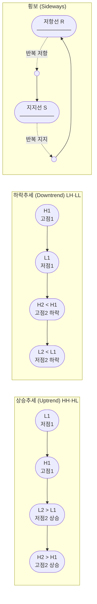
```mermaid
flowchart LR
    subgraph UP["상승추세 (Uptrend)  HH·HL"]
        L1_up(["L1\n저점1"]) --> H1_up(["H1\n고점1"])
        H1_up --> L2_up(["L2 > L1\n저점2 상승"])
        L2_up --> H2_up(["H2 > H1\n고점2 상승"])
    end
    subgraph DOWN["하락추세 (Downtrend)  LH·LL"]
        H1_dn(["H1\n고점1"]) --> L1_dn(["L1\n저점1"])
        L1_dn --> H2_dn(["H2 < H1\n고점2 하락"])
        H2_dn --> L2_dn(["L2 < L1\n저점2 하락"])
    end
    subgraph SIDE["횡보 (Sideways)"]
        R(["저항선 R\n─────────"]) -.->|"반복 저항"| MID1((" "))
        MID1 --> S(["지지선 S\n─────────"])
        S -.->|"반복 지지"| MID2((" "))
        MID2 --> R
    end
```

#### 추세선 긋는 법 (실전)

**상승 추세선**: 연속된 **저점 2개 이상**을 이어 아래에서 위로 올라가는 선
**하락 추세선**: 연속된 **고점 2개 이상**을 이어 위에서 아래로 내려가는 선

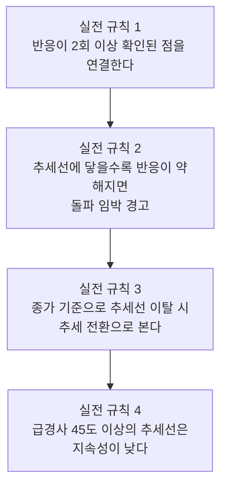
```mermaid
flowchart TD
    R1[실전 규칙 1\n반응이 2회 이상 확인된 점을 연결한다]
    R2[실전 규칙 2\n추세선에 닿을수록 반응이 약해지면\n돌파 임박 경고]
    R3[실전 규칙 3\n종가 기준으로 추세선 이탈 시\n추세 전환으로 본다]
    R4[실전 규칙 4\n급경사 45도 이상의 추세선은\n지속성이 낮다]
    R1 --> R2 --> R3 --> R4
```

#### 추세 채널 (Trend Channel)

추세선과 **평행한 선**을 그어 가격이 움직이는 통로(채널)를 표시합니다.

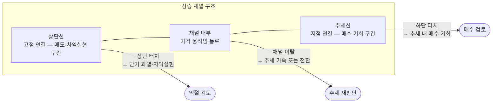
```mermaid
flowchart LR
    subgraph CHANNEL["상승 채널 구조"]
        direction LR
        TOP["상단선\n고점 연결 — 매도·차익실현 구간"]
        MID_CH["채널 내부\n가격 움직임 통로"]
        BOT["추세선\n저점 연결 — 매수 기회 구간"]
        TOP --- MID_CH --- BOT
    end
    BOT -- "하단 터치\n→ 추세 내 매수 기회" --> ACT_B([매수 검토])
    TOP -- "상단 터치\n→ 단기 과열·차익실현" --> ACT_S([익절 검토])
    MID_CH -- "채널 이탈\n→ 추세 가속 또는 전환" --> ACT_X([추세 재판단])
```

- 채널 **상단 터치**: 단기 과열, 차익실현 구간
- 채널 **하단 터치**: 추세 내 매수 기회
- 채널 **이탈**: 추세 가속 또는 추세 전환 신호

#### 추세 강도 판단

| 방법 | 기준 | 해석 |
|------|------|------|
| **ADX (평균방향성지수)** | ADX > 25 | 강한 추세 존재 |
| | ADX < 20 | 추세 없음 (횡보) |
| **거래량** | 추세 방향에서 거래량 증가 | 추세 신뢰도 상승 |
| | 추세 방향에서 거래량 감소 | 추세 약화 징후 |
| **이동평균 배열** | 단기 > 중기 > 장기 (정배열) | 상승 추세 강함 |
| | 단기 < 중기 < 장기 (역배열) | 하락 추세 강함 |

**실전 추세 분석 6단계 프로세스**

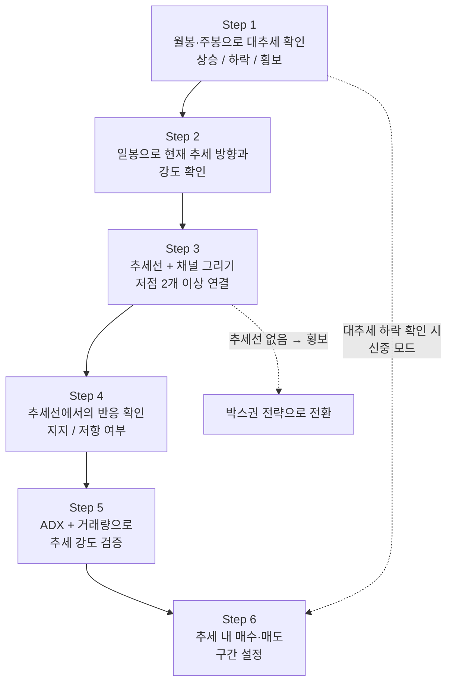
```mermaid
flowchart TD
    S1["Step 1\n월봉·주봉으로 대추세 확인\n상승 / 하락 / 횡보"] --> S2
    S2["Step 2\n일봉으로 현재 추세 방향과\n강도 확인"] --> S3
    S3["Step 3\n추세선 + 채널 그리기\n저점 2개 이상 연결"] --> S4
    S4["Step 4\n추세선에서의 반응 확인\n지지 / 저항 여부"] --> S5
    S5["Step 5\nADX + 거래량으로\n추세 강도 검증"] --> S6
    S6["Step 6\n추세 내 매수·매도\n구간 설정"]

    S1 -.->|"대추세 하락 확인 시\n신중 모드"| S6
    S3 -.->|"추세선 없음 → 횡보"| BOX["박스권 전략으로 전환"]
```

---

### 1. 지지선(Support)과 저항선(Resistance)

> 📖 **Wikipedia**: [기술적 분석](https://ko.wikipedia.org/wiki/기술적_분석_(금융))


- **지지선**: 가격이 내려오다가 자주 멈추는 구간 — 매수 세력이 모이는 가격대
- **저항선**: 올라가다가 자주 막히는 구간 — 매도 세력이 모이는 가격대

많은 투자자가 비슷한 가격대를 중요하게 보기 때문에 차트에 반복 반응 구간이 생깁니다.

- **역할 전환**: 돌파된 저항선은 이후 지지선으로, 붕괴된 지지선은 이후 저항선으로 바뀌는 경우가 많습니다.
- 선을 정확히 한 가격으로 보기보다 **여러 번 반응한 가격대 범위**로 보는 것이 실전에 가깝습니다.

**실전 활용법**

| 상황 | 대응 |
|------|------|
| 가격이 지지선 접근 + 거래량 감소 | 지지 유지 가능성 → 매수 검토 |
| 가격이 지지선 이탈 + 거래량 급증 | 지지 붕괴 → 다음 지지선으로 목표 하향 |
| 가격이 저항선 돌파 + 거래량 급증 | 돌파 신뢰 → 매수 진입 또는 목표가 상향 |
| 저항선 돌파 후 눌림목 (이전 저항 = 새 지지) | 역할 전환 확인 → 추가 매수 기회 |

**삼성전자 예시 — 역할 전환**

```
저항선 70,000원 → 3차례 저항 후 돌파
돌파 후 70,000원이 지지선으로 역할 전환
다음 목표: 이전 고점 80,000원대
```

### 2. 이동평균선(MA)과 골든크로스·데드크로스

> 📖 **Wikipedia**: [이동 평균](https://ko.wikipedia.org/wiki/이동_평균) · [골든 크로스](https://ko.wikipedia.org/wiki/골든_크로스)


| 이동평균선 | 기간 | 용도 |
|-----------|------|------|
| MA5 (단기) | 5일 | 단기 모멘텀 |
| MA20 (중기) | 20일 | 월간 추세 |
| MA60 (중장기) | 60일 | 분기 추세 |
| MA200 (장기) | 200일 | 장기 추세 기준선 |

---

# 📊 이동평균선과 추세 분석

## 이동평균선 구분
| 구분 | 대표 기간 | 특징 | 활용 |
|------|------------|------|------|
| 단기선 | 5일, 20일 | 주가 변동에 민감, 빠른 신호 발생 | 단타·스윙 매매 타이밍 포착 |
| 중기선 | 60일, 120일 | 한 달~분기 흐름 반영, 중심축 역할 | 스윙·중기 추세 매매 |
| 장기선 | 240일 | 6개월~1년 흐름 반영, 신뢰도 높음 | 대세 추세 판단, 기관·장기 투자자 활용 |

---

## 장기 이동평균선의 장점
- 추세 파악 용이성: 큰 방향성을 보여주므로 상승·하락장의 전환점 확인에 유용  
- 지지·저항 역할: 장기선 위는 강세장, 아래는 약세장으로 해석  
- 기관 투자자 기준: 장기 투자 전략의 핵심 지표  

---

## 골든크로스와 데드크로스


### 골든크로스 (Golden Cross)
- 단기선이 장기선을 **위로 돌파**
- 상승 추세 전환 신호 → 매수 시그널

### 데드크로스 (Dead Cross)
- 단기선이 장기선을 **아래로 돌파**
- 하락 추세 전환 신호 → 매도 시그널

---

## 결론
- 5일·20일선 → 단기 흐름 확인  
- 60일·120일선 → 중기 추세 파악  
- 240일선 → 장기 대세 방향성 판단  
- 장기선은 추세 파악에 가장 유용하며, 단기·중기선과 함께 조합해 보는 것이 효과적

---

## 참고
- 골든크로스: 상승 전환 신호  
- 데드크로스: 하락 전환 신호  
- MACD와 함께 보면 신뢰도 상승

---


**골든크로스·데드크로스 발생 시나리오**

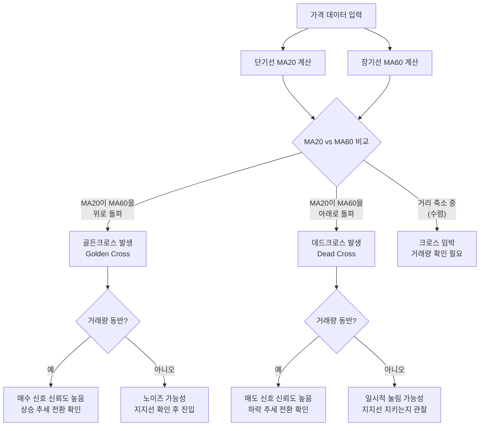
```mermaid
flowchart TD
    PX[가격 데이터 입력] --> MA20[단기선 MA20 계산]
    PX --> MA60[장기선 MA60 계산]

    MA20 --> CMP{MA20 vs MA60 비교}
    MA60 --> CMP

    CMP -- "MA20이 MA60을\n위로 돌파" --> GC["골든크로스 발생\nGolden Cross"]
    CMP -- "MA20이 MA60을\n아래로 돌파" --> DC["데드크로스 발생\nDead Cross"]
    CMP -- "거리 축소 중\n(수렴)" --> CV["크로스 임박\n거래량 확인 필요"]

    GC --> GC_V{거래량 동반?}
    GC_V -- 예 --> GC_BUY["매수 신호 신뢰도 높음\n상승 추세 전환 확인"]
    GC_V -- 아니오 --> GC_WAIT["노이즈 가능성\n지지선 확인 후 진입"]

    DC --> DC_V{거래량 동반?}
    DC_V -- 예 --> DC_SELL["매도 신호 신뢰도 높음\n하락 추세 전환 확인"]
    DC_V -- 아니오 --> DC_WAIT["일시적 눌림 가능성\n지지선 지키는지 관찰"]
```

- **골든크로스**: 단기선(MA20)이 장기선(MA60)을 위로 돌파 → 상승 추세 전환 신호
- **데드크로스**: 단기선이 장기선을 아래로 돌파 → 하락 추세 전환 신호
- 크로스 하나만 보지 않고 **거래량·지지저항**과 함께 봐야 신호 신뢰도가 높아집니다.

**이동평균선 정배열·역배열 실전 판단**

```
정배열(상승 강세):  MA5 > MA20 > MA60 > MA200
역배열(하락 약세):  MA5 < MA20 < MA60 < MA200
```

| 이동평균 활용 | 실전 포인트 |
|--------------|-------------|
| MA5·MA20 골든크로스 | 단기 매수 신호, 빠르지만 노이즈 많음 |
| MA20·MA60 골든크로스 | 중기 추세 전환 신호, 신뢰도 높음 |
| 가격이 MA200 위 → 아래 이탈 | 장기 하락 추세 전환 경고 |
| MA20이 지지선 역할 | 눌림목 매수 대기 구간 |

**실전 예시**: 코스피 2020년 코로나 저점 이후 MA20 > MA60 골든크로스 발생 → 이후 12개월 상승 추세 지속

### 3. 갭(Gap) 반전 분석

> 📖 **Wikipedia**: [갭 (금융)](https://ko.wikipedia.org/wiki/갭_(금융))


갭은 전날 종가와 다음 날 시가 사이에 가격이 크게 비어 있는 구간입니다.

| 갭 종류 | 특징 | 의미 |
|---------|------|------|
| **보통 갭** | 작은 갭, 빠르게 메움 | 일시적 수급 불균형 |
| **돌파 갭(Breakaway)** | 박스권·저항선 돌파 후 발생 | 강한 추세 시작 신호 |
| **달아나는 갭(Runaway)** | 추세 중간에 발생 | 추세 지속 신호 |
| **소진 갭(Exhaustion)** | 추세 끝에서 마지막 힘 | 추세 마감 경고 |

- 갭이 나온 뒤 거래량이 붙는지, 다시 메워지는지 확인하면 일시 반응인지 추세 시작인지 구분됩니다.

**갭 상승 후 체크리스트**

```
갭 상승 후 체크리스트:
□ 거래량이 평균의 2배 이상인가?  → 강한 추세 시작 가능성
□ 다음 날 갭을 메우려는 시도가 있는가?  → 소진갭 가능성
□ 갭 발생 전 박스권 상단을 돌파했는가?  → 돌파 갭 (추세 시작)
□ 갭 발생 후 5일 내 갭을 완전히 메우는가?  → 보통 갭 (일시적)
```

**실전 예시**: 실적 서프라이즈 발표 후 상승 갭 → 거래량 동반 + 박스권 돌파 → 돌파 갭으로 판단 → 눌림목 매수 전략 유효

### 4. 되돌림 분석 (피보나치 되돌림)

> 📖 **Wikipedia**: [피보나치 수열](https://ko.wikipedia.org/wiki/피보나치_수열) · [피보나치 되돌림](https://ko.wikipedia.org/wiki/피보나치_되돌림)


피보나치 수열에서 파생된 비율을 이용해 조정이 멈출 만한 구간을 가늠합니다.

**주요 피보나치 되돌림 레벨**

| 레벨 | 의미 |
|------|------|
| 23.6% | 약한 조정 후 지지 |
| 38.2% | 일반적 조정의 지지 |
| **50.0%** | 심리적 중간점 |
| **61.8%** | 황금비율 — 강력한 지지·저항 |
| 78.6% | 깊은 되돌림 |

- 피보나치 비율을 맹신하기보다 **지지선·저항선과 겹치는 구간**을 우선적으로 신뢰합니다.

**되돌림 실전 활용**

```
실전 예시:
주가가 50,000 → 80,000원으로 상승 후 조정 시작
피보나치 되돌림 적용:
  38.2% 되돌림 = 80,000 - (80,000-50,000)×0.382 = 68,540원 → 1차 지지
  61.8% 되돌림 = 80,000 - (80,000-50,000)×0.618 = 61,460원 → 강한 지지
68,540원 구간 + MA20 지지 겹침 → 높은 신뢰도의 매수 구간
```

| 되돌림 깊이 | 추세 강도 | 대응 |
|------------|----------|------|
| 23.6% 이하 | 매우 강한 상승 추세 | 추격 매수 가능 |
| 38.2% | 건강한 조정 | 눌림목 매수 적기 |
| 61.8% | 추세 확인 구간 | 신중한 매수 |
| 78.6% 초과 | 추세 약화 가능성 | 손절 후 관망 |

### 5. 보조지표: RSI, MACD, 볼린저밴드

> 📖 **Wikipedia**: [상대강도지수](https://ko.wikipedia.org/wiki/상대강도지수) · [MACD](https://ko.wikipedia.org/wiki/MACD) · [볼린저 밴드](https://ko.wikipedia.org/wiki/볼린저_밴드)


**RSI (Relative Strength Index, 상대강도지수)**

```
RSI = 100 - 100 / (1 + RS)
RS  = 14일 평균 상승폭 / 14일 평균 하락폭
```


**RSI 신호 판단 흐름**

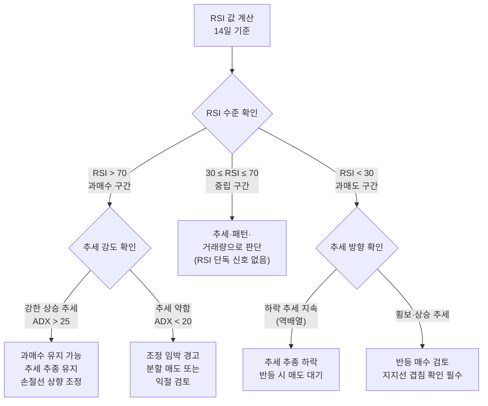
```mermaid
flowchart TD
    RSI_IN[RSI 값 계산\n14일 기준] --> RSI_CHK{RSI 수준 확인}

    RSI_CHK -- "RSI > 70\n과매수 구간" --> OB{추세 강도 확인}
    OB -- "강한 상승 추세\nADX > 25" --> OB_HOLD["과매수 유지 가능\n추세 추종 유지\n손절선 상향 조정"]
    OB -- "추세 약함\nADX < 20" --> OB_SELL["조정 임박 경고\n분할 매도 또는\n익절 검토"]

    RSI_CHK -- "30 ≤ RSI ≤ 70\n중립 구간" --> MID["추세·패턴·\n거래량으로 판단\n(RSI 단독 신호 없음)"]

    RSI_CHK -- "RSI < 30\n과매도 구간" --> OS{추세 방향 확인}
    OS -- "하락 추세 지속\n(역배열)" --> OS_WAIT["추세 추종 하락\n반등 시 매도 대기"]
    OS -- "횡보·상승 추세" --> OS_BUY["반등 매수 검토\n지지선 겹침 확인 필수"]
```

**MACD (Moving Average Convergence Divergence)**

```
MACD    = EMA12 - EMA26
Signal  = MACD의 9일 EMA
히스토그램 = MACD - Signal
```


**MACD 신호 판단 흐름**

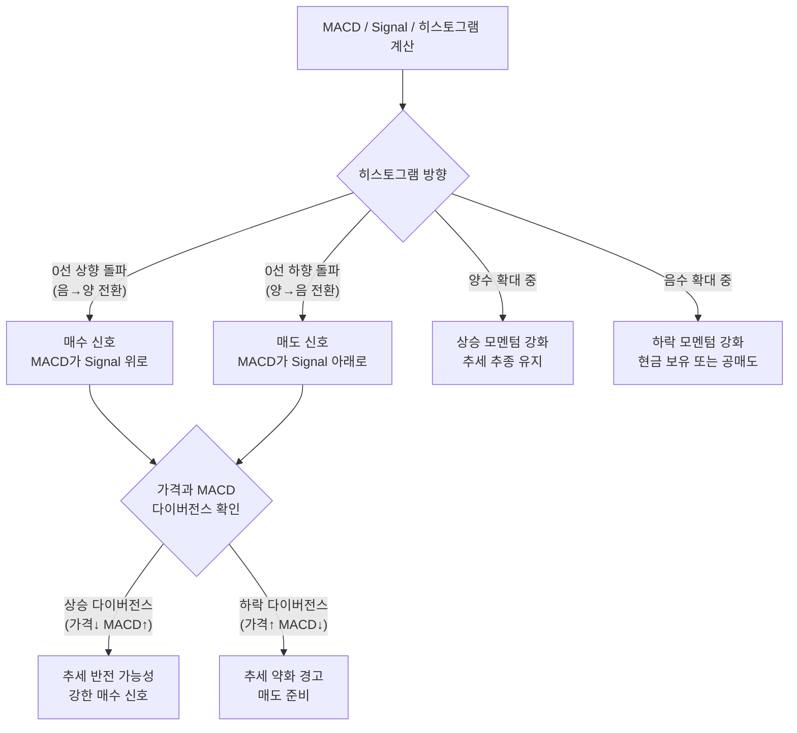
```mermaid
flowchart TD
    MACD_IN[MACD / Signal / 히스토그램 계산] --> HIST{히스토그램 방향}

    HIST -- "0선 상향 돌파\n(음→양 전환)" --> BUY_SIG["매수 신호\nMACD가 Signal 위로"]
    HIST -- "0선 하향 돌파\n(양→음 전환)" --> SELL_SIG["매도 신호\nMACD가 Signal 아래로"]
    HIST -- "양수 확대 중" --> TREND_UP["상승 모멘텀 강화\n추세 추종 유지"]
    HIST -- "음수 확대 중" --> TREND_DN["하락 모멘텀 강화\n현금 보유 또는 공매도"]

    BUY_SIG --> DIV{가격과 MACD\n다이버전스 확인}
    SELL_SIG --> DIV
    DIV -- "상승 다이버전스\n(가격↓ MACD↑)" --> DIV_BUY["추세 반전 가능성\n강한 매수 신호"]
    DIV -- "하락 다이버전스\n(가격↑ MACD↓)" --> DIV_SELL["추세 약화 경고\n매도 준비"]
```

**볼린저밴드 (Bollinger Bands)**

```
중심선    = MA20
상단밴드   = MA20 + 2σ (표준편차)
하단밴드   = MA20 - 2σ
```


- 밴드 폭 좁아짐(수렴) → 변동성 축소, 곧 큰 움직임 예고
- 가격이 상단 터치 후 꺾임 → 과열 주의

지표 간 방향이 일치하는지 확인하는 습관이 신호 신뢰도를 높입니다.

## 해보기 활동


오늘은 차트에서 "어디를 봐야 하는지"를 직접 표시해보세요.

1. [pykrx](https://github.com/sharebook-kr/pykrx) 또는 yfinance로 관심 종목 1개의 최근 1년 OHLCV를 수집하고, 가격·고가·저가·거래량이 모두 정상적으로 들어왔는지 확인하세요.
2. 위 멀티패널 차트 코드를 실행해 4패널 차트를 그리고, 골든크로스·데드크로스가 발생한 날짜와 당시 주가를 기록하세요.
3. 교육데이터플랫폼 시각화가이드 6가지 유형 중 **시간·분포·관계** 3가지를 골라 기술적 분석 차트로 각각 구현하세요. 예: 시간(MA 추이), 분포(일별 수익률 히스토그램), 관계(가격 vs 거래량 산점도).
4. RSI 과매수 구간(70 초과)에서 실제로 가격이 조정되었는지, 추세가 지속되었는지 차트에서 최소 2개 구간을 찾아 비교하세요.
5. MACD 히스토그램이 음수에서 양수로 전환되는 시점(매수 신호)과 실제 주가 반응을 비교해, "신호가 맞았던 경우"와 "맞지 않았던 경우"를 각각 1개씩 찾으세요.
6. 수정 주가와 수정 전 주가로 각각 MA20을 계산하고, 배당·분할이 있던 날짜 전후로 두 선이 어떻게 달라지는지 확인하세요.
7. 최종 산출물로 `technical_analysis_report.pdf` 목차를 만들고, 데이터 출처·수집일·지표 파라미터·수정 주가 여부·투자 유의사항을 포함하세요.


---

# 주식에서 왜 "이동평균"이라고 부르는가?

**이동평균(Moving Average)**의 "이동(moving)"은 평균값이 **시간에 따라 지속적으로 갱신되며 앞으로 이동**한다는 특성을 정확히 나타냅니다.

## 1. 이동평균의 계산 방식

이동평균은 특정 기간(예: 5일, 20일, 60일)의 가격(주로 종가)을 평균 내어 계산합니다.

### 단순 이동평균(SMA) 예시 (5일 이동평균)
- 오늘 포함 최근 5일 종가의 평균 = (오늘 + 1일전 + 2일전 + 3일전 + 4일전) ÷ 5
- **내일**이 되면 가장 오래된 날짜(4일전)가 빠지고, 새로운 오늘(내일) 가격이 들어와 평균이 다시 계산됩니다.

이처럼 **가장 오래된 데이터가 제외되고 최신 데이터가 포함**되는 과정을 반복하기 때문에, 평균선이 차트상에서 **시간축을 따라 계속 이동**합니다. 그래서 "이동"이라는 단어를 사용합니다.

## 2. "이동"이라는 표현의 의미

- **정적 평균(Static Average)**: 고정된 기간 전체의 평균 (예: 2025년 1월~12월 전체 평균). 한 번 계산하면 변하지 않음.
- **이동 평균(Moving Average)**: "이동하는 창(moving window)"이 시간과 함께 앞으로 이동하면서 평균을 계속 갱신.

이 **이동하는 창** 개념이 "Moving Average"라는 이름의 핵심입니다.

## 3. 실전에서의 의미

이동평균은 가격의 **추세(Trend)**를 평활화(Smoothing)하여 판단하기 쉽게 해줍니다.

- **골든크로스**: 단기 이동평균이 장기 이동평균을 위로 뚫고 올라갈 때 → 상승 추세 전환 신호
- **데드크로스**: 단기 이동평균이 장기 이동평균을 아래로 뚫고 내려갈 때 → 하락 추세 전환 신호

이러한 신호가 가능한 이유는 평균이 실시간으로 "이동"하면서 최근 가격 흐름을 지속적으로 반영하기 때문입니다.

---

# 📊 국내 및 미국 주식 시장 거래 시간대 정리

## 1. 국내 주식 시장 거래 시간 (한국거래소 기준)
한국 주식 시장은 정규장 전후로 시간외 거래가 촘촘하게 나누어져 있어, 전략에 따라 다양한 시간대에 거래할 수 있습니다.

| 구분 | 거래 시간 | 특징 및 매매 방식 |
| :--- | :--- | :--- |
| **장시작 전 동시호가** | 08:30 ~ 09:00 | 주문을 모았다가 09:00 정각에 하나의 시가로 체결 |
| **정규장** | **09:00 ~ 15:30** | 실시간으로 가격이 맞으면 바로 체결되는 메인 시장 |
| **장마감 동시호가** | 15:20 ~ 15:30 | 마지막 10분간 주문을 모아 15:30에 최종 종가 확정 |
| **장후 시간외 종가** | 15:40 ~ 16:00 | 당일 확정된 **종가 고정**으로 실시간 선착순 체결 |
| **시간외 단일가** | 16:00 ~ 18:00 | 10분마다 주문을 모아서 체결 (당일 종가 대비 ±10% 제한) |

---

## 2. 미국 주식 시장 거래 시간 (한국 시간 기준)
미국 증시는 정규장 앞뒤로 프리마켓(장전 거래)과 애프터마켓(장후 거래)이 길게 열립니다. 또한, 국내 주요 증권사를 통해 낮 시간대에도 거래할 수 있는 주간거래(데이마켓) 서비스가 제공되어 사실상 24시간 가깝게 거래가 가능합니다.

> 💡 **주의:** 미국은 **서머타임(3월 둘째 주 일요일 ~ 11월 첫째 주 일요일)** 적용 여부에 따라 한국 시간이 1시간씩 당겨지거나 늦춰집니다.

### ☀️ 서머타임 적용 시 (3월 ~ 11월)
* **주간거래 (데이마켓):** 09:00 ~ 16:30 (증권사별 상이)
* **프리마켓 (장전 거래):** **17:00 ~ 22:30** (일부 증권사는 18:00부터 지원)
* **정규장 (본장):** **22:30 ~ 익일 05:00** (거래량이 가장 많고 변동성이 활발한 시간)
* **애프터마켓 (장후 거래):** 05:00 ~ 07:00 (증권사별로 최대 09:00까지 연장 지원)

### ❄️ 서머타임 해제 시 (11월 ~ 익년 3월)
* **주간거래 (데이마켓):** 10:00 ~ 17:30
* **프리마켓 (장전 거래):** **18:00 ~ 23:30**
* **정규장 (본장):** **23:30 ~ 익일 06:00**
* **애프터마켓 (장후 거래):** 06:00 ~ 08:00

---

## ⚠️ 거래 시 유의사항
1. **정규장 외 거래의 변동성:** 프리마켓, 애프터마켓, 주간거래는 정규장에 비해 참여자가 적어 **거래량이 부족**할 수 있습니다. 
2. **호가 스프레드:** 매수와 매도 가격 간의 격차가 벌어지기 쉬우므로, 원하는 가격에 즉시 체결되지 않거나 순간적으로 가격이 급변할 수 있습니다.
3. **주문 방식 추천:** 변동성 리스크를 줄이기 위해 정규장 외 시간대에는 시장가 주문보다는 가급적 **지정가 주문**을 사용하는 것이 안전합니다.


"이동평균"이라는 이름은 평균이 **고정되어 있지 않고, 새로운 데이터가 들어올 때마다 창이 이동하며 계속 갱신된다**는 본질적인 특징을 가장 잘 드러내는 표현입니다.

영어권에서도 **Moving Average**, 한국어로도 **이동평균**이 국제적으로 통용되는 표준 용어입니다.

---

# 한국 주식 상한가·하한가 기준 안내

한국 주식 시장(코스피, 코스닥)의 **상한가**와 **하한가** 기준에 대한 설명입니다.

---

## 1. 상한가와 하한가란?

주식 시장에서 하루 동안 개별 종목의 주가가 움직일 수 있는 **최대 상승 제한 폭(상한가)**과 **최대 하락 제한 폭(하한가)**을 의미합니다. 

급격한 주가 변동으로부터 투자자를 보호하고 시장의 안정을 유지하기 위해 도입된 일종의 안전장치(가격제한폭 제도)입니다.

---

## 2. 현재 대한민국 주식 시장 기준

현재 한국거래소(KRX) 코스피와 코스닥 시장의 가격제한폭은 **기준가 대비 ±30%**입니다.

* **상한가:** 당일 기준가 + 30%
* **하한가:** 당일 기준가 - 30%

> 💡 **참고 (역사적 변경):** 과거에는 ±15%였으나, 시장의 자율성을 높이기 위해 2015년 6월 15일부터 현재의 ±30%로 확대되었습니다.

---

## 3. 가격 계산 방식 (호가단위 적용)

상한가와 하한가를 계산할 때는 단순히 30%를 곱하는 것에 그치지 않고, 주가 원미만 단위 절사 및 **호가 가격 단위**에 맞춰 조정됩니다.

### 호가 가격 단위 (코스피/코스닥 공통)
주가 범위에 따라 움직일 수 있는 최소 가격 단위가 다릅니다.

| 주가 범위 | 호가 단위 |
| :--- | :--- |
| 2,000원 미만 | 1원 |
| 2,000원 이상 ~ 5,000원 미만 | 5원 |
| 5,000원 이상 ~ 20,000원 미만 | 10원 |
| 20,000원 이상 ~ 50,000원 미만 | 50원 |
| 50,000원 이상 ~ 200,000원 미만 | 100원 |
| 200,000원 이상 ~ 500,000원 미만 | 500원 |
| 500,000원 이상 | 1,000원 |

### 🧮 예시: 기준가가 10,000원인 주식의 상한가 계산
1. **단순 30% 계산:** 10,000원 × 1.30 = 13,000원
2. **호가 단위 확인:** 10,000원 이상 ~ 20,000원 미만 구간의 호가 단위는 **10원**입니다.
3. **최종 상한가:** 13,000원은 10원 단위로 딱 떨어지므로, 이 종목의 당일 상한가는 **13,000원**이 됩니다.

---

## 4. 예외 및 특이사항

* **정리매매 종목:** 상장폐지가 결정되어 마지막으로 거래 기회를 주는 '정리매매' 기간에는 **상·하한가 제한폭이 적용되지 않습니다.** (하루에 몇백 %가 오르거나 내릴 수 있음)
* **신규 상장 주식:** 신규 상장일에는 공모가의 **60% ~ 400%**까지 가격 제한폭이 훨씬 넓게 적용됩니다.
* **미국 주식 시장:** 미국(NYSE, NASDAQ 등)은 한국과 달리 **상한가, 하한가 제도가 없습니다.** 대신 시장 전체가 급락할 때 매매를 일시 중단하는 '서킷 브레이커'나 개별 종목 변동성 완화 장치만 존재합니다.

---

# 주식 및 자산 시장의 시간대별 거래 활성화 분석

본 문서는 하루 중 자산 시장(주식, 가상화폐 등)의 거래가 활발한 시간대와 그 배경 원인에 대해 분석한 내용을 담고 있습니다.

---

## 1. 하루 중 거래가 가장 활발한 시간대

자산 시장에서 하루 중 거래량과 변동성이 가장 높은 시간대는 보통 **장 개시 직후**와 **장 마감 직전**입니다. 트레이더들 사이에서는 거래량 차트가 잔 모양을 닮았다고 하여 이를 **'유자(U)형 패턴'** 또는 **'컵 패턴'**이라고 부릅니다.

### ⚡ 피크 타임 1: 장 개시 후 1시간 (오전 09:00 ~ 10:00)
하루 중 거래량과 변동성이 가장 높은 황금 시간대입니다. 전체 하루 거래량의 상당 부분이 이 시기에 집중됩니다.
* **원인:** 정규장이 닫혀 있던 밤새 쌓인 뉴스, 미국 증시 흐름, 기업 공시 등의 정보가 개장과 동시에 한꺼번에 가격에 반영됩니다.
* **특징:** 가격 변동이 매우 빠르고 거칠기 때문에 단타 매매(데이 트레이딩) 투자자들이 가장 집중하는 시간입니다.

### 🔔 피크 타임 2: 장 마감 전 1시간 (오후 14:30 ~ 15:30)
장 마감이 다가오면서 다시 한번 거래량이 크게 솟구치는 시간대입니다. 특히 마지막 30분(오후 15:00 ~ 15:30)은 '파워 아워(Power Hour)'라고 불립니다.
* **원인:** 기관 투자자나 외국인들이 하루의 포지션을 정리하거나 내일을 위한 물량을 확보(종가 베팅)합니다. 당일 단타 매매를 하던 개인 투자자들도 오버나이트 리스크를 피하기 위해 현금화하는 움직임이 겹칩니다.
* **특징:** 당일 주가의 최종 종가가 결정되는 순간이므로 비교적 신뢰도 높은 추세가 형성됩니다.

### 💤 가장 한산한 시간대: 점심 및 오후 초반 (오전 11:30 ~ 오후 14:00)
기관 트레이더들의 점심 휴식 등으로 인해 시장 유동성이 급격히 줄어듭니다. 거래량이 적어 주가가 횡보하거나, 작은 주문에도 가격이 왜곡되는 경향이 있습니다.

---

## 2. 오후 4시대 한산함 vs 저녁 8시 이후 활성화의 원인

오후 4시대는 폭풍이 지나간 듯 고요한 반면, 저녁 8시가 넘어가면서 시장이 다시 꿈틀거리는 현상은 **글로벌 금융 중심지(미국 및 유럽)의 시차와 출근 시간** 때문입니다.

### 📉 오후 4시대가 한산한 이유: "아시아 시장의 퇴근"
대한민국 정규장(15:30 마감)을 비롯하여 중국, 일본 등 아시아 주요 증시가 오후 4시 전후로 모두 종료됩니다. 아시아 지역의 대형 투자자(기관, 고래)들이 거래를 마치고 퇴근하므로 유동성이 일시적으로 바닥을 치게 됩니다.

### 🔥 저녁 8시 이후 활발해지는 이유: "서구권 시장의 출근"
한국 시간 저녁 8시(20:00)는 지구 반대편의 **유럽 시장이 한창 돌아가는 시간**인 동시에, 세계 최대 시장인 **미국 증시의 프리마켓(장전 시간외 거래)이 본격화되는 시간**입니다.

1. **미국 프리마켓 활성화:** 미국 본장 개장 전, 저녁 6~8시부터 기관들과 글로벌 투자자들의 사전 거래가 활발해집니다. 주요 경제 지표와 기업 실적 발표가 이 시간에 집중됩니다.
2. **유럽 증시와의 교차:** 런던, 프랑크푸르트 등 유럽 증시의 오후 거래와 미국의 오전 거래 준비 시간이 맞물리며 글로벌 자금 이동이 극대화됩니다.

---

## 📊 자산별 저녁 8시 이후 흐름 요약

* **가상화폐 (비트코인 등):** 24시간 거래되지만, 미국 동부 기준 아침 시간(한국 시간 저녁 7~8시)에 서구권 트레이더들이 모니터 앞에 앉으면서 거래량과 변동성이 폭발합니다.
* **해외 주식 (미국 주식):** 본장 개장 전에 뉴스나 지표를 확인한 투자자들이 프리마켓에서 주문을 쏟아내며 거래량이 치솟습니다.
* **국내 주식 야간 거래:** 저녁 6시부터 밤 10시까지 진행되는 시간외 단일가 매매 및 야간 선물 시장에서 미국 시장의 분위기를 선반영하려는 움직임이 나타납니다.

---
*요약하자면, 오후 4시는 아시아 트레이더들이 컴퓨터를 끄는 시간이고, 저녁 8시는 전 세계 자금의 절대다수를 움직이는 미국과 유럽의 트레이더들이 출근해 거래를 시작하는 시간이기 때문입니다.*

---

# 기술적 분석 II (패턴 & 엘리어트 파동)


---

>
> 📝 **한자 병기 및 어원 사전**: 이 문서에 등장하는 용어의 한자·어원·일제강점기 유래는 → [voca.md](voca.md)

## 오늘 배울 것


- 캔들 패턴 분석 (도지, 망치, 장악형 등)
- 차트 패턴 분석 (헤드앤숄더, 이중천장 등)
- 엘리어트 파동 이론 개요
- 실습: 종목 선정 후 기본적·기술적 분석 통합 리포트

---

## 🔗 참고 사이트 & 데이터 원천


> 이 문서(기술적 분석 II — 캔들 패턴·차트 패턴·엘리어트 파동·통합 리포트)의 실습에 필요한 공식 데이터 출처와 참고 사이트입니다. ⚿ 는 API 키 또는 승인이 필요한 항목입니다.

### 📊 국내외 시장 데이터

| 기관/서비스 | URL | API 키 | 제공 데이터 |
|------------|-----|--------|-------------|
| yfinance (PyPI) | <https://pypi.org/project/yfinance> | 불필요 | 국내외 종목 OHLCV·재무 데이터 |
| pykrx (PyPI) | <https://pypi.org/project/pykrx> | 불필요 | 국내 종목 주가·거래량 시계열 |
| mplfinance (PyPI) | <https://pypi.org/project/mplfinance> | 불필요 | 캔들 패턴·차트 패턴 시각화 |
| pandas-ta (PyPI) | <https://pypi.org/project/pandas-ta> | 불필요 | 캔들 패턴 감지·기술 지표 계산 |
| DART(전자공시시스템) | <https://opendart.fss.or.kr> | ⚿ 필요 | 통합 리포트용 기업 재무 데이터 |
| KRX Data Marketplace | <https://openapi.krx.co.kr> | ⚿ 필요 | 공식 OHLCV 데이터 |

### 📈 차트·트레이딩 플랫폼 (학습·레퍼런스)

| 서비스 | URL | 활용 용도 |
|--------|-----|-----------|
| TradingView | <https://www.tradingview.com> | 캔들·차트 패턴 실시간 확인, 엘리어트 파동 도구 |
| Investing.com | <https://www.investing.com> | 기술 패턴 자동 감지·시그널 |
| StockCharts | <https://stockcharts.com> | 차트 패턴 사전·학습 자료 |

### 🏦 증권사 리서치센터 (통합 리포트 레퍼런스)

| 증권사 | URL | 활용 용도 |
|--------|-----|-----------|
| 미래에셋증권 리서치 | <https://securities.miraeasset.com> | 기본적·기술적 통합 분석 리포트 양식 |
| 삼성증권 리서치 | <https://www.samsungpop.com> | 종목 리포트·매매 의견 구조 참고 |
| 대신증권 리서치 | <https://www.daishin.com> | 기술적 분석 포함 주간 리포트 |
| 신한투자증권 | <https://www.shinhaninvest.com> | 통합 리포트 형식 참고 |
| FnGuide | <https://www.fnguide.com> | 컨센서스·투자의견 데이터 |

### 📰 금융 미디어 & 정보 포탈

| 서비스 | URL | 활용 용도 |
|--------|-----|-----------|
| 머니투데이 방송(MTN) | <https://mtn.co.kr> | 패턴·파동 분석 시황 해설 |
| 한국경제TV(WOW TV) | <https://www.wowtv.co.kr> | 기술 분석 실전 매매 방송 |
| 네이버 금융 | <https://finance.naver.com> | 종목 차트·기업 정보 조회 |
| 금융감독원(FSS) | <https://www.fss.or.kr> | 공시·감독 규정 확인 |
| 금융위원회 | <https://www.fsc.go.kr> | 자본시장·증권 규제 정보 |

---

### 1. 캔들 패턴 분석 (도지, 망치, 장악형 등)

> 📖 **Wikipedia**: [캔들스틱 차트](https://ko.wikipedia.org/wiki/캔들스틱_차트)

캔들 차트 하나(봉)는 시가·고가·저가·종가를 한눈에 보여줍니다. 캔들의 몸통 크기와 꼬리 길이가 그날의 매수·매도 심리를 나타냅니다.

**캔들의 구조**

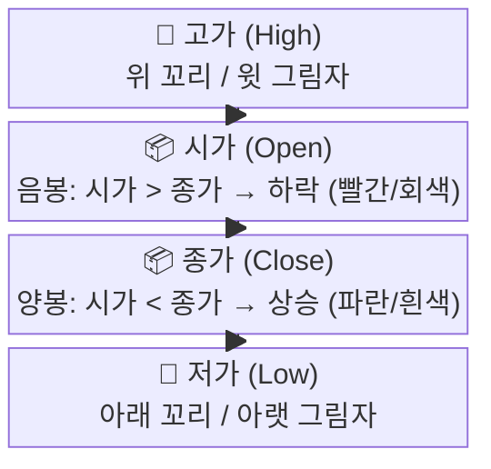
```mermaid
block-beta
  columns 1
  H["🔺 고가 (High)\n위 꼬리 / 윗 그림자"]
  O["📦 시가 (Open)\n음봉: 시가 > 종가 → 하락 (빨간/회색)"]
  C["📦 종가 (Close)\n양봉: 시가 < 종가 → 상승 (파란/흰색)"]
  L["🔻 저가 (Low)\n아래 꼬리 / 아랫 그림자"]

  H --> O
  O --> C
  C --> L
```


**OHLC 관계도**

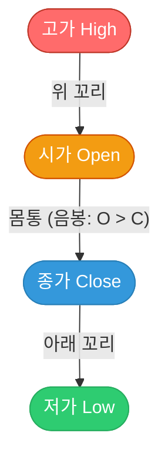
```mermaid
flowchart TD
    H(["고가 High"]):::high
    O(["시가 Open"]):::open
    C(["종가 Close"]):::close
    L(["저가 Low"]):::low

    H -->|"위 꼬리"| O
    O -->|"몸통 (음봉: O > C)"| C
    C -->|"아래 꼬리"| L

    classDef high fill:#ff6b6b,color:#fff,stroke:#c0392b
    classDef open fill:#f39c12,color:#fff,stroke:#d35400
    classDef close fill:#3498db,color:#fff,stroke:#2980b9
    classDef low fill:#2ecc71,color:#fff,stroke:#27ae60
```

**주요 캔들 패턴**

| 패턴 | 모양 특징 | 의미 |
|------|-----------|------|
| **도지(Doji)** | 몸통이 거의 없음 (시가≈종가) | 매수·매도 균형, 방향 전환 가능성 |
| **망치(Hammer)** | 짧은 몸통 + 긴 아래 꼬리 (하락 후 나타남) | 매도세가 결국 매수세에 밀림 → 반등 신호 |
| **역망치(Inverted Hammer)** | 짧은 몸통 + 긴 위 꼬리 (하락 후 나타남) | 매수 시도 후 저항, 반등 가능성 |
| **교수형(Hanging Man)** | 망치와 모양 같지만 상승 후 나타남 | 상승 추세 마감 신호 |
| **불리쉬 엔걸핑(Bullish Engulfing)** | 큰 양봉이 앞날 음봉 전체를 덮음 | 강한 매수 전환 신호 |
| **베어리쉬 엔걸핑(Bearish Engulfing)** | 큰 음봉이 앞날 양봉 전체를 덮음 | 강한 매도 전환 신호 |
| **샛별(Morning Star)** | 음봉 → 도지 → 양봉 3캔들 조합 | 바닥 반전 강한 신호 |


**캔들 패턴 실전 활용 — 패턴만으로 매매하면 안 되는 이유**

| 체크 항목 | 이유 |
|-----------|------|
| 패턴 발생 위치 (지지선·저항선 근처인가?) | 위치가 맞아야 신뢰도 상승 |
| 거래량이 평균보다 많은가? | 거래량 동반 시 신호 강도 증가 |
| 다음 봉이 방향을 확인해주는가? | 확인봉 없이 단독 진입은 위험 |
| 추세 방향과 일치하는가? | 추세 역방향 패턴은 성공률 낮음 |

**실전 신뢰도 판단 흐름**

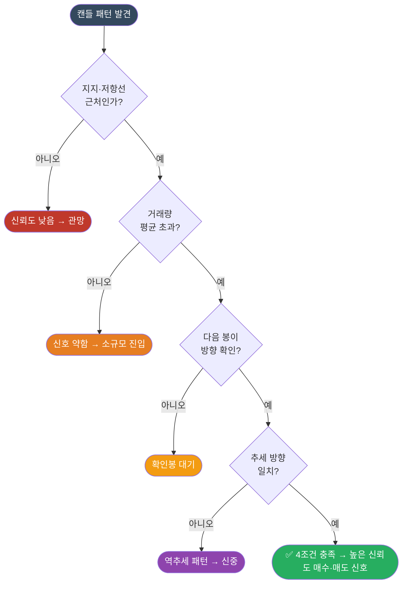
```mermaid
flowchart TD
    A([캔들 패턴 발견]) --> B{지지·저항선\n근처인가?}
    B -- 아니오 --> Z1([신뢰도 낮음 → 관망])
    B -- 예 --> C{거래량\n평균 초과?}
    C -- 아니오 --> Z2([신호 약함 → 소규모 진입])
    C -- 예 --> D{다음 봉이\n방향 확인?}
    D -- 아니오 --> Z3([확인봉 대기])
    D -- 예 --> E{추세 방향\n일치?}
    E -- 아니오 --> Z4([역추세 패턴 → 신중])
    E -- 예 --> F([✅ 4조건 충족 → 높은 신뢰도 매수·매도 신호])

    style A fill:#34495e,color:#fff
    style F fill:#27ae60,color:#fff
    style Z1 fill:#c0392b,color:#fff
    style Z2 fill:#e67e22,color:#fff
    style Z3 fill:#f39c12,color:#fff
    style Z4 fill:#8e44ad,color:#fff
```

**캔들 패턴 Python 시각화**


---

### 2. 차트 패턴 분석 (헤드앤숄더, 이중천장 등)

> 📖 **Wikipedia**: [기술적 분석](https://ko.wikipedia.org/wiki/기술적_분석_(금융)) · [머리어깨형](https://ko.wikipedia.org/wiki/머리어깨형)

차트 패턴은 여러 캔들에 걸쳐 형성되는 **가격 흐름의 모양**으로, 추세 전환이나 지속을 예측하는 데 활용합니다.


**반전 패턴 (Reversal Patterns)**

| 패턴 | 모양 | 신호 |
|------|------|------|
| **헤드앤숄더(H&S)** | 세 봉우리 (중간이 가장 높음) | 상승 추세 종료, 하락 전환 |
| **역 헤드앤숄더** | 세 골짜기 (중간이 가장 낮음) | 하락 추세 종료, 상승 전환 |
| **이중천장(Double Top)** | M자 모양 (두 개의 비슷한 고점) | 강한 저항, 하락 전환 |
| **이중바닥(Double Bottom)** | W자 모양 (두 개의 비슷한 저점) | 강한 지지, 상승 전환 |

**헤드앤숄더 패턴 구조**

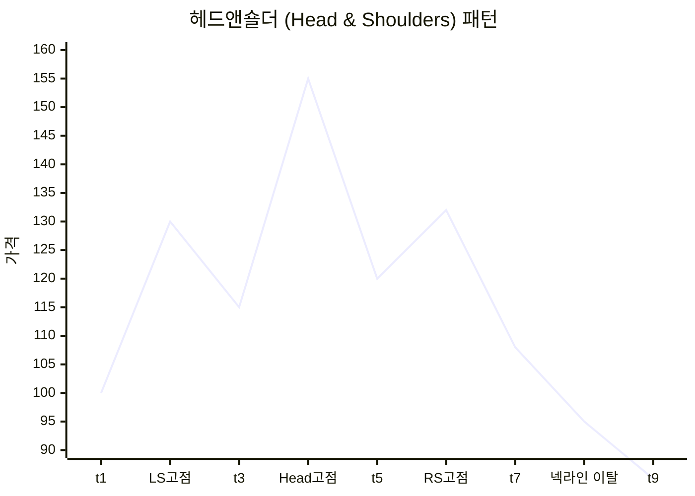
```mermaid
xychart-beta
    title "헤드앤숄더 (Head & Shoulders) 패턴"
    x-axis ["t1", "LS고점", "t3", "Head고점", "t5", "RS고점", "t7", "넥라인 이탈", "t9"]
    y-axis "가격" 90 --> 160
    line [100, 130, 115, 155, 120, 132, 108, 95, 85]
```

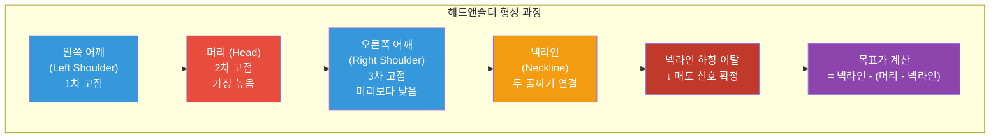
```mermaid
flowchart LR
    subgraph HnS["헤드앤숄더 형성 과정"]
        direction LR
        LS["왼쪽 어깨\n(Left Shoulder)\n1차 고점"]
        H["머리 (Head)\n2차 고점\n가장 높음"]
        RS["오른쪽 어깨\n(Right Shoulder)\n3차 고점\n머리보다 낮음"]
        NL["넥라인\n(Neckline)\n두 골짜기 연결"]
        BD["넥라인 하향 이탈\n↓ 매도 신호 확정"]
        TP["목표가 계산\n= 넥라인 - (머리 - 넥라인)"]
    end

    LS --> H --> RS --> NL --> BD --> TP

    style LS fill:#3498db,color:#fff
    style H fill:#e74c3c,color:#fff
    style RS fill:#3498db,color:#fff
    style NL fill:#f39c12,color:#fff
    style BD fill:#c0392b,color:#fff
    style TP fill:#8e44ad,color:#fff
```


**지속 패턴 (Continuation Patterns)**

| 패턴 | 의미 |
|------|------|
| **삼각수렴(Triangle)** | 변동성 축소 후 기존 방향으로 돌파 |
| **깃발(Flag)** | 급등/급락 후 잠시 쉬고 같은 방향 지속 |
| **페넌트(Pennant)** | 깃발과 유사하나 삼각 수렴 형태 |

**차트 패턴 실전 목표가 계산법**

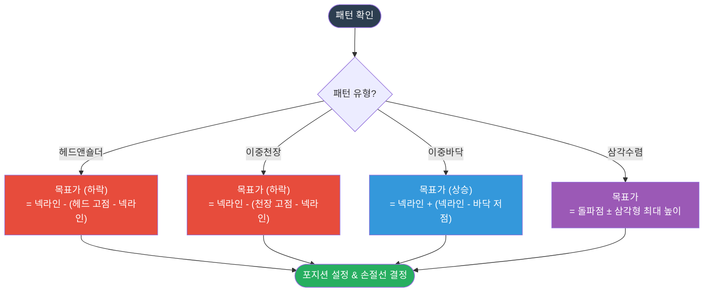
```mermaid
flowchart TD
    A([패턴 확인]) --> B{패턴 유형?}

    B -->|헤드앤숄더| C["목표가 (하락)\n= 넥라인 - (헤드 고점 - 넥라인)"]
    B -->|이중천장| D["목표가 (하락)\n= 넥라인 - (천장 고점 - 넥라인)"]
    B -->|이중바닥| E["목표가 (상승)\n= 넥라인 + (넥라인 - 바닥 저점)"]
    B -->|삼각수렴| F["목표가\n= 돌파점 ± 삼각형 최대 높이"]

    C --> G([포지션 설정 & 손절선 결정])
    D --> G
    E --> G
    F --> G

    style A fill:#2c3e50,color:#fff
    style G fill:#27ae60,color:#fff
    style C fill:#e74c3c,color:#fff
    style D fill:#e74c3c,color:#fff
    style E fill:#3498db,color:#fff
    style F fill:#9b59b6,color:#fff
```

**패턴 신뢰도 높이는 조건**

| 조건 | 효과 |
|------|------|
| 패턴 형성에 시간이 오래 걸릴수록 | 돌파 후 움직임이 크고 신뢰도 높음 |
| 돌파 시 거래량 급증 | 돌파의 진정성 확인 |
| 넥라인 돌파 후 눌림목에서 지지 확인 | 재진입 기회이자 패턴 확정 |
| 여러 시간대(일봉·주봉)에서 동시 형성 | 더 강한 신호 |

---

### 3. 엘리어트 파동 이론 (Elliott Wave Theory)

> 📖 **Wikipedia**: [엘리엇 파동 이론](https://ko.wikipedia.org/wiki/엘리엇_파동_이론) · [피보나치 수열](https://ko.wikipedia.org/wiki/피보나치_수열)

랄프 넬슨 엘리어트(Ralph Nelson Elliott)가 1930년대에 제안한 이론으로, 주가가 **군중 심리의 반복 패턴**에 따라 파동 형태로 움직인다고 봅니다.


---

#### 3-1. 기본 파동 구조 — 충격 5파 + 조정 3파

상승 추세에서는 **5개의 충격파(임펄스)**와 **3개의 조정파(a-b-c)**가 한 사이클을 이룹니다.

**엘리어트 기본 8파동 구조**

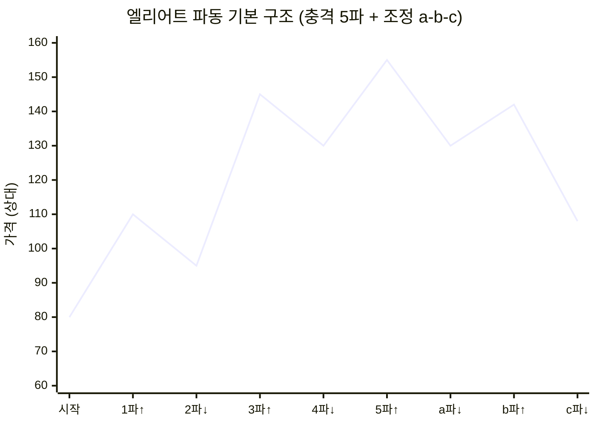
```mermaid
xychart-beta
    title "엘리어트 파동 기본 구조 (충격 5파 + 조정 a-b-c)"
    x-axis ["시작", "1파↑", "2파↓", "3파↑", "4파↓", "5파↑", "a파↓", "b파↑", "c파↓"]
    y-axis "가격 (상대)" 60 --> 160
    line [80, 110, 95, 145, 130, 155, 130, 142, 108]
```

| 파동 구분 | 파동 | 방향 | 군중 심리 |
|-----------|------|------|-----------|
| 충격파(추세) | **1파** | 상승 | 소수만 인식, "반등 아닐까?" |
| 충격파(추세) | **2파** | 하락 | "역시 하락이었어" 공포 매도 |
| 충격파(추세) | **3파** | 강상승 | "진짜 상승이다!" 추세 추종 |
| 충격파(추세) | **4파** | 하락 | 이익 실현, 단기 조정 |
| 충격파(추세) | **5파** | 약상승 | "아직 올라!" 뒤늦은 매수 |
| 조정파(역추세) | **a파** | 하락 | "잠깐 조정이겠지" 낙관 |
| 조정파(역추세) | **b파** | 상승 | "역시 오르네" 반등 매수 |
| 조정파(역추세) | **c파** | 강하락 | 패닉셀, 손절 쏟아짐 |

---

#### 3-2. 절대 불변 규칙 3가지

> 이 규칙 중 하나라도 어기면 파동 카운팅을 전부 재시작해야 합니다.

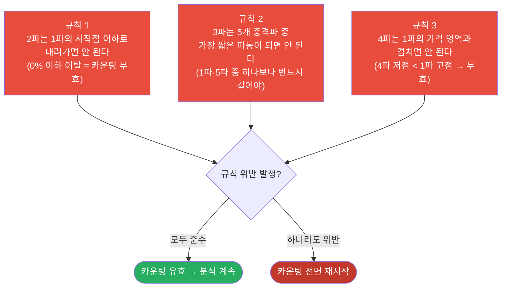
```mermaid
flowchart TD
    R1["규칙 1\n2파는 1파의 시작점 이하로\n내려가면 안 된다\n(0% 이하 이탈 = 카운팅 무효)"]
    R2["규칙 2\n3파는 5개 충격파 중\n가장 짧은 파동이 되면 안 된다\n(1파·5파 중 하나보다 반드시 길어야)"]
    R3["규칙 3\n4파는 1파의 가격 영역과\n겹치면 안 된다\n(4파 저점 < 1파 고점 → 무효)"]

    CHECK{규칙 위반 발생?}
    VALID([카운팅 유효 → 분석 계속])
    RESET([카운팅 전면 재시작])

    R1 --> CHECK
    R2 --> CHECK
    R3 --> CHECK
    CHECK -->|"모두 준수"| VALID
    CHECK -->|"하나라도 위반"| RESET

    style R1 fill:#e74c3c,color:#fff
    style R2 fill:#e74c3c,color:#fff
    style R3 fill:#e74c3c,color:#fff
    style VALID fill:#27ae60,color:#fff
    style RESET fill:#c0392b,color:#fff
```

---

#### 3-3. 피보나치 비율과 각 파동의 관계

엘리어트 파동이론과 피보나치 수열은 분리할 수 없습니다. 각 파동의 크기는 피보나치 비율을 따르는 경향이 있습니다.

| 파동 | 일반적 피보나치 목표 | 설명 |
|------|---------------------|------|
| **2파** (1파 되돌림) | 0.618 × 1파 크기 | 1파 상승분의 61.8% 되돌림 구간 진입 대기 |
| **3파** (1파 대비 연장) | 1.618 × 1파 크기 | 3파 목표가 = 1파 시작 + (1파 크기 × 1.618) |
| **4파** (3파 되돌림) | 0.382 × 3파 크기 | 3파 상승분의 38.2% 되돌림 (얕은 조정) |
| **5파** (1파와 동일하거나 더 짧음) | 0.618 × 3파 또는 1파와 동일 | 3파 대비 짧게 끝나면 종료 임박 신호 |
| **a파** (5파 되돌림) | 0.382~0.618 × 5파 크기 | a파 크기로 c파 목표 예측 |
| **c파** (a파 연장) | a파 크기와 동일하거나 1.618배 | c파 = a파 시작 - (a파 크기 × 1.0~1.618) |

**실전 예시 (코스피 2020~2022 가상 적용)**

```
2020.03 코스피 1,457 (바닥) → 1파 시작
2020.06 코스피 2,200 → 1파 완성 (+51%)
2020.09 코스피 1,900 → 2파 완성 (1파의 40% 되돌림 ≈ 피보나치 38.2%)
2021.01 코스피 3,266 → 3파 완성 (1파의 2.7배 ≈ 피보나치 261.8%)
2021.05 코스피 2,890 → 4파 완성 (3파의 20% 되돌림)
2021.07 코스피 3,305 → 5파 완성 (새 고점, 거래량 3파 대비 감소)
2022.09 코스피 2,155 → a-b-c 조정 완성
```

**피보나치 되돌림 수준별 파동 매핑**

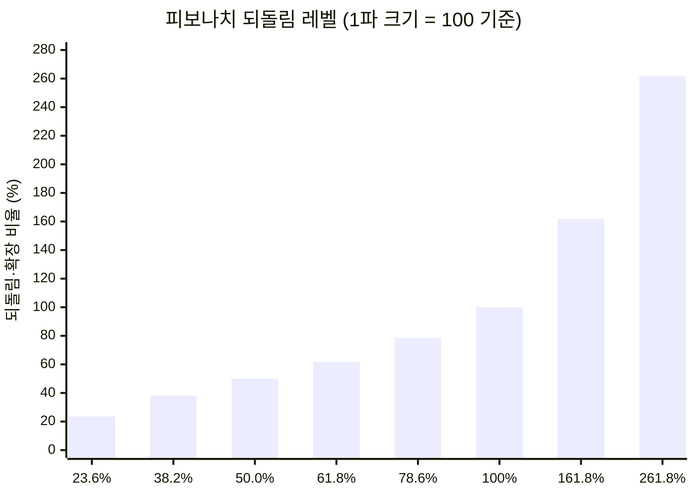
```mermaid
xychart-beta
    title "피보나치 되돌림 레벨 (1파 크기 = 100 기준)"
    x-axis ["23.6%", "38.2%", "50.0%", "61.8%", "78.6%", "100%", "161.8%", "261.8%"]
    y-axis "되돌림·확장 비율 (%)" 0 --> 280
    bar [23.6, 38.2, 50.0, 61.8, 78.6, 100, 161.8, 261.8]
```

---

#### 3-4. 조정파동의 3가지 유형

5파 상승 후 나타나는 a-b-c 조정은 모두 같은 형태가 아닙니다. 3가지 주요 유형이 있습니다.

**유형 1: 지그재그(Zigzag) — 5-3-5 구조**

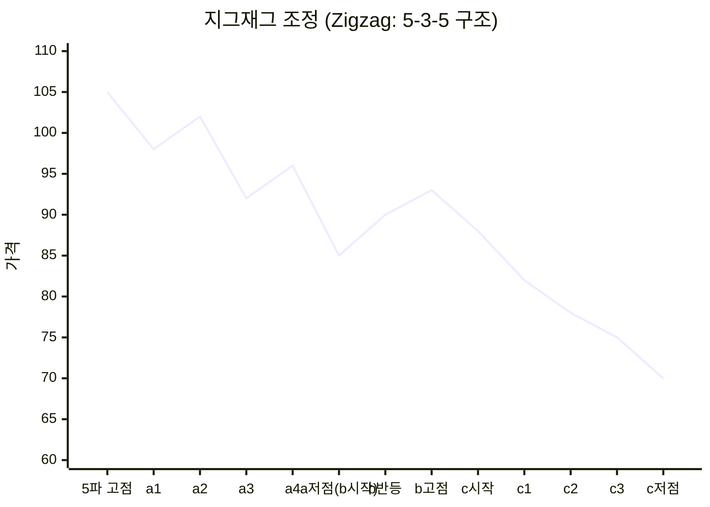
```mermaid
xychart-beta
    title "지그재그 조정 (Zigzag: 5-3-5 구조)"
    x-axis ["5파 고점", "a1", "a2", "a3", "a4", "a저점(b시작)", "b반등", "b고점", "c시작", "c1", "c2", "c3", "c저점"]
    y-axis "가격" 60 --> 110
    line [105, 98, 102, 92, 96, 85, 90, 93, 88, 82, 78, 75, 70]
```

- 가장 흔한 조정 패턴
- c파가 a파 저점 아래로 하락 → 큰 되돌림
- 2파에서 자주 나타남

**유형 2: 플랫(Flat) — 3-3-5 구조**

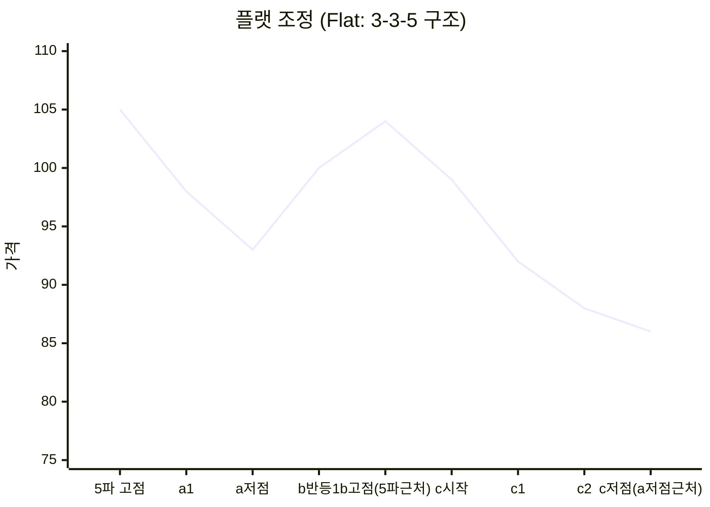
```mermaid
xychart-beta
    title "플랫 조정 (Flat: 3-3-5 구조)"
    x-axis ["5파 고점", "a1", "a저점", "b반등1", "b고점(5파근처)", "c시작", "c1", "c2", "c저점(a저점근처)"]
    y-axis "가격" 75 --> 110
    line [105, 98, 93, 100, 104, 99, 92, 88, 86]
```

- 조정 폭이 얕아 강세장 신호
- 4파에서 자주 나타남

**유형 3: 삼각형(Triangle) — 3-3-3-3-3 구조**

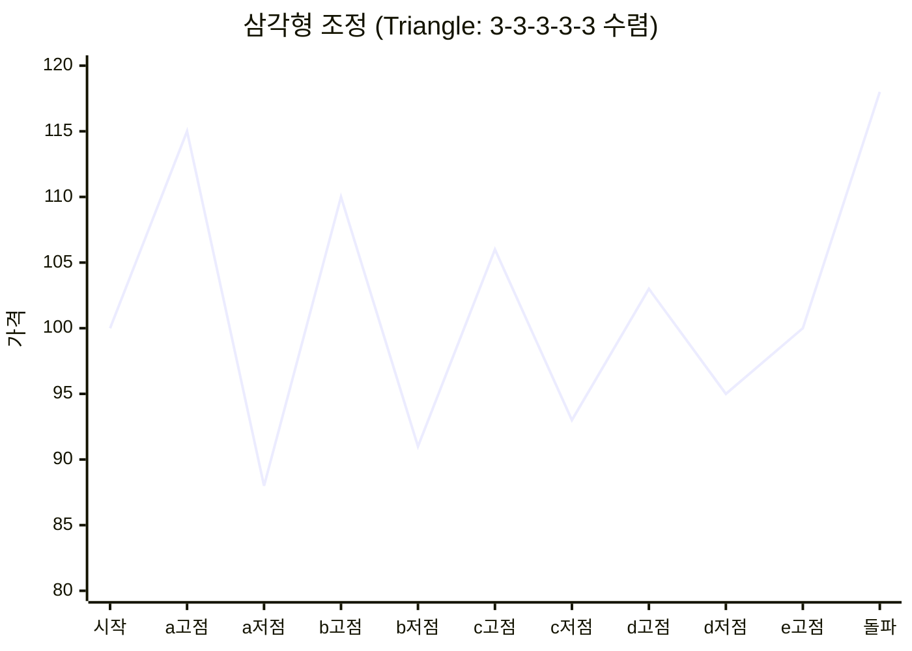
```mermaid
xychart-beta
    title "삼각형 조정 (Triangle: 3-3-3-3-3 수렴)"
    x-axis ["시작", "a고점", "a저점", "b고점", "b저점", "c고점", "c저점", "d고점", "d저점", "e고점", "돌파"]
    y-axis "가격" 80 --> 120
    line [100, 115, 88, 110, 91, 106, 93, 103, 95, 100, 118]
```

- 변동성이 점점 줄어드는 패턴
- 4파 또는 b파에서 나타남
- 삼각형 돌파 방향이 다음 추세 방향

| 유형 | 구조 | c파 위치 | 발생 위치 | 함의 |
|------|------|----------|-----------|------|
| 지그재그 | 5-3-5 | a파 저점 아래 | 주로 2파 | 큰 조정, 매수 기회 낮음 |
| 플랫 | 3-3-5 | a파 저점 근처 | 주로 4파 | 얕은 조정, 추세 강건 |
| 삼각형 | 3-3-3-3-3 | 수렴 후 돌파 | 4파·b파 | 돌파 전 에너지 축적 |

---

#### 3-5. 파동의 프랙탈 구조 (파동 속 파동)

엘리어트 파동의 핵심 특성은 **자기 유사성(프랙탈)**입니다. 큰 파동 하나가 작은 파동들의 집합입니다.

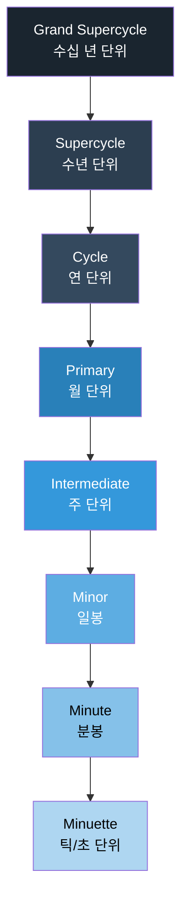
```mermaid
flowchart TD
    GS["Grand Supercycle\n수십 년 단위"]
    SC["Supercycle\n수년 단위"]
    CY["Cycle\n연 단위"]
    PR["Primary\n월 단위"]
    IT["Intermediate\n주 단위"]
    MN["Minor\n일봉"]
    MT["Minute\n분봉"]
    NT["Minuette\n틱/초 단위"]

    GS --> SC --> CY --> PR --> IT --> MN --> MT --> NT

    style GS fill:#1a252f,color:#fff
    style SC fill:#2c3e50,color:#fff
    style CY fill:#34495e,color:#fff
    style PR fill:#2980b9,color:#fff
    style IT fill:#3498db,color:#fff
    style MN fill:#5dade2,color:#fff
    style MT fill:#85c1e9,color:#000
    style NT fill:#aed6f1,color:#000
```

**실전 의미**: 일봉에서 보이는 5파 구조 전체가, 주봉으로 보면 단 하나의 3파일 수 있습니다.
→ 분석 시 **시간대를 여러 개 겹쳐 보는 것**이 중요합니다.

---

#### 3-6. 파동별 실전 매매 전략

| 파동 위치 | 가능한 전략 | 진입 조건 | 손절 기준 |
|-----------|------------|-----------|-----------|
| **2파 완성** | 3파 시작 예상 매수 | RSI 과매도 + 피보나치 61.8% 지지 + 거래량 반등 | 1파 시작점 이탈 시 |
| **3파 진행 중** | 추세 추종 매수 | 이전 고점 돌파 + 거래량 급증 + 정배열 | 4파 시작 조짐(다이버전스) 시 |
| **4파 완성** | 5파 예상 진입 (소형 포지션) | 피보나치 38.2% 지지 + 지지선 반등 확인 | 1파 고점 하향 이탈 시 |
| **5파 말단** | 포지션 축소 / 매도 준비 | RSI 다이버전스 + 거래량 감소 + 피보나치 확장 161.8% | 새로운 고점 형성 시 재검토 |
| **c파 완성** | 새 1파 매수 | 이전 저항선 돌파 + 거래량 회복 + MACD 골든크로스 | c파 저점 이탈 시 |

---

#### 3-7. 실전 파동 식별 6단계 프로세스

```mermaid
flowchart TD
    S1["Step 1. 시간대 설정\n주봉(큰 그림) + 일봉(실전 진입)\n두 시간대 동시 분석"]
    S2["Step 2. 명확한 고점·저점 식별\n최소 3~5개 유의미한\n전환점(swing high/low) 표시"]
    S3["Step 3. 절대 규칙 3가지 검증\n2파: 0% 이하 이탈 여부\n3파: 가장 짧은지 여부\n4파: 1파 고점 침범 여부"]
    S4["Step 4. 피보나치 비율 대조\n각 파동 크기가\n피보나치 비율에 부합하는지 확인"]
    S5["Step 5. 거래량 패턴 확인\n3파: 폭발 / 5파: 3파보다 감소\n조정파: 전반적 감소"]
    S6["Step 6. 보조지표 교차 확인\nRSI·MACD 다이버전스로\n5파·c파 완성 확인"]

    RESULT_V([✅ 카운팅 신뢰 → 매매 전략 수립])
    RESULT_I([⚠️ 규칙 위반 발견 → Step 1부터 재시작])

    S1 --> S2 --> S3 --> S4 --> S5 --> S6
    S3 -->|"규칙 위반"| RESULT_I
    S6 -->|"모든 단계 통과"| RESULT_V

    style S1 fill:#2c3e50,color:#fff
    style S2 fill:#2980b9,color:#fff
    style S3 fill:#e74c3c,color:#fff
    style S4 fill:#f39c12,color:#fff
    style S5 fill:#27ae60,color:#fff
    style S6 fill:#8e44ad,color:#fff
    style RESULT_V fill:#1e8449,color:#fff
    style RESULT_I fill:#922b21,color:#fff
```

---

#### 3-8. 거래량으로 파동 확인하기

| 파동 | 기대되는 거래량 패턴 | 이유 |
|------|---------------------|------|
| 1파 | 평균 이상, 상승 시 | 소수가 먼저 매수 |
| 2파 | 1파보다 감소 | 공포 매도 후 소강 |
| **3파** | **폭발적 증가 (가장 많음)** | 추세 추종 + 뉴스 + 기관 매수 |
| 4파 | 3파보다 감소 | 이익 실현, 관망 |
| 5파 | 3파보다 적음 | 뒤늦은 개인 매수, 기관 매도 |
| a파 | 갑자기 증가 | 예상 못한 하락 |
| b파 | 감소 | 반등이지만 신뢰도 낮음 |
| c파 | 증가 (패닉셀) | 손절물량 + 공매도 |

---

#### 3-9. 실전 조합 전략 — 피보나치·보조지표 연동

```
[최강 매수 조건 — 3파 진입]
  엘리어트 2파 저점 근처
  + 피보나치 61.8% 되돌림 지지
  + RSI < 30 (과매도)
  + MACD 히스토그램 반전 (음→양)
  + 거래량 바닥 후 반등
  → 3파 상승 진입 조건 충족 → 강한 매수 신호

[최강 매도 조건 — 5파 청산]
  엘리어트 5파 고점 근처
  + 피보나치 확장 161.8% 도달
  + RSI 70 이상 + 다이버전스 발생
  + MACD 하락 전환 조짐
  + 거래량 5파가 3파보다 적음
  → a파 시작 경고 → 매도 또는 이익 실현 신호

[조정 완료 확인 — c파 바닥 매수]
  a파·c파 크기 동일 (or c파 = a파 × 1.618)
  + 피보나치 61.8~78.6% 되돌림 지지
  + 캔들 망치봉·역망치봉
  + 거래량 급감 후 반등
  → 새로운 1파 시작 가능성
```

---

#### 3-10. 주의사항 및 한계

| 항목 | 내용 |
|------|------|
| **주관성** | 파동 카운팅은 전문가마다 다를 수 있어 '정답'이 없음 |
| **후행성** | 파동이 완성돼야 확인 가능 — "지나야 보임" 비판 |
| **단독 사용 금지** | RSI·MACD·피보나치·거래량과 반드시 병행 |
| **시간대 선택** | 분봉·일봉·주봉 시간대에 따라 카운팅 결과가 달라짐 |
| **실패 확률** | 5파 이후 반드시 조정이 오지만 시점 예측은 불확실 |


---

### 4. 실습: 종목 선정 후 기본적·기술적 분석 통합 리포트

> 실제 증권사·자산운용사·투자은행에서 사용하는 **주식 리서치 리포트(Equity Research Report)** 수준의 통합 분석 리포트를 작성하는 전 과정을 단계별로 안내합니다.

---

#### 4-1. 통합 리포트란 무엇인가?

기본적 분석(Fundamental Analysis)과 기술적 분석(Technical Analysis)은 각각 단독으로는 한계가 있습니다.

| 구분 | 기본적 분석 | 기술적 분석 |
|------|------------|------------|
| **핵심 질문** | "이 기업이 싼가, 비싼가?" | "지금이 사야 할 때인가?" |
| **주요 도구** | PER, PBR, DCF, EV/EBITDA | MA, RSI, MACD, 볼린저밴드, 파동 |
| **시간 지평** | 중·장기 (6개월~수년) | 단·중기 (수일~수개월) |
| **한계** | 매수 타이밍을 알 수 없음 | 기업 내재가치를 알 수 없음 |

**통합 리포트**는 두 분석을 결합해 "좋은 기업을 좋은 가격과 좋은 타이밍에 사는" 의사결정 체계를 만듭니다.

```mermaid
flowchart LR
    FA["기본적 분석\n(Fundamental)\n내재가치 산출\n저평가 여부 확인"]
    TA["기술적 분석\n(Technical)\n차트 신호 확인\n진입 타이밍 포착"]
    INT["통합 판단\n(Integrated)\nBull / Bear / Neutral\n투자의견 + 목표주가"]

    FA -->|"밸류에이션 점수"| INT
    TA -->|"기술적 신호 점수"| INT
    INT -->|"최종 투자의견"| DECISION["매수 / 관망 / 매도\n+ 목표주가\n+ 손절가"]

    style FA fill:#2980b9,color:#fff
    style TA fill:#8e44ad,color:#fff
    style INT fill:#27ae60,color:#fff
    style DECISION fill:#1a252f,color:#fff
```

---

#### 4-2. Step 1 — 종목 선정 (스크리닝)

통합 리포트를 작성하기 전 분석 대상 종목을 체계적으로 선정합니다.

**종목 선정 3단계 깔때기(Funnel)**

```mermaid
flowchart TD
    POOL["전체 상장 종목\n코스피·코스닥 약 2,500개\n미국 NYSE·NASDAQ 약 6,000개"]

    F1["1차 스크리닝 — 정량 필터\n시가총액 ≥ 1조 원 이상\n최근 3년 영업이익 흑자\n부채비율 ≤ 200%\nPER 0 < x ≤ 업종 평균 × 1.5"]
    F2["2차 스크리닝 — 성장성·수익성 필터\nROE ≥ 10%\n매출 YoY 성장 ≥ 5%\n영업이익률 ≥ 업종 평균\nFCF(잉여현금흐름) > 0"]
    F3["3차 스크리닝 — 기술적 필터\n52주 신고가 대비 -30% 이내\nMA20 > MA60 (정배열)\n거래량 20일 평균 이상"]
    CAND["후보 종목 5~10개 확보"]
    FINAL["최종 분석 대상\n1~3개 선정\n심층 통합 분석 진행"]

    POOL --> F1
    F1 -->|"약 300~500개"| F2
    F2 -->|"약 50~100개"| F3
    F3 -->|"약 10~20개"| CAND
    CAND -->|"업종·테마 분산 고려"| FINAL

    style POOL fill:#34495e,color:#fff
    style F1 fill:#2980b9,color:#fff
    style F2 fill:#2ecc71,color:#fff
    style F3 fill:#8e44ad,color:#fff
    style CAND fill:#f39c12,color:#fff
    style FINAL fill:#e74c3c,color:#fff
```


---

#### 4-3. Step 2 — 기본적 분석 섹션 작성

선정된 종목에 대해 5개 영역을 분석합니다.

**기본적 분석 5-Block 구조**

```mermaid
flowchart TD
    subgraph Block1["① 기업 개요 & 비즈니스 모델"]
        B1a["사업 부문별 매출 비중\n(파이차트)"]
        B1b["경쟁우위(Moat) 분석\n— 브랜드·특허·네트워크효과·원가우위"]
        B1c["ESG 등급 및 지배구조"]
    end

    subgraph Block2["② 재무제표 분석 (3~5개년)"]
        B2a["손익계산서\n매출·영업이익·순이익 추이"]
        B2b["대차대조표\n자산·부채·자본 구조"]
        B2c["현금흐름표\nCFO·CFI·CFF 구분"]
    end

    subgraph Block3["③ 수익성·안정성 지표"]
        B3a["ROE / ROA / ROIC"]
        B3b["부채비율·유동비율·이자보상배율"]
        B3c["영업이익률·순이익률·EBITDA 마진"]
    end

    subgraph Block4["④ 밸류에이션 (절대·상대)"]
        B4a["PER·PBR·PSR·EV/EBITDA\n업종 평균 대비 비교"]
        B4b["DCF (현금흐름할인)\n내재가치 산출"]
        B4c["목표주가 밴드\n상단·하단·중앙값"]
    end

    subgraph Block5["⑤ 리스크 요인"]
        B5a["산업 구조 리스크\n(Porter's 5 Forces)"]
        B5b["기업 고유 리스크\n(규제·경쟁·매출 집중도)"]
        B5c["거시경제 민감도\n(금리·환율·원자재)"]
    end

    Block1 --> Block2 --> Block3 --> Block4 --> Block5

    style Block1 fill:#2980b9,color:#fff
    style Block2 fill:#27ae60,color:#fff
    style Block3 fill:#8e44ad,color:#fff
    style Block4 fill:#e74c3c,color:#fff
    style Block5 fill:#f39c12,color:#fff
```


---

#### 4-4. Step 3 — 기술적 분석 섹션 작성

기본적 분석으로 종목이 선정되면, 기술적 분석으로 **진입 타이밍**과 **손절/목표가**를 설정합니다.

**기술적 분석 체크리스트 (7항목)**

| 번호 | 체크 항목 | 강세 신호 (Bullish) | 약세 신호 (Bearish) |
|------|----------|-------------------|-------------------|
| ① | **추세** | MA20 > MA60 정배열 | MA20 < MA60 역배열 |
| ② | **RSI** | 30~50 구간 (과매도 회복) | 70 이상 (과매수) |
| ③ | **MACD** | 골든크로스 + 히스토그램 양전환 | 데드크로스 + 히스토그램 음전환 |
| ④ | **볼린저밴드** | 하단 터치 후 반등 | 상단 터치 후 반락 |
| ⑤ | **거래량** | 상승 시 거래량 증가 | 상승 시 거래량 감소 |
| ⑥ | **캔들 패턴** | 망치봉·불리쉬 엔걸핑·샛별 | 교수형·베어리쉬 엔걸핑·저녁별 |
| ⑦ | **차트 패턴** | 이중바닥·역H&S 돌파 | 이중천장·H&S 넥라인 이탈 |


---

#### 4-5. Step 4 — 통합 판단 프레임워크 (스코어링)

기본적 분석과 기술적 분석 결과를 합산해 **투자의견**과 **목표주가 밴드**를 산출합니다.

**통합 스코어링 매트릭스**

| 항목 | 평가 기준 | 만점 | 가중치 |
|------|----------|------|--------|
| **기본적 분석** | | **40점** | **40%** |
| — 밸류에이션 | PER·PBR·EV/EBITDA 업종 대비 저평가 | 10점 | |
| — DCF 업사이드 | 내재가치 대비 현재가 할인율 | 10점 | |
| — 수익성·성장성 | ROE ≥ 15%, 매출 성장 ≥ 10% | 10점 | |
| — 재무 안정성 | 부채비율·이자보상배율 양호 | 10점 | |
| **기술적 분석** | | **40점** | **40%** |
| — 추세·MA | 정배열·골든크로스 | 10점 | |
| — 모멘텀 | RSI·MACD 강세 | 10점 | |
| — 볼린저밴드 | 위치·방향성 | 10점 | |
| — 거래량·패턴 | 거래량 확인·차트 패턴 | 10점 | |
| **거시·산업 환경** | | **20점** | **20%** |
| — 금리·경기 | 업종에 유리한 금리·경기 국면 | 10점 | |
| — 산업 성장성 | 업종 TAM 확대·규제 완화 | 10점 | |
| **총점** | | **100점** | **100%** |

```mermaid
flowchart TD
    FA_SCORE["기본적 분석 점수\n0~40점"]
    TA_SCORE["기술적 분석 점수\n0~40점"]
    MACRO_SCORE["거시·산업 점수\n0~20점"]
    TOTAL["총점 합산\n(0~100점)"]

    TOTAL --> JUDGE{총점 범위}
    JUDGE -->|"75점 이상"| BUY(["✅ 강력 매수\nStrong Buy\n목표주가: DCF 상단\n손절가: 지지선 -5%"])
    JUDGE -->|"60~74점"| ACCUM(["🟢 매수 (분할 매수)\nBuy\n목표주가: DCF 중앙값\n손절가: MA60 이탈"])
    JUDGE -->|"45~59점"| HOLD(["⚪ 중립·보유\nHold\n목표주가: 현재 ±10%\n손절 없음 (모니터링)"])
    JUDGE -->|"30~44점"| REDUCE(["🟡 비중 축소\nUnderperform\n목표주가: 현재 -10%"])
    JUDGE -->|"29점 이하"| SELL(["🔴 매도\nSell\n목표주가: 하방 리스크\n즉시 손절 검토"])

    FA_SCORE --> TOTAL
    TA_SCORE --> TOTAL
    MACRO_SCORE --> TOTAL

    style FA_SCORE fill:#2980b9,color:#fff
    style TA_SCORE fill:#8e44ad,color:#fff
    style MACRO_SCORE fill:#27ae60,color:#fff
    style TOTAL fill:#2c3e50,color:#fff
    style BUY fill:#1e8449,color:#fff
    style ACCUM fill:#27ae60,color:#fff
    style HOLD fill:#7f8c8d,color:#fff
    style REDUCE fill:#f39c12,color:#fff
    style SELL fill:#922b21,color:#fff
```

---

#### 4-7. 통합 리포트 구성 요소 — 실제 증권사·금융기관 표준 섹션

실제 Goldman Sachs, Morgan Stanley, JP Morgan, 미래에셋증권, 한국투자증권 등의 **주식 리서치 리포트(Equity Research Report)** 구조를 참고한 표준 템플릿입니다.

```mermaid
flowchart TD
    subgraph COVER["📄 표지 (Cover Page)"]
        C1["기업명 · 종목코드 · 섹터"]
        C2["투자의견 (Buy/Hold/Sell)"]
        C3["목표주가 · 현재가 · 업사이드"]
        C4["리포트 발행일 · 애널리스트 정보"]
    end

    subgraph EXEC["📋 Executive Summary (1페이지)"]
        E1["핵심 투자 포인트 3가지"]
        E2["밸류에이션 요약 테이블"]
        E3["리스크 요약"]
    end

    subgraph BIZ["🏢 기업·산업 개요 (1~2페이지)"]
        B1["비즈니스 모델 설명"]
        B2["사업 부문별 매출 비중"]
        B3["경쟁 지위 · 시장점유율"]
        B4["산업 구조 분석 (Porter's 5 Forces)"]
    end

    subgraph FIN["📊 재무 분석 (2~3페이지)"]
        F1["손익계산서 추이 (3~5개년)"]
        F2["대차대조표 분석"]
        F3["현금흐름표 (FCF 추이)"]
        F4["주요 재무비율 비교 테이블"]
    end

    subgraph VAL["💰 밸류에이션 (1~2페이지)"]
        V1["PER·PBR·EV/EBITDA 업종 비교"]
        V2["DCF 민감도 분석 테이블"]
        V3["목표주가 산출 근거"]
        V4["Bull/Base/Bear 시나리오"]
    end

    subgraph TECH["📈 기술적 분석 (1페이지)"]
        T1["주가 차트 + MA + 볼린저밴드"]
        T2["RSI · MACD · 거래량"]
        T3["지지선·저항선·목표가 표시"]
        T4["차트 패턴 및 파동 분석"]
    end

    subgraph RISK["⚠️ 리스크 요인 (0.5페이지)"]
        R1["투자 리스크 목록"]
        R2["시나리오별 영향도"]
    end

    subgraph DISC["📝 Disclaimer"]
        D1["투자 유의사항 · 법적 고지"]
    end

    COVER --> EXEC --> BIZ --> FIN --> VAL --> TECH --> RISK --> DISC

    style COVER fill:#2c3e50,color:#fff
    style EXEC  fill:#2980b9,color:#fff
    style BIZ   fill:#27ae60,color:#fff
    style FIN   fill:#8e44ad,color:#fff
    style VAL   fill:#e74c3c,color:#fff
    style TECH  fill:#f39c12,color:#000
    style RISK  fill:#7f8c8d,color:#fff
    style DISC  fill:#1a252f,color:#fff
```

---

#### 4-8. UI 제안 — 실제 금융기관 수준의 통합 분석 대시보드

> 아래는 실제 Bloomberg Terminal, Refinitiv Eikon, 키움 HTS, 미래에셋 MTS 수준의 **통합 투자분석 대시보드 UI**를 웹 앱으로 구현하는 상세 제안입니다.

##### UI 전체 레이아웃 구조

```
┌─────────────────────────────────────────────────────────────────────────────┐
│  HEADER: 종목 검색창 │ 종목명 · 현재가 · 등락률 │ 투자의견 배지 │ 날짜·시간  │
├──────────────────────────────┬──────────────────────────────────────────────┤
│  LEFT PANEL (30%)            │  CENTER PANEL (45%)                          │
│  ┌────────────────────────┐  │  ┌──────────────────────────────────────────┐│
│  │ 기업 개요              │  │  │  메인 주가 차트                          ││
│  │ · 기업명 · 종목코드    │  │  │  · 캔들 차트 (OHLCV)                    ││
│  │ · 섹터 · 업종          │  │  │  · MA20 / MA60 / MA120 오버레이         ││
│  │ · 시가총액             │  │  │  · 볼린저밴드 음영                      ││
│  │ · 52주 고/저가         │  │  │  · 거래량 바 차트 (하단)                ││
│  ├────────────────────────┤  │  │  · 지지선·저항선 자동 표시              ││
│  │ 밸류에이션 지표        │  │  │  · 이벤트 마커 (실적·배당 발표일)       ││
│  │ ┌──────┬──────┬──────┐│  │  └──────────────────────────────────────────┘│
│  │ │ PER  │ PBR  │ PSR  ││  │  ┌──────────────────┐ ┌──────────────────────┐│
│  │ │ 12.3 │ 1.8  │ 2.1  ││  │  │  RSI (14)        │ │  MACD (12/26/9)     ││
│  │ └──────┴──────┴──────┘│  │  │  [퍼플 라인]     │ │  [파랑/빨강 + 히스] ││
│  │ EV/EBITDA: 8.2x       │  │  │  ── 70 과매수 ── │ │  ── 0선 ──          ││
│  │ DCF 목표가: 85,000     │  │  │  ── 30 과매도 ── │ └──────────────────────┘│
│  │ 업사이드: +18.3%       │  │  └──────────────────┘                        │
│  ├────────────────────────┤  └──────────────────────────────────────────────┘
│  │ 수익성 지표            │
│  │ ROE:  18.5%  ✅       │  RIGHT PANEL (25%)
│  │ ROA:   9.2%  ✅       │  ┌──────────────────────────────────────────────┐
│  │ 영업이익률: 14.3% ✅   │  │  통합 투자의견                              │
│  ├────────────────────────┤  │  ┌──────────────────────────────────────────┐│
│  │ 재무 안정성            │  │  │           ✅ 매수 (Buy)                  ││
│  │ 부채비율: 65%   ✅    │  │  │         목표주가: ₩85,000               ││
│  │ 유동비율: 180%  ✅    │  │  │         현재가:   ₩71,800               ││
│  │ 이자보상: 12.4x ✅    │  │  │         업사이드: +18.3%                ││
│  ├────────────────────────┤  │  └──────────────────────────────────────────┘│
│  │ 성장성                 │  │                                              │
│  │ 매출 성장: +12.4% ✅  │  │  종합 점수: ████████░░  78 / 100            │
│  │ 영업익 성장: +8.1% ⚠️ │  │                                              │
│  └────────────────────────┘  │  기본적 분석:  ██████░░  38 / 50           │
│                               │  기술적 분석:  ██████░░  35 / 50           │
│                               │  거시·산업:    ████░░░░  15 / 20           │
│                               ├──────────────────────────────────────────────┤
│                               │  기술적 신호 체크리스트                     │
│                               │  ✅ MA 정배열  ✅ RSI 중립권               │
│                               │  ✅ MACD 골든  ⚠️ BB 상단 근처            │
│                               │  ✅ 거래량 증가                            │
│                               ├──────────────────────────────────────────────┤
│                               │  기술적 신호 레이더차트                     │
│                               │  [오각형 레이더 — 5개 지표]                 │
│                               ├──────────────────────────────────────────────┤
│                               │  ⚠️ 리스크 요인                            │
│                               │  • 고PER 밸류에이션 부담: 낮음              │
│                               │  • RSI 과매수: 없음                         │
│                               │  • 역배열 추세: 없음                        │
│                               └──────────────────────────────────────────────┘
└─────────────────────────────────────────────────────────────────────────────┘

FOOTER: 탭 네비게이션
[ 종합 대시보드 ] | [ 재무 분석 ] | [ 밸류에이션 ] | [ 기술적 분석 ] | [ 비교 분석 ] | [ 백테스트 ]
```

##### UI 상세 컴포넌트 명세

**① 헤더 (Header Bar)**

| 컴포넌트 | 기능 | 구현 방식 |
|----------|------|-----------|
| 종목 검색창 | 종목명·코드 입력 → 자동완성 | `<input>` + Fetch API (종목 DB) |
| 현재가 · 등락률 | 실시간 or 지연 시세 | WebSocket / REST polling |
| 투자의견 배지 | Buy/Hold/Sell 색상 배지 | CSS badge (green/gray/red) |
| 리포트 다운로드 | PDF 출력 버튼 | `window.print()` 또는 html2canvas |

**② 좌측 패널 — 기본적 분석 패널**

```mermaid
flowchart TD
    subgraph LeftPanel["좌측 패널 컴포넌트"]
        direction TB
        COMPANY["기업 개요 카드\n로고 · 이름 · 코드 · 섹터"]
        VAL_TABLE["밸류에이션 테이블\nPER · PBR · PSR · EV/EBITDA\n업종 평균과 색상 비교\n(초과=빨강, 할인=초록)"]
        PROFIT["수익성 미터\nROE · ROA · 영업이익률\n진행바(Progress Bar) 표시"]
        STAB["안정성 게이지\n부채비율 · 유동비율\n신호등(🟢🟡🔴) 표시"]
        GROWTH["성장성 스파크라인\n3~5개년 매출·이익 미니 차트"]
        DCF_BOX["DCF 목표가 박스\n현재가 vs 목표가 애니메이션\n업사이드 강조 표시"]
    end

    COMPANY --> VAL_TABLE --> PROFIT --> STAB --> GROWTH --> DCF_BOX
```

**③ 중앙 패널 — 차트 영역**

```mermaid
flowchart TD
    subgraph CenterPanel["중앙 패널 — 차트 영역"]
        direction TB

        TOOLBAR["차트 툴바\n기간 선택: 1M·3M·6M·1Y·3Y·5Y\n지표 토글: MA·BB·RSI·MACD·거래량\n차트 타입: 캔들·라인·OHLC"]

        MAIN_CHART["메인 차트 (Canvas / SVG)\n캔들스틱 + MA 오버레이\n볼린저밴드 음영\n이벤트 마커 (실적발표 ★)"]

        CROSSHAIR["크로스헤어 + 툴팁\n마우스 위치 날짜·가격\nOHLCV 실시간 표시"]

        INDICATOR_AREA["보조지표 서브플롯\n▸ RSI — 과매수·과매도 음영\n▸ MACD — 히스토그램 컬러\n▸ 거래량 — 양봉/음봉 색상"]

        PATTERN_OVERLAY["차트 패턴 오버레이\n감지된 패턴에 레이블 표시\n(지지선·저항선·목표가 라인)"]
    end

    TOOLBAR --> MAIN_CHART
    MAIN_CHART --> CROSSHAIR
    MAIN_CHART --> INDICATOR_AREA
    MAIN_CHART --> PATTERN_OVERLAY
```

**④ 우측 패널 — 통합 투자의견 패널**

```mermaid
flowchart TD
    subgraph RightPanel["우측 패널 — 투자의견 패널"]
        direction TB

        VERDICT_CARD["투자의견 카드\n(애니메이션 등장)\n배경색으로 Buy=초록, Sell=빨강\n목표주가 · 업사이드 강조"]

        SCORE_BAR["종합 점수 프로그레스바\n기본적 38/50\n기술적 35/50\n거시·산업 15/20\n=======\n합계 88/100"]

        CHECKLIST["기술적 신호 체크리스트\n✅·⚠️·❌ 아이콘으로\n5개 신호 한눈에 표시"]

        RADAR_CHART["레이더차트 (5각형)\n추세·RSI·MACD·BB·거래량\nCanvas 또는 Chart.js"]

        RISK_LIST["리스크 요인 아코디언\n클릭하면 상세 설명 펼침\n각 리스크별 심각도 배지"]

        SCENARIO["시나리오 분석 테이블\nBull / Base / Bear\n목표주가 · 확률(%) 표시"]
    end

    VERDICT_CARD --> SCORE_BAR --> CHECKLIST --> RADAR_CHART --> RISK_LIST --> SCENARIO
```

**⑤ 하단 탭 — 세부 분석 페이지**

| 탭 | 주요 컴포넌트 | 데이터 소스 |
|----|-------------|-----------|
| **종합 대시보드** | 3-패널 레이아웃 전체 | 위 설명 전체 |
| **재무 분석** | 손익·대차·현금흐름 3탭 + 연도별 차트 | yfinance financials |
| **밸류에이션** | PER Band 차트 + DCF 민감도 테이블 | 계산된 지표 |
| **기술적 분석** | 전체화면 차트 + 파동·패턴 분석 탭 | OHLCV 데이터 |
| **비교 분석** | 동종 업종 3~5개 종목 레이더차트 비교 | 다중 종목 병렬 |
| **백테스트** | 전략 파라미터 입력 → 누적수익률·샤프 | `/api/quant/backtest` |

---

#### 4-9. UI 구현 가이드 — 프론트엔드 아키텍처

**컴포넌트 의존 관계**

```mermaid
flowchart LR
    subgraph Frontend["프론트엔드 (Vanilla JS + Chart.js)"]
        SEARCH["StockSearch\n종목 검색 컴포넌트"]
        HEADER["HeaderBar\n현재가·등락률 표시"]
        LEFTPANEL["FundamentalPanel\n기본적 분석 카드들"]
        CHART["IntegratedChart\n캔들+MA+BB+지표\n(Canvas API / Chart.js)"]
        RIGHTPANEL["VerdictPanel\n투자의견·스코어링"]
        TABS["TabNavigator\n하단 탭 전환"]
    end

    subgraph Backend["백엔드 (FastAPI)"]
        API_STOCK["GET /api/stock/{ticker}\n기본 정보 + 재무 지표"]
        API_PRICE["GET /api/price/{ticker}\nOHLCV 시계열"]
        API_SCORE["GET /api/score/{ticker}\n통합 스코어링 결과"]
        API_BT["POST /api/quant/backtest\n백테스트 실행"]
    end

    SEARCH -->|ticker 전달| HEADER
    SEARCH -->|ticker 전달| LEFTPANEL
    SEARCH -->|ticker 전달| CHART
    SEARCH -->|ticker 전달| RIGHTPANEL

    LEFTPANEL -->|GET| API_STOCK
    CHART     -->|GET| API_PRICE
    RIGHTPANEL -->|GET| API_SCORE
    TABS      -->|POST| API_BT

    style Frontend fill:#2c3e50,color:#fff
    style Backend  fill:#1a252f,color:#fff
    style API_SCORE fill:#e74c3c,color:#fff
```

**통합 스코어링 API 엔드포인트**


**프론트엔드 스코어 렌더링 (JavaScript)**

```javascript
// verdictPanel.js — 통합 투자의견 렌더링
async function renderVerdictPanel(ticker) {
    const data = await fetch(`/api/score/${ticker}`).then(r => r.json());

    // 투자의견 카드 색상 매핑
    const verdictColors = {
        "강력매수": "#1e8449",
        "매수":     "#27ae60",
        "중립":     "#7f8c8d",
        "비중축소": "#f39c12",
        "매도":     "#922b21",
    };

    // 투자의견 카드 업데이트
    document.getElementById("verdict-badge").textContent  = data.verdict;
    document.getElementById("verdict-badge").style.background = verdictColors[data.verdict];
    document.getElementById("target-price").textContent   = `₩${data.dcf_target.toLocaleString()}`;
    document.getElementById("upside-pct").textContent     = `${data.upside_pct > 0 ? "+" : ""}${data.upside_pct.toFixed(1)}%`;

    // 점수 프로그레스바 애니메이션
    animateProgressBar("fa-score-bar",    data.fa_score,    50);
    animateProgressBar("ta-score-bar",    data.ta_score,    50);
    animateProgressBar("macro-score-bar", data.macro_score, 20);

    // 신호 체크리스트 업데이트
    Object.entries(data.signals).forEach(([key, value]) => {
        const icon = value.includes("🟢") ? "✅" : value.includes("🔴") ? "❌" : "⚠️";
        document.getElementById(`signal-${key}`).textContent = `${icon} ${key}: ${value}`;
    });

    // 레이더차트 업데이트
    renderRadarChart("radar-canvas", data.signals);
}

function animateProgressBar(id, value, max) {
    const el  = document.getElementById(id);
    const pct = Math.round(value / max * 100);
    el.style.transition = "width 0.8s ease-in-out";
    el.style.width = `${pct}%`;
    el.textContent = `${value}/${max}`;
}
```

---

#### 4-10. 통합 리포트 실습 해보기

실제 기업에 적용해 통합 리포트를 완성하는 단계별 실습 가이드입니다.

```mermaid
flowchart TD
    STEP1["Step 1. 종목 선정\n아래 후보 중 관심 종목 1개 선정\n• 삼성전자 (005930.KS)\n• SK하이닉스 (000660.KS)\n• NAVER (035420.KS)\n• 엔비디아 (NVDA)\n• 애플 (AAPL)"]

    STEP2["Step 2. fundamental_analysis() 실행\n→ PER·PBR·ROE·DCF 수치 확인\n→ 각 지표가 업종 평균 대비\n   고평가/저평가 여부 메모"]

    STEP3["Step 3. technical_analysis() 실행\n→ 7개 체크리스트 신호 확인\n→ 강세 신호 몇 개인지 집계\n→ 진입 타이밍 적합 여부 판단"]

    STEP4["Step 4. integrated_report() 실행\n→ 통합 리포트 PNG 자동 생성\n→ 투자의견 및 총점 확인\n→ 리스크 요인 목록 검토"]

    STEP5["Step 5. 의견 작성\n→ 만약 내가 펀드매니저라면\n   이 종목에 투자하겠는가?\n→ 찬성·반대 근거 3가지씩 작성"]

    STEP6["Step 6. 비교 분석 (선택)\n같은 섹터 경쟁사 1개 추가\n→ 두 종목 총점 비교\n→ 어느 종목이 더 매력적인가?"]

    STEP1 --> STEP2 --> STEP3 --> STEP4 --> STEP5 --> STEP6

    style STEP1 fill:#2980b9,color:#fff
    style STEP2 fill:#8e44ad,color:#fff
    style STEP3 fill:#27ae60,color:#fff
    style STEP4 fill:#e74c3c,color:#fff
    style STEP5 fill:#f39c12,color:#fff
    style STEP6 fill:#1a252f,color:#fff
```

> **실습 체크포인트**
> - [ ] 선정 종목의 DCF 업사이드가 +20% 이상인가?
> - [ ] 기본적 분석 5개 항목 중 3개 이상이 "✅"인가?
> - [ ] 기술적 신호 7개 중 4개 이상이 "강세"인가?
> - [ ] 통합 점수가 60점 이상 (매수 의견)인가?
> - [ ] 리스크 요인이 3개 이하인가?
> - [ ] 경쟁사 대비 밸류에이션 이점이 있는가?

---

## 웹앱 실습 연계


### Tab 5 (보조지표) — 볼린저밴드 + RSI + MACD 통합 뷰

```mermaid
flowchart LR
    subgraph Tab5["Tab 5: 보조지표 (technicalChart.js)"]
        direction TB
        BB["calcBB(prices, n=20, mult=2)\n→ {mid, upper, lower}"]
        RSI["calcRSI(prices, n=14)\n→ RSI 배열"]
        MACD["calcMACD(prices)\n→ {macd, signal, hist}"]
        MA["calcMA(prices, n)\n→ 이동평균 배열"]
    end

    subgraph Render["렌더링"]
        MAIN["메인 캔버스\nCandleChart.drawBand(upper, lower)\nCandleChart.drawLine(mid, color)"]
        MINI1["RSI 미니 서브플롯\ndrawMiniChart(canvas, rsiData, '#8e44ad', 'RSI')"]
        MINI2["MACD 미니 서브플롯\ndrawMiniChart(canvas, macdData, '#2980b9', 'MACD')"]
    end

    BB --> MAIN
    MA --> MAIN
    RSI --> MINI1
    MACD --> MINI2

    style Tab5 fill:#2c3e50,color:#fff
    style Render fill:#1a252f,color:#fff
```

**`drawMiniChart` 함수 시그니처**

```javascript
// technicalChart.js
// drawMiniChart(canvas, data, color, title)
// canvas: HTMLCanvasElement — 서브플롯 캔버스
// data:   number[]          — RSI 또는 MACD 값 배열
// color:  string            — 선 색상 (hex 또는 CSS 색상명)
// title:  string            — 차트 상단 라벨

drawMiniChart(rsiCanvas,  calcRSI(prices, 14),    '#8e44ad', 'RSI(14)');
drawMiniChart(macdCanvas, calcMACD(prices).macd,  '#2980b9', 'MACD');
```

---

### Tab 7 (종합리포트) — 5신호 스코어링 시스템

웹앱의 Tab 7은 5개 기술적 신호에 점수를 부여해 매수/관망/매도 판단을 자동 생성합니다.

**스코어링 로직**

| 신호 | 조건 | 점수 |
|------|------|------|
| 신호 1: RSI 과매도 | RSI < 30 | +2점 |
| 신호 2: MACD 골든크로스 | MACD > Signal | +2점 |
| 신호 3: 볼린저밴드 하단 터치 | Close <= BB_lower | +1점 |
| 신호 4: 거래량 평균 초과 | Volume > MA20_volume | +1점 |
| 신호 5: 단기MA > 장기MA (정배열) | MA20 > MA60 | +1점 |
| **총점 범위** | **최소 0점 ~ 최대 7점** | — |

**스코어링 판정 흐름**

```mermaid
flowchart TD
    START([기술적 신호 수집 시작])

    S1{RSI < 30\n과매도?}
    S2{MACD > Signal\n골든크로스?}
    S3{Close <= BB_lower\n하단 터치?}
    S4{Volume > MA20_vol\n거래량 초과?}
    S5{MA20 > MA60\n정배열?}

    A1["+2점"]
    A2["+2점"]
    A3["+1점"]
    A4["+1점"]
    A5["+1점"]

    B1["0점"]
    B2["0점"]
    B3["0점"]
    B4["0점"]
    B5["0점"]

    TOTAL["총점 집계\n(최대 7점)"]

    JUDGE{총점은?}
    BUY(["✅ BUY\n5점 이상\n강한 매수 신호"])
    HOLD(["⚠️ HOLD\n3~4점\n관망·소규모 대기"])
    SELL(["🔴 SELL\n2점 이하\n매수 자제·매도 검토"])

    START --> S1
    S1 -->|예| A1
    S1 -->|아니오| B1
    A1 --> S2
    B1 --> S2

    S2 -->|예| A2
    S2 -->|아니오| B2
    A2 --> S3
    B2 --> S3

    S3 -->|예| A3
    S3 -->|아니오| B3
    A3 --> S4
    B3 --> S4

    S4 -->|예| A4
    S4 -->|아니오| B4
    A4 --> S5
    B4 --> S5

    S5 -->|예| A5
    S5 -->|아니오| B5
    A5 --> TOTAL
    B5 --> TOTAL

    TOTAL --> JUDGE
    JUDGE -->|"5점 이상"| BUY
    JUDGE -->|"3~4점"| HOLD
    JUDGE -->|"2점 이하"| SELL

    style START fill:#2c3e50,color:#fff
    style BUY fill:#1e8449,color:#fff
    style HOLD fill:#b7950b,color:#fff
    style SELL fill:#922b21,color:#fff
    style A1 fill:#27ae60,color:#fff
    style A2 fill:#27ae60,color:#fff
    style A3 fill:#27ae60,color:#fff
    style A4 fill:#27ae60,color:#fff
    style A5 fill:#27ae60,color:#fff
```

**Tab 7 스코어링 JavaScript 구현 구조**

```javascript
// technicalChart.js — Tab 7 종합리포트 스코어링
function calcSignalScore(prices, volumes) {
    let score = 0;
    const n = prices.length;

    const rsi    = calcRSI(prices, 14);
    const bb     = calcBB(prices, 20, 2);      // {mid, upper, lower}
    const macdObj = calcMACD(prices);           // {macd, signal, hist}
    const ma20   = calcMA(prices, 20);
    const ma60   = calcMA(prices, 60);
    const vol20  = calcMA(volumes, 20);         // 거래량 20일 평균

    const latestRSI    = rsi[n - 1];
    const latestPrice  = prices[n - 1];
    const latestMACD   = macdObj.macd[n - 1];
    const latestSignal = macdObj.signal[n - 1];
    const latestBBlow  = bb.lower[n - 1];
    const latestVol    = volumes[n - 1];
    const latestVol20  = vol20[n - 1];
    const latestMA20   = ma20[n - 1];
    const latestMA60   = ma60[n - 1];

    // 신호 1: RSI 과매도 (+2점)
    if (latestRSI < 30) score += 2;

    // 신호 2: MACD 골든크로스 (+2점)
    if (latestMACD > latestSignal) score += 2;

    // 신호 3: 볼린저밴드 하단 터치 (+1점)
    if (latestPrice <= latestBBlow) score += 1;

    // 신호 4: 거래량 20일 평균 초과 (+1점)
    if (latestVol > latestVol20) score += 1;

    // 신호 5: 단기MA > 장기MA 정배열 (+1점)
    if (latestMA20 > latestMA60) score += 1;

    // 판정
    if (score >= 5) return { score, verdict: "BUY" };
    if (score >= 3) return { score, verdict: "HOLD" };
    return { score, verdict: "SELL" };
}
```

---

### 백테스트 API 연계 (`/api/quant/backtest`)

웹앱의 파이썬 백엔드는 이동평균 크로스오버 전략 백테스트를 제공합니다.

```mermaid
flowchart LR
    subgraph Frontend["프론트엔드 (vanilla JS)"]
        UI["fast_ma / slow_ma / n_days\n파라미터 입력 UI"]
        FETCH["fetch('/api/quant/backtest', {method: 'POST'})"]
        IMG["차트 PNG 표시\n<img src=data:image/png>"]
        METRICS["지표 표시\ntotal_return / sharpe\nmax_drawdown / win_rate / n_trades"]
    end

    subgraph Backend["백엔드 (FastAPI)"]
        EP["POST /api/quant/backtest\nBacktestRequest(\n  fast_ma: int = 20,\n  slow_ma: int = 60,\n  n_days: int = 1260\n)"]
        CALC["이동평균 크로스오버\n백테스트 계산"]
        RESP["BacktestResponse\n{chart_png, metrics}"]
    end

    UI --> FETCH --> EP --> CALC --> RESP --> IMG
    RESP --> METRICS

    style Frontend fill:#2c3e50,color:#fff
    style Backend fill:#1a252f,color:#fff
    style EP fill:#e74c3c,color:#fff
```


**백테스트 전략 핵심 로직 (Python)**


---

## 해보기 활동


1. 관심 종목의 최근 차트를 보고 이중천장·이중바닥·헤드앤숄더 중 가장 가까운 패턴이 있는지 표시해보세요.
3. 엘리어트 파동 관점에서 최근 주가 흐름이 어느 파동 위치에 있을 것 같은지 추정해보고, 그 근거를 두 가지 이상 써보세요.
5. `/api/quant/backtest` API를 호출할 때 `fast_ma=5, slow_ma=20`과 `fast_ma=20, slow_ma=60`의 샤프 비율과 최대 낙폭을 비교해보세요.

# [주식 상식] 주식 종목 이름 뒤에 붙는 '우'의 의미와 차이점

주식 시장에서 같은 기업 이름 뒤에 **'우'**가 붙은 종목을 자주 볼 수 있습니다. (예: 삼성전자와 삼성전자우, 현대차와 현대차우) 

여기서 **'우'**는 **'우선주(Preferred Stock)'**를 뜻하며, '우'가 붙지 않은 주식은 **'보통주(Common Stock)'**라고 부릅니다. 두 주식의 핵심적인 차이점과 특징을 정리해 드립니다.

---

## 1. 핵심 차이점 3가지

### ① 의결권 (주주총회 투표권)
* **보통주:** 주주총회에 참석하여 회사의 주요 경영 사항에 대해 찬반 투표를 할 수 있는 **의결권이 있습니다.**
* **우선주:** 회사의 경영 참여를 위한 **의결권이 없습니다.** 대신 경제적인 이득을 우선적으로 챙기는 주식입니다.

### ② 배당금 (이익 분배)
* **보통주:** 우선주에 비해 배당 순위가 밀리며, 배당률도 상대적으로 낮습니다.
* **우선주:** 의결권을 포기한 대가로, 보통주보다 **배당금을 더 많이, 그리고 먼저(우선적으로)** 받습니다. (통상 액면가의 1% 내외를 더 지급)

### ③ 주가 및 거래량
* **보통주:** 시장의 대표 가격을 형성하며, 발행 주식 수가 많아 거래가 활발합니다.
* **우선주:** 보통주보다 주가가 **10~20% 정도 저렴하게** 형성되는 것이 일반적입니다. 다만, 발행 주식 수가 적어 사고팔 때 거래량이 부족할 수 있습니다.

---

## 2. 보통주 vs 우선주 한눈에 보기

| 구분 | 보통주 (예: 삼성전자) | 우선주 (예: 삼성전자우) |
| :--- | :--- | :--- |
| **의결권 (투표권)** | **있음** | **없음** |
| **배당금 지급** | 기준 배당 | **더 많이, 우선적으로 지급** |
| **주식 가격** | 상대적으로 비쌈 | 보통주 대비 10~20% 저렴함 |
| **거래량** | 많음 (원활한 매매 가능) | 상대적으로 적음 |
| **주요 투자 목적** | 시세 차익, 경영권 참여 | **안정적인 고배당 수익** |

---

## 3. 알면 유용한 추가 팁

### 💡 종목 뒤에 '우B'는 무엇인가요? (예: 현대차2우B)
* **숫자 (2, 3 등):** 발행된 순서를 의미합니다. (두 번째로 발행된 우선주)
* **B (Bond):** 채권(Bond)의 성격을 가진 우선주를 뜻합니다. 회사가 적자가 나더라도 정해진 최저 배당률을 보장해 주거나, 올해 못 준 배당금을 내년에 누적해서 주는 등 **배당 보장 요건이 더 강화된 신형 우선주**입니다.

### 📌 어떤 사람에게 적합할까요?
* 회사의 주주총회나 경영에는 관심이 없고, **오직 은행 예적금보다 높은 배당 수익이나 안정적인 현금 흐름을 원하시는 투자자**에게는 보통주보다 가격이 저렴해 배당수익률이 더 높은 **우선주 투자**가 매력적인 선택이 될 수 있습니다.

---

# 코넥스 시장 주식 거래 방법

## 거래 경로
- **[거래소 플랫폼](ca://s?q=코넥스시장_거래소_플랫폼)**  
  코스피·코스닥과 동일하게 **한국거래소(KRX) 전산망**을 통해 거래가 이루어짐.
- **[증권사 HTS/MTS](ca://s?q=코넥스시장_HTS_MTS_거래)**  
  증권사 홈트레이딩시스템(HTS), 모바일트레이딩시스템(MTS), 또는 영업점을 통해 매매 가능.

## 투자자 요건
- **[기관·전문투자자](ca://s?q=코넥스시장_전문투자자_거래)**: 별도 제한 없이 거래 가능.  
- **[일반 개인투자자](ca://s?q=코넥스시장_투자자_요건)**:  
  - 금융투자협회 지정 교육 이수  
  - 3천만 원 이상 예탁금 유지 조건 충족 필요  

## 거래 시간
- **[정규장](ca://s?q=코넥스시장_거래시간)**: 오전 9시 ~ 오후 3시 30분  
- 코스피·코스닥과 동일한 시간대에 운영됨.

---

## 요약
코넥스 시장 주식은 **증권사 계좌를 통해 KRX 시스템에서 거래**되며,  
일반 개인은 일정 요건을 충족해야 참여할 수 있습니다.


---

# 금융기관별 대출 상품, 이자 계산식 및 상환 가이드북

본 가이드북은 은행, 카드사, 기타 금융기관의 주요 대출 상품별 특징과 이자 계산 방식, 그리고 중도상환 및 만기 상환 시 유의해야 할 핵심 금융 정보를 집약한 보고서입니다.

---

## 1. 금융기관별 주요 대출 상품 비교

### 1.1 제1금융권 (시중은행, 인터넷전문은행)
* **주요 상품**: 신용대출, 주택담보대출, 전세자금대출, 마이너스통장(한도대출)
* **특징**: 금리가 가장 낮고 한도가 안정적이나, 심사 기준(신용점수, DSR 등)이 엄격합니다.
* **마이너스통장 특이사항**: 일반 대출과 달리 부여된 한도 내에서 쓴 금액과 기간에 대해서만 이자가 복리로 발생합니다.

### 1.2 제2금융권 (카드사, 캐피탈, 저축은행)
* **주요 상품**: 
    * **단기카드대출 (현금서비스)**: 소액 단기 급전 목적, 다음 달 결제일에 상환.
    * **장기카드대출 (카드론)**: 수개월~수개년에 걸쳐 분할 상환하는 신용대출 상품.
    * **신용대출 및 신차 할보**: 저축은행 및 캐피탈사의 중·고금리 대출.
* **특징**: 은행 대비 심사가 유연하고 실행이 빠르나, 금리가 상대적으로 높으며 신용점수 하락 폭이 은행보다 클 수 있습니다.

### 1.3 기타 기관 (정책금융, 대부업 등)
* **정책 서민금융**: 서민금융진흥원(햇살론), 주택금융공사(디딤돌·보금자리론) 등 저소득·저신용자 또는 무주택자를 위한 우대 금리 상품.
* **등록대부업**: 법정 최고금리(연 20%) 이내에서 실행되는 최후순위 대출.

---

## 2. 이자율 계산 방식 및 공식

대출 이자는 기본적으로 **'빌린 원금 x 연이자율 x 사용일수 ÷ 365(윤년은 366)'**의 일할 계산을 원칙으로 합니다.

### 2.1 일반 신용/담보대출 및 카드사 대출 (일할 계산)
대출을 받은 날부터 상환하기 전날까지의 일수를 계산하여 이자를 부과합니다. (선결제 시 이자가 줄어드는 원리)

$$\text{이 자} = \text{대출 원금} \times \text{연 이자율} \times \frac{\text{대출 이용일수}}{365}$$

### 2.2 마이너스통장 (한도대출) 이자 계산
매일 마감 잔액(최고 잔액 적용 공식 포함) 기준 사용한 금액에 대해 일할 계산된 이자가 한 달에 한 번 원금에 가산(대출 원장 반영)됩니다. 이 때문에 이자에 이자가 붙는 **복리 효과**가 발생합니다.

$$\text{일일 이자} = \text{당일 마이너스 사용 잔액} \times \frac{\text{연 이자율}}{365}$$

---

## 3. 대출 상환 방식 종류

어떤 상환 방식을 선택하느냐에 따라 총지출되는 이자의 합계가 크게 달라집니다.

```
[상환 방식별 총 이자 부담 크기 비교]
만기일시상환 > 원금균등상환 > 원리금균등상환 (초기 잔액이 느리게 줄어들수록 이자가 많음)
```

1.  **원리금균등분할상환**: 매달 [원금 + 이자]의 합계 금액을 동일하게 맞추어 납부하는 방식입니다. 초기에는 이자의 비중이 높고 갈수록 원금 상환 비중이 커집니다. 자금 계획 수립에 유리합니다.
2.  **원금균등분할상환**: 매달 동일한 액수의 '원금'을 갚고, 남은 잔액에 대한 이자를 더해 내는 방식입니다. 매달 총 결제 금액이 줄어들며, 세 가지 방식 중 **총이자가 가장 적습니다.**
3.  **만기일시상환**: 대출 기간 동안에는 이자만 매달 내다가, 만기일에 원금 전액을 한 번에 갚는 방식입니다. 매월 부담은 적으나 **총이자 부담이 가장 큽니다.**

---

## 4. 중도상환 및 선결제(조기상환) 핵심 포인트

* **중도상환 수수료 여부**:
    * **제1금융권(은행)**: 보통 대출 실행 후 3년 이내에 갚으면 0.5% ~ 1.5% 수준의 중도상환 수수료가 일수 계산되어 부과됩니다. (정책 자금이나 일부 상품은 면제되기도 함)
    * **카드사 단기대출(현금서비스)/카드론**: 대부분 **중도상환 수수료가 없습니다.** 따라서 자금이 생기는 즉시 선결제하는 것이 무조건 유리합니다.
* **신용점수 관리**: 단기·장기 카드대출의 잔액을 조기에 상환하여 없애면, 보유 대출 건수와 기대출 금액이 감소하여 신용평가사(NICE, KCB)의 신용점수 회복에 매우 긍정적인 영향을 미칩니다.
