# 4단원. 재무제표와 기업가치평가


---

# 주식 3

주식 3에서는 재무제표의 구조와 기업가치 평가의 기본 원리를 학습합니다.

## 판 주식의 돈을 바로 출금하지 못하는 이유

주식을 팔면 앱의 잔고와 손익은 바로 바뀌어 보여도, 돈이 곧바로 은행 계좌로 나갈 수 있는 것은 아닐 수 있습니다. 주식을 넘긴 사람, 돈을 낸 사람, 증권사와 결제 기관이 서로 ‘누가 무엇을 받았는지’를 확인하고 정산해야 하기 때문입니다. 물건을 온라인으로 팔고 결제 완료 확인 뒤에 판매자에게 돈이 넘어가는 과정과 비슷합니다.

여기서 화면의 손익에는 두 가지가 있습니다. 아직 팔지 않은 주식의 가격 변동으로 계산되는 **평가손익**은 가격이 바뀌면 계속 달라질 수 있고, 실제로 팔아 확정된 손익은 **실현손익**이라고 합니다. 잔고 화면의 손익이 둘 중 무엇을 보여 주는지 구분해서 봐야 합니다.

국내 주식은 보통 **거래일(T) 뒤 두 번째 영업일(T+2)**에 결제됩니다. 여기서 영업일은 주말·휴장일을 빼고 세는 날입니다.

| 예시 | 체결일 | 결제·출금 가능 여부를 확인할 날 |
| --- | --- | --- |
| 월요일에 매도 | 월요일(T) | 수요일(T+2) |
| 목요일에 매도 | 목요일(T) | 다음 주 월요일(T+2, 휴장일이 없을 때) |

증권사 앱에는 **예수금(계좌 안의 현금)**, **주문 가능 금액**, **출금 가능 금액**이 따로 표시될 수 있습니다. 매도 대금으로 다른 주식을 사는 것은 가능하게 보이더라도, 은행으로 실제 출금할 수 있는 시점은 결제 전후로 다를 수 있습니다. 해외 주식은 국가·통화·증권사에 따라 결제일과 환전 시간이 더 달라질 수 있습니다. 따라서 ‘매도했으니 바로 출금된다’고 생각하지 말고, 앱의 출금 가능 금액과 결제 예정일을 확인하세요.

결제를 기다리는 동안 필요한 생활비가 부족해지는 일을 막으려면, 급하게 써야 할 돈을 투자 계좌에 모두 넣지 않는 것이 좋습니다. 미수거래나 신용거래는 결제 구조가 더 복잡하고 기한을 놓치면 반대매매 위험도 있으므로 처음에는 피하는 편이 안전합니다.

## 재무제표의 세 가지 구성

- **손익계산서**: 얼마를 팔고, 얼마를 쓰고, 얼마나 남았는지 보여 줍니다.
- **재무상태표**: 회사가 가진 것과 갚아야 할 것을 보여 줍니다.
- **현금흐름표**: 실제 현금이 어디에서 들어오고 나갔는지 보여 줍니다.

<p><button type="button" class="financial-statement-samples-button" data-financial-statement-samples><i class="fa-solid fa-file-lines"></i> 표본 재무제표 이미지 보기</button></p>

> 아래 이미지는 항목을 읽는 방법을 익히기 위한 가상의 단순 예시입니다. 실제 기업의 공시 수치가 아닙니다.

## 기업가치를 판단하는 관점

회사값을 재는 데 정답 자는 없습니다. 하지만 아래 방법은 힌트가 됩니다.

- **PER(Price Earnings Ratio, 주가수익비율)**: 회사 이익과 주가를 비교합니다.
- **PBR(Price to Book Ratio, 주가순자산비율)**: 회사가 가진 순재산과 주가를 비교합니다.
- **현금흐름 관점**: 앞으로 벌어들일 현금을 보수적으로 추정합니다.

<button type="button" class="valuation-simulator-button" data-valuation-simulator><i class="fa-solid fa-calculator"></i> PER·PBR 직접 계산해 보기</button>
<button type="button" class="psr-simulator-button" data-psr-simulator><i class="fa-solid fa-receipt"></i> PSR 뜻과 계산 확인하기</button>

## PER과 PBR은 가격표를 비교하는 도구입니다

PER은 ‘회사가 버는 돈에 비해 주가가 어느 정도인가’를 보는 숫자입니다. PBR은 ‘회사가 가진 순재산에 비해 주가가 어느 정도인가’를 보는 숫자입니다. 같은 업종의 비슷한 회사끼리 비교할 때 도움이 될 수 있습니다.

하지만 숫자 하나로 회사값을 정할 수는 없습니다. 성장 중인 회사, 빚이 많은 회사, 이익이 들쭉날쭉한 회사는 같은 숫자라도 뜻이 달라질 수 있습니다.

### 매출과 시가총액만으로 PER을 알 수 있을까요?

**알 수 없습니다.** PER은 회사의 시가총액을 순이익으로 나눈 값이기 때문입니다.

PER은 아래 두 가지 같은 식으로 생각하면 쉽습니다.

```text
PER = 시가총액 ÷ 순이익
    = 주가 ÷ 주당순이익(EPS)

시가총액 = 주가 × 발행주식 수
EPS = 순이익 ÷ 발행주식 수
```

즉, **한 주를 사는 가격(주가)을 그 한 주가 1년에 번 이익(EPS)으로 나눈 값**이 PER입니다. 같은 방식으로 PBR은 `주가 ÷ 주당순자산(BPS)`이며, PSR은 `시가총액 ÷ 매출`입니다.

PER을 회수 기간처럼 이해하면 감각을 잡기 쉽습니다. **PER 1배**는 회사 전체를 사는 가격이 그 회사의 **현재 1년치 순이익과 같은 수준**이라는 뜻입니다. 이익이 매년 똑같이 나고 그 이익을 모두 주주에게 돌려줄 수 있다고 가정하면 1년치 이익으로 그 가격에 해당하는 금액을 벌게 됩니다. 그래서 PER 10배는 현재 이익 기준 약 10년치, PER 20배는 약 20년치 이익과 같은 가격이라는 아주 단순한 감각으로 볼 수 있습니다.

다만 이것은 **실제 투자금 회수 기간이나 사업비 회수 기간이 아닙니다.** 회사는 이익 일부를 세금·배당·부채 상환·새 설비와 연구개발에 쓰고, 이익도 매년 달라집니다. PER은 ‘현재 이익의 몇 배 가격을 지불하는가’를 나타내는 비교용 가격표입니다.

PER이 높으면 시장이 앞으로 이익이 빠르게 늘거나, 사업의 성장성·안정성·경쟁력이 좋아질 것이라고 기대하는 경우가 많습니다. 반대로 기대한 성장이 실현되지 않으면 높은 PER은 낮아질 수 있습니다. 낮은 PER도 자동으로 싼 것이 아니라 시장이 이익 감소나 업황·부채 위험을 걱정해 붙인 가격일 수 있으므로, 같은 업종과 비슷한 성장 단계의 기업끼리 비교합니다.

따라서 ‘매출 20조 원, 시가총액 20조 원’이라는 정보로 알 수 있는 것은 **PSR 1배**입니다. 이 회사가 실제로 얼마를 남기는지, 즉 순이익과 순이익률을 알아야 PER을 계산할 수 있어요.

| 매출 | 시가총액 | 순이익 | 순이익률 | PER |
| ---: | ---: | ---: | ---: | ---: |
| 20조 원 | 20조 원 | 2조 원 | 10% | 10배 |
| 20조 원 | 20조 원 | 1조 원 | 5% | 20배 |
| 20조 원 | 20조 원 | 0.4조 원 | 2% | 50배 |
| 20조 원 | 20조 원 | 적자 | 음수 | 일반적인 의미의 PER 산출이 어려움 |

가게에 비유하면 **매출은 총매상**, **순이익은 임대료·재료비·인건비·이자·세금 등을 빼고 남긴 순수익**, **시가총액은 가게를 통째로 사는 가격**입니다. 매상이 연 20조 원인 가게를 20조 원에 살 수 있어도, 실제로 연 2조 원을 남기는지 4천억 원만 남기는지에 따라 ‘순수익의 몇 배를 내고 사는가’는 크게 달라집니다.

예를 들어 시가총액 20조 원인 회사가 연간 순이익 1조 원을 낸다면 PER은 20배입니다. 아주 단순하게 이익이 계속 같다고 가정하면, 현재 시가총액과 같은 규모의 이익을 20년 동안 버는 수준이라는 감각으로 이해할 수 있어요. 실제 투자 판단에서는 이익 성장, 배당, 부채, 세금, 현금흐름이 모두 달라지므로 이를 투자금 회수 기간으로 그대로 받아들이면 안 됩니다.

적자 기업은 PER로 비교하기 어렵기 때문에, 이때는 매출 대비 시가총액을 보는 PSR이나 현금흐름·부채·성장성을 함께 살펴봅니다. 반대로 PER이 낮다고 자동으로 싼 것도 아닙니다. 시장이 이익 감소, 부채 부담, 사업 위험을 예상해 낮은 가격을 매기고 있을 수 있으므로 비슷한 업종과 성장성을 기준으로 비교해야 합니다.

### PBR은 무엇을 기준으로 볼까요?

**PBR(Price to Book Ratio, 주가순자산비율)**은 시가총액을 순자산으로 나눈 값입니다. 순자산은 회사의 자산에서 부채를 뺀 장부상 주주 몫이에요. 그래서 매출 20조 원, 시가총액 20조 원이라는 정보만으로는 PBR도 계산할 수 없고, 순자산을 알아야 합니다.

| 시가총액 | 순자산 | PBR | 아주 단순한 해석 |
| ---: | ---: | ---: | --- |
| 20조 원 | 20조 원 | 1배 | 장부상 순자산과 같은 가격으로 평가 |
| 20조 원 | 40조 원 | 0.5배 | 장부상 순자산의 절반 가격으로 평가 |
| 20조 원 | 10조 원 | 2배 | 장부상 순자산의 두 배 가격으로 평가 |

가게 비유로는, 가게의 현금·재고·건물·기계 등 자산에서 대출금과 외상값 같은 부채를 뺀 금액이 순자산입니다. 시가총액 20조 원인 회사를 통째로 사는데 순자산이 10조 원이면 PBR은 2배예요. 다만 장부에 적힌 건물·재고·투자자산의 가치가 실제 팔 수 있는 가격과 다를 수 있고, 브랜드·기술·미래 수익성은 장부에 충분히 잡히지 않을 수 있습니다. 따라서 PBR이 1배보다 낮다고 자동으로 싼 것이 아니며, 특히 금융업처럼 자산과 자본이 사업의 핵심인 업종과 자산가치가 중요한 기업을 볼 때 더 유용할 수 있습니다.

## Notebook 이미지


## Notebook 동영상

https://notebook.google.com/notebook/009f60c6-2c8f-4157-bf69-87b8ad733cf8/artifact/532aa2c7-2a89-4945-b0be-3559d8ce2522?utm_source=nlm_web_share&utm_medium=google_oo&utm_campaign=art_share_1&utm_content=&utm_smc=nlm_web_share_google_oo_art_share_1_

### 삼성전자에 대입해 보기

아래는 **2025년 연결 재무제표(2025년 12월 31일 기준)**를 단순화한 예시입니다. 단위는 조 원이며, 읽기 쉽게 반올림했습니다. 이 표는 삼성전자 주가의 좋고 나쁨을 판단하는 자료가 아니라, 같은 항목을 한 회사에 대입해 보는 연습입니다.

| 살펴볼 것 | 삼성전자 예시 | 이렇게 연결해 봅니다 |
| --- | ---: | --- |
| 매출 | 333.6조 원 | 제품·서비스를 팔아 들어온 전체 판매액입니다. 매출 증가가 판매량·가격·환율 중 무엇에서 왔는지 다음으로 확인합니다. |
| 영업이익 | 43.6조 원 | 매출에서 매출원가와 판매·관리비를 빼고 본업으로 남긴 이익입니다. 매출이 늘어도 비용이 더 빨리 늘면 이익률은 낮아질 수 있습니다. |
| 순이익 | 45.2조 원 | 영업 외 손익과 법인세까지 반영한 뒤 남은 이익입니다. 이 예시에서는 순이익이 영업이익보다 크므로, 본업 밖의 손익도 함께 읽어야 합니다. |
| 부채 | 130.6조 원 | 총부채에는 차입금뿐 아니라 매입채무·미지급비용·세금 관련 부채 등이 함께 들어갑니다. 따라서 ‘총부채 = 빚’으로 단순하게 보지 않습니다. |
| 현금 | 현금및현금성자산 57.9조 원<br>단기금융상품 68.0조 원 | 바로 쓸 수 있는 현금과 비교적 짧은 기간에 현금화할 수 있는 금융상품을 함께 보면 유동성을 더 입체적으로 볼 수 있습니다. |

삼성전자의 같은 연결 재무제표에서 자산은 566.9조 원, 자본은 436.3조 원입니다. 따라서 매출·이익만 보지 말고, **자산 = 부채 + 자본** 관계와 현금의 구성도 함께 확인하는 연습을 해 보세요. 원문 수치와 세부 항목은 [삼성전자 2025년 연결 재무제표](https://images.samsung.com/is/content/samsung/assets/global/ir/docs/2025_con_quarter04_all.pdf)에서 확인할 수 있습니다.

### 삼성전자·마이크론·키옥시아·SK하이닉스·창신메모리를 비교해 보기

다섯 회사는 모두 메모리 업황의 영향을 받지만, 제품 구성·상장 여부·결산일·통화가 다릅니다. 아래 표는 **가장 최근에 서로 확인 가능한 2025년 기준 연간 실적**을 각 회사의 표시 통화 그대로 적은 학습용 비교입니다. 삼성전자와 SK하이닉스는 2025년 12월 31일 기준(원화), 마이크론은 2025년 8월 28일 종료 회계연도 기준(달러), 키옥시아는 2025년 3월 31일 종료 회계연도 기준(엔화)입니다. **창신메모리(CXMT)는 비상장사여서 같은 기준의 연결 감사 재무제표가 공개되어 있지 않습니다.** 따라서 통화가 다른 금액의 크기를 바로 비교하거나, 이 표만으로 어느 기업의 주가가 더 싸다고 결론 내리면 안 됩니다.

| 회사 | 주된 사업 구조 | 2025년 매출 | 영업이익·영업이익률 | 순이익 | 읽을 때의 핵심 |
| --- | --- | ---: | ---: | ---: | --- |
| 삼성전자 | 메모리·파운드리 등 반도체와 모바일·가전·디스플레이를 함께 운영 | 333.6조 원 | 43.6조 원·약 13.1% | 45.2조 원 | 여러 사업부가 있어 메모리 가격 충격이 전사 실적에 미치는 정도를 DS 부문과 별도로 봅니다. |
| SK하이닉스 | DRAM·NAND 중심이며 HBM 등 고부가 메모리 비중이 큼 | 97.1조 원 | 47.2조 원·약 48.6% | 42.9조 원 | HBM 판매와 서버용 메모리 수요가 이익률에 미친 영향, 고객·제품별 집중도를 확인합니다. |
| 마이크론 (Micron Technology) | DRAM·NAND·NOR 등 메모리·스토리지 중심 | 373.8억 달러 | 97.7억 달러·약 26.1% | 85.4억 달러 | 메모리 가격·출하량 변화가 실적에 비교적 직접적으로 반영될 수 있어 재고와 설비투자를 함께 봅니다. |
| 키옥시아 (KIOXIA) | NAND 플래시·SSD 등 저장장치 중심 | 1조 7,065억 엔 | 4,517억 엔·약 26.5% | 2,723억 엔 | DRAM 비중이 큰 회사와 달리 NAND 가격, SSD 수요, 합작 생산 체계가 중요한 비교 포인트입니다. |
| 창신메모리 (ChangXin Memory Technologies, CXMT) | 중국 DRAM 설계·제조·판매 중심 | 공개된 같은 기준의 감사 연결 실적 없음 | 공개된 같은 기준의 감사 연결 실적 없음 | 공개된 같은 기준의 감사 연결 실적 없음 | 상장사 수치로 PER·PBR을 기계적으로 대입하기보다 제품 세대, 생산능력, 고객·조달 환경과 신뢰 가능한 공개 자료의 범위를 먼저 확인합니다. |

| 비교 항목 | 다섯 회사를 함께 볼 때의 방법 |
| --- | --- |
| 매출과 이익률 | 매출 증가가 판매량·평균판매가격·환율 중 무엇에서 왔는지 분리합니다. 메모리는 가격 사이클에 따라 이익률이 크게 달라져, 한 해의 높은 마진을 장기 평균으로 가정하지 않습니다. |
| 자산·부채·현금 | 총부채만으로 안전성을 판단하지 말고 차입금의 만기·이자비용·현금·설비투자 계획을 함께 봅니다. 특히 반도체는 공장 투자 규모가 커 영업현금흐름과 자본지출의 관계가 중요합니다. |
| 성장성과 지속성 | 최소 3년의 매출·마진·영업현금흐름·재고 추세를 비교합니다. 급격한 실적 회복은 성장 신호일 수도, 업황 반등일 수도 있습니다. |
| ROE·PBR·PER | ROE는 순이익 ÷ 평균자본, PBR은 시가총액 ÷ 순자산, PER은 시가총액 ÷ 순이익입니다. 상장사의 경우에도 같은 시점의 주가·통화·회계연도를 맞추고, 비상장사에는 시장가격 기반 PER·PBR을 계산할 수 없다는 점을 구분합니다. |

수치의 원문은 [삼성전자 2025년 연결 재무제표](https://images.samsung.com/is/content/samsung/assets/global/ir/docs/2025_con_quarter04_all.pdf), [마이크론 2025년 Form 10-K](https://investors.micron.com/static-files/8791eb80-8263-4c6f-aa74-fdd03fbbb027), [SK하이닉스 2025년 실적 발표](https://news.skhynix.com/en/sk-hynix-2025-financial-results-record-breaking-results-achieved-%C2%B7-largest-shareholder-returns/), [키옥시아 FY2024 연차 증권보고서](https://www.kioxia-holdings.com/content/dam/kioxia-hd/en-jp/ir/library/securities/asset/Annual-Securities-Report-FY2024-EN.pdf)에서 확인할 수 있습니다. 창신메모리의 사업 범위는 [CXMT 공식 회사 소개](https://www.cxmt.com/en/)를 기준으로 했습니다.

### AI·반도체 산업 뉴스에서 자주 보는 줄임말

앞서 다룬 HBM처럼, 메모리·반도체 실적 뉴스에는 낯선 영어 줄임말이 자주 등장합니다. 아래 표는 뜻을 확인하기 위한 참고용 정리이며, 특정 기업이나 상품을 추천하는 내용이 아닙니다.

| 줄임말 | 영어 전체 이름 | 쉬운 뜻 |
| --- | --- | --- |
| CPU | Central Processing Unit | 컴퓨터의 여러 작업을 조율하는 범용 중심 처리장치입니다. AI 서버에서는 GPU·TPU 같은 가속기를 제어하는 역할도 합니다. |
| GPU | Graphics Processing Unit | 많은 계산을 동시에 처리하도록 설계된 병렬 가속기입니다. 그래픽뿐 아니라 대규모 AI 학습·추론에 널리 쓰입니다. |
| TPU | Tensor Processing Unit | Google이 개발한 AI 계산 전용 가속기로, 특정 AI 행렬 계산을 효율적으로 처리하도록 설계됐습니다. |
| NPU | Neural Processing Unit | AI 계산을 효율적으로 처리하도록 만든 반도체 처리 장치로, AI PC·AI 스마트폰 등에 들어갈 수 있습니다. |
| 첨단 패키징 | Advanced Packaging | 여러 반도체를 가까이 연결해 성능과 데이터 전송 속도를 높이는 조립·포장 기술입니다. AI 가속기와 HBM을 함께 연결할 때 중요할 수 있습니다. |
| 하이퍼스케일러 | Hyperscaler | 아주 큰 데이터센터를 운영하며 클라우드·AI 서비스에 대규모로 투자하는 기업입니다. 투자 규모가 서버·AI 칩·메모리 수요에 영향을 줄 수 있습니다. |
| CSP | Cloud Service Provider | 서버·저장공간·AI 계산 기능을 인터넷으로 빌려주는 클라우드 서비스 제공자입니다. Azure, AWS, Google Cloud 등이 대표적입니다. |
| MSP | Managed Service Provider | 고객을 대신해 서버·네트워크·클라우드 환경을 운영·감시하는 관리 서비스 제공자입니다. |
| IDC | Internet Data Center | 서버를 위한 공간·전력·냉각·보안·통신 연결을 제공·운영하는 데이터센터입니다. |
| ISP | Internet Service Provider | 가정·회사에 인터넷 회선을 연결하고 접속을 제공하는 사업자입니다. |
| GW·MW | Gigawatt·Megawatt | 데이터센터가 한순간에 공급받거나 쓸 수 있는 전력 용량의 단위입니다(1GW = 1,000MW). 서버 대수나 실제 전력 사용량 자체를 뜻하지는 않습니다. |
| GWh·TWh | Gigawatt-hour·Terawatt-hour | 일정 시간 동안 실제로 쓴 전기 에너지의 단위입니다. 1GW를 한 시간 쓰면 1GWh입니다. |
| PUE | Power Usage Effectiveness | 데이터센터 전체 전력 사용량을 IT 장비 전력 사용량으로 나눈 값으로, 1에 가까울수록 냉각·전력 변환에 드는 추가 전력이 적다는 뜻입니다. |
| 소부장 | 소재·부품·장비 | 반도체 공장과 제품에 필요한 재료·부품·생산 장비를 줄여 부르는 말입니다. 고객사의 공장 투자와 주문에 영향을 받을 수 있습니다. |
| 엣지 AI | Edge AI | 데이터센터만 쓰지 않고 스마트폰·PC·자동차 같은 기기 가까이에서 AI 계산을 처리하는 방식입니다. |
| 수출 통제 | Export Controls | 국가 안보·외교 등을 이유로 특정 국가·기업·용도에 기술·장비·반도체 수출을 허가·제한하는 제도입니다. 규정의 대상·예외·시행일에 따라 기업 매출과 공급망 영향이 달라질 수 있습니다. |
| 기술 자립 | Technology Self-reliance | 외부 공급 의존을 줄이려 자국의 반도체·소프트웨어·장비를 개발·생산하려는 전략입니다. 투자 확대 기회가 될 수 있지만, 기존 공급사에는 경쟁·가격 압박이 될 수도 있습니다. |
| 업황 피크 | Cycle Peak | 산업의 이익과 수요가 가장 좋다고 기대되는 지점을 말합니다. 피크 우려는 공급 과잉이나 기대 조정 가능성을 뜻할 수 있지만, 즉시 하락을 확정하지는 않습니다. |

이런 줄임말은 회사의 사업보고서·실적 발표·뉴스에서 반복해서 나오므로, 뜻만 대략 알아 두어도 반도체·AI 관련 기사를 읽기가 한결 수월해집니다.

## 운전자본은 회사가 매일 굴리는 돈입니다

회사는 물건을 만들기 위해 재료를 먼저 사고, 물건을 팔고 나서 나중에 돈을 받기도 합니다. 이때 재고와 외상값처럼 사업을 계속하는 데 묶여 있는 돈을 **운전자본**이라고 생각할 수 있습니다. 매출이 늘어도 재고나 외상값이 너무 빨리 늘면 현금이 부족해질 수 있습니다. 특히 유통·제조 회사는 재고가 얼마나 쌓이는지 볼 필요가 있습니다.

마이크론의 2025 회계연도 매출·이익·자산·부채·자본과 현금흐름은 [마이크론 2025년 Form 10-K](https://investors.micron.com/static-files/8791eb80-8263-4c6f-aa74-fdd03fbbb027)에서, 삼성전자의 수치는 위 연결 재무제표에서 확인할 수 있습니다. 두 회사 모두 메모리 업황의 영향을 받으므로 **영업이익률 → 재고·설비투자 → 영업현금흐름 → 부채와 현금 → ROE·PER·PBR** 순서로 읽으면, 한 가지 지표만 보고 판단하는 실수를 줄일 수 있습니다.

## ROE와 EPS: 자본 효율과 한 주당 이익을 구분합니다

**ROE(Return on Equity, 자기자본이익률)**는 주주가 회사에 맡긴 자본으로 얼마나 이익을 냈는지, **EPS(Earnings Per Share, 주당순이익)**는 그 이익이 보통주 한 주당 얼마인지를 보는 지표입니다. 둘 다 순이익을 출발점으로 쓰지만 분모가 달라 서로 다른 질문에 답합니다.

| 지표 | 가장 단순한 계산 | 무엇을 보나요? | 기본 주의점 |
| --- | --- | --- | --- |
| ROE | `당기순이익 ÷ 평균 자기자본 × 100` | 자본을 이익으로 바꾸는 효율 | 부채가 늘거나 자사주 매입·소각으로 자본이 줄어도 높아질 수 있어요. |
| EPS | `보통주주 귀속 순이익 ÷ 가중평균 유통보통주식 수` | 보통주 한 주에 귀속되는 이익 | 유상증자·전환·스톡옵션은 희석을, 자사주 소각은 주당 수치 상승을 만들 수 있어요. |

<button type="button" class="roe-eps-simulator-button" data-roe-eps-simulator><i class="fa-solid fa-calculator"></i> ROE·EPS 직접 계산해 보기</button>

예를 들어 당기순이익이 100억 원이고 기초 자기자본이 900억 원, 기말 자기자본이 1,100억 원이라면 평균 자기자본은 1,000억 원, ROE는 10%입니다. 같은 회사의 보통주주 귀속 순이익이 100억 원이고 가중평균 유통보통주식 수가 100만 주라면 EPS는 1만 원입니다. ROE는 ‘1,000억 원의 자본으로 100억 원을 벌었는가’를, EPS는 ‘100억 원의 이익이 100만 주에 얼마씩 돌아가는가’를 보여 줍니다.

### 숫자가 좋아 보여도 먼저 확인할 것

- **ROE는 업종·기간과 비교합니다.** 은행·보험처럼 자본을 많이 쓰는 업종과 소프트웨어 기업은 적정 ROE가 다를 수 있습니다. 한 해의 일회성 처분이익이나 세금 효과로 높아졌다면 지속 가능성이 약할 수 있어요.
- **높은 ROE의 원인을 나눠 봅니다.** 순이익이 늘어서인지, 부채가 늘어 자기자본이 작아져서인지, 자사주 매입·소각 영향인지 확인합니다. 부채를 과도하게 써서 높아진 ROE는 위험 신호일 수 있습니다.
- **EPS는 기본·희석을 구분합니다.** 기본 EPS는 현재 유통 보통주를 기준으로, 희석 EPS는 전환사채·신주인수권·스톡옵션 등이 보통주로 바뀐다고 가정했을 때의 주당 이익을 보여 줍니다. 희석 EPS가 더 낮다면 앞으로 한 주당 몫이 줄 수 있는 잠재 요인이 있다는 뜻입니다.
- **주식 수 변화와 함께 봅니다.** 분기 중 주식 수가 바뀌면 EPS는 단순 기말 발행주식 수가 아니라 가중평균 유통보통주식 수를 씁니다. 액면분할·무상증자·자사주 소각으로 주당 수치가 바뀌었는지도 확인하세요.

정확한 EPS는 연결 기준인지 별도 기준인지, 보통주주 귀속 순이익인지, 기본·희석 중 무엇인지에 따라 달라질 수 있습니다. 공시 재무제표의 ‘주당이익’ 주석과 사업보고서의 자기자본·순이익을 같은 기간 기준으로 맞춰 보세요. [IFRS의 IAS 33 주당이익 안내](https://www.ifrs.org/issued-standards/list-of-standards/ias-33-earnings-per-share.html/)는 기본·희석 EPS에 가중평균 유통 보통주식 수를 사용한다고 설명합니다.

## 현금흐름표의 세 영역

- **영업 활동 현금**: 물건을 팔고 월급·재료값을 내면서 생기는 돈입니다.
- **투자 활동 현금**: 새 공장, 기계, 다른 회사 주식에 쓰거나 판 돈입니다.
- **재무 활동 현금**: 돈을 빌리거나 갚고, 주주에게 배당한 돈입니다.

새 공장을 크게 지으면 현금이 잠시 많이 나갈 수 있습니다. 그래서 한 해만 보고 나쁘다고 정하기보다, 왜 돈이 나갔는지 살펴봐야 합니다.

이렇게 공장·설비·서버처럼 여러 해 동안 쓸 자산을 사는 데 드는 돈을 **설비투자(CAPEX, Capital Expenditure)**라고 합니다. 설비투자는 지출한 해에 비용 전액이 손익계산서에 바로 잡히지 않고 먼저 자산으로 기록된 뒤, 사용 기간에 걸쳐 **감가상각**이라는 회계 처리로 나누어 비용에 반영됩니다. 그래서 설비투자를 크게 한 해에는 현금은 많이 줄어도 그해 이익은 감가상각비만큼만 줄어드는 것처럼 보일 수 있습니다. 이것이 이익과 현금이 다르게 움직일 수 있는 대표적인 이유 중 하나입니다.

## 실적 발표를 볼 때

회사 실적이 사람들이 예상한 것보다 좋으면 **어닝 서프라이즈**, 나쁘면 **어닝 쇼크**라고 불러요. 그래도 주가는 이미 많은 사람이 예상한 내용을 먼저 반영했을 수 있습니다. ‘좋은 실적 = 무조건 주가 상승’은 아니에요.

### 실적 발표에서 자주 듣는 말

**실적 발표**는 회사가 일정 기간에 얼마나 팔고, 얼마나 이익을 냈으며, 앞으로 어떻게 될 것으로 보는지 알리는 자리 또는 자료예요. 보통 3개월 단위의 **분기 실적**을 많이 봅니다.

| 말 | 쉬운 뜻 | 읽을 때 기억할 점 |
| --- | --- | --- |
| 어닝 서프라이즈 | 실제 매출·이익이 시장의 예상보다 좋게 나온 경우 | ‘이익이 났다’가 아니라 **예상보다 얼마나 좋았는지**가 기준이에요. |
| 어닝 쇼크 | 실제 매출·이익이 시장의 예상보다 나쁘게 나온 경우 | 적자가 아니어도, 기대보다 적게 벌면 쇼크라고 부를 수 있어요. |
| 컨센서스 | 여러 증권사 분석가의 예상치를 모은 평균 또는 범위 | 공식 정답이나 회사의 약속이 아니라 시장의 기대를 나타내는 참고값이에요. |
| 비트(Beat) | 실제 실적이 컨센서스를 웃돈 경우 | 매출은 못 미쳤는데 이익만 웃돌 수도 있으므로 항목을 나눠 봐요. |
| 미스(Miss) | 실제 실적이 컨센서스에 못 미친 경우 | 한 번의 미스가 사업 전체의 실패를 뜻하지는 않아요. 이유를 확인해야 해요. |
| 가이던스 | 회사가 앞으로의 매출·이익·비용 등을 예상해 제시하는 전망 | 이번 분기 실적만큼, 다음 분기·다음 해 전망이 주가에 중요할 수 있어요. |
| 상향·하향 | 회사가 이전 전망을 높이거나 낮추는 일 | 전망을 높였는지뿐 아니라, 시장이 원래 무엇을 기대했는지도 비교해요. |
| 전년 동기 대비(YoY) | 작년 같은 분기와 비교한 변화 | 계절 영향이 큰 업종을 볼 때 유용해요. |
| 전 분기 대비(QoQ) | 바로 앞 분기와 비교한 변화 | 최근 흐름을 보기 좋지만 계절 요인으로 크게 달라질 수 있어요. |

### 최근 1개월 실제 실적 발표 읽기

아래는 **2026년 7월 29일~8월 26일**에 나온 회사의 실적 발표 원문입니다. 위 표의 용어를 실제 발표에서 찾아보는 연습용 링크이며, 매수·매도 판단을 위한 추천이 아닙니다.

- [삼성전자 2026년 2분기 실적 발표 (7월 30일)](https://news.samsung.com/global/samsung-electronics-announces-second-quarter-2026-results): 연결 매출과 영업이익, **QoQ 변화**를 확인하고 사업부별로 방향이 다른지 읽어 보세요. 하반기 수요 전망은 **가이던스 성격의 전망 문장**에서 찾아볼 수 있습니다.
- [SK하이닉스 2026년 2분기 실적 발표 (7월 29일)](https://news.skhynix.com/en/q2-2026-business-results/): 매출·영업이익의 **YoY·QoQ 변화**, 영업이익률과 현금·부채 변화를 한 발표 안에서 연결해 보세요.
- [NVIDIA 2027 회계연도 2분기 실적 발표 (8월 26일)](https://investor.nvidia.com/news/press-release-details/2026/NVIDIA-Announces-Financial-Results-for-Second-Quarter-Fiscal-2027/default.aspx): 실제 매출·EPS의 전년·전분기 변화와 함께 다음 분기 매출 전망 범위를 찾아 **가이던스**가 어떻게 제시되는지 비교해 보세요.

**컨센서스**는 ‘시장이 이 정도 실적을 기대하고 있다’는 기준선에 가까워요. 예를 들어 여러 분석가의 영업이익 예상 평균이 100억 원인데 실제 영업이익이 120억 원이면 컨센서스를 웃돈 것이고, 80억 원이면 기대에 못 미친 것입니다. 다만 분석가마다 예상이 다르고 발표 직전에 예상치가 바뀔 수도 있으므로, 컨센서스는 정답표가 아니라 비교를 위한 참고값이에요.

### 가이던스는 회사의 전망, 컨센서스는 시장의 예상입니다

**가이던스(Guidance)**는 경영진이 현재 알고 있는 주문·가격·비용·환율·투자 계획 등을 바탕으로 제시하는 미래 전망입니다. 모든 회사가 가이던스를 내는 것은 아니며, 매출·영업이익뿐 아니라 출하량, 마진율, 설비투자(CAPEX), 재고, 다음 분기 또는 연간 범위처럼 여러 형태로 나올 수 있어요. 목표(target)나 장기 비전은 공식 실적 전망과 다를 수 있으므로 같은 뜻으로 섞어 읽지 않습니다.

| 비교 대상 | 누가 말하나요? | 무엇을 뜻하나요? | 읽는 방법 |
| --- | --- | --- | --- |
| 가이던스 | 회사 경영진 | 앞으로의 실적·운영에 대한 회사의 전망 또는 범위 | 전제 조건, 대상 기간, 이전 전망 대비 상향·유지·하향을 확인합니다. |
| 컨센서스 | 증권사 분석가들의 예상치 | 시장이 기대하는 실적 수준의 평균 또는 범위 | 발표 직전 값인지, 예상 범위가 넓은지, 몇 명의 추정치인지 확인합니다. |
| 실제 실적 | 회사가 발표한 결과 | 이미 끝난 기간의 매출·이익 등 | 컨센서스뿐 아니라 직전 가이던스 안에 들어왔는지와 이유를 함께 봅니다. |

가이던스를 읽을 때는 숫자 하나보다 다음 다섯 가지를 순서대로 확인하세요.

1. **기간과 범위**: 다음 분기인지 연간인지, 단일 숫자인지 `100~120억 원` 같은 범위인지 봅니다. 범위라면 중간값뿐 아니라 상단·하단이 이전 전망에서 어떻게 바뀌었는지도 확인합니다.
2. **무엇을 전망했는지**: 매출은 늘어도 할인·원가 때문에 이익률은 낮아질 수 있습니다. 매출, 판매량, 가격, 마진, 비용, 설비투자를 따로 봅니다.
3. **전제 조건**: 환율, 원자재 가격, 고객 주문, 금리, 규제처럼 전망이 성립하려는 조건이 무엇인지 찾습니다.
4. **시장 기대와 차이**: 회사 전망이 상향됐어도 이미 더 높은 컨센서스가 있었다면 주가에는 실망으로 받아들여질 수 있습니다. 반대로 가이던스가 유지돼도 시장 기대가 낮아졌다면 긍정적으로 해석될 수 있습니다.
5. **신뢰도**: 이전 분기에 내놓은 가이던스와 실제 실적을 비교해, 회사가 왜 빗나갔는지와 그 이유가 반복되는지 확인합니다.

가이던스는 약속이나 보장 수익률이 아니라 미래에 관한 **예측정보**입니다. 회사의 IR 자료·사업보고서에도 실제 결과가 전망과 크게 달라질 수 있다는 주의 문구가 붙을 수 있습니다. 공시·IR 원문을 확인하고, 제목에 나온 ‘상향’이나 ‘하향’만으로 바로 매수·매도하지 마세요. [DART의 예측정보 작성 유의사항](https://dart.fss.or.kr/info/main.do?menu=120)도 참고할 수 있습니다.

### 컨퍼런스 콜(컨콜): 실적 숫자 뒤의 이유를 듣는 자리

**컨퍼런스 콜(Conference Call)**은 보통 기업이 분기 실적을 발표한 직후 경영진, 주주·투자자, 증권사 애널리스트가 전화 또는 인터넷으로 참여하는 기업 설명회와 질의응답 회의예요. 국내 투자자들은 줄여서 **컨콜**이라고 많이 부릅니다.

실적 보고서에는 매출·영업이익 같은 숫자가 나오지만, 숫자만으로는 왜 실적이 달라졌는지와 앞으로의 계획을 모두 알기 어렵습니다. 컨콜에서는 CEO·CFO 등 경영진이 실적의 배경, 사업 현황, 다음 분기 또는 연간 **가이던스**를 직접 설명합니다. 이어지는 Q&A에서는 애널리스트가 신제품 판매, 가격, 원가, 수요, 투자 계획처럼 시장이 궁금해하는 내용을 질문합니다.

따라서 컨콜은 주가 변동의 촉매가 될 수 있습니다. 이번 실적이 좋더라도 경영진이 수요 둔화나 비용 증가를 말하며 전망을 낮추면 주가가 내릴 수 있고, 반대로 실적이 기대에 조금 못 미쳐도 주문·신사업·가이던스가 좋아지면 시장이 긍정적으로 반응할 수 있어요. 답변 한 문장만 떼어 보기보다, 질문의 맥락과 이전 분기에 한 말이 실제로 지켜졌는지를 함께 확인해야 합니다.

일반 투자자도 회사 **IR(Investor Relations) 웹사이트**에서 실시간 오디오를 듣거나, 회의 후 녹음본·발표자료·녹취록(Transcript)을 볼 수 있는 경우가 많습니다. 특히 미국 기업은 컨콜의 가이던스와 Q&A에 시장의 관심이 크게 쏠리므로, 공식 IR 자료를 우선 확인하는 습관이 도움이 됩니다.

컨콜을 들을 때는 다음 네 가지를 메모해 보세요.

1. 이번 실적 변화의 핵심 이유는 무엇인가요? — 판매량, 가격, 환율, 일회성 요인을 구분합니다.
2. 다음 분기·연간 가이던스는 유지·상향·하향됐나요? — 시장 기대와도 비교합니다.
3. 경영진이 반복해서 강조하거나 피한 질문은 무엇인가요? — 불확실성의 단서가 될 수 있습니다.
4. 신규 투자, 재고, 원가, 현금흐름 계획은 어떤가요? — 장기 성장과 재무 부담을 함께 봅니다.

### 국내 주요 기업 IR 바로가기

아래는 실적 발표자료, 기업설명회 자료, 웹캐스트·녹음본 여부를 확인할 수 있는 **공식 IR 홈페이지**입니다. 제공 자료의 종류와 공개 시점은 회사마다 다르며, 컨콜 녹음본·녹취록이 항상 공개되는 것은 아닙니다. 원하는 분기 자료가 보이지 않으면 해당 회사의 [DART 공시](#주요-종목-dart-공시-바로가기)도 함께 확인하세요.

| 업종 | 기업 | 공식 IR 홈페이지 | 먼저 찾아볼 메뉴 |
| --- | --- | --- | --- |
| 반도체 | [삼성전자](https://www.samsung.com/global/ir/) | [IR 홈](https://www.samsung.com/global/ir/) | Quarterly Results · Webcast · Presentation |
| 반도체 | [SK하이닉스](https://www.skhynix.com/ir/UI-FR-IR01/) | [IR 자료실](https://www.skhynix.com/ir/UI-FR-IR12_T6/) | Earnings · Presentation · Event Materials |
| 2차전지 | [LG에너지솔루션](https://www.lgensol.com/kr/investors/earnings-announcement) | [실적발표](https://www.lgensol.com/kr/investors/earnings-announcement) | Conference Call · 실적발표 자료 |
| 바이오 | [삼성바이오로직스](https://samsungbiologics.com/kr/ir/overview) | [IR 홈](https://samsungbiologics.com/kr/ir/overview) | Earnings Release · Presentation |
| 바이오 | [셀트리온](https://www.celltrion.com/ko-kr/investment/ir/presentations) | [IR 실적 자료](https://www.celltrion.com/ko-kr/investment/ir/presentations) | 분기 실적 · Investor Presentation |
| 인터넷·플랫폼 | [NAVER](https://www.navercorp.com/investment/earnings) | [실적발표](https://www.navercorp.com/investment/earnings) | Webcast · Slides · Fact sheet |
| 인터넷·플랫폼 | [카카오](https://www.kakaocorp.com/ir/main?lang=ko) | [IR 홈](https://www.kakaocorp.com/ir/main?lang=ko) | 경영실적 · IR자료 |
| 자동차 | [현대차](https://org2.hyundai.com/worldwide/en/company/ir) | [IR 홈](https://org2.hyundai.com/worldwide/en/company/ir) | Quarterly Earnings · Webcast · Guidance |
| 자동차 | [기아](https://worldwide.kia.com/ko/company/investor-relations) | [IR 홈](https://worldwide.kia.com/ko/company/investor-relations) | Quarterly Business Results · Transcript |
| 자동차 부품 | [현대모비스](https://www.mobis.com/en/ir/irdisclosure.do) | [경영실적 자료](https://www.mobis.com/en/ir/irdisclosure.do) | Business Results Script · Presentation |
| 철강 | [POSCO홀딩스](https://www.posco-inc.com/hs91a1-front/app/ir/overview.html) | [IR 홈](https://www.posco-inc.com/hs91a1-front/app/ir/overview.html) | Financial · Earnings Release |
| 금융 | [KB금융](https://www.kbfg.com/eng/ir/financialInformation/financialHighlights.do) | [IR 홈](https://www.kbfg.com/eng/ir/financialInformation/financialHighlights.do) | Financial Highlights · Earnings |
| 금융 | [신한금융](https://www.shinhangroup.com/en/ir/overview) | [IR 홈](https://www.shinhangroup.com/en/ir/overview) | Business Results · Videos · Factbook |
| 금융 | [하나금융](https://www.hanafn.com/) | [공식 홈페이지](https://www.hanafn.com/) | 투자정보 · IR 자료 |
| 화학 | [LG화학](https://www.lgchem.com/company/investment-information/financial-information/stock-valuations) | [재무정보](https://www.lgchem.com/company/investment-information/financial-information/stock-valuations) | Financial Information · IR Archive |
| 배터리 | [삼성SDI](https://www.samsungsdi.com/) | [공식 홈페이지](https://www.samsungsdi.com/) | IR 메뉴 · Quarterly Results |
| 건설·상사 | [삼성물산](https://www.samsungcnt.com/) | [공식 홈페이지](https://www.samsungcnt.com/) | IR 메뉴 · Financial Information |
| 에너지·발전 | [두산에너빌리티](https://www.doosanenerbility.com/) | [공식 홈페이지](https://www.doosanenerbility.com/) | IR 메뉴 · Financial Information |
| 방산 | [한화에어로스페이스](https://www.hanwhaaerospace.com/eng/ir/financial-info.do) | [IR 홈](https://www.hanwhaaerospace.com/eng/ir/financial-info.do) | Financial Information · IR News |
| 통신 | [KT](https://corp.kt.com/eng/html/ir/irFinance.html) | [IR 홈](https://corp.kt.com/eng/html/ir/irFinance.html) | Financial Results · Earnings Release |

### 좋은 실적인데 주가가 내릴 수도 있나요?

그럴 수 있어요. 시장은 발표 전에 예상과 기대를 주가에 어느 정도 반영하기 때문입니다. 예를 들어 이익이 크게 늘었어도 시장이 더 높은 이익을 기대했거나, 다음 분기 가이던스가 약하면 주가가 내려갈 수 있습니다. 반대로 이번 실적이 조금 아쉬워도 앞으로의 주문·가이던스가 좋아지면 주가가 오를 수도 있어요.

실적 발표를 읽을 때는 다음 순서가 도움이 됩니다.

1. 매출·영업이익·순이익이 컨센서스와 비교해 어땠는지 봅니다.
2. 전년 동기와 전 분기보다 각각 얼마나 바뀌었는지 봅니다.
3. 가격 인상, 판매량 증가, 환율, 일회성 이익 중 무엇이 실적 변화의 이유인지 확인합니다.
4. 회사가 내놓은 다음 분기·연간 가이던스와 투자 계획을 봅니다.
5. 이익뿐 아니라 영업현금흐름, 재고, 부채가 함께 건강한지 확인합니다.

실적 발표의 한 문장이나 헤드라인만 보고 바로 매수·매도하지 말고, 회사의 공식 자료와 컨퍼런스콜에서 밝힌 이유를 확인하세요.

## 자사주 매입과 소각은 다릅니다

**자사주(자기주식)**는 회사가 이미 발행한 자기 회사 주식을 다시 사서 보유한 것을 말합니다. 회사가 시장에서 사들이는 **자사주 매입**과, 보유한 주식을 없애 발행주식 수를 줄이는 **자사주 소각**은 같은 일이 아닙니다.

| 구분 | 회사에서 일어나는 일 | 주주에게 기대될 수 있는 변화 | 반드시 구분할 점 |
| --- | --- | --- | --- |
| 자사주 매입 | 회사 현금으로 자기 주식을 사서 자기주식으로 보유합니다. | 시장에 나온 주식 수가 줄어 수급에 영향을 줄 수 있고, 회사가 주가나 주주환원에 관심을 보인다는 신호로 해석될 수 있습니다. | 매입 계획 공시가 실제 매입 완료를 뜻하지는 않습니다. 매입 재원만큼 현금은 줄며, 주가 상승을 보장하지 않습니다. |
| 자사주 보유·처분 | 취득한 주식을 계속 보유하거나, 임직원 보상·인수합병·자금조달 등 목적으로 다시 처분할 수 있습니다. | 보유 자기주식은 이후 활용 선택지일 수 있습니다. | 나중에 처분하면 시장에 유통되는 주식 수가 다시 늘 수 있습니다. ‘매입=영구적 주식 수 감소’로 보면 안 됩니다. |
| 자사주 소각 | 보유 자기주식을 없애 발행주식 총수를 줄입니다. | 같은 이익을 가정하면 EPS와 기존 주주의 상대 지분 비율이 높아질 수 있습니다. | 소각만으로 회사의 사업 경쟁력·이익·현금이 늘어나는 것은 아니며, 주가가 반드시 오르지는 않습니다. |

가령 당기순이익이 100억 원이고 발행주식 수가 100만 주라면 단순 EPS는 1만 원입니다. 회사가 자사주 10만 주를 소각해 발행주식 수가 90만 주가 되고 이익이 그대로라면 단순 EPS는 약 1만 1,111원이 됩니다. 이는 **분모인 주식 수가 줄어서** 생기는 변화입니다. 매입 가격이 비쌌거나 사업 이익이 악화되면 주당 지표 개선만으로 좋은 자본배분이라고 단정할 수 없습니다.

공시를 볼 때는 `자기주식취득결정`인지, 실제로 얼마나 샀는지를 보여 주는 `자기주식취득결과보고서`인지, `자기주식처분결정`인지, 또는 `주식소각결정`인지 제목부터 구분하세요. 취득 수량·금액·기간·방법(시장 매입 또는 신탁계약), 취득 뒤 보유 목적, 소각 수량과 예정일, 처분 계획, 매입 재원과 회사의 투자·부채 여력을 함께 확인하는 것이 좋습니다. 관련 공시는 [DART](https://dart.fss.or.kr/)와 [KIND](https://kind.krx.co.kr/)에서 확인할 수 있습니다. 한국거래소도 자기주식 취득·처분과 주식 소각을 별도 공시 대상으로 안내합니다. [KIND 공시·상장 업무해설서](https://kind.krx.co.kr/external/dst/reference/11635/%EC%9C%A0%EA%B0%80%EC%A6%9D%EA%B6%8C%EC%8B%9C%EC%9E%A5%20%EA%B3%B5%EC%8B%9C_%EC%83%81%EC%9E%A5%20%EC%97%85%EB%AC%B4%ED%95%B4%EC%84%A4%EC%84%9C.pdf)

### 2026년 8월 이후 삼성전자 주주환원 뉴스는 이렇게 읽습니다

**2026년 8월 13일 기준**, 삼성전자의 확정된 주주환원 정책은 2024~2026 회계연도에 적용되는 **연 9.8조 원 정기배당과 해당 기간 잉여현금흐름(FCF)의 50% 환원**입니다. 연말에 정기배당 뒤 큰 잉여 재원이 예상되면 추가 환원을 검토할 수 있고, 현금 보유와 인수합병(M&A) 등을 고려해 정책 만료 전 새 정책을 유연하게 검토할 수 있다고 회사는 밝히고 있습니다. [삼성전자 주주환원 정책](https://www.samsung.com/global/ir/stock-information/shareholder-return/)

7월 23일 회사는 ‘대규모 자사주 매입’ 보도에 대해, 2026년 경영성과를 바탕으로 **임직원 주식보상 목적의 자사주 매입을 검토 중이지만 일정과 규모는 정해지지 않았다**고 공시했습니다. 따라서 8월 이후 뉴스에서 ‘자사주 매입’이라는 말이 나와도, 바로 주주환원 확정으로 해석하면 안 됩니다. 회사가 다음 내용을 확정 공시할 때까지는 검토·보도 단계로 구분해야 합니다. 해당 공시는 2026년 10월 22일까지 재공시 예정이라고 안내했습니다. [삼성전자의 2026년 7월 공시 원문](https://www.tradingview.com/news/reuters.com%2C2026-07-23%3Anewsml_RSW5774Na%3A0-reg-samsung-electronics-samsung-elec-smsd-response-to-rumors-or-media-reports-undetermined/)

| 뉴스에서 확인할 말 | 주식시장에는 어떤 기대가 생길 수 있나요? | 반드시 함께 볼 점 |
| --- | --- | --- |
| 정기·특별배당 | 현금이 주주에게 돌아갈 것이라는 기대가 생기고, 배당수익률과 현금흐름 안정성에 관심이 커질 수 있습니다. | 배당 재원이 일회성 현금인지, 반도체 투자·연구개발 뒤에도 지속 가능한지 봅니다. |
| 자사주 매입·소각 | 회사가 자기 주식을 사서 **소각**하면 발행주식 수가 줄어 주당이익(EPS)·주당 현금흐름에 유리할 수 있다는 기대가 생깁니다. | 단순 매입 뒤 임직원 보상에 쓰는지, 실제 소각하는지 구분합니다. 매입 자체가 곧 소각은 아닙니다. |
| 새 2027년 이후 정책 | 2026년 정책이 끝나는 만큼 배당 규모, FCF 기준, 추가 환원 조건의 예측 가능성이 재평가될 수 있습니다. | 대규모 설비투자·M&A·메모리 업황에 필요한 현금과 환원 규모의 균형을 함께 판단합니다. |

주주환원 뉴스가 나온 날 주가가 오를 수는 있지만, 삼성전자처럼 반도체 비중이 큰 회사는 같은 날에도 메모리 가격·AI 수요·환율·해외 반도체주 흐름의 영향을 크게 받습니다. 그래서 **‘환원 규모 → 현금의 원천과 투자 여력 → 주식 수 변화 → 업황·실적’** 순서로 읽으면, 배당이나 자사주 뉴스 하나를 자동 매수 신호로 해석하는 실수를 줄일 수 있습니다.

## DCF(Discounted Cash Flow, 현금흐름 할인법)는 미래 돈을 오늘값으로 생각하는 방법입니다

DCF는 회사가 앞으로 벌 수 있는 현금을 조심스럽게 예상하고, 먼 미래의 돈일수록 오늘값을 작게 계산해 보는 방법입니다. 미래는 틀릴 수 있으므로 성장률이나 금리가 조금만 바뀌어도 결과가 크게 달라질 수 있습니다. 그래서 DCF는 정답 계산기가 아니라, ‘어떤 가정을 했을 때 이 회사값을 어떻게 생각할 수 있나’를 확인하는 도구입니다.

### DCF와 WACC는 함께 쓰는 가치 추정의 짝입니다

DCF는 ‘이 회사가 앞으로 벌어들일 돈을 오늘 기준으로 모두 합치면 얼마인가’를 계산하는 방법이고, **WACC(Weighted Average Cost of Capital, 가중평균자본비용)**는 그 미래 돈을 오늘값으로 바꿀 때 자주 쓰는 할인율입니다. 둘을 함께 써도 하나의 확정된 ‘진짜 몸값’이 나오는 것은 아닙니다. 미래 현금흐름과 할인율을 어떻게 가정했는지에 따른 **가치 추정치**가 나옵니다.

| 개념 | 영어 전체 이름 | 쉬운 뜻 | DCF에서의 역할 |
| --- | --- | --- | --- |
| DCF | Discounted Cash Flow | 미래에 벌 현금의 오늘값을 합쳐 보는 방법 | 목적지: 미래 현금흐름을 현재가치로 바꿔 기업가치를 추정합니다. |
| FCF | Free Cash Flow, 잉여현금흐름 | 운영에 필요한 비용과 투자 뒤에 비교적 자유롭게 남는 현금 | DCF에 넣는 미래 현금의 출발점입니다. 어떤 FCF를 쓰는지(기업 전체용인지, 주주 몫인지)를 구분합니다. |
| WACC | Weighted Average Cost of Capital | 회사가 부채와 주주 자본을 조달해 쓰는 평균 비용률 | 도구: 미래 FCF를 오늘값으로 할인할 때의 기준 비율로 사용합니다. |

WACC는 회사가 돈을 마련하는 두 길의 비용을 비중에 따라 섞어 생각합니다.

1. **부채(남의 돈)**: 대출이나 회사채로 조달하며 이자 비용이 듭니다. 이자는 보통 세금 계산에서 비용으로 인정될 수 있어 세후 비용을 따져 봅니다.
2. **자기자본(주주 돈)**: 주식 발행 등으로 조달하며, 주주는 배당·주가 상승 같은 기대수익률을 요구합니다. 현금 이자가 없더라도 회사 입장에서는 비용이 없는 돈이 아닙니다.

아주 단순화하면 `WACC = 부채 비중 × 세후 부채비용 + 자기자본 비중 × 자기자본비용`으로 표현할 수 있습니다. 실제 계산에는 시장가치 기준 자본구조, 국가·사업 위험, 세율 등 여러 가정이 들어가므로 숫자 하나를 정답처럼 사용하지 않습니다.

### ERP는 WACC의 주주 자본비용을 움직이는 한 요소입니다

**ERP(Equity Risk Premium, 주식위험프리미엄)**는 시장 전체의 주식에 투자할 때 투자자가 무위험수익률보다 추가로 요구하는 기대수익률을 말합니다. 간단히 `ERP = 시장의 기대수익률 − 무위험수익률`로 생각할 수 있습니다. 여기서 무위험수익률은 같은 통화·같은 기간의 국채수익률 등을 **대용치**로 쓰는 경우가 많습니다. 국채도 물가·금리 변화에 따른 가격 변동과 국가 위험이 있을 수 있으므로 ‘어떤 상황에서도 원금과 실질가치가 완전히 보장된다’는 뜻은 아닙니다.

주주의 기대수익률, 즉 **주식자본비용(Re, Cost of Equity)**을 추정할 때 널리 쓰이는 CAPM(Capital Asset Pricing Model, 자본자산가격결정모형)의 가장 단순한 식은 다음과 같습니다.

```text
Re = Rf + β × ERP

Rf: 무위험수익률(기준선)
β(베타): 시장 움직임에 대한 해당 기업·주식의 민감도
ERP: 시장 전체 주식에 요구되는 추가 기대수익률
```

베타가 1이면 시장과 비슷한 위험 노출을, 1보다 크면 시장 변화에 더 민감한 특성을 뜻하는 추정치입니다. **알파(α)는 CAPM의 기본 ERP 항목이 아닙니다.** 알파는 모델로 설명하고 남은 초과성과를 가리킬 때 쓰이므로, ERP와 같은 뜻으로 섞어 쓰지 않습니다.

WACC에서는 Re가 자기자본 비중만큼 반영됩니다.

```text
WACC = (E ÷ V × Re) + (D ÷ V × Rd × (1 − Tc))

E: 자기자본의 시장가치   D: 부채의 시장가치   V: E + D
Rd: 세전 부채비용         Tc: 법인세율
```

따라서 다른 조건이 같다고 가정하면, 시장 불확실성이 커져 ERP가 올라갈 때 `Re 상승 → WACC 상승 → 미래 현금의 현재가치 하락`이라는 방향으로 이어질 수 있습니다. 특히 멀리 있는 미래 현금의 비중이 큰 성장 기업은 할인율 변화에 가치 추정치가 더 민감할 수 있습니다. 반대로 ERP가 낮아지면 같은 현금흐름의 현재가치가 높아지는 방향으로 작용할 수 있습니다. 다만 실제 주가는 이익 전망, 금리, 환율, 수급과 뉴스가 동시에 바뀌므로 이 관계만으로 주가의 오르내림을 단정하지 않습니다.

```text
시장의 불확실성·위험 인식 변화
        ↓
ERP 변화 → 주식자본비용(Re) 변화
        ↓
WACC(할인율) 변화
        ↓
DCF의 미래 현금 현재가치 변화
        ↓
기업가치 추정치 변화
```

ERP·베타·WACC는 관측되는 단일 정답이 아니라 추정 방법과 통화, 시점에 따라 달라지는 입력값입니다. 현금흐름이 원화 기준이면 원화 기준 무위험수익률·인플레이션 가정과 맞추는 식으로, 할인율과 현금흐름의 기준을 일관되게 잡아야 합니다. CAPM과 WACC의 기본 관계는 [Damodaran의 할인율 자료](https://pages.stern.nyu.edu/~adamodar/New_Home_Page/definitions.html)에서 더 확인할 수 있습니다.

```text
[1단계] 미래 잉여현금흐름(FCF) 예측
"이 회사가 앞으로 5년 동안 매년 100억 원 안팎의 현금을 만들 수 있을까?"
        ↓
[2단계] 할인율(WACC) 가정
"부채 이자와 주주의 기대수익률을 반영한 평균 자본비용은 연 8%인가?"
        ↓
[3단계] DCF 계산
"각 해의 미래 현금을 연 8%로 할인해 오늘의 돈으로 바꾼다."
        ↓
[4단계] 가치 추정
"할인한 현금들과 5년 이후 가치의 오늘값을 합쳐 기업가치를 추정한다."
```

가장 단순한 관계는 아래와 같습니다. `t`년 뒤 현금흐름을 WACC로 나누어 오늘값으로 바꾸는 방식입니다.

```text
기업가치 추정 = Σ [ t년 뒤 잉여현금흐름 ÷ (1 + WACC)^t ]
```

예를 들어 1년 뒤 100억 원을 WACC 8%로 할인하면 오늘값은 약 92.6억 원입니다. 할인율이 높아질수록 같은 미래 현금의 오늘값은 작아집니다. 그래서 성장주의 경우 특히, 실적 전망뿐 아니라 금리·위험 프리미엄처럼 WACC에 영향을 주는 가정도 가치 추정에 큰 차이를 만들 수 있습니다.

> **주의:** DCF 결과는 매수·매도 가격을 자동으로 정해 주지 않습니다. 매출 성장, 이익률, 설비투자, 부채, 경쟁 환경과 함께 여러 성장률·할인율 시나리오를 비교해 보는 데 사용하세요.

<button type="button" class="dcf-simulator-button" data-dcf-simulator><i class="fa-solid fa-calculator"></i> DCF 직접 계산해 보기</button>

## 공시에서 특히 주의 깊게 볼 내용

공시는 좋은 소식만 모아 둔 광고가 아니에요. 회사에 영향을 줄 수 있는 중요한 사실을 알리는 공식 자료입니다. 제목만 보고 바로 사고팔기보다, 공시 날짜·원문·금액·조건을 확인합니다.

| 공시 내용 | 왜 살펴볼까요? | 확인할 질문 |
| --- | --- | --- |
| 실적·정기보고서 | 매출, 이익, 빚, 현금 흐름을 확인할 수 있습니다. | 이익과 현금이 함께 늘었나요? |
| 유상증자·전환 가능한 채권 발행 | 회사가 새 자금을 모으는 일입니다. | 돈을 어디에 쓰며, 기존 주주의 몫은 어떻게 달라지나요? |
| 대규모 계약·공급계약 | 큰 매출 기회가 될 수 있습니다. | 계약 기간·금액·해지 조건은 무엇인가요? |
| 최대주주·경영진 변경 | 회사의 중요한 의사결정 구조가 바뀔 수 있습니다. | 왜 바뀌었고, 새 주인은 어떤 계획을 말하나요? |
| 감사 의견·정정 공시 | 회계 자료의 신뢰도와 공시 정확성을 다시 살펴야 할 수 있습니다. | 어떤 항목이 정정되었고 이유는 무엇인가요? |
| 소송·횡령·배임·거래정지 관련 공시 | 회사의 돈·신뢰·영업 지속에 큰 위험이 될 수 있습니다. | 손실 규모와 회사의 대응은 무엇인가요? |
| 배당·자기주식 관련 공시 | 주주에게 이익을 나누거나 주식 수가 달라질 수 있습니다. | 일회성인지, 계속 가능한 정책인지 확인했나요? |

공시가 늦게 나왔거나 여러 번 정정되었다고 해서 항상 나쁜 회사라는 뜻은 아니에요. 하지만 처음 계획과 다른 내용이 나오면, 내가 그 회사를 산 이유가 아직 맞는지 다시 점검해야 합니다.

### 주요 종목 DART 공시 바로가기

아래 목록은 업종별 공시를 비교해 읽기 위한 **학습용 관찰 목록**입니다. 투자 추천이나 편입 목록이 아니며, 링크를 열어 회사별 검색 화면에서 최신 공시·정기보고서·정정 공시를 확인하세요.

| 업종 | 종목 | 종목코드 | DART 공시 |
| --- | --- | ---: | --- |
| 반도체·IT | 삼성전자 | 005930 | [공시 보기](https://dart.fss.or.kr/dsab001/main.do?textCrpCik=00126380&textCrpNm=삼성전자) |
| 반도체 | SK하이닉스 | 000660 | [공시 보기](https://dart.fss.or.kr/dsab001/main.do?textCrpCik=00164779&textCrpNm=SK하이닉스) |
| 플랫폼 | NAVER | 035420 | [공시 보기](https://dart.fss.or.kr/dsab001/main.do?textCrpCik=00266961&textCrpNm=NAVER) |
| 플랫폼·핀테크 | 카카오 | 035720 | [공시 보기](https://dart.fss.or.kr/dsab001/main.do?textCrpCik=00918444&textCrpNm=카카오) |
| 자동차 | 현대자동차 | 005380 | [공시 보기](https://dart.fss.or.kr/dsab001/main.do?textCrpCik=00164742&textCrpNm=현대자동차) |
| 자동차 | 기아 | 000270 | [공시 보기](https://dart.fss.or.kr/dsab001/main.do?textCrpCik=01664948&textCrpNm=기아) |
| 자동차부품 | 현대모비스 | 012330 | [공시 보기](https://dart.fss.or.kr/dsab001/main.do?textCrpCik=00164788&textCrpNm=현대모비스) |
| 배터리 | LG에너지솔루션 | 373220 | [공시 보기](https://dart.fss.or.kr/dsab001/main.do?textCrpCik=01515323&textCrpNm=LG에너지솔루션) |
| 배터리·소재 | 삼성SDI | 006400 | [공시 보기](https://dart.fss.or.kr/dsab001/main.do?textCrpCik=00126362&textCrpNm=삼성SDI) |
| 화학 | LG화학 | 051910 | [공시 보기](https://dart.fss.or.kr/dsab001/main.do?textCrpCik=00356361&textCrpNm=LG화학) |
| 바이오 | 삼성바이오로직스 | 207940 | [공시 보기](https://dart.fss.or.kr/dsab001/main.do?textCrpCik=00877059&textCrpNm=삼성바이오로직스) |
| 바이오 | 셀트리온 | 068270 | [공시 보기](https://dart.fss.or.kr/dsab001/main.do?textCrpCik=00421045&textCrpNm=셀트리온) |
| 철강·소재 | POSCO홀딩스 | 005490 | [공시 보기](https://dart.fss.or.kr/dsab001/main.do?textCrpCik=00155319&textCrpNm=POSCO홀딩스) |
| 전력·인프라 | 한국전력 | 015760 | [공시 보기](https://dart.fss.or.kr/dsab001/main.do?textCrpCik=00159193&textCrpNm=한국전력공사) |
| 에너지·기계 | 두산에너빌리티 | 034020 | [공시 보기](https://dart.fss.or.kr/dsab001/main.do?textCrpCik=00159616&textCrpNm=두산에너빌리티) |
| 방산·항공 | 한화에어로스페이스 | 012450 | [공시 보기](https://dart.fss.or.kr/dsab001/main.do?textCrpCik=00126566&textCrpNm=한화에어로스페이스) |
| 금융지주 | KB금융 | 105560 | [공시 보기](https://dart.fss.or.kr/dsab001/main.do?textCrpCik=00688996&textCrpNm=KB금융) |
| 금융지주 | 신한지주 | 055550 | [공시 보기](https://dart.fss.or.kr/dsab001/main.do?textCrpCik=00382199&textCrpNm=신한지주) |
| 금융지주 | 하나금융지주 | 086790 | [공시 보기](https://dart.fss.or.kr/dsab001/main.do?textCrpCik=00547583&textCrpNm=하나금융지주) |
| 통신 | KT | 030200 | [공시 보기](https://dart.fss.or.kr/dsab001/main.do?textCrpCik=00190321&textCrpNm=KT) |

## 공시 읽기 순서

1. 공시 제목과 제출 날짜를 확인합니다.
2. 누가, 무엇을, 얼마에, 언제까지 하는지 표시합니다.
3. 회사가 기대하는 좋은 결과와 실패했을 때의 위험을 나누어 적습니다.
4. 이전 공시·실적과 모순되는 부분이 없는지 찾아봅니다.
5. 이해하기 어렵다면 바로 주문하지 말고 사업보고서와 공식 설명을 더 읽습니다.

## 회사의 경쟁력은 무엇에서 나올까요?

회사가 오래 돈을 벌려면 단순히 물건을 많이 파는 것만으로는 부족할 수 있습니다. 다른 회사가 쉽게 따라 하기 어려운 이유가 있는지 생각해 봅니다.

- 특별한 기술이나 특허가 있습니까?
- 손님이 계속 찾는 브랜드나 서비스가 있습니까?
- 많은 고객이 함께 쓰기 때문에 더 편리해지는 구조가 있습니까?
- 생산·유통 비용을 더 낮게 만들 수 있습니까?
- 쉽게 바꾸기 어려운 계약이나 신뢰가 있습니까?

이런 장점이 있다고 해서 미래가 보장되는 것은 아니에요. 경쟁 회사가 따라오거나 기술이 바뀌면 장점이 약해질 수 있습니다. 그래서 ‘무엇이 강점인가’와 ‘그 강점이 사라질 위험은 무엇인가’를 함께 적어 보는 것이 좋습니다.

경쟁력을 오래 지킬 수 있는지는 사업 구조뿐 아니라, 환경·사회·지배구조 같은 비재무 요소로도 살펴볼 수 있습니다. **ESG(Environment, Social, Governance, 환경·사회·지배구조)**는 회사가 환경 문제, 근로자·고객과의 관계, 이사회·주주 보호 같은 지배구조를 얼마나 건강하게 관리하는지 보는 관점입니다. 평가 결과는 평가기관·기준에 따라 다르게 나올 수 있고, ESG 점수가 높다고 주가나 실적이 자동으로 좋아지는 것은 아니므로 재무제표·사업 경쟁력과 함께 참고 자료로 활용하는 편이 좋습니다.

## 재무 안전성도 확인합니다

회사가 이익을 내더라도 당장 갚아야 할 빚이 너무 많으면 어려울 수 있습니다. 반대로 현금이 충분하고 빚을 갚을 계획이 분명하면 예상하지 못한 경기 침체를 버틸 힘이 될 수 있습니다.

초급자 수준에서 재무 안전성을 살필 때는 다음 네 가지를 먼저 봐도 좋습니다.

1. 현금과 현금처럼 빨리 쓸 수 있는 자산이 충분한가요?
2. 1년 안에 갚아야 할 빚이 갑자기 늘지 않았나요?
3. 이자와 빚을 갚을 만큼 본업의 현금이 들어오나요?
4. 재고와 외상값이 매출보다 너무 빠르게 늘지 않았나요?

<p><button type="button" class="financial-health-simulator-button" data-financial-health-simulator><i class="fa-solid fa-shield-heart"></i> 숫자로 재무 안전성 연습하기</button></p>

---

# 재무제표 분석 I (손익계산서 & 대차대조표)


>
> 📝 **한자 병기 및 어원 사전**: 이 문서에 등장하는 용어의 한자·어원·일제강점기 유래는 → [voca.md](voca.md)

## 오늘 배울 것 (아주 쉽게)


- 손익계산서(Income Statement) 구조 이해
- 매출액, 영업이익, 순이익 분석
- 대차대조표(Balance Sheet) 구조 이해
- 자산·부채·자본 분석
- 실습: DART 공시 재무제표 데이터 수집 및 분석

---

## 🔗 참고 사이트 & 데이터 원천


> 이 문서(재무제표 분석 I — 손익계산서·대차대조표)의 실습에 필요한 공식 데이터 출처와 참고 사이트입니다. ⚿ 는 API 키 또는 승인이 필요한 항목입니다.

### 📊 국내 공식 데이터

| 기관 | URL | API 키 | 제공 데이터 |
|------|-----|--------|-------------|
| DART(전자공시시스템) | <https://opendart.fss.or.kr> | ⚿ 필요 | 사업보고서, 손익계산서, 대차대조표, 현금흐름표 |
| KIND(상장공시시스템) | <https://kind.krx.co.kr> | 불필요(웹 조회) | 상장 기업 재무 요약·공시 |
| 금융감독원(FSS) | <https://www.fss.or.kr> | 불필요(웹 조회) | 금융회사 재무 현황·감독 자료 |
| 금융위원회 | <https://www.fsc.go.kr> | 불필요(웹 조회) | 회계·공시 제도 정보 |

### 🌍 해외 공식 데이터

| 기관 | URL | API 키 | 제공 데이터 |
|------|-----|--------|-------------|
| SEC EDGAR | <https://www.sec.gov/cgi-bin/browse-edgar> | 불필요 | 미국 기업 재무제표(10-K, 10-Q) |
| SEC EDGAR API | <https://data.sec.gov/api/xbrl/companyfacts> | 불필요 | 구조화된 XBRL 재무 데이터 |
| yfinance (PyPI) | <https://pypi.org/project/yfinance> | 불필요 | 재무제표·밸류에이션 데이터 |

### 📈 리서치·뉴스·포탈 참고

| 분류 | 사이트 | URL | 활용 용도 |
|------|--------|-----|-----------|
| 리서치 플랫폼 | FnGuide | <https://www.fnguide.com> | 재무비율·컨센서스 데이터 |
| 금융 포탈 | 네이버 금융 | <https://finance.naver.com> | 기업별 재무제표 요약 |
| 금융 포탈 | 다음 금융 | <https://finance.daum.net> | 재무 현황·종목 정보 |
| 차트 플랫폼 | TradingView | <https://www.tradingview.com> | 재무지표·주가 차트 비교 |
| 금융 미디어 | 머니투데이 방송(MTN) | <https://mtn.co.kr> | 기업 실적·재무 뉴스 |
| 금융 미디어 | 이데일리 | <https://www.edaily.co.kr> | 기업 실적 발표·재무 분석 |
| 증권사 리서치 | 키움증권 리서치 | <https://www.kiwoom.com> | 기업 분석 리포트 |
| 증권사 리서치 | 한국투자증권 | <https://www.truefriend.com> | 재무 분석·목표주가 리포트 |

---

### 1. 손익계산서(Income Statement) 구조 이해

> 📖 **Wikipedia**: [손익계산서](https://ko.wikipedia.org/wiki/손익계산서)

손익계산서는 회사가 **일정 기간 동안** 얼마나 벌고, 얼마나 쓰고, 마지막에 얼마나 남겼는지를 보여주는 성적표입니다.


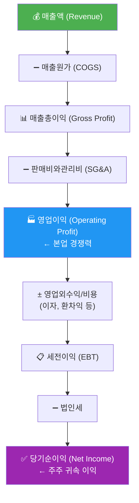

- 숫자를 외우기보다, "돈이 들어오고 비용이 빠져서 이익이 남는다"는 구조를 이해하는 것이 핵심입니다.

### 2. 매출액, 영업이익, 순이익 분석

> 📖 **Wikipedia**: [영업이익](https://ko.wikipedia.org/wiki/영업이익) · [당기순이익](https://ko.wikipedia.org/wiki/당기순이익) · [매출총이익](https://ko.wikipedia.org/wiki/매출총이익)


| 지표 | 공식 | 의미 |
|------|------|------|
| **영업이익률** | 영업이익 / 매출액 × 100 | 본업의 수익성 |
| **순이익률** | 순이익 / 매출액 × 100 | 최종 수익성 |
| **매출 성장률** | (금기-전기) / 전기 × 100 | 외형 성장 속도 |

- 매출이 늘어도 이익이 줄 수 있으므로, **성장**과 **수익성**을 항상 함께 봐야 합니다.
- 순이익이 영업이익보다 크면 일회성 자산 매각 등 비경상 이익이 있을 수 있어 주의가 필요합니다.

**손익계산서에서 꼭 확인할 5가지**

| 확인 항목 | 보는 방법 | 해석 포인트 |
|-----------|-----------|-------------|
| **매출액 추세** | 최근 3~5년 매출 성장률 | 시장이 커지는지, 점유율을 잃는지 확인 |
| **매출총이익률** | 매출총이익 / 매출액 | 원가 경쟁력, 가격 결정력 확인 |
| **판관비율** | 판매비와관리비 / 매출액 | 인건비·마케팅비·관리비 부담 확인 |
| **영업이익률** | 영업이익 / 매출액 | 본업의 수익성, 경쟁력 확인 |
| **순이익의 질** | 순이익 vs 영업이익 | 일회성 이익, 금융비용, 세금 영향 확인 |

**좋은 흐름의 예시**


**주의해야 할 흐름의 예시**

| 상황 | 가능한 해석 |
|------|-------------|
| 매출은 증가하지만 영업이익률 하락 | 가격 경쟁, 원가 상승, 마케팅비 증가 |
| 영업이익은 흑자인데 순이익 적자 | 이자비용, 외환손실, 일회성 손실 |
| 영업이익은 적자인데 순이익 흑자 | 자산 매각, 투자수익 등 비경상 이익 가능성 |
| 매출 정체인데 판관비 급증 | 고정비 부담 증가, 경영 효율성 저하 |

### 2-1. 이익·흑자·적자 — 초급자도 이해하는 쉬운 설명

> 📖 **Wikipedia**: [이익](https://ko.wikipedia.org/wiki/이익) · [적자](https://ko.wikipedia.org/wiki/적자_(경제))

**이익(利益, Profit)이란?**

회사가 물건을 팔거나 서비스를 제공해서 번 돈에서, 그것을 만들고 운영하는 데 쓴 비용을 뺀 나머지입니다.

```
🍕 피자 가게 예시

피자 10판 팔아서 번 돈:  100,000원  (매출액)
재료비 + 임대료 + 인건비:  70,000원  (비용)
─────────────────────────────────────
남은 돈:                   30,000원  ← 이것이 "이익"
```

| 용어 | 한자 | 뜻 | 기호 |
|------|------|----|------|
| **이익 (흑자)** | 利益 / 黑字 | 번 돈 > 쓴 돈 → 플러스(+) | ✅ |
| **손실 (적자)** | 損失 / 赤字 | 번 돈 < 쓴 돈 → 마이너스(−) | ❌ |
| **손익분기점** | 損益分岐點 | 이익도 손실도 없는 딱 그 지점 | ➖ |

> 💡 **흑자·적자의 유래**: 옛날 장부에서 이익은 검은 잉크(黑), 손실은 빨간 잉크(赤)로 기록한 데서 비롯됩니다.

**재무제표에서 이익의 3단계**

```
매출액 1,000억
  └─ 매출원가 빼면 → 매출총이익 400억   ← 제품 자체가 얼마나 남기나?
       └─ 판관비 빼면 → 영업이익 200억   ← 본업으로 얼마나 버나?
            └─ 세금 등 빼면 → 순이익 150억 ← 최종적으로 주주에게 남는 이익
```

**적자가 위험한 이유**

적자가 계속되면 회사의 현금이 줄어들고, 결국 빚을 갚지 못해 **부도(不渡)** 또는 **파산(破産)**에 이를 수 있습니다.  
반대로 흑자가 쌓이면 **이익잉여금**으로 자본에 누적되어 회사의 재무 체력이 강해집니다.

### 2-2. 손익계산서 항목별 심층 이해

> 📖 **Wikipedia**: [매출원가](https://ko.wikipedia.org/wiki/매출원가) · [판매비와관리비](https://ko.wikipedia.org/wiki/판매비와관리비) · [고정비](https://ko.wikipedia.org/wiki/고정비) · [변동비](https://ko.wikipedia.org/wiki/변동비)

손익계산서를 처음 보면 숫자가 많아 복잡하게 느껴집니다. 각 항목이 **어떤 비용인지, 왜 중요한지**를 이해하면 기업의 수익 구조를 한눈에 읽을 수 있습니다.

```
매출액 (Revenue)
 ├─ ➖ 매출원가 (COGS)              ← 제품·서비스를 만드는 데 든 직접 비용
 │       └─ 원자재, 제조인건비, 공장 감가상각비 등
 ├─ = 매출총이익 (Gross Profit)     ← "제품 그 자체"의 경쟁력
 ├─ ➖ 판관비 (SG&A)               ← 판매·마케팅·관리 비용
 │       └─ 광고비, 임원 급여, 물류비, 연구개발비(일부) 등
 ├─ = 영업이익 (Operating Profit)   ← 본업으로 번 이익
 ├─ ➖ 이자비용 (Interest Expense)  ← 차입금에 대한 비용 (영업외)
 ├─ ± 기타 영업외 손익              ← 환차익/손, 투자이익 등
 ├─ = 세전이익 (EBT)
 ├─ ➖ 법인세 (Corporate Tax)       ← 세전이익 × 법인세율
 └─ = 당기순이익 (Net Income)       ← 주주에게 귀속되는 최종 이익
```

#### ① 매출원가(COGS, Cost of Goods Sold)

**매출원가**는 제품이나 서비스를 **만드는 데 직접 들어간 비용**입니다.

| 업종 | 매출원가의 주요 구성 |
|------|----------------------|
| 제조업(반도체·자동차) | 원자재비 + 공장 인건비 + 설비 감가상각비 |
| 유통업(편의점·마트) | 상품 매입원가 |
| 소프트웨어·플랫폼 | 서버 운영비 + 클라우드 비용 + 개발인건비(일부) |
| 금융업(은행) | 이자 지급비용(예금 이자 등) ← 은행은 '매출원가'라는 용어 대신 '이자비용'을 영업비용으로 처리하므로 개념적 유사항목으로 이해 |

> 💡 **매출원가율(원가율) = 매출원가 ÷ 매출액 × 100**
> - 원가율이 낮을수록 제품 자체가 "비싸게 팔리고 싸게 만든다"는 뜻 → 높은 경쟁력
> - 명품 브랜드나 소프트웨어 회사는 원가율이 20~40%로 매우 낮음
> - 유통업·식품업은 원가율이 70~85%에 달하기도 함

#### ② 매출 총이익(Gross Profit)

```
매출총이익 = 매출액 − 매출원가
```

**매출총이익**은 가격 결정력과 원가 경쟁력을 보여주는 **가장 순수한 지표**입니다.  
판관비나 금융비용이 포함되기 전이므로, 제품/서비스 자체의 수익성을 나타냅니다.

| 매출총이익률 수준 | 해석 |
|------------------|------|
| **40% 이상** | 브랜드·독점 기술 등 가격 결정력 우수 (애플·LVMH·엔비디아 등) |
| **20~40%** | 제조·소비재 평균 구간, 업종별 편차 큼 |
| **10% 미만** | 경쟁 심한 유통업·원자재 산업, 마진 확보 어려움 |

> 📌 **투자 체크포인트**: 매출이 늘어나는데 매출총이익률이 하락한다면, 원가 상승(원자재·인건비)이나 가격 인하 압력이 있다는 신호입니다.

#### ③ 판매비와관리비(SG&A, Selling, General & Administrative Expenses)

**판관비**는 제품을 만든 이후에 발생하는 **운영·관리 비용** 전체입니다.

| 구분 | 주요 항목 | 특징 |
|------|-----------|------|
| **판매비** | 광고·마케팅비, 영업사원 인건비, 물류비, A/S 비용 | 매출 규모에 따라 변동 |
| **관리비** | 임원·사무직 급여, 임차료, 감가상각비(본사), 법률·회계비용 | 상대적으로 고정적 |

**영업비용(판관비)에 포함되는 주요 종류**

| 종류 | 설명 |
|------|------|
| **급여/복리후생비** | 영업·관리 인력 인건비와 복리후생비로, 기업의 고정비 성격이 강한 핵심 항목 |
| **광고선전비/마케팅비** | 브랜드 인지도·고객 유입을 위한 비용으로, 성장기 기업에서 비중이 크게 나타날 수 있음 |
| **지급수수료** | 외부 용역, 플랫폼 사용료, 결제 수수료, 자문료 등 제3자 서비스 이용 대가 |
| **임차료/관리비** | 사무실·매장 임차료, 공용관리비 등 영업 인프라 유지 비용 |
| **감가상각비** | 본사 비품·IT 장비·매장 인테리어 등 유형자산의 사용분을 기간비용으로 배분한 금액 |
| **운반비/배송비** | 제품·상품을 고객에게 전달하는 과정에서 발생하는 물류 관련 비용 |
| **대손상각비(판매채권 관련)** | 외상매출금 회수 불능 가능성을 반영하는 비용으로, 신용판매 비중이 큰 업종에서 중요 |
| **연구개발비(R&D)** | 회계정책과 업종 특성에 따라 판관비 또는 매출원가로 분류될 수 있어 별도 확인 필요 |

> 💡 판관비는 일반적으로 **고정비 성격**이 강합니다.  
> 따라서 매출이 급증할 때 판관비율(판관비/매출)이 낮아지면 영업 레버리지 효과가 발생합니다.

**판관비 분석 시 주의점**

- 스타트업이나 성장기 기업은 판관비(특히 마케팅비)가 커도 미래 성장을 위한 투자일 수 있음
- 성숙기 기업인데 판관비가 매년 매출보다 빠르게 증가한다면 비효율 신호
- **R&D(연구개발비)**: 회계 처리에 따라 매출원가 또는 판관비에 포함될 수 있으며, R&D 비중이 높은 반도체·바이오는 별도로 확인 필요

#### ④ 이자비용(Interest Expense)과 세금(Tax)

**이자비용**은 영업이익 아래 **'영업외비용'** 으로 처리됩니다.

```
영업이익  →  (+ 이자수익 / − 이자비용 / ± 기타 영업외)  →  세전이익  →  (− 법인세)  →  당기순이익
```

| 항목 | 발생 이유 | 투자자 관점 포인트 |
|------|-----------|-------------------|
| **이자비용** | 은행 차입금, 회사채 등 타인자본 조달 비용 | 부채 규모·금리 수준 확인 → 이자보상배율 = 영업이익 ÷ 이자비용 (일반적으로 3배 이상을 안정으로 보나, 업종·자본집약도에 따라 기준이 다름) |
| **법인세** | 세전이익에 법인세율(한국 약 24%)을 곱한 금액 | 유효세율 = 법인세 ÷ 세전이익, 세금 감면·이연세 등으로 실효세율이 달라짐 |

> 📌 **이자보상배율 < 1**이면 영업이익으로 이자도 못 내는 상황 → 재무 위기 신호

#### ⑤ 고정비 vs 변동비 — 비용 구조의 핵심

비용을 **매출 변화에 따라 움직이는지** 여부로 나누면 기업의 수익 구조가 명확해집니다.

| 구분 | 정의 | 대표 항목 | 특징 |
|------|------|-----------|------|
| **고정비** (Fixed Cost) | 매출이 늘거나 줄어도 **거의 변하지 않는** 비용 | 공장 임차료, 감가상각비, 정규직 인건비, 이자비용 | 매출 증가 시 단위당 고정비 감소 → 이익 폭발 |
| **변동비** (Variable Cost) | 매출·생산량에 **비례해서 늘어나는** 비용 | 원자재비, 판매 수수료, 포장재비, 배송비 | 매출에 따라 선형적으로 증가 |

**변동비 더 알아보기**

변동비는 제품 1개를 더 만들거나 팔 때마다 추가로 드는 비용(한계비용, Marginal Cost)에 가깝습니다.

- 변동비 비중이 높은 업종(유통·식품): 매출이 늘어도 이익이 완만하게 증가, 대신 매출이 줄어도 손실 폭이 작음
- 변동비 비중이 낮은 업종(소프트웨어·반도체): 초반에 적자가 크지만, 손익분기점을 넘으면 이익이 가파르게 증가

**손익분기점(BEP, Break-Even Point) 계산**

```
손익분기점 매출액 = 고정비 ÷ (1 − 변동비율)
변동비율 = 변동비 ÷ 매출액
```

> 예) 고정비 100억, 변동비율 60% → BEP = 100억 ÷ 0.4 = **250억 매출이면 이익 0**
> → 매출 1원당 공헌이익(기여마진) = 1원 × (1 − 0.6) = **40전**. BEP(250억)를 초과하는 매출에서 이 40전이 이익으로 쌓임
> ※ 변동비(60전)는 BEP 이후에도 여전히 발생하므로, 매출 전체가 이익이 되는 것은 아님

#### ⑥ 반도체 기업의 영업 레버리지 — "고정비가 높아도 이익이 폭발하는 이유"

반도체 회사(삼성전자·SK하이닉스·TSMC 등)는 **공장(팹) 건설에 수십조 원**이 들어갑니다. 이 설비 투자는 감가상각비라는 **거대한 고정비**로 매년 손익계산서에 반영됩니다.

```
🏭 반도체 공장 시나리오 (단위: 억 원)

                    불황기 (매출 낮음)    호황기 (매출 높음)
매출액              5,000               15,000
 ─ 변동비(40%)      2,000                6,000
 ─ 고정비(감가상각 등)  4,000                4,000   ← 고정비는 그대로!
 = 영업이익          -1,000  ❌            5,000  🚀

영업이익률           -20%                +33%
```

- 고정비 4,000억은 매출이 5,000억이든 15,000억이든 **변하지 않습니다**.
- 매출이 3배로 늘면, **고정비는 3등분되어 제품 1개당 부담이 줄고** 이익이 폭발적으로 증가합니다.
- 반대로 매출이 줄면 고정비를 커버하지 못해 **적자 전환 속도도 빠릅니다**.

> 💡 **영업 레버리지(Operating Leverage)**: 고정비 비중이 높을수록, 매출 증가에 따른 이익 증가 폭이 커지는 현상입니다.  
> **영업 레버리지 배율 = 매출총이익 ÷ 영업이익** — 배율이 높을수록 매출 변화에 이익이 크게 반응합니다.

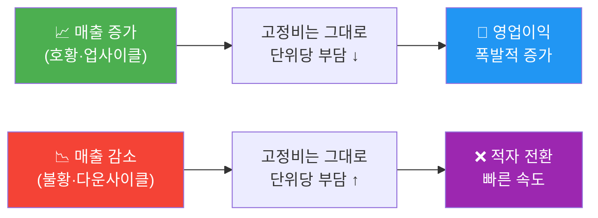

**반도체·디스플레이·배터리 업종 공통 특성**

| 특성 | 설명 | 투자자 시사점 |
|------|------|---------------|
| 초기 고정비 매우 큼 | 팹 1개에 수십조 투자, 매년 수조 감가상각 | 불황기 적자가 크지만 매출 회복 시 이익 회복도 빠름 |
| 변동비 비중 낮음 | 원자재·전기료는 들지만 고정비 대비 작음 | 가동률(Utilization Rate)이 이익의 핵심 변수 |
| 사이클 산업 | 공급·수요 불균형으로 가격 급변 | 업사이클 진입 초기에 투자 매력도가 가장 높음 |

> 📌 **가동률 = 실제 생산량 ÷ 최대 생산능력 × 100**  
> 가동률이 70%→90%로 오르면 추가 고정비 없이 매출과 이익이 동시에 급증합니다.

#### ⑦ 금융업의 주사업 수익 종류와 영업비용 — 쉬운 예시로 이해하기

일반 제조업·서비스업과 달리 **금융업(은행·증권·보험 등)**은 수익과 비용 구조가 독특합니다.  
손익계산서에서도 '매출액' 대신 **'영업수익'**, '매출원가' 대신 **'이자비용·보험금 등'** 이라는 용어를 씁니다.

---

##### 🏦 금융업종별 주사업 수익 종류

| 금융업종 | 주요 수익 항목 | 쉬운 예시 |
|----------|--------------|-----------|
| **은행** | **이자수익** | 내가 은행에서 연 5% 대출을 받으면 → 은행 입장에선 그 5% 이자가 수익 |
| | **수수료수익** | 인터넷뱅킹 이체 수수료, ATM 출금 수수료, 외환 환전 수수료 |
| | **외환·파생 거래이익** | 달러를 싸게 사서 비싸게 팔아 남기는 환차익 |
| **증권사** | **위탁매매 수수료** | 고객이 삼성전자 주식 1,000만 원어치 살 때 0.015% 받는 거래 수수료 |
| | **IB(투자은행) 수수료** | 기업이 IPO(상장)하거나 회사채 발행 시 받는 주관 수수료 |
| | **자기매매이익** | 증권사가 자기 돈으로 주식·채권을 사고팔아 남기는 시세차익 |
| | **운용보수** | 펀드 순자산의 연 1~2%씩 떼는 펀드 운용보수 |
| **보험사** | **보험료수익(수입보험료)** | 가입자가 매달 내는 보험료 — 사고가 없으면 보험사가 남기는 구조 |
| | **투자(운용)수익** | 모아 둔 보험료를 채권·주식에 투자해서 얻는 이자·배당·시세차익 |
| **카드사·캐피탈** | **카드 수수료수익** | 편의점에서 카드 결제 시 가맹점에서 받는 1~2%의 가맹점 수수료 |
| | **할부·리스 이자수익** | "36개월 무이자" 대신 유이자 할부 시 고객에게 받는 할부 금융이자 |
| | **연회비** | 카드 연회비(예: 프리미엄 카드 연 10만 원) |

> 💡 **핵심 포인트**: 금융업은 "돈을 빌려주거나 중간에서 연결해주는 대가"로 돈을 법니다.  
> - 은행: 예금 이자(저금리)로 모아 → 대출 이자(고금리)로 빌려줌 → **예대마진**이 핵심 수익  
> - 증권사: 매매를 대신 해주고 → **수수료**를 받음  
> - 보험사: 미리 보험료를 모아 → 사고가 날 때 보험금 지급 → 남은 돈을 **투자해서 운용**

---

##### 💸 금융업의 주요 영업비용 종류

| 영업비용 항목 | 해당 업종 | 쉬운 예시 |
|--------------|----------|-----------|
| **이자비용(수신이자)** | 은행·저축은행 | 내 예금통장에 연 3% 이자를 줄 때 → 은행 입장에선 그 3%가 비용 |
| **보험금 지급비용** | 보험사 | 가입자가 교통사고 났을 때 보험사가 치료비·수리비로 지급하는 돈 |
| **매매손실·평가손실** | 증권사·보험사 | 자기가 보유한 주식·채권 가격이 내려갔을 때 인식하는 손실 |
| **대손상각비(충당금)** | 은행·캐피탈 | "이 대출, 못 받을 것 같다"며 미리 비용으로 잡아두는 금액 (부실채권 충당금) |
| **운용보수 지급** | 자산운용사 → 판매사 | 펀드를 판 은행·증권사에 판매수수료 나눠주는 비용 |
| **인건비·복리후생비** | 전 업종 공통 | 지점 행원 급여, 딜러·애널리스트 성과급 등 |
| **전산·IT 운영비** | 전 업종 공통 | 온라인뱅킹·HTS·MTS 서버 유지비, 보안 시스템 운영비 |
| **지점 임차료·감가상각** | 은행·보험 | 전국 지점 임차료, ATM 기기 감가상각비 |
| **마케팅·광고비** | 카드사·핀테크 | 신규 카드 발급 혜택 광고비, 앱 다운로드 이벤트 비용 |

> 💡 **은행의 핵심 수익성 지표: NIM(순이자마진)**
>
> ```
> NIM(Net Interest Margin) = (이자수익 − 이자비용) ÷ 평균 이자부 자산
> ```
>
> NIM이 1.5~2.5% 수준이면 양호한 편이며, 금리가 오르면 NIM이 확대되어 은행 이익이 늘어납니다.

**금융업 손익 흐름 한눈에 보기 (은행 예시)**

```
[수익]
  이자수익(대출 이자 5%)     +100억
  수수료수익                  +10억
  외환거래이익                 +5억
                            ─────────
  영업수익 합계               115억

[비용]
  이자비용(예금 이자 3%)      -60억
  대손충당금전입액             -10억
  인건비·운영비               -20억
                            ─────────
  영업비용 합계                90억

[결과]
  영업이익                     25억  ← 예대마진 + 수수료로 남긴 이익
```

> 📌 **투자 체크포인트**: 금융업 분석 시 일반 제조업 비율(영업이익률, 원가율)보다  
> **NIM(순이자마진), 대손비율(NPL), BIS 자기자본비율, 손해율(보험)**을 우선 확인하세요.

---

### 2-3. 매출은 잡혔는데 현금은 왜 없을까? (재고·외상·진행률 인식)

매출과 현금은 **기록 기준 시점이 다릅니다.**

| 구분 | 언제 잡히나? | 핵심 포인트 |
|------|--------------|-------------|
| **매출(손익계산서)** | 상품·서비스를 제공한 시점(발생주의) | "팔았다"가 기준 |
| **현금흐름(현금흐름표)** | 실제로 돈이 입금된 시점(현금주의) | "돈이 들어왔다"가 기준 |

#### ① 재고가 늘면 왜 현금이 나빠질까?

- 회사가 원재료·상품을 사서 재고로 쌓으면, 이미 현금은 나갔습니다.
- 그런데 아직 판매되지 않았다면 매출은 안 잡히므로, **현금은 먼저 줄고 이익은 아직 안 보이는** 구간이 생깁니다.
- 재고가 과도하게 늘면 할인 판매·평가손실 위험까지 커집니다.

#### ② 외상매출(매출채권)은 이익일까?

- 외상으로 판매하면 회계상 매출·이익은 인식될 수 있습니다.
- 하지만 돈을 아직 못 받았으므로 현금흐름에는 바로 도움이 안 됩니다.
- 즉, **"이익은 났는데 현금이 부족한"** 상황이 생길 수 있습니다.

> 한 줄 정리: **외상매출은 회계상 이익일 수 있지만, 곧바로 현금은 아닙니다.**

#### ③ 조선·건설처럼 몇 년 걸리는 사업은 왜 매출이 먼저 잡히나?

- 조선·건설·플랜트는 계약부터 완공까지 2~5년 이상 걸릴 수 있습니다.
- 그래서 보통 공사 진행 정도(진행률)에 따라 매출을 나눠 인식합니다.
- 대금은 중간·완공 시점에 단계적으로 들어오므로, **매출 인식 속도와 현금 입금 속도**가 다를 수 있습니다.

#### ④ 그럼 현금흐름이 "좋다/나쁘다"는 어떻게 판단할까?

| 점검 질문 | 좋지 않은 신호 |
|-----------|----------------|
| 영업이익이 늘 때 영업현금흐름(CFO)도 같이 느는가? | 이익은 증가하는데 CFO 정체/감소 |
| 매출채권 증가율이 매출 증가율보다 높은가? | 외상 비중 확대로 회수 지연 가능성 |
| 재고자산 증가율이 매출 증가율보다 높은가? | 재고 적체·현금 묶임 가능성 |
| CFO가 계속 마이너스인데 차입으로 버티는가? | 본업 현금창출력 약화 가능성 |

#### ⑤ 주식 투자에서 꼭 함께 체크할 것

1. **손익계산서**: 매출·영업이익 추세가 좋아지는지
2. **재무상태표**: 매출채권·재고자산이 과도하게 늘지 않는지
3. **현금흐름표**: 영업현금흐름(CFO)이 순이익과 함께 개선되는지
4. **결론**: "이익 성장"과 "현금 회수"가 같이 가는 기업을 우선 검토

> 📌 투자 실무에서는 **매출 성장 자체보다, 매출이 현금으로 잘 전환되는지(현금 전환력)**를 더 중요하게 봅니다.

### 3. 대차대조표(Balance Sheet) 구조 이해

> 📖 **Wikipedia**: [대차대조표](https://ko.wikipedia.org/wiki/대차대조표)


손익계산서가 **기간의 흐름**이라면, 대차대조표는 **특정 시점의 스냅샷**입니다.

#### 자산·부채·자본이란?

| 구분 | 한 마디 | 회계 정의 |
|------|---------|-----------|
| **자산 (Assets)** | 🏦 회사가 가진 것 | **미래에 경제적 이익을 가져다 줄 자원** — 현금을 벌어주거나, 비용을 줄이거나, 다른 자산으로 교환할 수 있는 모든 것 |
| **부채 (Liabilities)** | ⚠️ 남의 돈 | 언젠가 갚아야 하는 의무 — 은행 대출, 회사채, 외상매입금 등 |
| **자본 (Equity)** | 💚 내 돈 | 주주가 투자한 돈 + 회사가 벌어서 쌓아온 이익잉여금 |

> 💡 **핵심 항등식**: **자산 = 부채(남의 돈) + 자본(내 돈)**  
> 즉, 회사의 모든 자산은 "남에게 빌려온 돈"과 "주주 스스로의 돈" 두 가지 원천에서 만들어집니다.

#### 조달 · 비용 · 운용 · 성과 프레임으로 읽는 재무상태표

재무상태표를 "돈의 흐름"으로 이해하면 4가지 질문으로 정리됩니다.

| 관점 | 질문 | 재무상태표 위치 | 핵심 내용 |
|------|------|----------------|-----------|
| **조달** — 어떻게 돈을 모았나? | 자금을 어디서 가져왔는가? | **오른쪽** (부채 + 자본) | 부채(남의 돈 차입)와 자본(주주 투자·이익 적립)의 비율이 얼마인가 |
| **비용** — 조달 비용은 얼마인가? | 빌린 돈의 이자, 주주의 기대수익은? | 손익계산서 이자비용 / ROE 기준 | 부채는 **이자비용**, 자본은 **주주 기대수익률(COE)** |
| **운용** — 조달한 돈을 어디에 썼나? | 자산으로 어떻게 배치했는가? | **왼쪽** (자산) | 유동자산(단기 활용)·비유동자산(장기 투자)의 구성 |
| **성과** — 운용 결과는? | 자산이 얼마나 이익을 냈는가? | 손익계산서 순이익 → 이익잉여금 | ROA(자산 대비 이익), ROE(자본 대비 이익)로 측정 |

```
[조달] 부채(남의 돈) + 자본(내 돈)
          ↓ 투자·배치
[운용] 자산: 유동자산 + 비유동자산
          ↓ 영업·사업 활동
[성과] 손익계산서 → 순이익
          ↓ 이익 적립
[환류] 이익잉여금 → 자본 증가 → 재투자
```

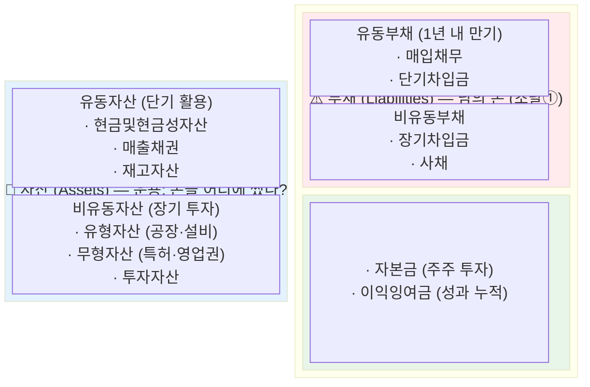

> **핵심 항등식**: 자산(Assets) = 부채(Liabilities) + 자본(Equity)

- 자산이 크더라도 부채가 과도하면 위험할 수 있으므로 **규모보다 구성과 균형**을 봐야 합니다.

### 4. 자산·부채·자본 분석

> 📖 **Wikipedia**: [자기자본이익률](https://ko.wikipedia.org/wiki/자기자본이익률) · [부채비율](https://ko.wikipedia.org/wiki/부채비율) · [유동비율](https://ko.wikipedia.org/wiki/유동비율)


**주요 안전성 지표**

| 지표 | 공식 | 해석 기준 |
|------|------|-----------|
| **부채비율** | 부채 / 자본 × 100 | 100% 이하 안정, 200% 이상 주의 |
| **유동비율** | 유동자산 / 유동부채 × 100 | 150% 이상 양호 |
| **이자보상배율** | 영업이익 / 이자비용 | 1배 이하 위험 |

- 자산이 얼마나 효율적으로 쓰이는지 (ROA = 순이익 / 자산), 부채가 감당 가능한 수준인지, 자본이 꾸준히 늘어나는지를 함께 확인합니다.

**대차대조표에서 꼭 확인할 6가지**

| 확인 항목 | 질문 | 투자 관점 |
|-----------|------|-----------|
| **현금및현금성자산** | 당장 쓸 수 있는 현금이 충분한가? | 경기 둔화와 투자 기회에 버틸 여력 |
| **매출채권** | 매출보다 매출채권이 더 빨리 늘지는 않는가? | 팔았지만 아직 돈을 못 받은 매출 가능성 |
| **재고자산** | 재고가 매출보다 빠르게 쌓이지 않는가? | 수요 둔화, 가격 인하, 평가손실 위험 |
| **유형자산** | 설비투자가 매출 증가로 이어지는가? | 제조업·반도체·배터리에서 중요 |
| **단기차입금/유동부채** | 1년 안에 갚아야 할 부담이 큰가? | 유동성 위험, 차환 리스크 |
| **이익잉여금** | 벌어둔 이익이 자본에 누적되는가? | 장기 수익성과 재무 체력 |

**대차대조표 분석 순서**

1. 자산이 늘었는지 먼저 봅니다.
2. 자산 증가가 부채 증가 때문인지, 이익 누적 때문인지 나눠 봅니다.
3. 유동자산과 유동부채를 비교해 단기 지급능력을 봅니다.
4. 매출채권·재고자산이 매출보다 빠르게 늘면 이익의 질을 의심합니다.
5. 부채비율과 이자보상배율로 차입 부담을 확인합니다.

**손익계산서와 연결해서 읽기**

| 손익계산서 변화 | 대차대조표에서 확인할 것 |
|----------------|--------------------------|
| 매출 급증 | 매출채권도 같이 급증했는지 확인 |
| 원가율 상승 | 재고자산 평가손실이나 원재료 부담 확인 |
| 영업이익 개선 | 현금과 이익잉여금 증가로 이어졌는지 확인 |
| 이자비용 증가 | 차입금과 부채비율이 상승했는지 확인 |

### 4-1. 부채 — 초급자도 이해하는 쉬운 설명

> 📖 **Wikipedia**: [부채](https://ko.wikipedia.org/wiki/부채_(회계))

**부채(負債, Debt/Liability)란?**

회사가 다른 곳에서 빌린 돈이나, 나중에 갚아야 할 의무가 있는 돈입니다.  
쉽게 말하면 **"남에게 빌린 돈"** 입니다.

```
🏠 집 구입 비유

집값 5억 (자산)
  ├── 내 돈 2억 (자본)
  └── 은행 대출 3억 ← 이것이 "부채"
        │
        └── 매달 이자 내야 함 → 이자비용
```

**부채의 두 가지 종류**

| 구분 | 뜻 | 예시 |
|------|-----|------|
| **유동부채** | 1년 안에 갚아야 하는 빚 | 단기차입금, 외상매입금(매입채무) |
| **비유동부채** | 1년 넘어 갚아도 되는 빚 | 장기차입금, 회사채(사채) |

**부채가 무조건 나쁜 건 아닙니다**

| 상황 | 해석 |
|------|------|
| 부채로 공장 짓고 → 매출·이익 증가 | **좋은 부채** (레버리지 효과) |
| 부채가 너무 많아 → 이자도 못 냄 | **나쁜 부채** (재무 위험) |

> 💡 **핵심 공식**: 부채비율(%) = 부채 ÷ 자본 × 100  
> 100% 이하면 안정적, 200% 이상이면 주의 필요

### 4-2. ROE·ROI·ROA — 수익성 지표 쉬운 설명

> 📖 **Wikipedia**: [자기자본이익률(ROE)](https://ko.wikipedia.org/wiki/자기자본이익률) · [투자수익률(ROI)](https://ko.wikipedia.org/wiki/투자수익률)


이 세 지표는 모두 **"투입 대비 얼마나 벌었나?"** 를 측정합니다. 무엇을 기준으로 계산하느냐가 다를 뿐입니다.

#### ROE (Return on Equity, 자기자본이익률)

**"내가 직접 투자한 내 돈으로 얼마나 벌었나?"**

```
ROE(%) = 당기순이익 ÷ 자기자본(평균) × 100

예시: 순이익 200억 ÷ 자기자본 1,000억 × 100 = ROE 20%
→ 내 돈 1,000억을 투자해서 200억을 벌었다는 뜻
```

- **높을수록 좋습니다** (보통 10% 이상이면 우량, 15~20% 이상이면 탁월)
- 워런 버핏이 가장 중요하게 보는 지표 중 하나입니다.
- 단, 부채를 지나치게 많이 써서 ROE를 부풀릴 수도 있으므로 부채비율과 함께 봐야 합니다.

#### ROI (Return on Investment, 투자수익률)

**"투자한 돈 전체(내 돈+빌린 돈)로 얼마나 벌었나?"**

```
ROI(%) = (순이익 + 이자비용) ÷ 총투자액 × 100
       또는
ROI(%) = (투자 수익 − 투자 비용) ÷ 투자 비용 × 100

예시: 주식 100만원어치 샀는데 120만원이 됐다면
      ROI = (120만 − 100만) ÷ 100만 × 100 = 20%
```

- 투자 결정의 타당성을 평가할 때 씁니다.
- 기업뿐 아니라 **개인 투자자의 수익률 계산**에도 사용합니다.

#### ROA (Return on Assets, 총자산이익률)

**"회사가 갖고 있는 모든 자산(내 돈+빌린 돈)으로 얼마나 벌었나?"**

```
ROA(%) = 당기순이익 ÷ 총자산(평균) × 100

예시: 순이익 200억 ÷ 총자산 4,000억 × 100 = ROA 5%
→ 가진 자산 4,000억으로 200억을 벌었다는 뜻
```

- 자산 활용 효율을 봅니다.
- 은행·금융업종에서 특히 중요하게 씁니다.

**세 지표 한눈에 비교**

| 지표 | 분모 (기준) | 핵심 질문 | 좋은 수준 |
|------|------------|---------|---------|
| **ROE** | 자기자본 | 주주 돈으로 얼마나 벌었나? | 10% 이상 |
| **ROI** | 투자 비용 | 이 투자가 수익이 났나? | 투자 목표 대비 |
| **ROA** | 총자산 | 자산 전체를 얼마나 효율적으로 쓰나? | 5% 이상 |

```
ROE vs ROA 관계
ROE = ROA × (총자산 / 자기자본)
    = ROA × (1 + 부채비율/100)

→ 부채가 많을수록 ROA보다 ROE가 높게 나옴
   (레버리지 효과 — 양날의 검)
```

### 4-3. 유동성 지표 — 단기 지급능력 한눈에 보기

> 📖 **Wikipedia**: [유동비율](https://ko.wikipedia.org/wiki/유동비율) · [당좌비율](https://ko.wikipedia.org/wiki/당좌비율)


**"흑자인데 부도?" — 유동성이 없으면 이익도 소용없습니다.**

회사가 이익을 내고 있어도, 당장 갚아야 할 빚을 낼 현금이 없으면 **흑자부도(黑字倒産)**에 빠집니다.  
유동성 지표는 "지금 당장 빚을 갚을 수 있는가?"를 숫자로 보여줍니다.

```
🏪 편의점 비유

오늘 매출: 100만원 (이익은 있음)
오늘 갚아야 할 재료비·임대료: 150만원

→ 이익이 있어도 현금이 없으면 문을 닫아야 합니다. ← 유동성 위기
```

**4가지 핵심 유동성 지표**

| 지표 | 공식 | 기준 | 의미 |
|------|------|------|------|
| **유동비율** | 유동자산 / 유동부채 × 100 | 150% 이상 양호 | 1년 내 자산으로 1년 내 빚 감당 가능성 |
| **당좌비율** | (유동자산 − 재고) / 유동부채 × 100 | 100% 이상 권장 | 재고 제외 즉시 현금화 가능 자산 기준 |
| **현금비율** | 현금및현금성자산 / 유동부채 × 100 | 20% 이상 참고 | 가장 보수적인 단기 지급능력 지표 |
| **운전자본** | 유동자산 − 유동부채 | 양수 = 안정 | 음수이면 단기 유동성 위기 신호 |

**현금전환주기(CCC) — 돈이 얼마나 빨리 돌아오나?**

```
CCC = 재고보유기간 + 매출채권회수기간 − 매입채무지급기간

짧을수록 → 현금이 빠르게 회전 → 유동성 양호
길어질수록 → 현금이 묶이는 기간 증가 → 유동성 압박
```

**유동성 위험 신호 5가지**

| 신호 | 해석 |
|------|------|
| 유동부채가 유동자산보다 빠르게 증가 | 단기 상환 능력 약화 |
| 매출채권이 매출보다 빠르게 급증 | 팔았지만 돈을 못 받는 이익 가능성 |
| 재고자산이 지속 증가 | 수요 둔화, 현금화 지연 |
| 단기차입금 의존도 상승 | 이자 부담 증가, 차환 리스크 |
| 영업현금흐름이 반복적으로 마이너스 | 본업에서 현금을 못 벌고 있음 |

> 💡 **핵심 체크**: 재무상태표의 유동비율이 높더라도, 현금흐름표의 영업현금흐름이 마이너스라면 이익의 질을 의심하세요.

### 5. 실습: DART 공시 재무제표 데이터 수집 및 분석


DART(전자공시시스템)는 한국 상장기업의 공식 재무 데이터를 얻을 수 있는 가장 신뢰할 수 있는 원천입니다.

**yfinance로 손익계산서 분석 (글로벌 상장 주식)**


**DART OpenAPI로 한국 상장기업 재무 데이터 수집**


- 실습에서는 숫자를 단순히 가져오는 데서 끝나지 않고, **최근 3~5년 변화 방향**을 읽는 것이 중요합니다.
- **연결 기준인지 별도 기준인지**, **연간인지 분기인지** 구분해야 숫자를 잘못 해석하지 않습니다.

---

#### 5-1. 고도화 목표: 동적 DART 재무제표 분석 웹앱

이번 실습의 목표는 단순히 DART 재무제표를 한 번 조회하는 것이 아니라, **기업 검색 → 공시 선택 → 재무제표 수집 → 표준 계정 매핑 → 재무비율 분석 → 문서 양식 시뮬레이션 → 웹/PDF 리포트 출력**까지 이어지는 동적 웹앱을 설계하는 것입니다.

최종 산출물:

| 산출물 | 파일/화면 | 설명 |
|---|---|---|
| 기업 검색 데이터 | `dart_companies.csv` | DART 고유번호, 종목코드, 회사명 |
| 원천 재무제표 | `dart_financial_raw.csv` | DART API 응답 원본 정리 |
| 표준 재무제표 | `financial_statement_standard.csv` | 회사별 다른 계정명을 표준 계정으로 매핑 |
| 재무비율 데이터 | `financial_ratios.csv` | 수익성, 안정성, 성장성, 활동성 지표 |
| 웹 대시보드 | `/api/dart/financial-dashboard` | 동적 재무 분석 결과 반환 |
| 문서 시뮬레이터 | `/api/dart/document-simulate` | 손익계산서/재무상태표/요약보고서 양식 생성 |
| PDF 리포트 | `financial_report.pdf` | 회사별 분석 보고서 출력 |

---

#### 5-2. DART API 수집 흐름

OpenDART는 공시 원문과 주요 재무 계정, 대량 재무정보를 API 형태로 제공합니다. 실습에서는 아래 순서로 구현합니다.

```text
1. 인증키 준비
2. corpCode.xml 또는 기업 검색 API로 corp_code 확보
3. 공시 목록 조회
4. 단일회사 전체 재무제표 조회
5. 계정명 표준화
6. 손익계산서/재무상태표/현금흐름표 분리
7. 재무비율 계산
8. 웹 대시보드 및 PDF 문서 출력
```

**주요 DART 파라미터**

| 파라미터 | 예시 | 설명 |
|---|---|---|
| `crtfc_key` | `DART_API_KEY` | OpenDART 인증키 |
| `corp_code` | `00126380` | DART 기업 고유번호 |
| `bsns_year` | `2024` | 사업연도 |
| `reprt_code` | `11011` | 사업보고서 |
| `fs_div` | `CFS`, `OFS` | 연결/별도 재무제표 |

**보고서 코드**

| 코드 | 보고서 |
|---|---|
| `11013` | 1분기보고서 |
| `11012` | 반기보고서 |
| `11014` | 3분기보고서 |
| `11011` | 사업보고서 |

---

#### 5-3. 기업 고유번호 캐시 만들기

기업 검색을 매번 API로 처리하면 느립니다. 먼저 DART 고유번호 파일을 내려받아 캐시합니다.


---

#### 5-4. 여러 연도·여러 보고서 동적 수집

기존 실습은 한 회사의 한 연도만 조회합니다. 웹앱에서는 사용자가 기간과 보고서 종류를 선택할 수 있어야 합니다.


---

#### 5-5. 회사별 계정명 표준화

DART 재무제표는 회사와 업종에 따라 계정명이 다르게 나올 수 있습니다. 예를 들어 매출은 `매출액`, `수익(매출액)`, `영업수익` 등으로 표시될 수 있습니다. 웹앱은 표준 계정 매핑을 제공하고, 사용자가 직접 매핑을 수정할 수 있어야 합니다.


**웹앱 고도화 포인트**

| 기능 | 설명 |
|---|---|
| 자동 매핑 | 계정명 alias 사전으로 표준 계정 자동 분류 |
| 수동 매핑 | 사용자가 미분류 계정을 드래그해 표준 계정에 연결 |
| 매핑 저장 | 회사/업종별 매핑 규칙을 JSON으로 저장 |
| 경고 표시 | 매출, 영업이익, 자산총계 등 필수 계정 누락 시 경고 |

---

#### 5-6. 재무비율 자동 계산


**분석 축**

| 분석 축 | 지표 |
|---|---|
| 성장성 | 매출 성장률, 영업이익 성장률, 순이익 성장률 |
| 수익성 | 영업이익률, 순이익률, ROE, ROA |
| 안정성 | 부채비율, 유동비율, 차입금 의존도 |
| 활동성 | 자산회전율, 재고자산 회전율, 매출채권 회전율 |
| 이익의 질 | 영업이익 vs 순이익, 매출채권/재고 증가율 |

---

#### 5-7. 동적 재무제표 웹 대시보드 설계

기존 웹앱의 `financialStatement.js`는 손익계산서, 재무상태표, 현금흐름표 이미지를 카드로 보여주는 정적 화면입니다. 고도화 버전은 DART 데이터를 직접 조회하고 사용자가 분석 범위를 바꾸는 동적 화면으로 만듭니다.

```text
상단 검색
  - 기업명/종목코드 검색
  - 연결/별도 선택
  - 연간/분기 선택
  - 조회 연도 범위 선택

1행: 요약 KPI
  - 매출액
  - 영업이익
  - 순이익
  - 자산총계
  - 부채비율
  - ROE

2행: 재무제표 탭
  - 손익계산서
  - 재무상태표
  - 현금흐름표
  - 표준 계정 매핑

3행: 분석 차트
  - 5년 매출/영업이익 추이
  - 영업이익률/순이익률 추이
  - 자산/부채/자본 구성
  - ROE/ROA/부채비율

4행: 문서 시뮬레이터
  - 은행 제출용 재무요약서
  - 투자검토 메모
  - 이사회 보고서
  - 신용평가 요약표
  - PDF 다운로드
```

---

#### 5-8. API 설계

| 엔드포인트 | 메서드 | 역할 |
|---|---|---|
| `/api/dart/company-search` | `POST` | 기업명/종목코드로 corp_code 검색 |
| `/api/dart/disclosures` | `POST` | 회사별 공시 목록 조회 |
| `/api/dart/financials/raw` | `POST` | DART 원천 재무제표 조회 |
| `/api/dart/financials/standard` | `POST` | 표준 계정 매핑 후 재무제표 반환 |
| `/api/dart/financial-ratios` | `POST` | 재무비율 계산 |
| `/api/dart/financial-dashboard` | `POST` | KPI, 차트, 경고를 한 번에 반환 |
| `/api/dart/document-simulate` | `POST` | 회사별 재무 문서 양식 생성 |
| `/api/dart/report.pdf` | `POST` | PDF 리포트 출력 |

**요청 예시**

```json
{
  "corp_code": "00126380",
  "corp_name": "삼성전자",
  "years": [2021, 2022, 2023, 2024],
  "reprt_code": "11011",
  "fs_div": "CFS",
  "document_template": "investment_memo"
}
```

**응답 예시**

```json
{
  "company": "삼성전자",
  "period": "2021~2024",
  "kpis": {
    "revenue_cagr": 0.08,
    "operating_margin_latest": 0.14,
    "debt_ratio_latest": 0.28,
    "roe_latest": 0.11
  },
  "warnings": [
    "재고자산 증가율이 매출 증가율보다 높습니다.",
    "연결 기준 재무제표를 사용했습니다."
  ],
  "charts": {
    "income_trend": "<base64 PNG>",
    "balance_sheet_stack": "<base64 PNG>"
  },
  "document": "Markdown 또는 HTML 문서 본문"
}
```

---

#### 5-9. 회사별 재무 문서 양식 시뮬레이션

웹앱의 차별점은 같은 재무 데이터를 여러 문서 양식으로 바꿔볼 수 있다는 점입니다.

| 문서 양식 | 대상 사용자 | 포함 내용 |
|---|---|---|
| 투자검토 메모 | 투자자/애널리스트 | 성장성, 수익성, 리스크, 투자 포인트 |
| 은행 여신심사 요약 | 대출 심사자 | 부채비율, 유동비율, 이자보상, 담보 여력 |
| 이사회 보고서 | 경영진 | 실적 요약, 원가/판관비, 재무 안정성 |
| 신용평가 요약 | 신용분석가 | 현금흐름, 차입 부담, 재무 커버리지 |
| IR 원페이지 | 주주/투자자 | 핵심 KPI, 성장 스토리, 리스크 |


---

#### 5-10. 문서 출력: HTML/PDF

먼저 Markdown 문서로 생성하고, 이후 PDF로 변환합니다.


---

#### 5-11. 권장 파일 구조

```text
app
├── backend
│   ├── services
│   │   ├── dart_sources.py          # corpCode, 공시목록, 재무제표 조회
│   │   ├── dart_normalizer.py       # 계정명 표준화
│   │   ├── financial_ratios.py      # 재무비율 계산
│   │   ├── financial_documents.py   # 문서 양식 시뮬레이션
│   │   ├── financial_visualizer.py  # 차트 생성
│   │   └── financial_report.py      # PDF 출력
│   └── main.py
└── frontend
    └── js
        └── views
            ├── dartCompanySearch.js
            ├── financialStatement.js
            └── financialDocumentSimulator.js
```

---

#### 5-12. 실습 체크리스트

- [ ] `dart_companies.csv` 생성
- [ ] 기업 검색 UI 설계
- [ ] 다년도 DART 재무제표 수집
- [ ] 연결/별도, 연간/분기 선택 기능 설계
- [ ] 표준 계정 매핑 테이블 작성
- [ ] 재무비율 자동 계산
- [ ] 손익계산서/재무상태표 동적 대시보드 설계
- [ ] 문서 양식 3개 이상 시뮬레이션
- [ ] `/api/dart/document-simulate` 요청/응답 설계
- [ ] `financial_report.pdf` 생성

---

## 해보기 활동


1. DART 고유번호 파일을 내려받아 `dart_companies.csv`를 만들고, 관심 기업 3개를 검색할 수 있는 구조를 설계하세요.
2. 관심 기업 1개를 정해 최근 3~5개년 사업보고서 재무제표를 연결 기준으로 수집하고, 없으면 별도 기준으로 fallback하는 로직을 작성하세요.
3. 회사별로 다른 계정명을 `revenue`, `operating_income`, `net_income`, `assets`, `liabilities`, `equity` 등 표준 계정으로 매핑하세요.
4. 매출 성장률, 영업이익률, 순이익률, 부채비율, 유동비율, ROE, ROA를 계산해 `financial_ratios.csv`를 생성하세요.
5. 기존 정적 카드형 `financialStatement.js`를 동적 대시보드로 바꾼다고 가정하고, 화면 탭과 API 요청/응답 JSON을 설계하세요.
6. 투자검토 메모, 은행 여신심사 요약, 이사회 보고서 중 3개 문서 양식을 만들어 같은 재무 데이터를 다른 문서 형태로 시뮬레이션하세요.
7. 최종 결과를 `financial_report.pdf`로 출력한다고 가정하고, 표지·요약·손익계산서·재무상태표·비율분석·투자 유의사항 목차를 작성하세요.


---

# 기업 가치 평가의 모든 것: 내재가치와 DCF 계산기 가이드

주식 투자나 기업 분석을 시작하면 가장 먼저 마주하는 질문이 있습니다. 바로 **"이 기업(주식)의 진짜 가치는 얼마인가?"**입니다. 이 질문에 답하기 위한 핵심 개념인 **내재가치(Intrinsic Value)**와 가장 대표적인 가치 평가 방법론인 **DCF(현금흐름할인법, Discounted Cash Flow)**, 그리고 이를 활용하는 **DCF 계산기**에 대해 상세히 알아보겠습니다.

---

## 1. 내재가치 (Intrinsic Value)의 이해

### 내재가치란 무엇인가?
내재가치란 시장에서 거래되는 현재 가격(주가)과 무관하게, **기업이 가진 본연의 펀더멘탈(재무 구조, 자산, 미래 수익 창출 능력, 브랜드 가치 등)을 기반으로 계산된 '진짜 가치'**를 의미합니다.

* **시장가격(주가):** 투자자들의 심리, 뉴스, 거시경제 환경 등에 따라 매일 수시로 변동합니다.
* **내재가치:** 비교적 안정적이며, 기업의 실질적인 경제적 가치를 반영합니다.

### 왜 내재가치가 중요한가?
가치투자의 거장 워런 버핏은 주가와 내재가치의 관계를 다음과 같이 설명했습니다. 
> *"가격은 당신이 지불하는 것이고, 가치는 당신이 얻는 것이다." (Price is what you pay. Value is what you get.)*

* **주가 < 내재가치 (저평가):** 실제 가치보다 싸게 거래되고 있으므로 **'매수(Buy)'** 기회입니다. 안전마진(Margin of Safety)이 확보된 상태입니다.
* **주가 > 내재가치 (고평가):** 실제 가치보다 거품이 낀 상태이므로 **'매도(Sell)'** 또는 관망해야 합니다.

---

## 2. DCF (현금흐름할인법)의 원리와 공식

기업의 내재가치를 산출하는 방법 중 가장 학술적이고 정교하다고 인정받는 방법이 바로 **DCF(Discounted Cash Flow, 현금흐름할인법)**입니다.

### DCF의 기본 원리
DCF의 핵심 가정은 매우 상식적입니다. 
> **"어떤 자산의 가치는 그 자산이 앞으로 미래에 벌어들일 모든 현금의 총합과 같다."**

하지만 미래의 1억 원은 지금의 1억 원과 가치가 다릅니다. 물가상승률(인플레이션)이 존재하고, 지금 돈을 받아 은행에 넣어두면 이자가 붙기 때문입니다. 따라서 **미래의 현금 흐름을 현재 시점의 가치로 '할인(Discount)'**해야 정확한 가치를 구할 수 있습니다.

### DCF 계산 공식
DCF는 일반적으로 '고속 성장기(예: 향후 5~10년)'의 현금흐름과 그 이후 평생 지속될 '영구 성장기'의 가치를 나누어 계산합니다.

$$내재가치 = \sum_{t=1}^{n} rac{FCF_t}{(1+r)^t} + rac{TV}{(1+r)^n}$$

* $FCF_t$ (Free Cash Flow): $t$년 차에 기업이 창출할 **잉여현금흐름**
* $r$ (Discount Rate): **할인율** (보통 가중평균자본비용인 WACC를 사용하며, 투자자의 요구수익률로 대체하기도 함)
* $n$: 예측 기간 (보통 5년 또는 10년)
* $TV$ (Terminal Value): 예측 기간 이후의 **영구가치** (공식: $rac{FCF_{n+1}}{r - g}$, 여기서 $g$는 영구성장률)

---

## 3. DCF 계산기 (DCF Calculator) 구성 요소

DCF 공식은 수학적으로 복잡하고 매번 계산하기 어렵기 때문에, 투자자들은 엑셀이나 전용 웹 프로그램을 활용한 **'DCF 계산기'**를 사용합니다. 계산기를 돌리기 위해 필요한 3대 입력값(Input)은 다음과 같습니다.

### ① 잉여현금흐름 (Free Cash Flow, FCF)
기업이 벌어들인 돈에서 세금, 영업비용, 공장 설비 투자(CapEx) 등을 모두 차감하고 **주주들에게 최종적으로 남는 순수한 현금**입니다. DCF의 출발점이 되는 가장 중요한 기초 데이터입니다.

### ② 예상 성장률 (Growth Rate)
예측 기간(예: 향후 5년) 동안 이 기업의 현금흐름이 매년 몇 %씩 성장할 것인지를 정하는 값입니다. 과거 평균 성장률이나 산업 전망을 토대로 입력합니다.

### ③ 할인율 (Discount Rate)
미래의 돈을 깎아내릴 비율입니다. 위험성이 높은 스타트업이나 기술주일수록 미래 불확실성이 크기 때문에 할인율을 높게(예: 10~15%) 잡아야 하고, 안정적인 대기업은 할인율을 낮게(예: 6~8%) 잡습니다.

---

## 4. DCF 계산기의 한계점 및 주의사항

DCF 계산기는 이론적으로 가장 완벽한 가치 평가 툴이지만, 실전 투자에서는 몇 가지 치명적인 약점이 있습니다.

1.  **쓰레기를 넣으면 쓰레기가 나온다 (Garbage In, Garbage Out)**
    * 입력값(성장률, 할인율)을 분석가가 조금만 임의로 수정해도 최종 내재가치 결과가 2배, 3배 이상 쉽게 바뀝니다. 즉, 분석가의 주관과 편향이 개입되기 쉽습니다.
2.  **미래 예측의 한계**
    * 3년 뒤, 5년 뒤 기업의 정확한 현금흐름을 맞추는 것은 신의 영역에 가깝습니다. 갑작스러운 경제 위기, 기술 트렌드 변화, 경쟁사 등장은 예측 모델을 무용지물로 만들 수 있습니다.
3.  **성장주 평가의 어려움**
    * 당장 적자를 보고 있지만 미래에 폭발적으로 성장할 바이오 기업이나 초기 테크 기업의 경우, 현재 FCF가 마이너스(-)이기 때문에 DCF 모델을 적용하기 매우 어렵습니다.

### 💡 결론 및 실전 팁
DCF 계산기가 도출해낸 특정 숫자를 '절대적인 정답'으로 믿어서는 안 됩니다. 대신 **성장률이 5%일 때, 8%일 때, 10%일 때 각각 내재가치가 어떻게 변하는지 시나리오별(민감도 분석)로 파악하는 용도**로 활용하는 것이 가장 바람직합니다.

---

# 재무제표 분석 II (현금흐름표 & 기업가치)


---

>
> 📝 **한자 병기 및 어원 사전**: 이 문서에 등장하는 용어의 한자·어원·일제강점기 유래는 → [voca.md](voca.md)

## 오늘 배울 것 (아주 쉽게)


- 현금흐름표(Cash Flow Statement) 구조
- 영업·투자·재무 현금흐름 분석
- 기업가치 평가 개요
- 절대가치 평가: DCF, EVA, FCF 개념
- 실습: DCF 모델 구현

---

## 🔗 참고 사이트 & 데이터 원천


> 이 문서(재무제표 분석 II — 현금흐름표·DCF·EVA·FCF)의 실습에 필요한 공식 데이터 출처와 참고 사이트입니다. ⚿ 는 API 키 또는 승인이 필요한 항목입니다.

### 📊 국내 공식 데이터

| 기관 | URL | API 키 | 제공 데이터 |
|------|-----|--------|-------------|
| DART(전자공시시스템) | <https://opendart.fss.or.kr> | ⚿ 필요 | 현금흐름표, 연결재무제표, 사업보고서 |
| 한국은행 ECOS | <https://ecos.bok.or.kr> | ⚿ 필요 | 국고채 수익률(무위험수익률·WACC 기준) |
| KIND(상장공시시스템) | <https://kind.krx.co.kr> | 불필요(웹 조회) | 기업 가치평가 참고 공시 |
| 금융감독원(FSS) | <https://www.fss.or.kr> | 불필요(웹 조회) | 감사보고서·재무 감독 자료 |
| 금융위원회 | <https://www.fsc.go.kr> | 불필요(웹 조회) | 회계기준·자본시장법 정보 |

### 🌍 해외 공식 데이터

| 기관 | URL | API 키 | 제공 데이터 |
|------|-----|--------|-------------|
| FRED (St. Louis Fed) | <https://fred.stlouisfed.org> | ⚿ 권장 | 미국 국채(무위험수익률), 시장 프리미엄 지표 |
| SEC EDGAR API | <https://data.sec.gov/api/xbrl/companyfacts> | 불필요 | 미국 기업 현금흐름표·FCF |
| yfinance (PyPI) | <https://pypi.org/project/yfinance> | 불필요 | 주가·재무제표·배당 데이터 |

### 📈 리서치·뉴스·포탈 참고

| 분류 | 사이트 | URL | 활용 용도 |
|------|--------|-----|-----------|
| 리서치 플랫폼 | FnGuide | <https://www.fnguide.com> | DCF·EVA 기반 목표주가 리포트 |
| 차트 플랫폼 | TradingView | <https://www.tradingview.com> | 기업 가치평가 지표 차트 |
| 금융 포탈 | 네이버 금융 | <https://finance.naver.com> | 기업별 현금흐름·배당 현황 |
| 금융 미디어 | 머니투데이 방송(MTN) | <https://mtn.co.kr> | 기업 실적·DCF 분석 뉴스 |
| 증권사 리서치 | 미래에셋증권 | <https://securities.miraeasset.com> | DCF·기업가치 평가 리포트 |
| 증권사 리서치 | NH투자증권 | <https://www.nhqv.com> | 기업가치·목표주가 리포트 |
| 연구기관 | 한국회계기준원 | <https://www.kasb.or.kr> | K-IFRS 회계기준 정보 |

---

### 1. 현금흐름표(Cash Flow Statement) 구조

> 📖 **Wikipedia**: [현금흐름표](https://ko.wikipedia.org/wiki/현금흐름표)


현금흐름표는 **회계상 이익(발생주의)이 아니라 실제 현금의 흐름(현금주의)**을 보여줍니다.

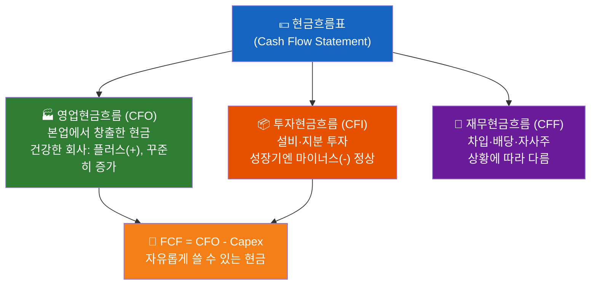

| 구분 | 내용 | 건강한 회사의 패턴 |
|------|------|-------------------|
| **영업현금흐름(CFO)** | 본업에서 창출한 현금 | 플러스(+), 꾸준히 증가 |
| **투자현금흐름(CFI)** | 설비·지분 투자 | 성장기엔 마이너스(-) 정상 |
| **재무현금흐름(CFF)** | 차입·배당·자사주 | 상황에 따라 다름 |

- "이익은 의견이고, 현금은 사실이다(Earnings are an opinion; cash is a fact)"는 말이 있을 만큼, 손익보다 현금이 더 중요한 경우가 있습니다.

### 2. 영업·투자·재무 현금흐름 분석

> 📖 **Wikipedia**: [영업 현금 흐름](https://ko.wikipedia.org/wiki/영업_현금_흐름) · [잉여현금흐름](https://ko.wikipedia.org/wiki/잉여현금흐름)


**현금흐름 패턴으로 기업 단계 파악하기**

| CFO | CFI | CFF | 기업 유형 |
|-----|-----|-----|-----------|
| + | - | - | 이상적인 성숙 기업 (벌어서 투자하고 배당) |
| + | - | + | 성장 기업 (벌지만 차입도 해서 투자) |
| - | - | + | 초기 성장 기업 (아직 적자, 외부 자금 의존) |
| + | + | - | 구조조정 중 (자산 매각으로 부채 상환) |

- 영업현금이 꾸준히 플러스인지, 투자지출이 미래 성장을 위한 것인지, 차입 증가가 위험 신호인지 함께 살펴보는 것이 핵심입니다.

**현금흐름표에서 꼭 확인할 6가지**

| 확인 항목 | 보는 방법 | 해석 포인트 |
|-----------|-----------|-------------|
| **영업현금흐름(CFO)** | 본업에서 현금이 들어오는지 | 장기적으로 플러스가 가장 중요 |
| **순이익 vs CFO** | CFO가 순이익보다 너무 낮지 않은지 | 이익의 질, 매출채권·재고 부담 확인 |
| **투자현금흐름(CFI)** | 설비투자·지분투자·자산매각 확인 | 성장 투자와 생존용 자산매각 구분 |
| **재무현금흐름(CFF)** | 차입·상환·배당·자사주 확인 | 외부 자금 의존도와 주주환원 확인 |
| **FCF** | CFO - Capex | 회사가 자유롭게 쓸 수 있는 현금 |
| **현금및현금성자산 증감** | 기초 현금과 기말 현금 비교 | 실제 현금 체력이 좋아졌는지 확인 |

**순이익과 영업현금흐름이 다르게 움직이는 이유**

| 항목 | CFO에 미치는 영향 | 해석 |
|------|-------------------|------|
| **매출채권 증가** | 감소(-) | 팔았지만 아직 현금을 못 받은 상태 |
| **재고자산 증가** | 감소(-) | 현금이 재고에 묶인 상태 |
| **매입채무 증가** | 증가(+) | 비용 지급을 뒤로 미룬 상태 |
| **감가상각비** | 증가(+) | 비용 처리됐지만 현금 유출은 없는 항목 |
| **법인세·이자 지급** | 감소(-) | 실제 현금 유출 |

**좋은 현금흐름의 예시**

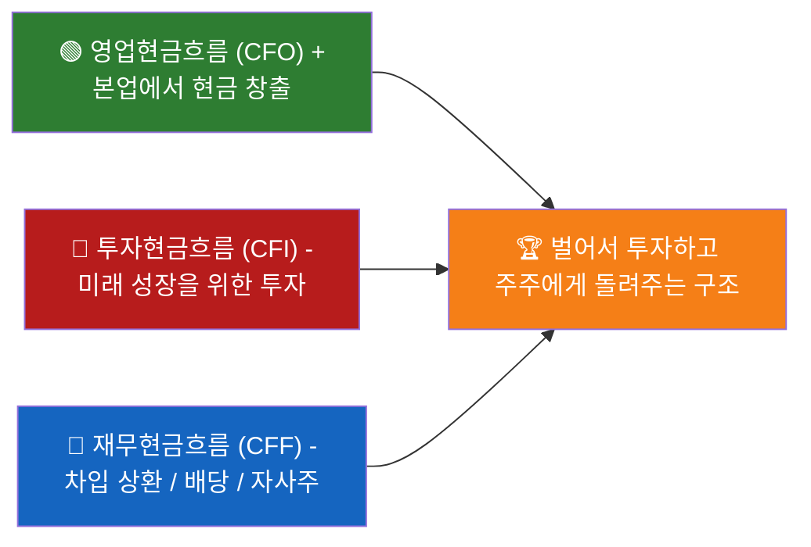

**주의해야 할 현금흐름의 예시**

| 상황 | 가능한 해석 |
|------|-------------|
| 순이익 흑자, CFO 반복 적자 | 매출채권·재고 증가, 이익의 질 저하 |
| CFO 적자, CFF 플러스 | 본업 현금 부족을 차입·증자로 메우는 구조 |
| CFI 플러스가 반복 | 성장 투자보다 자산 매각으로 현금 확보 가능성 |
| CFO 플러스지만 FCF 적자 | 설비투자 부담이 크거나 성장 투자 단계 |
| 현금 감소와 단기차입 증가 동시 발생 | 유동성 압박 가능성 |

### 3. 재무제표 3종 연결 분석

> 📖 **Wikipedia**: [재무제표](https://ko.wikipedia.org/wiki/재무제표)

재무제표는 각각 따로 보는 것이 아니라, 아래 순서로 연결해서 읽어야 합니다.

| 순서 | 보는 표 | 핵심 질문 |
|------|---------|-----------|
| 1 | **손익계산서** | 회사가 돈을 벌고 있는가? 본업 이익률은 좋아지는가? |
| 2 | **대차대조표/재무상태표** | 그 성장이 부채를 늘려 만든 것인가, 자본을 쌓아 만든 것인가? |
| 3 | **현금흐름표** | 회계상 이익이 실제 현금으로 들어오고 있는가? |

**연결해서 보는 대표 사례**

| 관찰된 현상 | 추가로 확인할 표 | 해석 |
|-------------|------------------|------|
| 매출과 영업이익 증가 | 대차대조표의 매출채권·재고 | 현금 회수가 잘 되는 성장인지 확인 |
| 순이익 증가 | 현금흐름표의 CFO | 이익이 실제 현금으로 바뀌는지 확인 |
| 자산 증가 | 대차대조표의 부채·자본 | 차입 성장인지 이익 누적 성장인지 확인 |
| 투자현금흐름 대규모 마이너스 | 손익계산서의 향후 매출·이익 | 설비투자가 성과로 이어지는지 확인 |
| 재무현금흐름 플러스 | 대차대조표의 차입금 | 신규 투자용 차입인지 생존용 차입인지 구분 |

**한 문장 분석 템플릿**

```
이 회사는 손익계산서상 [매출/영업이익]이 [증가/감소]하고 있으며,
재무상태표상 [부채/현금/재고/매출채권]은 [안정/악화]되고,
현금흐름표상 영업현금흐름은 [플러스/마이너스]이므로
[건강한 성장/수익성 개선/유동성 주의/이익의 질 점검 필요]로 판단한다.
```

### 4. 기업가치 평가 개요

> 📖 **Wikipedia**: [기업가치](https://ko.wikipedia.org/wiki/기업가치) · [가중평균자본비용](https://ko.wikipedia.org/wiki/가중평균자본비용)

**쉽게 이해하기**
- 기업가치 평가는 "이 회사가 지금 시장에서 얼마 정도로 평가받아야 할까?"를 따져보는 과정입니다.
- 단순히 주가만 보는 것이 아니라, 회사가 앞으로 벌어들일 현금과 현재 재무 상태를 함께 고려합니다.

**장표에서 볼 포인트**
- 이 장표는 이후의 DCF, EVA, FCF 같은 방법들이 왜 필요한지 배경을 설명하는 역할을 합니다.
- 가치 평가는 정답 하나를 맞히는 일이 아니라, 가정이 바뀌면 결과도 달라진다는 점을 이해하는 것이 중요합니다.

**기업가치(EV)와 주주가치(Equity Value) 구분**

| 구분 | 뜻 | 왜 중요한가 |
|------|----|-------------|
| **기업가치(EV)** | 사업 전체를 인수한다고 보고 평가한 가치 | 부채 포함 기준이라 기업 자체 체력을 보기 좋음 |
| **주주가치(Equity Value)** | 기업가치에서 순부채를 반영한 뒤 주주 몫으로 남는 가치 | 실제 주가와 연결되는 가치 |

```text
기업가치(EV) = 주주가치 + 순부채
주주가치 = 기업가치(EV) - 순부채
```

- 현금이 많고 부채가 적은 회사는 같은 EV라도 주주가치가 더 크게 남을 수 있습니다.
- 반대로 영업이익은 좋아 보여도 순부채가 크면 주주 입장에서 체감 가치는 줄어들 수 있습니다.

**기업가치 분석 체크리스트**

1. **본업의 현금 창출력**: CFO와 FCF가 꾸준한가?
2. **재무 안전성**: 순부채, 이자 부담, 유동성은 감당 가능한가?
3. **성장 가정의 현실성**: 매출 성장률과 마진 개선 가정이 산업 평균과 맞는가?
4. **할인율의 적절성**: 금리, 사업 위험, 자본 구조가 반영됐는가?
5. **결과 해석 방식**: 단일 숫자보다 보수·기준·낙관 시나리오 범위로 보는가?

### 5. 절대가치 평가: DCF, EVA, FCF 개념

> 📖 **Wikipedia**: [현금 흐름 할인법](https://ko.wikipedia.org/wiki/현금_흐름_할인법) · [경제적 부가가치](https://ko.wikipedia.org/wiki/경제적_부가가치) · [잉여현금흐름](https://ko.wikipedia.org/wiki/잉여현금흐름)


> **절대가치 평가란?**
> 다른 회사와 비교하지 않고, 이 회사가 앞으로 벌어들일 현금을 직접 계산해서 "이 회사는 얼마짜리인가?"를 스스로 따져보는 방법입니다. 마치 가게를 살 때 "이 가게가 앞으로 매년 얼마를 벌 수 있을까?"를 따져보는 것과 같습니다.

---

#### 5-1. FCF (Free Cash Flow, 잉여현금흐름)

> **초급자 비유**
> 용돈을 받아서(영업현금흐름) 연필, 공책을 산 뒤(설비투자) 남은 돈이 FCF입니다.
> 이 남은 돈으로 저축도 하고, 친구에게 빌린 돈도 갚고, 부모님께 용돈도 드릴 수 있습니다.
> 회사도 마찬가지입니다. FCF가 크고 꾸준할수록 "진짜 돈을 잘 버는 회사"입니다.

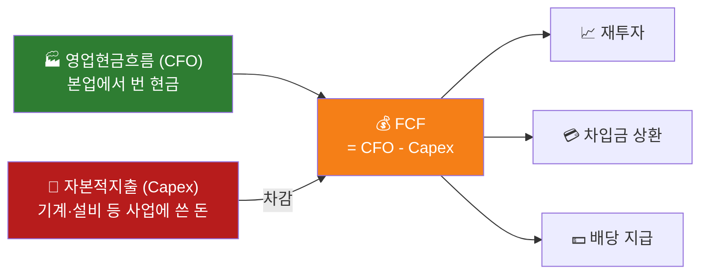

**FCF를 쉽게 이해하는 예시**

| 항목 | 금액 | 설명 |
|------|------|------|
| 영업현금흐름(CFO) | +200억 | 물건 팔고 서비스 제공해서 실제 들어온 현금 |
| 설비투자(Capex) | -50억 | 공장, 기계 등 사업에 다시 투자한 돈 |
| **FCF (남은 현금)** | **+150억** | **주주 배당, 차입금 상환, 재투자에 쓸 수 있는 진짜 여유 돈** |

**FCF가 중요한 이유**
- 회계 이익은 숫자를 '조정'할 여지가 있지만, FCF는 통장에 실제로 들어온 현금입니다.
- FCF가 꾸준히 플러스인 기업은 외부 자금 없이 스스로 성장할 수 있습니다.
- FCF를 주식 수로 나누면 **주당 FCF**를 구할 수 있어, 주가와 직접 비교할 수 있습니다.


---

#### 5-2. DCF (Discounted Cash Flow, 할인현금흐름)

> **초급자 비유**
> "1년 뒤에 받을 1만 원"과 "지금 당장 받는 1만 원" 중 어느 쪽이 더 좋나요?
> 당연히 **지금 받는 1만 원**입니다! 지금 받으면 은행에 넣어 이자도 받을 수 있으니까요.
> DCF는 이 원리를 이용해, 미래에 받을 현금을 **지금 기준의 가치**로 바꾸어 회사값을 계산합니다.

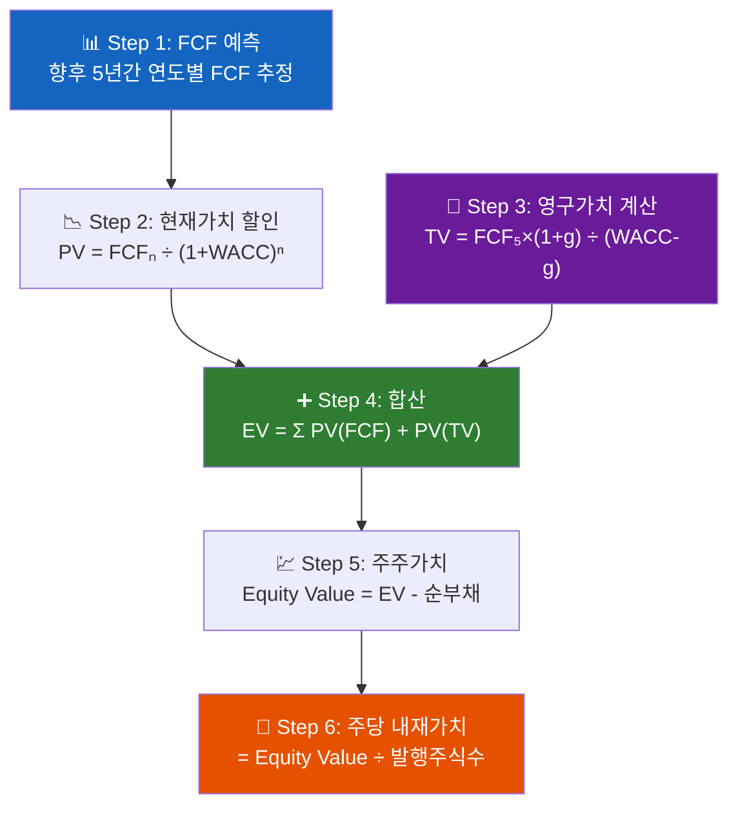

**DCF 계산 4단계**

```
1단계: 앞으로 몇 년간 FCF를 예측한다 (예: 5년)
2단계: 각 연도의 FCF를 "현재 가치"로 할인한다
3단계: 5년 이후 회사가 영원히 벌어들일 가치(영구가치)를 계산한다
4단계: 모두 더하고 부채를 빼면 주주 몫의 가치가 나온다
```

**수식으로 표현하면**

```
기업가치(EV) = FCF₁/(1+r)¹ + FCF₂/(1+r)² + ... + FCFₙ/(1+r)ⁿ + TV/(1+r)ⁿ

영구가치(Terminal Value, TV) = FCFₙ × (1+g) / (r - g)

여기서:
  r = WACC (할인율, 회사의 자본조달 평균 비용)
  g = 영구 성장률 (보통 경제성장률 수준, 2~3%)
```

**할인율(WACC)이란?**
- 회사가 사업을 위해 돈을 빌리거나(부채) 주식을 발행(자본)하는 데 드는 평균 비용입니다.
- 쉽게 말해 "이 회사의 돈 값(투자자 요구 수익률)"이라고 생각하면 됩니다.

```
WACC = 자기자본비율 × 자기자본비용 + 부채비율 × 부채비용 × (1 - 세율)
```

| WACC 요소 | 쉬운 설명 | 일반적 범위 |
|-----------|-----------|-------------|
| 자기자본비용 | 주주가 요구하는 수익률 | 8~15% |
| 부채비용 | 은행 대출 이자율 | 3~7% |
| **WACC (평균)** | **기업 전체의 자본 비용** | **6~12%** |

**DCF의 민감도 — 가정이 바뀌면 가치도 크게 달라집니다**

| 할인율(WACC) | 성장률(g) | 내재가치 예시 |
|-------------|----------|--------------|
| 7% | 3% | 높게 나옴 |
| 10% | 2% | 중간 |
| 13% | 1% | 낮게 나옴 |

> **핵심 교훈**: DCF는 "정확한 답"을 구하는 게 아닙니다. 가정을 바꿔가며 **가치의 범위(보수~낙관)**를 확인하는 도구입니다.


---

#### 5-3. EVA (Economic Value Added, 경제적 부가가치)

> **초급자 비유**
> 친구에게 돈을 빌려 장사를 했을 때, 장사로 번 돈이 이자보다 많아야 진짜 이익입니다.
> 장사 이익 10만원 - 이자 8만원 = 진짜 번 돈 2만원!
> EVA는 이처럼 **회사가 자본 비용(주주·채권자 몫)을 내고도 진짜로 가치를 만들었는지** 따져봅니다.

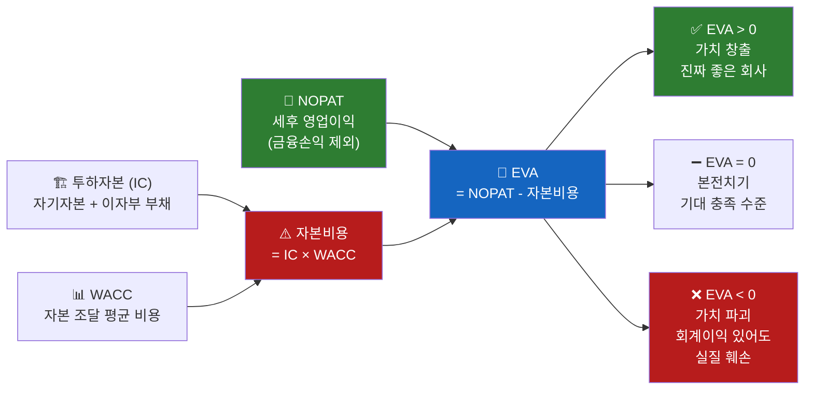

```
EVA = NOPAT - 투하자본 × WACC

여기서:
  NOPAT = 세후 영업이익 (금융손익 제외, 진짜 본업 이익)
  투하자본 = 사업에 실제로 투입된 자본 (자기자본 + 이자부 부채)
  WACC = 자본 조달 평균 비용 (주주와 채권자가 원하는 수익률)
```

**EVA 해석 방법**

| EVA 결과 | 의미 | 투자자 관점 |
|----------|------|-------------|
| **EVA > 0** | 자본 비용을 내고도 남는 가치 창출 | 진짜 좋은 회사 |
| **EVA = 0** | 딱 본전치기 | 투자자 기대 충족 수준 |
| **EVA < 0** | 자본 비용도 못 벌어내는 구조 | 회계이익이 있어도 실질 가치 훼손 |

**EVA 예시로 이해하기**

```
A회사:
  세후 영업이익(NOPAT)  = 500억원
  투하자본              = 4,000억원
  WACC                 = 10%
  자본비용              = 4,000억 × 10% = 400억원
  EVA                  = 500억 - 400억 = +100억원  ← 가치 창출!

B회사:
  세후 영업이익(NOPAT)  = 300억원
  투하자본              = 4,000억원
  WACC                 = 10%
  자본비용              = 4,000억 × 10% = 400억원
  EVA                  = 300억 - 400억 = -100억원  ← 회계이익은 있지만 가치 파괴
```

> **핵심 교훈**: 영업이익이 플러스라고 해서 다 좋은 회사가 아닙니다. 자본 비용을 넘어서야 진짜 가치를 만드는 회사입니다.


---

#### 5-4. 세 가지 방법 비교 정리

| 구분 | FCF | DCF | EVA |
|------|-----|-----|-----|
| **핵심 질문** | 이 회사가 실제로 얼마나 현금을 남기나? | 미래 현금을 지금 가치로 환산하면 회사가 얼마인가? | 자본 비용을 내고도 진짜 가치를 만드나? |
| **초급자 비유** | 용돈에서 필수 지출 후 남은 돈 | 미래 용돈의 오늘 가치 | 빌린 돈 이자 내고도 이익이 남나? |
| **강점** | 이익 조작이 어려운 현금 기반 | 내재가치 직접 추정 가능 | 자본 효율성 평가 |
| **약점** | 미래 성장성을 직접 반영 못함 | 가정에 매우 민감 | 투하자본 산정이 복잡 |
| **활용 시점** | 현금 창출력 확인 시 | 성장주 가치 평가 시 | 자본 배분 효율성 점검 시 |

**절대가치 평가 실전 활용 순서**

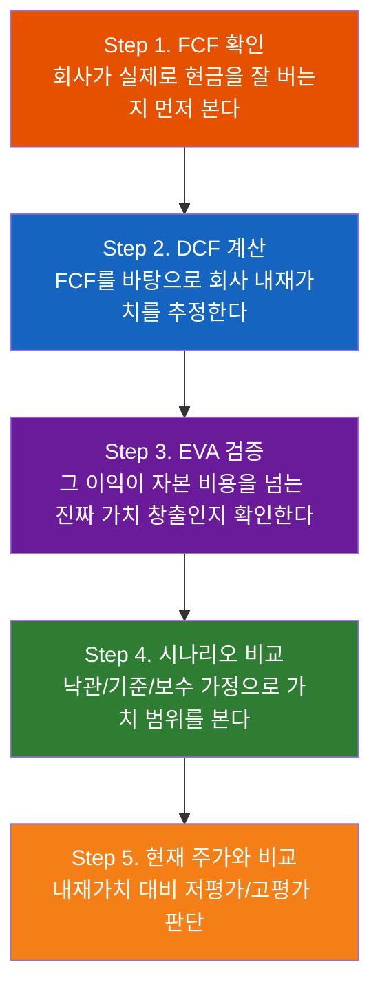

# DCF 기업가치 평가 리포트

## 1. 분석 대상


- 회사명:
- 현재 주가:
- 발행주식수:
- 순부채:
- 기준 FCF:

## 2. 핵심 가정


- 예측 기간:
- 연도별 FCF 성장률:
- WACC:
- 영구성장률:
- Terminal Value 방식:

## 3. 평가 결과


- 기업가치(EV):
- 주주가치:
- 주당 내재가치:
- 현재가 대비 상승/하락 여력:
- Terminal Value 비중:

## 4. 시나리오 분석


- Bear:
- Base:
- Bull:

## 5. 민감도 분석


- 가치에 가장 큰 영향을 준 가정:
- WACC 변화 영향:
- 영구성장률 변화 영향:

## 6. 리스크와 한계


- DCF는 가정 기반 모델임
- FCF 예측 오류 가능성
- WACC와 영구성장률에 매우 민감
- 산업 사이클과 재무구조 변화 반영 필요
```

---

#### 6-10. 실습 체크리스트

- [ ] 기본 DCF 계산 함수 작성
- [ ] Bear/Base/Bull 시나리오 테이블 생성
- [ ] WACC × 영구성장률 민감도 테이블 생성
- [ ] 몬테카를로 DCF 시뮬레이션 실행
- [ ] `dcf_dashboard.png` 생성
- [ ] `/api/valuation/dcf` 요청/응답 설계
- [ ] `/api/valuation/dcf/monte-carlo` 요청/응답 설계
- [ ] `dcf_valuation_report.md` 작성

---

## 해보기 활동


오늘은 "이익"이 아니라 "현금"과 "가치"에 집중해서 정리해보세요.

1. 관심 기업 1개를 골라 영업·투자·재무 현금흐름이 각각 플러스인지 마이너스인지 적어보세요.
2. 그 흐름이 왜 나왔는지 기업 상황과 연결해 한 줄씩 설명해보세요.
3. 매출 성장률, 영업이익률, 할인율을 각각 하나의 가정으로 정하고, 어떤 가정이 기업가치에 가장 큰 영향을 줄지 써보세요.
4. 순부채를 확인해 "기업가치와 주주가치 차이가 큰 기업인지" 한 줄로 적어보세요.
5. 마지막으로 "이 회사의 현금흐름은 건강한가?"를 한 문장으로 정리해보세요.

---

# 상대가치 평가 (밸류에이션 멀티플)


---

>
> 📝 **한자 병기 및 어원 사전**: 이 문서에 등장하는 용어의 한자·어원·일제강점기 유래는 → [voca.md](voca.md)

## 오늘 배울 것 (아주 쉽게)


- PER (주가수익비율) 개념과 활용
- PBR, EV/EBITDA, PSR 멀티플
- 업종별 적정 멀티플 기준
- 실습: 국내 종목 멀티플 스크리닝 및 비교

---

## 🔗 참고 사이트 & 데이터 원천


> 이 문서(상대가치 평가 — PER·PBR·EV/EBITDA·PSR 멀티플)의 실습에 필요한 공식 데이터 출처와 참고 사이트입니다. ⚿ 는 API 키 또는 승인이 필요한 항목입니다.

### 📊 국내 공식 데이터

| 기관 | URL | API 키 | 제공 데이터 |
|------|-----|--------|-------------|
| DART(전자공시시스템) | <https://opendart.fss.or.kr> | ⚿ 필요 | EPS·BPS 산출용 재무제표, 주식수 공시 |
| KRX 한국거래소 | <https://www.krx.co.kr> | 불필요(웹 조회) | 업종별 PER·PBR 통계, 시가총액 |
| KRX Data Marketplace | <https://openapi.krx.co.kr> | ⚿ 필요 | 시장 통계·멀티플 API |
| KIND(상장공시시스템) | <https://kind.krx.co.kr> | 불필요(웹 조회) | 종목별 재무 요약·멀티플 참고 |
| 금융투자협회(KOFIA) | <https://www.kofia.or.kr> | 불필요(웹 조회) | 자본시장 밸류에이션 통계 |
| 금융감독원(FSS) | <https://www.fss.or.kr> | 불필요(웹 조회) | 금융회사 자산·수익 통계 |

### 🌍 해외 공식 데이터

| 기관 | URL | API 키 | 제공 데이터 |
|------|-----|--------|-------------|
| yfinance (PyPI) | <https://pypi.org/project/yfinance> | 불필요 | 국내외 종목 PER·PBR·EV/EBITDA |
| pykrx (PyPI) | <https://pypi.org/project/pykrx> | 불필요 | 국내 종목 시장 데이터·멀티플 |
| SEC EDGAR API | <https://data.sec.gov/api/xbrl/companyfacts> | 불필요 | 미국 기업 EPS·BPS 원시 데이터 |

### 📈 리서치·차트·포탈 참고

| 분류 | 사이트 | URL | 활용 용도 |
|------|--------|-----|-----------|
| 리서치 플랫폼 | FnGuide 데이터 | <https://comp.fnguide.com> | 종목별 PER·PBR·EV/EBITDA 현황 |
| 차트 플랫폼 | TradingView | <https://www.tradingview.com> | 멀티플 비교 차트·업종 필터 |
| 차트 플랫폼 | Investing.com | <https://www.investing.com> | 글로벌 종목 멀티플 비교 |
| 금융 포탈 | 네이버 금융 | <https://finance.naver.com> | 종목별 PER·PBR·ROE 요약 |
| 금융 포탈 | 다음 금융 | <https://finance.daum.net> | 종목 재무·밸류에이션 현황 |
| 금융 미디어 | 머니투데이 방송(MTN) | <https://mtn.co.kr> | 밸류에이션·주가 분석 뉴스 |
| 금융 미디어 | 연합인포맥스 | <https://news.einfomax.co.kr> | 종목·업종 멀티플 속보 |
| 증권사 리서치 | 삼성증권 | <https://www.samsungpop.com> | PER·PBR 기반 목표주가 리포트 |
| 증권사 리서치 | KB증권 | <https://www.kbsec.com> | 업종별 밸류에이션 분석 리포트 |

---

# 주식 투자 용어 해설: 티커(Ticker)

주식 시장에서 **티커(Ticker)**는 특정 종목을 빠르고 정확하게 식별하기 위해 부여된 **고유의 약자(심볼)**를 의미합니다.

## 1. 유래


과거에는 주식 시세를 종이 띠(**Ticker Tape**)에 인쇄하여 전달했습니다. 이때 회사 이름을 모두 기입하기에는 지면이 부족하고 시간이 오래 걸렸기 때문에, 짧은 알파벳 기호로 표시하던 습관에서 유래되었습니다.

---

## 2. 국가별 티커의 형태


국가마다 티커를 구성하는 방식에는 차이가 있습니다.

### 미국 (문자 중심)
영문 알파벳 대문자로 구성되며, 보통 회사 이름과 연관성이 높습니다.
* **AAPL**: 애플 (Apple)
* **TSLA**: 테슬라 (Tesla)
* **MSFT**: 마이크로소프트 (Microsoft)
* **O**: 리얼티 인컴 (Realty Income) - *단일 철자를 사용하는 경우도 있음*

### 한국 (숫자 중심)
한국에서는 '티커'라는 말 대신 주로 **'종목코드'**라고 부르며, 6자리의 숫자로 구성됩니다.
* **005930**: 삼성전자
* **035420**: NAVER
* **373220**: LG에너지솔루션

---

## 3. 티커 사용의 장점


1.  **정확성**: 이름이 유사한 기업 간의 혼동을 방지합니다. (예: Zoom Video Communications의 티커는 `ZM`)
2.  **신속성**: 긴 회사명 대신 짧은 코드를 입력하여 빠르게 검색 및 매매가 가능합니다.
3.  **범용성**: 전 세계 투자자와 시스템이 동일한 기호를 사용하므로 정보 전달이 명확합니다.

---

## 💡 참고사항


해외 주식 시장에서는 티커 대신 **'심볼(Symbol)'**이라는 용어를 혼용해서 사용하기도 합니다. HTS나 MTS에서 종목을 찾을 때 이 티커를 활용하면 가장 정확한 검색 결과를 얻을 수 있습니다.

### 1. PER (주가수익비율) 개념과 활용

> 📖 **Wikipedia**: [주가수익비율](https://ko.wikipedia.org/wiki/주가수익비율)


**PER 계산 공식**

```
PER = 주가 / 주당순이익(EPS)
    = 시가총액 / 당기순이익
```


- PER 20배 = 지금 이익 수준이라면 20년이 지나야 투자금을 회수한다는 뜻
- 높은 PER: 시장이 미래 고성장을 기대 / 낮은 PER: 저평가이거나 성장 정체·위험 반영
- **적자 기업에는 PER 계산 불가**, 일회성 이익이 섞이면 왜곡될 수 있습니다.

#### 1-1. 한국 PER vs 미국 PER 차이 (비교 시 주의점)

같은 업종이라도 **한국 PER와 미국 PER를 1:1로 단순 비교하면 왜곡**될 수 있습니다.

| 비교 축 | 한국 시장(예시) | 미국 시장(예시) | 왜 중요한가 |
|--------|----------------|----------------|-------------|
| **시장 구조** | 제조·수출 대형주 비중 높음 | 플랫폼·소프트웨어 등 고성장주 비중 높음 | 성장주 비중이 높을수록 시장 평균 PER이 높아지기 쉬움 |
| **EPS 기준 표기** | 사이트별 TTM/최근연환산 혼재 | TTM·Forward 구분 표기가 비교적 명확 | 분모(EPS) 기준이 다르면 PER 숫자 자체가 달라짐 |
| **주주환원 정책** | 배당·자사주 소각 강도 기업별 편차 큼 | 자사주 매입·소각이 활발한 기업 다수 | 동일 이익이어도 주식 수 변화로 EPS/PER 해석 차이 발생 |
| **금리·할인율 환경** | 국내 금리와 원화 리스크 반영 | 미 연준 금리·달러 사이클 반영 | 할인율이 높아지면 적정 PER은 낮아지는 경향 |
| **세금·회계 차이** | 한국 법인세·K-IFRS 환경 | 미국 법인세·US GAAP 환경 | 세후이익·회계 인식 차이로 국가 간 단순 비교 왜곡 가능 |

**실무 체크리스트**

1. **같은 업종·같은 성장 단계** 기업만 비교합니다.
2. **TTM vs Forward PER**를 반드시 구분합니다.
3. 환율·금리·세율 차이를 함께 보고, 최종 판단은 **PER 단일 지표가 아니라 ROE·FCF·성장률**과 같이 확인합니다.

#### 1-2. 조엘 그린블라트의 매직 포뮬러: 좋은 회사를 싼 가격에 찾기

**조엘 그린블라트(Joel Greenblatt)**는 가치투자 방식으로 알려진 투자자이자 『*The Little Book That Beats the Market*』의 저자입니다. 이 책에서 소개한 **매직 포뮬러(Magic Formula)**는 많은 기업을 두 가지 질문으로 정리해 후보를 고르는 방법입니다.

> **① 이 회사는 사업을 잘하는가?** → 자본수익률(ROC)이 높은가?
> **② 이 회사의 가격은 이익에 비해 싼가?** → 이익수익률(Earnings Yield)이 높은가?

쉽게 말해, **"돈을 효율적으로 버는 회사"를 "이익에 비해 낮은 가격"에 사려는 규칙**입니다. 한 가지 숫자만 보고 고르는 대신, 사업의 질과 가격을 함께 보려는 점이 핵심입니다.

| 확인할 점 | 매직 포뮬러의 지표 | 쉬운 뜻 | 일반적인 해석 |
|---|---|---|---|
| 사업의 질 | 자본수익률(ROC) | 회사가 사업에 투입한 돈으로 이익을 얼마나 잘 만드는가 | 높을수록 적은 자본으로 이익을 잘 내는 경향 |
| 가격의 매력 | 이익수익률 | 지금 가격으로 샀을 때 영업이익이 얼마나 돌아오는가 | 높을수록 이익 대비 가격이 낮은 경향 |

**계산을 조금 더 정확히 보면** 원래 방식에서는 보통 다음처럼 측정합니다. 여기서 EBIT은 이자·세금 차감 전 영업이익이고, EV는 시가총액에 순부채 등을 반영한 기업가치입니다.

```text
자본수익률(ROC) = EBIT / (순운전자본 + 순유형고정자산)
이익수익률      = EBIT / EV
```

PER와 연결해서 이해하면 더 쉽습니다. **이익수익률은 PER의 역수와 비슷한 방향**을 보는 지표입니다. 예를 들어 PER가 낮으면(다른 조건이 같다면) 이익수익률은 높아질 수 있습니다. 다만 매직 포뮬러는 순이익과 시가총액 대신 EBIT과 EV를 사용하므로, PER의 단순한 역수와 숫자가 정확히 같지는 않습니다.

**후보를 고르는 과정**

1. 비교할 수 있는 기업 목록을 만듭니다. 금융업처럼 재무구조가 매우 다른 업종, 지나치게 작은 기업 등은 기준에 따라 별도로 제외할 수 있습니다.
2. 각 기업의 자본수익률을 높은 순으로, 이익수익률도 높은 순으로 각각 순위를 매깁니다.
3. 두 순위를 더합니다. 합계가 작을수록 두 기준을 모두 잘 만족한 후보입니다.
4. 상위 후보라도 재무제표, 부채, 일회성 이익, 산업 전망을 다시 확인한 뒤 분산·장기 관점에서 판단합니다.

| 가상 기업 | ROC 순위 | 이익수익률 순위 | 순위 합계 | 해석 |
|---|---:|---:|---:|---|
| A사 | 2위 | 3위 | 5점 | 사업의 질과 가격을 모두 비교적 잘 충족 |
| B사 | 1위 | 20위 | 21점 | 사업은 훌륭하지만 가격이 비쌀 수 있음 |
| C사 | 18위 | 1위 | 19점 | 가격은 싸 보이지만 사업의 질을 더 점검해야 함 |

**꼭 알아둘 한계**

- 이 공식은 **매수 신호나 수익 보장 공식이 아닙니다.** 특정 기간에는 시장보다 성과가 부진할 수 있습니다.
- 높은 이익수익률은 시장이 성장 둔화, 부채, 소송, 산업 침체 같은 위험을 이미 가격에 반영한 결과일 수도 있습니다.
- EBIT·EV·운전자본의 계산 기준과 재무 데이터 시점에 따라 결과가 달라집니다. 특히 금융업·적자 기업·자산구조가 특수한 기업은 단순 비교에 주의해야 합니다.
- 따라서 이 방법은 **많은 종목에서 조사할 후보를 좁히는 스크리닝 도구**로 쓰고, 최종 투자 판단 전에는 사업 내용과 위험을 별도로 검토해야 합니다.

> 📚 참고: Joel Greenblatt, *The Little Book That Beats the Market*. 이 책은 좋은 기업을 합리적인 가격에 고르는 규칙 기반 접근을 설명합니다.

**멀티플 레벨별 해석 (PER 기준)**

```mermaid
quadrantChart
    title PER 수준 vs 성장률 — 밸류에이션 포지셔닝
    x-axis 낮은 성장률 --> 높은 성장률
    y-axis 낮은 PER --> 높은 PER
    quadrant-1 고성장 프리미엄 (정당한 높은 PER)
    quadrant-2 버블 위험 (성장 없는 고PER)
    quadrant-3 가치주 구간 (저PER·저성장)
    quadrant-4 숨겨진 저평가 (고성장·저PER)
    플랫폼IT: [0.85, 0.80]
    바이오성장주: [0.90, 0.90]
    반도체: [0.70, 0.65]
    소비재: [0.45, 0.40]
    은행금융: [0.30, 0.25]
    전통제조: [0.20, 0.30]
    과열성장주: [0.30, 0.85]
    가치저평가: [0.75, 0.20]
```

### 2. PBR, EV/EBITDA, PSR 멀티플

> 📖 **Wikipedia**: [주가순자산비율](https://ko.wikipedia.org/wiki/주가순자산비율) · [기업가치](https://ko.wikipedia.org/wiki/기업가치) · [EBITDA](https://ko.wikipedia.org/wiki/EBITDA)


| 멀티플 | 공식 | 언제 유용한가 |
|--------|------|---------------|
| **PBR** | 주가 / 주당순자산(BPS) | 자산 중심 업종 (은행, 부동산), 해산 가치 비교 |
| **EV/EBITDA** | 기업가치 / EBITDA | 부채 구조 비교, 인수합병 가치 평가 |
| **PSR** | 시가총액 / 매출액 | 적자 성장 기업, 매출이 핵심인 초기 기업 |

- 이익이 불안정한 기업은 PER보다 **PSR이나 EV/EBITDA**가 더 유용할 수 있습니다.
- 어떤 멀티플이 맞는지는 기업 특성(성장 단계·자산 구조·이익 안정성)에 따라 달라집니다.

**EV/EBITDA를 조금 더 풀어서 보기**


- **시가총액만 보면 놓치는 것**: 부채가 많은 회사와 무차입 회사는 같은 시가총액이어도 실제 인수 부담이 다릅니다.
- **EBITDA가 유용한 이유**: 감가상각, 이자, 세금 영향을 덜 받아 업종 내 비교가 쉬워집니다.
- **주의점**: 설비투자 부담이 큰 업종은 EBITDA가 실제 현금창출력보다 좋아 보일 수 있으니 Capex도 함께 봐야 합니다.

### 3. 업종별 적정 멀티플 기준

> 📖 **Wikipedia**: [기업 가치 평가](https://ko.wikipedia.org/wiki/기업_가치_평가)


| 업종 | 주요 멀티플 | 대략적 범위 | 이유 |
|------|-------------|-------------|------|
| 은행·금융 | PBR | 0.5~1.5배 | 자산 가치 중심 |
| 반도체 | EV/EBITDA | 10~25배 | 사이클 평탄화 목적 |
| 플랫폼·IT | PER 또는 PSR | 20~50배+ | 고성장 프리미엄 |
| 소비재·유통 | PER | 10~20배 | 안정적 이익 |
| 바이오 | PSR | 적자라 PER 미사용 | 파이프라인 가치 |

- 멀티플이 낮다고 무조건 저평가가 아니라, **성장 둔화나 재무 위험이 반영된 결과**일 수도 있습니다.

**업종별 멀티플 선택 프로세스**

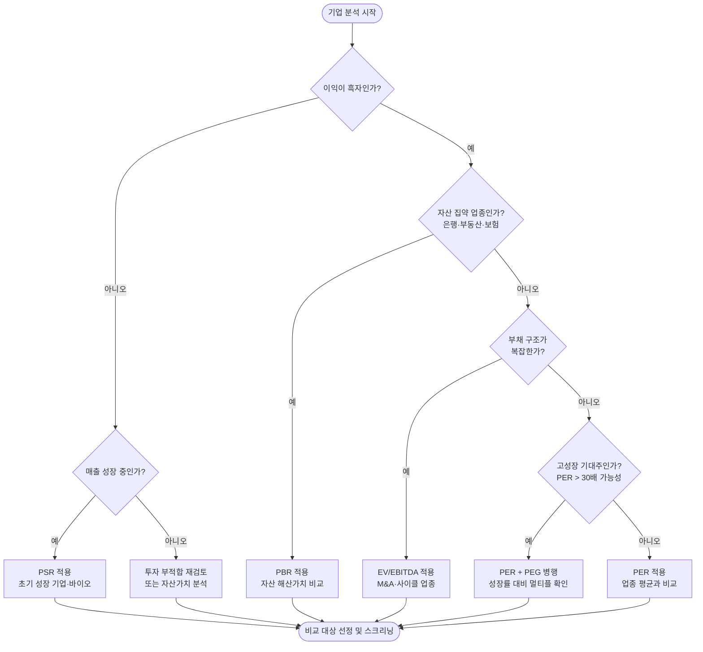

### 4. 실습: 국내 종목 멀티플 스크리닝 및 비교

**쉽게 이해하기**
- 스크리닝은 많은 종목 중에서 원하는 조건에 맞는 후보를 빠르게 추리는 과정입니다.
- 예를 들어 같은 업종 안에서 PER은 낮고 영업이익률은 높은 기업을 찾으면, "실적 대비 저평가 후보"를 골라볼 수 있습니다.

**장표에서 볼 포인트**
- 이 장표는 멀티플 개념을 실제 종목 선택 과정으로 연결하는 역할을 합니다.
- 조건을 너무 많이 걸면 좋은 기업을 놓칠 수 있으니, 먼저 2~3개의 핵심 기준으로 좁힌 뒤 추가로 검토하는 방식이 효율적입니다.

**기업가치 분석용 비교 체크리스트**

| 확인 항목 | 왜 필요한가 | 실무 해석 |
|-----------|-------------|-----------|
| **동일 업종·유사 비즈니스 모델** | 멀티플 비교의 출발점 | 은행과 플랫폼 기업을 같은 기준으로 비교하면 왜곡 |
| **성장률 차이** | 높은 성장 기업은 프리미엄 가능 | 멀티플이 높아도 성장으로 설명되는지 확인 |
| **부채 구조** | EV/EBITDA 해석에 직접 영향 | 차입 급증 기업은 EV가 빠르게 높아질 수 있음 |
| **일회성 이익/손실** | PER, EBITDA 왜곡 방지 | 자산 매각 이익이 포함됐는지 점검 |
| **현금흐름과 Capex** | 숫자의 질 확인 | EBITDA가 좋아도 FCF가 약하면 할인 필요 |

---

#### 4-1. 레퍼런스 사이트 찾기 및 데이터 원천 정리

국내 종목의 멀티플(PER·PBR·EV/EBITDA 등)은 여러 사이트에서 제공하는데, 정의와 기준이 조금씩 다릅니다. 아래 표로 원천별 특징을 먼저 정리하고, 수집할 사이트를 결정합니다.

| 구분 | 사이트 | 가입/인증 | 확인할 데이터 | 실습 포인트 |
|------|--------|-----------|---------------|-------------|
| 국내 증권 원천 | [KRX 정보데이터시스템](https://data.krx.co.kr/) | 무료 회원가입 | 업종별 PER/PBR/배당수익률 통계 | 코스피·코스닥 전 종목의 공식 멀티플 제공 |
| 국내 공시 원천 | [DART 전자공시시스템](https://dart.fss.or.kr/) | Open API 인증키 필요 | 사업보고서·분기보고서 재무수치 | EPS·BPS·EV 계산의 기초 데이터 |
| 국내 포털 | [NAVER Finance 종목 분석](https://finance.naver.com/) | 로그인 불필요 | 종목별 PER·PBR·ROE 요약 | 빠른 참고용, 스크린 기준 확인 |
| 전문 금융 데이터 | [FnGuide (Dataguide)](https://www.fnguide.com/) | 유료 구독 | 업종 평균 멀티플, 컨센서스 EPS | 기관·운용사 수준의 상세 멀티플 |
| Python 라이브러리 | [yfinance](https://pypi.org/project/yfinance/) | 별도 키 없음 | 상장 종목 PER·PBR·EV/EBITDA | KS 티커로 국내 종목 직접 조회 가능 |
| 거시 통계 보강 | [한국은행 ECOS](https://ecos.bok.or.kr/) | Open API 인증키 필요 | 기업 금융통계, 산업별 매출·이익 집계 | 업종별 평균 멀티플 보완 |

**가입 및 키 발급 체크리스트**

1. **KRX 정보데이터시스템**: `data.krx.co.kr` 접속 → 회원가입 → 주식 → 종목정보 → 업종별 PER/PBR 메뉴에서 CSV 다운로드 가능.
2. **DART OpenAPI**: `opendart.fss.or.kr` 접속 → 인증키 신청 → 발급 키를 `.env`의 `DART_API_KEY`에 저장.
3. **ECOS**: `ecos.bok.or.kr` 접속 → 회원가입/로그인 → Open API → 인증키 신청 → `.env`의 `BOK_API_KEY`에 저장.
4. **yfinance**: 별도 가입 없이 `pip install yfinance`로 설치 후 바로 사용 가능. KS(코스피)·KQ(코스닥) 티커 형식 사용.

**유사 정보 비교: 같은 종목의 PER이 사이트마다 다른 이유**

| 비교 항목 | NAVER Finance | yfinance | 확인 질문 |
|-----------|---------------|----------|-----------|
| EPS 기준 | 최근 12개월(TTM) | TTM 또는 Forward | 과거 실적 기준인가, 컨센서스 예상인가? |
| 주식 수 | 보통주 발행 주식 수 기준 | 가중평균 희석 주식 수 포함 가능 | 자사주·우선주 처리 방법은? |
| 통화 처리 | 원화 | 원화(한국 상장) | 외화 환산이 포함됐는가? |
| 업데이트 주기 | 실시간~당일 | 거래소 반영 지연 가능 | 수집 시점의 주가와 EPS 기준일이 맞는가? |

---

#### 4-2. yfinance로 국내 종목 멀티플 수집

`yfinance`는 별도 API Key 없이 바로 사용할 수 있어 실습 진입 장벽이 낮습니다. 한국 상장 종목은 코스피 `.KS`, 코스닥 `.KQ`를 티커에 붙입니다.

**추가 패키지 설치**

```bash
pip install yfinance pandas matplotlib seaborn
```

**국내 업종 대표 종목 티커 정의**


**멀티플 수집 함수**


---

#### 4-3. 표준 데이터 스키마

출처가 달라도 아래 구조로 통일하면 스크리닝·시각화·보고서에서 재사용하기 쉽습니다.

| 컬럼 | 예시 | 설명 |
|------|------|------|
| `sector` | `반도체` | GICS 업종 또는 직접 분류 |
| `company` | `삼성전자` | 기업 이름 |
| `ticker` | `005930.KS` | yfinance 티커 |
| `market_cap` | `4200000` | 시가총액 (억 원) |
| `per` | `13.5` | 주가수익비율 (TTM) |
| `forward_per` | `11.2` | 선행 PER (컨센서스 기준) |
| `pbr` | `1.1` | 주가순자산비율 |
| `psr` | `1.8` | 주가매출비율 |
| `ev_ebitda` | `8.4` | EV/EBITDA |
| `roe_pct` | `8.5` | 자기자본이익률 (%) |
| `op_margin_pct` | `12.3` | 영업이익률 (%) |
| `revenue_growth_pct` | `5.1` | 매출 성장률 (%) |
| `debt_to_equity` | `42.0` | 부채비율 (D/E) |
| `source` | `yfinance` | 데이터 원천 |
| `fetch_date` | `2025-01-31` | 수집일 |

---

#### 4-4. 멀티플 스크리닝 필터 구현

조건 기반 필터로 후보 종목을 좁힙니다. 먼저 2~3개 핵심 조건으로 시작한 뒤, 추가 조건을 붙이는 방식이 실무적입니다.


**스크리닝 조건 선택 가이드**

| 스크리닝 목적 | 핵심 조건 | 참고 조건 |
|--------------|-----------|----------|
| 가치주 발굴 | PER ≤ 업종 평균, PBR ≤ 1.5 | ROE ≥ 8%, 부채비율 낮음 |
| 성장주 발굴 | 매출성장률 ≥ 15%, Forward PER 확인 | ROE 높음, PBR 프리미엄 허용 |
| 자산주 발굴 | PBR ≤ 0.7, 부채비율 낮음 | 배당수익률 확인 |
| M&A 대상 | EV/EBITDA ≤ 8, 순현금 기업 | FCF 양호 여부 함께 확인 |

---

#### 4-5. 시각화: 멀티플 비교 차트

수집한 데이터를 세 가지 방식으로 시각화합니다.

**① 섹터별 PER·PBR 막대 차트 비교**


**② ROE vs PBR 산점도 — "성장 대비 저평가" 식별**


**③ 멀티플 히트맵 — 종목 간 지표 한눈에 비교**


**최종 산출물 목록**

```text
multiples_raw.csv          ← 수집된 원본 멀티플 데이터
sector_multiples_bar.png   ← 섹터별 PER/PBR 막대 차트
roe_vs_pbr_scatter.png     ← ROE vs PBR 산점도
multiples_heatmap.png      ← 종목 간 멀티플 히트맵
```

---

#### 4-6. 데이터 품질 및 해석 유의사항

- **yfinance TTM EPS는 부정확할 수 있습니다.** 특히 분기 실적이 최근 반영되지 않거나 일회성 손익이 섞인 경우 PER이 왜곡될 수 있으므로, 중요한 종목은 DART 공시 원문으로 EPS를 재확인합니다.
- **업종이 달라지면 비교 기준도 달라집니다.** PER이 5배인 은행주와 PER이 50배인 바이오주를 같은 기준으로 비교하면 의미 없는 순위가 나옵니다. 섹터 필터를 먼저 적용한 뒤 비교합니다.
- **PER 미산출(NaN) 기업은 적자이거나 EPS가 음수입니다.** 이 경우 PSR이나 EV/EBITDA로 대체해 평가합니다.
- **EV/EBITDA에서 고차입 기업은 EV가 과대계상될 수 있습니다.** 순차입금(총차입금 − 현금성자산)을 함께 보고, Capex가 큰 업종은 EBITDA가 실제 현금창출력을 과장할 수 있습니다.
- **수집일 기준 주가와 재무 기준일을 맞춰야 합니다.** 분기 실적 발표 전후로 PER이 크게 달라질 수 있으므로, 데이터에 `fetch_date`를 반드시 기록합니다.
- **보고서에는 원천·수집일·EPS 기준(TTM/Forward)·결측 처리 방법을 표시합니다.**

---

## 📌 멀티플에 영향을 주는 외부 요인

### 기준금리 (Base Rate) — 적정 PER의 기준선이 바뀐다


주식의 **적정 PER**은 금리 수준에 따라 달라집니다.

```
적정 PER (대략) = 1 / 무위험수익률(Rf)

금리 2%  → 적정 PER ≈ 50배
금리 4%  → 적정 PER ≈ 25배
금리 6%  → 적정 PER ≈ 17배
금리 10% → 적정 PER ≈ 10배
```

| 금리 방향 | 멀티플 영향 | 투자 시사점 |
|----------|------------|------------|
| **기준금리 인상** | PER 기준 부담 ↑ → 적정 주가 ↓ | 성장주 부담, 가치주·배당주 상대적 유리 |
| **기준금리 인하** | PER 기준 여유 ↑ → 적정 주가 ↑ | 성장주 부양, 장기채·부동산도 수혜 |

> 💡 DCF에서 WACC = Rf + 위험프리미엄. 기준금리 1%p 상승 → WACC 1%p 상승 → 적정주가 평균 10~20% 하락 가능.

**데이터 확인**: [한국은행 ECOS](https://ecos.bok.or.kr) → 기준금리 시계열 / [FRED](https://fred.stlouisfed.org) → 미국 연방기금 목표금리

---

### 시장금리 (Market Rate) — 기준금리보다 빠른 선행 지표


시장금리는 기준금리 결정 이전에 경기 기대를 선반영합니다.

| 시장금리 지표 | 설명 | 투자 활용 |
|-------------|------|----------|
| **국고채 10년물** | 무위험수익률 기준 · DCF 할인율 | 장기 금리 방향성 파악 |
| **국고채 3년물** | 중기 정책 기대 반영 | 기준금리 전망 선행지표 |
| **회사채 신용스프레드** | 회사채 − 국고채 수익률 차이 | 확대 시 경기 우려·신용 경색 신호 |
| **CD금리(91일물)** | 변동금리 기준 · 단기 자금 지표 | 주담대·기업 단기차입 금리와 연동 |
| **장단기 금리차** | 10년물 − 2년물 (역전 시 주의) | 경기침체 6~18개월 선행 지표 |

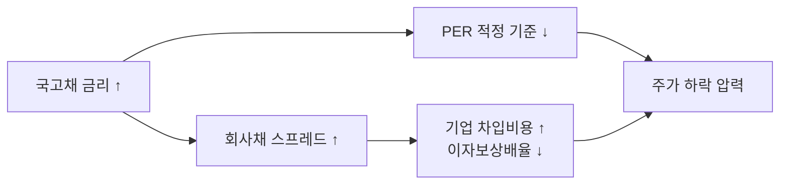

**장단기 금리차 역전 → 경기침체 선행 신호**

```
미국 장단기 금리차(10Y-2Y) 역전 역사
2000년 → 닷컴 버블 붕괴
2007년 → 금융위기
2019년 → 코로나 침체 선행
```

**데이터 확인**: [금융투자협회 채권정보](https://www.kofiabond.or.kr) / [KRX 채권](https://www.krx.co.kr)

---

### 투자자 심리 (Investor Sentiment) — 단기 주가를 움직이는 감정


**"시장은 단기적으로 투표 기계, 장기적으로 저울이다."** — 벤저민 그레이엄

기업 펀더멘탈이 좋아도 심리가 극공포 상태이면 주가가 펀더멘탈 이하로 떨어지고,
반대로 심리가 극탐욕이면 펀더멘탈 이상으로 올라갑니다.

**주요 심리 지표**

| 지표 | 설명 | 해석 기준 |
|------|------|----------|
| **공포탐욕지수** | CNN Fear & Greed 0~100 | 0~20: 극공포(역발상 매수 검토) / 80~100: 극탐욕(비중 축소 검토) |
| **VIX (공포지수)** | S&P500 30일 변동성 기대 | 20 초과: 불안 / 30 초과: 패닉 |
| **VKOSPI (코스피 변동성지수)** | KOSPI200 옵션 기반 30일 변동성 기대 | 20 내외: 안정 / 25 초과: 경계 / 30 초과: 국내 패닉 구간 |
| **투자자 수급** | 외국인·기관·개인 순매수 | 외국인 지속 순매수: 긍정 신호 |
| **신용잔고** | 개인 투자자 빚투 규모 | 급증 → 레버리지 과열 → 조정 시 낙폭 확대 위험 |
| **공매도 비율** | 거래량 대비 공매도 비중 | 급증 → 약세 심리 과열 / 감소 → 숏커버링 기대 |

**VIX (CBOE Volatility Index) 상세 설명**

VIX는 **시카고 옵션거래소(CBOE)** 가 산출하는 변동성 지수로, S&P500 지수 옵션의 **내재변동성(Implied Volatility)** 을 가중 평균하여 향후 **30일간의 시장 변동성을 연율화(%)**한 수치입니다.

- 티커: `^VIX` (yfinance), `VIXCLS` (FRED)
- 수치 해석: "시장 참여자들이 향후 30일간 S&P500이 얼마나 흔들릴 것으로 예상하는가"
- VIX 20 = 연간 기준 ±20% 변동을 예상 (월 기준 약 ±5.8%)

**VIX 구간별 해석**

| VIX 수치 | 시장 상태 | 투자자 행동 시사점 |
|----------|----------|------------------|
| 10 미만 | 극저 변동성 / 과도한 낙관 | 과열·안일 경계, 변동성 상승 리스크 주시 |
| 10 ~ 20 | 안정 구간 (정상 범위) | 일반적 추세 투자 환경 |
| 20 ~ 25 | 불확실성 증가 | 포지션 점검, 리스크 관리 시작 |
| 25 ~ 30 | 주의 / 리스크오프 초입 | 비중 축소 또는 헤지 검토 |
| 30 ~ 40 | 공포 구간 | 역발상 분할 매수 검토 시작 |
| 40 이상 | 패닉 / 시장 위기 | 역사적 저점 형성 가능성↑, 단기 극심한 변동 |

**역사적 VIX 급등 사례**

| 시기 | 사건 | VIX 고점 |
|------|------|---------|
| 1998 | 러시아 디폴트 · LTCM 위기 | 약 45 |
| 2001 | 9·11 테러 | 약 43 |
| 2008 | 글로벌 금융위기 (리먼 사태) | **약 80** (역사적 최고) |
| 2010 | 유럽 재정위기 (그리스) | 약 45 |
| 2011 | 미국 신용등급 강등 | 약 48 |
| 2015 | 중국 위안화 평가절하 | 약 40 |
| 2018 | 볼마겟돈 (VIX ETF 폭발) | 약 37 |
| 2020 | COVID-19 팬데믹 | **약 82** (역대 최고 수준) |
| 2022 | 러시아-우크라이나, 미국 급격한 금리인상 | 약 36 |

**VIX와 주가의 역상관 관계**

VIX와 S&P500은 **일반적으로 음(-)의 상관관계**를 가집니다.

```
S&P500↓ (공포 확산) → 투자자들이 풋옵션 매수 급증 → 옵션 내재변동성↑ → VIX↑
S&P500↑ (안정 회복) → 풋옵션 수요 감소 → 옵션 내재변동성↓ → VIX↓
```

> ⚠️ 역상관이 항상 성립하지는 않습니다. 상승 국면에서도 불확실성이 크면 VIX가 동반 상승할 수 있습니다.

**VIX 활용 투자 포인트**

| 상황 | 해석 | 활용 전략 |
|------|------|---------|
| VIX < 15 (장기 저점) | 시장 자기만족·과열 | 안일함 경계, 헤지 비용 저렴할 때 풋옵션/방어 ETF 고려 |
| VIX 30~40 급등 | 공포 극대화 | 역발상 분할 매수 검토 (단, 추가 하락 가능성 열어둬야) |
| VIX 40~50 이상 | 패닉·시스템 리스크 | 분할 매수 강화, 현금 비중 확보와 병행 |
| VIX 급락 전환 | 공포 완화·반등 신호 | 모멘텀 회복 초입, 포지션 확대 신호 |

**VIX ETF/상품 투자 주의사항**

VIX 자체는 직접 매매 불가 — VIX 연계 상품(ETF/ETP) 투자 시 주의:

- **콘탱고(Contango) 손실**: VIX 선물은 만기가 짧아 월별 롤오버 시 지속적인 비용 발생 → 장기 보유 시 큰 손실 가능
- **VXX, UVXY 등**: 단기 헤지·트레이딩 목적으로만 활용, 장기 보유 비적합
- **인버스 VIX (SVXY 등)**: VIX 하락에 베팅하는 상품, 2018년 볼마겟돈처럼 VIX 급등 시 단기간 90% 이상 손실 가능

**VIX vs VKOSPI 빠른 비교**

| 구분 | VIX | VKOSPI |
|------|-----|--------|
| 정식 명칭 | CBOE Volatility Index | 코스피 변동성지수 |
| 대표 시장 | 미국(S&P500) | 한국(KOSPI200) |
| 산출 기관 | CBOE (시카고 옵션거래소) | KRX (한국거래소) |
| 산출 기반 | S&P500 옵션 내재변동성 | KOSPI200 옵션 내재변동성 |
| 주 활용 맥락 | 글로벌 위험회피 심리 | 국내 증시 단기 스트레스 |
| 함께 볼 지표 | 달러인덱스, 미 국채금리 | 원/달러 환율, 외국인 수급 |
| 2020 팬데믹 고점 | 약 82 | 약 80 |

> 실무에서는 VIX만 보지 말고 VKOSPI를 같이 확인해 **글로벌 리스크와 국내 수급 충격을 분리해서 해석**하는 것이 좋습니다.
> - VIX만 급등 + VKOSPI 안정 → 글로벌 충격이지만 국내 영향 제한적
> - VIX 안정 + VKOSPI 급등 → 국내 수급/정치/경제 이벤트 중심 충격
> - 두 지수 동반 급등 → 글로벌 리스크가 국내로 전이, 외국인 이탈 가능성 높음

**버블 경고 신호 vs 저점 신호**

| 버블 경고 (탐욕 극단) | 저점 신호 (공포 극단) |
|---------------------|---------------------|
| PER 역대 상위 10% | PER 역대 하위 10% |
| 신용잔고 급증 | 개인 패닉 매도 |
| IPO 청약 폭발, 주변인 모두 주식 | 증시 퇴출 종목 속출 |
| 코인·부동산 동반 급등 | 기관·외국인 저가 매집 |

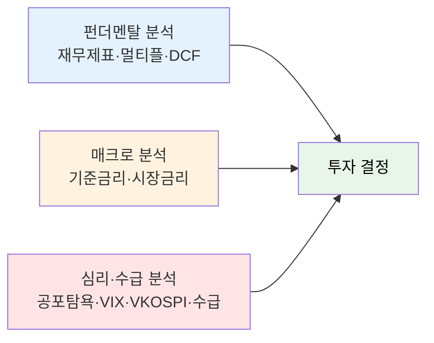

> ⚠️ 심리 지표는 타이밍 도구입니다. 펀더멘탈 분석 없이 심리만 보고 투자하면 위험합니다.

---

## 해보기 활동


멀티플 비교는 "숫자 읽기"보다 "비교 이유 설명하기"가 더 중요합니다.

1. 같은 업종 기업 3개를 골라 PER, PBR, EV/EBITDA 중 확인 가능한 값들을 표로 정리해보세요.
2. 어떤 기업은 왜 PER보다 PBR이나 PSR이 더 적합한지 한 줄로 써보세요.
3. 업종 평균보다 높은 멀티플을 받는 기업 1개를 고르고, 시장이 왜 프리미엄을 주는지 추정해보세요.
4. EV/EBITDA가 낮아 보여도 실제로는 위험할 수 있는 이유를 순부채·Capex 관점에서 적어보세요.
5. 마지막으로 "지금 가장 먼저 추가 확인하고 싶은 기업"을 1개 고르고 이유를 적어보세요.

---

# 주식 시장의 실적 발표: 어닝 서프라이즈와 어닝 쇼크 이해하기

주식 시장에서 **‘어닝(Earning)’**은 기업의 **실적 발표**를 뜻합니다. 기업들은 보통 분기별, 연도별로 장사를 얼마나 잘했는지 성적표를 공개합니다.

이때 시장의 예상치(증권가 전망치 평균, 이를 '컨센서스'라고 합니다)와 비교해 실제 실적이 어떻게 나왔느냐에 따라 **어닝 서프라이즈**와 **어닝 쇼크**로 나뉩니다.

---

## 1. 어닝 서프라이즈 (Earning Surprise)
> 💡 **한 줄 요약:** 시장의 기대를 훌쩍 뛰어넘은 **'대박 성적표'**

* **의미:** 기업이 발표한 실제 영업이익이나 순이익이 시장에서 예상했던 것보다 **훨씬 더 좋게 나온 경우**를 말합니다.
* **시험 비유:** 평소에 80점 정도 받을 줄 알았던 아이가 시험에서 100점을 맞아와서 모두를 깜짝 놀라게 한 상황입니다.
* **주가에 미치는 영향:** 대개 호재로 작용하여 **주가가 상승**하는 경향이 있습니다. 기업의 미래 성장성이 높게 평가되면서 투자자들이 몰리기 때문입니다.

---

## 2. 어닝 쇼크 (Earning Shock)
> 💡 **한 줄 요약:** 시장의 기대에 한참 못 미친 **'충격적인 성적표'**

* **의미:** 기업의 실적이 단순히 줄어든 것을 넘어, 시장이 예상했던 기대치보다 **훨씬 낮게 나온 경우**를 말합니다. (※ 단순히 적자를 낸 것뿐만 아니라, '예상보다 훨씬 못했다'는 점이 핵심입니다.)
* **시험 비유:** 공부를 잘해서 당연히 90점은 나올 줄 알았던 아이가 50점을 받아와서 모두에게 충격을 준 상황입니다.
* **주가에 미치는 영향:** 악재로 작용하여 **주가가 급락**하는 경우가 많습니다. 시장의 신뢰를 잃고 실망한 투자자들이 매물을 쏟아내기 때문입니다.

---

## 📌 한눈에 비교하기

| 구분 | 실제 실적 vs 시장 예상치 | 주가 영향 (일반적) | 투자자 반응 |
| :--- | :--- | :--- | :--- |
| **어닝 서프라이즈** | 실제 실적 **>** 시장 예상치 | 📈 **상승** | "와, 생각보다 돈을 훨씬 잘 버네! 사자!" |
| **어닝 쇼크** | 실제 실적 **<** 시장 예상치 | 📉 **하락** | "앗, 이 정도로 장사를 못 했을 줄이야... 팔자!" |

> ⚠️ **주의할 점 (주식 시장의 특성)**
> 실적이 좋게 나왔는데도 주가가 떨어지거나(재료 소멸로 인한 차익 실현), 실적이 나쁜데도 주가가 오르는 경우가 있습니다. 주가는 '미래의 가치'를 선반영하는 특성이 있기 때문에, 실적 발표 이후 기업이 제시하는 **향후 전망(가이던스)**이 어떠한지도 함께 확인하는 것이 중요합니다.

---

# 주식 종목명 구분 및 배당 제도 총정리

## 1. 주식 종목명 뒤에 붙는 '우', 'A', 'B'의 의미

### 1.1 보통주 vs 우선주(우)
* **보통주 (예: 삼성전자)**
    * **특징:** 주주총회에 참여해 표를 던질 수 있는 **의결권**이 있습니다.
    * **대상:** 회사의 경영에 참여하고 싶거나, 일반적인 주가 상승 차익을 노리는 투자자에게 적합합니다.
* **우선주 (예: 삼성전자우)**
    * **특징:** 의결권이 없는 대신, 보통주보다 **배당금을 더 많이(우선해서)** 받습니다.
    * **대상:** 경영권에는 관심 없고, 안정적인 배당 수익을 원하는 투자자에게 적합합니다.

### 1.2 우선주 뒤의 숫자 (예: 현대차2우B, 현대차3우B)
우선주를 여러 번 발행했을 때, 발행한 순서대로 숫자를 붙입니다. 숫자가 클수록 나중에 발행된 주식이며, 발행 시기마다 배당률이나 조건이 조금씩 다를 수 있습니다.
* **현대차우:** 1번째로 발행한 우선주
* **현대차2우B:** 2번째로 발행한 우선주
* **현대차3우B:** 3번째로 발행한 우선주

### 1.3 알파벳 A, B, C의 의미 (국내 vs 해외)
* **국내 주식에서의 'B' (예: CJ4우B):** **'신형 우선주'**를 뜻합니다. (영어 'Bond-like'에서 유래). 일반 우선주와 달리 **"최하 이 정도 배당률(예: 연 2%)은 무조건 보장해 주겠다"**는 채권형 조건이 붙어 있습니다.
* **해외 주식에서의 A, B, C (예: 구글 알파벳 Class A / C):** 주식의 **'등급(Class)'**을 나누어 의결권에 차등을 둘 때 사용합니다.
    * **알파벳 Class A (GOOGL):** 1주당 1개의 의결권 있음 (일반 투자자 거래용)
    * **알파벳 Class B:** 1주당 10개의 의결권 있음 (창업주 및 내부 경영진 보유, 거래 불가)
    * **알파벳 Class C (GOOG):** 의결권이 없음 (배당 및 주가 이익만 향유)

---

## 2. 주식배당의 조건과 일정

### 2.1 주식배당을 받기 위한 3가지 조건
1.  **회사의 이익 발생:** 당기순이익이 발생하여 배당 재원이 있어야 합니다.
2.  **이사회 및 주주총회 결의:** 주주총회에서 최종 승인을 받아야 합니다.
3.  **배당기준일까지 주식 보유:** 회사가 지정한 배당기준일에 주주명부에 등재되어 있어야 합니다.

### 2.2 배당을 받기 위한 매수 타이밍 (12월 결산법인 예시)
국내 주식 시장은 매수 후 실제 입고까지 **2영업일(D+2)**이 소요되므로, 배당기준일보다 최소 2영업일 전에 매수해야 합니다.

| 단계 | 명칭 | 설명 | 예시 일정 |
| :--- | :--- | :--- | :--- |
| **1** | **주식 매수 마감일** | 배당을 받기 위해 무조건 주식을 사야 하는 마지막 날 | 12월 28일 |
| **2** | **배당락일** | 배당받을 권리가 사라지는 날 (이날 매수 시 배당 불가, 주가 인위적 하락) | 12월 29일 |
| **3** | **배당기준일** | 주주명부에 내 이름이 올라가 있어야 하는 기준일 | 12월 30일 |

> ⚠️ **주의:** 최근 상법 개정으로 **"배당액 선확정 후 배당기준일 지정"** 방식을 채택하는 기업이 늘었습니다. 연말 일괄 매수보다는 개별 기업의 공시를 확인해야 합니다.

### 2.3 실제 주식 입고 프로세스
1.  **배당기준일 확정:** 주주 명부 마감
2.  **정기 주주총회 개최 (보통 3월):** 주식배당 안건 승인 (승인일로부터 1개월 이내 지급 의무)
3.  **주식 실제 입고 (보통 4월):** 증권 계좌로 주식이 자동 입고됨

---

## 3. 현금배당 vs 주식배당 장단점 및 비교

### 3.1 종합 비교

| 구분 | 현금배당 (Cash Dividend) | 주식배당 (Stock Dividend) |
| :--- | :--- | :--- |
| **개념** | 회사의 이익을 **현금(돈)**으로 지급 | 회사의 이익을 **새로운 주식**으로 지급 |
| **장점** | · 즉시 현금 확보 가능 (재투자/생활비)<br>· 배당 소득이 확실하고 직관적임 | · 세금(배당소득세) 이연 효과 (매도 시까지)<br>· 기업이 현금을 유보하여 미래 성장에 재투자 가능 |
| **단점** | · **15.4%의 배당소득세** 원천징수<br>· 금융소득종합과세 위험 노출 | · **배당락**으로 인해 초기 자산 총액 변동 없음<br>· 주식 수 증가로 주당 가치 희석 가능성 |

### 3.2 투자자 성향별 유리한 상황

#### 💡 현금배당이 유리한 경우
* **현금 흐름이 필요할 때:** 배당금으로 제2의 월급을 만들거나 다른 자산에 재투자하고자 할 때
* **성숙기 기업 투자 시:** 은행, 통신, 유틸리티 등 대규모 투자가 끝나고 안정적 이익을 내는 대기업 투자 시
* **소액 투자자:** 연간 금융소득이 2,000만 원 이하로 배당소득세 부담이 상대적으로 적을 때

#### 💡 주식배당이 유리한 경우
* **고성장 기업 투자 시:** 회사가 현금을 유보하여 R&D나 설비에 재투자하고, 주주는 향후 기업 성장에 따른 주가 상승(복리 효과)을 노릴 때
* **절세 및 세금 이연이 필요할 때:** 현금배당과 달리 주식을 매도하기 전까지 과세가 유예되므로 고액 자산가의 금융소득종합과세 회피 대안으로 활용
* **유통 주식 수 확대가 필요할 때:** 거래량이 너무 적은 숨은 우량주의 경우, 주식 수 증가로 거래가 활성화되어 주가에 호재로 작용 가능
