# 7단원. 거시경제와 주식시장 읽기


---

# 거시경제와 주식시장 읽기

**거시경제(Macroeconomics, 나라 전체의 생산·물가·고용·돈의 흐름을 보는 경제)**는 개별 회사 밖에서 주가에 영향을 주는 큰 환경이에요. 거시지표는 주가를 맞히는 답안지가 아니라, ‘시장에 어떤 바람이 부는지’를 확인하는 도구예요.

> 숫자의 발표 시점·기준·수정 여부를 확인하세요. 지표 하나가 올랐거나 내렸다는 사실만으로 매수·매도 결정을 내리면 안 돼요.

## 2025년 8월~2026년 8월: 월별 시장 변동 키워드

아래는 이 기간의 **글로벌·미국 시장을 중심으로**, 한국 시장에도 파급력이 컸던 월별 변동 요인을 세 가지씩 추린 복기표예요. 수익률 순위나 매수·매도 신호가 아니라, 그달 뉴스가 주가·업종·금리 기대를 어떤 경로로 흔들었는지 기억하기 위한 키워드입니다. 같은 사건도 국가·업종·종목에 따라 반응이 달랐고, 한 달의 움직임을 세 단어로 모두 설명할 수는 없어요. **2026년 8월은 8월 13일 기준의 진행 중인 복기**이므로, 월말 성과로 읽으면 안 됩니다.

| 월 | 크게 부각된 키워드 3개 | 주식시장에서는 어떻게 읽혔나요? |
| --- | --- | --- |
| 2025년 8월 | **상호관세 발효·협상** · **고용 둔화** · **9월 금리인하 기대** | 관세의 실제 적용과 협상 가능성이 수출·제조업 전망을 흔들었고, 고용 둔화와 물가 지표는 연준의 인하 기대를 키워 성장주 밸류에이션에 영향을 줬어요. |
| 2025년 9월 | **연준 금리인하** · **노동시장 약화** · **AI 반도체 실적** | 완화 전환 기대가 위험자산 선호를 뒷받침했지만, 금리인하의 이유가 경기 둔화인지도 함께 점검해야 했어요. AI 관련 실적은 지수 대형주의 방향성을 키웠습니다. |
| 2025년 10월 | **미·중 관세 재격화** · **AI 고평가 논쟁** · **정부 셧다운** | 대중 관세·수출통제 위협이 위험회피를 만들었고, 대형 기술주의 높은 기대가 실적 발표 전후 변동성을 확대했어요. 미국 정부 셧다운은 경제지표 발표 지연이라는 불확실성도 남겼습니다. |
| 2025년 11월 | **AI 밸류에이션 조정** · **12월 인하 베팅** · **기술주 쏠림** | AI 투자비의 회수 가능성과 높은 주가가 재평가되며 기술주가 흔들렸고, 금리인하 기대 회복이 월말 위험선호를 일부 지지했어요. |
| 2025년 12월 | **연준 추가 인하** · **2026년 인하 경로** · **AI에서 경기민감주로 순환** | 연준의 인하와 향후 경로가 채권금리·주가를 움직였고, AI 주가 부담 속에서 금융·소재 등으로 관심이 옮겨갈 수 있다는 순환매가 나타났어요. |
| 2026년 1월 | **그린란드 관련 관세 위협** · **금·안전자산 강세** · **AI 투자 지속성** | 지정학·관세 발언이 하루 단위 위험회피를 키웠고, 안전자산 선호가 강해졌습니다. 동시에 AI 투자와 실적 기대가 지수 하방을 제한하는 힘으로 작용했어요. |
| 2026년 2월 | **상호관세 위법 판결** · **일률관세 재도입** · **근원물가 재상승** | 법원 판단으로 관세 불확실성이 끝나는 듯했지만 새 관세 조치가 이어졌고, 물가 재상승은 금리인하 기대와 주식 밸류에이션에 부담을 줬어요. |
| 2026년 3월 | **이란 전쟁** · **호르무즈 해협** · **유가·인플레이션 충격** | 중동 충돌과 해상 물류 차질 우려로 유가가 급등하면서 세계 주식·채권이 크게 흔들렸어요. 에너지 업종은 상대적으로 강했고, 인플레이션 재점화는 금리인하 기대를 약화했습니다. |
| 2026년 4월 | **이란 휴전 기대** · **유가 급락** · **위험자산 반등** | 휴전·항로 정상화 기대가 에너지 위험 프리미엄을 낮추고 급락했던 위험자산의 반등을 도왔습니다. 다만 실제 이행 여부에 따라 장중 변동성이 매우 컸어요. |
| 2026년 5월 | **미·이란 평화 협상** · **AI 실적·투자 붐** · **지수 사상 최고치** | 평화 합의 기대에 유가가 내려가고 AI 관련 실적·설비투자 기대가 겹치며 주요 지수가 강세를 보였어요. 동시에 에너지·채권시장의 변동성은 성장 전망의 위험 요인으로 남았습니다. |
| 2026년 6월 | **취약한 휴전** · **호르무즈 재개방** · **AI 주도 랠리** | 해협 재개방 기대와 유가 하락이 거시 부담을 덜어 줬고, AI 수요·실적 기대가 세계 주식의 상승을 이끌었습니다. 평화 합의가 깨질 위험은 계속 할인율과 에너지 가격 변수였어요. |
| 2026년 7월 | **이란 충돌 재확대** · **반도체·AI 조정** · **고유가와 고금리 우려** | 중동 긴장 재점화로 유가가 오르고, AI 수익화·경쟁 우려로 반도체주가 조정받으며 지수 변동성이 확대됐어요. 물가와 연준의 금리 경로도 다시 핵심 변수로 떠올랐습니다. |
| 2026년 8월 *(13일 기준)* | **미국 7월 CPI 안도** · **AI·반도체 반등** · **코스피 6,800선 돌파** | 7월의 고유가·금리 경계와 반도체 조정이 컸던 것과 달리, 물가가 예상보다 나쁘지 않다는 해석이 금리 부담을 덜어 위험선호를 되살렸어요. 미국 AI·반도체 강세가 한국 대형 반도체주로 이어지며 코스피는 8월 13일 장 초반 6,835.55까지 올라 6,800선을 넘었습니다. |

표의 사실관계와 당시 시장 반응은 [2025년 8~11월 Reuters 시장 보도](https://www.investing.com/news/economy-news/resilient-stocks-rally-faces-earnings-wave-after-ai-fed-wobbles-4322942), [2025년 12월 연준 결정 관련 Reuters 보도](https://www.investing.com/news/economy-news/asia-shares-ease-as-fed-cut-priced-guidance-uncertain-4399883), [2026년 1분기 시장 복기 Reuters 보도](https://www.investing.com/news/economy-news/markets-in-q1-everything-everywhere-all-at-once-4590285), [2026년 5~6월 글로벌 시장 Reuters 보도](https://www.investing.com/news/stock-market-news/asia-markets-hit-records-on-ai-euphoria-iran-peace-hopes-4661624), [2026년 7월 반도체·유가 관련 Reuters 보도](https://www.investing.com/news/stock-market-news/stocks-stumble-oil-set-for-weekly-gain-on-renewed-gulf-hostilities-4797335), [8월 13일 AP 시장 보도](https://apnews.com/article/3a23f22469cd0e0062f711096906525c)를 바탕으로 정리했습니다.

### 7월과 8월 뉴스는 어떻게 달랐나요?

| 뉴스 흐름 | 2026년 7월에 시장이 걱정한 점 | 2026년 8월 13일에 시장이 안도한 점 | 다음으로 확인할 사실 |
| --- | --- | --- | --- |
| 미국 물가·금리 | 고유가와 물가가 연준의 긴축 경로를 더 오래 만들 수 있다는 우려가 컸습니다. | 미국의 7월 CPI가 시장에 큰 물가 충격을 주지 않았다는 해석이 나와 금리 부담이 다소 낮아졌습니다. | CPI의 세부 항목, 미국 국채금리와 연준 인사 발언이 같은 방향인지 봅니다. |
| 반도체 | AI 투자 수익화, 중국 경쟁, 메모리 공급 확대 우려로 반도체주가 크게 흔들렸습니다. | 미국 AI 주식의 반등과 반도체 기대가 한국의 삼성전자·SK하이닉스 등 대형주로 전해졌습니다. | 실제 주문·메모리 가격·기업 실적 전망이 주가 기대를 뒷받침하는지 확인합니다. |
| 코스피 | 반도체 비중이 큰 지수라 글로벌 기술주 조정과 유가·환율 부담에 민감했습니다. | 장 초반 6,800선을 넘은 것은 강한 위험선호를 보여 주지만, 장중 수치이지 월말 결론은 아닙니다. | 종가, 외국인 수급, 원/달러 환율과 업종별 상승 폭을 따로 봅니다. |

미국 CPI의 **7월 수치 발표일은 8월 12일**이었습니다. CPI는 한 달 전의 물가를 뒤늦게 알려 주는 지표이고, 코스피 6,800선 돌파는 장중 움직임일 수 있습니다. 따라서 “CPI 안도 → 반도체 상승 → 코스피 상승”을 자동 공식으로 외우기보다, 각 뉴스가 금리 기대·AI 수요·외국인 수급을 통해 같은 날 어떻게 연결됐는지 읽는 연습에 사용하세요. [미국 노동통계국 CPI 발표 일정](https://www.bls.gov/schedule/news_release/cpi.htm)

이 표를 활용할 때는 키워드만 보고 다음 달을 예측하기보다, 매달 **정책의 실제 시행일**, **유가·국채금리·환율의 변화**, **기업 실적과 가이던스가 기대를 따라갔는지**를 다시 확인하세요. 특히 ‘AI 강세’와 ‘전쟁·관세 위험’은 같은 달에도 업종별로 반대 방향의 주가 반응을 만들 수 있습니다.

## 최근 10년의 8월 코스피: 계절성보다 변수를 봐야 합니다

여기서는 ‘주가’를 한국 대표 지수인 **코스피(KOSPI)**로 정하고, 아직 끝나지 않은 2026년 8월은 빼고 **2016~2025년의 완료된 10개 8월**을 살펴봅니다. 아래 수익률은 전월 마지막 거래일 종가와 8월 마지막 거래일 종가를 비교한 **가격 수익률**이며, 배당은 포함하지 않았습니다. 월별 수익률 데이터는 [KOSPI 월간 수익률 자료](https://returnsview.com/stock/KS11/)를 사용해 소수점 첫째 자리로 정리했습니다.

| 연도 | 8월 코스피 수익률 | 그달 시장에서 특히 살필 변수 |
| --- | ---: | --- |
| 2016 | +0.9% | 브렉시트 뒤의 세계 유동성, 미국 금리 인상 지연 기대, 외국인 순매수 |
| 2017 | -1.6% | 북한 관련 지정학적 긴장, 위험자산 회피 |
| 2018 | +1.2% | 미·중 무역갈등과 신흥국 불안이 이어진 가운데 실적·환율·외국인 수급의 줄다리기 |
| 2019 | -2.8% | 일본 수출규제 갈등, 미·중 무역분쟁, 원화 약세와 위험회피 |
| 2020 | +3.4% | 코로나 대응의 저금리·유동성, 기술주·개인 수급, 경제 재개 기대 |
| 2021 | -0.1% | 델타 변이 확산, 중국 규제와 미국 통화정책 전환 우려 |
| 2022 | +0.8% | 7월 반등의 연장, 물가·미국 금리 경로에 대한 기대와 경계 |
| 2023 | -2.9% | 미국 고금리 장기화 우려와 글로벌 위험회피 |
| 2024 | -3.5% | 미국 경기·금리 우려와 글로벌 기술주 변동성 확대 |
| 2025 | -1.8% | 최근 상승 뒤 차익실현 압력과 자본시장 제도개선 기대 변화 |

10개 중 **상승은 4번, 하락은 6번**이었고, 단순 평균 수익률은 약 **-0.6%**입니다. 이 작은 표본만 보면 8월이 약한 달처럼 보일 수 있지만, 하락하지 않은 해도 적지 않고 수익률 차이도 큽니다. 따라서 ‘8월이니 팔아야 한다’는 매매 규칙으로 쓰기에는 근거가 약합니다. 특히 코스피는 반도체·수출 비중과 외국인 자금 비중이 커서 미국 금리, 달러/원 환율, 중국 수요, 글로벌 위험 선호의 영향을 크게 받을 수 있습니다.

### 8월에 올랐던 해에는 어떤 변수가 있었나요?

상승한 네 해가 같은 이유로 오른 것은 아닙니다. 아래 내용은 인과관계를 하나로 단정한 것이 아니라, 당시 상승과 함께 봐야 했던 환경을 정리한 것입니다.

| 상승한 8월 | 당시의 주요 변수 | 무엇을 배울 수 있나요? |
| --- | --- | --- |
| 2016 | 브렉시트 뒤 주요국 완화적 통화정책 기대와 외국인 순매수가 위험자산 선호를 뒷받침했습니다. | 금리 기대와 외국인 수급이 수출주·대형주의 단기 방향에 영향을 줄 수 있어요. |
| 2018 | 월간 수익률은 플러스였지만, 미·중 무역갈등과 신흥국 불안으로 거래대금이 위축됐습니다. | 플러스 수익률이라도 강한 상승장이라는 뜻은 아니며, 거래량·대외 위험을 함께 봐야 해요. |
| 2020 | 코로나 충격 뒤 저금리와 유동성이 풍부했고, 기술주·개인 투자자 수급 및 경기 회복 기대가 시장을 지지했습니다. 다만 월중 코로나 재확산으로 변동성도 컸습니다. | 유동성과 기대가 지수를 끌어올릴 수 있지만, 실물경제·감염병 같은 위험이 남으면 흔들림도 커질 수 있어요. |
| 2022 | 큰 폭의 상반기 하락 뒤 반등 흐름이 이어졌고, 미국 물가와 금리 인상 속도에 대한 기대가 매일 바뀌었습니다. | 전월의 강한 반등이 이어질 수는 있어도, 금리 전망이 바뀌면 작은 월간 상승도 쉽게 되돌릴 수 있어요. |

2016년의 유동성·외국인 매수 배경은 [한국 시장 보도](https://www.koreatimes.co.kr/economy/20160808/liquidity-pulling-up-kospi)와 [외국인 순매수 통계 보도](https://www.koreatimes.co.kr/economy/20160919/foreign-traders-keep-buying-korean-stocks)에서, 2018년의 무역갈등·거래 위축은 [연합뉴스 보도](https://en.yna.co.kr/view/AEN20180910001300320)에서 확인할 수 있습니다. 2020년은 [유동성과 실적을 함께 본 당시 시장 분석](https://view.asiae.co.kr/en/article/2020080812163891151), 2022년은 [7월 반등과 금리 경계에 관한 당시 분석](https://www.koreatimes.co.kr/business/banking-finance/20220801/bear-market-rally-expected-in-august)을 참고했습니다. 하락한 해의 주요 위험은 2017년 [북한 관련 긴장](https://www.business-standard.com/article/reuters/asia-stocks-dollar-extend-slide-as-u-s-north-korea-tensions-intensify-117081100092_1.html), 2019년 [한·일 무역갈등](https://www.investing.com/news/world-news/south-korea-summons-japan-ambassador-as-export-trade-curbs-take-effect-1964991), 2021년 [델타 변이](https://www.koreatimes.co.kr/amp/economy/20210801/kospi-on-course-toward-mild-corrections-in-august)와 [중국 규제·잭슨홀 경계](https://www.yna.co.kr/view/AKR20210826155100002), 2023년 [고금리 장기화 우려](https://apnews.com/article/df4a167de7bcde05696775f5dbdec123), 2024년 [미국 경기침체 우려와 기술주 급락](https://m.investing.com/news/economy-news/skorean-shares-trigger-trading-curb-for-first-time-since-2020-amid-tech-rout-3553824?ampMode=1), 2025년 [한국은행의 월간 금융시장 동향](https://www.bok.or.kr/eng/bbs/E0000634/view.do?depth=400423&menuNo=400423&nttId=10093493&programType=newsDataEng&relate=Y)에서 확인할 수 있습니다.

8월에는 기업의 2분기 실적 발표가 이어지고, 미국의 물가·고용 지표와 잭슨홀 회의 같은 통화정책 신호도 나옵니다. 휴가철로 거래가 줄어들면 뉴스 하나에 변동성이 커질 수 있어요. 매년 8월에는 과거 평균보다 **실적 컨센서스와 가이던스**, **미국 금리·달러/원 환율**, **외국인 수급**, **반도체 가격·중국 수요**가 지금 어떻게 움직이는지를 먼저 확인하세요.

## 산타 랠리: 연말에 오른다는 말은 무엇일까요?

**산타 랠리(Santa Claus Rally)**는 연말연시에 주가가 오르는 경향이 있다는 시장의 계절성 표현이에요. 좁게는 **12월의 마지막 5거래일과 다음 해 1월의 첫 2거래일**의 상승 흐름을 가리키며, 미국 S&P 500을 관찰하며 널리 쓰인 말입니다. [산타 랠리의 정의와 기간](https://www.stocktradersalmanac.com/Alerts.aspx/Alert/20260105.aspx)

연말에는 기관의 포트폴리오 조정, 세금·배당 관련 거래, 새해 기대, 거래량 감소 같은 일이 동시에 나타날 수 있습니다. 하지만 이것들이 매년 같은 방향으로 작용하는 것은 아니며, 한국 시장은 해외 시장 흐름·환율·반도체 업황·연말 수급에 따라 미국과 다르게 움직일 수 있어요.

따라서 산타 랠리는 ‘연말에는 반드시 사야 한다’는 신호가 아니라, 연말 시장을 읽을 때 참고할 수 있는 **과거의 관찰**입니다. 실제로는 다음을 함께 확인하세요.

1. 연말 실적 전망과 다음 해 가이던스가 좋아지고 있나요?
2. 미국 금리와 달러/원 환율이 외국인 자금에 어떤 영향을 주고 있나요?
3. 연기금·지수 펀드의 리밸런싱이나 배당 기준일 같은 일회성 수급이 있나요?
4. 거래량이 적어 작은 주문에도 가격이 과하게 움직이고 있지는 않나요?

## 1. 경제의 큰 순환: 경기 사이클

경제는 늘 같은 속도로 움직이지 않아요. 대체로 회복·확장·둔화·침체를 오가요.

| 단계 | 보이는 모습 | 주식시장에 생각해 볼 점 |
| --- | --- | --- |
| 회복 | 소비와 생산이 바닥에서 조금씩 살아남 | 앞으로의 이익 기대가 중요해질 수 있어요. |
| 확장 | 고용·소비·투자가 늘고 기업 이익이 좋아질 수 있음 | 물가와 금리 부담도 함께 커질 수 있어요. |
| 둔화 | 성장 속도가 느려지고 기업의 주문이 약해질 수 있음 | 실적 전망이 낮아지는지 살펴봐요. |
| 침체 | 생산·소비·고용이 약해질 수 있음 | 방어적인 업종과 현금흐름의 중요성이 커질 수 있어요. |

현실의 경제는 교과서처럼 딱 네 칸으로 나뉘지 않아요. 산업마다 다른 시기에 좋아지거나 나빠질 수 있어요.

## 2. 거시지표가 주가로 이어지는 네 단계

경제 뉴스는 주가에 바로 닿기보다 여러 단계를 거쳐 해석돼요. 시장이 보는 것은 숫자의 좋고 나쁨 자체보다 **예상과의 차이**, 그리고 그 차이가 기업의 미래 현금흐름과 할인율을 어떻게 바꾸는지입니다.

```text
지표·정책·사건 변화
        ↓
금리·환율·소비·원가·자금 흐름 변화
        ↓
기업 매출·마진·투자·이익 전망 변화
        ↓
주가의 밸류에이션과 수급 변화
```

예를 들어 물가가 예상보다 높게 나오면 장기금리가 오를 수 있고, 이는 미래 이익의 현재 가치를 낮춰 고평가된 성장주에 더 큰 부담이 될 수 있어요. 하지만 같은 물가 상승이 수요 증가와 함께 나타나 가격 전가력이 큰 기업의 매출·마진 개선으로 이어진다면 결과는 달라집니다. 따라서 한 줄짜리 뉴스와 특정 업종의 주가를 1대1로 연결하면 안 돼요.

| 변화 | 먼저 확인할 연결고리 | 업종별로 달라지는 이유 |
| --- | --- | --- |
| 금리 상승 | 차입비용, 할인율, 예금·채권의 대체 매력 | 부채가 많거나 먼 미래 이익 비중이 큰 기업이 더 민감할 수 있어요. |
| 원화 약세 | 수출 가격·외화 매출 환산, 수입 원가, 외화부채 | 수출 비중과 원재료 수입 비중이 회사마다 달라요. |
| 유가 상승 | 운송·전력·원재료 비용, 소비자 물가 | 에너지 생산자는 수혜 가능성이 있지만 항공·운송은 비용 부담이 커질 수 있어요. |
| 경기 둔화 | 판매량, 재고, 가격 결정력, 대손 위험 | 필수소비·통신처럼 수요가 비교적 안정적인 업종과 경기민감 업종의 반응이 다를 수 있어요. |

## 3. 가장 많이 보는 경제지표

| 지표 | 영어 전체 이름 | 쉬운 뜻 | 주식과의 연결 고리 |
| --- | --- | --- | --- |
| GDP | Gross Domestic Product | 한 나라 안에서 만든 물건·서비스의 값어치 | 경제가 얼마나 성장하는지 보여 주지만, 개별 회사 실적과 같지는 않아요. |
| CPI | Consumer Price Index | 소비자가 사는 물건·서비스 가격의 변화 | 물가가 예상보다 높으면 금리 부담이 커질 수 있어요. |
| PPI | Producer Price Index | 기업이 생산 단계에서 받거나 내는 가격의 변화 | 원재료·중간재 비용 변화가 나중에 소비자물가와 기업 이익에 영향을 줄 수 있어요. |
| 실업률 | Unemployment Rate | 일할 의사가 있는데 일하지 못하는 사람의 비율 | 고용이 약하면 소비와 기업 매출에 부담이 될 수 있어요. |
| 고용률 | Employment-to-Population Ratio | 일정 나이 이상 인구 중 일하는 사람의 비율 | 노동시장 참여와 경제 활동을 함께 볼 때 도움이 돼요. |
| 경상수지 | Current Account Balance | 수출입, 서비스, 투자소득 등의 대외 거래 결과 | 환율과 해외 자금 흐름을 볼 때 참고할 수 있어요. |

## 4. 물가: 왜 주식 투자자가 볼까요?

물가가 너무 빠르게 오르면 가계의 생활비 부담이 늘고, 중앙은행이 금리를 올릴 가능성이 커질 수 있어요. 금리가 오르면 기업이 돈을 빌리는 비용이 늘고, 미래 이익의 현재 가치가 낮아져 성장주에 부담이 될 수 있어요.

- **소비자물가(CPI)**: 우리가 마트·교통·주거 등에서 체감하는 가격 흐름이에요.
- **생산자물가(PPI)**: 공장과 기업 사이의 거래 가격 흐름이에요. 원가 변화의 단서가 될 수 있어요.
- **근원물가(Core Inflation)**: 식품·에너지처럼 가격 변동이 큰 항목을 일부 빼고, 물가의 기본 흐름을 보려는 지표예요.

‘물가가 올랐다’만 보지 말고, 시장 예상보다 높았는지, 일시적인 에너지 가격 영향인지, 몇 달째 이어지는지 함께 봐야 해요.

## 5. 기준금리와 시장금리

**기준금리(Policy Rate)**는 중앙은행이 정하는 대표 정책금리예요. 한국에서는 한국은행 금융통화위원회가, 미국에서는 연방준비제도(Federal Reserve, Fed)의 FOMC(Federal Open Market Committee, 연방공개시장위원회)가 중요한 결정을 해요.

| 종류 | 예시 | 뜻 |
| --- | --- | --- |
| 정책금리 | 한국은행 기준금리, 미국 연방기금금리 목표 범위 | 중앙은행의 정책 방향을 보여 줘요. |
| 단기 시장금리 | 콜금리, CD금리 | 금융기관 사이의 짧은 기간 자금 사정을 보여 줘요. |
| 장기 시장금리 | 국고채·미국 국채 10년물 수익률 | 장기 성장·물가 기대와 채권 수요를 반영할 수 있어요. |

일반적으로 금리가 오르면 기존 채권 가격은 내려가는 경향이 있어요. 하지만 주식시장에서는 금리 변화의 이유가 더 중요해요. 경기가 좋아서 금리가 오르는 경우와 물가가 너무 높아 긴축하는 경우는 기업 이익에 주는 의미가 다를 수 있어요.

### 수익률곡선과 할인율

## https://notebook.google.com/notebook/0107afa8-2828-4132-9bcf-98b16a910128

**수익률곡선(Yield Curve)**은 만기가 다른 국채의 금리를 이어 놓은 선이에요. 단기 금리는 중앙은행 정책 기대의 영향을 많이 받고, 장기 금리는 장기 성장·물가 기대와 채권 수요를 더 많이 반영할 수 있어요. 장기금리가 급격히 움직일 때는 기준금리를 그대로 두더라도 주식의 할인율과 주택·기업의 자금조달 비용이 달라질 수 있습니다.

주식의 가치는 아주 단순하게 말하면 ‘앞으로 벌 현금’을 현재 가치로 바꾼 결과예요. 할인율이 오르면 같은 미래 이익에도 현재 가치는 낮아지는 방향으로 작용합니다. 다만 실제 주가는 이익 전망, 위험 프리미엄, 수급을 함께 반영하므로 금리와 항상 같은 비율로 움직이지는 않아요.

## 6. 통화량과 유동성

**M1(Narrow Money, 협의통화)**은 현금과 바로 쓸 수 있는 예금처럼 즉시 결제에 쓰기 쉬운 돈의 범위예요. **M2(Broad Money, 광의통화)**는 M1보다 넓게, 비교적 쉽게 현금화할 수 있는 금융상품까지 포함해 보는 통화량이에요.

통화량이 늘었다고 주식이 반드시 오르는 것은 아니에요. 돈이 어디로 움직이는지, 대출이 늘었는지, 물가 압력이 커졌는지, 금리와 함께 어떻게 변하는지를 봐야 해요.

## 7. 환율: 원화와 달러의 관계

원/달러 환율이 오른다는 것은 보통 1달러를 사는 데 더 많은 원화가 필요하다는 뜻, 즉 원화 가치가 약해졌다는 뜻이에요.

| 상황 | 영향을 받을 수 있는 곳 | 꼭 기억할 점 |
| --- | --- | --- |
| 원화 약세(환율 상승) | 수출 비중이 큰 회사에는 유리하게 작용할 수 있음 | 수입 원재료 비용과 외화부채 부담은 커질 수 있어요. |
| 원화 강세(환율 하락) | 수입 비용과 해외 여행·유학 비용에는 부담이 줄 수 있음 | 수출 기업의 원화 환산 매출에는 부담이 될 수 있어요. |
| 미국 주식 투자 | 달러 자산의 원화 가치에도 영향 | 주가 수익률과 환율 수익률은 따로 계산해야 해요. |

### 숫자로 보는 쉬운 예시

환율이 움직이면 같은 달러 금액도 원화로 바꿔 볼 때 달라집니다. 아래는 이해를 위한 단순 예시이며, 세금·수수료·환헤지·계약 조건은 넣지 않았습니다.

| 상황 | 환율 변화 | 원화 금액의 변화 | 주식에서 생각할 점 |
| --- | --- | --- | --- |
| 수출 회사가 해외 고객에게 **100만 달러**를 받음 | 1달러당 1,300원 → 1,400원 | 원화 매출이 13억 원 → 14억 원 | 달러 매출의 원화 환산액은 1억 원 늘 수 있어요. 다만 달러로 사는 원재료·부품 비용도 있다면 이익 증가 폭은 작아질 수 있습니다. |
| 수입 회사가 해외에서 **100만 달러**어치 원재료를 삼 | 1달러당 1,300원 → 1,400원 | 원화 매입 비용이 13억 원 → 14억 원 | 판매가격을 올리지 못하면 이익률이 낮아질 수 있어요. 미리 환율을 고정했거나 재고를 확보했다면 영향 시점도 달라집니다. |
| 외국인 투자자가 한국 주식을 보유 | 원화 약세 | 원화 기준 주가가 같아도 달러로 바꾼 투자금 가치는 줄 수 있음 | 외국인 매도가 늘 수 있는 한 요인이지만, 실적·금리·세계 시장 등 다른 이유도 함께 봐야 합니다. |

따라서 **원화 약세 = 수출주 상승**, **원화 강세 = 수입주 상승**처럼 바로 결론 내리면 안 됩니다. 회사별로 달러 매출과 달러 비용의 비중, 환율을 미리 고정한 계약(환헤지) 여부, 가격을 고객에게 전가할 힘, 해외 경쟁사의 통화까지 다르기 때문입니다. 실적 발표에서는 `환율 효과`, `외화환산`, `원재료 가격`, `해외 매출`이라는 표현을 함께 찾아보세요.

환율은 수출만으로 움직이지 않아요. 미국 금리, 세계 위험 회피 분위기, 무역수지, 해외 투자자 자금 흐름도 함께 영향을 줘요.

## 8. 유가와 원자재

유가가 오르면 운송·항공·화학·제조업의 비용에 영향을 줄 수 있고, 생활물가에도 이어질 수 있어요. 반대로 에너지 생산 기업은 유가 상승의 혜택을 받을 수 있어요. 하지만 개별 기업의 계약 조건과 환율에 따라 결과가 달라져요.

반도체·배터리·자동차 같은 산업은 금속·에너지·환율·세계 수요의 영향을 함께 받을 수 있어요. 원자재 가격이 움직였다는 사실 하나만으로 특정 종목의 결과를 단정하지 마세요.

## 9. 한국 투자자가 미국 경제를 보는 이유

미국의 금리와 달러는 세계 자금 흐름에 큰 영향을 주기 때문에 한국 주식에도 영향을 줄 수 있어요. 특히 미국의 물가 발표, 고용 발표, FOMC 회의, 미국 대형 기술주의 실적은 한국의 반도체·수출 기업 기대와 연결돼 해석되기도 해요.

다만 ‘미국 시장이 올랐으니 한국도 반드시 오른다’는 공식은 없어요. 한국 시장은 원화 환율, 외국인 수급, 반도체 업황, 국내 정책과 기업 실적 같은 자체 요인도 커요.

## 10. 주식시장은 이익·가치·수급을 함께 반영해요

주가지수는 단순한 경제성장률이 아니라 상장기업의 이익 전망과 투자자가 기꺼이 지불하는 가격, 그리고 매수·매도 자금의 균형을 함께 담습니다. 같은 이익이라도 금리와 불확실성이 높으면 더 낮은 가격이 매겨질 수 있고, 이익 전망이 좋아지면 금리가 높아도 주가가 버틸 수 있어요.

| 관찰 축 | 확인할 질문 | 대표 자료 |
| --- | --- | --- |
| 이익 | 매출·마진·EPS 전망이 높아지거나 낮아지나요? | 실적 발표, 컨센서스, 가이던스 |
| 가치 | 같은 이익에 시장이 PER·PBR을 얼마나 허용하나요? | 밸류에이션 지표, 국채금리 |
| 수급 | 외국인·기관·개인, ETF·연기금의 자금 흐름은 어떤가요? | 거래대금, 투자자별 매매 동향 |
| 위험 | 환율·신용스프레드·변동성이 갑자기 커졌나요? | 국채금리, 회사채 금리, VIX 등 |

**EPS(주당순이익)**가 늘어도 주식 수가 크게 증가하면 한 주당 몫의 개선은 작을 수 있고, 반대로 이익이 정체되어도 자사주 소각으로 주당 지표가 개선될 수 있어요. 지수와 종목을 볼 때는 총이익뿐 아니라 주당 이익, 발행주식 수, 현금흐름을 함께 확인하세요.

### 지표 발표일의 기본 점검표

1. 실제 수치가 시장 예상과 얼마나 달랐나요?
2. 이전 수치가 수정됐고, 추세는 몇 달째 이어지고 있나요?
3. 발표 뒤 국채금리·달러/원 환율·주가지수 선물이 같은 방향을 가리키나요?
4. 이 변화가 관심 기업의 매출, 원가, 차입비용, 환산손익 중 어디에 먼저 닿나요?
5. 이미 주가에 반영된 기대는 무엇이고, 기업의 다음 실적 발표에서 확인할 숫자는 무엇인가요?

## 11. 경제 뉴스와 지표를 보는 순서

1. **무슨 지표인지**: CPI인지 GDP인지, 어떤 숫자인지 확인해요.
2. **언제의 수치인지**: 발표 날짜와 실제 조사 기간은 다를 수 있어요.
3. **예상과 비교**: 시장 예상보다 높거나 낮았는지 확인해요.
4. **이전 수치와 수정**: 지난달 수치가 나중에 수정됐는지도 봐요.
5. **연결되는 경로**: 물가 → 금리 → 기업 비용·소비 → 이익처럼 영향을 나누어 생각해요.
6. **회사별 차이**: 같은 금리·환율 변화도 회사의 빚, 수출 비중, 원가 구조에 따라 다르게 작용해요.

## 12. 한국 지표를 확인할 수 있는 사이트

## https://ecos.bok.or.kr/#/StatisticsByTheme/KoreanStat100
## 위의 url 이 대표 사이트 입니다.

뉴스의 숫자는 원문으로 한 번 더 확인하는 습관이 중요해요. 아래는 한국 투자자가 거시지표와 시장 흐름을 확인할 때 쓸 수 있는 **공식·공공 사이트와 보조 시세 서비스**입니다. 사이트마다 발표 시점과 단위가 다르므로, 그래프를 볼 때는 `전년동월비인지`, `전월비인지`, `잠정치인지`도 함께 확인하세요.

| 기관·서비스 | 먼저 볼 지표·메뉴 | 언제 유용한가요? |
| --- | --- | --- |
| [한국은행 ECOS](https://ecos.bok.or.kr/) | 기준금리, 통화량(M1·M2), 시장금리, 원/달러 환율, 국제수지, 소비자심리지수 | 금리·유동성·환율의 긴 흐름을 그래프로 비교할 때 |
| [한국은행 금융·경제 스냅샷](https://snapshot.bok.or.kr/) | 주요 거시·금융 지표의 최근 수치와 변화 | ECOS가 처음이라면 핵심 숫자를 빠르게 훑을 때 |
| [한국은행 통화정책방향·보도자료](https://www.bok.or.kr/portal/main/main.do) | 금융통화위원회 결정, 경제전망, 금융시장 동향 | 기준금리 결정의 **이유**와 향후 위험을 읽을 때 |
| [국가통계포털 KOSIS](https://kosis.kr/) | 소비자물가, 고용률·실업률, 산업생산, 소매판매, 설비투자, 국내총생산 | 물가·고용·경기 지표를 통계표와 긴 시계열로 확인할 때 |
| [KOSIS 경제상황판·100대 지표](https://kosis.kr/easyViewStatis/visualizationIndex.do) | 고용·물가·산업·인구 등 핵심 지표 시각화 | 통계표가 낯설 때 전체 흐름을 먼저 볼 때 |
| [수출입무역통계](https://www.tradedata.go.kr/cts/index.do) | 일·월별 수출입, 품목·국가별 교역, 무역수지 | 반도체·자동차·화학처럼 수출 비중이 큰 업종의 수요를 점검할 때 |
| [한국거래소 KRX 데이터 마켓](https://data.krx.co.kr/contents/MDC/MAIN/main/index.cmd?locale=ko_KR) | 코스피·코스닥 지수, 거래대금, 투자자별 거래실적, 공매도·상장 통계 | 외국인·기관·개인 수급과 국내 시장의 실제 거래 흐름을 볼 때 |
| [Investing.com KOSPI](https://www.investing.com/indices/kospi) | KOSPI(KS11) 현재 시세, 차트, 일중 범위, 과거 데이터, 구성 종목과 관련 뉴스 | 장중 지수 흐름과 해외 시장 뉴스를 빠르게 함께 볼 때. **공식 지수 산출·확정 수치는 KRX 자료로 다시 확인합니다.** |
| [금융투자협회 종합통계 포털](https://freesis.kofia.or.kr/) | 채권·펀드·증권 관련 통계 | 채권시장과 자금 흐름을 보조적으로 확인할 때 |
| [DART 전자공시시스템](https://dart.fss.or.kr/) | 사업·분기보고서, 실적, 자금조달, 지분·주요사항 공시 | 거시 변화가 관심 기업의 매출·원가·부채에 실제로 어떻게 나타나는지 확인할 때 |
| [KDI 경제교육·정보센터](https://eiec.kdi.re.kr/) | 경제동향, 정책·통계 해설, 용어 설명 | 지표의 뜻과 국내 경기 흐름을 쉬운 해설로 이해할 때 |
| [재정경제부](https://mofe.go.kr/) | 경제정책, 최근 경제동향, 재정·세제 자료 | 정부 정책과 경기 판단 자료를 원문으로 확인할 때 |

### 초보자를 위한 한국 지표 10분 점검 순서

1. **KOSIS 경제상황판**에서 물가·고용·산업생산의 최근 흐름을 봅니다.
2. **한국은행 스냅샷과 ECOS**에서 기준금리, 원/달러 환율, 시장금리의 방향을 확인합니다.
3. **수출입무역통계**에서 전체 수출과 관심 품목·국가의 변화를 봅니다.
4. **KRX 데이터 마켓**에서 코스피·코스닥 등락과 외국인·기관 수급을 확인합니다. 장중 차트·관련 뉴스를 빠르게 같이 보려면 **Investing.com KOSPI**도 보조 화면으로 활용할 수 있습니다.
5. 마지막으로 **DART**에서 관심 기업의 실적·수주·자금조달 공시를 읽어, 거시 변화가 기업 실적에 연결되는지 확인합니다.

예를 들어 ‘원화 약세인데 반도체주가 왜 약하지?’라는 의문이 들면 환율만 보지 마세요. 수출입 통계의 반도체 수출, KRX의 외국인 수급, DART의 회사 가이던스와 재고·가격 관련 설명까지 이어서 보면 더 균형 있게 판단할 수 있습니다.

### 미국 지표도 함께 볼 때

| 기관·서비스 | 주로 보는 정보 |
| --- | --- |
| 미국 연방준비제도(Fed) | 미국 통화정책과 FOMC 발표 |
| 미국 노동통계국(BLS) | 미국 CPI, 고용 등 주요 노동 통계 |

> 거시경제는 ‘내일 주가가 오를지’를 단정하는 도구가 아니에요. 내 투자 대상이 금리·물가·환율·경기 변화에 어떤 영향을 받을 수 있는지 차분히 확인하는 지도예요.

---

# 경제지표 분석 (물가, 유가 등)

---

### https://ecos.bok.or.kr/#/StatisticsByTheme/KoreanStat100

# 한국은행 ECOS 100대 지표 쉽게 이해하기

한국은행 경제통계시스템(ECOS)의 **100대 지표**는 한국 경제를 파악하는 데 가장 중요한 핵심 지표들입니다.  
경제 뉴스와 금융 시장에서 자주 등장하는 지표를 중심으로 쉽게 정리하였습니다.

## 먼저 알아둘 말: 인디케이터(Indicator, 지표)란?

인디케이터는 복잡한 경제나 시장의 상태를 **숫자 하나 또는 숫자의 흐름으로 보여 주는 계기판**입니다. 자동차의 연료 게이지 하나만으로 차 전체 상태를 판단할 수 없듯, 한 지표만 보고 경제나 투자 결과를 단정하면 안 됩니다.

| 종류 | 쉬운 뜻 | 예시 | 이렇게 읽어 보기 |
|---|---|---|---|
| **경제 인디케이터** | 나라 경제의 온도계 | CPI, 실업률, 기준금리, 수출액 | CPI가 높아지면 물가 압력이 커졌는지 살핀다 |
| **시장 인디케이터** | 금융시장의 분위기 표시등 | 코스피, 원/달러 환율, 국고채 금리, VIX | 원/달러 환율 상승은 원화 가치 하락과 연결해 해석한다 |
| **기술적 인디케이터** | 과거 가격·거래량으로 계산한 보조도구 | 이동평균선, RSI, MACD | RSI가 낮다고 곧바로 반등한다고 단정하지 않고 추세·뉴스와 함께 본다 |

**쉬운 예시:** 편의점에서 라면·우유·교통비 같은 생활비가 전반적으로 올랐다는 느낌은 개인 경험이다. 이를 많은 품목과 가구의 가격으로 모아 숫자로 만든 것이 소비자물가(CPI) 같은 경제 인디케이터다. 반면 RSI는 물가를 재는 지표가 아니라, 주가가 최근에 빠르게 오르거나 내렸는지를 계산하는 기술적 인디케이터다.

**기본 사용법:** 숫자의 높고 낮음뿐 아니라 이전 달·작년 같은 달과 비교해 변화 방향을 보고, 발표 시점·산출 방식·다른 지표도 함께 확인한다. 지표는 판단을 돕는 자료이지 미래 수익을 보장하는 신호는 아니다.

## 1. 금융 분야 주요 지표 (자산운용에서 특히 중요)

- **기준금리 (정책금리)**  
  한국은행이 결정하는 가장 중요한 금리. 모든 시장금리의 기준이 됩니다. 기준금리가 오르면 대출이 줄고 경기가 위축되며, 내리면 반대 효과가 나타납니다.

- **시장금리**  
  - 단기: CD금리, 콜금리 등  
  - 장기: 국고채 3년·5년·10년물 수익률  
  국고채 수익률은 회사채·대출금리의 기준으로 사용되며, 금리가 상승하면 채권 가격은 하락합니다.

- **예금금리 / 대출금리**  
  은행에서 실제 적용되는 예금 이자율과 대출 이자율. 가계와 기업의 자금 조달 비용을 직접적으로 보여줍니다.

- **가계신용·가계대출 및 연체율**  
  가계가 은행에서 빌린 총 금액과, 대출을 제때 갚지 못하는 비율. 연체율 상승은 금융 위험 신호로 해석됩니다.

- **M1·M2 통화 증가율**  
  - M1: 현금 + 요구불예금 (가장 유동성 높은 돈)  
  - M2: M1 + 정기예금 등 (경제 전체에 풀린 돈의 양)  
  M2 증가율이 높으면 물가 상승 압력, 낮으면 경기 둔화 가능성이 있습니다.

## 2. 물가 분야 주요 지표

- **소비자물가 상승률 (CPI)**  
  일반 국민이 실제로 느끼는 물가 상승률. 식료품, 주거, 교통 등 소비 바구니 가격 변동을 측정합니다. 한국은행의 물가 안정 목표(약 2%) 달성 여부를 판단하는 핵심 지표입니다.

- **생산자물가 상승률**  
  기업 간 거래 가격 변동률. 원자재 가격 변화가 먼저 반영되어 향후 소비자물가에 선행하는 경향이 있습니다.

- **근원물가 상승률**  
  식료품과 에너지 가격을 제외한 기조적 물가. 일시적 충격을 제외하고 본질적인 물가 흐름을 파악할 때 사용합니다.

## 3. 실물 경제·경기 관련 주요 지표

- **경제성장률 (GDP 성장률)**  
  우리나라 경제가 얼마나 성장했는지를 보여주는 가장 종합적인 지표. 분기별·연간으로 발표됩니다.

- **민간소비 증가율**  
  가계의 소비 동향. 내수 경기의 핵심 동력입니다.

- **설비투자 증가율**  
  기업이 기계·설비에 투자하는 규모. 미래 성장 잠재력을 보여주는 지표입니다.

- **건설투자 증가율**  
  건물·인프라 건설 투자 동향. 부동산 시장과 밀접한 관련이 있습니다.

- **경상수지**  
  상품·서비스 수출입, 해외 투자 수익 등을 합한 국제수지. 지속적인 흑자는 원화 가치 상승 요인이 됩니다.

- **환율 (원/달러)**  
  1달러를 사는 데 필요한 원화 금액. 수출 기업에는 낮은 환율이, 해외 여행·수입에는 높은 환율이 유리합니다.

## 4. 고용·임금 관련 주요 지표

- **실업률**  
  일할 의사가 있는 사람 중 실제로 일하지 못하는 비율.

- **고용률**  
  15세 이상 인구 중 실제로 일하고 있는 사람의 비율.

- **시간당 명목임금**  
  노동자들이 시간당 받는 평균 임금 수준.

## 활용 팁 (취업 준비 시)

- **자산운용·리서치 직무**에서는 **기준금리, 국고채 수익률, M2, 가계대출, CPI**를 가장 주의 깊게 살펴보세요.  
- ECOS 페이지에서 각 지표를 클릭하면 최신 수치, 그래프, 과거 추이를 바로 확인할 수 있습니다.

---

>
> 📝 **한자 병기 및 어원 사전**: 이 문서에 등장하는 용어의 한자·어원·일제강점기 유래는 → [voca.md](voca.md)

## 오늘 배울 것


- 소비자물가지수(CPI)와 생산자물가지수(PPI)
- 유가(WTI, 브렌트유) 분석
- 환율과 주가의 관계
- 실업률, GDP 성장률 지표 해석
- 실습: 주요 경제지표 데이터 수집 및 상관관계 분석

---

## 🔗 참고 사이트 & 데이터 원천


> 이 문서(경제지표 — 물가·유가·환율·실업률)의 실습에 필요한 공식 데이터 출처와 참고 사이트입니다. ⚿ 는 API 키 또는 승인이 필요한 항목입니다.

### 📊 국내 공식 데이터

| 기관 | URL | API 키 | 제공 데이터 |
|------|-----|--------|-------------|
| 통계청 KOSIS | <https://kosis.kr> | ⚿ 권장 | 국내 CPI, PPI, 고용통계, GDP |
| 한국은행 ECOS | <https://ecos.bok.or.kr> | ⚿ 필요 | 환율, 물가지수, 수출입물가 |
| 공공데이터포털 | <https://www.data.go.kr> | ⚿ 필요 | 유가, 원자재 공공 데이터 |
| 산업통상자원부 에너지 통계 | <https://www.motie.go.kr> | 불필요(웹 조회) | 국내 유가·에너지 소비 현황 |

### 🌍 해외 공식 데이터

| 기관 | URL | API 키 | 제공 데이터 |
|------|-----|--------|-------------|
| FRED (St. Louis Fed) | <https://fred.stlouisfed.org> | ⚿ 권장 | CPI, PCE, PPI, 실업률, GDP |
| BLS (미국 노동통계국) | <https://www.bls.gov/developers> | ⚿ 권장 | CPI, PPI, 실업률 원시 데이터 |
| BEA (미국 경제분석국) | <https://apps.bea.gov/api> | ⚿ 필요 | GDP, PCE, 소득 데이터 |
| EIA (미국 에너지정보청) | <https://www.eia.gov/opendata> | ⚿ 필요 | WTI·브렌트 유가, 천연가스, 재고 |
| OECD Data | <https://data.oecd.org> | 불필요 | 국가별 CPI·실업률·GDP 비교 |
| World Bank | <https://data.worldbank.org> | 불필요 | 글로벌 경제 지표 장기 시계열 |
| IMF Data | <https://www.imf.org/en/Data> | 불필요 | 세계경제전망(WEO), 물가·성장률 |

### 📈 차트 & 뉴스 참고

| 분류 | 사이트 | URL | 활용 용도 |
|------|--------|-----|-----------|
| 차트 플랫폼 | TradingView | <https://www.tradingview.com> | 유가·환율·물가 관련 차트 |
| 차트 플랫폼 | Investing.com | <https://www.investing.com> | 경제 지표 캘린더·실시간 시세 |
| 금융 포탈 | 네이버 금융 | <https://finance.naver.com> | 국내 경제지표·환율 현황 |
| 금융 미디어 | 머니투데이 방송(MTN) | <https://mtn.co.kr> | 물가·유가·환율 뉴스 분석 |
| 금융 미디어 | 이데일리 | <https://www.edaily.co.kr> | 경제지표 발표 속보 |
| 금융 정책 | 금융위원회 | <https://www.fsc.go.kr> | 물가·금융안정 정책 정보 |
| 금융 감독 | 금융감독원(FSS) | <https://www.fss.or.kr> | 금융시장 안정 모니터링 |

---

### 1. 소비자물가지수(CPI)와 생산자물가지수(PPI)

> 📖 **Wikipedia**: [소비자 물가 지수](https://ko.wikipedia.org/wiki/소비자_물가_지수) · [생산자 물가 지수](https://ko.wikipedia.org/wiki/생산자_물가_지수) · [인플레이션](https://ko.wikipedia.org/wiki/인플레이션)

**CPI (Consumer Price Index, 소비자물가지수)**

소비자가 실제로 구매하는 상품·서비스 바구니의 가격 변화를 측정하는 지표입니다.

- 기준: 특정 연도를 100으로 설정해 상대적 변화를 나타냄
- 발표: 한국 통계청 (월 1회), 미국 BLS (월 1회)
- **핵심 근원물가(Core CPI)**: 에너지·식품을 제외한 CPI → 변동성이 낮아 추세 파악에 유리

**CPI 수치별 중앙은행 반응**

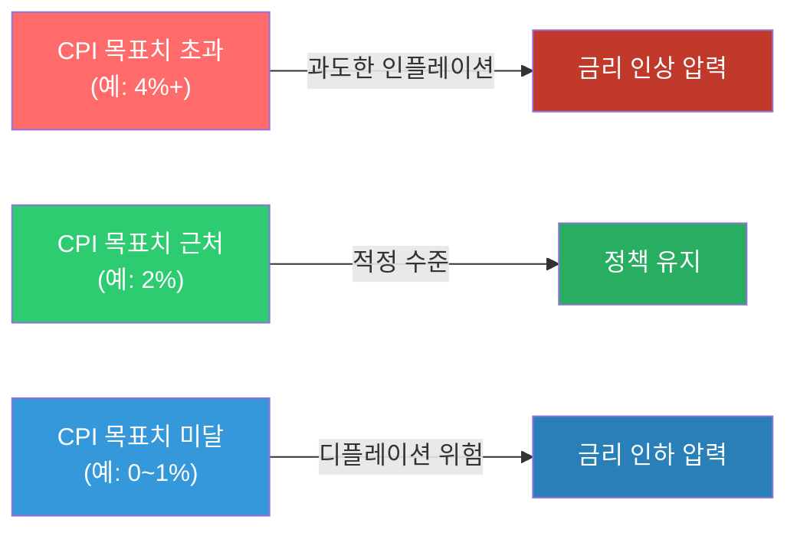


**PPI (Producer Price Index, 생산자물가지수)**

기업이 생산·판매하는 상품의 가격 변화를 측정합니다. CPI보다 **선행성**이 있어 미래 물가를 예측하는 데 사용됩니다.

**PPI → CPI 파급 경로**

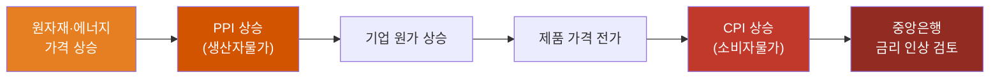


### 2. 유가(WTI, 브렌트유) 분석

> 📖 **Wikipedia**: [서부 텍사스 원유](https://ko.wikipedia.org/wiki/서부_텍사스_원유) · [브렌트유](https://ko.wikipedia.org/wiki/브렌트유) · [석유수출국기구](https://ko.wikipedia.org/wiki/석유수출국기구)

**WTI vs 브렌트유**

| 구분 | WTI (West Texas Intermediate) | 브렌트유 (Brent Crude) |
|------|-------------------------------|------------------------|
| 원산지 | 미국 텍사스 | 북해 |
| 기준 시장 | NYMEX (뉴욕) | ICE (런던) |
| 특징 | 미국 기준 원유, 경질유 | 글로벌 기준 원유 (세계 원유 70%+ 기준) |
| 가격 차이 | 보통 WTI가 $1~3 저렴 | — |


**유가 상승 시 경제 파급 경로**

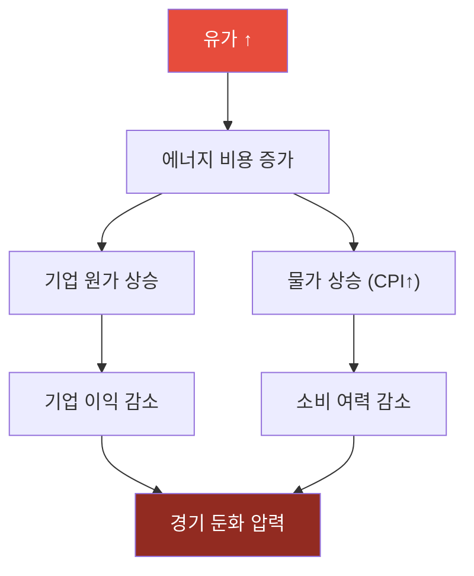

**유가 하락 시 경제 파급 경로**

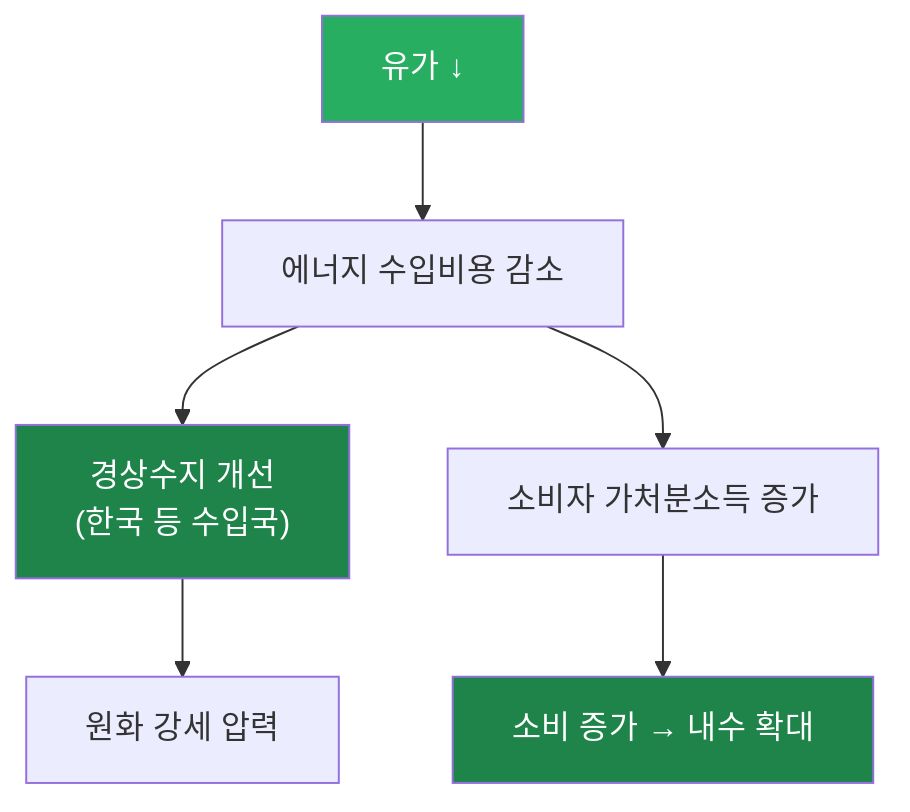

**산업별 유가 영향**

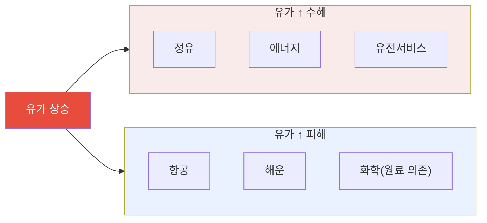


#### 위의 예시 실행 시
```
(.venv) root@DESKTOP-CLQV18N:/home/ubuntu/investment-analysis/test# python3 0201.py
[*********************100%***********************]  1 of 1 completed
Traceback (most recent call last):
  File "/home/ubuntu/investment-analysis/test/0201.py", line 10, in <module>
    print(f"최근 종가: ${oil.iloc[-1]:.2f}/배럴")
                        ^^^^^^^^^^^^^^^^^^
TypeError: unsupported format string passed to Series.__format__
```
#### 오류 해결 하세요.


### 3. 환율과 주가의 관계

> 📖 **Wikipedia**: [환율](https://ko.wikipedia.org/wiki/환율) · [외환시장](https://ko.wikipedia.org/wiki/외환시장)

**환율의 기본 개념**

환율은 두 통화의 교환 비율입니다. 원/달러 환율이 1,350원이라면, 달러 1개를 사려면 1,350원이 필요하다는 뜻입니다.

**원화 약세(환율 ↑) 파급 경로**

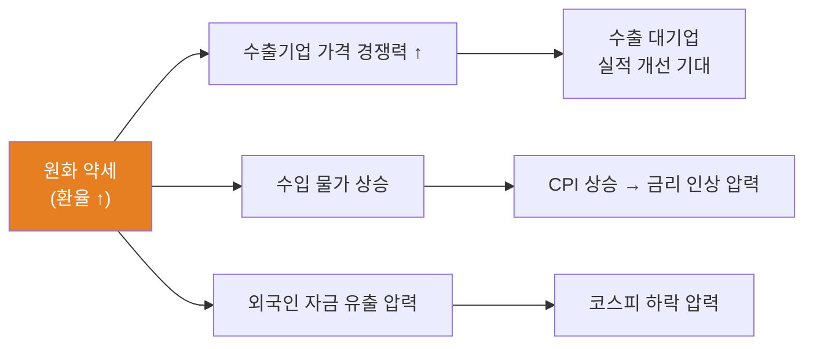

**원화 강세(환율 ↓) 파급 경로**

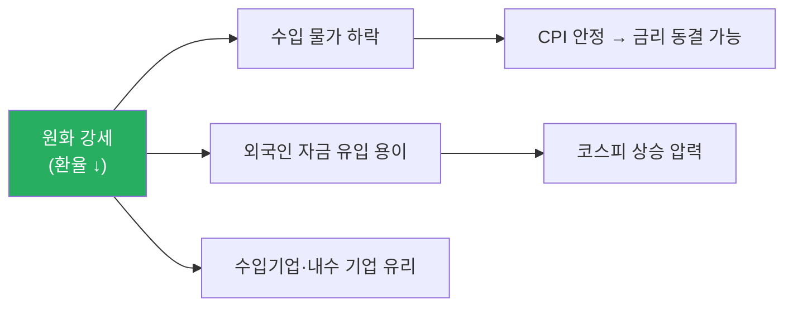

**코스피와 환율의 상호작용**

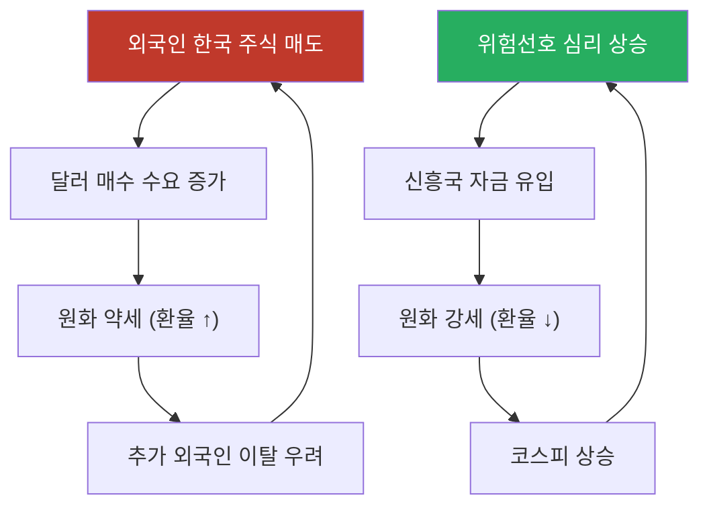


### 3-1. 외국인의 주가상승 신호

> 📖 **Wikipedia**: [외국인 투자자](https://ko.wikipedia.org/wiki/외국인_투자자) · [코스피](https://ko.wikipedia.org/wiki/코스피)

한국 주식시장에서 **외국인 투자자**는 코스피 시가총액의 약 30~35%를 차지하는 핵심 수급 세력입니다. 외국인의 순매수·순매도 동향은 주가 방향의 중요한 선행 지표로 활용됩니다.

**외국인 순매수가 주가 상승 신호로 해석되는 구조**

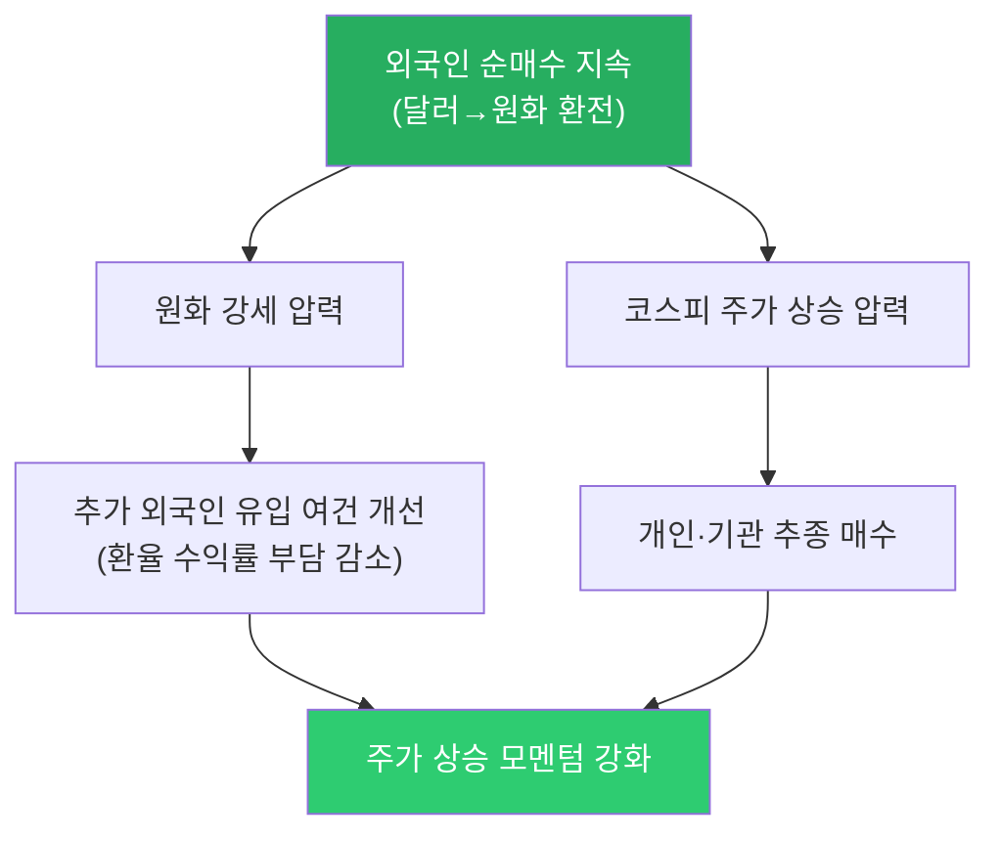

**외국인 주가상승 신호 체크 포인트**

| 신호 | 확인 방법 | 신뢰도 |
|------|---------|--------|
| **5일 이상 연속 순매수** | KRX 투자자별 매매동향 | ★★★★★ |
| **외국인 보유비율 지속 증가** | data.krx.co.kr 종목별 외국인 보유 현황 | ★★★★☆ |
| **원화 강세 동반** | USD/KRW 환율 하락 추세 | ★★★☆☆ |
| **대형주 중심 매수** | 코스피200 핵심 종목 집중 매수 | ★★★★☆ |
| **거래대금 동반 증가** | 순매수 + 거래대금 급증 | ★★★★☆ |

**외국인 매수 vs 매도 시 시장 반응 비교**

| 외국인 동향 | 환율 영향 | 주가 영향 | 투자자 대응 |
|------------|---------|---------|-----------|
| **대규모 순매수** | 원화 강세 (환율 ↓) | 코스피 상승 압력 | 비중 확대 검토 |
| **5일 이상 연속 순매수** | 원화 강세 지속 | 강한 상승 모멘텀 | 모멘텀 추종 전략 |
| **대규모 순매도** | 원화 약세 (환율 ↑) | 코스피 하락 압력 | 리스크 점검·손절 기준 확인 |
| **연속 순매도** | 원화 약세 심화 | 추가 이탈 악순환 가능 | 방어 포지션 검토 |


> ⚠️ **주의사항**: 외국인 순매수가 항상 주가 상승으로 이어지지는 않습니다. 파생상품 헤지, 인덱스 리밸런싱, 배당 차익거래 목적의 매수는 주가 상승 신호로 보기 어렵습니다. **순매수의 지속성, 대상 종목, 환율 동향, 거래대금**을 종합해 판단해야 합니다.

---

### 4. 실업률, GDP 성장률 지표 해석

> 📖 **Wikipedia**: [실업률](https://ko.wikipedia.org/wiki/실업률) · [국내총생산](https://ko.wikipedia.org/wiki/국내총생산) · [경기침체](https://ko.wikipedia.org/wiki/경기침체)

**GDP 성장률 (Gross Domestic Product Growth Rate)**

GDP는 일정 기간 국내에서 생산된 모든 재화·서비스의 시장 가치 합계입니다.

- **성장률 = (금기 GDP - 전기 GDP) / 전기 GDP × 100**
- 분기별 발표 (QoQ: 전분기 대비, YoY: 전년 동기 대비)

**GDP 성장률 구간별 신호**

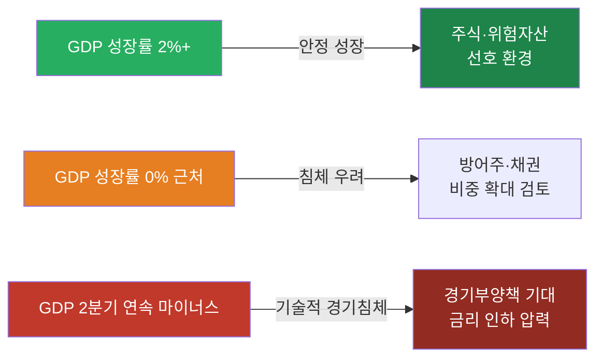


**실업률 (Unemployment Rate)**

경제활동인구 중 일할 의사가 있으나 직업이 없는 사람의 비율입니다.

**실업률 신호와 시장 반응**

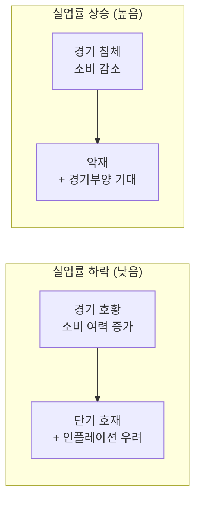


**미국 고용지표 발표 순서**

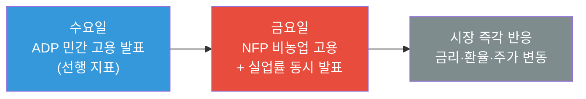

| 지표 | 발표 시기 | 핵심 수치 |
|------|-----------|-----------|
| 비농업 고용(NFP) | 매월 첫째 금요일 | 전월 대비 증감 인원 |
| 실업률 | NFP 동시 발표 | % |
| ADP 민간 고용 | NFP 발표 2일 전 수요일 | 선행 지표 |

### 5. 실습: 주요 경제지표 데이터 수집 및 상관관계 분석

이번 실습은 **시장 데이터만 빠르게 확인하는 yfinance 버전**과 **공식 경제통계 API를 함께 쓰는 확장 버전**으로 나눕니다. 최종 산출물은 `macro_correlation.csv`, `macro_correlation.png`, `macro_rolling_corr.png`, `macro_report.md`입니다.

---

#### 5-1. 실습 목표와 분석 질문

**실습 목표**

1. CPI, PPI, GDP, 실업률, 금리, 유가, 환율, 주가지수 데이터를 수집합니다.
2. 일별·월별·분기별로 다른 데이터 빈도를 월별 기준으로 맞춥니다.
3. 수준값(level), 변화율(return), 전년동월비(YoY)를 구분해 상관관계를 계산합니다.
4. 전체 기간 상관관계뿐 아니라 12개월 롤링 상관관계와 선행·후행 관계를 확인합니다.
5. 웹앱 API와 연결할 수 있는 데이터 구조와 화면 구성을 설계합니다.

**분석 질문 예시**

| 질문 | 필요한 지표 | 분석 방법 |
|---|---|---|
| 유가 상승은 물가 상승과 함께 움직였는가? | WTI, CPI, PPI | 월별 YoY 상관계수, 3개월 시차 상관 |
| 달러 강세는 주가지수에 부정적인가? | 달러인덱스, USD/KRW, S&P500, KOSPI | 월간 수익률 상관계수 |
| 금리 상승기에 금 가격은 약했는가? | 10년물 금리, 금, 달러인덱스 | 산점도, 롤링 상관 |
| 경기 둔화 신호와 주식시장은 언제 연결되는가? | 실업률, GDP, 장단기금리차, S&P500 | 분기/월별 리샘플링, 시차 상관 |

---

#### 5-2. 데이터 출처와 가입/키 발급

실습에서는 `yfinance`로 빠르게 시작한 뒤, 공식 API를 하나씩 붙이는 순서를 권장합니다.

| 출처 | 주요 지표 | 인증 | 실습 용도 |
|---|---|---|---|
| [Yahoo Finance/yfinance](https://pypi.org/project/yfinance/) | WTI, 금, 달러인덱스, S&P500, KOSPI, 환율, 미국채 | 별도 키 없음 | 빠른 시장 데이터 실습 |
| [FRED](https://fred.stlouisfed.org/) | CPI, PPI, GDP, 실업률, 금리, 스프레드 | API Key 권장 | 미국 거시지표 통합 수집 |
| [BLS Public Data API](https://www.bls.gov/bls/api_features.htm) | CPI, PPI, 실업률, 고용 | 공개 API, 등록키 선택 | 미국 노동·물가 원천 확인 |
| [BEA API](https://www.bea.gov/open-data) | GDP, 개인소비, 소득, 기업이익 | API Key 필요 | 미국 국민계정 원천 확인 |
| [EIA API](https://www.eia.gov/opendata/documentation.php) | WTI, Brent, 에너지 재고·수급 | API Key 필요 | 유가 원천 데이터 보강 |
| [한국은행 ECOS](https://ecos.bok.or.kr/) | 기준금리, 환율, GDP, CPI, 시장금리 | API Key 필요 | 한국 거시지표 수집 |
| [KOSIS OpenAPI](https://kosis.kr/openapi/devGuide/devGuide_0201List.do) | 소비자물가, 실업률, 산업활동 | API Key 필요 | 통계청 공식 통계 수집 |

`.env`에는 아래처럼 키를 저장합니다. 키가 없어도 yfinance와 일부 공개 API 실습은 가능합니다.

```bash
FRED_API_KEY=발급받은_FRED_KEY
BLS_API_KEY=선택사항_BLS_KEY
BEA_API_KEY=발급받은_BEA_KEY
EIA_API_KEY=발급받은_EIA_KEY
BOK_API_KEY=발급받은_ECOS_KEY
KOSIS_API_KEY=발급받은_KOSIS_KEY
```

**추가 패키지**

현재 repo의 기본 패키지에 더해, 아래 패키지를 설치하면 실습 코드를 그대로 실행하기 쉽습니다.

```bash
pip install requests seaborn plotly statsmodels openpyxl
```

---

#### 5-3. 표준 데이터 스키마

출처가 달라도 아래 구조로 맞춰 두면 FastAPI, CSV, 차트, 보고서에서 재사용하기 쉽습니다.

| 컬럼 | 예시 | 설명 |
|---|---|---|
| `date` | `2024-12-31` | 관측일 |
| `country` | `US`, `KR` | 국가 |
| `source` | `FRED`, `BLS`, `YFINANCE` | 데이터 출처 |
| `series_id` | `CPIAUCSL`, `CL=F` | 원천 코드 |
| `series_name` | `US CPI`, `WTI` | 표시명 |
| `frequency` | `D`, `M`, `Q` | 원천 주기 |
| `value` | `4.23` | 원천 값 |
| `unit` | `%`, `index`, `USD` | 단위 |
| `transform` | `level`, `return`, `yoy` | 분석용 변환 방식 |

---

#### 5-4. 1단계: yfinance로 빠른 시장 데이터 수집

먼저 일별 금융시장 데이터를 수집합니다. 이 단계는 API Key가 없어도 실행할 수 있어 실습 진입점으로 좋습니다.


**주의할 점**

- `^TNX`는 미국 10년물 금리 자체가 아니라 Yahoo Finance 표기상 10배 조정된 수익률처럼 보일 수 있으므로, 화면 표시 전에 단위와 스케일을 확인합니다.
- `KRW=X`는 USD/KRW 환율입니다. 값이 오르면 원화 약세입니다.
- 선물 가격(`CL=F`, `GC=F`)은 롤오버 영향이 있어 장기 분석에서는 공식 현물 또는 연속선물 정의를 확인합니다.

---

#### 5-5. 2단계: FRED 공식 거시지표 수집

FRED는 CPI, PPI, GDP, 실업률, 금리, 스프레드를 한 번에 가져오기 좋습니다.

| 지표 | FRED 코드 | 주기 | 변환 권장 |
|---|---|---|---|
| 소비자물가지수 | `CPIAUCSL` | 월별 | YoY |
| 생산자물가지수 | `PPIACO` | 월별 | YoY |
| 실업률 | `UNRATE` | 월별 | level, 차분 |
| 실질 GDP | `GDPC1` | 분기별 | QoQ 연율 또는 YoY |
| 연방기금금리 | `FEDFUNDS` | 월별 | level |
| 미국 10년물 국채 | `DGS10` | 일별 | 월말 또는 월평균 |
| 장단기 스프레드 | `T10Y2Y` | 일별 | 월평균 |


---

#### 5-6. 3단계: BLS, BEA, EIA 원천 API 보강

FRED만으로도 실습은 가능하지만, “공식 원천에서 직접 수집한다”는 감각을 익히려면 BLS, BEA, EIA 호출도 한 번씩 해봅니다.

**BLS: CPI·실업률 직접 조회**


**BEA: 분기 GDP 조회**


**EIA: WTI 현물 가격 조회**

EIA API v2는 데이터셋별 라우트와 파라미터가 다를 수 있으므로, 먼저 문서의 API Browser에서 WTI 시리즈 라우트를 확인합니다. 빠른 실습에서는 FRED의 `DCOILWTICO` 또는 yfinance `CL=F`를 쓰고, 보고서에는 원천 차이를 적습니다.


---

#### 5-7. 4단계: 빈도 통일과 분석용 변환

상관관계 분석에서 가장 흔한 실수는 일별 금융시장 데이터와 월별/분기별 경제지표를 그대로 붙이는 것입니다. 아래처럼 월말 또는 월평균 기준으로 맞춥니다.


**변환 선택 원칙**

| 데이터 | 권장 변환 | 이유 |
|---|---|---|
| 주가지수, 유가, 금, 환율 | 월간 수익률 | 가격 레벨보다 변화율 비교가 자연스러움 |
| CPI, PPI | YoY 또는 MoM | 물가의 추세 변화 확인 |
| 실업률 | level 또는 차분 | 상승/하락 방향 자체가 중요 |
| GDP | QoQ, YoY | 분기 지표이므로 월별 분석 시 보간/ffill 주의 |
| 금리 | level 또는 차분 | 금리 레벨과 변화폭 모두 의미 있음 |

---

#### 5-8. 5단계: 상관관계 히트맵


**해석 기준**

| 상관계수 | 해석 |
|---|---|
| `0.7 ~ 1.0` | 강한 양의 관계 |
| `0.3 ~ 0.7` | 중간 양의 관계 |
| `-0.3 ~ 0.3` | 뚜렷한 선형 관계 약함 |
| `-0.7 ~ -0.3` | 중간 음의 관계 |
| `-1.0 ~ -0.7` | 강한 음의 관계 |

상관관계는 인과관계가 아닙니다. 예를 들어 유가와 CPI가 같이 올랐더라도, 유가가 CPI를 전부 설명한다는 뜻은 아닙니다.

---

#### 5-9. 6단계: 롤링 상관관계와 시차 상관관계

전체 기간 상관계수 하나만 보면 국면 변화를 놓칩니다. 12개월 롤링 상관관계로 관계가 언제 강해졌는지 확인합니다.


시차 상관관계는 “A가 먼저 움직이고 B가 뒤따르는가?”를 보는 기초 도구입니다.


`lag_months > 0`에서 상관관계가 높으면 `x`가 먼저 움직인 뒤 `y`가 뒤따랐을 가능성을 검토합니다. 단, 통계적 검정과 경제적 해석을 함께 해야 합니다.

---

#### 5-10. 7단계: 산점도와 회귀선


위 코드의 x축은 FRED 10년물 금리의 월간 변화폭입니다. yfinance의 `US10Y_ret`를 쓰면 금리 자체의 변화율이 되므로, 금리 분석에서는 보통 `US10Y_FRED_diff`처럼 금리 차분을 쓰는 편이 더 자연스럽습니다.

---

#### 5-11. 웹앱 실습 연계

현재 웹앱에는 거시경제현황 API가 있으므로, 이 실습을 다음 구조로 확장할 수 있습니다.

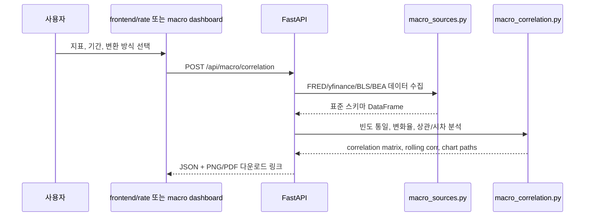

**추천 API 설계**

| 엔드포인트 | 메서드 | 역할 |
|---|---|---|
| `/api/macro/indicators` | `GET` | 사용 가능한 지표 목록과 출처 반환 |
| `/api/macro/history` | `POST` | 선택 지표의 표준화된 시계열 반환 |
| `/api/macro/correlation` | `POST` | 상관계수 행렬과 히트맵 생성 |
| `/api/macro/rolling-correlation` | `POST` | 두 지표의 롤링 상관계수 반환 |
| `/api/macro/lag-correlation` | `POST` | 선행·후행 상관관계 계산 |
| `/api/macro/report` | `POST` | Markdown/PDF 리포트 생성 |

**요청 예시**


**응답 예시**


---

#### 5-12. 리포트 작성 템플릿

실습 결과는 아래 형식으로 `macro_report.md`에 정리합니다.

```markdown
# 주요 경제지표 상관관계 분석 리포트

## 1. 분석 조건


- 기간:
- 사용 데이터:
- 데이터 출처:
- 빈도 변환:
- 결측 처리:

## 2. 주요 결과


- 가장 강한 양의 상관:
- 가장 강한 음의 상관:
- 롤링 상관관계가 크게 바뀐 시점:
- 시차 상관관계에서 확인한 선행 후보:

## 3. 해석


- 물가와 유가:
- 달러와 주식:
- 금리와 주식:
- 실업률/GDP와 위험자산:

## 4. 한계


- 상관관계는 인과관계가 아님
- 월별/분기별 데이터 정렬 방식에 따라 결과가 달라질 수 있음
- 선물/현물/지수 데이터 정의 차이를 확인해야 함
```

---

#### 5-13. 실습 체크리스트

- [ ] `macro_market_daily.csv` 생성
- [ ] `macro_fred_raw.csv` 생성
- [ ] `macro_analysis_monthly.csv` 생성
- [ ] `macro_correlation.csv` 생성
- [ ] `macro_correlation.png` 생성
- [ ] `macro_rolling_corr.png` 생성
- [ ] `macro_lag_correlation.png` 생성
- [ ] `macro_report.md` 작성
- [ ] 데이터 출처, 조회일, 결측 처리 방식 기록

---

## 해보기 활동


1. FRED에서 `CPIAUCSL`, `PPIACO`, `UNRATE`, `GDPC1`, `DGS10`, `T10Y2Y`를 수집하고 각 지표의 주기와 단위를 표로 정리하세요.
2. yfinance에서 `CL=F`, `DX-Y.NYB`, `GC=F`, `^GSPC`, `^KS11`, `KRW=X`를 수집해 월별 수익률 데이터로 변환하세요.
3. 유가(`WTI_ret`)와 CPI(`US_CPI_yoy`)의 전체 기간 상관계수와 12개월 롤링 상관계수를 비교하세요.
4. 달러인덱스와 S&P500, USD/KRW와 KOSPI의 상관계수를 비교하고 한국 시장에서 환율 변수가 더 민감했는지 해석하세요.
5. 장단기금리차(`T10Y2Y`)와 S&P500의 시차 상관관계를 계산해, 어느 lag에서 절댓값이 가장 큰지 확인하세요.
6. 상관계수가 높은 지표쌍 2개를 골라 산점도와 회귀선을 그리고, 경제적 해석과 한계를 각각 3문장으로 정리하세요.
7. 위 결과를 `macro_report.md` 형식으로 정리하고, 웹앱에 `/api/macro/correlation`을 추가한다면 필요한 입력값과 출력값을 설계하세요.

---

# 소부장이란?

**소부장**은 ‘소재·부품·장비’의 줄임말로, 반도체·배터리·디스플레이·자동차 등 한국 제조업의 핵심 기반을 뜻합니다.  
특히 2019년 일본의 반도체 소재 수출 규제 이후 기술 자립과 공급망 안정화를 위해 국가적으로 강조된 개념입니다.

---

## 📌 소부장의 의미
- **소재**: 제품을 만드는 원재료 (예: 실리콘 웨이퍼, OLED 발광 소재).
- **부품**: 소재를 가공해 완제품에 들어가는 기능 단위 (예: 카메라 모듈, 메모리 반도체).
- **장비**: 소재·부품을 생산·조립하는 기계 및 설비 (예: 반도체 노광 장비, 디스플레이 증착 장비).

---

## ⚙️ 왜 중요한가?
- 산업 경쟁력 강화: 핵심 소재·부품을 안정적으로 공급 → 완제품 품질 향상
- 경제 안보: 해외 의존도를 줄여 공급망 위기 대응
- 성장 동력: 첨단 기술 확보 시 자체적으로 수출 산업으로 발전 가능

---

## 🔑 소부장과 한국 산업
- 반도체 소부장: 삼성전자·SK하이닉스에 장비·소재 납품 (EUV 공정 장비, HBM용 소재)
- 배터리 소부장: 전기차 배터리용 양극재·음극재·전해액
- 디스플레이 소부장: OLED 패널용 필름, 증착 장비

---

## 📊 소부장 관련 기업 예시

| 기업 | 산업군 | 주요 제품 |
|---|---|---|
| 삼성전자 | 반도체 | 메모리, 칩셋 |
| 엘앤에프 | 소재 | 2차전지 양극재 |
| 원익IPS | 장비 | 반도체 제조 장비 |
| 에코프로비엠 | 소재 | 전기차 배터리 소재 |
| 한화에어로스페이스 | 부품 | 항공기·방산 부품 |

---

## 🚨 투자·경제적 관점
- 정부 지원: R&D 세제 혜택, 국책 과제 참여 기업에 자금 지원
- 투자 전략: 개별 종목 대신 소부장 ETF (예: KODEX 반도체소부장, TIGER 소부장) 활용 가능
- 위험 요소: 대기업보다 변동성 큼 → 분할 매수 권장

---

# 거시경제 상황 분석 실습


>
> 📝 **한자 병기 및 어원 사전**: 이 문서에 등장하는 용어의 한자·어원·일제강점기 유래는 → [voca.md](voca.md)

## 오늘 배울 것


- 경기 사이클(Expansion, Peak, Contraction, Trough) 이해
- 경기 선행/동행/후행 지표
- 통화량(M1, M2)과 유동성 분석
- 실습: 거시경제 대시보드 구성 및 현황 분석

---

## 🔗 참고 사이트 & 데이터 원천


> 이 문서(거시경제 상황 분석·경기사이클·통화량)의 실습에 필요한 공식 데이터 출처와 참고 사이트입니다. ⚿ 는 API 키 또는 승인이 필요한 항목입니다.

### 📊 국내 공식 데이터

| 기관 | URL | API 키 | 제공 데이터 |
|------|-----|--------|-------------|
| 한국은행 ECOS | <https://ecos.bok.or.kr> | ⚿ 필요 | M1/M2 통화량, 경기종합지수, 기준금리 |
| 통계청 KOSIS | <https://kosis.kr> | ⚿ 권장 | GDP 성장률, 고용, 산업생산지수 |
| 기획재정부 경제통계 | <https://www.moef.go.kr> | 불필요(웹 조회) | 경기동향·재정 현황 |
| 공공데이터포털 | <https://www.data.go.kr> | ⚿ 필요 | 경기선행·동행·후행지수 API |
| 금융위원회 | <https://www.fsc.go.kr> | 불필요(웹 조회) | 금융안정 보고서, 거시건전성 지표 |
| 금융감독원(FSS) | <https://www.fss.or.kr> | 불필요(웹 조회) | 거시 금융 감독 통계 |

### 🌍 해외 공식 데이터

| 기관 | URL | API 키 | 제공 데이터 |
|------|-----|--------|-------------|
| FRED (St. Louis Fed) | <https://fred.stlouisfed.org> | ⚿ 권장 | M1/M2, 경기선행지수, 실업률, ISM 지수 |
| OECD Composite Leading Indicators | <https://data.oecd.org> | 불필요 | 국가별 경기선행지수(CLI) |
| World Bank | <https://data.worldbank.org> | 불필요 | GDP·성장률·국제수지 장기 시계열 |
| IMF Data (WEO) | <https://www.imf.org/en/Data> | 불필요 | 세계경제전망, 국가별 경기사이클 |
| Conference Board (미국) | <https://www.conference-board.org> | 불필요(웹 조회) | 미국 경기선행지수(LEI) |

### 📈 차트 & 뉴스 참고

| 분류 | 사이트 | URL | 활용 용도 |
|------|--------|-----|-----------|
| 차트 플랫폼 | TradingView | <https://www.tradingview.com> | 경기지표·시장 종합 차트 |
| 차트 플랫폼 | Investing.com | <https://www.investing.com> | 경제 캘린더·경기지표 발표 일정 |
| 금융 포탈 | 네이버 금융 | <https://finance.naver.com> | 국내 경기·지수 현황 |
| 금융 미디어 | 머니투데이 방송(MTN) | <https://mtn.co.kr> | 경기사이클·통화량 뉴스 해설 |
| 금융 미디어 | 한국경제TV(WOW TV) | <https://www.wowtv.co.kr> | 거시경제 분석 방송 |
| 연구기관 | 한국개발연구원(KDI) | <https://www.kdi.re.kr> | 경기 전망·분석 보고서 |
| 연구기관 | 한국금융연구원(KIF) | <https://www.kif.re.kr> | 금융·거시경제 연구 보고서 |

---


### 1. 경기 사이클(Expansion, Peak, Contraction, Trough) 이해

> 📖 **Wikipedia**: [경기 순환](https://ko.wikipedia.org/wiki/경기_순환) · [경기침체](https://ko.wikipedia.org/wiki/경기침체)

경기는 끊임없이 순환합니다. 이 사이클을 이해하면 **지금이 어느 국면인지** 파악해 투자 전략을 조정할 수 있습니다.

**4단계 경기 사이클**

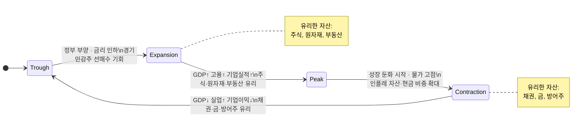

**국면별 투자 전략 요약**

| 국면 | 경제 특징 | 유리한 자산 |
|------|-----------|-------------|
| **Expansion(확장)** | GDP↑, 고용↑, 기업실적↑ | 주식, 원자재, 부동산 |
| **Peak(정점)** | 성장 둔화 시작, 물가 고점 | 인플레 자산, 현금 비중 확대 |
| **Contraction(수축)** | GDP↓, 실업↑, 기업이익↓ | 채권, 금, 방어주 |
| **Trough(저점)** | 침체 바닥, 정부 부양 시작 | 경기민감주 선매수 기회 |


**경기 사이클별 섹터 로테이션**

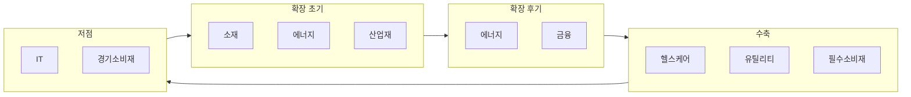

| 국면 | 유리한 섹터 | 불리한 섹터 |
|------|-------------|-------------|
| 확장 초기 | 소재, 에너지, 산업재 | 유틸리티, 필수소비재 |
| 확장 후기 | 에너지, 금융 | 기술, 소비재 |
| 수축 | 헬스케어, 유틸리티, 필수소비재 | 에너지, 소재, 금융 |
| 저점 | IT, 경기소비재 | 필수소비재 |


### 2. 경기 선행/동행/후행 지표

> 📖 **Wikipedia**: [경기종합지수](https://ko.wikipedia.org/wiki/경기종합지수) · [구매관리자지수](https://ko.wikipedia.org/wiki/구매관리자지수)

경기지표는 **언제 경기를 반영하는지**에 따라 세 가지로 나뉩니다.

**3종 지표의 시간 관계**

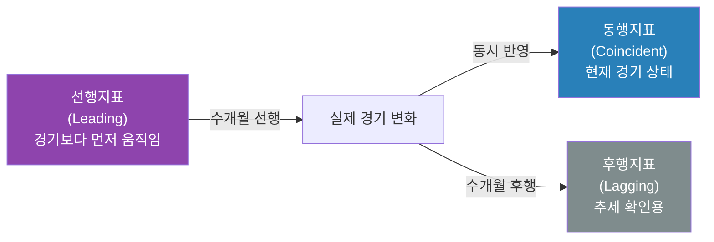

**선행지표 (Leading Indicators)**

경기보다 먼저 움직이는 지표 — 미래 경기를 예측하는 데 활용합니다.

| 지표 | 설명 |
|------|------|
| 주가지수 | 미래 기업 실적 기대를 반영 |
| 건축허가 건수 | 미래 건설투자 선행 |
| ISM 제조업 PMI | 기업 구매관리자 경기 전망 |
| 소비자 기대지수 | 향후 소비 의향 반영 |
| 장단기 금리 스프레드 | 역전 시 경기침체 신호 |

**장단기 금리 역전 → 경기침체 경로**

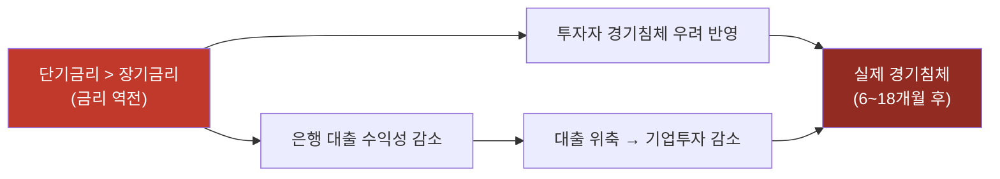


**동행지표 (Coincident Indicators)**

현재 경기 상황을 나타내는 지표입니다.

| 지표 | 설명 |
|------|------|
| GDP | 현재 경제 규모 |
| 산업생산지수 | 실제 생산량 현황 |
| 취업자 수 | 노동시장 실제 상태 |
| 소매판매 | 실제 소비 상황 |

**후행지표 (Lagging Indicators)**

경기 변화 후 나중에 반영되는 지표 — 추세 확인용입니다.

| 지표 | 설명 |
|------|------|
| 실업률 | 해고 후 한참 지나서 반영 |
| 대출 잔액 | 경기 이후 금융 반응 |
| CPI | 물가는 경기 후행 |


---

### https://www.data.go.kr/ 에서 아래 조건으로 API 사용 예시를 test 폴더에 py 소스로 만드세요.


### 예시는 test 폴더에 0301.py 로 있습니다. 참고하세요.

### 아래 이미지와 같이 본인의 이용 현황 중 API 이용 건을 10회 이상으로 하여, 화면 캡쳐 및 공유 하세요.


---

### 3. 통화량(M1, M2)과 유동성 분석

> 📖 **Wikipedia**: [통화량](https://ko.wikipedia.org/wiki/통화량) · [유동성](https://ko.wikipedia.org/wiki/유동성_(경제학)) · [양적 완화](https://ko.wikipedia.org/wiki/양적_완화)

**통화량의 종류**

중앙은행은 얼마나 많은 돈이 경제에 돌아다니는지를 단계별로 측정합니다.

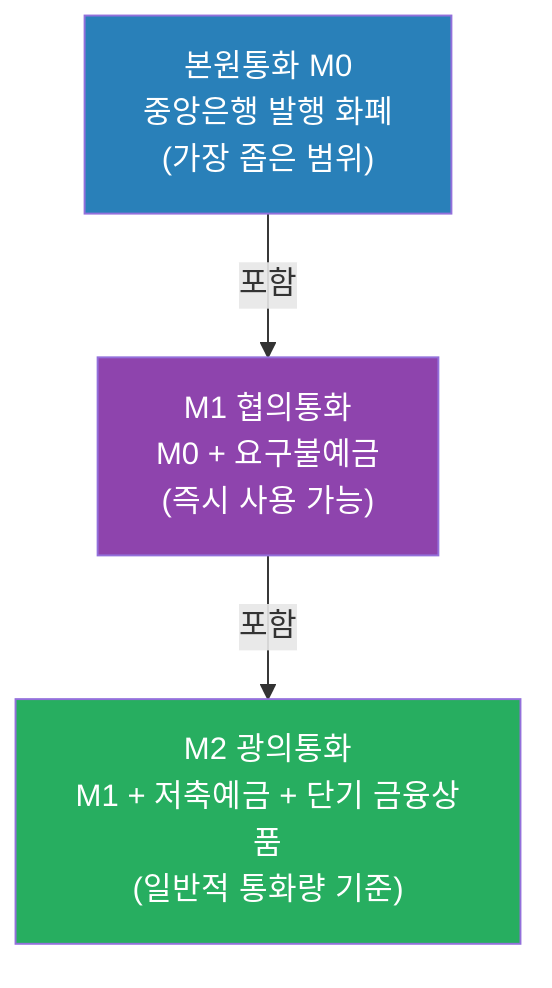

| 구분 | 포함 내용 | 특징 |
|------|-----------|------|
| **본원통화(M0)** | 중앙은행이 발행한 화폐 | 가장 좁은 범위 |
| **M1 (협의통화)** | 현금 + 요구불예금 | 즉시 사용 가능한 돈 |
| **M2 (광의통화)** | M1 + 저축예금 + 단기 금융상품 | 일반적인 통화량 기준 |


**양적완화(QE)와 양적긴축(QT) 파급 경로**

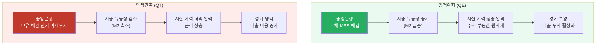


**M2 증가율과 자산 시장 관계**

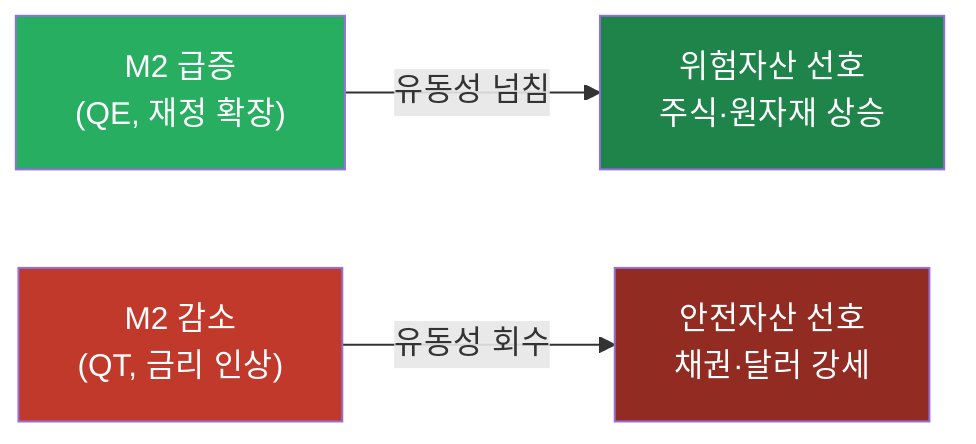

### 4. 실습: 거시경제 대시보드 구성 및 현황 분석

이번 실습은 단순한 6개 차트 모음에서 출발해, **경기국면 판정·위험 경보·시나리오 분석·웹 대시보드·리포트 출력**까지 확장할 수 있는 형태로 고도화합니다.

---

#### 4-1. 완성 목표

최종 산출물은 아래와 같습니다.

| 산출물 | 파일/화면 | 설명 |
|---|---|---|
| 원천 데이터 | `macro_dashboard_raw.csv` | yfinance/FRED/ECOS 등에서 수집한 원자료 |
| 분석 데이터 | `macro_dashboard_features.csv` | 변화율, 이동평균, z-score, 스프레드, 경기 점수 |
| 이미지 대시보드 | `macro_dashboard.png` | 주요 지표 6~9개 패널 차트 |
| 신호 테이블 | `macro_signal_table.csv` | 선행/동행/후행 지표별 상태와 점수 |
| 리포트 | `macro_dashboard_report.md` | 현재 경기국면 해석, 위험요인, 투자 아이디어 |
| 웹 API 설계 | `/api/macro/dashboard` | 대시보드 데이터·차트·경보 반환 |

**핵심 질문**

1. 지금은 확장, 정점, 수축, 저점 중 어느 국면에 가까운가?
2. 선행지표는 경기 둔화 또는 회복을 먼저 말하고 있는가?
3. 금리, 유가, 달러, VIX 중 위험 신호가 강한 것은 무엇인가?
4. 유동성(M2)과 위험자산(S&P500/KOSPI)은 같은 방향으로 움직이는가?
5. 대시보드의 결론을 투자 행동으로 연결한다면 무엇을 줄이고 무엇을 늘릴 것인가?

---

#### 4-2. 대시보드 지표 설계

대시보드는 지표를 많이 넣는 것보다 **선행·동행·후행·시장심리·유동성**으로 역할을 나누는 것이 중요합니다.

| 분류 | 지표 | 예시 코드/티커 | 주기 | 해석 포인트 |
|---|---|---|---|---|
| 선행 | 장단기 금리차 | FRED `T10Y2Y`, `T10Y3M` | 일별 | 음수면 경기침체 경보 |
| 선행 | VIX | yfinance `^VIX`, FRED `VIXCLS` | 일별 | 급등 시 위험회피 심리 |
| 선행 | 주가지수 | `^GSPC`, `^KS11` | 일별 | 미래 이익 기대 반영 |
| 선행 | 소비심리 | FRED `UMCSENT` | 월별 | 소비 둔화/회복 확인 |
| 동행 | 산업생산 | FRED `INDPRO` | 월별 | 현재 생산활동 |
| 동행 | 고용 | FRED `PAYEMS` | 월별 | 현재 경기 체력 |
| 후행 | 실업률 | FRED `UNRATE` | 월별 | 경기 악화 확인 |
| 후행 | CPI | FRED `CPIAUCSL` | 월별 | 물가 압력과 정책 제약 |
| 유동성 | M2 | FRED `M2SL` | 월별 | QE/QT, 유동성 환경 |
| 원자재 | WTI, 금 | `CL=F`, `GC=F` | 일별 | 인플레/위험회피 신호 |
| 환율 | 달러인덱스, USD/KRW | `DX-Y.NYB`, `KRW=X` | 일별 | 달러 유동성·외국인 수급 |

한국 중심 대시보드로 확장할 때는 ECOS/KOSIS에서 기준금리, 원/달러 환율, M2, CPI, 실업률, 수출입, 산업생산 코드를 찾아 같은 구조로 붙입니다.

---

#### 4-3. 환경 변수와 추가 패키지

빠른 실습은 `yfinance`만으로 가능하지만, 경기국면 판정을 고도화하려면 FRED API Key를 추가합니다.

```bash
FRED_API_KEY=발급받은_FRED_KEY
BOK_API_KEY=발급받은_ECOS_KEY
KOSIS_API_KEY=발급받은_KOSIS_KEY
```

```bash
pip install requests seaborn plotly statsmodels reportlab
```

---

#### 4-4. 1단계: 시장 데이터 대시보드 만들기

API Key 없이 바로 실행할 수 있는 기본 버전입니다.


---

#### 4-5. 2단계: 변화율·변동성·z-score 계산

대시보드는 단순 현재값보다 “최근 변화가 평소보다 큰가?”를 보여줘야 합니다.


**z-score 해석**

| z-score | 해석 |
|---|---|
| `2 이상` | 과열 또는 극단적 강세 |
| `1 ~ 2` | 평균보다 강함 |
| `-1 ~ 1` | 보통 범위 |
| `-2 ~ -1` | 평균보다 약함 |
| `-2 이하` | 극단적 약세 또는 스트레스 |

---

#### 4-6. 3단계: FRED로 경기·유동성 지표 추가

FRED 지표를 붙이면 시장 가격뿐 아니라 경기의 실제 체력까지 볼 수 있습니다.


---

#### 4-7. 4단계: 경기국면 점수화

아래 규칙은 학습용 예시입니다. 실제 운용에서는 기준값과 가중치를 검증해야 합니다.

| 항목 | 확장 신호 | 수축 신호 |
|---|---|---|
| 주식 | S&P500 6개월 수익률 `> 0` | S&P500 6개월 수익률 `< 0` |
| 변동성 | VIX `< 20` | VIX `> 25` |
| 금리차 | `T10Y2Y > 0` | `T10Y2Y < 0` |
| 물가 | CPI YoY 둔화 | CPI YoY 가속 |
| 고용 | 실업률 하락 | 실업률 상승 |
| 유동성 | M2 YoY 상승 | M2 YoY 둔화/감소 |


**점수 해석**

| 점수 | 국면 후보 | 대시보드 메시지 |
|---|---|---|
| `0~1` | 수축 | 위험자산 방어, 현금·채권·금 점검 |
| `2~3` | 저점/회복 | 경기민감주와 주식 비중 회복 검토 |
| `4` | 확장 | 주식·원자재 우호, 과열 지표 감시 |
| `5~6` | 정점/과열 | 인플레·금리·VIX 급등 위험 관리 |

---

#### 4-8. 5단계: 위험 경보 만들기

대시보드에는 사용자가 바로 볼 수 있는 경보가 필요합니다.


---

#### 4-9. 6단계: 고도화 대시보드 레이아웃

웹 화면은 차트를 많이 쌓기보다, 반복적으로 판단하기 쉬운 정보 구조가 좋아야 합니다.

```text
상단 컨트롤
  - 국가: US / KR / Global
  - 기간: 1Y / 3Y / 5Y / 10Y
  - 기준 빈도: D / M / Q
  - 보기 모드: 시장 / 경기 / 유동성 / 전체

1행: 현재 국면 요약
  - 경기국면 배지: Expansion, Peak, Contraction, Trough
  - Macro Score
  - 주요 경보 3개
  - 데이터 기준일

2행: KPI 카드
  - S&P500 6M
  - 10Y-2Y Spread
  - CPI YoY
  - Unemployment
  - M2 YoY
  - VIX

3행: 시계열 차트
  - 주식/금리/유가/달러/VIX
  - M2와 주가지수 비교
  - CPI와 금리 비교

4행: 분석 차트
  - 경기국면 점수 추이
  - 상관관계 히트맵
  - 롤링 상관관계
  - 시나리오별 시뮬레이션 비교

출력
  - CSV 다운로드
  - PNG 저장
  - Markdown/PDF 리포트 생성
```

---

#### 4-10. 웹앱/API 고도화 설계

현재 웹앱의 `/api/macro/realtime`, `/api/macro/simulation`을 아래처럼 확장합니다.

| 엔드포인트 | 메서드 | 역할 |
|---|---|---|
| `/api/macro/dashboard` | `POST` | 대시보드 전체 데이터, KPI, 경보 반환 |
| `/api/macro/cycle-score` | `POST` | 경기국면 점수와 국면 후보 반환 |
| `/api/macro/liquidity` | `POST` | M2, 금리, 주가지수 유동성 분석 |
| `/api/macro/alerts` | `POST` | 위험 경보만 빠르게 반환 |
| `/api/macro/dashboard/report` | `POST` | Markdown/PDF 리포트 생성 |

**요청 예시**


**응답 예시**


**권장 파일 구조**

```text
app
├── backend
│   ├── services
│   │   ├── macro_sources.py       # yfinance/FRED/ECOS/KOSIS 수집
│   │   ├── macro_features.py      # 변화율, z-score, 스프레드
│   │   ├── macro_cycle.py         # 경기국면 점수화
│   │   ├── macro_alerts.py        # 위험 경보 생성
│   │   └── macro_report.py        # 리포트 생성
│   └── main.py
└── frontend
    └── js
        └── views
            └── macroDashboard.js
```

---

#### 4-11. 시뮬레이션 탭 고도화

`/api/macro/simulation`은 학습용으로 매우 좋습니다. 고도화 방향은 사용자가 경기 충격을 직접 조정하게 만드는 것입니다.

| 파라미터 | 예시 | 의미 |
|---|---|---|
| `n_days` | `504` | 시뮬레이션 기간 |
| `seed` | `42` | 재현 가능한 난수 |
| `inflation_shock` | `0.3` | 물가 충격 강도 |
| `rate_shock` | `0.2` | 금리 충격 강도 |
| `oil_shock` | `-0.15` | 유가 충격 |
| `risk_aversion` | `0.4` | VIX/주가 변동성 확대 |


---

#### 4-12. 현황 분석 리포트 템플릿

`macro_dashboard_report.md`는 아래 형식으로 작성합니다.

```markdown
# 거시경제 대시보드 현황 분석

## 1. 분석 조건


- 기준일:
- 기간:
- 데이터 출처:
- 사용 지표:
- 결측 처리:

## 2. 현재 경기국면


- Macro Score:
- 추정 국면:
- 근거 지표:

## 3. 선행/동행/후행 지표 점검


- 선행지표:
- 동행지표:
- 후행지표:

## 4. 위험 경보


- 금리:
- 물가:
- 유동성:
- 변동성:
- 환율:

## 5. 투자 관점 요약


- 주식:
- 채권:
- 원자재:
- 달러/환율:
- 현금 비중:

## 6. 한계


- 점수화 규칙은 학습용이며 검증이 필요함
- 시장 데이터와 공식 통계의 발표 시차가 다름
- 국면 판정은 확률적 판단이며 단정이 아님
```

---

#### 4-13. 실습 체크리스트

- [ ] `macro_dashboard_raw.csv` 생성
- [ ] `macro_fred_dashboard.csv` 생성
- [ ] `macro_dashboard_features.csv` 생성
- [ ] `macro_signal_table.csv` 생성
- [ ] `macro_dashboard.png` 생성
- [ ] 경기국면 점수화 규칙 6개 이상 작성
- [ ] 위험 경보 규칙 4개 이상 작성
- [ ] `/api/macro/dashboard` 요청/응답 설계
- [ ] `macro_dashboard_report.md` 작성

---

## 웹앱 실습 연계


이 챕터의 개념은 Python Quant Lab 웹앱의 두 거시경제 탭으로 직접 체험할 수 있습니다.

### 거시경제현황 1 (실시간) — `/api/macro/realtime`

실제 Yahoo Finance 데이터를 이용해 선행·동행·후행 지표를 한 번에 조회합니다.

```mermaid
sequenceDiagram
    participant U as 사용자 (브라우저)
    participant JS as macroRealtime.js
    participant API as /api/macro/realtime
    participant YF as Yahoo Finance

    U->>JS: 선행지표 티커 선택 후 "조회"
    JS->>API: POST /api/macro/realtime<br/>{tickers: ["^TNX","^IRX","^VIX"], period: "2y"}
    API->>YF: yf.download(tickers, period="2y")
    alt 정상 응답
        YF-->>API: 금리 · VIX 시계열
        API-->>JS: {is_simulated: false, summary: {...}}
    else Rate-limited
        API-->>JS: {is_simulated: true, warning: "GBM 시뮬레이션 사용 중"}
    end
    JS-->>U: 차트 + 요약 테이블 렌더링
```

**경기 사이클 국면별 추천 티커 조합**

| 분석 목적 | tickers | period |
|---|---|---|
| 선행지표 모니터링 | `["^TNX", "^IRX", "^VIX", "^GSPC"]` | `"2y"` |
| 동행지표 확인 | `["^GSPC", "^KS11", "CL=F"]` | `"1y"` |
| 후행지표 추적 | `["^TNX", "GC=F", "KRW=X"]` | `"3y"` |
| QE/QT 영향 분석 | `["^GSPC", "GC=F", "^TNX", "DX-Y.NYB"]` | `"5y"` |

### 거시경제현황 2 (시뮬레이션) — `/api/macro/simulation`

GBM 4단계 경기 사이클 시뮬레이션으로 섹터 로테이션 전략을 연습합니다.

```mermaid
flowchart TD
    A["시뮬레이션 차트 분석"] --> B{"KOSPI·S&P\n방향은?"}
    B -->|상승 추세| C{"CPI(물가)\n수준은?"}
    B -->|하락 추세| D["수축기 또는 침체기\n→ 채권·금 비중 확대 검토"]
    C -->|낮음·안정| E["상승기(Expansion)\n→ 주식·원자재 선호"]
    C -->|높음·가속| F["과열기(Peak)\n→ 현금·인플레 자산 비중 확대"]
    D --> G{"WTI·금리\n반등 신호?"}
    G -->|있음| H["회복기(Trough)\n→ 경기민감주 선매수 기회"]
    G -->|없음| I["침체 지속\n→ 방어주·채권 유지"]

    style A fill:#2980b9,color:#fff
    style E fill:#27ae60,color:#fff
    style F fill:#e67e22,color:#fff
    style H fill:#8e44ad,color:#fff
    style D fill:#c0392b,color:#fff
```

---

## 해보기 활동


1. yfinance 기본 대시보드에서 `S&P500`, `KOSPI`, `US10Y`, `WTI`, `Gold`, `DollarIndex`, `USDKRW`, `VIX`를 수집하고 `macro_dashboard.png`를 생성하세요.
2. FRED에서 `T10Y2Y`, `M2SL`, `CPIAUCSL`, `UNRATE`, `INDPRO`, `PAYEMS`를 수집해 `macro_fred_dashboard.csv`를 만드세요.
3. 경기국면 점수화 규칙을 최소 6개 만들고, 최근 12개월의 `macro_score`와 `cycle`을 표로 출력하세요.
4. 위험 경보 규칙을 최소 4개 만들고, 현재 경보를 `normal`, `warning`, `danger`로 분류하세요.
5. 현재 경기가 확장·정점·수축·저점 중 어느 국면에 가깝다고 생각하는지, 선행/동행/후행 지표를 각각 1개 이상 근거로 설명하세요.
6. `/api/macro/dashboard`를 만든다고 가정하고 요청 JSON, 응답 JSON, 필요한 서비스 파일 목록을 작성하세요.
7. 최종 결과를 `macro_dashboard_report.md`에 정리하고, 투자 관점에서 주식·채권·원자재·달러·현금 비중에 대한 결론을 작성하세요.

---

## 최근 10년 이내 한국이 경제 강국으로 평가받는 거시경제적 원인

1. **수출 경쟁력 고도화**
   - 반도체, 배터리, 자동차, 조선 등 고부가가치 산업 중심으로 수출 구조가 강화되었습니다.
   - 글로벌 공급망 재편 과정에서 핵심 중간재·완성재 공급국 역할이 커졌습니다.

2. **대외건전성 개선**
   - 경상수지 흑자 기조와 충분한 외환보유액이 대외 충격 대응력을 높였습니다.
   - 단기 외채 비중 관리와 금융시스템 안정화로 외환위기 재발 위험을 낮췄습니다.

3. **통화·재정 정책 대응력**
   - 한국은행의 물가·경기 균형 대응과 정부의 확장·긴축 재정 운용이 경기 변동 완화에 기여했습니다.
   - 팬데믹, 고금리, 고물가 국면에서 정책 공조가 비교적 신속하게 작동했습니다.

4. **제조업 기반 + 디지털 전환 동시 진행**
   - 강한 제조업 기반 위에서 AI, 플랫폼, 바이오, 첨단소재 등 신산업 투자가 병행되었습니다.
   - 생산성 향상과 산업 포트폴리오 다변화가 중장기 성장 기대를 높였습니다.

5. **인프라·교육·기술 축적**
   - 고속 통신망, 물류, 전력 인프라와 높은 교육 수준이 기술 확산 속도를 높였습니다.
   - 연구개발(R&D) 투자와 숙련 인력이 혁신 역량을 뒷받침했습니다.

6. **자본시장 성숙과 기업 지배구조 개선 압력**
   - 연기금·기관투자자 비중 확대, 주주환원 강화 흐름이 기업가치 제고를 촉진했습니다.
   - ESG, 공시 투명성, 이사회 독립성 요구가 글로벌 투자자 신뢰에 긍정적으로 작용했습니다.

> 정리하면, 한국의 경제 강국화는 단일 요인보다 **수출 경쟁력·정책 대응력·대외건전성·기술혁신**이 결합된 결과로 볼 수 있습니다.

---

# 블랙록(BlackRock)과 알라딘(Aladdin) 플랫폼 개요

블랙록(BlackRock)은 전 세계 금융 시장을 움직이는 **세계 최대의 자산운용사**입니다. 워낙 규모가 크고 영향력이 막강하다 보니 "자본시장의 그림자 정부", "세상을 지배하는 회사" 같은 거창한 수식어가 따라붙기도 합니다.

---

## 1. 블랙록은 얼마나 큰 회사인가요?
* **운용 자산(AUM):** 2020년대 중반 기준, 블랙록이 굴리는 자산은 **약 10조 달러(한화 약 1경 3,000조~1경 4,000조 원)**를 넘나듭니다. 이는 대한민국 1년 GDP의 6~7배에 달하는 돈을 회사 하나가 운용하고 있는 수준입니다.
* **지분 소유:** 전 세계 거의 모든 대기업(애플, 마이크로소프트, 구글, 삼성전자 등)의 주요 주주 명단을 뜯어보면 블랙록의 이름이 상위권에 반드시 들어가 있습니다.

## 2. 주력 상품 및 서비스
블랙록을 상징하는 핵심 키워드는 **'iShares(아이셰어즈)'**와 **'알라딘(Aladdin)'**입니다.

* **iShares (ETF 브랜드):** 전 세계 ETF(상장지수펀드) 시장의 압도적인 1위 브랜드입니다. 주식 시장에서 흔히 거래하는 수많은 ETF가 바로 블랙록의 제품입니다.
* **알라딘(Aladdin):** 블랙록의 핵심 경쟁력인 **AI 기반 위험 관리 플랫폼**입니다. 전 세계 수많은 금융기관이 이 시스템을 이용해 리스크를 관리하며, 알라딘이 분석하는 자산 규모만 해도 전 세계 자산의 상당 부분을 차지합니다.

## 3. 왜 이렇게 유명하고 영향력이 클까요?
* **시장 방향성 결정:** 블랙록의 CEO인 **래리 핑크(Larry Fink)**가 매년 전 세계 기업 CEO들에게 보내는 연례 서한은 금융권의 '트렌드 지침서' 대접을 받습니다. 예를 들어, 블랙록이 "ESG(환경·사회·지배구조) 경영을 안 하는 기업에는 투자하지 않겠다"고 선언하자 전 세계 기업들이 부랴부랴 친환경 정책을 도입했을 정도입니다.
* **비트코인 현물 ETF:** 최근 몇 년 사이에는 가상자산 시장에도 거대한 발자국을 남겼습니다. 블랙록이 신청하고 승인받은 비트코인 현물 ETF($IBIT$)는 기관 투자자들의 자금을 암호화폐 시장으로 끌어들이는 결정적인 계기가 되었습니다.

---

## 4. AI 기반 위험 관리 플랫폼 '알라딘(Aladdin)' 안내

알라딘(Aladdin)의 공식 웹사이트 및 소개 페이지 주소는 다음과 같습니다.

* **공식 소개 페이지:** [https://www.blackrock.com/aladdin](https://www.blackrock.com/aladdin)
* **기관 투자자 전용 소개 페이지:** [https://www.blackrock.com/institutions/en-us/investment-capabilities/technolgy/aladdin-portfolio-management-software](https://www.blackrock.com/institutions/en-us/investment-capabilities/technolgy/aladdin-portfolio-management-software)
* **알라딘 클라이언트 로그인 페이지:** [https://www.blackrock.com/apps/login/index.html](https://www.blackrock.com/apps/login/index.html)

---

# 📊 최근 5년간 요일별 증시 패턴 분석

## 1. 월요일 vs 금요일
| 국가 | 주요 지수 | 월요일 평균 수익률 | 금요일 평균 수익률 | 특징 |
|------|-----------|-------------------|-------------------|------|
| **[한국 KOSPI](ca://s?q=KOSPI_요일별_분석)** | KOSPI | **-0.12%** | **+0.18%** | 월요일은 글로벌 악재 반영, 금요일은 외국인·기관 매수세 유입 |
| **[미국 S&P 500](ca://s?q=S%26P500_요일별_분석)** | S&P 500 | **-0.08%** | **+0.22%** | ‘Monday Effect’ 존재, 금요일은 주말 전 위험회피 매수 |
| **[일본 니케이225](ca://s?q=Nikkei225_요일별_분석)** | Nikkei 225 | **-0.10%** | **+0.15%** | 월요일 약세, 금요일은 엔화 약세 기대감 반영 |
| **[중국 상하이종합](ca://s?q=상하이종합_요일별_분석)** | Shanghai Composite | **-0.05%** | **+0.12%** | 월요일은 정책 불확실성 반영, 금요일은 국유기업·기관 매수 |
| **[대만 TAIEX](ca://s?q=TAIEX_요일별_분석)** | TAIEX | **-0.07%** | **+0.20%** | 반도체주 중심, 금요일에 기술주 반등세 강함 |

---

## 2. 화·수·목 패턴
| 국가 | 주요 지수 | 화요일 평균 | 수요일 평균 | 목요일 평균 | 특징 |
|------|-----------|-------------|-------------|-------------|------|
| **[한국 KOSPI](ca://s?q=KOSPI_요일별_분석)** | KOSPI | **+0.05%** | **+0.02%** | **-0.03%** | 화요일은 전일 반등세, 수요일은 보합, 목요일은 기관 매도세 영향 |
| **[미국 S&P 500](ca://s?q=S%26P500_요일별_분석)** | S&P 500 | **+0.10%** | **+0.04%** | **-0.06%** | 화요일 강세, 수요일은 실적 발표 영향, 목요일은 주말 전 조정 |
| **[일본 니케이225](ca://s?q=Nikkei225_요일별_분석)** | Nikkei 225 | **+0.07%** | **+0.03%** | **-0.05%** | 화요일은 엔화 약세 반영, 목요일은 수출주 차익실현 |
| **[중국 상하이종합](ca://s?q=상하이종합_요일별_분석)** | Shanghai Composite | **+0.04%** | **+0.01%** | **-0.02%** | 화요일은 정책 기대 반영, 목요일은 국유기업 매도세 |
| **[대만 TAIEX](ca://s?q=TAIEX_요일별_분석)** | TAIEX | **+0.08%** | **+0.05%** | **-0.04%** | 화·수는 반도체주 반등, 목요일은 차익실현 매도세 |

---

## 📌 핵심 인사이트
- **월요일 약세(Monday Effect)**: 전 세계적으로 월요일은 전주말 악재 반영, 투자심리 위축으로 하락 확률이 높음.  
- **금요일 강세(Weekend Effect)**: 기관·외국인 투자자들이 주말 전 포지션을 정리하면서 매수세가 유입되는 경향.  
- **화요일 반등세**: 전일 하락을 되돌리는 흐름이 많음.  
- **수요일 보합세**: 특별한 이벤트 없으면 변동성 적음.  
- **목요일 조정세**: 차익실현 매도세가 나타나며 금요일 반등을 위한 조정 국면.  

---

## ⚠️ 전략적 시사점
- **화요일 매수 → 금요일 매도** 전략이 평균적으로 가장 유리한 흐름.  
- **목요일은 조정 국면**이 많아 단기 매매에는 불리할 수 있음.  
- **수요일은 중립적**이라 특별한 이벤트(실적 발표, 정책 발표)가 없으면 관망세가 많음.  


> ⚠️ **참고사항 (접근 권한)**
> 알라딘은 일반 개인 투자자가 가입하거나 결제해서 사용할 수 있는 대중적인 프로그램이 아닙니다. 전 세계 대형 은행, 연기금, 자산운용사, 보험사 등 **철저히 B2B(기관 투자자) 중심으로 제공되는 폐쇄형 시스템**입니다. 
> 
> 따라서 위 주소의 메인 페이지에서 시스템의 기능, 관련 뉴스, 백서(White Paper) 등은 자유롭게 둘러보실 수 있지만, 실제 프로그램을 실행하는 로그인 화면은 미리 계약된 금융기관의 계정이 있어야만 접근할 수 있습니다.

---

# 📆 월초·월말 효과 (Calendar Effect) — 왜 유독 월초에 증시가 출렁일까

> 📖 **Wikipedia**: [계절 효과](https://ko.wikipedia.org/wiki/계절_효과) · [턴 오브 더 먼스 효과](https://en.wikipedia.org/wiki/Turn_of_the_month_effect)
>

매달 초만 되면 증시가 유독 출렁이는 것처럼 느껴지는 경험은 착각이 아닙니다. 금융 학계와 투자 업계에서는 이를 **'계절 효과(Calendar Effect)'** 또는 **'월말·월초 효과'**라는 시장 이상 현상(Anomaly)으로 분석합니다. 위 [요일별 증시 패턴](#-최근-5년간-요일별-증시-패턴-분석)이 "요일" 단위의 계절 효과라면, 아래 4가지는 "월(月)" 단위의 계절 효과입니다.

## 1. 매월 초 쏟아지는 핵심 경제지표의 공포

매달 1일에서 5일 사이에는 증시의 방향을 결정하는 전 세계(특히 미국과 한국)의 핵심 경제 지표들이 무더기로 발표됩니다.

| 지표 | 발표 시점 | 발표 주체 | 시장 영향 |
|------|-----------|-----------|-----------|
| **미국 ISM 제조업 지수** | 매월 1영업일 | 공급관리협회(ISM) | 50 기준선 상회/하회로 경기 확장·수축 판단 |
| **미국 비농업 고용지표(NFP)** | 매월 첫째 주 금요일 | 美 노동통계국(BLS) | 고용 서프라이즈 → 금리 인하/인상 기대 변화 |
| **한국 수출입 동향** | 매월 1일 정각 | 관세청·산업통상자원부 | 반도체·자동차 등 주력 업종 실적 선행 신호 |
| **한국 소비자물가(CPI)** | 매월 초순 | 통계청 | 한국은행 금리 결정의 핵심 근거 |

시장이 과열되어 있거나 불안할 때, 투자자들은 "지표가 나쁘게 나와서 경기 침체가 오면 어쩌지?", "지표가 너무 좋아서 금리를 안 내리면 어쩌지?" 하는 양방향 불안 심리를 갖게 됩니다. 이 때문에 월초 지표 발표를 확인하기 직전, 위험을 피하려는 거대 자금(기관·외국인)이 주식을 미리 팔아치우면서 변동성이 커지게 됩니다.

## 2. 기관투자자들의 포트폴리오 리밸런싱

펀드나 연기금 같은 거대 기관들은 매달 말이나 매달 초에 자신들이 가진 주식 비중을 재조정(리밸런싱)합니다.

- 지난달에 목표치보다 너무 많이 오른 주식은 차익 실현을 위해 기계적으로 매도합니다.
- 이때 시가총액이 큰 대형주 위주로 매물이 쏟아지면, 지수 전체가 툭 떨어지는 현상이 발생합니다.

## 3. 선물·옵션 만기일과 윈도우 드레싱의 후폭풍

매달 중순이나 말에 있는 파생상품 만기일, 그리고 분기 말(3월 말·6월 말·9월 말·12월 말) 기관들의 수익률 관리용 매수(윈도우 드레싱)가 끝난 직후인 '새로운 달의 초입'에는 시장을 떠받치던 힘이 일시적으로 빠지게 됩니다. 억지로 올렸던 주가가 월초가 되면서 제자리로 돌아오는 과정에서 급락하는 것처럼 보일 수 있습니다.

## 4. 사람의 뇌가 기억하는 '기분 탓' (심리적 요인)

투자 심리학적으로 사람은 돈을 벌었을 때보다 잃었을 때의 충격을 2~3배 더 강하게 기억하는 **손실 회피(Loss Aversion)** 성향이 있습니다. 실제 통계적으로는 월초에 주가가 오른 날도 많지만, 하필 내가 가진 종목이 떨어졌거나 유독 낙폭이 컸던 날들의 기억이 강렬하게 남으면서 "왜 월초만 되면 폭락하지?"라는 패턴으로 뇌에 각인되는 확증 편향·착시 효과도 일부 작용합니다.

---

## 📌 핵심 인사이트
- **월초는 정보 밀도가 가장 높은 시기**: ISM·고용지표·수출입 동향 등 경기 판단의 핵심 지표가 며칠 사이 몰려서 발표됩니다.
- **리밸런싱·윈도우 드레싱의 되돌림**: 월말에 인위적으로 눌리거나 띄워진 가격이 월초에 정상화되는 과정에서 변동성이 커집니다.
- **통계적 착시 주의**: 월초 하락이 매번 반복되는 확정된 법칙이 아니라, 손실을 더 강하게 기억하는 심리적 편향이 패턴처럼 느껴지게 만드는 측면도 있습니다.

## ⚠️ 전략적 시사점
- 굳이 월초 변동성에 휘말리기 싫다면, **핵심 지표 발표(ISM·NFP·수출입)가 나오고 시장이 방향을 잡은 이후**에 매매하는 것도 좋은 전략이 될 수 있습니다.
- 리밸런싱발 매물은 개별 기업의 펀더멘털 악화가 아닌 **수급 요인**이므로, 단기 급락을 저가 매수 기회로 활용할지는 하락 원인(지표 vs 수급)을 구분해서 판단해야 합니다.
- 월초 효과를 매매 전략으로 쓰려면 "며칠이 진짜 유의미하게 하락했는지" 통계 검증(평균·표준편차·t-검정)을 먼저 거치는 것이 착시 효과를 피하는 방법입니다.

---

# 🌱 ESG(환경·사회·지배구조)의 이해와 데이터 투자 관점의 활용

본 문서는 최근 자본시장과 기업 경영의 핵심 패러다임으로 자리 잡은 ESG의 개념과 중요성, 그리고 AI 모델링 및 퀀트(Quant) 투자 관점에서의 데이터 활용 방안을 정리한 가이드입니다.

---

## 1. ESG 개요 및 핵심 구성 요소

ESG는 기업의 비재무적 성과를 평가하는 세 가지 핵심 요소를 의미합니다. 과거의 재무제표(매출, 영업이익)가 기업의 '현재 수익성'을 나타낸다면, ESG는 기업의 '지속 가능성과 장기적 생존 능력'을 평가합니다.

* **E (Environmental, 환경):** 기후변화 대응, 탄소 배출 감축, 자원 순환, 재생에너지 사용 등
* **S (Social, 사회):** 인권 존중, 노동 환경 개선, 데이터 프라이버시, 고객 만족, 지역사회 기여 등
* **G (Governance, 지배구조):** 주주 권리 보호, 이사회 구성의 다양성과 독립성, 감사 기구 운영, 투명한 회계 및 윤리 경영 등

---

## 2. ESG가 기업과 투자 시장에서 중요해진 4가지 이유


### ① 실질적인 '생존 리스크' 관리
과거에는 비재무적 리스크(환경 오염, 노동 갑질, 독단 경영 등)가 발생해도 주가나 매출에 미치는 영향이 단기에 그쳤습니다. 그러나 현재는 이러한 리스크가 발생 시 불매운동, 브랜드 가치 폭락 등으로 이어져 기업이 한순간에 파산 위기에 몰릴 수 있습니다. 즉, ESG는 기업 경영의 강력한 **위험 관리(Risk Management) 도구**입니다.

### ② 글로벌 기관투자자의 돈의 흐름 (수탁자 책임)
세계 최대 자산운용사인 블랙록(BlackRock)을 비롯하여 대한민국 국민연금(NPS) 등 글로벌 거대 자본들이 **스튜어드십 코드(Stewardship Code)**를 기반으로 주주권을 적극 행사하고 있습니다. 이들은 "ESG 성과가 미흡한 기업에는 투자하지 않거나 비중을 줄이겠다"고 선언했기 때문에, 기업 입장에서는 자금 조달을 위해 ESG를 필수적으로 도입해야 합니다.

### ③ 전 세계적인 법제화 및 무역 장벽화
ESG는 단순한 캠페인을 넘어 무역 규제로 진화하고 있습니다.
* **유럽연합(EU)·미국:** ESG 공시 의무화 추진
* **공급망 실사법:** 대기업뿐만 아니라 그 대기업에 부품을 납품하는 중소 협력업체의 ESG 리스크까지 강제로 점검하도록 규제
* **결과:** ESG 기준을 맞추지 못하면 수출 길 자체가 막히는 글로벌 무역 장벽이 되었습니다.

### ④ MZ세대의 가치 소비 트렌드
시장의 핵심 소비층으로 부상한 젊은 소비자들은 제품의 기능뿐만 아니라 기업의 도덕성을 고려합니다. 친환경적이거나 윤리적인 기업의 제품에는 기꺼이 더 높은 비용을 지불(Value Consumption)하지만, 사회적 물의를 일으킨 기업의 제품은 적극적으로 불매합니다.

---

## 3. 데이터 레이크(Data Lake) 및 AI/퀀트 투자에서의 ESG 활용

AI 예측 모델을 구축하거나 퀀트 투자를 수행하는 엔지니어/투자자 관점에서 ESG 데이터는 시장의 초과 수익을 발굴하거나 하방 리스크를 방어할 수 있는 훌륭한 **대안 데이터(Alternative Data)** 세트가 됩니다.

### 📊 데이터 파이프라인에서의 ESG 데이터 처리 매핑

```text
[Data Sources] -------------------> [Data Lake] -----------> [Feature Engineering] --------> [AI / Quant Model]
- 뉴스 기사 / SNS 텍스트 (비정형)       - Raw Texts               - NLP 감성 분석 (Sentiment Score)     - 리스크 필터링 (Filter-out)
- 지속가능경영보고서 PDF (비정형)       - Raw PDFs                - 핵심 키워드 임베딩 벡터             - 장기 알파(Alpha) 변수 반영
- ESG 전문 평가기관 지수 (정형)         - Structured Scores       - 정형 스코어 결합 및 정규화

```


---


# 코스피(KOSPI) 지수 산정 방식

코스피(KOSPI) 지수는 **'시가총액식'** 방식으로 산정됩니다. 즉, 코스피 시장에 상장된 모든 기업의 전체 덩치(시가총액)를 다 더한 뒤, 이를 기준이 되는 과거의 특정 시점과 비교하여 점수화하는 방식입니다.

---

## 1. 코스피 산정 공식

$$\text{코스피 지수} = \frac{\text{비교시점(현재)의 시가총액}}{\text{기준시점(1980년 1월 4일)의 시가총액}} \times 100$$

* **시가총액**: 개별 기업의 `현재 주가 × 발행 주식 수`를 의미합니다. 코스피 전체 시가총액은 시장에 상장된 모든 종목의 시가총액을 합산한 금액입니다.
* **기준시점**: **1980년 1월 4일**을 기준으로 삼습니다. 당시 코스피 상장 기업들의 시가총액 합계를 **'100포인트'**로 정의했습니다.

> 💡 **예시를 통한 이해**
> 만약 현재 코스피 지수가 **2,600**이라면, 국내 증시의 전체 규모가 기준시점인 1980년에 비해 **26배** 성장했다는 의미입니다.

---

## 2. 주요 특징: 시가총액 가중 방식

코스피는 모든 기업의 주가를 동일하게 반영하지 않고, **기업의 크기(시가총액)에 비례하여 가중치**를 둡니다. 

따라서 시가총액 규모가 작은 중소기업 수십 개의 주가가 크게 오르더라도, 시가총액 비중이 압도적인 대형주(예: 삼성전자, SK하이닉스 등)의 주가가 하락하면 코스피 지수는 하락할 수 있습니다.

---

## <h2>3. 지수의 왜곡 방지 (기준시가총액의 수정)</h2>

기업이 유상증자/무상증자를 하거나 새로운 거대 기업이 신규 상장(IPO)을 하면, 주가 변동과 상관없이 시장 전체의 시가총액(분자)이 급격히 변동하게 됩니다.

이로 인해 지수가 왜곡되는 현상을 막기 위해, 한국거래소(KRX)는 분모에 있는 **'기준시점의 시가총액'을 공식에 따라 실시간으로 수정(보정)**합니다. 이를 통해 순수한 주가 변동에 따른 증시 흐름만을 정확하게 반영하게 됩니다.

---

# 골드만삭스(Goldman Sachs) 글로벌·월간 리포트 확인 방법

골드만삭스(Goldman Sachs)를 비롯한 글로벌 투자은행(IB)의 오리지널 리포트는 원칙적으로 **유료 고객(기관 투자자, 거액 자산가)에게만 실시간으로 제공**됩니다. 

하지만 일반 개인 투자자도 **무료로 이용할 수 있는 공식 경로**와 **우회 방법**이 존재합니다. 매월 발행되는 시장 전망, 경제 분석, AI 등 테마별 레포트를 확인하는 대표적인 방법들을 정리해 드립니다.

---

## 1. 가장 정확한 공식 무료 경로 (홈페이지 & 앱)
골드만삭스는 일반 대중과 잠재 고객을 위해 리포트의 핵심 요약본과 일부 공개용 풀 리포트를 무료로 제공하고 있습니다.

* **Goldman Sachs Insights (웹사이트)**
  * 골드만삭스의 가장 대표적인 리포트인 **`Top of Mind`**(글로벌 매크로 이슈 분석), 테마별 스페셜 리포트를 무료로 읽을 수 있는 공식 페이지입니다.
  * *메뉴 경로:* `goldmansachs.com` ➔ `Insights`
* **Goldman Sachs Research Public Page (공개 리포트 아카이브)**
  * 골드만삭스 리서치 부서에서 발간하는 심층 보고서 중 일부를 일반인에게 공개하는 공식 아카이브입니다.
  * *메뉴 경로:* `gspublishing.com/content/public.html`
* **GS Now (모바일 앱) 활용**
  * 골드만삭스에서 운영하는 무료 모바일 앱입니다. 실시간 시장 브리핑, 오디오 콘텐츠, 주요 경제 분석 리포트 요약을 스마트폰으로 간편하게 받아볼 수 있습니다.

---

## 2. 이메일 구독 서비스 활용 (`Briefings`)
매번 사이트에 접속하기 번거롭다면, 골드만삭스의 공식 뉴스레터인 **`Briefings`**를 구독하는 것이 가장 좋습니다.

* 구독을 신청하면 주간/월간 단위로 글로벌 경제를 흔드는 주요 동인, 금융시장 전망, 그리고 최신 리포트 요약본을 메일함으로 바로 보내줍니다.
* *신청 방법:* Insights 페이지 하단에서 이메일 주소 입력 후 구독.

---

## 3. 원문 전체(Full Report)를 구하는 우회 팁
핵심 요약본이 아닌 수십 페이지에 달하는 **오리지널 PDF 원문**을 보고 싶다면 아래의 방법을 활용해 보세요.

* **구글 고급 검색 필터 활용 (가장 유용)**
  * 기관 투자자들이 공유 목적으로 인터넷에 올린 PDF 파일들이 구글에 색인되는 경우가 많습니다.
  * 구글 검색창에 `보고서 제목 키워드 + filetype:pdf`를 검색하면 원문을 찾아낼 수 있습니다.
  * *예시:* `Goldman Sachs AI investment boom filetype:pdf`
* **해외 주식 커뮤니티 및 아카이브 사이트**
  * **레딧(Reddit):** `r/stocks`나 `r/investing` 같은 대형 주식 서브레딧에 "Goldman Sachs Report"를 검색하면 글로벌 유저들이 드롭박스나 구글 드라이브 링크로 최신 PDF 원문을 공유하곤 합니다.
  * **DocPlayer / Scribd:** 전 세계 문서 공유 플랫폼으로, 골드만삭스의 지난 월간 리포트 원문이 업로드되어 있는 경우가 많습니다.

---

## 💡 이용 시 참고사항
* 🌐 **언어의 장벽:** 모든 공식 리포트는 **영어**로 작성됩니다. 영어가 부담스러우시다면 원문 PDF를 다운로드한 후, *DeepL*이나 *네이버 파파고* 같은 AI 문서 번역기를 활용하시면 매끄러운 한글로 읽으실 수 있습니다.
* ⏳ **시차 발생:** 무료로 공개되는 정보는 유료 회원들에게 먼저 서비스된 후 **짧게는 며칠에서 길게는 몇 주 뒤에 공개**됩니다. 따라서 단기 트레이딩보다는 글로벌 거시경제(매크로) 흐름을 파악하는 장기 투자 관점으로 활용하시는 것을 추천합니다.
